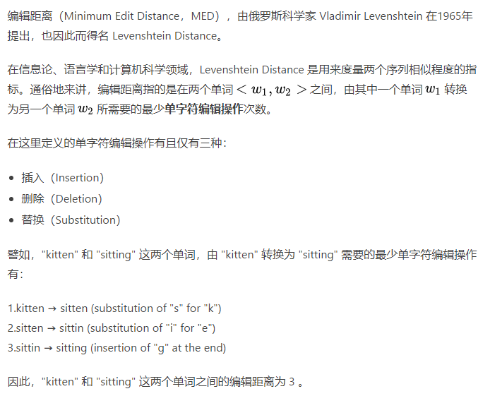
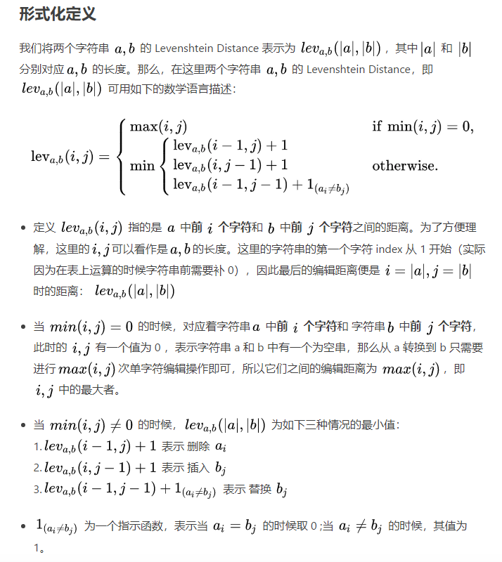
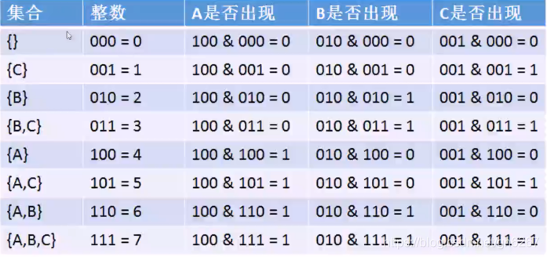
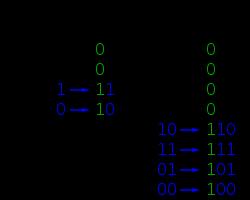

# Leetcode

## 1. Two Sum

解题思路

1. 题目描述：给定无序数组和指定值 target, 返回和为 target 的两个数的下标。
2. HashMap：建立值到下标的映射。复杂度为 O(n)

关联专题

1. **Target Sum**

```C++
// 2020-12-14 submission
// ?/? cases passed
// Runtime: 8 ms, faster than 95.31% of C++ online submissions.
// Memory Usage: 9.4 MB, less than 77.01% of C++ online submissions.
class Solution {
public:
    vector<int> twoSum(vector<int>& nums, int target) {
        unordered_map<int, int> m;
        for (int i = 0; i < nums.size(); i++) {
            if (m.count(target - nums[i])) 
                return vector<int>{m[target - nums[i]], i};
            m[nums[i]] = i;
        }
        return vector<int>{};
    }
};
```

## 2. Add Two Numbers

解题思路

1. 题目描述：需要相加的两个数字通过链表反向存储，结果也需要通过链表反向存储。
2. dummy节点

关联专题

1. **Arithmetic**

```C++
// 2018-04-12 submission
// ?/? cases passed
// Runtime: 28 ms, faster than 90.44% of C++ online submissions.
// Memory Usage: 71.6 MB, less than 33.89% of C++ online submissions.
/**
 * Definition for singly-linked list.
 * struct ListNode {
 *     int val;
 *     ListNode *next;
 *     ListNode(int x) : val(x), next(NULL) {}
 * };
 */
class Solution {
public:
    ListNode* addTwoNumbers(ListNode* l1, ListNode* l2) {
        
        ListNode* dummy = new ListNode(0);
        
        ListNode* cur = dummy;
        int carry = 0;
        while (l1 || l2 || carry) {
            if (l1) carry += l1->val;
            if (l2) carry += l2->val;
            cur->next = new ListNode(carry % 10);
            carry /= 10;
            l1 = l1 ? l1->next : l1;
            l2 = l2 ? l2->next : l2;
            cur = cur->next;
        }
        
        return dummy->next;
    }
};
```

## 3. Longest Substring Without Repeating Characters

解题思路

1. 题目描述：求最长无重复子串
2. 滑动窗口：建立字符到其出现次数或者最后出现位置的映射，并且定义一个变量标记当前滑动窗口的左边界。
3. 对于 char 数据类型的hashmap，可以用 `vector<int> m(256, -1)` 代替。

关联专题

1. **Sliding Window**

```C++
// 2018-04-13 submission
// ?/? cases passed
// Runtime: 8 ms, faster than 88.24% of C++ online submissions.
// Memory Usage: 8.6 MB, less than 64.19% of C++ online submissions.
class Solution {
public:
    int lengthOfLongestSubstring(string s) {
        int max_length = 0;
        int l = 0;
        vector<int> m(256, -1); // unordered_map<char, int> m;
        for (int i = 0; i < s.length(); i++) {
            ++m[s[i]];
            while(m[s[i]] > 1) {
                m[s[l++]]--;
            }
            max_length = max(max_length, i - l + 1);
        }
        return max_length;
    }
};
```

```C++
// 2018-04-13 submission
// ?/? cases passed
// Runtime: 12 ms, faster than 76.61% of C++ online submissions.
// Memory Usage: 8.5 MB, less than 74.50% of C++ online submissions.
class Solution {
public:
    int lengthOfLongestSubstring(string s) {
        int max_length = 0;
        int l = -1;
        vector<int> m(256, -1); // unordered_map<char, int> m;
        for (int i = 0; i < s.length(); i++) {
            if (m[s[i]] >= 0) l = max(l, m[s[i]]);
            m[s[i]] = i;
            max_length = max(max_length, i - l);
        }
        return max_length;
    }
};
```

## 4. Median of Two Sorted Arrays

解题思路

1. 二分法: 转化为找第 K 个数字，中位数即 (m + n + 1) / 2 和 (m + n + 2) / 2 的平均数。在 nums1 和 nums2 中查找第 K/2 个元素，注意这里由于两个数组的长度不定，所以有可能某个数组没有第 K/2 个数字，所以需要先 check 一下，数组中到底存不存在第 K/2 个数字，如果存在就取出来，否则就赋值上一个整型最大值（目的是要在 nums1 或者 nums2 中先淘汰 K/2 个较小的数字，判断的依据就是看 midVal1 和 midVal2 谁更小，但如果某个数组的个数都不到 K/2 个，自然无法淘汰，所以将其对应的 midVal 值设为整型最大值，以保证其不会被淘汰），若某个数组没有第 K/2 个数字，则淘汰另一个数组的前 K/2 个数字即可。

边界条件

1. 另外一个数组比本数组的所有数字都大

```C++
// Runtime: 31 ms, faster than 59.38% of C++ online submissions.
// Memory Usage: 89.1 MB, less than 97.25% of C++ online submissions.
class Solution {
public:
    double findMedianSortedArrays(vector<int>& nums1, vector<int>& nums2) {
        int m = nums1.size(), n = nums2.size();
        int mid1 = (m + n + 1) / 2, mid2 = (m + n + 2) / 2;
        return (findKthNumber(nums1, nums2, 0, 0, mid1) + findKthNumber(nums1, nums2, 0, 0, mid2)) / 2.0;
    }
    
    int findKthNumber(vector<int>& nums1, vector<int>& nums2, int i, int j, int k) {
        if (i >= nums1.size()) return nums2[j + k - 1];
        if (j >= nums2.size()) return nums1[i + k - 1];
        if (k == 1) return min(nums1[i], nums2[j]);
        int midVal1 = (i + k / 2 - 1 < nums1.size()) ? nums1[i + k / 2 - 1] : INT_MAX;
        int midVal2 = (j + k / 2 - 1 < nums2.size()) ? nums2[j + k / 2 - 1] : INT_MAX;
        if (midVal1 < midVal2) {
            return findKthNumber(nums1, nums2, i + k / 2, j, k - k / 2);
        } else {
            return findKthNumber(nums1, nums2, i, j + k / 2, k - k / 2);
        }
    }
};
```

## 5. Longest Palindromic Substring

解题思路

1. 马拉车算法

```C++
// Runtime: 8 ms, faster than 95.79% of C++ online submissions.
// Memory Usage: 9.1 MB, less than 61.47% of C++ online submissions.
class Solution {
public:
    string longestPalindrome(string s) {
        string str = "^#";
        for (char c : s) {
            str.append(1, c);
            str.append(1, '#');
        }
        str.append(1, '$'); // 为了避免之后的越界比较
        
        int n = str.length();
        vector<int> vec(n, 0);
        int C = 0, R = 0;
        for (int i = 1; i < n-1; i++) {
            if (i < R) vec[i] = min(vec[2*C-i], R-i);
            while (str[i+vec[i]+1] == str[i-vec[i]-1])
                ++vec[i];
            if (i + vec[i] > R) {
                C = i;
                R = i + vec[i];
            }
        };
        
        auto max_it = max_element(vec.begin(), vec.end());
        int idx = (max_it-vec.begin()-*max_it) / 2;
        int len = *max_it;
        string res = s.substr(idx, len);
        return res;
    }
};
```

## 6. ZigZag Conversion

```C++
// Runtime: 15 ms, faster than 41.31% of C++ online submissions.
// Memory Usage: 8.1 MB, less than 96.26% of C++ online submissions.
class Solution {
public:
    string convert(string s, int numRows) {

        if (numRows == 1) return s;

        string ret;
        int n = s.size();
        int cycleLen = 2 * numRows - 2;

        for (int i = 0; i < numRows; i++) {
            for (int j = 0; j + i < n; j += cycleLen) {
                ret += s[j + i];
                if (i != 0 && i != numRows - 1 && j + cycleLen - i < n)
                    ret += s[j + cycleLen - i];
            }
        }
        return ret;
    }
};
```

## 9. Palindrome Number

```C++
class Solution {
public:
    bool isPalindrome(int x) {
        if (x < 0) return false;
        int div = 1;
        while (x / div >= 10) div *= 10;
        while (x > 0) {
            int left = x / div;
            int right = x % 10;
            if (left != right) return false;
            x = (x % div) / 10;
            div /= 100;
        }
        return true;
    }
};
```

## 10. Regular Expression Matching

解题思路

1. 正则匹配：(1) sp 和 pp 都到了末尾，表示匹配结束 (2) 如果 p[pp+1] 为 *，

```C++
// Runtime: 24 ms, faster than 23.92% of C++ online submissions.
// Memory Usage: 6.1 MB, less than 97.79% of C++ online submissions.
class Solution {
public:
    bool isMatch(string s, string p) {
        return helper(s, p, 0, 0);
    }
    
    bool helper(string& s, string& p, int sp, int pp) {
        if(sp == s.size() && pp == p.size()) return true;
        if(pp+1 < p.size() && p[pp+1] == '*') {
            if(sp < s.size() && (p[pp] == '.' || p[pp]==s[sp])) {
                if(helper(s, p, sp+1, pp)) return true;
            }
            return helper(s, p, sp, pp+2);
        }
        if(sp < s.size() && (p[pp] == '.' || p[pp] == s[sp])) return helper(s, p, sp+1, pp+1);
        else return false;
    }
};
```

## 11. Container With Most Water

```C++
// Runtime: 80 ms, faster than 25.22% of C++ online submissions.
// Memory Usage: 58.9 MB, less than 30.39% of C++ online submissions.
class Solution {
public:
    int maxArea(vector<int>& height) {
        int maxValue = 0;
        int l = 0, r = (int)height.size()-1;
        while (l < r) {
            int h = min(height[l], height[r]);
            maxValue = max(maxValue, h * (r - l));
            while (l < r && h >= height[l]) ++l;
            while (l < r && h >= height[r]) --r;
        }
        return maxValue;
    }
};
```

## 12. Integer to Roman ($$$)
## 13. Roman to Integer ($$$)

## 14. Longest Common Prefix

解题思路:

1. 给输入字符串数组排序，有共同字母多的两个字符串会被排到一起，所以只需要找首尾字母串的共同前缀即可。为了防止溢出错误，只遍历而这种较短的那个的长度，找出共同前缀返回即可。

```C++
// Runtime: 4 ms, faster than 72.48% of C++ online submissions.
// Memory Usage: 9.3 MB, less than 43.57% of C++ online submissions.
class Solution {
public:
    string longestCommonPrefix(vector<string>& strs) {
        if (strs.empty()) return "";
        sort(strs.begin(), strs.end());
        int i = 0, len = min(strs[0].size(), strs.back().size());
        while (i < len && strs[0][i] == strs.back()[i]) ++i;
        return strs[0].substr(0, i);
    }
};
```

## 15. 3Sum

```C++
// Runtime: 76 ms, faster than 66.86% of C++ online submissions.
// Memory Usage: 20 MB, less than 58.46% of C++ online submissions.
class Solution {
public:
    vector<vector<int>> threeSum(vector<int>& nums) {
        vector<vector<int>> res;
        if(nums.size() <= 0) return res;
        sort(nums.begin(), nums.end());
        int l_val = 0, r_val = 0, sum = 0;
        for(int i = 0; i < (int)nums.size()-2; i++) {
            if(nums[i] > 0) break;
            if(i > 0 && nums[i] == nums[i-1]) continue;
            for(int l=i+1, r=(int)nums.size()-1; l < r;) {
                l_val = nums[l]; r_val = nums[r];
                sum = nums[l] + nums[r] + nums[i];
                if(sum == 0) res.push_back({nums[i], nums[l], nums[r]});
                if(sum >= 0)  while(l < r && nums[--r] == r_val);
                if(sum <= 0)  while(l < r && nums[++l] == l_val);
            }
        }
        return res;
    }
};
```

## 16. 3Sum Closest

```C++
// Runtime: 4 ms, faster than 97.67% of C++ online submissions.
// Memory Usage: 9.8 MB, less than 88.84% of C++ online submissions.
class Solution {
public:
    int threeSumClosest(vector<int>& nums, int target) {
        int closestVal = nums[0]+nums[1]+nums[2];
        sort(nums.begin(), nums.end());
        for(int i = 0; i < nums.size()-2; i++) {
            int rest = nums[i];
            if(i > 0 && nums[i] == nums[i-1]) continue;
            for(int left=i+1, right=nums.size()-1; left<right;) {
                int curr_sum = nums[left] + nums[right] + rest;
                if(curr_sum == target) return target;
                if(curr_sum > target) right--;
                if(curr_sum < target) left++;
                if(abs(target-curr_sum) < abs(target-closestVal)) closestVal=curr_sum;
            }
        }
        return closestVal;
    }
};
```

## 17. Letter Combinations of a Phone Number

```C++
// Runtime: 0 ms, faster than 100.00% of C++ online submissions.
// Memory Usage: 6.5 MB, less than 84.70% of C++ online submissions.
class Solution {
public:
    
    string prefix[10] = {"", "", "abc", "def", "ghi", "jkl", "mno", "pqrs", "tuv", "wxyz"};
    
    vector<string> letterCombinations(string digits) {
        queue<string> q;
        if (digits.length() > 0) q.push("");
        for (char digit : digits) {
            for (int q_size = q.size(); q_size > 0; q_size--) {
                string cur = q.front(); q.pop();
                for (char c : prefix[digit-'0']) {
                    q.push(cur + string(1, c));
                }
            }
        }
        
        vector<string> res;
        while (!q.empty()) {
            res.push_back(q.front());
            q.pop();
        }
        return res;
    }
};
```

## 19. Remove Nth Node From End of List

解题思路

1. BFS

```C++
// 2018-08-05 submission
// ?/? cases passed
// Runtime: 4 ms, faster than 80.26% of C++ online submissions.
// Memory Usage: 10.7 MB, less than 57.60% of C++ online submissions.
class Solution {
public:
    ListNode* removeNthFromEnd(ListNode* head, int n) {
        return helper(head, n);
    }
    
    ListNode* helper(ListNode* curr, int& limit) {
        if(!curr) return NULL;
        curr->next = helper(curr->next, limit);
        --limit;
        if(limit != 0) return curr;
        else return curr->next;
    }
};
```

## 20. Valid Parentheses

解题思路

1. 栈: 开始遍历输入字符串，如果当前字符为左半边括号时，则将其压入栈中，如果遇到右半边括号时，若此时栈为空，则直接返回 false，如不为空，则取出栈顶元素，若为对应的左半边括号，则继续循环，反之返回 false

```C++
// Runtime: 0 ms, faster than 100.00% of C++ online submissions.
// Memory Usage: 6.3 MB, less than 64.43% of C++ online submissions.
class Solution {
public:
    bool isValid(string s) {
        stack<char> stk;
        for(int i = 0; i < s.size(); i++) {
            if(s[i]=='(' || s[i]=='[' || s[i]=='{') stk.push(s[i]);
            else if(s[i] == ')') {
                if(!stk.empty() && stk.top() == '(') stk.pop();
                else return false;
            }
            else if(s[i] == ']') {
                if(!stk.empty() && stk.top() == '[') stk.pop();
                else return false;
            }
            else if(s[i] == '}') {
                if(!stk.empty() && stk.top() == '{') stk.pop();
                else return false;
            }
        }
        if(stk.empty()) return true;
        else return false;
    }
};
```

## 21. Merge Two Sorted Lists

```C++
// 2020-06-28 submission
// ?/? cases passed
// Runtime: 12 ms, faster than 29.96% of C++ online submissions.
// Memory Usage: 15 MB, less than 5.72% of C++ online submissions.
/**
 * Definition for singly-linked list.
 * struct ListNode {
 *     int val;
 *     ListNode *next;
 *     ListNode(int x) : val(x), next(NULL) {}
 * };
 */
class Solution {
public:
    ListNode* mergeTwoLists(ListNode* l1, ListNode* l2) {
        if (!l1 && !l2) return nullptr;
        ListNode* dummy = new ListNode(0), *cur = dummy;
        int val1 = 0, val2 = 0;
        while (l1 || l2) {
            val1 = l1 ? l1->val : INT_MAX;
            val2 = l2 ? l2->val : INT_MAX;
            if (val1 <= val2) {
                cur->next = new ListNode(val1);
                l1 = l1->next;
            }
            else {
                cur->next = new ListNode(val2);
                l2 = l2->next;
            }
            cur = cur->next;
        }
        return dummy->next;
    }
};
```

## 22. Generate Parentheses

```C++
// Runtime: 4 ms, faster than 73.69% of C++ online submissions.
// Memory Usage: 7.2 MB, less than 95.80% of C++ online submissions.
class Solution {
public:
    vector<string> generateParenthesis(int n) {
        vector<string> res;
        string cur = "";
        int lp = n, rp = n;
        helper(res, cur, lp, rp);
        return res;
    }
    
    void helper(vector<string>& res, string cur, int lp, int rp) {
        if (lp == 0) {
            res.push_back(cur + string(rp-lp, ')'));
            return;
        }
        helper(res, cur + "(", lp-1, rp);
        if (lp < rp) helper(res, cur + ")", lp, rp-1);
    }
};
```

## 23. Merge k Sorted Lists

```C++
// 2020-06-28 submission
// ?/? cases passed
// Runtime: 24 ms, faster than 59.80% of C++ online submissions.
// Memory Usage: 13.9 MB, less than 27.89% of C++ online submissions.
/**
 * Definition for singly-linked list.
 * struct ListNode {
 *     int val;
 *     ListNode *next;
 *     ListNode(int x) : val(x), next(NULL) {}
 * };
 */
class Solution {
public:
    ListNode* mergeKLists(vector<ListNode*>& lists) {
        auto cmp = [](ListNode*& a, ListNode*& b) {
            return a->val > b->val;
        };
        priority_queue<ListNode*, vector<ListNode*>, decltype(cmp) > q(cmp);
        for (auto node : lists) {
            if (node) q.push(node);
        }
        ListNode *dummy = new ListNode(-1), *cur = dummy;
        while (!q.empty()) {
            auto t = q.top(); q.pop();
            cur->next = t;
            cur = cur->next;
            if (cur->next) q.push(cur->next);
        }
        return dummy->next;
    }
};
```

## 24. Swap Nodes in Pairs

```C++
// 2020-06-28 submission
// ?/? cases passed
// Runtime: 0 ms, faster than 100.00% of C++ online submissions.
// Memory Usage: 7.6 MB, less than 45.58% of C++ online submissions.
/**
 * Definition for singly-linked list.
 * struct ListNode {
 *     int val;
 *     ListNode *next;
 *     ListNode(int x) : val(x), next(NULL) {}
 * };
 */
class Solution {
public:
    ListNode* swapPairs(ListNode* head) {
        if(!head || !head->next) return head;
        ListNode* curr = head->next;
        head->next = swapPairs(curr->next);
        curr->next = head;
        return curr;
    }
};
```

## 25. Reverse Nodes in k-Group

```C++
// 2020-06-28 submission
// ?/? cases passed
// Runtime: 12 ms, faster than 90.02% of C++ online submissions.
// Memory Usage: 11.5 MB, less than 61.58% of C++ online submissions.
/**
 * Definition for singly-linked list.
 * struct ListNode {
 *     int val;
 *     ListNode *next;
 *     ListNode(int x) : val(x), next(NULL) {}
 * };
 */
class Solution {
public:
    ListNode* reverseKGroup(ListNode* head, int k) {
        ListNode *dummy = new ListNode(-1), *pre = dummy, *cur = pre;
        dummy->next = head;
        int num = 0;
        while (cur = cur->next) ++num;
        while (num >= k) {
            cur = pre->next;
            for (int i = 1; i < k; ++i) {
                ListNode *t = cur->next;
                cur->next = t->next;
                t->next = pre->next;
                pre->next = t;
            }
            pre = cur;
            num -= k;
        }
        return dummy->next;
    }
};
```

## 26. Remove Duplicates from Sorted Array

解题思路

1. 给定一个排序数组，就地删除重复项，以便每个元素只出现一次，并返回新长度

```C++
class Solution {
public:
    int removeDuplicates(vector<int>& nums) {
        int pre = 0, cur = 0, n = nums.size();
        while (cur < n) {
            if (nums[pre] == nums[cur]) ++cur;
            else nums[++pre] = nums[cur++];
        }
        return nums.empty() ? 0 : (pre + 1);
    }
};
```

## 28. Implement strStr()

解题思路

1. 暴力求解即可

边界条件：

1. 注意 haystack 或者 needle 长度为0的情况
2. 注意 haystack 长度比 needle 小的情况  

```C++
// 2020-06-28 submission
// ?/? cases passed
// Runtime: 4 ms, faster than 98.77% of C++ online submissions
// Memory Usage: 6.9 MB, less than 53.41% of C++ online submissions
class Solution {
public:
    int strStr(string haystack, string needle) {
        if(needle.length() <= 0) return 0;
        if(haystack.length() < needle.length()) return -1;
        for(int i = 0; i <= haystack.length()-needle.length(); i++) {
            if(judge(haystack,  needle, i))
                return i;
        }
        return -1;
    }

    bool judge(string& haystack, string& needle, int cur_pivot) {
        int size = needle.length();
        for(int i = 0; i < size; i++) {
            if (cur_pivot + i >= haystack.length()) return false;
        }
        return true;
    }
};
```

1.  Divide Two Integers
（1）不准使用乘除幂运算的情况下，都要使用位操作
（2）去除符号后再做运算，结果再加上符号
（3）运算过程中可能会发生溢出，要用long表示
（3）边界条件：被除数是INT_MAX，除数是INT_MIN
（4）边界条件：被除数是0
// 2020-07-04 submission
// ?/? cases passed
// Runtime: 4 ms, faster than 66.28% of C++ online submissions
// Memory Usage: 5.9 MB, less than 75.15% of C++ online submissions
class Solution {
public:
    int divide(int dividend, int divisor) {
        if(INT_MIN == dividend && -1 == divisor) return INT_MAX;
        
        long x = abs(dividend), y = abs(div isor);
        bool minus = (dividend<0 && divisor>0) || (dividend>0 && divisor<0);
        long accum = 0;
        while(x >= y) {
            int i = 1;
            for (; y<<i <= x; i++);
            i--;
            x -= (y<<i);
            accum += (1<<i);
            // cout << x << " " << y << endl;
        }
        if(minus) return -accum;
        return accum;
    }
};

30. Substring with Concatenation of All Words
（1）解题思路：先用check_freq存储单词表的频率，然后词遍历字符串。词遍历是先遍历0,4,8,12,...，再遍历1,5,9,13,...，再遍历2,6,10,14...。词遍历过程中要维护一个哈希表word_freq表示当前匹配的单词数量，还有维护一个左边界表示当前匹配的最左位置。当当前位置减去左边界等于总长度而且维护的哈希表满足时，说明左边界为所需要的结果之一。
s.substr(pos,n)：若pos的值超过了string的大小，则substr函数会抛出一个out_of_range异常；若pos+n的值超过了string的大小，则substr会调整n的值。
将map改为unordered_map可以有效提高速度
边界条件：待选单词可能会重复（两个以上同样的词），建议先用一个hashmap存储单词表的频率
边界条件：单词表为空
边界条件：待选单词长度为0
边界条件：查找字符串长度为0

// 2020-07-06 submission
// ?/? cases passed
// Runtime: 1044 ms, faster than 20.74% of C++ online submissions
// Memory Usage: 16.7 MB, less than 77.82% of C++ online submissions
```C++ code
class Solution {
public:
    vector<int> findSubstring(string s, vector<string>& words) {
        vector<int> ret_vec;
        if(words.size() <= 0) return ret_vec;
        if(words[0].size() <= 0) {
            for(int i = 0; i <= s.size(); i++) {
                ret_vec.push_back(i);
            }
            return ret_vec;
        }
        int count = words.size(); // Count of words
        int len = words[0].size(); // Length of word
        unordered_map<string, int> word_freq, check_freq;
        for (int x = 0; x < words.size(); x++) {
            if (check_freq.find(words[x]) == check_freq.end())
                check_freq[words[x]] = 0;
            check_freq[words[x]]++;
        }
                
        
        for (int i = 0; i < len; i++) {
            for (int x = 0; x < words.size(); x++)
                word_freq[words[x]] = 0;
            int left_pivot = i;
            for (int pivot = i; pivot < s.size(); pivot += len) {
                string to_compare = s.substr(pivot, len);
                if (word_freq.find(to_compare) == word_freq.end()) {
                    for (int x = 0; x < words.size(); x++)
                        word_freq[words[x]] = 0;
                    left_pivot = pivot + len;
                }
                else {
                    word_freq[to_compare]++;
                    while (word_freq[to_compare] > check_freq[to_compare]) {
                        word_freq[s.substr(left_pivot, len)]--;
                        left_pivot += len;
                    }
                    if (word_freq[to_compare] == check_freq[to_compare] && pivot+len-left_pivot == count * len) {
                        ret_vec.push_back(left_pivot);
                        word_freq[s.substr(left_pivot, len)]--;
                        left_pivot += len;
                    }
                }
                // cout << i << " " << pivot << " " << left_pivot << endl;
            }
        }
        return ret_vec;
    }
};
```

## 32. Longest Valid Parentheses

解题思路

1. 题目描述：求最长有效括号的长度
2. 动态规划，每个位置存 包括当前位置的有效最长长度。如果当前位置是 ')'，检查前一位的最长长度 k，检查当前位置减去 k+1 的位置是否为 '('，当前位置为 k+2，并且还要加上减去 k+2 的位置的最长长度

```C++
// 2021-04-03 submission
// ?/? cases passed
// Runtime: 0 ms, faster than 100.00% of C++ online submissions.
// Memory Usage: 7.4 MB, less than 21.88% of C++ online submissions.
class Solution {
public:
    int longestValidParentheses(string s) {
        int res = 0;
        vector<int> vec(s.length()+1, 0);
        for(int i = 1; i <= s.length(); i++) {
            if(s[i-1] == ')' && i-1-vec[i-1]-1 >= 0 && s[i-1-vec[i-1]-1] == '(') {
                vec[i] = vec[i-1] + 2;
                vec[i] += vec[i-vec[i]]; 
                res = max(res, vec[i]);
            }
        }
        return res;
    }
};
```

## 42. Trapping Rain Water

解题思路

1. 每个位置能接的雨水量是：当前位置左边最高的数与右边最高的数的最小值减去当前位置的数（注意不能为负数）。

边界条件

1. 高度列表长度小于3

```C++
// 2020-07-14 submission
// ?/? cases passed
// Runtime: 4 ms, faster than 88.40% of C++ online submissions.
// Memory Usage: 14.1 MB, less than 71.67% of C++ online submissions.
class Solution {
public:
    int trap(vector<int>& height) {
        vector<int> vec(height.size(), 0);
        long long res = 0;
        
        int maxVal = 0;
        for (int i = 0; i < (int)height.size(); i++) {
            maxVal = max(maxVal, height[i]);
            vec[i] = maxVal;
        }
        
        maxVal = 0;
        for (int i = (int)vec.size()-1; i >= 0; i--) {
            maxVal = max(maxVal, height[i]);
            res += (min(maxVal, vec[i]) - height[i]);
        }
        return res;
    }
};
```

## 44. Wildcard Matching

解题思路

1. 动态规划
- dp[i][j] 表示 p 前 i 个字符 和 s 前 j 个字符是否匹配
- if p[i-1] == s[j-1] or p[i-1] == '?', dp[i][j]=dp[i-1][j-1]
- if p[i-1] == '*', dp[i][j]=dp[i-1][j] or dp[i][j-1]

边界条件：

1. p 和 s 长度均为 0 时，结果为true
2. s 长度为 0，p 为只由 * 组成的字符串，结果为 true

```C++
// 2020-09-14 submission
// ?/? cases passed
// Runtime: 176 ms, faster than 40.96% of C++ online submissions.
// Memory Usage: 6.6 MB, less than 89.86% of C++ online submissions.
class Solution {
public:
    bool isMatch(string s, string p) {
        vector<bool> dp(s.length()+1, false);
        
        dp[0] = true;
        for (int i = 1; i <= p.length(); i++) {
            bool last_valid = dp[0];
            dp[0] = (dp[0] && p[i-1] == '*');
            for (int j = 1; j <= s.length(); j++) {
                bool temp = dp[j];
                if (p[i-1] == '*') dp[j] = dp[j-1] || dp[j];
                else if (p[i-1] == '?') dp[j] = last_valid;
                else dp[j] = (last_valid && s[j-1] == p[i-1]);
                last_valid = temp;
                // cout << s[j-1] << " " << p[i-1] << " " << dp[j] << endl;
            }
        }
        
        return dp[s.length()];
    }
};
```

## 45. Jump Game II

解题思路

1. 贪心算法：cur 是当前能到达的最远位置，last 是上一步能到达的最远位置，遍历数组。判断如果当前位置到达了 last，即上一步能到达的最远位置，说明需要再跳一次。判断如果 cur 到达末尾

```C++
// 2021-03-11 submission
// ?/? cases passed
// Runtime: 0 ms, faster than 100.00% of C++ online submissions.
// Memory Usage: 8.1 MB, less than 100.00% of C++ online submissions.
class Solution {
public:
    int jump(vector<int>& nums) {
        int res = 0;
        int pre = 0, cur = 0;
        for (int i = 0; i < nums.size(); i++) {
            cur = max(cur, i + nums[i]);
            if (i == pre) {
                ++res;
                pre = cur;
                if (cur >= nums.size() - 1) break;
            }
        }
        return res;
    }
};
```

## 48. Rotate Image

解题思路

1. 对于 n 是偶数的情况，只需要将四个对角的元素进行调换即可；如果 n 是奇数，这中间有个十字会重复移动，所以要单独处理。

```C++
// 2019-04-16 submission
// ?/? cases passed
// Runtime: 4 ms, faster than 59.23% of C++ online submissions.
// Memory Usage: 7.1 MB, less than 67.77% of C++ online submissions.
class Solution {
public:
    void rotate(vector<vector<int>>& matrix) {
        int n = matrix.size();
        int temp = 0;
        for(int x = 0; x < n/2 + (n&1); x++) {
            for(int y = 0; y < n/2; y++) {
                temp = matrix[n-1-y][x];
                matrix[n-1-y][x] = matrix[n-1-x][n-1-y];
                matrix[n-1-x][n-1-y] = matrix[y][n-1-x];
                matrix[y][n-1-x] = matrix[x][y];
                matrix[x][y] = temp;
            }
        }
    }
};
```

## 49. Group Anagrams

```C++
// Runtime: 28 ms, faster than 88.94% of C++ online submissions.
// Memory Usage: 20.5 MB, less than 51.98% of C++ online submissions.
class Solution {
public:
    vector<vector<string>> groupAnagrams(vector<string>& strs) {
        unordered_map<string, vector<string> > m;
        for (string str : strs) {
            string cur = str;
            sort(cur.begin(), cur.end());
            m[cur].push_back(str);
        }
        vector<vector<string>> res;
        for (auto it : m) {
            res.push_back(it.second);
        }
        return res;
    }
};
```

## 50. Pow(x, n)

解题思路

1. 递归回溯

```C++
// 2018-07-24 submission
// ?/? cases passed
// Runtime: 0 ms, faster than 100.00% of C++ online submissions.
// Memory Usage: 6.2 MB, less than 63.60% of C++ online submissions.
class Solution {
public:
    double myPow(double x, int n) {
        if(n == 0) return 1;
        if(n == 1) return x;
        if(n == -1) return 1 / x;
        double temp = myPow(x, n/2);
        if(n % 2 != 0) return temp * temp * myPow(x, n%2);
        else return temp * temp;
    }
};
```

## 51. N-Queens

返回所有解法

```C++
// 2019-04-14 submission
// ?/? cases passed
// Runtime: 8 ms, faster than 63.24% of C++ online submissions.
// Memory Usage: 7.4 MB, less than 61.04% of C++ online submissions.
class Solution {
public:
    vector<vector<string>> solveNQueens(int n) {
        vector<vector<int>> result;
        vector<vector<string>> chess_results;
        vector<int> temp(n, 0);
        if(n == 1) {
            chess_results.push_back(vector<string>{"Q"});
            return chess_results;
        }
        else if(n >= 4) {
            place(0, n, temp, result);
            print_chess(result, chess_results);
        }
        return chess_results;
    }
    
    bool find(int row, int col, vector<int>& curr) {
        for(int i = 0; i < row; i++) {
            if(curr[i]==col || abs(i-row)==abs(col-curr[i])) return false;
        }
        return true;
    }
    
    void place(int k, int n, vector<int>& curr, vector<vector<int>>& result) {
        for(int i = 0; i < n; i++) {
            if(find(k, i, curr)) {
                curr[k] = i;
                if(k == n-1) result.push_back(curr);
                else place(k+1, n, curr, result);
            }
        }
    }
    
    void print_chess(vector<vector<int>>& result, vector<vector<string>>& chess_results) {
        int col = 0;
        string temp = "";
        for(int i = 0; i < result.size(); i++) {
            int n = result[i].size();
            chess_results.push_back(vector<string>{});
            for(int j = 0; j < n; j++) {
                col = result[i][j];
                temp = "";
                for(int k = 0; k < col; k++) temp += '.';
                temp += 'Q';
                for(int k = col+1; k < n; k++) temp += '.';
                chess_results[i].push_back(temp);
            }
        }
    }
};
```

## 52. N-Queens II

返回解法数量

```C++
// 2019-04-14 submission
// ?/? cases passed
// Runtime: 4 ms, faster than 82.73% of C++ online submissions.
// Memory Usage: 6 MB, less than 90.16% of C++ online submissions.
class Solution {
public:
    int totalNQueens(int n) {
        int success = 0;
        vector<int> temp(n, 0);
        place(0, n, temp, success);
        return success;
    }
    
    bool find(int row, int col, vector<int>& curr) {
        for(int i = 0; i < row; i++) {
            if(curr[i] == col || abs(i-row) == abs(curr[i]-col))
                return false;
        }
        return true;
    }
    
    void place(int k, int n, vector<int>& curr, int &success) {
        for(int i = 0; i < n; i++) {
            if(find(k, i, curr)) {
                curr[k] = i;
                if(k == n-1) success++;
                else place(k+1, n, curr, success);
            }
        }
    }
    
};
```

## 53. Maximum Subarray

最大连续子数组

```C++
class Solution {
public:
    int maxSubArray(vector<int>& nums) {
        int maxSum = INT_MIN;
        int currSum = 0;
        for(auto num : nums) {
            if(currSum >= 0) currSum += num;
            else currSum = num;
            maxSum = max(currSum, maxSum);
        }
        return maxSum;
    }
};
```

## 54. Spiral Matrix

打印螺旋数组

```C++
class Solution {
public:
    vector<int> spiralOrder(vector<vector<int>>& matrix) {
        if (matrix.empty() || matrix[0].empty()) return vector<int>{};
        int rows = matrix.size(), cols = matrix[0].size();
        vector<int> traj;
        int left = 0, right = cols - 1, top = 0, bottom = rows - 1;
        while (traj.size() < rows * cols) {
            for (int i = left; i <= right; i++) {
                traj.push_back(matrix[top][i]);
            }
            for (int i = top+1; i <= bottom; i++) {
                traj.push_back(matrix[i][right]);
            }
            for (int i = right-1; i >= left && top < bottom; i--) {
                traj.push_back(matrix[bottom][i]);
            }
            for (int i = bottom-1; i > top && left < right; i--) {
                traj.push_back(matrix[i][left]);
            }
            ++left;--right;++top;--bottom;
        }
        return traj;
    }
};
```

## 55. Jump Game

解题思路

1. 贪心算法：用一个变量标记当前能达到的最远距离。遍历数组，若超过超远距离或者最远距离已经覆盖数组尾退出循环，否则更新最远距离。

```C++
// 2018-07-26 submission
// ?/? cases passed
// Runtime: 12 ms, faster than 98.54% of C++ online submissions.
// Memory Usage: 13 MB, less than 95.54% of C++ online submissions.
class Solution {
public:
    bool canJump(vector<int>& nums) {
        int maxIdx = 0;
        for(int i = 0; i < nums.size(); i++) {
            if(i > maxIdx || maxIdx >= nums.size()-1) break;
            maxIdx = max(maxIdx, i+nums[i]);
        }
        return maxIdx >= nums.size()-1;
    }
};
```

## 56. Merge Intervals

解题思路

1. 首先给区间集排序，需要定义自己的 comparator，才能用 sort 来排序。（其实直接对二维向量调用sort()函数，二维向量就会按第一列元素排序）。按照 start 的值从小到大来排序，排完序开始合并，首先把第一个区间存入结果中，然后从第二个开始遍历区间集，如果结果中最后一个区间和遍历的当前区间无重叠，直接将当前区间存入结果中，如果有重叠，将结果中最后一个区间的 end 值更新为结果中最后一个区间的 end 和当前 end 值之中的较大值，然后继续遍历区间集，以此类推可以得到最终结果

```C++
// 2019-05-09 submission
// ?/? cases passed
// Runtime: 32 ms, faster than 94.27% of C++ online submissions.
// Memory Usage: 14.5 MB, less than 76.55% of C++ online submissions.
class Solution {
public:
    static bool cmp(const vector<int> &v1, const vector<int> &v2) {
        // 自写 sort 函数需要 引用参数 防止大量拷贝 影响效率
        return v1[0] < v2[0];
    }

    vector<vector<int>> merge(vector<vector<int>>& intervals) {
        vector<vector<int>> result;
        if(intervals.empty()) return result;
        sort(intervals.begin(), intervals.end(), cmp);
        int i_min=intervals[0][0], i_max=intervals[0][1];
        for(int i = 1; i < intervals.size(); i++) {
            if(i_max >= intervals[i][0]) i_max = max(i_max, intervals[i][1]);
            else {
                result.push_back(vector<int>{i_min, i_max});
                i_min = intervals[i][0];
                i_max = intervals[i][1];
            }
        }
        result.push_back(vector<int>{i_min, i_max});
        return result;
    }
};
```

```C++
// 2020-11-19 submission
// ?/? cases passed
// Runtime: 44 ms, faster than 59.45% of C++ online submissions.
// Memory Usage: 14.7 MB, less than 54.25% of C++ online submissions.
class Solution {
public:
    vector<vector<int>> merge(vector<vector<int>>& intervals) {
        vector<vector<int>> result;
        if(intervals.empty()) return result;
        sort(intervals.begin(), intervals.end());
        result.push_back(intervals[0]);
        for(int i = 1; i < intervals.size(); i++) {
            if (intervals[i][0] <= result.back()[1]) 
                result.back()[1] = max(result.back()[1], intervals[i][1]);
            else
                result.push_back(intervals[i]);
        }
        return result;
    }
};
```

## 57. Insert Interval
解题思路：从最左边遍历待插入区间，如果遍历区间右边界小于新区间左边界，将遍历区间加入结果，否则跳出循环。然后正式对交叉的区间进行处理，注意每次处理前都要判断是否重叠（因为有可能出现新区建在最左边和最右边的情况），然后取左边界最小值和右边界最大值作为新区间。不重叠时候跳出循环，将新区间加入结果，最后把剩下的待插入区间遍历完即可，所以有三个阶段。
边界条件：待插列表为空；新区间在最左边或者最右边；插入区间为空（标准程序没有注意到）

// 2020-07-14 submission
// ?/? cases passed
// Runtime: 32 ms, faster than 64.68% of C++ online submissions
// Memory Usage: 17.1 MB, less than 63.69% of C++ online submissions
class Solution {
public:
    vector<vector<int>> insert(vector<vector<int>>& intervals, vector<int>& newInterval) {
        if (newInterval.empty()) return vector<vector<int>>(intervals.begin(), intervals.end());
        vector<vector<int>> res;
        int cnt = intervals.size();
        
        int cur = 0;
        while(cur < cnt) {
            if (intervals[cur][1] < newInterval[0])
                res.push_back(intervals[cur++]);
            else
                break;
        }
        
        vector<int> temp_interval(newInterval.begin(), newInterval.end());
        for (; cur < cnt; cur++) {
            if (judge(temp_interval, intervals[cur])) {
                temp_interval[0] = min(temp_interval[0], intervals[cur][0]);
                temp_interval[1] = max(temp_interval[1], intervals[cur][1]);
            }
            else
                break;
            // cout << "interval " << temp_interval[0] << " " << temp_interval[1] << endl;
        }
        res.push_back(temp_interval);
        
        while(cur < cnt) {
            res.push_back(intervals[cur++]);
        }
        return res;
    }
    
    bool judge(vector<int>& A, vector<int>& B) {
        return (A[1] >= B[0] && A[0] <= B[1]) || (B[1] >= A[0] && B[0] <= A[1]);
    }
};

## 58. Length of Last Word

返回字符串中最后一个单词的长度

```C++
class Solution {
public:
    int lengthOfLastWord(string s) {
        int len = s.length();
        int validNum = 0;
        int index = len - 1;
        while(s[index] == ' ') index--;
        for(; index >= 0; index--) {
            if(isalpha(s[index])) validNum++;
            else break;
        }
        return validNum;
    }
};
```

## 59. Spiral Matrix II

生成螺旋数组

解题思路

1. 可以发现顺时针走法是按照 [ '→', '↓', '←', '↑', ] 的顺序转向，当走出边缘或者碰到已经填上的数字时候就会转向。注意转向函数的书写，和常识不同。

```C++
// 2020-12-08 submission
// ?/? cases passed
// Runtime: 0 ms, faster than 100.00% of C++ online submissions.
// Memory Usage: 7.1 MB, less than 7.66% of C++ online submissions.
class Solution {
public:
    vector<vector<int>> generateMatrix(int n) {
        vector<vector<int>> direction{{0, 1}, {1, 0}, {0, -1}, {-1, 0}};
        vector<vector<int>> res(n, vector<int>(n, 0));
        int di = 0, x = 0, y = -1;
        for (int i = 1; i <= n * n; i++) {
            if (0 > x + direction[di][0] ||
                x + direction[di][0] >= n ||
                0 > y + direction[di][1] || 
                y + direction[di][1] >= n ||
                res[x+direction[di][0]][y + direction[di][1]] != 0)  di = (di + 1) % 4;
            x += direction[di][0]; y += direction[di][1];
            res[x][y] = i;
        }
        return res;
    }
};
```

## 60. Permutation Sequence

全排列中的第 k 个

```C++
// 2019-09-01 submission
// ?/? cases passed
// Runtime: 0 ms, faster than 100.00% of C++ online submissions.
// Memory Usage: 6 MB, less than 78.79% of C++ online submissions.
class Solution {
public:
    string getPermutation(int n, int k) {
        vector<int> frac(n, 1);
        string nums = "123456789";
        string ret = "";
        for(int i = 1; i < n; i++) frac[i] = frac[i-1]*i;
        --k;
        for(int i = n-1; i >= 0; i--) {
            ret += nums[k / frac[i]];
            nums.erase(k / frac[i], 1);
            k %= frac[i];
        }
        return ret;
    }
};
```

## 61. Rotate List

解题思路

1. 旋转链表
2. 遍历整个链表获得链表长度n，然后此时把链表头和尾链接起来，在往后走 n - k%n 个节点就到达新链表的头结点前一个点，这时断开链表

```C++
class Solution {
public:
    ListNode *rotateRight(ListNode *head, int k) {
        if (!head) return NULL;
        int n = 1;
        ListNode *cur = head;
        while (cur->next) {
            ++n;
            cur = cur->next;
        }
        cur->next = head;
        int m = n - k % n;
        for (int i = 0; i < m; ++i) {
            cur = cur->next;
        }
        ListNode *newhead = cur->next;
        cur->next = NULL;
        return newhead;
    }
};
```

## 62. Unique Paths

解题思路

1. 从左上角到右下角，有多少种行走路径

```C++
class Solution {
public:
    int uniquePaths(int m, int n) {
        vector<int> dp(n, 1);
        for (int i = 1; i < m; ++i) {
            for (int j = 1; j < n; ++j) {
                dp[j] += dp[j - 1]; 
            }
        }
        return dp[n - 1];
    }
};
```

## 63. Unique Paths II

解题思路

1. 从左上角到右下角，有多少种行走路径，而且有些位置有障碍物

```C++
class Solution {
public:
    int uniquePathsWithObstacles(vector<vector<int>>& obstacleGrid) {
        if (obstacleGrid.empty() || obstacleGrid[0].empty() || obstacleGrid[0][0] == 1) return 0;
        int m = obstacleGrid.size(), n = obstacleGrid[0].size();
        vector<long> dp(n, 0);
        dp[0] = 1;
        for (int i = 0; i < m; ++i) {
            for (int j = 0; j < n; ++j) {
                if (obstacleGrid[i][j] == 1) dp[j] = 0;
                else if (j > 0) dp[j] += dp[j - 1];
            }
        }
        return dp[n - 1];
    }
};
```

## 64. Minimum Path Sum

```C++
// 2018-07-26 submission
// ?/? cases passed
// Runtime: 8 ms, faster than 82.85% of C++ online submissions.
// Memory Usage: 10 MB, less than 35.59% of C++ online submissions.
class Solution {
public:
    int minPathSum(vector<vector<int>>& grid) {
        if(grid.empty() || grid[0].empty()) return 0;
        int rows = grid.size();
        int cols = grid[0].size();
        vector<vector<int>> record(rows+1, vector<int>(cols+1, INT_MAX));
        
        for (int i = 1; i <= rows; i++) {
            for (int j = 1; j <= cols; j++) {
                if (i == 1 && j == 1) record[i][j] = grid[i-1][j-1];
                else record[i][j] = min(record[i-1][j], record[i][j-1]) + grid[i-1][j-1];
            }
        }
        return record[rows][cols];

    }
};
```

## 65. Valid Number
弱智题目（边界条件不说清楚）
解题思路：状态转移。注意要在字符串后面加一个空格表示结束符，从而使得终结符号只有1个。
边界条件 数字字符串中间不能被空格打断；不能出现两个以上数字字符串；
“1.”是合法的；“.1”合法；“.”不合法；
“+.5”合法；
“0000.1e-0000.00”合法；

// 2020-07-14 submission
// ?/? cases passed
// Runtime: 4 ms, faster than 76.08% of C++ online submissions.
// Memory Usage: 6.1 MB, less than 44.60% of C++ online submissions.

class Solution {
public:
    bool isNumber(string s) {
        int trans[][4] = {
            {2, -1, 1, 3}, // 0
            {2, -1, -1, 3},// 1
            {2, 5, -1, 4}, // 2
            {4, -1, -1, -1},// 3
            {4, 5, -1, -1},// 4
            {7, -1, 6, -1},// 5
            {7, -1, -1, -1},// 6
            {7, -1, -1, -1},//7
            {-1, -1, -1, -1}};//8
        int accepted[] = {2, 4, 7};
        
        s.append(1, ' ');
        int cur = 0;
        for (int i = 0; i < s.length(); i++) {
            if (s[i] == ' ') {
                if (cur == 0 || cur == 8) continue;
                else if (cur == 2 || cur ==4 || cur == 7) cur = 8;
                else cur = -1;;
            }
            else if (s[i] >= '0' && s[i] <= '9') cur = trans[cur][0];
            else if (s[i] == 'e') cur = trans[cur][1];
            else if (s[i] == '+' || s[i] == '-') cur = trans[cur][2];
            else if (s[i] == '.') cur = trans[cur][3];
            else cur = -1;
            if (cur == -1) return false;
        }
        return cur == 8;
    }
};

## 66. Plus One

数字以数组形式存在，+1 返回

```C++
class Solution {
public:
    vector<int> plusOne(vector<int>& digits) {
        vector<int> result;
        int carry = 1;
        for(int i=digits.size()-1; i >= 0; i--) {
            if(carry == 1 && digits[i] == 9) {
                result.push_back(0);
                carry = 1;
            }
            else {
                result.push_back(digits[i]+carry);
                carry = 0;
            }
        }
        if(carry == 1) result.push_back(1);
        reverse(result.begin(), result.end());
        return result;
    }
    
};
```

## 67. Add Binary

给定两个二进制字符串a 和 b，将它们的和作为二进制字符串返回

```C++
class Solution {
public:
    string addBinary(string a, string b) {
        string ret;
        int alen = a.length();
        int blen = b.length();
        int maxlen = max(alen, blen);
        if(alen >= blen) b = string(alen-blen, '0') + b;
        else a = string(blen-alen, '0') + a;
        int carry  = 0;
        for(int i = 1; i <= maxlen; i++) {
            int sum = a[maxlen-i]-'0' + b[maxlen-i]-'0' + carry;
            carry = sum / 2;
            ret = (sum%2==0 ? "0" : "1") + ret;
        }
        if(carry) ret = "1" + ret;
        return ret;
    }
};
```

## 68. Text Justification

解题思路

1. 遍历单词 list, 并维护一个cur_len表示当前收纳的长度（需包含空格）。每读入一个单词有三种情况：  

   + 加入当前单词后，cur_len <= maxWidth，当前单词记录，遍历下一个单词
   + 加入当前单词后，cur_len >= maxWidth 而且当前单词不是最后一个单词。此时将记录的单词串格式化处理。
   + 当前单词是最后一个单词，将记录的单词串格式化处理。（因为最后一行格式特殊）

```C++
// 2020-09-29 submission
// ?/? cases passed
// Runtime: 4 ms, faster than 57.57% of C++ online submissions.
// Memory Usage: 7.6 MB, less than 49.47% of C++ online submissions.
class Solution {
public:
    vector<string> fullJustify(vector<string>& words, int maxWidth) {
        vector<string> res;

        vector<string> cur;
        int cur_len = 0;
        for (int i = 0; i < words.size();) {
            bool flag = (words[i].length() + cur_len <= maxWidth);
            if (flag) {
                cur_len += (words[i].length() + 1);
                cur.push_back(words[i]);
                i++;
            }
            if (!flag && i < words.size()) {
                cur_len = maxWidth-cur_len+cur.size();
                string to_add = cur[0];
                if (cur.size() == 1) to_add.append(cur_len, ' ');
                for (int j = 1; j < cur.size(); j++) {
                    to_add.append(cur_len/(cur.size()-1)+(j<=cur_len%(cur.size()-1)), ' ');
                    to_add.append(cur[j]);
                }
                res.push_back(to_add);
                cur_len = 0;
                cur.clear();
            }
            if (i == words.size()) {
                string to_add = cur[0];
                for (int j = 1; j < cur.size(); j++) {
                    to_add.append(" ");
                    to_add.append(cur[j]);
                }
                to_add.append(maxWidth-to_add.length(), ' ');
                res.push_back(to_add);
            }
        }
        return res;
    }
};
```

## 69. Sqrt(x)

1. 牛顿迭代法：求 $x^2 = n$ 的解，令 $f(x)=x^2-n$，相当于求解 $f(x)=0$ 的解。

```C++
// 2019-05-17 submission
// ?/? cases passed
// Runtime: 0 ms, faster than 100.00% of C++ online submissions.
// Memory Usage: 6.2 MB, less than 89.91% of C++ online submissions.
class Solution {
public:
    int mySqrt(int x) {
        int64_t res = x;
        while (res * res > x) {
            res = (res + x / res) / 2;
        }
        return res;
    }
};
```

1.  Edit Distance

https://www.jianshu.com/p/a617d20162cf




// 2020-09-08 submission
// ?/? cases passed
// Runtime: 12 ms, faster than 83.41% of C++ online submissions.
// Memory Usage: 6.3 MB, less than 97.74% of C++ online submissions.

class Solution {
public:
    int minDistance(string word1, string word2) {
        int c1 = word1.length();
        int c2 = word2.length();
        if (c1 == 0 or c2 == 0) return max(c1, c2);
        
        vector<int> dist(c1 + 1, 0);
        for (int i = 1; i <= c1; i++) {
            dist[i] = i;
        }
        for (int i = 1; i <= c2; i++) {
            int last_valid = dist[0];
            dist[0] = i;
            for (int j = 1; j <= c1; j++) {
                int temp = min(min(dist[j - 1], dist[j]) + 1, last_valid + (word1[j-1] != word2[i-1]));
                last_valid = dist[j];
                dist[j] = temp;
            }
        }
        return dist[c1];
    }
};


## 70. Climbing Stairs

```C++
class Solution {
public:
    int climbStairs(int n) {
        int a = 1, b = 1;
        for(int i = 0; i < n-1; i++) {
            auto temp = b;
            b = a + b;
            a = temp;
        }
        return b;
    }
};
```

## 71. Simplify Path

解题思路

1. 简化路径: "/../" 返回 "/"

```C++
class Solution {
public:
    string simplifyPath(string path) {
        string res, t;
        stringstream ss(path);
        vector<string> v;
        while (getline(ss, t, '/')) {
            if (t == "" || t == ".") continue;
            if (t == ".." && !v.empty()) v.pop_back();
            else if (t != "..") v.push_back(t);
        }
        for (string s : v) res += "/" + s;
        return res.empty() ? "/" : res;
    }
};
```

## 73. Set Matrix Zeroes

解题思路

1. 给定一个矩阵，如果一个元素为 0，则将其整个行和列设置为 0。需求 in-place

```C++
class Solution {
public:
    void setZeroes(vector<vector<int> > &matrix) {
        if (matrix.empty() || matrix[0].empty()) return;
        int m = matrix.size(), n = matrix[0].size();
        bool rowZero = false, colZero = false;
        for (int i = 0; i < m; ++i) {
            if (matrix[i][0] == 0) colZero = true;
        }
        for (int i = 0; i < n; ++i) {
            if (matrix[0][i] == 0) rowZero = true;
        } 
        for (int i = 1; i < m; ++i) {
            for (int j = 1; j < n; ++j) {
                if (matrix[i][j] == 0) {
                    matrix[0][j] = 0;
                    matrix[i][0] = 0;
                }
            }
        }
        for (int i = 1; i < m; ++i) {
            for (int j = 1; j < n; ++j) {
                if (matrix[0][j] == 0 || matrix[i][0] == 0) {
                    matrix[i][j] = 0;
                }
            }
        }
        if (rowZero) {
            for (int i = 0; i < n; ++i) matrix[0][i] = 0;
        }
        if (colZero) {
            for (int i = 0; i < m; ++i) matrix[i][0] = 0;
        }
    }
};
```

## 74. Search a 2D Matrix

搜索 2D 矩阵
每行中的整数从左到右排序。每行的第一个整数大于前一行的最后一个整数。

```C++
class Solution {
public:
    bool searchMatrix(vector<vector<int>>& matrix, int target) {
        if (matrix.empty() || matrix[0].empty()) return false;
        int m = matrix.size(), n = matrix[0].size();
        int left = 0, right = m * n;
        while (left < right) {
            int mid = (left + right) / 2;
            if (matrix[mid / n][mid % n] == target) return true;
            if (matrix[mid / n][mid % n] < target) left = mid + 1;
            else right = mid;
        }
        return false;
    }
};
```

## 75. Sort Colors

```C++
// Runtime: 4 ms, faster than 47.31% of C++ online submissions.
// Memory Usage: 8.3 MB, less than 63.84% of C++ online submissions.
class Solution {
public:
    void sortColors(vector<int>& nums) {
        if(nums.size() < 2) return;
        int l = 0, r = (int)nums.size()-1;
        int pivot = -1;
        while (l < r) {
            while (l < r && nums[l] == 0) l++;
            while (l < r && nums[r] == 2) r--;
            if (nums[l] == 2) swap(nums[l], nums[r]);
            else if (nums[l] == 1) {
                pivot = l;
                while(pivot <= r && nums[pivot] == 1) ++pivot;
                if (pivot <= r) swap(nums[pivot], nums[l]);
                else l = r;
            }
        }
    }
};
```

## 76. Minimum Window Substring

解题思路

1. 滑动窗口。注意可以只用一个哈希表，存储t的频率，当右边界遍历到减1，左边界遍历到加1。另外需要一个计数变量，当频率大于0时（因为非法字符最大频率为0，合法字符最小频率为0）计数变量cnt加1，从而可以判断是否已经包含所有合法字符。

边界条件
1. t长度可能为0（测试样例没有考虑到）

```C++
// 2020-07-17 submission
// ?/? cases passed
// Runtime: 32 ms, faster than 67.64% of C++ online submissions
// Memory Usage: 55.6 MB, less than 5.05% of C++ online submissions
class Solution {
public:
    string minWindow(string s, string t) {
        if(t.length() == 0) return "";
        
        unordered_map<char, int> freq;
        for (int i = 0; i < t.length(); i++) {
            freq[t[i]]++;
        }
        
        int left = 0;
        int cnt = 0;
        string res = "";
        int res_cnt = INT_MAX;
        for (int pivot = 0; pivot < s.length(); pivot++) {
            freq[s[pivot]]--;
            if(freq[s[pivot]] >= 0) cnt++;
            if (cnt == t.length()) {
                while(cnt == t.length()) {
                    freq[s[left]]++;
                    if (freq[s[left]] > 0) cnt--;
                    left++;
                }
                string cur_str = s.substr(left-1, pivot-left+2);
                if (cur_str.length() < res_cnt) {
                    res_cnt = cur_str.length();
                    res = cur_str;
                }
            }
        }
        return res;
    }
};
```

## 77. Combinations

```C++
class Solution {
public:
    vector<vector<int>> combine(int n, int k) {
        vector<vector<int>> res;
        vector<int> out;
        helper(n, k, 1, out, res);
        return res;
    }
    void helper(int n, int k, int level, vector<int>& out, vector<vector<int>>& res) {
        if (out.size() == k) {res.push_back(out); return;}
        for (int i = level; i <= n; ++i) {
            out.push_back(i);
            helper(n, k, i + 1, out, res);
            out.pop_back();
        }
    }
};
```

## 78. Subsets

解题思路

1. 题目描述：找出给定集合的所有子集
2. 递归：DFS深度优先搜索
3. 位操作：数组中所有的数分配一个状态，true 表示这个数在子集中出现，false 表示在子集中不出现，那么对于一个长度为n的数组，每个数字都有出现与不出现两种情况，所以共有 $2^n$ 中情况
   

```C++
// 2019-05-06 submission (DFS)
// Runtime: 0 ms, faster than 100.00% of C++ online submissions.
// Memory Usage: 7.5 MB, less than 7.29% of C++ online submissions.
class Solution {
public:
    vector<vector<int>> subsets(vector<int>& nums) {
        vector<vector<int>> result{vector<int>{}};
        vector<int> temp;
        DFS(nums, temp, result, 0);
        return result;
    }

    void DFS(vector<int>& candidates, vector<int>& curr, vector<vector<int>>& result, int pivot) {
        for(int i = pivot; i < candidates.size(); i++) {
            curr.push_back(candidates[i]);
            result.push_back(curr);
            DFS(candidates, curr, result, i+1);
            curr.pop_back();
        }
    }
};
```

```C++
// 2020-10-26 submission (位操作)
// Runtime: 4 ms, faster than 67.90% of C++ online submissions.
// Memory Usage: 7.5 MB, less than 7.29% of C++ online submissions.
class Solution {
public:
    vector<vector<int>> subsets(vector<int>& nums) {
        vector<vector<int>> res;
        int count = 1 << nums.size();
        for (int i = 0; i < count; i++) {
            vector<int> vec;
            for (int j = 0; j < nums.size(); j++) {
                if (i & (1 << j)) vec.push_back(nums[j]);
            }
            res.push_back(vec);
        }
        return res;
    }
};
```

## 79. Word Search

```C++
class Solution {
public:
    bool exist(vector<vector<char>>& board, string word) {
        if (board.empty() || board[0].empty()) return false;
        int m = board.size(), n = board[0].size();
        vector<vector<bool>> visited(m, vector<bool>(n));
        for (int i = 0; i < m; ++i) {
            for (int j = 0; j < n; ++j) {
                if (search(board, word, 0, i, j, visited)) return true;
            }
        }
        return false;
    }
    bool search(vector<vector<char>>& board, string word, int idx, int i, int j, vector<vector<bool>>& visited) {
        if (idx == word.size()) return true;
        int m = board.size(), n = board[0].size();
        if (i < 0 || j < 0 || i >= m || j >= n || visited[i][j] || board[i][j] != word[idx]) return false;
        visited[i][j] = true;
        bool res = search(board, word, idx + 1, i - 1, j, visited) 
                 || search(board, word, idx + 1, i + 1, j, visited)
                 || search(board, word, idx + 1, i, j - 1, visited)
                 || search(board, word, idx + 1, i, j + 1, visited);
        visited[i][j] = false;
        return res;
    }
};
```

## 80. Remove Duplicates from Sorted Array II

给定一个排序数组 nums，就地删除重复项使得重复项最多出现两次，并返回新长度

```C++
class Solution {
public:
    int removeDuplicates(vector<int>& nums) {
        int pre = 0, cur = 1, cnt = 1, n = nums.size();
        while (cur < n) {
            if (nums[pre] == nums[cur] && cnt == 0) ++cur;
            else {
                if (nums[pre] == nums[cur]) --cnt;
                else cnt = 1;
                nums[++pre] = nums[cur++];
            }
        }
        return nums.empty() ? 0 : pre + 1;
    }
};
```

## 81. Search in Rotated Sorted Array II

```C++
// 2021-03-18 submission
// ?/? cases passed
// Runtime: 8 ms, faster than 64.87% of C++ online submissions.
// Memory Usage: 13.8 MB, less than 98.98% of C++ online submissions.
class Solution {
public:
    bool search(vector<int>& nums, int target) {
        int l = 0, r = nums.size(), mid = 0;
        while (l < r) {
            mid = l + (r - l) / 2;
            if (nums[mid] == target) return true;
            while (l < r && nums[l] == nums[mid]) ++l;
            if (l >= mid) continue;
            if (nums[l] < nums[mid]) {
                if (nums[l] <= target && target < nums[mid]) r = mid;
                else l = mid + 1;
            }
            else if (nums[l] > nums[mid]){
                if (nums[mid] < target && target <= nums[r - 1]) l = mid + 1;
                else r = mid;
            }
        }
        return false;
    }
};
```

## 82. Remove Duplicates from Sorted List II

给定一个已排序的链表，删除所有具有重复数字的节点

```C++
class Solution {
public:
    ListNode* deleteDuplicates(ListNode* head) {
        if (!head || !head->next) return head;
        ListNode *dummy = new ListNode(-1), *pre = dummy;
        dummy->next = head;
        while (pre->next) {
            ListNode *cur = pre->next;
            while (cur->next && cur->next->val == cur->val) {
                cur = cur->next;
            }
            if (cur != pre->next) pre->next = cur->next;
            else pre = pre->next;
        }
        return dummy->next;
    }
};
```

## 83. Remove Duplicates from Sorted List


```C++

```

## 84. Largest Rectangle in Histogram

解题思路

1. 矩形面积由宽度和高度决定，于是固定高度，从而最大化宽度即可。一个位置上的高度确定，确定最大左宽度和最大右宽度，最大宽度即附近的大于自身的高度的连续序列长度。注意最左边位置的左宽度和最右边位置的右宽度为1.

```C++
// 2020-07-16 submission
// ?/? cases passed
// Runtime: 28 ms, faster than 64.06% of C++ online submissions
// Memory Usage: 14.3 MB, less than 47.02% of C++ online submissions
class Solution {
public:
    int largestRectangleArea(vector<int>& heights) {

        int max_area = 0;
        int width = heights.size();
        vector<int> left_seq(width, 1);
        vector<int> right_seq(width, 1);

        for (int i = width-1; i >= 0; i--) {
            int pivot = i;
            while (pivot < width) {
                if (heights[i] <= heights[pivot]) pivot += right_seq[pivot];
                else break;
            }
            right_seq[i] = pivot - i;
        }

        for (int i = 0; i < width; i++) {
            int pivot = i;
            while (pivot >= 0) {
                if (heights[i] <= heights[pivot]) pivot -= left_seq[pivot];
                else break;
            }
            left_seq[i] = i - pivot;
            // cout << left_seq[i] << endl;
            max_area = max(max_area, (left_seq[i] + right_seq[i]-1)*heights[i]);
        }

        return max_area;
    }
};
```

## 85. Maximal Rectangle

解题思路

1. 参见 `##84` 思路，同样是要先确定高度和宽度再得到最大面积
2. 维护三个数组（左连续序列长度、右连续序列长度、高度）
   左连续序列长度：指从左边开始计数到当前位置，连续的高于当前高度的序列长度（包括当前位置）
   右连续序列长度：指从右边开始计数到当前位置，连续的高于当前高度的序列长度（包括当前位置）
3. 进行行遍历
    + 若当前位置为“1”，要考虑上一侧行遍历序列长度是否大于 0。如果大于0说明正上面位置为“1”，则取连续的行“1”长度和上一次序列遍历长度的最小值，否则，直接认为序列长度为连续的行“1”长度。
    + 若当前位置为“0”，序列长度直接置0

边界条件

1. 矩阵为空

```C++
// 2020-09-15 submission
// ?/? cases passed
// Runtime: 48 ms, faster than 93.31% of C++ online submissions.
// Memory Usage: 11.1 MB, less than 87.63% of C++ online submissions.
class Solution {
public:
    int maximalRectangle(vector<vector<char>>& matrix) {
        if (matrix.empty() || matrix[0].empty()) return 0;
        int rows = matrix.size();
        int cols = matrix[0].size();

        int max_area = 0;
        vector<int> left_seq(cols, INT_MAX);
        vector<int> right_seq(cols, INT_MAX);
        vector<int> height(cols, 0);
        int continous = 0;

        for (int i = 0; i < rows; i++) {
            continous = 0;
            for (int j = cols-1; j >= 0; j--) {
                if (matrix[i][j] == '1') continous++;
                else continous = 0;
                height[j] = continous == 0 ? 0 : height[j] + 1;
                right_seq[j] = right_seq[j] == 0 ? continous : min(right_seq[j], continous);
            }

            continous = 0;
            for (int j = 0; j < cols; j++) {
                if (matrix[i][j] == '1') continous++;
                else continous = 0;
                left_seq[j] = left_seq[j] == 0 ? continous : min(left_seq[j], continous);
                max_area = max(max_area, height[j]*(left_seq[j]+right_seq[j]-1));
            }
        }

        return max_area;
    }
};
```

## 86. Partition List

```C++
class Solution {
public:
    ListNode *partition(ListNode *head, int x) {
        ListNode *dummy = new ListNode(-1);
        dummy->next = head;
        ListNode *pre = dummy, *cur = head;;
        while (pre->next && pre->next->val < x) pre = pre->next;
        cur = pre;
        while (cur->next) {
            if (cur->next->val < x) {
                ListNode *tmp = cur->next;
                cur->next = tmp->next;
                tmp->next = pre->next;
                pre->next = tmp;
                pre = pre->next;
            } else {
                cur = cur->next;
            }
        }
        return dummy->next;
    }
};
```

## 87. Scramble String

解题思路

1. s1 和 s2 是 scramble 的话，那么必然存在一个在 s1 上的长度 l1，将 s1 分成 s11 和 s12 两段，同样有 s21 和 s22，那么要么 s11 和 s21 是 scramble 的并且 s12 和 s22 是 scramble 的；要么 s11 和 s22 是 scramble 的并且 s12 和 s21 是 scramble 的。
2. 递归方法是将字符串按照不同长度进行切割，然后让子递归函数判断是否成立。
注意一个词和它自身是 scramble 的。
3. 为了减少复杂度，每次切割前可以采用排序或者统计字母频率等。

```C++
// 2020-07-16 submission
// ?/? cases passed
// Runtime: 12 ms, faster than 79.75% of C++ online submissions
// Memory Usage: 8.9 MB, less than 73.29% of C++ online submissions
class Solution {
public:
    bool isScramble(string s1, string s2) {
        if (s1.size() != s2.size()) return false;
        if(s1 == s2) return true;
        int len = s1.length();
        
        int freq[26] = {0};
        for (int i = 0; i < len; i++) {
            ++freq[s1[i]-'a'];
            --freq[s2[i]-'a'];
        }
        for (int i = 0; i < 26; i++) {
            if (freq[i] != 0) return false;
        }
        
        for (int i = 1; i < len; i++) {
            string s11 = s1.substr(0, i);
            string s12 = s1.substr(i);
            string s21 = s2.substr(0, i);
            string s22 = s2.substr(i);
            if (isScramble(s11, s21) && isScramble(s12, s22)) return true;
            
            s21 = s2.substr(0, len - i);
            s22 = s2.substr(len - i);
            if (isScramble(s11, s22) && isScramble(s12, s21)) return true;
        }
        return false;
    }
};
```

## 88. Merge Sorted Array

```C++
class Solution {
public:
    void merge(vector<int>& nums1, int m, vector<int>& nums2, int n) {
        int i = m - 1, j = n - 1, k = m + n - 1;
        while (i >= 0 && j >= 0) {
            if (nums1[i] > nums2[j]) nums1[k--] = nums1[i--];
            else nums1[k--] = nums2[j--];
        }
        while (j >= 0) nums1[k--] = nums2[j--];
    }
};
```

## 89. Gray Code

格雷码是一种二进制数字系统，其中两个连续值仅相差一位

解题思路

1. 镜面排列: 

```C++
class Solution {
public:
    vector<int> grayCode(int n) {
        vector<int> res{0};
        for (int i = 0; i < n; ++i) {
            int size = res.size();
            for (int j = size - 1; j >= 0; --j) {
                res.push_back(res[j] | (1 << i));
            }
        }
        return res;
    }
};
```

## 90. Subsets II

```C++

```

## 92. Reverse Linked List II

```C++
// 2020-09-14 submission
// ?/? cases passed
// Runtime: 4 ms, faster than 57.72% of C++ online submissions.
// Memory Usage: 7.3 MB, less than 92.47% of C++ online submissions.
/**
 * Definition for singly-linked list.
 * struct ListNode {
 *     int val;
 *     ListNode *next;
 *     ListNode(int x) : val(x), next(NULL) {}
 * };
 */
class Solution {
public:
    ListNode* reverseBetween(ListNode* head, int m, int n) {
        ListNode* dummy = new ListNode(0), *prev = dummy;
        dummy->next = head;
        for (int i = 0; i < m-1; i++)
            prev = prev->next;
        ListNode* cur = prev->next;
        for (int i = m; i < n; i++) {
            ListNode* t = cur->next;
            cur->next = t->next;
            t->next = prev->next;
            prev->next = t;
        }
        return dummy->next;
    }
};
```

## 93. Restore IP Addresses

解题思路

1. 递归，从某一位开始，连续截取1位、2位或者3位数字，然后将后续数字进行递归处理。

边界条件

1. IP地址要去除前导0。"010010"注意不能转化为"0.1.0.10"
2. 长度小于4或者大于12

```C++
// Runtime: 4 ms, faster than 64.95% of C++ online submissions.
// Memory Usage: 6.7 MB, less than 56.22% of C++ online submissions.
class Solution {
public:
    vector<string> restoreIpAddresses(string s) {
        vector<int> candidates;
        vector<string> result;
        helper(s, candidates, result, 0);
        return result;
    }
    
    void helper(string& s, vector<int>& candidates, vector<string>& result, int idx) {
        if (candidates.size() > 4) return;
        if (s.length() == idx) {
            if (candidates.size() == 4) {
                stringstream sstream;
                sstream << candidates[0] << "." << candidates[1] << "." << candidates[2] << "." << candidates[3];
                result.push_back(sstream.str());
            }
            return;
        }
        for (int i = 0; i < 3 && idx + i < s.length(); i++) {
            string c_str = s.substr(idx, i + 1);
            int c = stoi(c_str);
            if(c > 255 || (c_str[0]=='0' && c_str.length()>1)) continue;
            candidates.push_back(c);
            helper(s, candidates, result, idx + i + 1);
            candidates.pop_back();
        }
    }
};
```

## 95. Unique Binary Search Trees II

解题思路

1. 递归，注意因为是BST，选定一个pivot后，比pivot小的交给左子树，比pivot大的交给右子树。递归形式是最后回收所有可能的子树形式。

```C++
// 2020-07-08 submission
// ?/? cases passed
// Runtime: 16 ms, faster than 69.66% of C++ online submissions
// Memory Usage: 14.8 MB, less than 9.78% of C++ online submissions
class Solution {
public:
    vector<TreeNode*> generateTrees(int n) {
        return helper(1, n);
    }
    
    vector<TreeNode*> helper(int left, int right) {
        vector<TreeNode*> res, left_res, right_res;
        for (int pivot = left; pivot <= right; pivot++) {
            if (left == pivot) left_res = vector<TreeNode*>{NULL};
            else left_res = helper(left, pivot - 1);
            if (right == pivot) right_res = vector<TreeNode*>{NULL};
            else right_res = helper(pivot + 1, right);
            
            for (int i = 0; i < left_res.size()*right_res.size(); i++) {
                TreeNode* new_node = new TreeNode(pivot);
                new_node->left = left_res[i % left_res.size()];
                new_node->right = right_res[i / left_res.size()];
                res.push_back(new_node);
            }
        }
        return res;
    }
};
```

## 97. Interleaving String

解题思路

1. 动态规划
   前提：字符串 s1 和 s2 的长度和必须等于 s3 的长度
   初始化：若 s1 和 s2 其中的一个为空串的话，那么另一个肯定和 s3 的长度相等，则按位比较
   在任意非边缘位置 dp[i][j] 时，它的左边或上边有可能为 True 或是 False，两边都可以更新过来，只要有一条路通着，那么这个点就可以为 True
   转移方程：dp[i][j] = (dp[i - 1][j] && s1[i - 1] == s3[i - 1 + j]) || (dp[i][j - 1] && s2[j - 1] == s3[j - 1 + i]);

边界条件

1. s1 或者 s2 为空

```C++
// 2020-09-14 submission
// ?/? cases passed
// Runtime: 8 ms, faster than 47.16% of C++ online submissions.
// Memory Usage: 6.4 MB, less than 70.29% of C++ online submissions.
class Solution {
public:
    bool isInterleave(string s1, string s2, string s3) {
        int c1 = s1.length(), c2 = s2.length();
        if (c1 + c2 != s3.length()) return false;
        vector<bool> dp(c1 + 1, true);

        for (int i = 1; i <= c1; i++) {
            dp[i] = (s1.substr(0, i) == s3.substr(0, i));
        }
        for (int i = 1; i <= c2; i++) {
            dp[0] = (s2.substr(0, i) == s3.substr(0, i));
            for (int j = 1; j <= c1; j++) {
                dp[j] = (dp[j-1] && s1[j-1]==s3[i+j-1]) || (dp[j] && s2[i-1]==s3[i+j-1]);
                // cout << s1[j-1] << " " << s2[i-1] << endl;
            }
        }

        return dp[c1];
    }
};
```

## 99. Recover Binary Search Tree

解题思路

1. 中序遍历：通过中序遍历拿到BST的升序排列（同时拿到对应的指针），把升序排列重新排序后重新复制。这是O(nlogn)的时间复杂度，但是空间复杂度（O(n)）不满足要求。
2. 中序遍历改进：通过两个指针和两个变量存储左边和右边，然后交换指针和值即可。
3. Morris 遍历：

```C++
// 2020-07-09 submission (中序遍历)
// Runtime: 52 ms, faster than 19.81% of C++ online submissions
// Memory Usage: 54.7 MB, less than 16.38% of C++ online submissions
/**
 * Definition for a binary tree node.
 * struct TreeNode {
 *     int val;
 *     TreeNode *left;
 *     TreeNode *right;
 *     TreeNode(int x) : val(x), left(NULL), right(NULL) {}
 * };
 */
class Solution {
public:
    void recoverTree(TreeNode* root) {
        vector<TreeNode*> pointers;
        vector<int> vals;
        inorder(root, pointers, vals);

        if(!vals.empty()) sort(vals.begin(), vals.end());
        for(int i =0; i < pointers.size(); i++) {
            pointers[i]->val = vals[i];
        }
    }

    void inorder(TreeNode* root, vector<TreeNode*>& pointers, vector<int>& vals) {
        if (!root) return;
        inorder(root->left, pointers, vals);
        pointers.push_back(root);
        vals.push_back(root->val);
        inorder(root->right, pointers, vals);
    }
};
```

```C++
// 2020-11-01 submission (中序遍历)
// Runtime: 36 ms, faster than 84.19% of C++ online submissions.
// Memory Usage: 58.3 MB, less than 8.04% of C++ online submissions.
/**
 * Definition for a binary tree node.
 * struct TreeNode {
 *     int val;
 *     TreeNode *left;
 *     TreeNode *right;
 *     TreeNode() : val(0), left(nullptr), right(nullptr) {}
 *     TreeNode(int x) : val(x), left(nullptr), right(nullptr) {}
 *     TreeNode(int x, TreeNode *left, TreeNode *right) : val(x), left(left), right(right) {}
 * };
 */
class Solution {
public:
    void recoverTree(TreeNode* root) {
        vector<TreeNode*> pointers(2, NULL);
        vector<int> vals(2, 0);
        inorder(root, pointers, vals);
        pointers[0]->val = vals[1];
        pointers[1]->val = vals[0];
    }

    void inorder(TreeNode* root, vector<TreeNode*>& pointers, vector<int>& vals) {
        if (!root) return;
        inorder(root->left, pointers, vals);
        if (pointers[0] && pointers[1] && vals[0] < root->val) return;
        if (!pointers[0] || vals[0] < root->val) {
            pointers[0] = root;
            vals[0] = root->val;
        }
        if (pointers[0] && vals[0] > root->val) {
            pointers[1] = root;
            vals[1] = root->val;
        }
        // cout << root->val << " " << vals[0] << " " << vals[1] << endl;
        inorder(root->right, pointers, vals);
    }
};
```

## 100. Same Tree

```C++
class Solution {
public:
    bool isSameTree(TreeNode *p, TreeNode *q) {
        if (!p && !q) return true;
        if ((p && !q) || (!p && q) || (p->val != q->val)) return false;
        return isSameTree(p->left, q->left) && isSameTree(p->right, q->right);
    }
};
```

## 101. Symmetric Tree

对称二叉树

```C++
class Solution {
public:
    bool isSymmetric(TreeNode* root) {
        if(root == NULL) return true;
        return checkLeftRight(root->left, root->right);
    }
    
    bool checkLeftRight(TreeNode* left, TreeNode* right) {
        if(left==NULL && right==NULL) return true;
        if(left==NULL || right==NULL || left->val!=right->val) return false;
        return checkLeftRight(left->left, right->right) && 
            checkLeftRight(left->right, right->left);
    }
};
```

## 102. Binary Tree Level Order Traversal

层序遍历

1. 递归
2. 迭代: 队列

```C++
// 2018-07-12 submission
// ?/? cases passed
// Runtime: 0 ms, faster than 100.00% of C++ online submissions.
// Memory Usage: 13.3 MB, less than 13.96% of C++ online submissions.
class Solution {
public:
    vector<vector<int>> levelOrder(TreeNode* root) {
        vector<vector<int>> vec;
        pushOrder(root, vec, 0);
        return vec;
    }
    
    void pushOrder(TreeNode*root, vector<vector<int>>& vec, int depth) {
        if(root == NULL) return;
        if (vec.size() == level) vec.push_back({});
        vec[depth].push_back(root->val);
        pushOrder(root->left, vec, depth+1);
        pushOrder(root->right, vec, depth+1);
    }
};
```

```C++
class Solution {
public:
    vector<vector<int>> levelOrder(TreeNode* root) {
        if (!root) return {};
        vector<vector<int>> res;
        queue<TreeNode*> q{{root}};
        while (!q.empty()) {
            vector<int> oneLevel;
            for (int i = q.size(); i > 0; --i) {
                TreeNode *t = q.front(); q.pop();
                oneLevel.push_back(t->val);
                if (t->left) q.push(t->left);
                if (t->right) q.push(t->right);
            }
            res.push_back(oneLevel);
        }
        return res;
    }
};
```

## 103. Binary Tree Zigzag Level Order Traversal

之形层序遍历

```C++
// Runtime: 3 ms, faster than 63.81% of C++ online submissions.
// Memory Usage: 11.9 MB, less than 99.36% of C++ online submissions.
class Solution {
public:
    vector<vector<int>> zigzagLevelOrder(TreeNode* root) {
        vector<vector<int>> vec;
        pushOrder(root, vec, 0);
        for(int i = 1; i < vec.size(); i+=2) {
            reverse(vec[i].begin(), vec[i].end());
        }
        return vec;
    }
    
    void pushOrder(TreeNode*root, vector<vector<int>>& vec, int depth) {
        if(root == NULL) return;
        if(vec.size() - depth <= 0) vec.resize(depth+1);
        vec[depth].push_back(root->val);
        pushOrder(root->left, vec, depth+1);
        pushOrder(root->right, vec, depth+1);
    }
};
```

## 104. Maximum Depth of Binary Tree

```C++
// 2018-07-21 submission
// ?/? cases passed
// Runtime: 12 ms, faster than 60.67% of C++ online submissions.
// Memory Usage: 19.6 MB, less than 24.21% of C++ online submissions.
class Solution {
public:
    int maxDepth(TreeNode* root) {
        if(!root) return 0;
        int left_depth = maxDepth(root->left);
        int right_depth = maxDepth(root->right);
        return max(left_depth, right_depth) + 1;
    }
};
```

## 105. Construct Binary Tree from Preorder and Inorder Traversal

前序遍历+中序遍历，构建二叉树

```C++
// 2018-07-21 submission
// ?/? cases passed
// Runtime: 71 ms, faster than 7.64% of C++ online submissions.
// Memory Usage: 26 MB, less than 56.32% of C++ online submissions.
class Solution {
public:
    TreeNode* buildTree(vector<int>& preorder, vector<int>& inorder) {
        return helper(preorder, 0, preorder.size()-1, inorder, 0, inorder.size() - 1);
    }
    
    TreeNode* helper(vector<int>& pre, int pre_l, int pre_r, vector<int>& vin, int vin_l, int vin_r) {
        if (pre_r - pre_l < 0) return nullptr;
        TreeNode* root = new TreeNode(pre[pre_l]);
        for (int pivot = vin_l; pivot <= vin_r; ++pivot) {
            if (vin[pivot] == pre[pre_l]) {
                root->left = helper(pre, pre_l+1, pre_l+pivot-vin_l, vin, vin_l, pivot-1);
                root->right = helper(pre, pre_l+pivot-vin_l+1, pre_r, vin, pivot+1, vin_r);
                break;
            }
        }
        return root;
    } 
};
```

## 107. Binary Tree Level Order Traversal II

层序遍历(自底向上)

```C++
class Solution {
public:
    vector<vector<int>> levelOrderBottom(TreeNode* root) {
        vector<vector<int>> vec;
        pushOrder(root, vec, 0);
        reverse(vec.begin(), vec.end());
        return vec;
    }
    
    void pushOrder(TreeNode*root, vector<vector<int>>& vec, int depth) {
        if(root == NULL) return;
        if(vec.size() - depth <= 0) vec.resize(depth+1);
        vec[depth].push_back(root->val);
        pushOrder(root->left, vec, depth+1);
        pushOrder(root->right, vec, depth+1);
    }
};
```

## 109. Convert Sorted List to Binary Search Tree

解题思路

1. 递归，通过双指针法找到链表中心，然后一切为二，分别建立左子树和右子树

```C++
// 2020-09-14 submission
// ?/? cases passed
// Runtime: 36 ms, faster than 41.31% of C++ online submissions.
// Memory Usage: 31.5 MB, less than 15.62% of C++ online submissions.

/**
 * Definition for singly-linked list.
 * struct ListNode {
 *     int val;
 *     ListNode *next;
 *     ListNode() : val(0), next(nullptr) {}
 *     ListNode(int x) : val(x), next(nullptr) {}
 *     ListNode(int x, ListNode *next) : val(x), next(next) {}
 * };
 */
/**
 * Definition for a binary tree node.
 * struct TreeNode {
 *     int val;
 *     TreeNode *left;
 *     TreeNode *right;
 *     TreeNode() : val(0), left(nullptr), right(nullptr) {}
 *     TreeNode(int x) : val(x), left(nullptr), right(nullptr) {}
 *     TreeNode(int x, TreeNode *left, TreeNode *right) : val(x), left(left), right(right) {}
 * };
 */
class Solution {
public:
    TreeNode* sortedListToBST(ListNode* head) {
        return helper(head, NULL);
    }

    TreeNode* helper(ListNode* start, ListNode* end) {
        if (start == end) return NULL;
        if (start->next == end) return new TreeNode(start->val);

        // Find the middle point
        ListNode* fast=start, *middle=start;
        while(fast!=end && fast->next!=end) {
            fast = fast->next->next;
            middle = middle->next;
        }

        return new TreeNode(middle->val, helper(start, middle), helper(middle->next, end));
    }
};
```

## 110. Balanced Binary Tree

```C++
// 2018-07-22 submission
// ?/? cases passed
// Runtime: 12 ms, faster than 85.09% of C++ online submissions.
// Memory Usage: 21.7 MB, less than 67.92% of C++ online submissions.
/**
 * Definition for a binary tree node.
 * struct TreeNode {
 *     int val;
 *     TreeNode *left;
 *     TreeNode *right;
 *     TreeNode(int x) : val(x), left(NULL), right(NULL) {}
 * };
 */
class Solution {
public:
    bool isBalanced(TreeNode* root) {
        int h = 0;
        return helper(root, h);
    }

    bool helper(TreeNode* root, int& h) {
        if (!root) {
            h = 0;
            return true;
        }
        int l_h = 0, r_h = 0;
        bool res = helper(root->left, l_h) && helper(root->right, r_h);
        h = max(l_h, r_h) + 1;
        return res && abs(l_h - r_h) <= 1;
    }
};
```

## 112. Path Sum

解题思路

1. 题目描述：是否存在根点路径和等于给定数

```C++
// 2019-04-24 submission
// ?/? cases passed
// Runtime: 8 ms, faster than 93.97% of C++ online submissions.
// Memory Usage: 21.1 MB, less than 98.40% of C++ online submissions.
/**
 * Definition for a binary tree node.
 * struct TreeNode {
 *     int val;
 *     TreeNode *left;
 *     TreeNode *right;
 *     TreeNode(int x) : val(x), left(NULL), right(NULL) {}
 * };
 */
class Solution {
public:
    bool hasPathSum(TreeNode* root, int sum) {
        if (!root) return false;
        if (!root->left && !root->right) 
            return sum == root->val;
        return hasPathSum(root->left, sum-root->val) ||
                hasPathSum(root->right, sum-root->val);
    }
};
```

## 113. Path Sum II

```C++
// 2019-03-29 submission
// ?/? cases passed
// Runtime: 8 ms, faster than 80.63% of C++ online submissions.
// Memory Usage: 19.8 MB, less than 90.69% of C++ online submissions.
class Solution {
public:
    vector<vector<int>> pathSum(TreeNode* root, int sum) {
        vector<vector<int>> candidates;
        vector<int> temp;
        if(root) helper(candidates, temp, root, sum);
        return candidates;
    }
    
    void helper(vector<vector<int>>& candidates, vector<int>& current, TreeNode* root, int rest) {
        if(rest==root->val && !root->left && !root->right) {
            current.push_back(root->val);
            candidates.push_back(current);
            current.pop_back();
            return;
        }
        //if(rest <= root->val) return;
        current.push_back(root->val);
        if(root->left) helper(candidates, current, root->left, rest-root->val);
        if(root->right) helper(candidates, current, root->right, rest-root->val);
        current.pop_back();
    }
};
```

## 114. Flatten Binary Tree to Linked List

解题思路

1. 递归：利用 DFS 的思路找到最左子节点，然后回到其父节点，把其父节点和右子节点断开，将原左子结点连上父节点的右子节点上，然后再把原右子节点连到新右子节点的右子节点上，然后再回到上一父节点做相同操作。

```C++
// 2020-09-16 submission
// ?/? cases passed
// Runtime: 8 ms, faster than 70.80% of C++ online submissions.
// Memory Usage: 12.9 MB, less than 10.64% of C++ online submissions.

/**
 * Definition for a binary tree node.
 * struct TreeNode {
 *     int val;
 *     TreeNode *left;
 *     TreeNode *right;
 *     TreeNode() : val(0), left(nullptr), right(nullptr) {}
 *     TreeNode(int x) : val(x), left(nullptr), right(nullptr) {}
 *     TreeNode(int x, TreeNode *left, TreeNode *right) : val(x), left(left), right(right) {}
 * };
 */
class Solution {
public:
    void flatten(TreeNode* root) {
        if(!root) return;
        flatten(root->left);
        flatten(root->right);

        TreeNode* right = root->right;
        root->right = root->left;
        root->left = NULL;
        while(root->right) root = root->right;
        root->right = right;
    }
};
```

## 115. Distinct Subsequences

解题思路

1. 动态规划，dp[i][j] 表示 s 中范围是 [0, i] 的子串中能组成 t 中范围是 [0, j] 的子串的子序列的个数。
2. 状态转移方程为 dp[i][j] = dp[i][j - 1] + (T[i - 1] == S[j - 1] ? dp[i - 1][j - 1] : 0)

边界条件

1. 空串是任意字符串（包括空串）的子串，在本题中空串仅计算1次。
2. 非空串不是空串的子串。
3. 数据类型不能使用 int，因为在运算过程中有可能会出现比最终结果大的数字（比如说rab能够比rabbit匹配更多次）而导致溢出。

```C++
// 2020-09-15 submission
// ?/? cases passed
// Runtime: 12 ms, faster than 71.06% of C++ online submissions.
// Memory Usage: 7 MB, less than 83.59% of C++ online submissions.
class Solution {
public:
    int numDistinct(string s, string t) {
        int c1 = s.length(), c2 = t.length();
        vector<long> dp(c1 + 1, 1); // why long type

        int last_valid = 0;
        for (int i = 1; i <= c2; i++) {
            last_valid = dp[0];
            dp[0] = 0;
            for (int j = 1; j <= c1; j++) {
                int temp = dp[j];
                dp[j] = dp[j-1] + (s[j-1] == t[i-1] ? last_valid : 0);
                last_valid = temp;
            }
        }
        return dp[c1];
    }
};
```

## 116. Populating Next Right Pointers in Each Node

解题思路

1. 前序遍历：每个节点都要负责解决左子节点和右子节点的 next 指针指向。因为是完全二叉树，所以左节点可以直接指向右节点；右子节点的处理方法是，判断其父节点的 next 是否为空，若不为空，则指向其 next 指针指向的节点的左子结点，若为空则指向 NULL

```C++
// 2019-09-03 submission
// ?/? cases passed
// Runtime: 12 ms, faster than 98.01% of C++ online submissions.
// Memory Usage: 17.3 MB, less than 28.18% of C++ online submissions.
/*
// Definition for a Node.
class Node {
public:
    int val;
    Node* left;
    Node* right;
    Node* next;
    Node() {}
    Node(int _val, Node* _left, Node* _right, Node* _next) {
        val = _val;
        left = _left;
        right = _right;
        next = _next;
    }
};
*/
class Solution {
public:
    Node* connect(Node* root) {
        helper(root);
        return root;
    }

    void helper(Node* root) {
        if (!root) return;
        if (root->left) root->left->next = root->right;
        if (root->right && root->next) root->right->next = root->next->left;
        helper(root->left);
        helper(root->right);
    }
};
```

## 117. Populating Next Right Pointers in Each Node II

解题思路

1. 迭代遍历+队列：每层的节点都按顺序加入 queue 中，而每当从 queue 中取出一个元素时，将其 next 指针指向 queue 中下一个节点，对于每层的开头元素开始遍历之前，先统计一下该层的总个数，当 for 循环结束的时候，该层就已经被遍历完了。
2. 递归：由于子树有可能残缺，故需要平行扫描父节点同层的节点，找到他们的左右子节点。

```C++
// 2020-11-09 submission
// ?/? cases passed
// Runtime: 12 ms, faster than 88.81% of C++ online submissions.
// Memory Usage: 18 MB, less than 87.11% of C++ online submissions.
/*
// Definition for a Node.
class Node {
public:
    int val;
    Node* left;
    Node* right;
    Node* next;
    Node() : val(0), left(NULL), right(NULL), next(NULL) {}
    Node(int _val) : val(_val), left(NULL), right(NULL), next(NULL) {}
    Node(int _val, Node* _left, Node* _right, Node* _next)
        : val(_val), left(_left), right(_right), next(_next) {}
};
*/
class Solution {
public:
    Node* connect(Node* root) {
        queue<Node*> q;
        if (root) q.push(root);
        while (!q.empty()) {
            int q_size = q.size();
            Node* cur = NULL;
            for (int i = 0; i < q_size; i++) {
                cur = q.front(); q.pop();
                if (cur->left) q.push(cur->left);
                if (cur->right) q.push(cur->right);
                cur->next = (i == q_size-1 ? NULL : q.front());
                cur = cur->next;
            }
        }
        return root;
    }
};
```

```C++
// 2020-11-09 submission
// ?/? cases passed
// Runtime: 16 ms, faster than 62.44% of C++ online submissions.
// Memory Usage: 17.8 MB, less than 87.11% of C++ online submissions.
/*
// Definition for a Node.
class Node {
public:
    int val;
    Node* left;
    Node* right;
    Node* next;
    Node() : val(0), left(NULL), right(NULL), next(NULL) {}
    Node(int _val) : val(_val), left(NULL), right(NULL), next(NULL) {}
    Node(int _val, Node* _left, Node* _right, Node* _next)
        : val(_val), left(_left), right(_right), next(_next) {}
};
*/
class Solution {
public:
    Node* connect(Node *root)
    {
        if(!root) return NULL;

        if(root->left) root->left->next = root->right!= nullptr ? root->right : findNext(root->next);
        if(root->right) root->right->next = findNext(root->next);

        connect(root->right);
        connect(root->left);
        return root;
    }

    Node* findNext(Node* curr)
    {
        if(!curr) return NULL;
        if(curr->left) return curr->left;
        if(curr->right) return curr->right;
        return findNext(curr->next);
    }
};
```

## 118. Pascal's Triangle

杨辉三角生成

```C++
class Solution {
public:
    vector<vector<int>> generate(int numRows) {
        vector<vector<int>> ret;
        if(numRows == 0) return ret;
        ret.push_back(vector<int>{1});
        if(numRows == 1) return ret;
        
        ret.push_back(vector<int>{1, 1});
        for(int i = numRows - 2; i > 0; i--) {
            ret.push_back(getNext(ret.back()));
        }
        return ret;
    }
    
    vector<int> getNext(vector<int>& curr) {
        vector<int> ret;
        ret.push_back(1);
        for(size_t i = 0; i < curr.size()-1; i++) {
            ret.push_back(curr[i] + curr[i+1]);
        }
        ret.push_back(1);
        return ret;
    }
};
```

## 119. Pascal's Triangle II

给出第 n 行杨辉三角

```C++
class Solution {
public:
    vector<int> getRow(int rowIndex) {
        vector<int> ret{1};
        for(int num = 1; num < rowIndex + 1; num++) {
            int64_t last = ret.back();
            int64_t to_push = last * (rowIndex+1-num) / num;
            ret.push_back(to_push);
        }
        return ret;
    }
};
```

## 120. Triangle

三角形从上到下最小路径和

解题思路

1. 复制三角形最后一行，作为用来更新的一位数组。然后逐个遍历这个DP数组，对于每个数字，和它之后的元素比较选择较小的再加上面一行相邻位置的元素做为新的元素，然后一层一层的向上扫描

```C++
// 2021-09-01 submission
// ?/? cases passed
// Runtime: 8 ms, faster than 32.16% of C++ online submissions.
// Memory Usage: 8.5 MB, less than 49.67% of C++ online submissions.
class Solution {
public:
    int minimumTotal(vector<vector<int>>& triangle) {
        vector<int> dp(triangle.back().begin(), triangle.back().end());
        for (int k = dp.size()-2; k >= 0; k--) {
            for (int i = 0; i <= k; i++) {
                dp[i] = min(dp[i], dp[i+1]) + triangle[k][i];
            }
        }
        return dp[0];
    }
};
```

## 121. Best Time to Buy and Sell Stock ##

解题思路：

1. 题目描述：买进前必须卖出手头已有的；只允许一次交易
2. 遍历每天的股价，存储遍历到当前位置的最小值，然后用当前值减去最小值即可得到如果当天卖出得到最大的利润。
3. 注意利润值可能为负数，这时候可以不交易保证不亏本（即返回最小为0）

```C++
// 2020-01-01 submission
// ?/? cases passed
// Runtime: 8 ms, faster than 97.15% of C++ online submissions.
// Memory Usage: 13.3 MB, less than 11.11% of C++ online submissions.
class Solution {
public:
    int maxProfit(vector<int>& prices) {
        if(prices.empty()) return 0;
        int minPrice = prices[0];
        int maxPro = INT_MIN;
        for(int i = 1; i < prices.size(); i++) {
            maxPro = max(maxPro, prices[i] - minPrice);
            minPrice = min(minPrice, prices[i]);
        }
        return maxPro > 0 ? maxPro : 0;
    }
};
```

## 122. Best Time to Buy and Sell Stock II ##

解题思路：

1. 题目描述：买进前必须卖出手头已有的；允许无数次交易
2. 只要前后两数呈递增关系，则可以进行交易。

```C++
// 2020-01-01 submission
// ?/? cases passed
// Runtime: 12 ms, faster than 76.16% of C++ online submissions.
// Memory Usage: 13.1 MB, less than 63.22% of C++ online submissions.
class Solution {
public:
    int maxProfit(vector<int>& prices) {
        int maxValue = 0;
        for(int i = 1; i < prices.size(); i++) {
            if(prices[i] > prices[i-1])
                maxValue += (prices[i]-prices[i-1]);
        }
        return maxValue;
    }
};
```

## 123. Best Time to Buy and Sell Stock III

解题思路：

1. 题目描述：买进前必须卖出手头已有的；允许最多两次交易
2. 在数组中间画条线，在左边进行第一次交易，在右边进行第二次交易，来计算两次交易的最大收益和。这样，就将问题简化为只进行一次交易的问题了。
3. 维护两个数组，分别存储截止到第$x$日交易的最大利润和第$x$日之后交易的最大利润。

```C++
// 2020-07-23 submission
// ?/? cases passed
// Runtime: 24 ms, faster than 23.09% of C++ online submissions.
// Memory Usage: 13.5 MB, less than 31.24% of C++ online submissions.
class Solution {
public:
    int maxProfit(vector<int>& prices) {
        if (prices.empty()) return 0;
        int days = prices.size();
        vector<int> front(days, 0), latter(days, 0);
        
        int min_price = prices[0], max_price = prices[days-1];
        for (int i = 1; i < days; i++) {
            min_price = min(min_price, prices[i]);
            front[i] = max(front[i-1], prices[i]-min_price);
            // cout << "front " << prices[i] << " " << front[i] << endl;
        }
        for (int i = days - 2; i >= 0; i--) {
            max_price = max(max_price, prices[i]);
            latter[i] = max(latter[i+1], max_price-prices[i]);
            // cout << "latter " << prices[i] << " " << latter[i] << endl;
        }
        
        int max_profit = 0;
        for (int pivot = 0; pivot < days; pivot++) {
            max_profit = max(max_profit, front[pivot]+latter[pivot]);
        }
        return max_profit;

    }
};
```

## 124. Binary Tree Maximum Path Sum

解题思路

1. 路径至少经过一个节点
2. 递归函数返回经过当前父节点的的最大路径和。在递归函数中，如果当前结点不存在，直接返回0，否则就分别对其左右子节点调用递归函数。由于（左右子节点）路径和有可能为负数，所以要和0相比较大值，即要么不加，加就要加正数。然后通过求和 左路径和+右路径和+当前节点值 来更新全局最大值结果 res

```C++
// 2020-09-09 submission
// ?/? cases passed
// Runtime: 36 ms, faster than 89.91% of C++ online submissions.
// Memory Usage: 28.8 MB, less than 25.55% of C++ online submissions.
class Solution {
public:
    int maxPathSum(TreeNode* root) {
        int maxVal = INT_MIN;
        helper(root, maxVal);
        return maxVal;
    }
    
    int helper(TreeNode* root, int& maxVal) {
        if(!root) return 0;
        int left_sum = max(0, helper(root->left, maxVal));
        int right_sum = max(0, helper(root->right, maxVal));
        // cout << "root: " << root->val << " path_sum: " << root->val + left_sum + right_sum << endl;
        maxVal = max(maxVal, root->val + left_sum + right_sum);
        return max(left_sum, right_sum) + root->val;
    }
};
```

## 125. Valid Palindrome

回文字符串判断(中间混杂了很多无意义的非字母数字字符)

```C++
class Solution {
public:
    bool isPalindrome(string s) {
        int left=0, right=s.length()-1;
        while(left < right) {
            if(!isalnum(s[left])) left++;
            else if(!isalnum(s[right])) right--;
            else if(tolower(s[left++]) != tolower(s[right--])) return false;
        }
        return true;
    }
};
```

## 128. Longest Consecutive Sequence

解题思路

1. 题目要求 $O(n)$ complexity
2. 使用一个集合HashSet存入所有的数字，然后遍历数组中的每个数字，如果其在集合中存在，那么将其移除，然后分别用两个变量pre和next算出其前一个数跟后一个数，然后在集合中循环查找，如果pre在集合中，那么将pre移除集合，然后pre再自减1，直至pre不在集合之中，对next采用同样的方法，那么next-pre-1就是当前数字的最长连续序列，更新res即可
3. 当检测某数字在集合中存在当时候，都要移除数字。这是为了避免大量的重复计算。

```C++
// 2020-09-16 submission
// ?/? cases passed
// Runtime: 24 ms, faster than 44.06% of C++ online submissions.
// Memory Usage: 10.9 MB, less than 74.65% of C++ online submissions.
class Solution {
public:
    int longestConsecutive(vector<int>& nums) {
        int max_len = 0;
        unordered_set<int> hash_set(nums.begin(), nums.end());
        for (int i = 0; i < nums.size(); i++) {
            if(!hash_set.count(nums[i])) continue;
            hash_set.erase(nums[i]);
            int pre = nums[i], next = nums[i];
            while(hash_set.count(--pre)) hash_set.erase(pre);
            while(hash_set.count(++next)) hash_set.erase(next);
            max_len = max(max_len, next-pre-1);
        }
        return max_len;
    }
};
```

## 130. Surrounded Regions

解题思路

1. 题目关键在于找到所有与边缘 'O' 接壤的 'O' 位置。
2. DFS: 维护一个 mask 数组，保存所有与边缘 'O' 接壤的 'O' 位置，最后把除了这些位置以外的更新为 'X' 即可。

```C++
// 2020-09-20 submission
// ?/? cases passed
// Runtime: 32 ms, faster than 49.65% of C++ online submissions.
// Memory Usage: 10.5 MB, less than 30.21% of C++ online submissions.
class Solution {
public:
    void solve(vector<vector<char>>& board) {
        if (board.empty() || board[0].empty()) return;

        int res = 0;
        int rows = board.size(), cols = board[0].size();
        vector<vector<bool> > mask(rows, vector<bool>(cols, false));
        for (int i = 0; i < rows; i++) {
            for (int j = 0; j < cols; j++) {
                if (i == 0 || i == rows-1 || j == 0 || j == cols - 1) 
                    DFS(board, mask, i, j);
            }
        }
        for (int i = 0; i < rows; i++) {
            for (int j = 0; j < cols; j++) {
                if (!mask[i][j]) board[i][j] = 'X';
            }
        }
    }

    void DFS(vector<vector<char>>& board, vector<vector<bool>>& mask, int i, int j) {
        if (board[i][j] != 'O' || mask[i][j]) return;
        mask[i][j] = true;
        if (i > 0) DFS(board, mask, i-1, j);
        if (i < board.size()-1) DFS(board, mask, i+1, j);
        if (j > 0) DFS(board, mask, i, j-1);
        if (j < board[0].size()-1) DFS(board, mask, i, j+1);
    }
};
```

## 133. Clone Graph

解题思路

1. 哈希+DFS：使用 HashMap 来对应原图中的结点和新生成的克隆图中的结点。在DFS递归函数中，首先判空，然后再看当前的结点是否已经被克隆过了，若在 HashMap 中存在，则直接返回其映射结点,否则就克隆当前结点，并在 HashMap 中建立映射，然后遍历当前结点的所有 neighbor 结点，调用递归函数并且加到克隆结点的 neighbors 数组中即可。

```C++
// 2020-11-11 submission
// ?/? cases passed
// Runtime: 12 ms, faster than 52.37% of C++ online submissions.
// Memory Usage: 9.1 MB, less than 99.27% of C++ online submissions.
/*
// Definition for a Node.
class Node {
public:
    int val;
    vector<Node*> neighbors;
    Node() {
        val = 0;
        neighbors = vector<Node*>();
    }
    Node(int _val) {
        val = _val;
        neighbors = vector<Node*>();
    }
    Node(int _val, vector<Node*> _neighbors) {
        val = _val;
        neighbors = _neighbors;
    }
};
*/
class Solution {
public:
    Node* cloneGraph(Node* node) {
        unordered_map<Node*, Node*> m;
        return helper(node, m);
    }

    Node* helper(Node* node, unordered_map<Node*, Node*>& m) {
        if (!node) return node;
        if (m.count(node)) return m[node];
        Node* res = new Node(node->val);
        m[node] = res;
        for (Node* neighbor: node->neighbors) {
            res->neighbors.push_back(helper(neighbor, m));
        }
        return res;
    }
};
```

## 134. Gas Station

解题思路

1. 基本定理：如果一个数组的总和非负，那么一定可以找到一个起始位置，从他开始绕数组一圈，累加和一直都是非负的
2. 题目可转化为求最大连续和
3. $O(n)$ 做法：从位置 i 开始，i+1, i+2 ...，一路开过来一路油箱都没有空。说明从 i 到 i+1, i+2, ...一直是正积累。如果在位置 j 卡住走不下去，没必要从位置 i+1 重新走一遍，因为少了位置 i 的积累从 i+1 肯定走不到 j，所以可以直接从 j+1重新尝试，同时要把从 i 到 j 的负积累（debt）记录下来以便最后查看题目是否有解（详细看 1.定理）

```C++
// 2018-09-19 submission
// ?/? cases passed
// Runtime: 12 ms, faster than 67.53% of C++ online submissions.
// Memory Usage: 9.9 MB, less than 70.19% of C++ online submissions.
class Solution {
public:
    int canCompleteCircuit(vector<int>& gas, vector<int>& cost) {
        int debt = 0;
        int profit = 0;
        int res_idx = 0;
        for (int i = 0; i < gas.size(); i++) {
            profit += (gas[i] - cost[i]);
            if (profit < 0) {
                debt += profit;
                profit = 0;
                res_idx = i + 1;
            }
        }
        return profit + debt >= 0 ? res_idx : -1;
    }
};
```

## 135. Candy

解题思路

题目描述：n 个孩子站在一排，每个孩子至少得到一个糖果，相邻孩子中得分高的孩子必须要有更多的糖果。

1. 两次遍历：第一遍从左向右遍历，如果右边的小盆友的等级高，等加一个糖果，这样保证了一个方向上高等级的糖果多。然后再从右向左遍历一遍，如果相邻两个左边的等级高，而左边的糖果又少的话，则左边糖果数为右边糖果数加一。

```C++
class Solution {
public:
    int candy(vector<int>& ratings) {
        int res = 0, n = ratings.size();
        vector<int> nums(n, 1);
        for (int i = 0; i < n - 1; ++i) {
            if (ratings[i + 1] > ratings[i]) nums[i + 1] = nums[i] + 1;
        }
        for (int i = n - 1; i > 0; --i) {
            if (ratings[i - 1] > ratings[i]) nums[i - 1] = max(nums[i - 1], nums[i] + 1);
        }
        for (int num : nums) res += num;
        return res;
    }
};
```


## 136. Single Number

解题思路

1. 题目描述：非空数组，除了 X 只出现一次其他所有元素都出现了两次，找出 X。
2. 位操作：两个相同的数取异或(^)结果为0，所以对所有数取异或，结果即为 X

```C++
// 2018-09-19 submission
// ?/? cases passed
// Runtime: 20 ms, faster than 92.90% of C++ online submissions.
// Memory Usage: 12 MB, less than 65.67% of C++ online submissions.
class Solution {
public:
    int singleNumber(vector<int>& nums) {
        return std::accumulate(nums.begin(), nums.end(), 0, std::bit_xor<int>());
    }
};
```

## 137. Single Number II

解题思路

1. 题目描述：非空数组，除了 X 只出现一次其他所有元素都出现了三次，找出 X。
2. 位操作：建立一个 32 位的数字，来统计每一位上 1 出现的个数，如果该整数某一位出现了三次，对3取余为0，这样把每个数的对应位都加起来对3取余，最终剩下来的那个数就是单独的数字。

```C++
// 2020-09-27 submission
// ?/? cases passed
// Runtime: 16 ms, faster than 80.35% of C++ online submissions.
// Memory Usage: 9.7 MB, less than 33.57% of C++ online submissions.
class Solution {
public:
    int singleNumber(vector<int>& nums) {
        int res = 0;
        for (int i = 0; i < 32; i++) {
            int sum = 0;
            for (int idx = 0; idx < nums.size(); idx++) {
                sum += (nums[idx] >> i) & 1;
            }
            res += (sum % 3) << i; // |= or +=
        }
        return res;
    }
};
```

## 138. Copy List with Random Pointer

解题思路

1. 哈希+递归：建立一个 HashMap 来建立原链表结点和拷贝链表结点之间的映射。在递归函数中，首先判空，若为空，则返回空指针。然后去 HashMap 中查找是否已经在拷贝链表中存在了该结点，是的话直接返回。否则新建一个拷贝结点 res，然后建立原结点和该拷贝结点之间的映射，然后给拷贝结点的 next 和 random 指针赋值。
2. 迭代：不占用额外的空间
   1. 在原链表的每个节点后面拷贝出一个新的节点（新节点随机指针设为空）。e.g. 7(null)->13(0)->11(4)->10(2)->1(0) 变成  7(null)->7(null)->13(0)->13(null)->11(4)->11(null)->10(2)->10(null)->1(0)->1(null)
   2. 依次给新的节点的随机指针赋值 cur->next->random = cur->random->next
   3. 断开链表可得到深度拷贝后的新链表。

```C++
// 2020-11-11 submission (哈希+递归)
// Runtime: 12 ms, faster than 89.42% of C++ online submissions.
// Memory Usage: 11.9 MB, less than 33.30% of C++ online submissions.
/*
// Definition for a Node.
class Node {
public:
    int val;
    Node* next;
    Node* random;
    Node(int _val) {
        val = _val;
        next = NULL;
        random = NULL;
    }
};
*/
class Solution {
public:
    Node* copyRandomList(Node* head) {
        unordered_map<Node*, Node*> m;
        return helper(head, m);
    }

    Node* helper(Node* node, unordered_map<Node*, Node*>& m) {
        if (!node) return nullptr;
        if (m.count(node)) return m[node];
        Node *res = new Node(node->val);
        m[node] = res;
        res->next = helper(node->next, m);
        res->random = helper(node->random, m);
        return res;
    }
};
```

```C++
// 2020-11-11 submission (迭代)
// Runtime: 12 ms, faster than 89.42% of C++ online submissions.
// Memory Usage: 11.4 MB, less than 33.30% of C++ online submissions.
/*
// Definition for a Node.
class Node {
public:
    int val;
    Node* next;
    Node* random;
    Node(int _val) {
        val = _val;
        next = NULL;
        random = NULL;
    }
};
*/
class Solution {
public:
    Node* copyRandomList(Node* head) {
        if (!head) return NULL;
        Node* cur = head;
        while(cur) {
            Node* new_node = new Node(cur->val);
            new_node->next = cur->next;
            cur->next = new_node;
            cur = cur->next->next;
        }

        cur = head;
        while(cur) {
            if (cur->random) cur->next->random = cur->random->next;
            cur = cur->next->next;
        }

        cur = head;
        Node* res = head->next;
        while(cur) {
            Node *t = cur->next;
            cur->next = t->next;
            if (t->next) t->next = t->next->next;
            cur = cur->next;
        }
        return res;
    }
};
```

## 139. Word Break

解题思路

1. 动态规划：判断“abcd”是否合法，可以通过判断 "a"&&"bcd" || "ab"&&"cd" || "abc"&&"d" || "abcd" 实现。用两个 for 循环来要遍历所有的子串，我们用 j 把 [0, i) 范围内的子串分为了两部分，[0, j) 和 [j, i)，其中范围 [0, j) 就是 dp[j]，范围 [j, i) 就是 s.substr(j, i-j)，其中 dp[j] 是之前的状态，只需要在字典中查找 s.substr(j, i-j) 是否存在，如果二者均为 true，将 dp[i] 赋为 true，并且跳出循环，此时就不需要再用j去分 [0, i) 范围了，因为 [0, i) 范围已经可以拆分。

```C++
// 2020-07-18 submission
// ?/? cases passed
// Runtime: 16 ms, faster than 57.77% of C++ online submissions.
// Memory Usage: 13.5 MB, less than 5.36% of C++ online submissions.
class Solution {
public:
    bool wordBreak(string s, vector<string>& wordDict) {
        unordered_set<string> wordSet(wordDict.begin(), wordDict.end());
        vector<bool> dp(s.size() + 1);
        dp[0] = true;
        for (int i = 0; i < dp.size(); ++i) {
            for (int j = 0; j < i; ++j) {
                if (dp[j] && wordSet.count(s.substr(j, i - j))) {
                    dp[i] = true;
                    break;
                }
            }
        }
        return dp.back();
    }
};
```

## 141. Linked List Cycle

解题思路

1. 双指针法：快指针每次走两格，慢指针每次走一格。如果快指针和慢指针相遇，则说明存在环。

```C++
// 2018-07-24 submission
// ?/? cases passed
// Runtime: 8 ms, faster than 95.86% of C++ online submissions.
// Memory Usage: 7.8 MB, less than 46.24% of C++ online submissions.

/**
 * Definition for singly-linked list.
 * struct ListNode {
 *     int val;
 *     ListNode *next;
 *     ListNode(int x) : val(x), next(NULL) {}
 * };
 */

// fast-slow pointer

class Solution {
public:
    bool hasCycle(ListNode *head) {
        ListNode *slow, *fast;
        slow = fast = head;
        while(fast && fast->next) {
            slow = slow->next;
            fast = fast->next->next;
            if(slow == fast) return true;
        }
        return false;
    }
};
```

## 142. Linked List Cycle II

解题思路

1. 先通过双指针法确定是否存在环，并且获取到环上的某点。
2. 找出这个环一共有几个节点(从重合的节点开始遍历一圈得到环中的节点数)
3. 从头开始设置快慢指针，快指针先移动环的节点数步，然后快慢指针一起移动。当快慢指针重合时，指向的节点就表示环的入口节点。（其实就是就是快慢指针都刚好走了一圈）

```C++
// 2020-09-17 submission
// ?/? cases passed
// Runtime: 12 ms, faster than 68.48% of C++ online submissions.
// Memory Usage: 7.9 MB, less than 33.42% of C++ online submissions.

/**
 * Definition for singly-linked list.
 * struct ListNode {
 *     int val;
 *     ListNode *next;
 *     ListNode(int x) : val(x), next(NULL) {}
 * };
 */
class Solution {
public:
    ListNode *detectCycle(ListNode *head) {
        ListNode *slow, *fast;
        slow = fast = head;
        while(fast && fast->next) {
            slow = slow->next;
            fast = fast->next->next;
            if(slow == fast) { // find the loop
                ListNode* new_fast = head->next, *new_slow = head;
                while(slow->next != fast) { // count the nodes in the loop
                    slow = slow->next;
                    new_fast = new_fast->next;
                }
                while(new_slow != new_fast) {
                    new_slow = new_slow->next;
                    new_fast = new_fast->next;
                }
                return new_slow;
            }
        }
        return NULL;
    }
};
```

## 143. Reorder List

重排链表

($L_{0} \rightarrow L_{n} \rightarrow L_{1} \rightarrow L_{n-1} \rightarrow L_{2} \rightarrow L_{n-2} \rightarrow \ldots$)

```C++
// 2019-09-24 submission
// ?/? cases passed
// Runtime: 36 ms, faster than 81.47% of C++ online submissions.
// Memory Usage: 18.3 MB, less than 40.59% of C++ online submissions.
class Solution {
public:
    void reorderList(ListNode* head) {
        if(!head || !head->next || !head->next->next) return;
        // Tips: fast and slow pointer
        ListNode* fast=head, *slow=head;
        while(fast->next && fast->next->next) {
            fast = fast->next->next;
            slow = slow->next;
        }
        ListNode* mid = slow->next;
        slow->next = NULL;
        stack<ListNode*> ptr_stk;
        while(mid) {
            ptr_stk.push(mid);
            mid = mid->next;
        }
        while(!ptr_stk.empty()) {
            ptr_stk.top()->next = head->next;
            head->next = ptr_stk.top();
            ptr_stk.pop();
            head = head->next->next;
        }
    }
};
```

## 146. LRU Cache

```C++
// 2020-09-18 submission
// ?/? cases passed
// Runtime: 112 ms, faster than 27.54% of C++ online submissions.
// Memory Usage: 42 MB, less than 39.16% of C++ online submissions.
class LRUCache {
public:
    int capacity;
    unordered_map<int, list<pair<int, int>>::iterator> m;
    list<pair<int, int> > l;
    
    LRUCache(int capacity) {
        this->capacity = capacity;
    }
    
    int get(int key) {
        if (!m.count(key)) return -1;
        else {
            auto it = m[key];
            int value = it->second;
            l.erase(it);
            l.push_front(make_pair(key, value));
            m[key] = l.begin();
            return value;
        }
    }
    
    void put(int key, int value) {
        if (m.count(key)) l.erase(m[key]);
        else --capacity;
        l.push_front(make_pair(key, value));
        if (capacity < 0) {
            ++capacity;
            m.erase(l.back().first);
            l.pop_back();
        }
        m[key] = l.begin();
    }
};

/**
 * Your LRUCache object will be instantiated and called as such:
 * LRUCache* obj = new LRUCache(capacity);
 * int param_1 = obj->get(key);
 * obj->put(key,value);
 */
```

## 147. Insertion Sort List

插入排序

```C++
// 2020-11-03 submission
// ?/? cases passed
// Runtime: 44 ms, faster than 56.99% of C++ online submissions.
// Memory Usage: 9.7 MB, less than 34.79% of C++ online submissions.
class Solution {
public:
    ListNode* insertionSortList(ListNode* head) {
        ListNode *dummy = new ListNode(-1), *cur = dummy;
        while (head) {
            ListNode *t = head->next;
            cur = dummy;
            while (cur->next && cur->next->val <= head->val) {
                cur = cur->next;
            }
            head->next = cur->next;
            cur->next = head;
            head = t;
        }
        return dummy->next;
    }
};
```

## 148. Sort List

归并排序

```C++
class Solution {
public:

    ListNode* sortList(ListNode* head) {
        if (!head || !head->next) return head;
        ListNode *slow = head, *fast = head, *pre = head;
        while (fast && fast->next) {
            pre = slow;
            slow = slow->next;
            fast = fast->next->next;
        }
        pre->next = NULL;
        return merge(sortList(head), sortList(slow));
    }

    ListNode* merge(ListNode* l1, ListNode* l2) {
        if (!l1) return l2;
        if (!l2) return l1;
        if (l1->val < l2->val) {
            l1->next = merge(l1->next, l2);
            return l1;
        } else {
            l2->next = merge(l1, l2->next);
            return l2;
        }
    }
};
```

## 149. Max Points on a Line

```C++
// 2020-07-19 submission
// ?/? cases passed
// Runtime: 20 ms, faster than 43.48% of C++ online submissions.
// Memory Usage: 10.3 MB, less than 41.32% of C++ online submissions.
class Solution {
public:
    int maxPoints(vector<vector<int>>& points) {
        if (points.empty()) return 0;
        int max_num = 0;
        for (int i = 0; i < points.size(); i++) {
            map<pair<int, int>, int> collect;
            int max_cur = 0;
            for (int j = 0; j < points.size(); j++) {
                max_cur = max(max_cur, gcd(points[i][0]-points[j][0], points[i][1]-points[j][1], collect));
            }
            max_num = max(max_num, max_cur + collect[pair<int, int>{0, 0}]);
            // cout << max_num <<endl;
        }
        return max_num;
    }
    
    int gcd(int x, int y, map<pair<int, int>, int>& collect) {
        int cnt = 0;
        if ( x == 0 && y == 0) {
            ++collect[pair<int, int>{0, 0}];
        }
        else if (x == 0) {
            cnt = ++collect[pair<int, int>{0, 1}];
        }
        else if (y == 0) {
            cnt = ++collect[pair<int, int>{1, 0}];
        }
        else {
            int t = 0;
            int a = abs(x), b = abs(y), op = abs(x)/x*abs(y)/y;
            while(b > 0) {
                t = a % b;
                a = b;
                b = t;
            }
            cnt = ++collect[pair<int, int>{abs(x)/a*op, abs(y)/a}];
        }
        return cnt;
    }
};
```

## 150. Evaluate Reverse Polish Notation

解题思路

1. 利用栈实现后缀表达式求值。

边界条件

1. 当运算对象为负数时候，注意不要和运算符号“-”混淆

```C++
// 2020-09-18 submission
// ?/? cases passed
// Runtime: 24 ms, faster than 80.69% of C++ online submissions.
// Memory Usage: 12.2 MB, less than 17.79% of C++ online submissions.
class Solution {
public:
    int evalRPN(vector<string>& tokens) {
        stack<int> stk;
        for (int i = 0; i < tokens.size(); i++) {
            if (tokens[i].length() == 1 && tokens[i][0] < '0') { // ASCII中 + - * / 在 0 前面
                int b = stk.top(); stk.pop();
                int a = stk.top(); stk.pop();
                if (tokens[i] == "+") stk.push(a + b);
                else if (tokens[i] == "-") stk.push(a - b);
                else if (tokens[i] == "*") stk.push(a * b);
                else stk.push(a / b);
                // cout << tokens[i] << " " << stk.top() << endl;
            }
            else {
                stk.push(stoi(tokens[i]));
            }
        }
        return stk.top();
    }
};
```

## 151. Reverse Words in a String

解题思路

1. 细节题目，注意各种边界条件即可
2. 可以认为单词是夹在边界或者空格中间，所以初始将 begin 设为-1（表示开始边界），之后每次遇到空格就更新 begin。同时遇到右边界或者有空格可以认为有单词结束，所以同时还需要加一个 word flag指示是否当前遍历为单词。

边界条件

1. 字符串为空
2. 字符串（开始）末尾（没）有空格

```C++
// 2020-09-19 submission
// ?/? cases passed
// Runtime: 16 ms, faster than 86.70% of C++ online submissions.
// Memory Usage: 8.7 MB, less than 46.08% of C++ online submissions.
class Solution {
public:
    string reverseWords(string s) {
        string res_s;
        if (s.length() == 0) return res_s;
        vector<string> res;

        bool word = false;
        int begin = -1;
        for (int i = 0; i < s.length(); i++) {
            if (s[i] != ' ' && !word) {
                word = true;
            }
            if (s[i] == ' ') {
                if (word) res.push_back(s.substr(begin+1, i-begin-1));
                begin = i;
                word = false;
            }
        }
        if (s[s.length()-1] != ' ') res.push_back(s.substr(begin+1));

        for (int i = res.size()-1; i >= 0; i--) {
            res_s.append(res[i]);
            res_s.append(" ");
        }
        return res_s.substr(0, res_s.length()-1);
    }
};
```

## 152. Maximum Product Subarray

最大子乘积数组

```C++
// 2018-09-26 submission
// ?/? cases passed
// Runtime: 4 ms, faster than 84.86% of C++ online submissions.
// Memory Usage: 11.9 MB, less than 7.74% of C++ online submissions.
class Solution {
public:
    int maxProduct(vector<int>& nums) {
        vector<int> plus(nums.size(), 0);
        vector<int> minus(nums.size(), 0);
        int maxValue = nums[0];
        nums[0]>=0 ? plus[0]=nums[0] : minus[0]=nums[0];
        for(int i = 1; i < nums.size(); i++) {
            if(nums[i] == 0) plus[i] = minus[i] = 0;
            else if(nums[i] > 0) {
                minus[i] = minus[i-1] * nums[i];
                plus[i] = plus[i-1]==0 ? nums[i] : (plus[i-1]*nums[i]);
            }
            else {
                plus[i] = minus[i-1] * nums[i];
                minus[i] = plus[i-1]==0 ? nums[i] : (plus[i-1]*nums[i]);
            }
            maxValue = maxValue>plus[i] ? maxValue : plus[i];
        }
        return maxValue;
    }
};
```

## 153. Find Minimum in Rotated Sorted Array

解题思路

1. 这里用中间的值 nums[mid] 和右边界值 nums[right] 进行比较，若数组没有旋转或者旋转点在左半段的时候，中间值是一定小于右边界值的，所以要去左半边继续搜索，反之则去右半段查找，最终返回 nums[right] 即可

```C++
// 2021-03-18 submission
// ?/? cases passed
// Runtime: 0 ms, faster than 100.00% of C++ online submissions.
// Memory Usage: 10.2 MB, less than 43.53% of C++ online submissions.
class Solution {
public:
    int findMin(vector<int>& nums) {
        int l = 0, r = nums.size() - 1, mid = 0;
        while (l < r) {
            mid = l + (r - l) / 2;
            if (nums[mid] > nums[r]) l = mid + 1;
            else r = mid;
        }
        return nums[l];
    }
};
```

## 154. Find Minimum in Rotated Sorted Array II

```C++
// 2021-03-18 submission
// ?/? cases passed
// Runtime: 4 ms, faster than 94.90% of C++ online submissions.
// Memory Usage: 12.2 MB, less than 93.44% of C++ online submissions.
class Solution {
public:
    int findMin(vector<int>& nums) {
        int l = 0, r = nums.size() - 1, mid = 0;
        while (l < r) {
            while (l < r && nums[l] == nums[r]) ++l;
            mid = l + (r - l) / 2;
            if (nums[mid] <= nums[r]) r = mid;
            else l = mid + 1;
        }
        return nums[l];
    }
};
```

## 155. Min Stack

解题思路

1. 最小栈：同时能够返回最小值的栈。利用单调栈的思想解决。

```C++
// Runtime: 20 ms, faster than 82.23% of C++ online submissions.
// Memory Usage: 16.2 MB, less than 28.07% of C++ online submissions.
class MinStack {
public:
    /** initialize your data structure here. */
    MinStack() {
        
    }
    
    void push(int val) {
        if (min_s.empty() || min_s.top() >= val) {
            min_s.push(val);
        }
        base.push(val);
    }
    
    void pop() {
        if (min_s.top() == base.top()) min_s.pop();
        base.pop();
    }
    
    int top() {
        return base.top();
    }
    
    int getMin() {
        return min_s.top();
    }
    
private:
    stack<int> base;
    stack<int> min_s;
};

/**
 * Your MinStack object will be instantiated and called as such:
 * MinStack* obj = new MinStack();
 * obj->push(val);
 * obj->pop();
 * int param_3 = obj->top();
 * int param_4 = obj->getMin();
 */
```

## 160. Intersection of Two Linked Lists

解题思路

1. Y 型交叉链表求入口节点：链表拼接，A的尾接B的头，B的尾接A的头，从而相遇时候大家都走了AB的共同部分和AB的不同部分。

```C++
// Runtime: 40 ms, faster than 84.58% of C++ online submissions.
// Memory Usage: 14.6 MB, less than 46.57% of C++ online submissions.
class Solution {
public:
    ListNode *getIntersectionNode(ListNode *headA, ListNode *headB) {
        ListNode* curA = headA, *curB = headB;
        while (curA != curB) {
            curA = curA ? curA->next : headB;
            curB = curB ? curB->next : headA;
        }
        return curA;
    }
};
```

## 162. Find Peak Element

解题思路

1. 二分搜索：折半后选择中间那个元素和紧跟的那个元素比较下大小，如果大于，则说明峰值在前面，如果小于则在后面。对数时间复杂度。

```C++
// 2020-11-11 submission
// ?/? cases passed
// Runtime: 4 ms, faster than 97.33% of C++ online submissions.
// Memory Usage: 9.1 MB, less than 100.00% of C++ online submissions.
class Solution {
public:
    int findPeakElement(vector<int>& nums) {
        int left = 0, right = nums.size()-1, mid = 0;
        while(left < right) {
            mid = left + (right - left) / 2;
            if (nums[mid] <= nums[mid+1]) left = mid + 1;
            else right = mid;
        }
        return left;
    }
};
```

## 165. Compare Version Numbers

解题思路

1. 边界条件：前导0，比如 1.01 和 1.0001；后导0，比如 1.01.0.0.0

```C++
// 2021-03-18 submission
// ?/? cases passed
// Runtime: 0 ms, faster than 100.00% of C++ online submissions.
// Memory Usage: 6.2 MB, less than 73.33% of C++ online submissions.
class Solution {
public:
    int compareVersion(string version1, string version2) {
        int p1 = 0, p2 = 0;
        
        while (p1 < version1.length() || p2 < version2.length()) {
            
            int x1 = 0, x2 = 0;
            while (p1 < version1.length() && version1[p1] != '.') {
                x1 = x1 * 10 + version1[p1] - '0';
                ++p1;
            }
                
            while (p2 < version2.length() && version2[p2] != '.') {
                x2 = x2 * 10 + version2[p2] - '0';
                ++p2;
            }
                
            if (x1 < x2) return -1;
            else if (x1 > x2) return 1;
            ++p1; ++p2;
        }
        return 0;
    }
};
```

## 167. Two Sum II - Input array is sorted

已排序数组找两数之和

```C++
// Runtime: 8 ms, faster than 25.45% of C++ online submissions.
// Memory Usage: 9.6 MB, less than 75.70% of C++ online submissions.
class Solution {
public:
    vector<int> twoSum(vector<int>& numbers, int target) {
        int leftIdx = 0;
        int rightIdx = numbers.size() - 1;
        while(leftIdx <= rightIdx) {
            auto left = numbers[leftIdx];
            auto right = numbers[rightIdx];
            if(left + right < target) leftIdx++;
            else if(left + right > target) rightIdx--;
            else return vector<int>{leftIdx+1, rightIdx+1};
        }
        return vector<int>{};
    }
};
```

## 168. Excel Sheet Column Title

整数对应到 excel 的列标题

```C++
class Solution {
public:
    string convertToTitle(int n) {
        string ret;
        while(n) {
            ret = char((n-1)%26+'A') + ret;
            n = (n - 1) / 26;
        }
        return ret;
    }
};
```

## 169. Majority Element

解题思路

1. 排序，取中位数即可
2. 多数投票算法(Boyer-Moore Algorithm)：扫描两次数组，第一趟记录 candidate (初值可以为任何数)和 count (初值为0)，之后，对于数组中每一个元素，首先判断 count 是否为0，若为0，则把 candidate 设置为当前元素。之后判断 candidate 是否与当前元素相等，若相等则count+=1，否则count-=1。第二趟扫描来统计 candidate 出现的次数来判断其是否为多数元素。该算法无法找到一个序列的众数，除非众数出现的次数大于 ⌊n/2⌋ 次
3. 位操作：检查每一个二进制位是否为1，如果是就累加 count， 如果count>n/2就置为1。

```C++
// 2020-10-26 submission (多数投票算法)
// Runtime: 32 ms, faster than 97.99% of C++ online submissions.
// Memory Usage: 20 MB, less than 99.97% of C++ online submissions.
class Solution {
public:
    int majorityElement(vector<int>& nums) {
        int candidate = 0;
        int count = 0;
        for (int i = 0; i < nums.size(); i++) {
            if (count == 0) candidate = nums[i];
            if (candidate == nums[i]) count++;
            else count--;
        }
        return candidate;
    }
};
```

```C++
// 2020-10-26 submission (位操作)
// Runtime: 56 ms, faster than 34.92% of C++ online submissions.
// Memory Usage: 20.1 MB, less than 99.97% of C++ online submissions.
class Solution {
public:
    int majorityElement(vector<int>& nums) {
        int res = 0;
        for (int i = 0; i < 32; i++) {
            int count = 0;
            for (int j = 0; j < nums.size(); j++) {
                count += ((nums[j]>>i) & 1);
            }
            if (count > nums.size() / 2) res |= (1 << i);
        }
        return res;
    }
};
```

## 173. Binary Search Tree Iterator

解题思路

1. 通过中序遍历将二叉树转化成排序好的数组。

```C++
// 2020-09-19 submission
// ?/? cases passed
// Runtime: 76 ms, faster than 95.90% of C++ online submissions.
// Memory Usage: 28 MB, less than 28.15% of C++ online submissions.

/**
 * Definition for a binary tree node.
 * struct TreeNode {
 *     int val;
 *     TreeNode *left;
 *     TreeNode *right;
 *     TreeNode() : val(0), left(nullptr), right(nullptr) {}
 *     TreeNode(int x) : val(x), left(nullptr), right(nullptr) {}
 *     TreeNode(int x, TreeNode *left, TreeNode *right) : val(x), left(left), right(right) {}
 * };
 */
class BSTIterator {
public:
    BSTIterator(TreeNode* root) {
        inorder_traverse(root);
    }

    /** @return the next smallest number */
    int next() {
        return list[cur++];
    }

    /** @return whether we have a next smallest number */
    bool hasNext() {
        return cur < list.size();
    }

    void inorder_traverse(TreeNode* root) {
        if (!root) return;
        inorder_traverse(root->left);
        list.push_back(root->val);
        inorder_traverse(root->right);
    }

private:
    vector<int> list;
    int cur = 0;
};

/**
 * Your BSTIterator object will be instantiated and called as such:
 * BSTIterator* obj = new BSTIterator(root);
 * int param_1 = obj->next();
 * bool param_2 = obj->hasNext();
 */
```

## 179. Largest Number

拼接成最大的数

```C++
class Solution {
public:
    string largestNumber(vector<int>& nums) {
        string res;
        sort(nums.begin(), nums.end(), [](int a, int b) {
           return to_string(a) + to_string(b) > to_string(b) + to_string(a); 
        });
        for (int i = 0; i < nums.size(); ++i) {
            res += to_string(nums[i]);
        }
        return res[0] == '0' ? "0" : res;
    }
};
```

## 187. Repeated DNA Sequences

解题思路

1. 基本做法：hash，将连续的十个字符映射为唯一，出现重复时就加入到结果
2. 同时，为了减少内存使用，可考虑位操作。用两位来表示一个字符，00 表示A，01 表示C，10 表示G，11 表示T，那么总共需要 20 位就可以表示十个字符流。

边界条件

1. 可能会出现多次重复（要去重）

```C++
// 2020-09-18 submission
// ?/? cases passed
// Runtime: 68 ms, faster than 93.74% of C++ online submissions.
// Memory Usage: 14.9 MB, less than 97.44% of C++ online submissions.
class Solution {
public:
    vector<string> findRepeatedDnaSequences(string s) {
        unordered_set<string> res; // 用 set 替代 vector，因为可能出现多次重复
        unordered_set<int> hash_set;
        unordered_map<char, int> dna{{'A', 0}, {'C', 1}, {'G', 2}, {'T', 3}};
        int cur = 0;
        for (int i = 0; i < 9; i++) {
            cur = cur << 2 | dna[s[i]];
        }
        for (int i = 9; i < s.length(); i++) {
            cur = (cur & 0x0003ffff) << 2 | dna[s[i]]; // 每次只保留 20-2=18 位，再加上后来的2位
            if (hash_set.count(cur)) res.insert(s.substr(i-9, 10));
            else hash_set.insert(cur);
        }
        return vector<string>(res.begin(), res.end());
    }
};
```

## 188. Best Time to Buy and Sell Stock IV

解题思路

1. 题目描述：买进前必须卖出手头已有的；允许最多$k$次交易
2. 维护两个变量：全局最优 ***global*** 和局部最优 ***local***。定义局部最优$\it{local}[i][j]$为在到达第$i$天时最多可进行$j$次交易并且最后一次交易在最后一天卖出的最大利润,全局最优$\it{global}[i][j]$为在到达第$i$天时最多可进行$j$次交易的最大利润。
3. 递推式为 
$$local[i][j] = max(global[i - 1][j - 1] + max(\it{diff}, 0), local[i - 1][j] + \it{diff})$$
$$global[i][j] = max(local[i][j], global[i - 1][j])$$ 
其中局部最优值是比较前一天并少交易一次的全局最优加上大于0的差值，和前一天的局部最优加上差值后相比，两者之中取较大值，而全局最优比较局部最优和前一天的全局最优。
4. 上面的算法中对于天数需要一次扫描，而每次要对交易次数进行递推式求解，所以时间复杂度是$O(n*k)$，如果是最多进行两次交易，那么复杂度还是$O(n)$。空间上只需要维护当天数据皆可以，所以是$O(k)$，当k=2，则是$O(1)$。
5. 为了减少运算次数，当$k$远大于天数时，按照 **122. Best Time to Buy and Sell Stock II** 中无限次数交易的方法求解。
6. 参见
- Best Time to Buy and Sell Stock III -- LeetCode_Code Ganker-CSDN博客_best time to buy and sell stock iii https://blog.csdn.net/linhuanmars/article/details/23236995
- [LeetCode] Best Time to Buy and Sell Stock IV 买卖股票的最佳时间之四 - Grandyang - 博客园 https://www.cnblogs.com/grandyang/p/4295761.html

不明白的事情

1. 为什么要j从k遍历到1，而不是1遍历到k
2. 为什么局部最优第二个加项里面可以直接加diff

```C++
// 2020-07-24 submission
// ?/? cases passed
// Runtime: 4 ms, faster than 99.86% of C++ online submissions.
// Memory Usage: 12 MB, less than 87.45% of C++ online submissions.
class Solution {
public:
    int maxProfit(int k, vector<int>& prices) {
        if (prices.empty()) return 0;
        if (k > prices.size()) return maxProfit_largetrades(prices);
        vector<int> local(k+1, 0), global(k+1, 0);
        for (int day = 1; day < prices.size(); day++) {
            int diff = prices[day] - prices[day-1];
            for (int j = k; j >= 1; j--) {
                local[j] = max(global[j-1]+max(diff, 0), local[j]+diff);
                global[j] = max(local[j], global[j]);
                // cout << "day:" << day << " j:" << j << " local:"<<local[j] << " global:" << global[j] << endl;
            }
        }
        return global[k];
    }
    
    int maxProfit_largetrades(vector<int>& prices) {
        int maxValue = 0;
        for(int i = 1; i < prices.size(); i++) {
            if(prices[i] > prices[i-1])
                maxValue += (prices[i]-prices[i-1]);
        }
        return maxValue;
    }
};
```

## 189. Rotate Array

```C++
class Solution {
public:
    void rotate(vector<int>& nums, int k) {
        vector<int> t = nums;
        for (int i = 0; i < nums.size(); ++i) {
            nums[(i + k) % nums.size()] = t[i];
        }
    }
};
```

```C++
class Solution {
public:
    void rotate(vector<int>& nums, int k) {
        if(nums.empty()) return;
        int n = nums.size();
        k = k % n;
        reverse(nums.begin(), nums.begin()+n-k);
        reverse(nums.begin()+n-k, nums.end());
        reverse(nums.begin(), nums.end());
    }
};
```

```C++
// 1 2 3 4 5 6 7
// 5 2 3 4 1 6 7
// 5 6 3 4 1 2 7
// 5 6 7 4 1 2 3
// 5 6 7 1 4 2 3
// 5 6 7 1 2 4 3
// 5 6 7 1 2 3 4
class Solution {
public:
    void rotate(vector<int>& nums, int k) {
        if (nums.empty()) return;
        int n = nums.size(), start = 0;   
        while (n && (k %= n)) {
            for (int i = 0; i < k; ++i) {
                swap(nums[i + start], nums[n - k + i + start]);
            }
            n -= k;
            start += k;
        }
    }
};
```

## 190. Reverse Bits

解题思路

1. 位操作：反转

```C++
// 2018-07-25 submission
// ?/? cases passed
// Runtime: 4 ms, faster than 58.67% of C++ online submissions.
// Memory Usage: 6.4 MB, less than 100.00% of C++ online submissions.
class Solution {
public:
    uint32_t reverseBits(uint32_t n) {
        uint32_t ret = 0u;
        for(int i = 0; i < 32; i++) {
            ret = ret << 1;
            if(n & 1 == 1) ret += 1;
            n = n >> 1;
        }
        return ret;
    }
};
```

## 191. Number of 1 Bits

```C++
class Solution {
public:
    int hammingWeight(uint32_t n) {
        int num = 0;
        while(n) {
            num++;
            n &= n-1;
        }
        return num;
    }
};
```

## 198. House Robber

解题思路

1. 动态规划：首先，两个被打劫的家中间的间隔可能是1或2（不可能大于2）；然后维护一个一位数组 dp，其中 dp[i] 表示 [0, i] 区间可以抢夺的最大值（并且 i 位置要抢）。状态转移方程为 $\text{dp}[i] = \text{max}(\text{dp}[i-2], \text{dp}[i-3]) + \text{nums}[i]$。

```C++
// 2018-07-25 submission
// ?/? cases passed
// Runtime: 0 ms, faster than 100.00% of C++ online submissions.
// Memory Usage: 8 MB, less than 100.00% of C++ online submissions.
class Solution {
public:
    int rob(vector<int>& nums) {
        if(nums.empty()) return 0;
        vector<int> maxSum;
        if(nums.size() >= 1) maxSum.push_back(nums[0]);
        if(nums.size() >= 2) maxSum.push_back(nums[1]);
        if(nums.size() >= 3) maxSum.push_back(nums[0]+nums[2]);
        for(int i = 3; i < nums.size(); i++) {
            auto temp = maxSum[i-2] > maxSum[i-3] ? maxSum[i-2] : maxSum[i-3];
            maxSum.push_back(temp + nums[i]);
        }
        return *max_element(maxSum.begin(), maxSum.end());
    }
};
```

## 199. Binary Tree Right Side View

1. 层序遍历: 遍历每层的节点时，把下一层的节点都存入到queue中，每当开始新一层节点的遍历之前，先把新一层最后一个节点值存到结果中
2. 前序遍历

```C++
// Runtime: 5 ms, faster than 11.88% of C++ online submissions.
// Memory Usage: 12.1 MB, less than 21.88% of C++ online submissions.
class Solution {
public:
    vector<int> rightSideView(TreeNode *root) {
        vector<int> res;
        if (!root) return res;
        queue<TreeNode*> q;
        q.push(root);
        while (!q.empty()) {
            res.push_back(q.back()->val);
            int size = q.size();
            for (int i = 0; i < size; ++i) {
                TreeNode *node = q.front();
                q.pop();
                if (node->left) q.push(node->left);
                if (node->right) q.push(node->right);
            }
        }
        return res;
    }
};
```

```C++
// Runtime: 8 ms, faster than 10.04% of C++ online submissions.
// Memory Usage: 11.8 MB, less than 90.91% of C++ online submissions.
class Solution {
public:
    vector<int> rightSideView(TreeNode* root) {
        vector<int> ret;
        helper(root, 1, ret);
        return ret;
    }

    void helper(TreeNode* node, int level, vector<int>& values){
        if(!node) return; 
        if(values.size() < level) values.   push_back(node->val);
        helper(node->right, level+1, values);
        helper(node->left, level+1, values);
    }
};
```

## 200. Number of Islands

解题思路

1. DFS:维护一个 visited 数组用来记录某个位置是否被访问过，对于一个为 ‘1’ 且未被访问过的位置，递归进入其上下左右位置上为 ‘1’ 的数，将其 visited 对应值赋为 true，继续进入其所有相连的邻位置，这样可以将这个连通区域所有的数找出来，并将其对应的 visited 中的值赋 true，找完相邻区域后，将结果 res 自增1，然后再继续找下一个为 ‘1’ 且未被访问过的位置

```C++
// 2020-09-20 submission
// ?/? cases passed
// Runtime: 28 ms, faster than 87.82% of C++ online submissions.
// Memory Usage: 9.9 MB, less than 37.26% of C++ online submissions.
class Solution {
public:
    int numIslands(vector<vector<char>>& grid) {
        if (grid.empty() || grid[0].empty()) return 0;

        int res = 0;
        int rows = grid.size(), cols = grid[0].size();
        vector<vector<bool> > mask(rows, vector<bool>(cols, false));
        for (int i = 0; i < rows; i++) {
            for (int j = 0; j < cols; j++) {
                if (DFS(grid, mask, i, j)) res++;
            }
        }

        return res;
    }

    bool DFS(vector<vector<char>>& grid, vector<vector<bool>>& mask, int i, int j) {
        if (mask[i][j] || grid[i][j]=='0') return false;
        mask[i][j] = true;
        if (i > 0) DFS(grid, mask, i-1, j);
        if (i < grid.size()-1) DFS(grid, mask, i+1, j);
        if (j > 0) DFS(grid, mask, i, j-1);
        if (j < grid[0].size()-1) DFS(grid, mask, i, j+1);
        return true;
    }
};
```

## 201. Bitwise AND of Numbers Range

解题思路

1. 结果数是该数字范围内所有的数的左边共同的 '1' 部分

```C++
// 2020-07-20 submission
// ?/? cases passed
// Runtime: 16 ms, faster than 42.97% of C++ online submissions.
// Memory Usage: 5.9 MB, less than 94.20% of C++ online submissions.
class Solution {
public:
    int rangeBitwiseAnd(int m, int n) {
        int i = 0;
        while (m != n) {
            m >>= 1;
            n >>= 1;
            ++i;
        }
        return (m << i);
    }
};
```

## 202. Happy Number

对于某一个正整数，如果对其各个位上的数字分别平方，然后再加起来得到一个新的数字，再进行同样的操作，如果最终结果变成了1，则说明是快乐数

解题思路

1. 用 HashSet 来记录所有出现过的数字，然后每出现一个新数字，在 HashSet 中查找看是否存在，若不存在则加入表中，若存在则跳出循环，并且判断此数是否为1，若为1返回true，不为1返回false
2. 关于非快乐数有个特点，循环的数字中必定会有4

```C++
class Solution {
public:
    bool isHappy(int n) {
        unordered_set<int> st;
        while (n != 1) {
            int sum = 0;
            while (n) {
                sum += (n % 10) * (n % 10);
                n /= 10;
            }
            n = sum;
            if (st.count(n)) break;
            st.insert(n);
        }
        return n == 1;
    }
};
```

```C++
class Solution {
public:
    bool isHappy(int n) {
        while (n != 1 && n != 4) {
            int sum = 0;
            while (n) {
                sum += (n % 10) * (n % 10);
                n /= 10;
            }
            n = sum;
        }
        return n == 1;
    }
};
```

## 203. Remove Linked List Elements

从链表中移除所有给定值的节点

解题思路

1. 迭代: 判断下一个结点的值跟给定值相同的话，直接跳过下一个结点，将next指向下下一个结点，而根本不断开下一个结点的next，更不用删除下一个结点了。最后还要验证头结点是否需要删除，要的话直接返回下一个结点
2. 递归: 通过递归调用到链表末尾，然后回来，需要要删的元素，将链表next指针指向下一个元素即可

```C++
class Solution {
public:
    ListNode* removeElements(ListNode* head, int val) {
        if (!head) return NULL;
        ListNode *cur = head;
        while (cur->next) {
            if (cur->next->val == val) cur->next = cur->next->next;
            else cur = cur->next;
        }
        return head->val == val ? head->next : head;
    }
};
```

```C++
class Solution {
public:
    ListNode* removeElements(ListNode* head, int val) {
        if (!head) return NULL;
        head->next = removeElements(head->next, val);
        return head->val == val ? head->next : head;
    }
};
```

## 204. Count Primes

给定一个非负数n，让我们求小于n的质数的个数

解题思路

1. 埃拉托斯特尼筛法(Sieve of Eratosthenes): [埃拉托斯特尼筛法 - 维基百科，自由的百科全书](https://zh.wikipedia.org/wiki/%E5%9F%83%E6%8B%89%E6%89%98%E6%96%AF%E7%89%B9%E5%B0%BC%E7%AD%9B%E6%B3%95)

```C++
class Solution {
public:
    int countPrimes(int n) {
        int res = 0;
        vector<bool> prime(n, true);
        for (int i = 2; i < n; ++i) {
            if (!prime[i]) continue;
            ++res;
            for (int j = 2; i * j < n; ++j) {
                prime[i * j] = false;
            }
        }
        return res;
    }
};
```

## 205. Isomorphic Strings

同构字符串: 所有出现的字符都必须替换为另一个字符，同时保留字符的顺序。没有两个字符可以映射到同一个字符，但一个字符可以映射到它自己

```C++
class Solution {
public:
    bool isIsomorphic(string s, string t) {
        int m1[256] = {0}, m2[256] = {0}, n = s.size();
        for (int i = 0; i < n; ++i) {
            if (m1[s[i]] != m2[t[i]]) return false;
            m1[s[i]] = i + 1;
            m2[t[i]] = i + 1;
        }
        return true;
    }
};
```

## 206. Reverse Linked List

反转链表

```C++
class Solution {
public:
    ListNode* reverseList(ListNode* head) {
        ListNode *newHead = NULL;
        while (head) {
            ListNode *t = head->next;
            head->next = newHead;
            newHead = head;
            head = t;
        }
        return newHead;
    }
};
```

```C++
class Solution {
public:
    ListNode* reverseList(ListNode* head) {
        if (!head || !head->next) return head;
        ListNode *newHead = reverseList(head->next);
        head->next->next = head;
        head->next = NULL;
        return newHead;
    }
};
```

## 207. Course Schedule (****)

拓扑排序: 每个课程都有先修课程，问是否会出现无法修完的情况

```C++
class Solution {
public:
    bool canFinish(int numCourses, vector<vector<int>>& prerequisites) {
        vector<vector<int>> graph(numCourses, vector<int>());
        vector<int> in(numCourses);
        for (auto a : prerequisites) {
            graph[a[1]].push_back(a[0]);
            ++in[a[0]];
        }
        queue<int> q;
        for (int i = 0; i < numCourses; ++i) {
            if (in[i] == 0) q.push(i);
        }
        while (!q.empty()) {
            int t = q.front(); q.pop();
            for (auto a : graph[t]) {
                --in[a];
                if (in[a] == 0) q.push(a);
            }
        }
        for (int i = 0; i < numCourses; ++i) {
            if (in[i] != 0) return false;
        }
        return true;
    }
};
```

## 208. Implement Trie (Prefix Tree)

解题思路

1. 前缀树：对每个结点开一个字母集大小的数组，对应的下标是儿子所表示的字母，内容则是这个儿子对应在大数组上的位置，即标号

边界条件

1. 先插入 apple, 再插入 app，所以需要对每一个节点设置 is_word 标志位，不能简单通过是不是叶子节点来判断。

```C++
// 2020-11-04 submission
// ?/? cases passed
// Runtime: 80 ms, faster than 79.93% of C++ online submissions.
// Memory Usage: 45.3 MB, less than 5.00% of C++ online submissions.
class Node{
public:
    Node* child[26];
    bool is_word;
    Node() {
        is_word = false;
        for (auto& ptr : child) {
            ptr = NULL;
        }
    }
};

class Trie {
public:
    Node* root;

    /** Initialize your data structure here. */
    Trie() {
        root = new Node();
    }

    /** Inserts a word into the trie. */
    void insert(string word) {
        Node* cur = root;
        for (int i = 0; i < word.length(); i++) {
            if(!cur->child[word[i]-'a']) {
                cur->child[word[i]-'a'] = new Node();
            }
            cur = cur->child[word[i]-'a'];
        }
        cur->is_word = true;
    }

    /** Returns if the word is in the trie. */
    bool search(string word) {
        Node* cur = root;
        for (int i = 0; i < word.length(); i++) {
            if(!cur->child[word[i]-'a']) return false;
            cur = cur->child[word[i]-'a'];
        }
        return cur->is_word;
    }

    /** Returns if there is any word in the trie that starts with the given prefix. */
    bool startsWith(string prefix) {
        Node* cur = root;
        for (int i = 0; i < prefix.length(); i++) {
            if(!cur->child[prefix[i]-'a']) return false;
            cur = cur->child[prefix[i]-'a'];
        }
        return true;
    }
};

/**
 * Your Trie object will be instantiated and called as such:
 * Trie* obj = new Trie();
 * obj->insert(word);
 * bool param_2 = obj->search(word);
 * bool param_3 = obj->startsWith(prefix);
 */
```

## 209. Minimum Size Subarray Sum

解题思路

1. 滑动窗口：用两个指针分别子数组的左右的边界位置，然后让 right 向右移，直到子数组和大于等于给定值，此时将 left 向右移一位，然后在 sum 中减去移去的值，然后重复上面的步骤。这是 O(n) 的解法。
2. 二分搜索：建立一个比原数组长一位的 sums 数组，其中 sums[i] 表示 nums 数组中 [0, i - 1] 的和，然后对于 sums 中每一个值 sums[i]，用二分查找法找到子数组的右边界位置，使该子数组之和大于 sums[i] + s，然后更新最短长度的距离即可。这是 O(nlgn) 的解法。

边界条件

1. 数组不存在大于等于指定值的子序列

Follow up

1. 去掉所有数字是正数的限制条件

```C++
// 2020-11-04 submission (滑动窗口)
// Runtime: 12 ms, faster than 93.12% of C++ online submissions.
//Memory Usage: 10.9 MB, less than 93.00% of C++ online submissions.
class Solution {
public:
    int minSubArrayLen(int s, vector<int>& nums) {
        int l_pivot = 0;
        int res = INT_MAX;
        int cur = 0;
        for (int i = 0; i < nums.size(); i++) {
            cur += nums[i];
            while (cur >= s) {
                res = min(res, i-l_pivot+1);
                cur -= nums[l_pivot];
                ++l_pivot;
            }
        }
        return res == INT_MAX ? 0 : res;
    }
};
```

```C++
// 2020-11-04 submission (二分搜索)
// Runtime: 12 ms, faster than 93.12% of C++ online submissions.
// Memory Usage: 11.2 MB, less than 93.00% of C++ online submissions.
class Solution {
public:
    int minSubArrayLen(int s, vector<int>& nums) {
        int res = INT_MAX, n = nums.size();
        vector<int> sums(n + 1, 0);
        for (int i = 1; i < n + 1; ++i) sums[i] = sums[i - 1] + nums[i - 1];
        for (int i = 0; i < n; ++i) {
            int left = i + 1, right = n, t = sums[i] + s;
            while (left <= right) {
                int mid = left + (right - left) / 2;
                if (sums[mid] < t) left = mid + 1;
                else right = mid - 1;
            }
            if (left == n + 1) break;
            res = min(res, left - i);
        }
        return res == INT_MAX ? 0 : res;
    }
};
```

## 210. Course Schedule II

```C++
class Solution {
public:
    vector<int> findOrder(int numCourses, vector<pair<int, int>>& prerequisites) {
        vector<int> res;
        vector<vector<int> > graph(numCourses, vector<int>(0));
        vector<int> in(numCourses, 0);
        for (auto &a : prerequisites) {
            graph[a.second].push_back(a.first);
            ++in[a.first];
        }
        queue<int> q;
        for (int i = 0; i < numCourses; ++i) {
            if (in[i] == 0) q.push(i);
        }
        while (!q.empty()) {
            int t = q.front();
            res.push_back(t);
            q.pop();
            for (auto &a : graph[t]) {
                --in[a];
                if (in[a] == 0) q.push(a);
            }
        }
        if (res.size() != numCourses) res.clear();
        return res;
    }
};
```

## 211. Design Add and Search Words Data Structure

```C++
// 2020-12-01 submission
// ?/? cases passed
// Runtime: 86 ms, faster than 58.91% of C++ online submissions.
// Memory Usage: 43.2 MB, less than 77.18% of C++ online submissions.
class WordDictionary {
public:
    struct TrieNode {
    public:
        TrieNode *child[26];
        bool isWord;
        TrieNode() : isWord(false) {
            for (auto &a : child) a = NULL;
        }
    };
    
    WordDictionary() {
        root = new TrieNode();
    }
    
    // Adds a word into the data structure.
    void addWord(string word) {
        TrieNode *p = root;
        for (auto &a : word) {
            int i = a - 'a';
            if (!p->child[i]) p->child[i] = new TrieNode();
            p = p->child[i];
        }
        p->isWord = true;
    }

    // Returns if the word is in the data structure. A word could
    // contain the dot character '.' to represent any one letter.
    bool search(string word) {
        return searchWord(word, root, 0);
    }
    
    bool searchWord(string &word, TrieNode *p, int i) {
        if (i == word.size()) return p->isWord;
        if (word[i] == '.') {
            for (auto &a : p->child) {
                if (a && searchWord(word, a, i + 1)) return true;
            }
            return false;
        } else {
            return p->child[word[i] - 'a'] && searchWord(word, p->child[word[i] - 'a'], i + 1);
        }
    }
    
private:
    TrieNode *root;
};

// Your WordDictionary object will be instantiated and called as such:
// WordDictionary wordDictionary;
// wordDictionary.addWord("word");
// wordDictionary.search("pattern");
```

## 212. Word Search II

解题思路

1. 前缀树+DFS

Follow Up:

<https://leetcode.com/problems/word-search-ii/discuss/59780/Java-15ms-Easiest-Solution-(100.00>

```C++
// 2020-12-13 submission
// ?/? cases passed
// Runtime: 1016 ms, faster than 18.19% of C++ online submissions.
// Memory Usage: 9 MB, less than 52.69% of C++ online submissions.
class Solution {
private:
    struct TrieNode {
        TrieNode* child[26];
        string word;
        TrieNode() {
            word = "";
            for (TrieNode*& ptr : child)
                ptr = NULL;
        }
    };
    
    struct TrieTree {
        TrieNode* root;
        TrieTree() : root(new TrieNode()) {}
        void insert(string word) {
            TrieNode* cur = root;
            for (char c : word) {
                if (!cur->child[c-'a']) cur->child[c-'a'] = new TrieNode();
                cur = cur->child[c-'a'];
            }
            cur->word = word;
        }
    };
    
public:
    vector<string> findWords(vector<vector<char>>& board, vector<string>& words) {
        if(board.empty() || board[0].empty()) return vector<string>{};
        vector<string> res;
        int rows = board.size(), cols = board[0].size();
        vector<vector<bool>> visited(rows, vector<bool>(cols, false));
        
        TrieTree* tree = new TrieTree();
        for (string word : words)
            tree->insert(word);
        
        for(int i = 0; i < rows; i++) {
            for(int j = 0; j < cols; j++) {
                DFS(board, visited, res, i, j, tree->root);
            }
        }
        return res;
    }
    
    void DFS(vector<vector<char>>& board, vector<vector<bool>>& visited, vector<string>& res, int x, int y, TrieNode* cur) {
        if (0 > x || x >= board.size() || 0 > y || y >= board[0].size() || visited[x][y]) return;
        visited[x][y] = true;
        char c = board[x][y];
        if (cur->child[c-'a']) {
            cur = cur->child[c-'a'];
            if (cur->word != "") {
                res.push_back(cur->word);
                cur->word.clear();
            }
            DFS(board, visited, res, x-1, y, cur);
            DFS(board, visited, res, x+1, y, cur);
            DFS(board, visited, res, x, y-1, cur);
            DFS(board, visited, res, x, y+1, cur);
        }
        visited[x][y] = false;
    }
};
```

## 213. House Robber II

解题思路

1. 动态规划：房子围成环后，可以发现第一家和最后一家不能同时抢，恰好分解为两个子问题：分别计算去掉第一家和最后一家后能抢到的最大值，对两个极大值取最大即为所求。

```C++
// 2020-11-04 submission
// ?/? cases passed
// Runtime: 0 ms, faster than 100.00% of C++ online submissions.
// Memory Usage: 8.2 MB, less than 5.25% of C++ online submissions.
class Solution {
public:
    int rob(vector<int>& nums) {
        if (nums.size() == 0) return 0;
        if (nums.size() == 1) return nums[0];
        return max(helper(nums, 0, nums.size()-1), helper(nums, 1, nums.size()));
    }

    int helper(vector<int>& nums, int s, int e) {
        vector<int> dp;
        if (e - s >= 1) dp.push_back(nums[s]);
        if (e - s >= 2) dp.push_back(nums[s+1]);
        if (e - s >= 3) dp.push_back(nums[s] + nums[s+2]);
        for (int i = 3; i < e - s; i++) {
            dp.push_back(max(dp[i-2], dp[i-3]) + nums[s+i]);
        }
        // cout << *max_element(dp.begin(), dp.end()) << endl;
        return *max_element(dp.begin(), dp.end());
    }
};
```

## 215. Kth Largest Element in an Array

解题思路

1. 小顶堆

```C++
// 2021-03-18 submission
// ?/? cases passed
// Runtime: 4 ms, faster than 98.71% of C++ online submissions.
// Memory Usage: 10.1 MB, less than 46.30% of C++ online submissions.
class Solution {
public:
    int findKthLargest(vector<int>& nums, int k) {
        priority_queue<int, vector<int>, greater<int> > q;
        for (int i = 0; i < nums.size(); i++) {
            if (q.size() >= k) {
                if (nums[i] > q.top()) {
                    q.pop();
                    q.push(nums[i]);
                }
            }
            else q.push(nums[i]);
        }
        return q.top();
    }
};
```

## 217. Contains Duplicate

解题思路

1. 题目描述：对于数组(array)，判断是否重复值
2. hashset

```C++
// 2019-09-17 submission
// ?/? cases passed
// Runtime: 64 ms, faster than 79.78% of C++ online submissions.
// Memory Usage: 20 MB, less than 69.02% of C++ online submissions.
class Solution {
public:
    bool containsDuplicate(vector<int>& nums) {
        unordered_set<int> st;
        for(int i = 0; i < nums.size(); i++) {
            if(st.count(nums[i])) return true;
            else st.insert(nums[i]);
        }
        return false;
    }
};
```

## 219. Contains Duplicate II

解题思路

1. 对于数组(array)，判断是否出现重复值，且重复值之间下标距离不大于 k
2. hashmap，存储值到下标的映射。从左到右遍历数组，如果当前值的当前下标距离当前值的前下标不大于 k, 则认为出现重复。

```C++
// 2019-09-17 submission
// ?/? cases passed
// Runtime: 52 ms, faster than 71.61% of C++ online submissions.
// Memory Usage: 16.4 MB, less than 74.38% of C++ online submissions.
class Solution {
public:
    bool containsNearbyDuplicate(vector<int>& nums, int k) {
        unordered_map<int,int> m;
        for(int i = 0; i < nums.size(); i++) {
            if(m.count(nums[i]) && i-m[nums[i]]<=k) return true;
            else m[nums[i]] = i;
        }
        return false;
    }
};
```

## 222. Count Complete Tree Nodes

解题思路

1. brute force: 递归统计结点的个数
2. 完美二叉树：
   + 完美二叉树的第 \(i\) 层拥有 $2^{i-1}$ 个节点数；深度为 \(k\) 的完美二叉树总共有 $2^{k+1}-1$ 个节点数
   + 完美二叉树一定是完全二叉树，而完全二叉树不一定是完美二叉树
   + 由 root 根结点往下，分别找最靠左边和最靠右边的路径长度，如果长度相等，则证明二叉树最后一层节点是满的，是满二叉树，直接返回节点个数(2的h次方减1);如果不相等，则节点个数为左子树的节点个数加上右子树的节点个数再加1(根节点)

```C++
// 2020-11-04 submission (brute force)
// Runtime: 44 ms, faster than 59.03% of C++ online submissions.
// Memory Usage: 31.4 MB, less than 34.25% of C++ online submissions.
/**
 * Definition for a binary tree node.
 * struct TreeNode {
 *     int val;
 *     TreeNode *left;
 *     TreeNode *right;
 *     TreeNode() : val(0), left(nullptr), right(nullptr) {}
 *     TreeNode(int x) : val(x), left(nullptr), right(nullptr) {}
 *     TreeNode(int x, TreeNode *left, TreeNode *right) : val(x), left(left), right(right) {}
 * };
 */
class Solution {
public:
    int countNodes(TreeNode* root) {
        if (!root) return 0;
        return countNodes(root->left) + countNodes(root->right) + 1;
    }
};
```

```C++
// 2020-11-04 submission (完美二叉树)
// Runtime: 36 ms, faster than 94.26% of C++ online submissions.
// Memory Usage: 31.7 MB, less than 34.25% of C++ online submissions.
/**
 * Definition for a binary tree node.
 * struct TreeNode {
 *     int val;
 *     TreeNode *left;
 *     TreeNode *right;
 *     TreeNode() : val(0), left(nullptr), right(nullptr) {}
 *     TreeNode(int x) : val(x), left(nullptr), right(nullptr) {}
 *     TreeNode(int x, TreeNode *left, TreeNode *right) : val(x), left(left), right(right) {}
 * };
 */
class Solution {
public:
    int countNodes(TreeNode* root) {
        int hLeft = 0, hRight = 0;
        TreeNode *pLeft = root, *pRight = root;
        while (pLeft) {
            ++hLeft;
            pLeft = pLeft->left;
        }
        while (pRight) {
            ++hRight;
            pRight = pRight->right;
        }
        if (hLeft == hRight) return pow(2, hLeft) - 1;
        return countNodes(root->left) + countNodes(root->right) + 1;
    }
};
```

## 226. Invert Binary Tree

解题思路

1. 翻转二叉树

```C++
// 2019-09-20 submission
// ?/? cases passed
// Runtime: 0 ms, faster than 100.00% of C++ online submissions.
// Memory Usage: 9.7 MB, less than 17.04% of C++ online submissions.
class Solution {
public:
    TreeNode* invertTree(TreeNode* root) {
        if (!root) return nullptr;
        TreeNode* l_child = invertTree(root->left);
        TreeNode* r_child = invertTree(root->right);
        root->left = r_child;
        root->right = l_child;
        return root;
    }
};
```
 
## 228. Summary Ranges (2020-10-29)

解题思路

1. 用一个 nx2 的数组维护范围，若新数大于范围数组最后一个的右范围，就开辟新范围。

边界条件

1. $b - a <= 1$ 应写成 $a - 1 <= b$，防止溢出

```C++
// 2020-10-29 submission
// ?/? cases passed
// Runtime: 0 ms, faster than 100.00% of C++ online submissions.
// Memory Usage: 7.2 MB, less than 100.00% of C++ online submissions.
class Solution {
public:
    vector<string> summaryRanges(vector<int>& nums) {
        vector<string> res;
        if (nums.empty()) return res;
        vector<vector<int> > helper{vector<int>{nums[0], nums[0]}};
        for (int i = 1; i < nums.size(); i++) {
            // if (nums[i] - nums[i-1] <= 1) helper[helper.size()-1][1] = nums[i];
            if (nums[i-1] + 1 >= nums[i]) helper[helper.size()-1][1] = nums[i];
            else helper.push_back(vector<int>{nums[i], nums[i]});
        }
        for (int i = 0; i < helper.size(); i++) {
            if(helper[i][0] == helper[i][1]) res.push_back(to_string(helper[i][0]));
            else res.push_back(to_string(helper[i][0]) + "->" + to_string(helper[i][1]));
        }
        return res;
    }
};
```

## 229. Majority Element II (2020-11-19)

解题思路

1. 题目描述：求出现次数大于 n/3 的数字，而且限定空间复杂度为 O(1)。
2. 任意一个数组出现次数大于 n/3 的数最多有两个。证明：如果有超过两个，也就是至少三个数字满足“出现的次数大于 n/3”，那么就意味着数组里总共有超过 3*(n/3) = n 个数字，这与已知的数组大小矛盾
3. 多数投票法：找出两个候选数进行投票，需要两遍遍历，第一遍历找出两个候选数，第二遍遍历重新投票验证这两个候选数是否符合题意

```C++
// 2020-11-19 submission
// ?/? cases passed
// Runtime: 28 ms, faster than 76.33% of C++ online submissions.
// Memory Usage: 16.2 MB, less than 7.61% of C++ online submissions.
class Solution {
public:
    vector<int> majorityElement(vector<int>& nums) {
        vector<int> res;
        int a = 0, b = 0, cnt1 = 0, cnt2 = 0, n = nums.size();
        for (int num : nums) {
            if (num == a) ++cnt1;
            else if (num == b) ++cnt2;
            else if (cnt1 == 0) { a = num; cnt1 = 1; }
            else if (cnt2 == 0) { b = num; cnt2 = 1; }
            else { --cnt1; --cnt2; }
        }
        cnt1 = cnt2 = 0;
        for (int num : nums) {
            if (num == a) ++cnt1;
            else if (num == b) ++cnt2;
        }
        if (cnt1 > n / 3) res.push_back(a);
        if (cnt2 > n / 3) res.push_back(b);
        return res;
    }
};
```

## 230. Kth Smallest Element in a BST

解题思路

1. 中序遍历

```C++
// 2021-03-18 submission
// ?/? cases passed
// Runtime: 16 ms, faster than 89.83% of C++ online submissions.
// Memory Usage: 24.1 MB, less than 87.41% of C++ online submissions.
/**
 * Definition for a binary tree node.
 * struct TreeNode {
 *     int val;
 *     TreeNode *left;
 *     TreeNode *right;
 *     TreeNode() : val(0), left(nullptr), right(nullptr) {}
 *     TreeNode(int x) : val(x), left(nullptr), right(nullptr) {}
 *     TreeNode(int x, TreeNode *left, TreeNode *right) : val(x), left(left), right(right) {}
 * };
 */
class Solution {
public:
    int kthSmallest(TreeNode* root, int k) {
        return helper(root, k);
    }
    
    int helper(TreeNode* root, int& k) {
        if (!root) return -1;
        int val = helper(root->left, k);
        if (k == 0) return val;
        if (--k == 0) return root->val;
        return helper(root->right, k);
    }
};
```

## 231. Power of Two

```C++
class Solution {
public:
    bool isPowerOfTwo(int n) {
        return (n > 0) && (!(n & (n - 1)));
    } 
};
```

## 233. Number of Digit One

比给定数小的所有数中1出现的个数

解题思路

1. 100 以内的数字，除了10-19之间有 11 个 ‘1’ 之外，其余都只有1个。如果不考虑 [10, 19] 区间上那多出来的 10 个 ‘1’ 的话，那么在对任意一个两位数，十位数上的数字(加1)就代表1出现的个数，这时候再把多出的 10 个加上即可。比如 56 就有 (5+1)+10=16 个。如何知道是否要加上多出的 10 个呢，就要看十位上的数字是否大于等于2，是的话就要加上多余的 10 个 '1'。那么就可以用 (x+8)/10 来判断一个数是否大于等于2。对于三位数区间 [100, 199] 内的数也是一样，除了 [110, 119] 之间多出的10个数之外，共 21 个 ‘1’，其余的每 10 个数的区间都只有 11 个 ‘1’，所以 [100, 199] 内共有 21 + 11 * 9 = 120 个 ‘1’。那么现在想想 [0, 999] 区间内 ‘1’ 的个数怎么求？根据前面的结果，[0, 99] 内共有 20 个，[100, 199] 内共有 120 个，而其他每 100 个数内 ‘1’ 的个数也应该符合之前的规律，即也是 20 个，那么总共就有 120 + 20 * 9 = 300 个 ‘1’。那么还是可以用相同的方法来判断并累加1的个数

```C++
class Solution {
public:
    int countDigitOne(int n) {
        int res = 0, a = 1, b = 1;
        while (n > 0) {
            res += (n + 8) / 10 * a + (n % 10 == 1) * b;
            b += n % 10 * a;
            a *= 10;
            n /= 10;
        }
        return res;
    }
};
```

## 235. Lowest Common Ancestor of a Binary Search Tree

公共节点: 二叉搜索树

```C++
class Solution {
public:
    TreeNode* lowestCommonAncestor(TreeNode* root, TreeNode* p, TreeNode* q) {
        if (!root) return NULL;
        if (root->val > max(p->val, q->val)) 
            return lowestCommonAncestor(root->left, p, q);
        else if (root->val < min(p->val, q->val)) 
            return lowestCommonAncestor(root->right, p, q);
        else return root;
    }
};
```

## 236. Lowest Common Ancestor of a Binary Tree

公共节点: 普通二叉树

解题思路

1. 如果当前结点不等于p或q，p和q要么分别位于左右子树中，要么同时位于左子树，或者同时位于右子树
   - 若p和q分别位于左右子树中，那么对左右子结点调用递归函数，会分别返回p和q结点的位置，而当前结点正好就是p和q的最小共同父结点，直接返回当前结点即可
   - 若p和q同时位于左子树，这里有两种情况，一种情况是 left 会返回p和q中较高的那个位置，而 right 会返回空，所以最终返回非空的 left 即可; 还有一种情况是会返回p和q的最小父结点，就是说当前结点的左子树中的某个结点才是p和q的最小父结点，会被返回。
   - 若p和q同时位于右子树，同样这里有两种情况，一种情况是 right 会返回p和q中较高的那个位置，而 left 会返回空，所以最终返回非空的 right 即可，还有一种情况是会返回p和q的最小父结点，就是说当前结点的右子树中的某个结点才是p和q的最小父结点，会被返回

```C++
class Solution {
public:
    TreeNode* lowestCommonAncestor(TreeNode* root, TreeNode* p, TreeNode* q) {
       if (!root || p == root || q == root) return root;
       TreeNode *left = lowestCommonAncestor(root->left, p, q);
       TreeNode *right = lowestCommonAncestor(root->right, p , q);
       if (left && right) return root;
       return left ? left : right;
    }
};
```

## 237. Delete Node in a Linked List

删除链表的一个节点，不提供链表的起点

解题思路

1. 先把当前节点的值用下一个节点的值覆盖，然后删除下一个节点即可

```C++
class Solution {
public:
    void deleteNode(ListNode* node) {
        node->val = node->next->val;
        ListNode *tmp = node->next;
        node->next = tmp->next;
        delete tmp;
    }
};
```

## 238. Product of Array Except Self

解题思路

1. 创建出这两个数组，分别从数组的两个方向遍历就可以分别创建出乘积累积数组。为了进行空间上的优化，由于最终的结果都是要乘到结果 res 中，所以可以不用单独的数组来保存乘积，而是直接累积到结果 res 中，我们先从前面遍历一遍，将乘积的累积存入结果 res 中，然后从后面开始遍历，用到一个临时变量 right，初始化为1，然后每次不断累积，最终得到正确结果。

```C++
// 2020-10-29 submission
// ?/? cases passed
// Runtime: 28 ms, faster than 66.19% of C++ online submissions.
// Memory Usage: 24.4 MB, less than 43.20% of C++ online submissions.
class Solution {
public:
    vector<int> productExceptSelf(vector<int>& nums) {
        vector<int> res(nums.size(), 1);
        for (int i = 1; i < nums.size(); i++) {
            res[i] = res[i-1] * nums[i-1];
        }
        int right = 1;
        for (int i = nums.size()-2; i >= 0; i--) { // notice that nums.size() >= 2
            right  *= nums[i+1];
            res[i] *= right;
        }
        return res;
    }
};
```

## 239. Sliding Window Maximum

解题思路

1. multiset: multiset是一种基于红黑树的数据结构，可以自动对元素进行排序，允许有重复值。首先遍历每个数字，即窗口右移，若超过了k，则需要把左边界值删除，这里不能直接删除 nums[i-k]，因为集合中可能有重复数字，而 erase 默认是将所有和目标值相同的元素都删掉，所以我们只能提供一个 iterator，代表一个确定的删除位置，先通过 find() 函数找到左边界 nums[i-k] 在集合中的位置再删除。然后将当前数字插入到集合中，此时看若 i >= k-1，说明窗口大小正好是k，就需要将最大值加入结果 res 中，而由于 multiset 是按升序排列的，最大值在最后一个元素，可以通过 rbegin() 来取出。
2. deque: 用双向队列保存数字的下标，遍历整个数组，如果此时队列的首元素是 i-k，表示此时窗口向右移了一步，则移除队首元素。然后比较队尾元素和将要进来的值，如果小的话就都移除，这样可以确保队列中为近似降序排列。

```C++
// 2020-11-24 submission (multiset)
// Runtime: 960 ms, faster than 13.14% of C++ online submissions.
// Memory Usage: 166.7 MB, less than 5.72% of C++ online submissions.
class Solution {
public:
    vector<int> maxSlidingWindow(vector<int>& nums, int k) {
        vector<int> res;
        multiset<int> st;
        for (int i = 0; i < nums.size(); i++) {
            if (i >= k) st.erase(st.find(nums[i-k]));
            st.insert(nums[i]);
            if (i + 1 >= k) res.push_back(*st.rbegin());
        }
        return res;
    }
};
```

```C++
// 2020-11-24 submission (deque)
// Runtime: 336 ms, faster than 94.72% of C++ online submissions.
// Memory Usage: 106.9 MB, less than 58.01% of C++ online submissions.
class Solution {
public:
    vector<int> maxSlidingWindow(vector<int>& nums, int k) {
        vector<int> res;
        deque<int> q;
        for (int i = 0; i < nums.size(); i++) {
            if (!q.empty() && q.front()==i-k) q.pop_front();
            while(!q.empty() && nums[q.back()] <= nums[i]) q.pop_back();
            q.push_back(i);
            if (i + 1 >= k) res.push_back(nums[q.front()]);
        }
        return res;
    }
};
```

## 240. Search a 2D Matrix II

解题思路

1. i指向0，j指向列数，这样第一个被验证的数就是二维数组右上角的数字，假如这个数字等于 target，直接返回 true；若大于 target，说明要减小数字，则列数j自减1；若小于 target，说明要增加数字，行数i自增1

```C++
// 2021-03-10 submission
// ?/? cases passed
// Runtime: 116 ms, faster than 64.86% of C++ online submissions.
// Memory Usage: 14.7 MB, less than 81.91% of C++ online submissions.
class Solution {
public:
    bool searchMatrix(vector<vector<int>>& matrix, int target) {
        if (matrix.empty() || matrix[0].empty()) return false;
        int rows = matrix.size(), cols = matrix[0].size();
        int x = 0, y = cols - 1;
        while (x < rows && y >= 0) {
            if (matrix[x][y] == target) return true;
            else if (matrix[x][y] < target) ++x;
            else if (matrix[x][y] > target) --y;
        }
        return false;
    }
};
```

## 241. Different Ways to Add Parentheses

解题思路

1. 分治法: 先建立一个结果 res 数组，然后遍历 input 中的字符，在每个运算符的地方，将 input 分成左右两部分，从而扔到递归中去计算，从而可以得到两个整型数组 left 和 right，分别表示作用两部分各自添加不同的括号所能得到的所有不同的值，再分别从两个数组中取数字进行当前的运算符计算，然后把结果存到 res 中即可。当然，若最终结果 res 中还是空的，那么只有一种情况，input 本身就是一个数字，直接转为整型存入结果 res 中即可

```C++
class Solution {
public:
    vector<int> diffWaysToCompute(string input) {
        vector<int> res;
        for (int i = 0; i < input.size(); ++i) {
            if (input[i] == '+' || input[i] == '-' || input[i] == '*') {
                vector<int> left = diffWaysToCompute(input.substr(0, i));
                vector<int> right = diffWaysToCompute(input.substr(i + 1));
                for (int j = 0; j < left.size(); ++j) {
                    for (int k = 0; k < right.size(); ++k) {
                        if (input[i] == '+') res.push_back(left[j] + right[k]);
                        else if (input[i] == '-') res.push_back(left[j] - right[k]);
                        else res.push_back(left[j] * right[k]);
                    }
                }
            }
        }
        if (res.empty()) res.push_back(stoi(input));
        return res;
    }
};
```

## 242. Valid Anagram

两个词是否互为变位词(组成字母一样)

```c++
class Solution {
public:
    bool isAnagram(string s, string t) {
        if(s.size() != t.size()) return false;
        unordered_map<char, int> table;
        for(char c : s) {
            if(table.find(c)==table.end()) table[c] = 1;
            else table[c]++;
        }
        for(char c : t) {
            if(table.find(c)==table.end()) return false;
            else if(table[c]<=0) return false;
            else table[c]--;
        }
        return true;
    }
};
```

## 263. Ugly Number

解题思路

1. 丑数只含有质因数 (2, 3, 5)，那么只要对某数不断除以 (2, 3, 5) 直到剩余数字为1即可判断为丑数

边界条件

1. 1 也是丑数

```C++
// 2019-09-11 submission
// ?/? cases passed
// Runtime: 4 ms, faster than 49.57% of C++ online submissions.
// Memory Usage: 5.9 MB, less than 87.59% of C++ online submissions.
class Solution {
public:
    bool isUgly(int num) {
        if (num <= 0) return false;
        while(num%2 == 0) num /= 2;
        while(num%3 == 0) num /= 3;
        while(num%5 == 0) num /= 5;
        return num == 1;
    }
};
```

## 264. Ugly Number II

解题思路

1. 新的丑数可以认为是从已有的丑数序列生成的。
2. 为 (2, 3, 5) 都各自分配一个下标指向丑数序列，其实就可以当做是三个已经生成的序列，每次都从这三个列表中取出当前最小的那个作为新丑数，当有新的丑数加入就把产生效果的下标加1。

```C++
// 2020-09-21 submission
// ?/? cases passed
// Runtime: 12 ms, faster than 67.00% of C++ online submissions.
// Memory Usage: 9.6 MB, less than 37.73% of C++ online submissions.
class Solution {
public:
    int nthUglyNumber(int n) {
        vector<int> res(1, 1);
        int i2 = 0, i3 = 0, i5 = 0;
        int cur = 0;
        for (int i = 1; i < n; i++) {
            cur = min(min(res[i2]*2, res[i3]*3), res[i5]*5);
            res.push_back(cur);
            if (cur == res[i2]*2) i2++;
            if (cur == res[i3]*3) i3++;
            if (cur == res[i5]*5) i5++;
            // cout << cur << " " << i2 << " " << i3 << " " << i5 <<endl;
        }
        return res[n-1];
    }
};
```

## 274. H-Index

解题思路

1. 降序排序：可以按照如下方法确定某人的 H 指数：1、将其发表的所有SCI论文按被引次数从高到低排序；2、从前往后查找排序后的列表，直到某篇论文的序号大于该论文被引次数。所得序号减一即为H指数。
2. 桶排序： <https://leetcode.com/problems/h-index/discuss/70768/Java-bucket-sort-O(n)-solution-with-detail-explanation>

```C++
// 2020-11-11 submission
// ?/? cases passed
// Runtime: 8 ms, faster than 33.71% of C++ online submissions.
// Memory Usage: 9 MB, less than 100.00% of C++ online submissions.
class Solution {
public:
    int hIndex(vector<int>& citations) {
        sort(citations.begin(), citations.end(), greater<int>());
        int h_idx = 1;
        for (; h_idx <= citations.size(); h_idx++) {
            if (h_idx > citations[h_idx-1]) break;
        }
        return h_idx - 1;
    }
};
```

## 279. Perfect Squares

解题思路

1. 动态规划：i 从 0 循环到 n，j 从 1 循环到 $i + j*j <= n$ 的位置，然后每次更新 dp[i+j*j] 的值，动态更新 dp 数组，其中 dp[i] 表示正整数i能少能由多个完全平方数组成。
2. 四平方和定理：每个正整数均可表示为不超过4个完全平方数的和。 因为任何数加上0²都不变。所以对于不够4个完全平方数的可以用0²补齐，于是四平方和定理等价为：任意一个正整数都可以写成4个完全平方数的和。
    规则1：如果这个数对4取余得0，可以把4除去（易知，这个过程可以不断重复），不影响结果；
    规则2：对4取余结束后，如果这个数对8取余得7，则这个数是四个完全平方数的和；
    根据规则1，先对这个数不断除4，然后根据规则2，如果这个数对8取余得7，则结果是4，否则，结果是1，2，3中的一个。显然，1，2很容易验证，若都不是那么就一定是3了。

```C++
// 2020-12-10 submission
// ?/? cases passed
// Runtime: 220 ms, faster than 59.84% of C++ online submissions.
// Memory Usage: 9.4 MB, less than 58.61% of C++ online submissions.
class Solution {
public:
    int numSquares(int n) {
        vector<int> dp(n + 1, INT_MAX);
        dp[0] = 0;
        for(int i = 0; i <= n; ++i){
            for(int j = 1; i + j * j <= n; ++j){
                dp[i + j * j] = min(dp[i + j * j], dp[i] + 1);
            }
        }
        return dp.back();
    }
};
```

```C++
// 2020-12-10 submission
// ?/? cases passed
// Runtime: 4 ms, faster than 97.60% of C++ online submissions.
// Memory Usage: 6.3 MB, less than 87.50% of C++ online submissions.
class Solution {
public:
    int numSquares(int n) {
        while (n % 4 == 0) n /= 4;
        if (n % 8 == 7) return 4;
        for (int a = 0; a * a <= n; ++a) {
            int b = sqrt(n - a * a);
            if (a * a + b * b == n) {
                return !!a + !!b;
            }
        }
        return 3;
    }
};
```

## 283. Move Zeroes

解题思路

1. 将0都移到后面：partition

```C++
// 2020-03-31 submission
// ?/? cases passed
// Runtime: 0 ms, faster than 100.00% of C++ online submissions.
// Memory Usage: 8.9 MB, less than 56.86% of C++ online submissions.
class Solution {
public:
    void moveZeroes(vector<int>& nums) {
        int i = -1;
        for (int j = 0; j < nums.size(); j++) {
            if (nums[j] != 0) {
                ++i;
                swap(nums[i], nums[j]);
            }
        }
    }
};
```

## 287. Find the Duplicate Number

解题思路

1. 题目描述：给定一个包含 n + 1 个整数的数组，其中每一个整数均介于 [1, n] 之间，其中至少有一个重复元素存在（鸽巢原理）。假设只有一个数字出现重复，找出这个重复的数字。要求不能改动原数组（排序），O(1) extra space，less than O(n2) runtime complexity
2. 位操作：遍历每一位，然后对于 32 位中的每一个位 bit，都遍历一遍从 0 到 n-1，将 0 到 n-1 中的每一个数都跟 bit 相 与，若大于0，则计数器 cnt1 自增1。同时 0 到 n-1 也可以当作 nums 数组的下标，从而让 nums 数组中的每个数字也跟 bit 相与，若大于0，则计数器 cnt2 自增1。最后比较若 cnt2 大于 cnt1，则将 bit 加入结果 res 中。因为对于每一位，0 到 n-1 中所有数字中该位上的 1 的个数应该是固定的，如果 nums 数组中所有数字中该位上 1 的个数多了，说明重复数字在该位上一定是 1，这样我们把重复数字的所有为 1 的位都累加起来，就可以还原出这个重复数字。
3. 快慢指针：

```C++
// 2020-10-28 submission (位操作)
// Runtime: 16 ms, faster than 70.60% of C++ online submissions.
// Memory Usage: 11.4 MB, less than 18.91% of C++ online submissions.
class Solution {
public:
    int findDuplicate(vector<int>& nums) {
        int res = 0, n = nums.size();
        for (int i = 0; i < 32; ++i) {
            int bit = (1 << i), cnt1 = 0, cnt2 = 0;
            for (int k = 0; k < n; ++k) {
                if ((k & bit) > 0) ++cnt1;
                if ((nums[k] & bit) > 0) ++cnt2;
            }
            if (cnt2 > cnt1) res += bit;
        }
        return res;
    }
};
```

```C++
// 2020-10-28 submission (快慢指针)
// Runtime: 8 ms, faster than 99.60% of C++ online submissions.
// Memory Usage: 11.3 MB, less than 18.91% of C++ online submissions.
class Solution {
public:
    int findDuplicate(vector<int>& nums) {
        int slow = 0, fast = 0, t = 0;
        while (true) {
            slow = nums[slow];
            fast = nums[nums[fast]];
            if (slow == fast) {
                while (true) {
                    slow = nums[slow];
                    t = nums[t];
                    if (slow == t) return slow;
                }
            }
        }
        return -1;
    }
};
```

## 289. Game of Life

细胞自动机，每一个位置有两种状态，1为活细胞，0为死细胞，对于每个位置都满足如下的条件：
1. 如果活细胞周围八个位置的活细胞数少于两个，则该位置活细胞死亡
2. 如果活细胞周围八个位置有两个或三个活细胞，则该位置活细胞仍然存活
3. 如果活细胞周围八个位置有超过三个活细胞，则该位置活细胞死亡
4. 如果死细胞周围正好有三个活细胞，则该位置死细胞复活

解题思路

1. 要求 O(1) 复杂度，可以通过状态机转换同时知道其未更新和已更新的状态。最后对所有状态对2取余，则状态0和2就变成死细胞，状态1和3就是活细胞
    状态0： 死细胞转为死细胞
    状态1： 活细胞转为活细胞
    状态2： 活细胞转为死细胞
    状态3： 死细胞转为活细胞

```c++
class Solution {
public:
    void gameOfLife(vector<vector<int> >& board) {
        int m = board.size(), n = m ? board[0].size() : 0;
        vector<int> dx{-1, -1, -1, 0, 1, 1, 1, 0};
        vector<int> dy{-1, 0, 1, 1, 1, 0, -1, -1};
        for (int i = 0; i < m; ++i) {
            for (int j = 0; j < n; ++j) {
                int cnt = 0;
                for (int k = 0; k < 8; ++k) {
                    int x = i + dx[k], y = j + dy[k];
                    if (x >= 0 && x < m && y >= 0 && y < n && (board[x][y] == 1 || board[x][y] == 2)) {
                        ++cnt;
                    }
                }
                if (board[i][j] && (cnt < 2 || cnt > 3)) board[i][j] = 2;
                else if (!board[i][j] && cnt == 3) board[i][j] = 3;
            }
        }
        for (int i = 0; i < m; ++i) {
            for (int j = 0; j < n; ++j) {
                board[i][j] %= 2;
            }
        }
    }
};
```

## 290. Word Pattern

解题思路

1. 哈希：用两个 HashMap 来完成，分别将字符和单词都映射到当前的位置加1，注意这里需要加1就是为了避免默认映射值0，因为 C++ 中的 HashMap 的机制是若访问一个不存在的 key 值，会默认建立一个映射值为 0 的映射。

边界条件

1. s 和 p 长度不相等。

```C++
// 2020-11-08 submission
// ?/? cases passed
// Runtime: 0 ms, faster than 100.00% of C++ online submissions.
// Memory Usage: 6.8 MB, less than 71.32% of C++ online submissions.
class Solution {
public:
    bool wordPattern(string pattern, string str) {
        unordered_map<char, int> m1;
        unordered_map<string, int> m2;
        istringstream in(str);
        int i = 0, n = pattern.length();
        for (string word; in >> word; ++i) {
            if (i >= n || m1[pattern[i]] != m2[word]) return false; // i>=n 表示 p 长度比 s 短
            m1[pattern[i]] = m2[word] = i + 1;
        }
        return i == n; // s 已经遍历完，如果 i!=n(i<n) 表示 p 长度比 s 长
    }
};
```

## 295. Find Median from Data Stream

解题思路

1. 最大堆和最小堆：新插入的数据先插入最小堆，然后将堆顶弹出插入最大堆。

```C++
// 2021-03-17 submission
// ?/? cases passed
// Runtime: 112 ms, faster than 39.98% of C++ online submissions.
// Memory Usage: 46.8 MB, less than 33.66% of C++ online submissions.
class MedianFinder {
public:
    /** initialize your data structure here. */
    MedianFinder() {
        
    }
    
    void addNum(int num) {
        if ((small.size() + big.size()) % 2 == 0) {
            small.push(num);
            big.push(small.top());
            small.pop();
        } else {
            big.push(num);
            small.push(big.top());
            big.pop();
        }
    }
    
    double findMedian() {
        if ((small.size() + big.size()) % 2 == 0) {
            return ((double)small.top() + big.top()) / 2;
        } else {
            return big.top();
        }
    }
    
    priority_queue<int, vector<int>, less<int> > small;
    priority_queue<int, vector<int>, greater<int> > big;
};

/**
 * Your MedianFinder object will be instantiated and called as such:
 * MedianFinder* obj = new MedianFinder();
 * obj->addNum(num);
 * double param_2 = obj->findMedian();
 */
```

## 297. Serialize and Deserialize Binary Tree

解题思路

1. 序列化和去序列化二叉树。
2. 先序遍历：序列化从根节点开始，如果节点存在，则将值存入输出字符串流，然后分别对其左右子节点递归调用序列化函数；去序列化先读入第一个字符，以此生成一个根节点，然后再对根节点的左右子节点递归调用去序列化函数。
3. 层序遍历：借助queue来做，本质是BFS算法

```C++
// 2021-03-07 submission
// ?/? cases passed
// Runtime: 44 ms, faster than 86.17% of C++ online submissions.
// Memory Usage: 31.1 MB, less than 80.21% of C++ online submissions.
/**
 * Definition for a binary tree node.
 * struct TreeNode {
 *     int val;
 *     TreeNode *left;
 *     TreeNode *right;
 *     TreeNode(int x) : val(x), left(NULL), right(NULL) {}
 * };
 */
class Codec {
public:
    void encode(TreeNode *root, ostringstream& out) {
        if (!root) out << "# ";
        else {
            out << to_string(root->val);
            out << " ";
            encode(root->left, out);
            encode(root->right, out);
        }
    }
    
    TreeNode *decode(istringstream& in) {
        string val;
        in >> val;
        if (val == "#") return nullptr;
        TreeNode* node = new TreeNode(stoi(val));
        node->left = decode(in);
        node->right = decode(in);
        return node;
    }
    
    // Encodes a tree to a single string.
    string serialize(TreeNode* root) {
        ostringstream out;
        encode(root, out);
        return out.str();
    }

    // Decodes your encoded data to tree.
    TreeNode* deserialize(string data) {
        istringstream in(data);
        return decode(in);
    }
};

// Your Codec object will be instantiated and called as such:
// Codec ser, deser;
// TreeNode* ans = deser.deserialize(ser.serialize(root));
```

```C++
class Codec {
public:
    // Encodes a tree to a single string.
    string serialize(TreeNode* root) {
        ostringstream out;
        queue<TreeNode*> q;
        if (root) q.push(root);
        while (!q.empty()) {
            TreeNode *t = q.front(); q.pop();
            if (t) {
                out << t->val << ' ';
                q.push(t->left);
                q.push(t->right);
            } else {
                out << "# ";
            }
        }
        return out.str();
    }

    // Decodes your encoded data to tree.
    TreeNode* deserialize(string data) {
        if (data.empty()) return nullptr;
        istringstream in(data);
        queue<TreeNode*> q;
        string val;
        in >> val;
        TreeNode *res = new TreeNode(stoi(val)), *cur = res;
        q.push(cur);
        while (!q.empty()) {
            TreeNode *t = q.front(); q.pop();
            if (!(in >> val)) break;
            if (val != "#") {
                cur = new TreeNode(stoi(val));
                q.push(cur);
                t->left = cur;
            }
            if (!(in >> val)) break;
            if (val != "#") {
                cur = new TreeNode(stoi(val));
                q.push(cur);
                t->right = cur;
            }
        }
        return res;
    }
};
```

## 313. Super Ugly Number

解题思路

1. 参见 ##264 做法，其实就是把 (2, 3, 5) 扩展到多个数字。
2. 使用一个下标数组存储每个质因数的当前下标，然后找到最小值后更新所有下标。

TODO

1. 使用小顶堆或者优先队列

```C++
// 2020-09-21 submission
// ?/? cases passed
// Runtime: 96 ms, faster than 75.60% of C++ online submissions.
// Memory Usage: 9 MB, less than 64.69% of C++ online submissions.
class Solution {
public:
    int nthSuperUglyNumber(int n, vector<int>& primes) {
        vector<int> res(n, 1);
        vector<int> idx(primes.size(), 0);

        for (int i = 1; i < n; i++) {
            int min_val = INT_MAX;
            for (int j = 0; j < primes.size(); j++) {
                min_val = min(primes[j]*res[idx[j]], min_val);
            }
            for (int j = 0; j < primes.size(); j++) {
                if (min_val == primes[j]*res[idx[j]]) idx[j]++;
            }
            res[i] = min_val;
            // cout << min_val << endl;
        }
        return res[n-1];
    }
};
```

## 322. Coin Change (2020-11-25)

1. 动态规划：维护一个一维动态数组 dp，其中 dp[i] 表示钱数为i时的所需最少找零数。因为最小的硬币是1，所以 amount 最多需要 amount 个硬币，不可以用 INT_MAX 初始化，因为之后 +1 操作会溢出。状态转移方程为 $dp[i] = min(dp[i], dp[i - coins[j]] + 1)$
2. 递归+记忆数组：思路同上
3. 暴力搜索+剪枝：首先排序硬币数组，然后从最大硬币开始，尽可能取到最多，然后对于次一级的硬币进行递归。剪枝策略是若当前硬币数已超过最小值，停止检索并返回。

```C++
// 2020-11-25 submission (动态规划)
// Runtime: 108 ms, faster than 55.71% of C++ online submissions.
// Memory Usage: 14.3 MB, less than 49.21% of C++ online submissions.
class Solution {
public:
    int coinChange(vector<int>& coins, int amount) {
        vector<int> dp(amount + 1, amount + 1); // dp[i] 表示amount为i时所需最少找零数，显然dp[i]<=i
        dp[0] = 0;
        for (int i = 1; i <= amount; i++) {
            for (int coin : coins) {
                if (coin > i) continue;
                dp[i] = min(dp[i], dp[i-coin] + 1);
            }
        }
        return dp[amount] > amount ? -1 : dp[amount];
    }
};
```

```C++
// 2020-11-25 submission (递归+记忆数组)
// Runtime: 124 ms, faster than 34.31% of C++ online submissions.
// Memory Usage: 15.1 MB, less than 21.50% of C++ online submissions.
class Solution {
public:
    int coinChange(vector<int>& coins, int amount) {
        vector<int> memo(amount + 1, INT_MAX);
        memo[0] = 0;
        return coinChangeDFS(coins, amount, memo);
    }
    int coinChangeDFS(vector<int>& coins, int target, vector<int>& memo) {
        if (target < 0) return - 1;
        if (memo[target] != INT_MAX) return memo[target];
        for (int i = 0; i < coins.size(); ++i) {
            int tmp = coinChangeDFS(coins, target - coins[i], memo);
            if (tmp >= 0) memo[target] = min(memo[target], tmp + 1);
        }
        return memo[target] = (memo[target] == INT_MAX) ? -1 : memo[target];
    }
};
```

```C++
// 2020-11-25 submission (暴力搜索+剪枝)
// Runtime: 4 ms, faster than 99.91% of C++ online submissions.
// Memory Usage: 10.2 MB, less than 88.97% of C++ online submissions.
class Solution {
public:
    int coinChange(vector<int>& coins, int amount) {
        int res = INT_MAX, n = coins.size();
        sort(coins.begin(), coins.end());
        helper(coins, n - 1, amount, 0, res);
        return (res == INT_MAX) ? -1 : res;
    }
    void helper(vector<int>& coins, int start, int target, int cur, int& res) {
        if (start < 0) return;
        if (target % coins[start] == 0) {
            res = min(res, cur + target / coins[start]);
            return;
        }
        for (int i = target / coins[start]; i >= 0; --i) {
            if (cur + i >= res - 1) break;
            helper(coins, start - 1, target - i * coins[start], cur + i, res);
        }
    }
};
```

## 326. Power of Three

```C++
// 2019-09-26 submission
// ?/? cases passed
// Runtime: 24 ms, faster than 14.94% of C++ online submissions.
// Memory Usage: 6.2 MB, less than 83.11% of C++ online submissions.
class Solution {
public:
    bool isPowerOfThree(int n) {
        if(n <= 0) return false;
        while(n % 3 == 0) n /= 3;
        return n == 1;
    }
};
```

## 327. Count of Range Sum

解题思路

1. 首先计算出一个累计和数组 accum，$$\text{accum}[i]=\text{accum}[i-1]+nums[i]$$ 那问题可以转化为求解所有的区间$(j, i]$，满足 $$lower <= \text{accum}[i]-\text{accum}[j] <= upper$$(亦可写成$\text{accum}[i]-\text{upper} <= \text{accum}[j] <= \text{accum}[i]-\text{lower}$)。
 然后利用 STL 里的 multiset 容器，lower_bound() 是找数组中第一个不小于给定值的数(包括等于情况)，而 upper_bound() 是找数组中第一个大于给定值的数，distance() 方法返回两个迭代器之间的距离。

边界条件

1. 出现 INT_MIN 和 INT_MAX

```C++
// 2020-11-26 submission
// ?/? cases passed
// Runtime: 68 ms, faster than 48.47% of C++ online submissions.
// Memory Usage: 15.1 MB, less than 61.69% of C++ online submissions.
class Solution {
public:
    int countRangeSum(vector<int>& nums, int lower, int upper) {
        if (nums.empty()) return 0;
        multiset<long long> st{0};
        long long cur_sum = 0; // 后续有减法操作避免溢出
        int res = 0;
        for (int i = 0; i < nums.size(); i++) {
            cur_sum += nums[i];
            res += distance(st.lower_bound(cur_sum-upper), st.upper_bound(cur_sum-lower));
            st.insert(cur_sum); // why this expression after
        }
        return res;
    }
};
```

## 338. Counting Bits (HOT 100)

解题思路

1. 问题描述：给定 n，返回 0 到 n 所有数字中含 1 的个数。
2. 位操作：通过 a = a & (a - 1) 将 a 的最右边 1 改为 0，从而可以通过已有的子问题求解

```C++
// 2020-10-27 submission (位操作)
// Runtime: 4 ms, faster than 98.71% of C++ online submissions.
// Memory Usage: 8.1 MB, less than 35.37% of C++ online submissions.
class Solution {
public:
    vector<int> countBits(int num) {
        vector<int> dp(num+1, 0);
        for (int i = 1; i <= num; i++) {
            dp[i] = dp[i & (i-1)] + 1;
        }
        return dp;
    }
};
```

```C++
#include<bitset>
class Solution {
public:
    vector<int> countBits(int num) {
        vector<int> result(num + 1);
        for(int i = 1; i < num + 1; ++i){
            result[i] = bitset<32>(i).count();
        }
        return result;
    }
};
```

## 342. Power of Four

解题思路

1. 位操作：通过 $n & (n - 1)$ 可以用来判断一个数是否为2的次方数，在此基础上发现 4 的次方数的最高位的 1 都是奇数位，所以只需要让原数和 `(0x55555555) <==> 1010101010101010101010101010101` 取与验证得到的数还是其本身；或者在确定其是2的次方数了之后，发现只要是4的次方数，减1之后可以被3整除。

```C++
// 2020-12-06 submission
// ?/? cases passed
// Runtime: 4 ms, faster than 33.76% of C++ online submissions.
// Memory Usage: 6.1 MB, less than 91.77% of C++ online submissions.
class Solution {
public:
    bool isPowerOfFour(int n) {
        return n > 0 && !(n & (n - 1)) && (n - 1) % 3 == 0;
    }
};
```

## 347. Top K Frequent Elements

解题思路

1. 建立数字到出现次数的映射。然后通过最大堆排序。

```C++
// 2021-03-19 submission
// ?/? cases passed
// Runtime: 12 ms, faster than 96.04% of C++ online submissions.
// Memory Usage: 13.6 MB, less than 82.60% of C++ online submissions.
class Solution {
public:
    vector<int> topKFrequent(vector<int>& nums, int k) {
        unordered_map<int, int> m;
        priority_queue<pair<int, int> > q;
        vector<int> res;
        for (int num : nums)
            ++m[num];
        for (auto it : m) {
            q.push(make_pair(it.second, it.first));
        }
        for (int i = 0; i < k; i++) {
            res.push_back(q.top().second);
            q.pop();
        }
        return res;
    }
};
```

## 357. Count Numbers with Unique Digits

解题思路

1. n=5 时，$\text{res} = 1 + 9 + 9*9 + 9*9*8*7 + 9*9*8*7*6 + 9*9*8*7*5$

```C++
// 2020-11-13 submission
// ?/? cases passed
// Runtime: 0 ms, faster than 100.00% of C++ online submissions.
// Memory Usage: 6.2 MB, less than 35.40% of C++ online submissions.
class Solution {
public:
    int countNumbersWithUniqueDigits(int n) {
        int res = 0;
        int cur = 1;
        for (int i = 1, j = 10; i <= n; i++, j--) {
            cur *= min(9, j);
            res += cur;
        }
        return res + 1;
    }
};
```

## 344. Reverse String

```C++
class Solution {
public:
    void reverseString(vector<char>& s) {
        int left = 0, right = (int)s.size() - 1;
        while (left < right) {
            swap(s[left++], s[right--]);
        }
    }
};
```

## 367. Valid Perfect Square

解题思路

1. 从 1 搜索到 sqrt(num)，看有没有平方正好等于 num 的数

TODO

1. [O(1) 做法](https://leetcode.com/problems/valid-perfect-square/discuss/83872/O(1)-time-c%2B%2B-solution-inspired-by-Q_rsqrt)

```C++
// 2020-09-22 submission
// ?/? cases passed
// Runtime: 0 ms, faster than 100.00% of C++ online submissions.
// Memory Usage: 6.1 MB, less than 10.60% of C++ online submissions.
class Solution {
public:
    bool isPerfectSquare(int num) {
        if (num == 0 || num == 1) return true;
        for (int i = 2; i <= int(sqrt(num)); i++) {
            if (num % i == 0 && num / i == i) return true;
        }
        return false;
    }
};
```

## 374. Guess Number Higher or Lower

解题思路

1. 二分搜索

```C++
// 2020-09-22 submission
// ?/? cases passed
// Runtime: 0 ms, faster than 100.00% of C++ online submissions.
// Memory Usage: 6.1 MB, less than 15.75% of C++ online submissions.
/**
 * Forward declaration of guess API.
 * @param  num   your guess
 * @return 	     -1 if num is lower than the guess number
 *			      1 if num is higher than the guess number
 *               otherwise return 0
 * int guess(int num);
 */

class Solution {
public:
    int guessNumber(int n) {
        int start = 1, end = n;
        int middle = 0, res = 0;
        while(true) {
            middle = start + (end - start) / 2;
            res = guess(middle);
            if (res == 0) return middle;
            else if (res < 0) end = middle-1;
            else start = middle + 1;
        }
    }
};
```

## 383. Ransom Note

```C++
// 2020-11-02 submission
// ?/? cases passed
// Runtime: 32 ms, faster than 73.30% of C++ online submissions.
// Memory Usage: 9.3 MB, less than 99.23% of C++ online submissions.
class Solution {
public:
    bool canConstruct(string ransomNote, string magazine) {
        unordered_map<char, int> hash;
        for (char c : magazine)
            hash[c]++;
        for (char c : ransomNote) {
            hash[c]--;
            if (hash[c] < 0) return false;
        }
        return true;
    }
};
```

## 390. Elimination Game

解题思路

1. 可以发现，从左往右删的时候，每次都是删掉第一个数字，而从右往左删的时候，则有可能删掉第一个或者第二个数字（剩下数字是偶数个时，删掉的是第二个数字），而且每删一次，数字之间的距离会变为之前的两倍，所以只需要记录每次删减后数组的第一个数字即可。

```C++
// 2020-12-06 submission
// ?/? cases passed
//Runtime: 0 ms, faster than 100.00% of C++ online submissions.
// Memory Usage: 6.3 MB, less than 44.34% of C++ online submissions.
class Solution {
public:
    int lastRemaining(int n) {
        bool ltor = true;
        int step = 1, cur = 1;
        while (n > 1) {
            if (ltor || n % 2) cur += step;
            step *= 2;
            ltor = not ltor;
            n /= 2;
        }
        return cur;
    }
};
```

## 391. Perfect Rectangle

解题思路

1. hash: 可以发现所有顶点除了边缘四个角，剩下的要么出现两次要么出现四次。最后还需要计算所有矩形面积是否等于整体矩形面积（避免重叠）
2. 位操作：对于矩形的四个顶点，按照左下，左上，右上，右下的顺序来给顶点标号为1(0001)，2(0010)，4(0100)，8(1000)。判定条件是，当一个点是某一个矩形的左下顶点时，这个点就不能是其他矩形的左下顶点了，这个条件对于这四种顶点都要成立。
   
   通过分析，每个点只能是蓝，绿，红三种情况的一种，其中蓝的情况是 mask 的四位中只有一个 1，分别就是 1(0001)，2(0010)，4(0100)，8(1000)，而且蓝点只能有四个；那么对于T型的绿点，mask的四位中有两个1，那么就有六种情况，分别是12(1100), 10(1010), 9(1001), 6(0110), 5(0101), 3(0011)；而对于红点，mask的四位都是1，只有一种情况15(1111)，那么我们可以通过直接找mask是1，2，4，8的个数，也可以间接通过找不是绿点和红点的个数，看是否是四个。最后一个判定条件是每个矩形面积累加和要等于最后的大矩形的面积.。

边缘条件

1. 大矩形中间套两个重叠的小矩形

```C++
// 2020-12-10 submission
// ?/? cases passed
// Runtime: 272 ms, faster than 45.91% of C++ online submissions.
// Memory Usage: 37.5 MB, less than 15.46% of C++ online submissions.
class Solution { 
public:
    bool isRectangleCover(vector<vector<int>>& rectangles) {
        
        unordered_map<string, int> m;
        int min_w = INT_MAX, max_w = 0, min_h = INT_MAX, max_h = 0;
        int res_area = 0;
        for (int i = 0; i < rectangles.size(); i++) {
            min_w = min(min_w, rectangles[i][0]);
            max_w = max(max_w, rectangles[i][2]);
            min_h = min(min_h, rectangles[i][1]);
            max_h = max(max_h, rectangles[i][3]);
            m[to_string(rectangles[i][0]) + "_" + to_string(rectangles[i][1])]++;
            m[to_string(rectangles[i][0]) + "_" + to_string(rectangles[i][3])]++;
            m[to_string(rectangles[i][2]) + "_" + to_string(rectangles[i][1])]++;
            m[to_string(rectangles[i][2]) + "_" + to_string(rectangles[i][3])]++;
            res_area += (rectangles[i][2] - rectangles[i][0]) * (rectangles[i][3] - rectangles[i][1]);
        }
        
        unordered_set<string> angle{to_string(min_w) + "_" + to_string(min_h),
                                    to_string(min_w) + "_" + to_string(max_h),
                                    to_string(max_w) + "_" + to_string(min_h),
                                    to_string(max_w) + "_" + to_string(max_h)};
        for (auto it = m.begin(); it != m.end(); ++it) {
            if (angle.count(it->first)) {
                if (it->second != 1) return false;
            }
            else {
                if (!(it->second == 2 || it->second == 4)) return false;
            }
        }
        return res_area == (max_w-min_w)*(max_h-min_h);
    }
};
```

```C++
// 2020-12-10 submission
// ?/? cases passed
// Runtime: 256 ms, faster than 55.00% of C++ online submissions.
// Memory Usage: 38.6 MB, less than 12.27% of C++ online submissions.
class Solution { 
public:
    bool isRectangleCover(vector<vector<int>>& rectangles) {
        unordered_map<string, int> m;
        int min_x = INT_MAX, min_y = INT_MAX, max_x = INT_MIN, max_y = INT_MIN, area = 0, cnt = 0;
        for (auto rect : rectangles) {
            min_x = min(min_x, rect[0]);
            min_y = min(min_y, rect[1]);
            max_x = max(max_x, rect[2]);
            max_y = max(max_y, rect[3]);
            area += (rect[2] - rect[0]) * (rect[3] - rect[1]);
            if (!isValid(m, to_string(rect[0]) + "_" + to_string(rect[1]), 1)) return false; // bottom-left
            if (!isValid(m, to_string(rect[0]) + "_" + to_string(rect[3]), 2)) return false; // top-left
            if (!isValid(m, to_string(rect[2]) + "_" + to_string(rect[3]), 4)) return false; // top-right
            if (!isValid(m, to_string(rect[2]) + "_" + to_string(rect[1]), 8)) return false; // bottom-right
        }
        for (auto it = m.begin(); it != m.end(); ++it) {
            int t = it->second;
            if (t != 15 && t != 12 && t != 10 && t != 9 && t != 6 && t != 5 && t!= 3) {
                ++cnt;
            }
        }
        return cnt == 4 && area == (max_x - min_x) * (max_y - min_y);
    }
    
    bool isValid(unordered_map<string, int>& m, string corner, int type) {
        int& val = m[corner];
        if (val & type) return false;
        val |= type;
        return true;
    }
};
```

## 392. Is Subsequence

```C++
// 2020-12-06 submission
// ?/? cases passed
// Runtime: 0 ms, faster than 100.00% of C++ online submissions.
// Memory Usage: 6.6 MB, less than 86.33% of C++ online submissions.
class Solution {
public:
    bool isSubsequence(string s, string t) {
        int s_i = 0;
        for (int i = 0; i < t.length() && s_i < s.length(); i++) {
            if (t[i] == s[s_i]) s_i++;
        }
        return s_i == s.length();
    }
};
```

## 404. Sum of Left Leaves

解题思路

1. 题目描述：计算二叉树所有左叶子节点的和
2. 需要传递一个标志位，因为一个节点是否为左节点是由父节点决定的。

```C++
// 2020-12-11 submission
// ?/? cases passed
// Runtime: 4 ms, faster than 79.99% of C++ online submissions.
// Memory Usage: 13.6 MB, less than 95.47% of C++ online submissions.
/**
 * Definition for a binary tree node.
 * struct TreeNode {
 *     int val;
 *     TreeNode *left;
 *     TreeNode *right;
 *     TreeNode() : val(0), left(nullptr), right(nullptr) {}
 *     TreeNode(int x) : val(x), left(nullptr), right(nullptr) {}
 *     TreeNode(int x, TreeNode *left, TreeNode *right) : val(x), left(left), right(right) {}
 * };
 */
class Solution {
public:
    int sumOfLeftLeaves(TreeNode* root) {
        return helper(root, false);
    }
    
    int helper(TreeNode* root, bool is_left) {
        if (!root) return 0;
        if (!root->left && !root->right) return is_left ? root->val : 0;
        return helper(root->left, true) + helper(root->right, false);
    }
};
```

## 412. Fizz Buzz

```C++
// 2021-04-07 submission
// ?/? cases passed
// Runtime: 4 ms, faster than 77.88% of C++ online submissions.
// Memory Usage: 7.8 MB, less than 76.15% of C++ online submissions.
class Solution {
public:
    vector<string> fizzBuzz(int n) {
        vector<string> res;
        for (int i = 1; i <= n; i++) {
            if (i % 15 == 0) res.push_back("FizzBuzz");
            else if (i % 3 == 0) res.push_back("Fizz");
            else if (i % 5 == 0) res.push_back("Buzz");
            else res.push_back(to_string(i));
        }
        return res;
    }
};
```

## 414. Third Maximum Number

解题思路

1. 初始化三个数字为最小值，因为有可能出现INT_MIN，所以要用LLONG_MIN。然后根据每次迭代的数字依次更新三个候选数。需要注意的是等于候选数的数字。

边界条件

1. 数组长度小于3
2. 数组中独特数字数量小于3
3. INT_MIN在数组中

```C++
// 2020-12-11 submission
// ?/? cases passed
// Runtime: 8 ms, faster than 86.86% of C++ online submissions.
// Memory Usage: 9.3 MB, less than 83.57% of C++ online submissions.
class Solution {
public:
    int thirdMax(vector<int>& nums) {
        long long A = LLONG_MIN, B = LLONG_MIN, C = LLONG_MIN;
        for (int num : nums) {
            if (num > A) {
                C = B; B = A; A = num;
            }
            else if (A > num && num > B) {
                C = B; B = num;
            }
            else if (B > num && num > C) {
                C = num;
            }
            // cout << A << " " << B << " " << C << endl;
        }
        return C > LLONG_MIN ? C : A;
    }
};
```

## 438. Find All Anagrams in a String

解题思路

1. 滑动窗口

```C++
// 2021-03-18 submission
// ?/? cases passed
// Runtime: 16 ms, faster than 60.99% of C++ online submissions.
// Memory Usage: 8.6 MB, less than 53.85% of C++ online submissions.
class Solution {
public:
    vector<int> findAnagrams(string s, string p) {
        unordered_map<char, int> m;
        int len = p.length();
        for (char c : p)
            ++m[c];
        
        int l = 0;
        vector<int> res;
        for (int i = 0; i < s.length(); i++) {
            --m[s[i]];
            while (m[s[i]] < 0) 
                ++m[s[l++]];
            if (i - l + 1 == len) res.push_back(l);
        }
        return res;
    }
};
```

## 442. Find All Duplicates in an Array

解题思路

1. 取负法：将元素对应的位置取负。在取负的过程中，如果发现要取负的位置已经为负，说明这个元素已经出现过，也即该元素出现了两次。当某个元素不出现的时候，该元素对应的位置始终访问不到，所以还是正值，通过这种方法我们就可以找到哪些元素没有出现。

```C++
// 2021-03-19 submission
// ?/? cases passed
// Runtime: 40 ms, faster than 98.97% of C++ online submissions.
// Memory Usage: 33.7 MB, less than 60.41% of C++ online submissions.
class Solution {
public:
    vector<int> findDuplicates(vector<int>& nums) {
        int n = nums.size();
        int dst = 0;
        vector<int> res;
        for (int i = 0; i < nums.size(); i++) {
            dst = nums[i] > 0 ? nums[i] : nums[i] + (n + 1);
            if (nums[dst-1] >= 0) nums[dst-1] -= (n + 1);
            else res.push_back(dst);
        }
        return res;
    }
};
```

## 448. Find All Numbers Disappeared in an Array

解题思路

1. 取负法：将元素对应的位置取负。在取负的过程中，如果发现要取负的位置已经为负，说明这个元素已经出现过，也即该元素出现了两次。当某个元素不出现的时候，该元素对应的位置始终访问不到，所以还是正值，通过这种方法我们就可以找到哪些元素没有出现。

```C++
// 2021-03-19 submission
// ?/? cases passed
// Runtime: 56 ms, faster than 74.59% of C++ online submissions.
// Memory Usage: 33.7 MB, less than 85.74% of C++ online submissions.
class Solution {
public:
    vector<int> findDisappearedNumbers(vector<int>& nums) {
        int n = nums.size();
        vector<int> res;
        int dst = 0;
        for (int i = 0; i < n; i++) {
            dst = nums[i] >= 0 ? nums[i] : nums[i] + (n + 1);
            if (nums[dst-1] >= 0) nums[dst-1] -= (n + 1);
        }
        for (int i = 0; i < n; i++) {
            if (nums[i] > 0)
                res.push_back(i+1);
        }
        return res;
    }
};
```

## 455. Assign Cookies

解题思路

1. 贪心策略：首先对两个数组进行排序。只有满足了当前的小朋友，才会去满足下一个胃口较大的小朋友。

```C++
// 2020-11-02 submission
// ?/? cases passed
// Runtime: 60 ms, faster than 98.72% of C++ online submissions.
// Memory Usage: 17.8 MB, less than 91.35% of C++ online submissions.
class Solution {
public:
    int findContentChildren(vector<int>& g, vector<int>& s) {
        int res = 0;
        sort(g.begin(), g.end());
        sort(s.begin(), s.end());
        for(int i=0, j=0; i<g.size() && j<s.size();) {
            if (s[j] >= g[i]) {
                i++;
                j++;
                res++;
            }
            else j++;
        }
        return res;
    }
};
```

## 492. Construct the Rectangle

```C++
// 2020-12-11 submission
// ?/? cases passed
// Runtime: 0 ms, faster than 100.00% of C++ online submissions.
// Memory Usage: 6.6 MB, less than 31.57% of C++ online submissions.
class Solution {
public:
    vector<int> constructRectangle(int area) {
        int W = 1;
        for (int i = 2; i <= int(sqrt(area)); i++) {
            if (area % i == 0) W = i;
        }
        return vector<int>{area / W, W};
    }
};
```

## 494. Target Sum

解题思路

1. BFS
2. 

```C++
// 2021-03-21 submission
// ?/? cases passed
// Runtime: 84 ms, faster than 45.73% of C++ online submissions.
// Memory Usage: 20.2 MB, less than 36.81% of C++ online submissions.
class Solution {
public:
    int findTargetSumWays(vector<int>& nums, int S) {
        unordered_map<int, int> m;
        vector<pair<int, int>> can;
        m[0] = 1;
        for (int i = 0; i < nums.size(); i++) {
            for (auto it : m) {
                if (it.second > 0) {
                    can.push_back(make_pair(it.first+nums[i], it.second));
                    can.push_back(make_pair(it.first-nums[i], it.second));
                    m[it.first] = 0;
                }
                
            }
            for (auto it : can) {
                m[it.first] += it.second;
            }
            can.clear();
        }
        return m[S];
    }
};
```

## 503. Next Greater Element II

```C++
// 2021-03-07 submission
// ?/? cases passed
// Runtime: 32 ms, faster than 87.00% of C++ online submissions.
// Memory Usage: 23.7 MB, less than 88.13% of C++ online submissions.
class Solution {
public:
    vector<int> nextGreaterElements(vector<int>& nums) {
        stack<int> stk;
        vector<int> res(nums.size(), -1);
        for (int i = 0; i < nums.size(); i++) {
            while (!stk.empty() && nums[stk.top()] < nums[i]) {
                res[stk.top()] = nums[i];
                stk.pop();
            }
            stk.push(i);
        }
        for (int i = 0; i < nums.size(); i++) {
            while (!stk.empty() && nums[stk.top()] < nums[i]) {
                res[stk.top()] = nums[i];
                stk.pop();
            }
        }
        return res;
    }
};
```

## 507. Perfect Number

解题思路

1. 题目描述：完数 = 他所有正除数（不包括他本身）之和
2. 从 1 计数到 sqrt(n)，然后计数所有 i 和 n/i。

```C++
// 2020-11-13 submission
// ?/? cases passed
// Runtime: 0 ms, faster than 100.00% of C++ online submissions.
// Memory Usage: 6 MB, less than 81.46% of C++ online submissions.
class Solution {
public:
    bool checkPerfectNumber(int num) {
        int sum = 0;
        for (int i = 1; i <= int(sqrt(num)); i++) {
            if (num % i == 0) {
                sum += i;
                if (i * i != num) sum += (num / i);
            } 
        }
        return sum == 2 * num;
    }
};
```

## 543. Diameter of Binary Tree

```C++
// 2021-03-17 submission
// ?/? cases passed
// Runtime: 16 ms, faster than 35.45% of C++ online submissions.
// Memory Usage: 23.1 MB, less than 5.27% of C++ online submissions.
/**
 * Definition for a binary tree node.
 * struct TreeNode {
 *     int val;
 *     TreeNode *left;
 *     TreeNode *right;
 *     TreeNode() : val(0), left(nullptr), right(nullptr) {}
 *     TreeNode(int x) : val(x), left(nullptr), right(nullptr) {}
 *     TreeNode(int x, TreeNode *left, TreeNode *right) : val(x), left(left), right(right) {}
 * };
 */
class Solution {
public:
    int diameterOfBinaryTree(TreeNode* root) {
        unordered_map<TreeNode*, int> m;
        int res = 0;
        maxDepth(root, res, m);
        return res;
    }
    int maxDepth(TreeNode* node, int& res, unordered_map<TreeNode*, int>& m) {
        if (!node) return 0;
        if (m.count(node)) return m[node];
        int left = maxDepth(node->left, res, m);
        int right = maxDepth(node->right, res, m);
        res = max(res, left + right);
        return m[node] = (max(left, right) + 1);
    }
};
```

## 563. Binary Tree Tilt

解题思路

1. 后续遍历：返回值为当前子树的结点之和，所以需要一个参数来专门记录坡度和。

```C++
// 2019-05-18 submission
// ?/? cases passed
// Runtime: 24 ms, faster than 66.39% of C++ online submissions.
// Memory Usage: 24.1 MB, less than 6.16% of C++ online submissions.
/**
 * Definition for a binary tree node.
 * struct TreeNode {
 *     int val;
 *     TreeNode *left;
 *     TreeNode *right;
 *     TreeNode(int x) : val(x), left(NULL), right(NULL) {}
 * };
 */
/**
 * Definition for a binary tree node.
 * struct TreeNode {
 *     int val;
 *     TreeNode *left;
 *     TreeNode *right;
 *     TreeNode(int x) : val(x), left(NULL), right(NULL) {}
 * };
 */
class Solution {
public:
    int findTilt(TreeNode* root) {
        int result = 0;
        search(root, result);
        return result;
    }

    int search(TreeNode* root, int& tilt_sum) {
        if (!root) return 0;
        int left = search(root->left, tilt_sum);
        int right = search(root->right, tilt_sum);
        tilt_sum += abs(left-right);
        return root->val + left + right;
    }

};
```

## 581. Shortest Unsorted Continuous Subarray

解题思路

1. 题目描述：乱序数组中，只排序某个部分的子数组就能让整体有序，求子数组的最短长度
2. 遍历数组，只要当前数字小于前面的最大值，就说明当前数字需要加入排序，而且由于当前数字的加入，左边界窗口可能向左移，把所有比其大的数字都加入需要排序的滑动窗口。

```C++
// 2021-04-03 submission
// ?/? cases passed
// Runtime: 24 ms, faster than 86.70% of C++ online submissions.
// Memory Usage: 26.5 MB, less than 59.14% of C++ online submissions.
class Solution {
public:
    int findUnsortedSubarray(vector<int>& nums) {
        int i = INT_MAX;
        int max_val = INT_MIN;
        int res = 0;
        for (int j = 1; j < nums.size(); j++) {
            max_val = max(max_val, nums[j-1]);
            if (nums[j] < max_val) {
                i = min(i, j - 1);
                while (i >= 0 && nums[j] < nums[i]) --i;
                res = max(res, j - i);
            }
        }
        return res;
    }
};
```

## 617. Merge Two Binary Trees

```C++
// 2021-03-10 submission
// ?/? cases passed
// Runtime: 40 ms, faster than 73.91% of C++ online submissions.
// Memory Usage: 34.2 MB, less than 26.12% of C++ online submissions.
/**
 * Definition for a binary tree node.
 * struct TreeNode {
 *     int val;
 *     TreeNode *left;
 *     TreeNode *right;
 *     TreeNode() : val(0), left(nullptr), right(nullptr) {}
 *     TreeNode(int x) : val(x), left(nullptr), right(nullptr) {}
 *     TreeNode(int x, TreeNode *left, TreeNode *right) : val(x), left(left), right(right) {}
 * };
 */
class Solution {
public:
    TreeNode* mergeTrees(TreeNode* root1, TreeNode* root2) {
        if (!root1 && !root2) return nullptr;
        TreeNode*  new_node = new TreeNode(0);
        if (root1) new_node->val += root1->val;
        if (root2) new_node->val += root2->val;
        new_node->left = mergeTrees(root1 ? root1->left : root1, root2 ? root2->left : root2);
        new_node->right = mergeTrees(root1 ? root1->right : root1, root2 ? root2->right : root2);
        return new_node;
    }
};
```

## 647. Palindromic Substrings

解题思路

1. 将 dp[i][j] 定义成子字符串 [i, j] 是否是回文串，然后i从 n-1 往0遍历，j从i往 n-1 遍历，然后看 s[i] 和 s[j] 是否相等，这时候需要留意一下，有了 s[i] 和 s[j] 相等这个条件后，i和j的位置关系很重要，如果i和j相等了，则 dp[i][j] 肯定是 true；如果i和j是相邻的，那么 dp[i][j] 也是 true；如果i和j中间只有一个字符，那么 dp[i][j] 还是 true；如果中间有多余一个字符存在，则需要看 dp[i+1][j-1] 是否为 true，若为 true，那么 dp[i][j] 就是 true。

```C++
// 2021-03-17 submission
// ?/? cases passed
// Runtime: 28 ms, faster than 34.67% of C++ online submissions.
// Memory Usage: 7.5 MB, less than 57.20% of C++ online submissions.
class Solution {
public:
    int countSubstrings(string s) {
        int n = s.length();
        int res = 0;
        vector<vector<bool> > dp(n, vector<bool>(n, false));
        
        for (int i = n-1; i >= 0; i--) {
            for (int j = i; j < n; j++) {
                dp[i][j] = (s[i] == s[j]) && (j - i <= 2 || dp[i + 1][j - 1]);
                if (dp[i][j]) ++res;
            }
        }
        return res;
    }
};
```

## 700. Search in a Binary Search Tree

```C++
// 2020-12-10 submission
// ?/? cases passed
// Runtime: 52 ms, faster than 77.49% of C++ online submissions.
// Memory Usage: 35.6 MB, less than 41.77% of C++ online submissions.
/**
 * Definition for a binary tree node.
 * struct TreeNode {
 *     int val;
 *     TreeNode *left;
 *     TreeNode *right;
 *     TreeNode() : val(0), left(nullptr), right(nullptr) {}
 *     TreeNode(int x) : val(x), left(nullptr), right(nullptr) {}
 *     TreeNode(int x, TreeNode *left, TreeNode *right) : val(x), left(left), right(right) {}
 * };
 */
class Solution {
public:
    TreeNode* searchBST(TreeNode* root, int val) {
        if (!root) return NULL;
        if (root->val == val) return root;
        else if (root->val > val) return searchBST(root->left, val);
        else return searchBST(root->right, val);
    }
};
```

## 739. Daily Temperatures (HOT 100)

解题思路

1. 单调栈：栈里面存值索引，当遇到比栈顶大的元素，就不断弹出栈顶并更新栈顶对应的间隔，然后推新数入栈。

```C++
// 2021-03-10 submission
// ?/? cases passed
// Runtime: 60 ms, faster than 81.38% of C++ online submissions.
// Memory Usage: 41.6 MB, less than 46.62% of C++ online submissions.
class Solution {
public:
    vector<int> dailyTemperatures(vector<int>& T) {
        stack<int> stk;
        vector<int> res(T.size(), 0);
        for (int i = 0; i < T.size(); i++) {
            while (!stk.empty() && T[stk.top()] < T[i]) {
                res[stk.top()] = i - stk.top();
                stk.pop();
            }
            stk.push(i);
        }
        return res;
    }
};
```

## 743. Network Delay Time

解题思路

1. 题目描述：网络中传播到所有节点所需时间，即求单源最短路径，使用dijkstra算法。注意是带权重的有向图。
2. Dijkstra 算法处理有向权重图时，权重必须为正。

```C++
// 2021-04-18 submission
// ?/? cases passed
// Runtime: 100 ms, faster than 91.40% of C++ online submissions.
// Memory Usage: 37.3 MB, less than 90.33% of C++ online submissions.
class Solution {
public:
    int networkDelayTime(vector<vector<int>>& times, int n, int k) {
        vector<vector<int> > dist(n, vector<int>(n, -1));
        for (vector<int>& edge : times) {
            dist[edge[0]-1][edge[1]-1] = edge[2];
            // dist[edge[1]-1][edge[0]-1] = edge[2];
        }
        
        // djkstra algorithm
        vector<int> shortest(n, INT_MAX);
        unordered_set<int> added;
        shortest[k-1] = 0;
        int cnt = 0;
        while (cnt < n) {
            
            int cur_min = INT_MAX, cur_idx = 0;
            for (int i = 0; i < n; i++) {
                if (!added.count(i) && cur_min > shortest[i]) {
                    cur_idx = i;
                    cur_min = shortest[i];
                }
            }
            if (cur_min == INT_MAX) return -1;
            
            added.insert(cur_idx);
            for (int i = 0; i < n; i++) {
                if (!added.count(i) && dist[cur_idx][i] >= 0 && shortest[i] > shortest[cur_idx] +  dist[cur_idx][i]) {
                    shortest[i] = shortest[cur_idx] +  dist[cur_idx][i];
                }
            }
            
            ++cnt;
        }
        return *max_element(shortest.begin(), shortest.end());
    }
};
```

## 763. Partition Labels

解题思路

1. 一旦某个字母多次出现了，那么其最后一个出现位置必须要在当前子串中。建立一个 HashMap 来建立字母和其最后出现位置之间的映射

```C++
// 2021-03-17 submission
// ?/? cases passed
// Runtime: 4 ms, faster than 83.01% of C++ online submissions.
// Memory Usage: 6.8 MB, less than 64.91% of C++ online submissions.
class Solution {
public:
    vector<int> partitionLabels(string S) {
        unordered_map<char, int> m;
        for (int i = 0; i < S.length(); i++) {
            m[S[i]] = i;
        }
        
        vector<int> res;
        int last = 0, prev = -1;
        for (int i = 0; i < S.length(); i++) {
            last = max(last, m[S[i]]);
            if (last == i) {
                res.push_back(last - prev);
                prev = last;
            }
        }
        return res;
    }
};
```

1.   Binary Tree Postorder Traversal
解题思路：后续遍历-递归或迭代
（迭代）使用栈实现。最开始将根节点压入栈。迭代开始时每次取出栈顶节点，如果当前节点为叶节点或者子树节点为之前弹出节点head，则认为当前节点需要加入输出集，弹出当前节点并标记为head；如果不是则将当前节点右子树和左子树压入栈（注意栈先入后出的特性）。head初始化可以初始化为root，但是绝对不能为空，因为有可能会出现节点只有左子树或者右子树的情况，这样会直接弹出当前节点，这明显不符合情况。

// 2020-07-17 submission
// ?/? cases passed
(recursive )
Runtime: 4 ms, faster than 51.58% of C++ online submissions
Memory Usage: 8.7 MB, less than 26.67% of C++ online submissions
(iterative)
Runtime: 0 ms, faster than 100.00% of C++ online submissions
Memory Usage: 8.6 MB, less than 51.02% of C++ online submissions
/**
 * Definition for a binary tree node.
 * struct TreeNode {
 *     int val;
 *     TreeNode *left;
 *     TreeNode *right;
 *     TreeNode() : val(0), left(nullptr), right(nullptr) {}
 *     TreeNode(int x) : val(x), left(nullptr), right(nullptr) {}
 *     TreeNode(int x, TreeNode *left, TreeNode *right) : val(x), left(left), right(right) {}
 * };
 */
class Solution {
public:
    vector<int> postorderTraversal(TreeNode* root) {
        vector<int> res;
        iterate(root, res);
        return res;
        
    }
    
    void iterate(TreeNode* root, vector<int>& res) {
        stack<TreeNode*> stk;
        if(root) stk.push(root);
        TreeNode* head = root;
        while(!stk.empty()) {
            TreeNode* cur = stk.top();
            if ((!cur->left && !cur->right) || cur->left==head || cur->right==head) {
                res.push_back(cur->val);
                stk.pop();
                head = cur;
            }
            else {
                if (cur->right) stk.push(cur->right);
                if (cur->left) stk.push(cur->left);
            }
        }
    }
    
    void recursive(TreeNode* root, vector<int>& res) {
        if (!root) return;
        if (!root->left && !root->right) {
            res.push_back(root->val);
            return;
        }
        recursive(root->left, res);
        recursive(root->right, res);
        res.push_back(root->val);
    }
};
