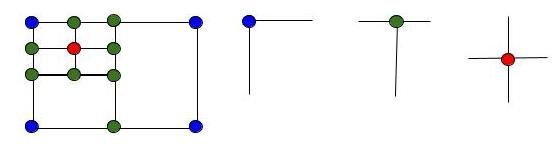

# Leetcode

## 1. Two Sum

解题思路

1. 题目描述：给定无序数组和指定值 target, 返回和为 target 的两个数的下标。
2. HashMap：建立值到下标的映射。复杂度为 O(n)

关联专题

1. **Target Sum**

```C++
// 2020-12-14 submission
// ?/? cases passed
// Runtime: 8 ms, faster than 95.31% of C++ online submissions.
// Memory Usage: 9.4 MB, less than 77.01% of C++ online submissions.
class Solution {
public:
    vector<int> twoSum(vector<int>& nums, int target) {
        unordered_map<int, int> m;
        for (int i = 0; i < nums.size(); i++) {
            if (m.count(target - nums[i]))
                return vector<int>{m[target - nums[i]], i};
            m[nums[i]] = i;
        }
        return vector<int>{};
    }
};
```

## 2. Add Two Numbers

解题思路

1. 题目描述：需要相加的两个数字通过链表反向存储，结果也需要通过链表反向存储。
2. dummy节点

关联专题

1. **Arithmetic**

```C++
// 2018-04-12 submission
// ?/? cases passed
// Runtime: 28 ms, faster than 90.44% of C++ online submissions.
// Memory Usage: 71.6 MB, less than 33.89% of C++ online submissions.
/**
 * Definition for singly-linked list.
 * struct ListNode {
 *     int val;
 *     ListNode *next;
 *     ListNode(int x) : val(x), next(NULL) {}
 * };
 */
class Solution {
public:
    ListNode* addTwoNumbers(ListNode* l1, ListNode* l2) {

        ListNode* dummy = new ListNode(0);

        ListNode* cur = dummy;
        int carry = 0;
        while (l1 || l2 || carry) {
            if (l1) carry += l1->val;
            if (l2) carry += l2->val;
            cur->next = new ListNode(carry % 10);
            carry /= 10;
            l1 = l1 ? l1->next : l1;
            l2 = l2 ? l2->next : l2;
            cur = cur->next;
        }

        return dummy->next;
    }
};
```

## 3. Longest Substring Without Repeating Characters

解题思路

1. 题目描述：求最长无重复子串
2. 滑动窗口：建立字符到其出现次数或者最后出现位置的映射，并且定义一个变量标记当前滑动窗口的左边界。
3. 对于 char 数据类型的hashmap，可以用 `vector<int> m(256, -1)` 代替。

关联专题

1. **Sliding Window**

```C++
// 2018-04-13 submission
// ?/? cases passed
// Runtime: 8 ms, faster than 88.24% of C++ online submissions.
// Memory Usage: 8.6 MB, less than 64.19% of C++ online submissions.
class Solution {
public:
    int lengthOfLongestSubstring(string s) {
        int max_length = 0;
        int l = 0;
        vector<int> m(256, -1); // unordered_map<char, int> m;
        for (int i = 0; i < s.length(); i++) {
            ++m[s[i]];
            while(m[s[i]] > 1) {
                m[s[l++]]--;
            }
            max_length = max(max_length, i - l + 1);
        }
        return max_length;
    }
};
```

```C++
// 2018-04-13 submission
// ?/? cases passed
// Runtime: 12 ms, faster than 76.61% of C++ online submissions.
// Memory Usage: 8.5 MB, less than 74.50% of C++ online submissions.
class Solution {
public:
    int lengthOfLongestSubstring(string s) {
        int max_length = 0;
        int l = -1;
        vector<int> m(256, -1); // unordered_map<char, int> m;
        for (int i = 0; i < s.length(); i++) {
            if (m[s[i]] >= 0) l = max(l, m[s[i]]);
            m[s[i]] = i;
            max_length = max(max_length, i - l);
        }
        return max_length;
    }
};
```

## 4. Median of Two Sorted Arrays

解题思路

1. 二分法: 转化为找第 K 个数字，中位数即 (m + n + 1) / 2 和 (m + n + 2) / 2 的平均数。在 nums1 和 nums2 中查找第 K/2 个元素，注意这里由于两个数组的长度不定，所以有可能某个数组没有第 K/2 个数字，所以需要先 check 一下，数组中到底存不存在第 K/2 个数字，如果存在就取出来，否则就赋值上一个整型最大值（目的是要在 nums1 或者 nums2 中先淘汰 K/2 个较小的数字，判断的依据就是看 midVal1 和 midVal2 谁更小，但如果某个数组的个数都不到 K/2 个，自然无法淘汰，所以将其对应的 midVal 值设为整型最大值，以保证其不会被淘汰），若某个数组没有第 K/2 个数字，则淘汰另一个数组的前 K/2 个数字即可。

边界条件

1. 另外一个数组比本数组的所有数字都大

```C++
// Runtime: 31 ms, faster than 59.38% of C++ online submissions.
// Memory Usage: 89.1 MB, less than 97.25% of C++ online submissions.
class Solution {
public:
    double findMedianSortedArrays(vector<int>& nums1, vector<int>& nums2) {
        int m = nums1.size(), n = nums2.size();
        int mid1 = (m + n + 1) / 2, mid2 = (m + n + 2) / 2;
        return (findKthNumber(nums1, nums2, 0, 0, mid1) + findKthNumber(nums1, nums2, 0, 0, mid2)) / 2.0;
    }

    int findKthNumber(vector<int>& nums1, vector<int>& nums2, int i, int j, int k) {
        if (i >= nums1.size()) return nums2[j + k - 1];
        if (j >= nums2.size()) return nums1[i + k - 1];
        if (k == 1) return min(nums1[i], nums2[j]);
        int midVal1 = (i + k / 2 - 1 < nums1.size()) ? nums1[i + k / 2 - 1] : INT_MAX;
        int midVal2 = (j + k / 2 - 1 < nums2.size()) ? nums2[j + k / 2 - 1] : INT_MAX;
        if (midVal1 < midVal2) {
            return findKthNumber(nums1, nums2, i + k / 2, j, k - k / 2);
        } else {
            return findKthNumber(nums1, nums2, i, j + k / 2, k - k / 2);
        }
    }
};
```

## 5. Longest Palindromic Substring

解题思路

1. 马拉车算法

```C++
// Runtime: 8 ms, faster than 95.79% of C++ online submissions.
// Memory Usage: 9.1 MB, less than 61.47% of C++ online submissions.
class Solution {
public:
    string longestPalindrome(string s) {
        string str = "^#";
        for (char c : s) {
            str.append(1, c);
            str.append(1, '#');
        }
        str.append(1, '$'); // 为了避免之后的越界比较

        int n = str.length();
        vector<int> vec(n, 0);
        int C = 0, R = 0;
        for (int i = 1; i < n-1; i++) {
            if (i < R) vec[i] = min(vec[2*C-i], R-i);
            while (str[i+vec[i]+1] == str[i-vec[i]-1])
                ++vec[i];
            if (i + vec[i] > R) {
                C = i;
                R = i + vec[i];
            }
        };

        auto max_it = max_element(vec.begin(), vec.end());
        int idx = (max_it-vec.begin()-*max_it) / 2;
        int len = *max_it;
        string res = s.substr(idx, len);
        return res;
    }
};
```

## 6. ZigZag Conversion

```C++
// Runtime: 15 ms, faster than 41.31% of C++ online submissions.
// Memory Usage: 8.1 MB, less than 96.26% of C++ online submissions.
class Solution {
public:
    string convert(string s, int numRows) {

        if (numRows == 1) return s;

        string ret;
        int n = s.size();
        int cycleLen = 2 * numRows - 2;

        for (int i = 0; i < numRows; i++) {
            for (int j = 0; j + i < n; j += cycleLen) {
                ret += s[j + i];
                if (i != 0 && i != numRows - 1 && j + cycleLen - i < n)
                    ret += s[j + cycleLen - i];
            }
        }
        return ret;
    }
};
```

## 9. Palindrome Number

```C++
class Solution {
public:
    bool isPalindrome(int x) {
        if (x < 0) return false;
        int div = 1;
        while (x / div >= 10) div *= 10;
        while (x > 0) {
            int left = x / div;
            int right = x % 10;
            if (left != right) return false;
            x = (x % div) / 10;
            div /= 100;
        }
        return true;
    }
};
```

## 11. Container With Most Water

```C++
// Runtime: 80 ms, faster than 25.22% of C++ online submissions.
// Memory Usage: 58.9 MB, less than 30.39% of C++ online submissions.
class Solution {
public:
    int maxArea(vector<int>& height) {
        int maxValue = 0;
        int l = 0, r = (int)height.size()-1;
        while (l < r) {
            int h = min(height[l], height[r]);
            maxValue = max(maxValue, h * (r - l));
            while (l < r && h >= height[l]) ++l;
            while (l < r && h >= height[r]) --r;
        }
        return maxValue;
    }
};
```

## 12. Integer to Roman ($$$)
## 13. Roman to Integer ($$$)

## 14. Longest Common Prefix

解题思路:

1. 给输入字符串数组排序，有共同字母多的两个字符串会被排到一起，所以只需要找首尾字母串的共同前缀即可。为了防止溢出错误，只遍历而这种较短的那个的长度，找出共同前缀返回即可。

```C++
// Runtime: 4 ms, faster than 72.48% of C++ online submissions.
// Memory Usage: 9.3 MB, less than 43.57% of C++ online submissions.
class Solution {
public:
    string longestCommonPrefix(vector<string>& strs) {
        if (strs.empty()) return "";
        sort(strs.begin(), strs.end());
        int i = 0, len = min(strs[0].size(), strs.back().size());
        while (i < len && strs[0][i] == strs.back()[i]) ++i;
        return strs[0].substr(0, i);
    }
};
```

## 15. 3Sum

```C++
// Runtime: 76 ms, faster than 66.86% of C++ online submissions.
// Memory Usage: 20 MB, less than 58.46% of C++ online submissions.
class Solution {
public:
    vector<vector<int>> threeSum(vector<int>& nums) {
        vector<vector<int>> res;
        if(nums.size() <= 0) return res;
        sort(nums.begin(), nums.end());
        int l_val = 0, r_val = 0, sum = 0;
        for(int i = 0; i < (int)nums.size()-2; i++) {
            if(nums[i] > 0) break;
            if(i > 0 && nums[i] == nums[i-1]) continue;
            for(int l=i+1, r=(int)nums.size()-1; l < r;) {
                l_val = nums[l]; r_val = nums[r];
                sum = nums[l] + nums[r] + nums[i];
                if(sum == 0) res.push_back({nums[i], nums[l], nums[r]});
                if(sum >= 0)  while(l < r && nums[--r] == r_val);
                if(sum <= 0)  while(l < r && nums[++l] == l_val);
            }
        }
        return res;
    }
};
```

## 16. 3Sum Closest

```C++
// Runtime: 4 ms, faster than 97.67% of C++ online submissions.
// Memory Usage: 9.8 MB, less than 88.84% of C++ online submissions.
class Solution {
public:
    int threeSumClosest(vector<int>& nums, int target) {
        int closestVal = nums[0]+nums[1]+nums[2];
        sort(nums.begin(), nums.end());
        for(int i = 0; i < nums.size()-2; i++) {
            int rest = nums[i];
            if(i > 0 && nums[i] == nums[i-1]) continue;
            for(int left=i+1, right=nums.size()-1; left<right;) {
                int curr_sum = nums[left] + nums[right] + rest;
                if(curr_sum == target) return target;
                if(curr_sum > target) right--;
                if(curr_sum < target) left++;
                if(abs(target-curr_sum) < abs(target-closestVal))
                    closestVal=curr_sum;
            }
        }
        return closestVal;
    }
};
```

## 17. Letter Combinations of a Phone Number

```C++
// Runtime: 0 ms, faster than 100.00% of C++ online submissions.
// Memory Usage: 6.5 MB, less than 84.70% of C++ online submissions.
class Solution {
public:

    string prefix[10] = {"", "", "abc", "def", "ghi", "jkl", "mno", "pqrs", "tuv", "wxyz"};

    vector<string> letterCombinations(string digits) {
        queue<string> q;
        if (digits.length() > 0) q.push("");
        for (char digit : digits) {
            for (int q_size = q.size(); q_size > 0; q_size--) {
                string cur = q.front(); q.pop();
                for (char c : prefix[digit-'0']) {
                    q.push(cur + string(1, c));
                }
            }
        }

        vector<string> res;
        while (!q.empty()) {
            res.push_back(q.front());
            q.pop();
        }
        return res;
    }
};
```

## 19. Remove Nth Node From End of List

解题思路

1. BFS

```C++
// 2018-08-05 submission
// ?/? cases passed
// Runtime: 4 ms, faster than 80.26% of C++ online submissions.
// Memory Usage: 10.7 MB, less than 57.60% of C++ online submissions.
class Solution {
public:
    ListNode* removeNthFromEnd(ListNode* head, int n) {
        return helper(head, n);
    }

    ListNode* helper(ListNode* curr, int& limit) {
        if(!curr) return NULL;
        curr->next = helper(curr->next, limit);
        --limit;
        if(limit != 0) return curr;
        else return curr->next;
    }
};
```

## 20. Valid Parentheses

解题思路

1. 栈: 开始遍历输入字符串，如果当前字符为左半边括号时，则将其压入栈中，如果遇到右半边括号时，若此时栈为空，则直接返回 false，如不为空，则取出栈顶元素，若为对应的左半边括号，则继续循环，反之返回 false

```C++
// Runtime: 0 ms, faster than 100.00% of C++ online submissions.
// Memory Usage: 6.3 MB, less than 64.43% of C++ online submissions.
class Solution {
public:
    bool isValid(string s) {
        stack<char> stk;
        for(int i = 0; i < s.size(); i++) {
            if(s[i]=='(' || s[i]=='[' || s[i]=='{') stk.push(s[i]);
            else if(s[i] == ')') {
                if(!stk.empty() && stk.top() == '(') stk.pop();
                else return false;
            }
            else if(s[i] == ']') {
                if(!stk.empty() && stk.top() == '[') stk.pop();
                else return false;
            }
            else if(s[i] == '}') {
                if(!stk.empty() && stk.top() == '{') stk.pop();
                else return false;
            }
        }
        if(stk.empty()) return true;
        else return false;
    }
};
```

## 21. Merge Two Sorted Lists

```C++
// 2020-06-28 submission
// ?/? cases passed
// Runtime: 12 ms, faster than 29.96% of C++ online submissions.
// Memory Usage: 15 MB, less than 5.72% of C++ online submissions.
/**
 * Definition for singly-linked list.
 * struct ListNode {
 *     int val;
 *     ListNode *next;
 *     ListNode(int x) : val(x), next(NULL) {}
 * };
 */
class Solution {
public:
    ListNode* mergeTwoLists(ListNode* l1, ListNode* l2) {
        if (!l1 && !l2) return nullptr;
        ListNode* dummy = new ListNode(0), *cur = dummy;
        int val1 = 0, val2 = 0;
        while (l1 || l2) {
            val1 = l1 ? l1->val : INT_MAX;
            val2 = l2 ? l2->val : INT_MAX;
            if (val1 <= val2) {
                cur->next = new ListNode(val1);
                l1 = l1->next;
            }
            else {
                cur->next = new ListNode(val2);
                l2 = l2->next;
            }
            cur = cur->next;
        }
        return dummy->next;
    }
};
```

## 23. Merge k Sorted Lists

```C++
// 2020-06-28 submission
// ?/? cases passed
// Runtime: 24 ms, faster than 59.80% of C++ online submissions.
// Memory Usage: 13.9 MB, less than 27.89% of C++ online submissions.
/**
 * Definition for singly-linked list.
 * struct ListNode {
 *     int val;
 *     ListNode *next;
 *     ListNode(int x) : val(x), next(NULL) {}
 * };
 */
class Solution {
public:
    ListNode* mergeKLists(vector<ListNode*>& lists) {
        auto cmp = [](ListNode*& a, ListNode*& b) {
            return a->val > b->val;
        };
        priority_queue<ListNode*, vector<ListNode*>, decltype(cmp) > q(cmp);
        for (auto node : lists) {
            if (node) q.push(node);
        }
        ListNode *dummy = new ListNode(-1), *cur = dummy;
        while (!q.empty()) {
            auto t = q.top(); q.pop();
            cur->next = t;
            cur = cur->next;
            if (cur->next) q.push(cur->next);
        }
        return dummy->next;
    }
};
```

## 24. Swap Nodes in Pairs

```C++
// 2020-06-28 submission
// ?/? cases passed
// Runtime: 0 ms, faster than 100.00% of C++ online submissions.
// Memory Usage: 7.6 MB, less than 45.58% of C++ online submissions.
/**
 * Definition for singly-linked list.
 * struct ListNode {
 *     int val;
 *     ListNode *next;
 *     ListNode(int x) : val(x), next(NULL) {}
 * };
 */
class Solution {
public:
    ListNode* swapPairs(ListNode* head) {
        if(!head || !head->next) return head;
        ListNode* curr = head->next;
        head->next = swapPairs(curr->next);
        curr->next = head;
        return curr;
    }
};
```

## 25. Reverse Nodes in k-Group

```C++
// 2020-06-28 submission
// ?/? cases passed
// Runtime: 12 ms, faster than 90.02% of C++ online submissions.
// Memory Usage: 11.5 MB, less than 61.58% of C++ online submissions.
/**
 * Definition for singly-linked list.
 * struct ListNode {
 *     int val;
 *     ListNode *next;
 *     ListNode(int x) : val(x), next(NULL) {}
 * };
 */
class Solution {
public:
    ListNode* reverseKGroup(ListNode* head, int k) {
        ListNode *dummy = new ListNode(-1), *pre = dummy, *cur = pre;
        dummy->next = head;
        int num = 0;
        while (cur = cur->next) ++num;
        while (num >= k) {
            cur = pre->next;
            for (int i = 1; i < k; ++i) {
                ListNode *t = cur->next;
                cur->next = t->next;
                t->next = pre->next;
                pre->next = t;
            }
            pre = cur;
            num -= k;
        }
        return dummy->next;
    }
};
```

## 26. Remove Duplicates from Sorted Array

解题思路

1. 给定一个排序数组，就地删除重复项，以便每个元素只出现一次，并返回新长度

```C++
class Solution {
public:
    int removeDuplicates(vector<int>& nums) {
        int pre = 0, cur = 0, n = nums.size();
        while (cur < n) {
            if (nums[pre] == nums[cur]) ++cur;
            else nums[++pre] = nums[cur++];
        }
        return nums.empty() ? 0 : (pre + 1);
    }
};
```

## 32. Longest Valid Parentheses

解题思路

1. 题目描述：求最长有效括号的长度
2. 动态规划，每个位置存 包括当前位置的有效最长长度。如果当前位置是 ')'，检查前一位的最长长度 k，检查当前位置减去 k+1 的位置是否为 '('，当前位置为 k+2，并且还要加上减去 k+2 的位置的最长长度

```C++
// 2021-04-03 submission
// ?/? cases passed
// Runtime: 0 ms, faster than 100.00% of C++ online submissions.
// Memory Usage: 7.4 MB, less than 21.88% of C++ online submissions.
class Solution {
public:
    int longestValidParentheses(string s) {
        int res = 0;
        vector<int> vec(s.length()+1, 0);
        for(int i = 1; i <= s.length(); i++) {
            if(s[i-1] == ')' && i-1-vec[i-1]-1 >= 0 && s[i-1-vec[i-1]-1] == '(') {
                vec[i] = vec[i-1] + 2;
                vec[i] += vec[i-vec[i]];
                res = max(res, vec[i]);
            }
        }
        return res;
    }
};
```

## 42. Trapping Rain Water

解题思路

1. 每个位置能接的雨水量是：当前位置左边最高的数与右边最高的数的最小值减去当前位置的数（注意不能为负数）。

边界条件

1. 高度列表长度小于3

```C++
// 2020-07-14 submission
// ?/? cases passed
// Runtime: 4 ms, faster than 88.40% of C++ online submissions.
// Memory Usage: 14.1 MB, less than 71.67% of C++ online submissions.
class Solution {
public:
    int trap(vector<int>& height) {
        vector<int> vec(height.size(), 0);
        long long res = 0;

        int maxVal = 0;
        for (int i = 0; i < (int)height.size(); i++) {
            maxVal = max(maxVal, height[i]);
            vec[i] = maxVal;
        }

        maxVal = 0;
        for (int i = (int)vec.size()-1; i >= 0; i--) {
            maxVal = max(maxVal, height[i]);
            res += (min(maxVal, vec[i]) - height[i]);
        }
        return res;
    }
};
```

## 44. Wildcard Matching

解题思路

1. 动态规划
- dp[i][j] 表示 p 前 i 个字符 和 s 前 j 个字符是否匹配
- if p[i-1] == s[j-1] or p[i-1] == '?', dp[i][j]=dp[i-1][j-1]
- if p[i-1] == '*', dp[i][j]=dp[i-1][j] or dp[i][j-1]

边界条件：

1. p 和 s 长度均为 0 时，结果为true
2. s 长度为 0，p 为只由 * 组成的字符串，结果为 true

```C++
// 2020-09-14 submission
// ?/? cases passed
// Runtime: 176 ms, faster than 40.96% of C++ online submissions.
// Memory Usage: 6.6 MB, less than 89.86% of C++ online submissions.
class Solution {
public:
    bool isMatch(string s, string p) {
        vector<bool> dp(s.length()+1, false);

        dp[0] = true;
        for (int i = 1; i <= p.length(); i++) {
            bool last_valid = dp[0];
            dp[0] = (dp[0] && p[i-1] == '*');
            for (int j = 1; j <= s.length(); j++) {
                bool temp = dp[j];
                if (p[i-1] == '*') dp[j] = dp[j-1] || dp[j];
                else if (p[i-1] == '?') dp[j] = last_valid;
                else dp[j] = (last_valid && s[j-1] == p[i-1]);
                last_valid = temp;
                // cout << s[j-1] << " " << p[i-1] << " " << dp[j] << endl;
            }
        }

        return dp[s.length()];
    }
};
```

## 45. Jump Game II

解题思路

1. 贪心算法：cur 是当前能到达的最远位置，last 是上一步能到达的最远位置，遍历数组。判断如果当前位置到达了 last，即上一步能到达的最远位置，说明需要再跳一次。判断如果 cur 到达末尾

```C++
// 2021-03-11 submission
// ?/? cases passed
// Runtime: 0 ms, faster than 100.00% of C++ online submissions.
// Memory Usage: 8.1 MB, less than 100.00% of C++ online submissions.
class Solution {
public:
    int jump(vector<int>& nums) {
        int res = 0;
        int pre = 0, cur = 0;
        for (int i = 0; i < nums.size(); i++) {
            cur = max(cur, i + nums[i]);
            if (i == pre) {
                ++res;
                pre = cur;
                if (cur >= nums.size() - 1) break;
            }
        }
        return res;
    }
};
```


## 51. N-Queens

返回所有解法

```C++
// 2019-04-14 submission
// ?/? cases passed
// Runtime: 8 ms, faster than 63.24% of C++ online submissions.
// Memory Usage: 7.4 MB, less than 61.04% of C++ online submissions.
class Solution {
public:
    vector<vector<string>> solveNQueens(int n) {
        vector<vector<int>> result;
        vector<vector<string>> chess_results;
        vector<int> temp(n, 0);
        if(n == 1) {
            chess_results.push_back(vector<string>{"Q"});
            return chess_results;
        }
        else if(n >= 4) {
            place(0, n, temp, result);
            print_chess(result, chess_results);
        }
        return chess_results;
    }

    bool find(int row, int col, vector<int>& curr) {
        for(int i = 0; i < row; i++) {
            if(curr[i]==col || abs(i-row)==abs(col-curr[i])) return false;
        }
        return true;
    }

    void place(int k, int n, vector<int>& curr, vector<vector<int>>& result) {
        for(int i = 0; i < n; i++) {
            if(find(k, i, curr)) {
                curr[k] = i;
                if(k == n-1) result.push_back(curr);
                else place(k+1, n, curr, result);
            }
        }
    }

    void print_chess(vector<vector<int>>& result, vector<vector<string>>& chess_results) {
        int col = 0;
        string temp = "";
        for(int i = 0; i < result.size(); i++) {
            int n = result[i].size();
            chess_results.push_back(vector<string>{});
            for(int j = 0; j < n; j++) {
                col = result[i][j];
                temp = "";
                for(int k = 0; k < col; k++) temp += '.';
                temp += 'Q';
                for(int k = col+1; k < n; k++) temp += '.';
                chess_results[i].push_back(temp);
            }
        }
    }
};
```

## 52. N-Queens II

返回解法数量

```C++
// 2019-04-14 submission
// ?/? cases passed
// Runtime: 4 ms, faster than 82.73% of C++ online submissions.
// Memory Usage: 6 MB, less than 90.16% of C++ online submissions.
class Solution {
public:
    int totalNQueens(int n) {
        int success = 0;
        vector<int> temp(n, 0);
        place(0, n, temp, success);
        return success;
    }

    bool find(int row, int col, vector<int>& curr) {
        for(int i = 0; i < row; i++) {
            if(curr[i] == col || abs(i-row) == abs(curr[i]-col))
                return false;
        }
        return true;
    }

    void place(int k, int n, vector<int>& curr, int &success) {
        for(int i = 0; i < n; i++) {
            if(find(k, i, curr)) {
                curr[k] = i;
                if(k == n-1) success++;
                else place(k+1, n, curr, success);
            }
        }
    }

};
```

## 56. Merge Intervals

解题思路

1. 首先给区间集排序，需要定义自己的 comparator，才能用 sort 来排序。（其实直接对二维向量调用sort()函数，二维向量就会按第一列元素排序）。按照 start 的值从小到大来排序，排完序开始合并，首先把第一个区间存入结果中，然后从第二个开始遍历区间集，如果结果中最后一个区间和遍历的当前区间无重叠，直接将当前区间存入结果中，如果有重叠，将结果中最后一个区间的 end 值更新为结果中最后一个区间的 end 和当前 end 值之中的较大值，然后继续遍历区间集，以此类推可以得到最终结果

```C++
// 2019-05-09 submission
// ?/? cases passed
// Runtime: 32 ms, faster than 94.27% of C++ online submissions.
// Memory Usage: 14.5 MB, less than 76.55% of C++ online submissions.
class Solution {
public:
    static bool cmp(const vector<int> &v1, const vector<int> &v2) {
        // 自写 sort 函数需要 引用参数 防止大量拷贝 影响效率
        return v1[0] < v2[0];
    }

    vector<vector<int>> merge(vector<vector<int>>& intervals) {
        vector<vector<int>> result;
        if(intervals.empty()) return result;
        sort(intervals.begin(), intervals.end(), cmp);
        int i_min=intervals[0][0], i_max=intervals[0][1];
        for(int i = 1; i < intervals.size(); i++) {
            if(i_max >= intervals[i][0]) i_max = max(i_max, intervals[i][1]);
            else {
                result.push_back(vector<int>{i_min, i_max});
                i_min = intervals[i][0];
                i_max = intervals[i][1];
            }
        }
        result.push_back(vector<int>{i_min, i_max});
        return result;
    }
};
```

```C++
// 2020-11-19 submission
// ?/? cases passed
// Runtime: 44 ms, faster than 59.45% of C++ online submissions.
// Memory Usage: 14.7 MB, less than 54.25% of C++ online submissions.
class Solution {
public:
    vector<vector<int>> merge(vector<vector<int>>& intervals) {
        vector<vector<int>> result;
        if(intervals.empty()) return result;
        sort(intervals.begin(), intervals.end());
        result.push_back(intervals[0]);
        for(int i = 1; i < intervals.size(); i++) {
            if (intervals[i][0] <= result.back()[1])
                result.back()[1] = max(result.back()[1], intervals[i][1]);
            else
                result.push_back(intervals[i]);
        }
        return result;
    }
};
```

## 60. Permutation Sequence

全排列中的第 k 个

```C++
// 2019-09-01 submission
// ?/? cases passed
// Runtime: 0 ms, faster than 100.00% of C++ online submissions.
// Memory Usage: 6 MB, less than 78.79% of C++ online submissions.
class Solution {
public:
    string getPermutation(int n, int k) {
        vector<int> frac(n, 1);
        string nums = "123456789";
        string ret = "";
        for(int i = 1; i < n; i++) {frac[i] = frac[i-1]*i;}
        --k;
        for(int i = n-1; i >= 0; i--) {
            ret += nums[k / frac[i]];
            nums.erase(k / frac[i], 1);
            k %= frac[i];
        }
        return ret;
    }
};
```

## 61. Rotate List

解题思路

1. 旋转链表
2. 遍历整个链表获得链表长度n，然后此时把链表头和尾链接起来，在往后走 n - k%n 个节点就到达新链表的头结点前一个点，这时断开链表

```C++
class Solution {
public:
    ListNode *rotateRight(ListNode *head, int k) {
        if (!head) return NULL;
        int n = 1;
        ListNode *cur = head;
        while (cur->next) {
            ++n;
            cur = cur->next;
        }
        cur->next = head;
        int m = n - k % n;
        for (int i = 0; i < m; ++i) {
            cur = cur->next;
        }
        ListNode *newhead = cur->next;
        cur->next = NULL;
        return newhead;
    }
};
```

## 62. Unique Paths

解题思路

1. 从左上角到右下角，有多少种行走路径

```C++
class Solution {
public:
    int uniquePaths(int m, int n) {
        vector<int> dp(n, 1);
        for (int i = 1; i < m; ++i) {
            for (int j = 1; j < n; ++j) {
                dp[j] += dp[j - 1];
            }
        }
        return dp[n - 1];
    }
};
```

## 63. Unique Paths II

解题思路

1. 从左上角到右下角，有多少种行走路径，而且有些位置有障碍物

```C++
class Solution {
public:
    int uniquePathsWithObstacles(vector<vector<int>>& obstacleGrid) {
        if (obstacleGrid.empty() || obstacleGrid[0].empty() || obstacleGrid[0][0] == 1) return 0;
        int m = obstacleGrid.size(), n = obstacleGrid[0].size();
        vector<long> dp(n, 0);
        dp[0] = 1;
        for (int i = 0; i < m; ++i) {
            for (int j = 0; j < n; ++j) {
                if (obstacleGrid[i][j] == 1) dp[j] = 0;
                else if (j > 0) dp[j] += dp[j - 1];
            }
        }
        return dp[n - 1];
    }
};
```

## 64. Minimum Path Sum

```C++
// 2018-07-26 submission
// ?/? cases passed
// Runtime: 8 ms, faster than 82.85% of C++ online submissions.
// Memory Usage: 10 MB, less than 35.59% of C++ online submissions.
class Solution {
public:
    int minPathSum(vector<vector<int>>& grid) {
        if(grid.empty() || grid[0].empty()) return 0;
        int rows = grid.size();
        int cols = grid[0].size();
        vector<vector<int>> record(rows+1, vector<int>(cols+1, INT_MAX));

        for (int i = 1; i <= rows; i++) {
            for (int j = 1; j <= cols; j++) {
                if (i == 1 && j == 1) record[i][j] = grid[i-1][j-1];
                else record[i][j] = min(record[i-1][j], record[i][j-1]) + grid[i-1][j-1];
            }
        }
        return record[rows][cols];

    }
};
```

## 66. Plus One

数字以数组形式存在，+1 返回

```C++
class Solution {
public:
    vector<int> plusOne(vector<int>& digits) {
        vector<int> result;
        int carry = 1;
        for(int i=digits.size()-1; i >= 0; i--) {
            if(carry == 1 && digits[i] == 9) {
                result.push_back(0);
                carry = 1;
            }
            else {
                result.push_back(digits[i]+carry);
                carry = 0;
            }
        }
        if(carry == 1) result.push_back(1);
        reverse(result.begin(), result.end());
        return result;
    }

};
```

## 67. Add Binary

给定两个二进制字符串a 和 b，将它们的和作为二进制字符串返回

```C++
class Solution {
public:
    string addBinary(string a, string b) {
        string ret;
        int alen = a.length();
        int blen = b.length();
        int maxlen = max(alen, blen);
        if(alen >= blen) b = string(alen-blen, '0') + b;
        else a = string(blen-alen, '0') + a;
        int carry  = 0;
        for(int i = 1; i <= maxlen; i++) {
            int sum = a[maxlen-i]-'0' + b[maxlen-i]-'0' + carry;
            carry = sum / 2;
            ret = (sum%2==0 ? "0" : "1") + ret;
        }
        if(carry) ret = "1" + ret;
        return ret;
    }
};
```

## 70. Climbing Stairs

```C++
class Solution {
public:
    int climbStairs(int n) {
        int a = 1, b = 1;
        for(int i = 0; i < n-1; i++) {
            auto temp = b;
            b = a + b;
            a = temp;
        }
        return b;
    }
};
```

## 71. Simplify Path

解题思路

1. 简化路径: "/../" 返回 "/"

```C++
class Solution {
public:
    string simplifyPath(string path) {
        string res, t;
        stringstream ss(path);
        vector<string> v;
        while (getline(ss, t, '/')) {
            if (t == "" || t == ".") continue;
            if (t == ".." && !v.empty()) v.pop_back();
            else if (t != "..") v.push_back(t);
        }
        for (string s : v) res += "/" + s;
        return res.empty() ? "/" : res;
    }
};
```

## 73. Set Matrix Zeroes

解题思路

1. 给定一个矩阵，如果一个元素为 0，则将其整个行和列设置为 0。需求 in-place

```C++
class Solution {
public:
    void setZeroes(vector<vector<int> > &matrix) {
        if (matrix.empty() || matrix[0].empty()) return;
        int m = matrix.size(), n = matrix[0].size();
        bool rowZero = false, colZero = false;
        for (int i = 0; i < m; ++i) {
            if (matrix[i][0] == 0) colZero = true;
        }
        for (int i = 0; i < n; ++i) {
            if (matrix[0][i] == 0) rowZero = true;
        }
        for (int i = 1; i < m; ++i) {
            for (int j = 1; j < n; ++j) {
                if (matrix[i][j] == 0) {
                    matrix[0][j] = 0;
                    matrix[i][0] = 0;
                }
            }
        }
        for (int i = 1; i < m; ++i) {
            for (int j = 1; j < n; ++j) {
                if (matrix[0][j] == 0 || matrix[i][0] == 0) {
                    matrix[i][j] = 0;
                }
            }
        }
        if (rowZero) {
            for (int i = 0; i < n; ++i) matrix[0][i] = 0;
        }
        if (colZero) {
            for (int i = 0; i < m; ++i) matrix[i][0] = 0;
        }
    }
};
```

## 74. Search a 2D Matrix

搜索 2D 矩阵
每行中的整数从左到右排序。每行的第一个整数大于前一行的最后一个整数。

```C++
class Solution {
public:
    bool searchMatrix(vector<vector<int>>& matrix, int target) {
        if (matrix.empty() || matrix[0].empty()) return false;
        int m = matrix.size(), n = matrix[0].size();
        int l = 0, r = m * n, mid = 0;
        while (l < r) {
            int mid = l + (r - l) / 2;
            if (matrix[mid / n][mid % n] == target) return true;
            else if (matrix[mid / n][mid % n] < target) l = mid + 1;
            else r = mid;
        }
        return false;
    }
};
```

## 75. Sort Colors

```C++
// Runtime: 4 ms, faster than 47.31% of C++ online submissions.
// Memory Usage: 8.3 MB, less than 63.84% of C++ online submissions.
class Solution {
public:
    void sortColors(vector<int>& nums) {
        if(nums.size() < 2) return;
        int l = 0, r = (int)nums.size()-1;
        int pivot = -1;
        while (l < r) {
            while (l < r && nums[l] == 0) l++;
            while (l < r && nums[r] == 2) r--;
            if (nums[l] == 2) swap(nums[l], nums[r]);
            else if (nums[l] == 1) {
                pivot = l;
                while(pivot <= r && nums[pivot] == 1) ++pivot;
                if (pivot <= r) swap(nums[pivot], nums[l]);
                else l = r;
            }
        }
    }
};
```

## 76. Minimum Window Substring

解题思路

1. 滑动窗口。注意可以只用一个哈希表，存储t的频率，当右边界遍历到减1，左边界遍历到加1。另外需要一个计数变量，当频率大于0时（因为非法字符最大频率为0，合法字符最小频率为0）计数变量cnt加1，从而可以判断是否已经包含所有合法字符。

边界条件
1. t长度可能为0（测试样例没有考虑到）

```C++
// 2020-07-17 submission
// ?/? cases passed
// Runtime: 32 ms, faster than 67.64% of C++ online submissions
// Memory Usage: 55.6 MB, less than 5.05% of C++ online submissions
class Solution {
public:
    string minWindow(string s, string t) {
        if(t.length() == 0) return "";

        unordered_map<char, int> freq;
        for (int i = 0; i < t.length(); i++) {
            freq[t[i]]++;
        }

        int left = 0;
        int cnt = 0;
        string res = "";
        int res_cnt = INT_MAX;
        for (int pivot = 0; pivot < s.length(); pivot++) {
            freq[s[pivot]]--;
            if(freq[s[pivot]] >= 0) cnt++;
            if (cnt == t.length()) {
                while(cnt == t.length()) {
                    freq[s[left]]++;
                    if (freq[s[left]] > 0) cnt--;
                    left++;
                }
                string cur_str = s.substr(left-1, pivot-left+2);
                if (cur_str.length() < res_cnt) {
                    res_cnt = cur_str.length();
                    res = cur_str;
                }
            }
        }
        return res;
    }
};
```

## 77. Combinations

```C++
class Solution {
public:
    vector<vector<int>> combine(int n, int k) {
        vector<vector<int>> res;
        vector<int> out;
        helper(n, k, 1, out, res);
        return res;
    }
    void helper(int n, int k, int level, vector<int>& out, vector<vector<int>>& res) {
        if (out.size() == k) {res.push_back(out); return;}
        for (int i = level; i <= n; ++i) {
            out.push_back(i);
            helper(n, k, i + 1, out, res);
            out.pop_back();
        }
    }
};
```

## 78. Subsets

解题思路

1. 题目描述：找出给定集合的所有子集
2. 递归：DFS深度优先搜索
3. 位操作：数组中所有的数分配一个状态，true 表示这个数在子集中出现，false 表示在子集中不出现，那么对于一个长度为n的数组，每个数字都有出现与不出现两种情况，所以共有 $2^n$ 中情况
// 此处删去了图片

```C++
// 2019-05-06 submission (DFS)
// Runtime: 0 ms, faster than 100.00% of C++ online submissions.
// Memory Usage: 7.5 MB, less than 7.29% of C++ online submissions.
class Solution {
public:
    vector<vector<int>> subsets(vector<int>& nums) {
        vector<vector<int>> result{vector<int>{}};
        vector<int> temp;
        DFS(nums, temp, result, 0);
        return result;
    }

    void DFS(vector<int>& candidates, vector<int>& curr, vector<vector<int>>& result, int pivot) {
        for(int i = pivot; i < candidates.size(); i++) {
            curr.push_back(candidates[i]);
            result.push_back(curr);
            DFS(candidates, curr, result, i+1);
            curr.pop_back();
        }
    }
};
```

```C++
// 2020-10-26 submission (位操作)
// Runtime: 4 ms, faster than 67.90% of C++ online submissions.
// Memory Usage: 7.5 MB, less than 7.29% of C++ online submissions.
class Solution {
public:
    vector<vector<int>> subsets(vector<int>& nums) {
        vector<vector<int>> res;
        int count = 1 << nums.size();
        for (int i = 0; i < count; i++) {
            vector<int> vec;
            for (int j = 0; j < nums.size(); j++) {
                if (i & (1 << j)) vec.push_back(nums[j]);
            }
            res.push_back(vec);
        }
        return res;
    }
};
```

## 80. Remove Duplicates from Sorted Array II

给定一个排序数组 nums，就地删除重复项使得重复项最多出现两次，并返回新长度

```C++
class Solution {
public:
    int removeDuplicates(vector<int>& nums) {
        int pre = 0, cur = 1, cnt = 1, n = nums.size();
        while (cur < n) {
            if (nums[pre] == nums[cur] && cnt == 0) ++cur;
            else {
                if (nums[pre] == nums[cur]) --cnt;
                else cnt = 1;
                nums[++pre] = nums[cur++];
            }
        }
        return nums.empty() ? 0 : pre + 1;
    }
};
```

## 81. Search in Rotated Sorted Array II

```C++
// 2021-03-18 submission
// ?/? cases passed
// Runtime: 8 ms, faster than 64.87% of C++ online submissions.
// Memory Usage: 13.8 MB, less than 98.98% of C++ online submissions.
class Solution {
public:
    bool search(vector<int>& nums, int target) {
        int l = 0, r = nums.size(), mid = 0;
        while (l < r) {
            mid = l + (r - l) / 2;
            if (nums[mid] == target) return true;
            while (l < r && nums[l] == nums[mid]) ++l;
            if (l >= mid) continue;
            if (nums[l] < nums[mid]) {
                if (nums[l] <= target && target < nums[mid]) r = mid;
                else l = mid + 1;
            }
            else if (nums[l] > nums[mid]){
                if (nums[mid] < target && target <= nums[r - 1]) l = mid + 1;
                else r = mid;
            }
        }
        return false;
    }
};
```

## 84. Largest Rectangle in Histogram

解题思路

1. 矩形面积由宽度和高度决定，于是固定高度，从而最大化宽度即可。一个位置上的高度确定，确定最大左宽度和最大右宽度，最大宽度即附近的大于自身的高度的连续序列长度。注意最左边位置的左宽度和最右边位置的右宽度为1.

```C++
// 2020-07-16 submission
// ?/? cases passed
// Runtime: 28 ms, faster than 64.06% of C++ online submissions
// Memory Usage: 14.3 MB, less than 47.02% of C++ online submissions
class Solution {
public:
    int largestRectangleArea(vector<int>& heights) {

        int max_area = 0;
        int width = heights.size();
        vector<int> left_seq(width, 1);
        vector<int> right_seq(width, 1);

        for (int i = width-1; i >= 0; i--) {
            int pivot = i;
            while (pivot < width) {
                if (heights[i] <= heights[pivot]) pivot += right_seq[pivot];
                else break;
            }
            right_seq[i] = pivot - i;
        }

        for (int i = 0; i < width; i++) {
            int pivot = i;
            while (pivot >= 0) {
                if (heights[i] <= heights[pivot]) pivot -= left_seq[pivot];
                else break;
            }
            left_seq[i] = i - pivot;
            // cout << left_seq[i] << endl;
            max_area = max(max_area, (left_seq[i] + right_seq[i]-1)*heights[i]);
        }

        return max_area;
    }
};
```

## 99. Recover Binary Search Tree

解题思路

1. 中序遍历：通过中序遍历拿到BST的升序排列（同时拿到对应的指针），把升序排列重新排序后重新复制。这是O(nlogn)的时间复杂度，但是空间复杂度（O(n)）不满足要求。
2. 中序遍历改进：通过两个指针和两个变量存储左边和右边，然后交换指针和值即可。
3. Morris 遍历：

```C++
// 2020-07-09 submission (中序遍历)
// Runtime: 52 ms, faster than 19.81% of C++ online submissions
// Memory Usage: 54.7 MB, less than 16.38% of C++ online submissions
/**
 * Definition for a binary tree node.
 * struct TreeNode {
 *     int val;
 *     TreeNode *left;
 *     TreeNode *right;
 *     TreeNode(int x) : val(x), left(NULL), right(NULL) {}
 * };
 */
class Solution {
public:
    void recoverTree(TreeNode* root) {
        vector<TreeNode*> pointers;
        vector<int> vals;
        inorder(root, pointers, vals);

        if(!vals.empty()) sort(vals.begin(), vals.end());
        for(int i =0; i < pointers.size(); i++) {
            pointers[i]->val = vals[i];
        }
    }

    void inorder(TreeNode* root, vector<TreeNode*>& pointers, vector<int>& vals) {
        if (!root) return;
        inorder(root->left, pointers, vals);
        pointers.push_back(root);
        vals.push_back(root->val);
        inorder(root->right, pointers, vals);
    }
};
```

```C++
// 2020-11-01 submission (中序遍历)
// Runtime: 36 ms, faster than 84.19% of C++ online submissions.
// Memory Usage: 58.3 MB, less than 8.04% of C++ online submissions.
/**
 * Definition for a binary tree node.
 * struct TreeNode {
 *     int val;
 *     TreeNode *left;
 *     TreeNode *right;
 *     TreeNode() : val(0), left(nullptr), right(nullptr) {}
 *     TreeNode(int x) : val(x), left(nullptr), right(nullptr) {}
 *     TreeNode(int x, TreeNode *left, TreeNode *right) : val(x), left(left), right(right) {}
 * };
 */
class Solution {
public:
    void recoverTree(TreeNode* root) {
        vector<TreeNode*> pointers(2, NULL);
        vector<int> vals(2, 0);
        inorder(root, pointers, vals);
        pointers[0]->val = vals[1];
        pointers[1]->val = vals[0];
    }

    void inorder(TreeNode* root, vector<TreeNode*>& pointers, vector<int>& vals) {
        if (!root) return;
        inorder(root->left, pointers, vals);
        if (pointers[0] && pointers[1] && vals[0] < root->val) return;
        if (!pointers[0] || vals[0] < root->val) {
            pointers[0] = root;
            vals[0] = root->val;
        }
        if (pointers[0] && vals[0] > root->val) {
            pointers[1] = root;
            vals[1] = root->val;
        }
        // cout << root->val << " " << vals[0] << " " << vals[1] << endl;
        inorder(root->right, pointers, vals);
    }
};
```

## 101. Symmetric Tree

对称二叉树

```C++
class Solution {
public:
    bool isSymmetric(TreeNode* root) {
        if(root == NULL) return true;
        return checkLeftRight(root->left, root->right);
    }

    bool checkLeftRight(TreeNode* left, TreeNode* right) {
        if(left==NULL && right==NULL) return true;
        if(left==NULL || right==NULL || left->val!=right->val) return false;
        return checkLeftRight(left->left, right->right) &&
            checkLeftRight(left->right, right->left);
    }
};
```

## 112. Path Sum

解题思路

1. 题目描述：是否存在根点路径和等于给定数

```C++
// 2019-04-24 submission
// ?/? cases passed
// Runtime: 8 ms, faster than 93.97% of C++ online submissions.
// Memory Usage: 21.1 MB, less than 98.40% of C++ online submissions.
/**
 * Definition for a binary tree node.
 * struct TreeNode {
 *     int val;
 *     TreeNode *left;
 *     TreeNode *right;
 *     TreeNode(int x) : val(x), left(NULL), right(NULL) {}
 * };
 */
class Solution {
public:
    bool hasPathSum(TreeNode* root, int sum) {
        if (!root) return false;
        if (!root->left && !root->right)
            return sum == root->val;
        return hasPathSum(root->left, sum-root->val) ||
                hasPathSum(root->right, sum-root->val);
    }
};
```

## 113. Path Sum II

```C++
// 2019-03-29 submission
// ?/? cases passed
// Runtime: 8 ms, faster than 80.63% of C++ online submissions.
// Memory Usage: 19.8 MB, less than 90.69% of C++ online submissions.
class Solution {
public:
    vector<vector<int>> pathSum(TreeNode* root, int sum) {
        vector<vector<int>> candidates;
        vector<int> temp;
        if(root) helper(candidates, temp, root, sum);
        return candidates;
    }

    void helper(vector<vector<int>>& candidates, vector<int>& current, TreeNode* root, int rest) {
        if(rest==root->val && !root->left && !root->right) {
            current.push_back(root->val);
            candidates.push_back(current);
            current.pop_back();
            return;
        }
        //if(rest <= root->val) return;
        current.push_back(root->val);
        if(root->left) helper(candidates, current, root->left, rest-root->val);
        if(root->right) helper(candidates, current, root->right, rest-root->val);
        current.pop_back();
    }
};
```

## 115. Distinct Subsequences

解题思路

1. 动态规划，dp[i][j] 表示 s 中范围是 [0, i] 的子串中能组成 t 中范围是 [0, j] 的子串的子序列的个数。
2. 状态转移方程为 dp[i][j] = dp[i][j - 1] + (T[i - 1] == S[j - 1] ? dp[i - 1][j - 1] : 0)

边界条件

1. 空串是任意字符串（包括空串）的子串，在本题中空串仅计算1次。
2. 非空串不是空串的子串。
3. 数据类型不能使用 int，因为在运算过程中有可能会出现比最终结果大的数字（比如说rab能够比rabbit匹配更多次）而导致溢出。

```C++
// 2020-09-15 submission
// ?/? cases passed
// Runtime: 12 ms, faster than 71.06% of C++ online submissions.
// Memory Usage: 7 MB, less than 83.59% of C++ online submissions.
class Solution {
public:
    int numDistinct(string s, string t) {
        int c1 = s.length(), c2 = t.length();
        vector<long> dp(c1 + 1, 1); // why long type

        int last_valid = 0;
        for (int i = 1; i <= c2; i++) {
            last_valid = dp[0];
            dp[0] = 0;
            for (int j = 1; j <= c1; j++) {
                int temp = dp[j];
                dp[j] = dp[j-1] + (s[j-1] == t[i-1] ? last_valid : 0);
                last_valid = temp;
            }
        }
        return dp[c1];
    }
};
```

## 118. Pascal's Triangle

杨辉三角生成

```C++
class Solution {
public:
    vector<vector<int>> generate(int numRows) {
        vector<vector<int>> ret;
        if(numRows == 0) return ret;
        ret.push_back(vector<int>{1});
        if(numRows == 1) return ret;

        ret.push_back(vector<int>{1, 1});
        for(int i = numRows - 2; i > 0; i--) {
            ret.push_back(getNext(ret.back()));
        }
        return ret;
    }

    vector<int> getNext(vector<int>& curr) {
        vector<int> ret;
        ret.push_back(1);
        for(size_t i = 0; i < curr.size()-1; i++) {
            ret.push_back(curr[i] + curr[i+1]);
        }
        ret.push_back(1);
        return ret;
    }
};
```

## 119. Pascal's Triangle II

给出第 n 行杨辉三角

```C++
class Solution {
public:
    vector<int> getRow(int rowIndex) {
        vector<int> ret{1};
        for(int num = 1; num < rowIndex + 1; num++) {
            int64_t last = ret.back();
            int64_t to_push = last * (rowIndex+1-num) / num;
            ret.push_back(to_push);
        }
        return ret;
    }
};
```

## 120. Triangle

三角形从上到下最小路径和

解题思路

1. 复制三角形最后一行，作为用来更新的一位数组。然后逐个遍历这个DP数组，对于每个数字，和它之后的元素比较选择较小的再加上面一行相邻位置的元素做为新的元素，然后一层一层的向上扫描

```C++
// 2021-09-01 submission
// ?/? cases passed
// Runtime: 8 ms, faster than 32.16% of C++ online submissions.
// Memory Usage: 8.5 MB, less than 49.67% of C++ online submissions.
class Solution {
public:
    int minimumTotal(vector<vector<int>>& triangle) {
        vector<int> dp(triangle.back().begin(), triangle.back().end());
        for (int k = dp.size()-2; k >= 0; k--) {
            for (int i = 0; i <= k; i++) {
                dp[i] = min(dp[i], dp[i+1]) + triangle[k][i];
            }
        }
        return dp[0];
    }
};
```

## 121. Best Time to Buy and Sell Stock ##

解题思路：

1. 题目描述：买进前必须卖出手头已有的；只允许一次交易
2. 遍历每天的股价，存储遍历到当前位置的最小值，然后用当前值减去最小值即可得到如果当天卖出得到最大的利润。
3. 注意利润值可能为负数，这时候可以不交易保证不亏本（即返回最小为0）

```C++
// 2020-01-01 submission
// ?/? cases passed
// Runtime: 8 ms, faster than 97.15% of C++ online submissions.
// Memory Usage: 13.3 MB, less than 11.11% of C++ online submissions.
class Solution {
public:
    int maxProfit(vector<int>& prices) {
        if(prices.empty()) return 0;
        int minPrice = prices[0];
        int maxPro = INT_MIN;
        for(int i = 1; i < prices.size(); i++) {
            maxPro = max(maxPro, prices[i] - minPrice);
            minPrice = min(minPrice, prices[i]);
        }
        return maxPro > 0 ? maxPro : 0;
    }
};
```

## 122. Best Time to Buy and Sell Stock II ##

解题思路：

1. 题目描述：买进前必须卖出手头已有的；允许无数次交易
2. 只要前后两数呈递增关系，则可以进行交易。

```C++
// 2020-01-01 submission
// ?/? cases passed
// Runtime: 12 ms, faster than 76.16% of C++ online submissions.
// Memory Usage: 13.1 MB, less than 63.22% of C++ online submissions.
class Solution {
public:
    int maxProfit(vector<int>& prices) {
        int maxValue = 0;
        for(int i = 1; i < prices.size(); i++) {
            if(prices[i] > prices[i-1])
                maxValue += (prices[i]-prices[i-1]);
        }
        return maxValue;
    }
};
```

## 135. Candy

解题思路

题目描述：n 个孩子站在一排，每个孩子至少得到一个糖果，相邻孩子中得分高的孩子必须要有更多的糖果。

1. 两次遍历：第一遍从左向右遍历，如果右边的小盆友的等级高，等加一个糖果，这样保证了一个方向上高等级的糖果多。然后再从右向左遍历一遍，如果相邻两个左边的等级高，而左边的糖果又少的话，则左边糖果数为右边糖果数加一。

```C++
class Solution {
public:
    int candy(vector<int>& ratings) {
        int res = 0, n = ratings.size();
        vector<int> nums(n, 1);
        for (int i = 0; i < n - 1; ++i) {
            if (ratings[i + 1] > ratings[i]) nums[i + 1] = nums[i] + 1;
        }
        for (int i = n - 1; i > 0; --i) {
            if (ratings[i - 1] > ratings[i]) nums[i - 1] = max(nums[i - 1], nums[i] + 1);
        }
        for (int num : nums) res += num;
        return res;
    }
};
```

## 136. Single Number

解题思路

1. 题目描述：非空数组，除了 X 只出现一次其他所有元素都出现了两次，找出 X。
2. 位操作：两个相同的数取异或(^)结果为0，所以对所有数取异或，结果即为 X

```C++
// 2018-09-19 submission
// ?/? cases passed
// Runtime: 20 ms, faster than 92.90% of C++ online submissions.
// Memory Usage: 12 MB, less than 65.67% of C++ online submissions.
class Solution {
public:
    int singleNumber(vector<int>& nums) {
        return std::accumulate(nums.begin(), nums.end(), 0, std::bit_xor<int>());
    }
};
```

## 137. Single Number II

解题思路

1. 题目描述：非空数组，除了 X 只出现一次其他所有元素都出现了三次，找出 X。
2. 位操作：建立一个 32 位的数字，来统计每一位上 1 出现的个数，如果该整数某一位出现了三次，对3取余为0，这样把每个数的对应位都加起来对3取余，最终剩下来的那个数就是单独的数字。

```C++
// 2020-09-27 submission
// ?/? cases passed
// Runtime: 16 ms, faster than 80.35% of C++ online submissions.
// Memory Usage: 9.7 MB, less than 33.57% of C++ online submissions.
class Solution {
public:
    int singleNumber(vector<int>& nums) {
        int res = 0;
        for (int i = 0; i < 32; i++) {
            int sum = 0;
            for (int idx = 0; idx < nums.size(); idx++) {
                sum += (nums[idx] >> i) & 1;
            }
            res += (sum % 3) << i; // |= or +=
        }
        return res;
    }
};
```
## 141. Linked List Cycle

解题思路

1. 双指针法：快指针每次走两格，慢指针每次走一格。如果快指针和慢指针相遇，则说明存在环。

```C++
// 2018-07-24 submission
// ?/? cases passed
// Runtime: 8 ms, faster than 95.86% of C++ online submissions.
// Memory Usage: 7.8 MB, less than 46.24% of C++ online submissions.

/**
 * Definition for singly-linked list.
 * struct ListNode {
 *     int val;
 *     ListNode *next;
 *     ListNode(int x) : val(x), next(NULL) {}
 * };
 */

// fast-slow pointer

class Solution {
public:
    bool hasCycle(ListNode *head) {
        ListNode *slow, *fast;
        slow = fast = head;
        while(fast && fast->next) {
            slow = slow->next;
            fast = fast->next->next;
            if(slow == fast) return true;
        }
        return false;
    }
};
```

## 142. Linked List Cycle II

解题思路

1. 先通过双指针法确定是否存在环，并且获取到环上的某点。
2. 找出这个环一共有几个节点(从重合的节点开始遍历一圈得到环中的节点数)
3. 从头开始设置快慢指针，快指针先移动环的节点数步，然后快慢指针一起移动。当快慢指针重合时，指向的节点就表示环的入口节点。（其实就是就是快慢指针都刚好走了一圈）

```C++
// 2020-09-17 submission
// ?/? cases passed
// Runtime: 12 ms, faster than 68.48% of C++ online submissions.
// Memory Usage: 7.9 MB, less than 33.42% of C++ online submissions.

/**
 * Definition for singly-linked list.
 * struct ListNode {
 *     int val;
 *     ListNode *next;
 *     ListNode(int x) : val(x), next(NULL) {}
 * };
 */
class Solution {
public:
    ListNode *detectCycle(ListNode *head) {
        ListNode *slow, *fast;
        slow = fast = head;
        while(fast && fast->next) {
            slow = slow->next;
            fast = fast->next->next;
            if(slow == fast) { // find the loop
                ListNode* new_fast = head->next, *new_slow = head;
                while(slow->next != fast) { // count the nodes in the loop
                    slow = slow->next;
                    new_fast = new_fast->next;
                }
                while(new_slow != new_fast) {
                    new_slow = new_slow->next;
                    new_fast = new_fast->next;
                }
                return new_slow;
            }
        }
        return NULL;
    }
};
```

## 146. LRU Cache

```C++
// 2020-09-18 submission
// ?/? cases passed
// Runtime: 112 ms, faster than 27.54% of C++ online submissions.
// Memory Usage: 42 MB, less than 39.16% of C++ online submissions.
class LRUCache {
public:
    int capacity;
    unordered_map<int, list<pair<int, int>>::iterator> m;
    list<pair<int, int> > l;

    LRUCache(int capacity) {
        this->capacity = capacity;
    }

    int get(int key) {
        if (!m.count(key)) return -1;
        else {
            auto it = m[key];
            int value = it->second;
            l.erase(it);
            l.push_front(make_pair(key, value));
            m[key] = l.begin();
            return value;
        }
    }

    void put(int key, int value) {
        if (m.count(key)) l.erase(m[key]);
        else --capacity;
        l.push_front(make_pair(key, value));
        if (capacity < 0) {
            ++capacity;
            m.erase(l.back().first);
            l.pop_back();
        }
        m[key] = l.begin();
    }
};

/**
 * Your LRUCache object will be instantiated and called as such:
 * LRUCache* obj = new LRUCache(capacity);
 * int param_1 = obj->get(key);
 * obj->put(key,value);
 */
```

## 152. Maximum Product Subarray

最大子乘积数组

```C++
// 2018-09-26 submission
// ?/? cases passed
// Runtime: 4 ms, faster than 84.86% of C++ online submissions.
// Memory Usage: 11.9 MB, less than 7.74% of C++ online submissions.
class Solution {
public:
    int maxProduct(vector<int>& nums) {
        vector<int> plus(nums.size(), 0);
        vector<int> minus(nums.size(), 0);
        int maxValue = nums[0];
        nums[0]>=0 ? plus[0]=nums[0] : minus[0]=nums[0];
        for(int i = 1; i < nums.size(); i++) {
            if(nums[i] == 0) plus[i] = minus[i] = 0;
            else if(nums[i] > 0) {
                minus[i] = minus[i-1] * nums[i];
                plus[i] = plus[i-1]==0 ? nums[i] : (plus[i-1]*nums[i]);
            }
            else {
                plus[i] = minus[i-1] * nums[i];
                minus[i] = plus[i-1]==0 ? nums[i] : (plus[i-1]*nums[i]);
            }
            maxValue = maxValue>plus[i] ? maxValue : plus[i];
        }
        return maxValue;
    }
};
```

## 153. Find Minimum in Rotated Sorted Array

解题思路

1. 这里用中间的值 nums[mid] 和右边界值 nums[right] 进行比较，若数组没有旋转或者旋转点在左半段的时候，中间值是一定小于右边界值的，所以要去左半边继续搜索，反之则去右半段查找，最终返回 nums[right] 即可

```C++
// 2021-03-18 submission
// ?/? cases passed
// Runtime: 0 ms, faster than 100.00% of C++ online submissions.
// Memory Usage: 10.2 MB, less than 43.53% of C++ online submissions.
class Solution {
public:
    int findMin(vector<int>& nums) {
        int l = 0, r = nums.size() - 1, mid = 0;
        while (l < r) {
            mid = l + (r - l) / 2;
            if (nums[mid] > nums[r]) l = mid + 1;
            else r = mid;
        }
        return nums[l];
    }
};
```

## 154. Find Minimum in Rotated Sorted Array II

```C++
// 2021-03-18 submission
// ?/? cases passed
// Runtime: 4 ms, faster than 94.90% of C++ online submissions.
// Memory Usage: 12.2 MB, less than 93.44% of C++ online submissions.
class Solution {
public:
    int findMin(vector<int>& nums) {
        int l = 0, r = nums.size() - 1, mid = 0;
        while (l < r) {
            while (l < r && nums[l] == nums[r]) ++l;
            mid = l + (r - l) / 2;
            if (nums[mid] <= nums[r]) r = mid;
            else l = mid + 1;
        }
        return nums[l];
    }
};
```

## 168. Excel Sheet Column Title

整数对应到 excel 的列标题

```C++
class Solution {
public:
    string convertToTitle(int n) {
        string ret;
        while(n) {
            ret = char((n-1)%26+'A') + ret;
            n = (n - 1) / 26;
        }
        return ret;
    }
};
```

## 169. Majority Element

解题思路

1. 排序，取中位数即可
2. 多数投票算法(Boyer-Moore Algorithm)：扫描两次数组，第一趟记录 candidate (初值可以为任何数)和 count (初值为0)，之后，对于数组中每一个元素，首先判断 count 是否为0，若为0，则把 candidate 设置为当前元素。之后判断 candidate 是否与当前元素相等，若相等则count+=1，否则count-=1。第二趟扫描来统计 candidate 出现的次数来判断其是否为多数元素。该算法无法找到一个序列的众数，除非众数出现的次数大于 ⌊n/2⌋ 次
3. 位操作：检查每一个二进制位是否为1，如果是就累加 count， 如果count>n/2就置为1。

```C++
// 2020-10-26 submission (多数投票算法)
// Runtime: 32 ms, faster than 97.99% of C++ online submissions.
// Memory Usage: 20 MB, less than 99.97% of C++ online submissions.
class Solution {
public:
    int majorityElement(vector<int>& nums) {
        int candidate = 0;
        int count = 0;
        for (int i = 0; i < nums.size(); i++) {
            if (count == 0) candidate = nums[i];
            if (candidate == nums[i]) count++;
            else count--;
        }
        return candidate;
    }
};
```

```C++
// 2020-10-26 submission (位操作)
// Runtime: 56 ms, faster than 34.92% of C++ online submissions.
// Memory Usage: 20.1 MB, less than 99.97% of C++ online submissions.
class Solution {
public:
    int majorityElement(vector<int>& nums) {
        int res = 0;
        for (int i = 0; i < 32; i++) {
            int count = 0;
            for (int j = 0; j < nums.size(); j++) {
                count += ((nums[j]>>i) & 1);
            }
            if (count > nums.size() / 2) res |= (1 << i);
        }
        return res;
    }
};
```

## 188. Best Time to Buy and Sell Stock IV

解题思路

1. 题目描述：买进前必须卖出手头已有的；允许最多$k$次交易
2. 维护两个变量：全局最优 ***global*** 和局部最优 ***local***。定义局部最优$\it{local}[i][j]$为在到达第$i$天时最多可进行$j$次交易并且最后一次交易在最后一天卖出的最大利润,全局最优$\it{global}[i][j]$为在到达第$i$天时最多可进行$j$次交易的最大利润。
3. 递推式为
$$local[i][j] = max(global[i - 1][j - 1] + max(\it{diff}, 0), local[i - 1][j] + \it{diff})$$
$$global[i][j] = max(local[i][j], global[i - 1][j])$$
其中局部最优值是比较前一天并少交易一次的全局最优加上大于0的差值，和前一天的局部最优加上差值后相比，两者之中取较大值，而全局最优比较局部最优和前一天的全局最优。
4. 上面的算法中对于天数需要一次扫描，而每次要对交易次数进行递推式求解，所以时间复杂度是$O(n*k)$，如果是最多进行两次交易，那么复杂度还是$O(n)$。空间上只需要维护当天数据皆可以，所以是$O(k)$，当k=2，则是$O(1)$。
5. 为了减少运算次数，当$k$远大于天数时，按照 **122. Best Time to Buy and Sell Stock II** 中无限次数交易的方法求解。
6. 参见
- Best Time to Buy and Sell Stock III -- LeetCode_Code Ganker-CSDN博客_best time to buy and sell stock iii https://blog.csdn.net/linhuanmars/article/details/23236995
- [LeetCode] Best Time to Buy and Sell Stock IV 买卖股票的最佳时间之四 - Grandyang - 博客园 https://www.cnblogs.com/grandyang/p/4295761.html

不明白的事情

1. 为什么要j从k遍历到1，而不是1遍历到k
2. 为什么局部最优第二个加项里面可以直接加diff

```C++
// 2020-07-24 submission
// ?/? cases passed
// Runtime: 4 ms, faster than 99.86% of C++ online submissions.
// Memory Usage: 12 MB, less than 87.45% of C++ online submissions.
class Solution {
public:
    int maxProfit(int k, vector<int>& prices) {
        if (prices.empty()) return 0;
        if (k > prices.size()) return maxProfit_largetrades(prices);
        vector<int> local(k+1, 0), global(k+1, 0);
        for (int day = 1; day < prices.size(); day++) {
            int diff = prices[day] - prices[day-1];
            for (int j = k; j >= 1; j--) {
                local[j] = max(global[j-1]+max(diff, 0), local[j]+diff);
                global[j] = max(local[j], global[j]);
                // cout << "day:" << day << " j:" << j << " local:"<<local[j] << " global:" << global[j] << endl;
            }
        }
        return global[k];
    }

    int maxProfit_largetrades(vector<int>& prices) {
        int maxValue = 0;
        for(int i = 1; i < prices.size(); i++) {
            if(prices[i] > prices[i-1])
                maxValue += (prices[i]-prices[i-1]);
        }
        return maxValue;
    }
};
```

## 190. Reverse Bits

解题思路

1. 位操作：反转

```C++
// 2018-07-25 submission
// ?/? cases passed
// Runtime: 4 ms, faster than 58.67% of C++ online submissions.
// Memory Usage: 6.4 MB, less than 100.00% of C++ online submissions.
class Solution {
public:
    uint32_t reverseBits(uint32_t n) {
        uint32_t ret = 0u;
        for(int i = 0; i < 32; i++) {
            ret = ret << 1;
            if(n & 1 == 1) ret += 1;
            n = n >> 1;
        }
        return ret;
    }
};
```

## 191. Number of 1 Bits

```C++
class Solution {
public:
    int hammingWeight(uint32_t n) {
        int num = 0;
        while(n) {
            num++;
            n &= n-1;
        }
        return num;
    }
};
```

## 198. House Robber

解题思路

1. 动态规划：首先，两个被打劫的家中间的间隔可能是1或2（不可能大于2）；然后维护一个一位数组 dp，其中 dp[i] 表示 [0, i] 区间可以抢夺的最大值（并且 i 位置要抢）。状态转移方程为 $\text{dp}[i] = \text{max}(\text{dp}[i-2], \text{dp}[i-3]) + \text{nums}[i]$。

```C++
// 2018-07-25 submission
// ?/? cases passed
// Runtime: 0 ms, faster than 100.00% of C++ online submissions.
// Memory Usage: 8 MB, less than 100.00% of C++ online submissions.
class Solution {
public:
    int rob(vector<int>& nums) {
        if(nums.empty()) return 0;
        vector<int> maxSum;
        if(nums.size() >= 1) maxSum.push_back(nums[0]);
        if(nums.size() >= 2) maxSum.push_back(nums[1]);
        if(nums.size() >= 3) maxSum.push_back(nums[0]+nums[2]);
        for(int i = 3; i < nums.size(); i++) {
            auto temp = maxSum[i-2] > maxSum[i-3] ? maxSum[i-2] : maxSum[i-3];
            maxSum.push_back(temp + nums[i]);
        }
        return *max_element(maxSum.begin(), maxSum.end());
    }
};
```

## 213. House Robber II

解题思路

1. 动态规划：房子围成环后，可以发现第一家和最后一家不能同时抢，恰好分解为两个子问题：分别计算去掉第一家和最后一家后能抢到的最大值，对两个极大值取最大即为所求。

```C++
// 2020-11-04 submission
// ?/? cases passed
// Runtime: 0 ms, faster than 100.00% of C++ online submissions.
// Memory Usage: 8.2 MB, less than 5.25% of C++ online submissions.
class Solution {
public:
    int rob(vector<int>& nums) {
        if (nums.size() == 0) return 0;
        if (nums.size() == 1) return nums[0];
        return max(helper(nums, 0, nums.size()-1), helper(nums, 1, nums.size()));
    }

    int helper(vector<int>& nums, int s, int e) {
        vector<int> dp;
        if (e - s >= 1) dp.push_back(nums[s]);
        if (e - s >= 2) dp.push_back(nums[s+1]);
        if (e - s >= 3) dp.push_back(nums[s] + nums[s+2]);
        for (int i = 3; i < e - s; i++) {
            dp.push_back(max(dp[i-2], dp[i-3]) + nums[s+i]);
        }
        // cout << *max_element(dp.begin(), dp.end()) << endl;
        return *max_element(dp.begin(), dp.end());
    }
};
```

## 217. Contains Duplicate

解题思路

1. 题目描述：对于数组(array)，判断是否重复值
2. hashset

```C++
// 2019-09-17 submission
// ?/? cases passed
// Runtime: 64 ms, faster than 79.78% of C++ online submissions.
// Memory Usage: 20 MB, less than 69.02% of C++ online submissions.
class Solution {
public:
    bool containsDuplicate(vector<int>& nums) {
        unordered_set<int> st;
        for(int i = 0; i < nums.size(); i++) {
            if(st.count(nums[i])) return true;
            else st.insert(nums[i]);
        }
        return false;
    }
};
```

## 230. Kth Smallest Element in a BST

解题思路

1. 中序遍历

```C++
// 2021-03-18 submission
// ?/? cases passed
// Runtime: 16 ms, faster than 89.83% of C++ online submissions.
// Memory Usage: 24.1 MB, less than 87.41% of C++ online submissions.
/**
 * Definition for a binary tree node.
 * struct TreeNode {
 *     int val;
 *     TreeNode *left;
 *     TreeNode *right;
 *     TreeNode() : val(0), left(nullptr), right(nullptr) {}
 *     TreeNode(int x) : val(x), left(nullptr), right(nullptr) {}
 *     TreeNode(int x, TreeNode *left, TreeNode *right) : val(x), left(left), right(right) {}
 * };
 */
class Solution {
public:
    int kthSmallest(TreeNode* root, int k) {
        return helper(root, k);
    }

    int helper(TreeNode* root, int& k) {
        if (!root) return -1;
        int val = helper(root->left, k);
        if (k == 0) return val;
        if (--k == 0) return root->val;
        return helper(root->right, k);
    }
};
```

## 231. Power of Two

```C++
class Solution {
public:
    bool isPowerOfTwo(int n) {
        return (n > 0) && (!(n & (n - 1)));
    }
};
```

## 239. Sliding Window Maximum

解题思路

1. multiset: multiset是一种基于红黑树的数据结构，可以自动对元素进行排序，允许有重复值。首先遍历每个数字，即窗口右移，若超过了k，则需要把左边界值删除，这里不能直接删除 nums[i-k]，因为集合中可能有重复数字，而 erase 默认是将所有和目标值相同的元素都删掉，所以我们只能提供一个 iterator，代表一个确定的删除位置，先通过 find() 函数找到左边界 nums[i-k] 在集合中的位置再删除。然后将当前数字插入到集合中，此时看若 i >= k-1，说明窗口大小正好是k，就需要将最大值加入结果 res 中，而由于 multiset 是按升序排列的，最大值在最后一个元素，可以通过 rbegin() 来取出。
2. deque: 用双向队列保存数字的下标，遍历整个数组，如果此时队列的首元素是 i-k，表示此时窗口向右移了一步，则移除队首元素。然后比较队尾元素和将要进来的值，如果小的话就都移除，这样可以确保队列中为近似降序排列。

```C++
// 2020-11-24 submission (multiset)
// Runtime: 960 ms, faster than 13.14% of C++ online submissions.
// Memory Usage: 166.7 MB, less than 5.72% of C++ online submissions.
class Solution {
public:
    vector<int> maxSlidingWindow(vector<int>& nums, int k) {
        vector<int> res;
        multiset<int> st;
        for (int i = 0; i < nums.size(); i++) {
            if (i >= k) st.erase(st.find(nums[i-k]));
            st.insert(nums[i]);
            if (i + 1 >= k) res.push_back(*st.rbegin());
        }
        return res;
    }
};
```

```C++
// 2020-11-24 submission (deque)
// Runtime: 336 ms, faster than 94.72% of C++ online submissions.
// Memory Usage: 106.9 MB, less than 58.01% of C++ online submissions.
class Solution {
public:
    vector<int> maxSlidingWindow(vector<int>& nums, int k) {
        vector<int> res;
        deque<int> q;
        for (int i = 0; i < nums.size(); i++) {
            if (!q.empty() && q.front()==i-k) q.pop_front();
            while(!q.empty() && nums[q.back()] <= nums[i]) q.pop_back();
            q.push_back(i);
            if (i + 1 >= k) res.push_back(nums[q.front()]);
        }
        return res;
    }
};
```

## 240. Search a 2D Matrix II

解题思路

1. i指向0，j指向列数，这样第一个被验证的数就是二维数组右上角的数字，假如这个数字等于 target，直接返回 true；若大于 target，说明要减小数字，则列数j自减1；若小于 target，说明要增加数字，行数i自增1

```C++
// 2021-03-10 submission
// ?/? cases passed
// Runtime: 116 ms, faster than 64.86% of C++ online submissions.
// Memory Usage: 14.7 MB, less than 81.91% of C++ online submissions.
class Solution {
public:
    bool searchMatrix(vector<vector<int>>& matrix, int target) {
        if (matrix.empty() || matrix[0].empty()) return false;
        int rows = matrix.size(), cols = matrix[0].size();
        int x = 0, y = cols - 1;
        while (x < rows && y >= 0) {
            if (matrix[x][y] == target) return true;
            else if (matrix[x][y] < target) ++x;
            else if (matrix[x][y] > target) --y;
        }
        return false;
    }
};
```

## 279. Perfect Squares

解题思路

1. 动态规划：i 从 0 循环到 n，j 从 1 循环到 $i + j*j <= n$ 的位置，然后每次更新 dp[i+j*j] 的值，动态更新 dp 数组，其中 dp[i] 表示正整数i能少能由多个完全平方数组成。
2. 四平方和定理：每个正整数均可表示为不超过4个完全平方数的和。 因为任何数加上0²都不变。所以对于不够4个完全平方数的可以用0²补齐，于是四平方和定理等价为：任意一个正整数都可以写成4个完全平方数的和。
    规则1：如果这个数对4取余得0，可以把4除去（易知，这个过程可以不断重复），不影响结果；
    规则2：对4取余结束后，如果这个数对8取余得7，则这个数是四个完全平方数的和；
    根据规则1，先对这个数不断除4，然后根据规则2，如果这个数对8取余得7，则结果是4，否则，结果是1，2，3中的一个。显然，1，2很容易验证，若都不是那么就一定是3了。

```C++
// 2020-12-10 submission
// ?/? cases passed
// Runtime: 220 ms, faster than 59.84% of C++ online submissions.
// Memory Usage: 9.4 MB, less than 58.61% of C++ online submissions.
class Solution {
public:
    int numSquares(int n) {
        vector<int> dp(n + 1, INT_MAX);
        dp[0] = 0;
        for(int i = 0; i <= n; ++i){
            for(int j = 1; i + j * j <= n; ++j){
                dp[i + j * j] = min(dp[i + j * j], dp[i] + 1);
            }
        }
        return dp.back();
    }
};
```

```C++
// 2020-12-10 submission
// ?/? cases passed
// Runtime: 4 ms, faster than 97.60% of C++ online submissions.
// Memory Usage: 6.3 MB, less than 87.50% of C++ online submissions.
class Solution {
public:
    int numSquares(int n) {
        while (n % 4 == 0) n /= 4;
        if (n % 8 == 7) return 4;
        for (int a = 0; a * a <= n; ++a) {
            int b = sqrt(n - a * a);
            if (a * a + b * b == n) {
                return !!a + !!b;
            }
        }
        return 3;
    }
};
```

## 287. Find the Duplicate Number

解题思路

1. 题目描述：给定一个包含 n + 1 个整数的数组，其中每一个整数均介于 [1, n] 之间，其中至少有一个重复元素存在（鸽巢原理）。假设只有一个数字出现重复，找出这个重复的数字。要求不能改动原数组（排序），O(1) extra space，less than O(n2) runtime complexity
2. 位操作：遍历每一位，然后对于 32 位中的每一个位 bit，都遍历一遍从 0 到 n-1，将 0 到 n-1 中的每一个数都跟 bit 相 与，若大于0，则计数器 cnt1 自增1。同时 0 到 n-1 也可以当作 nums 数组的下标，从而让 nums 数组中的每个数字也跟 bit 相与，若大于0，则计数器 cnt2 自增1。最后比较若 cnt2 大于 cnt1，则将 bit 加入结果 res 中。因为对于每一位，0 到 n-1 中所有数字中该位上的 1 的个数应该是固定的，如果 nums 数组中所有数字中该位上 1 的个数多了，说明重复数字在该位上一定是 1，这样我们把重复数字的所有为 1 的位都累加起来，就可以还原出这个重复数字。
3. 快慢指针：

```C++
// 2020-10-28 submission (位操作)
// Runtime: 16 ms, faster than 70.60% of C++ online submissions.
// Memory Usage: 11.4 MB, less than 18.91% of C++ online submissions.
class Solution {
public:
    int findDuplicate(vector<int>& nums) {
        int res = 0, n = nums.size();
        for (int i = 0; i < 32; ++i) {
            int bit = (1 << i), cnt1 = 0, cnt2 = 0;
            for (int k = 0; k < n; ++k) {
                if ((k & bit) > 0) ++cnt1;
                if ((nums[k] & bit) > 0) ++cnt2;
            }
            if (cnt2 > cnt1) res += bit;
        }
        return res;
    }
};
```

```C++
// 2020-10-28 submission (快慢指针)
// Runtime: 8 ms, faster than 99.60% of C++ online submissions.
// Memory Usage: 11.3 MB, less than 18.91% of C++ online submissions.
class Solution {
public:
    int findDuplicate(vector<int>& nums) {
        int slow = 0, fast = 0, t = 0;
        while (true) {
            slow = nums[slow];
            fast = nums[nums[fast]];
            if (slow == fast) {
                while (true) {
                    slow = nums[slow];
                    t = nums[t];
                    if (slow == t) return slow;
                }
            }
        }
        return -1;
    }
};
```

## 295. Find Median from Data Stream

解题思路

1. 最大堆和最小堆：新插入的数据先插入最小堆，然后将堆顶弹出插入最大堆。

```C++
// 2021-03-17 submission
// ?/? cases passed
// Runtime: 112 ms, faster than 39.98% of C++ online submissions.
// Memory Usage: 46.8 MB, less than 33.66% of C++ online submissions.
class MedianFinder {
public:
    /** initialize your data structure here. */
    MedianFinder() {

    }

    void addNum(int num) {
        if ((small.size() + big.size()) % 2 == 0) {
            small.push(num);
            big.push(small.top());
            small.pop();
        } else {
            big.push(num);
            small.push(big.top());
            big.pop();
        }
    }

    double findMedian() {
        if ((small.size() + big.size()) % 2 == 0) {
            return ((double)small.top() + big.top()) / 2;
        } else {
            return big.top();
        }
    }

    priority_queue<int, vector<int>, less<int> > big;
    priority_queue<int, vector<int>, greater<int> > small;
};

/**
 * Your MedianFinder object will be instantiated and called as such:
 * MedianFinder* obj = new MedianFinder();
 * obj->addNum(num);
 * double param_2 = obj->findMedian();
 */
```

## 313. Super Ugly Number

解题思路

1. 参见 ##264 做法，其实就是把 (2, 3, 5) 扩展到多个数字。
2. 使用一个下标数组存储每个质因数的当前下标，然后找到最小值后更新所有下标。

TODO

1. 使用小顶堆或者优先队列

```C++
// 2020-09-21 submission
// ?/? cases passed
// Runtime: 96 ms, faster than 75.60% of C++ online submissions.
// Memory Usage: 9 MB, less than 64.69% of C++ online submissions.
class Solution {
public:
    int nthSuperUglyNumber(int n, vector<int>& primes) {
        vector<int> res(n, 1);
        vector<int> idx(primes.size(), 0);

        for (int i = 1; i < n; i++) {
            int min_val = INT_MAX;
            for (int j = 0; j < primes.size(); j++) {
                min_val = min(primes[j]*res[idx[j]], min_val);
            }
            for (int j = 0; j < primes.size(); j++) {
                if (min_val == primes[j]*res[idx[j]]) idx[j]++;
            }
            res[i] = min_val;
            // cout << min_val << endl;
        }
        return res[n-1];
    }
};
```

## 322. Coin Change (2020-11-25)

1. 动态规划：维护一个一维动态数组 dp，其中 dp[i] 表示钱数为i时的所需最少找零数。因为最小的硬币是1，所以 amount 最多需要 amount 个硬币，不可以用 INT_MAX 初始化，因为之后 +1 操作会溢出。状态转移方程为 $dp[i] = min(dp[i], dp[i - coins[j]] + 1)$
2. 递归+记忆数组：思路同上
3. 暴力搜索+剪枝：首先排序硬币数组，然后从最大硬币开始，尽可能取到最多，然后对于次一级的硬币进行递归。剪枝策略是若当前硬币数已超过最小值，停止检索并返回。

```C++
// 2020-11-25 submission (动态规划)
// Runtime: 108 ms, faster than 55.71% of C++ online submissions.
// Memory Usage: 14.3 MB, less than 49.21% of C++ online submissions.
class Solution {
public:
    int coinChange(vector<int>& coins, int amount) {
        vector<int> dp(amount + 1, amount + 1); // dp[i] 表示amount为i时所需最少找零数，显然dp[i]<=i
        dp[0] = 0;
        for (int i = 1; i <= amount; i++) {
            for (int coin : coins) {
                if (coin > i) continue;
                dp[i] = min(dp[i], dp[i-coin] + 1);
            }
        }
        return dp[amount] > amount ? -1 : dp[amount];
    }
};
```

```C++
// 2020-11-25 submission (递归+记忆数组)
// Runtime: 124 ms, faster than 34.31% of C++ online submissions.
// Memory Usage: 15.1 MB, less than 21.50% of C++ online submissions.
class Solution {
public:
    int coinChange(vector<int>& coins, int amount) {
        vector<int> memo(amount + 1, INT_MAX);
        memo[0] = 0;
        return coinChangeDFS(coins, amount, memo);
    }
    int coinChangeDFS(vector<int>& coins, int target, vector<int>& memo) {
        if (target < 0) return - 1;
        if (memo[target] != INT_MAX) return memo[target];
        for (int i = 0; i < coins.size(); ++i) {
            int tmp = coinChangeDFS(coins, target - coins[i], memo);
            if (tmp >= 0) memo[target] = min(memo[target], tmp + 1);
        }
        return memo[target] = (memo[target] == INT_MAX) ? -1 : memo[target];
    }
};
```

```C++
// 2020-11-25 submission (暴力搜索+剪枝)
// Runtime: 4 ms, faster than 99.91% of C++ online submissions.
// Memory Usage: 10.2 MB, less than 88.97% of C++ online submissions.
class Solution {
public:
    int coinChange(vector<int>& coins, int amount) {
        int res = INT_MAX, n = coins.size();
        sort(coins.begin(), coins.end());
        helper(coins, n - 1, amount, 0, res);
        return (res == INT_MAX) ? -1 : res;
    }
    void helper(vector<int>& coins, int start, int target, int cur, int& res) {
        if (start < 0) return;
        if (target % coins[start] == 0) {
            res = min(res, cur + target / coins[start]);
            return;
        }
        for (int i = target / coins[start]; i >= 0; --i) {
            if (cur + i >= res - 1) break;
            helper(coins, start - 1, target - i * coins[start], cur + i, res);
        }
    }
};
```

## 391. Perfect Rectangle

解题思路

1. hash: 可以发现所有顶点除了边缘四个角，剩下的要么出现两次要么出现四次。最后还需要计算所有矩形面积是否等于整体矩形面积（避免重叠）
2. 位操作：对于矩形的四个顶点，按照左下，左上，右上，右下的顺序来给顶点标号为1(0001)，2(0010)，4(0100)，8(1000)。判定条件是，当一个点是某一个矩形的左下顶点时，这个点就不能是其他矩形的左下顶点了，这个条件对于这四种顶点都要成立。
   
   通过分析，每个点只能是蓝，绿，红三种情况的一种，其中蓝的情况是 mask 的四位中只有一个 1，分别就是 1(0001)，2(0010)，4(0100)，8(1000)，而且蓝点只能有四个；那么对于T型的绿点，mask的四位中有两个1，那么就有六种情况，分别是12(1100), 10(1010), 9(1001), 6(0110), 5(0101), 3(0011)；而对于红点，mask的四位都是1，只有一种情况15(1111)，那么我们可以通过直接找mask是1，2，4，8的个数，也可以间接通过找不是绿点和红点的个数，看是否是四个。最后一个判定条件是每个矩形面积累加和要等于最后的大矩形的面积.。

边缘条件

1. 大矩形中间套两个重叠的小矩形

```C++
// 2020-12-10 submission
// ?/? cases passed
// Runtime: 272 ms, faster than 45.91% of C++ online submissions.
// Memory Usage: 37.5 MB, less than 15.46% of C++ online submissions.
class Solution {
public:
    bool isRectangleCover(vector<vector<int>>& rectangles) {

        unordered_map<string, int> m;
        int min_w = INT_MAX, max_w = 0, min_h = INT_MAX, max_h = 0;
        int res_area = 0;
        for (int i = 0; i < rectangles.size(); i++) {
            min_w = min(min_w, rectangles[i][0]);
            max_w = max(max_w, rectangles[i][2]);
            min_h = min(min_h, rectangles[i][1]);
            max_h = max(max_h, rectangles[i][3]);
            m[to_string(rectangles[i][0]) + "_" + to_string(rectangles[i][1])]++;
            m[to_string(rectangles[i][0]) + "_" + to_string(rectangles[i][3])]++;
            m[to_string(rectangles[i][2]) + "_" + to_string(rectangles[i][1])]++;
            m[to_string(rectangles[i][2]) + "_" + to_string(rectangles[i][3])]++;
            res_area += (rectangles[i][2] - rectangles[i][0]) * (rectangles[i][3] - rectangles[i][1]);
        }

        unordered_set<string> angle{to_string(min_w) + "_" + to_string(min_h),
                                    to_string(min_w) + "_" + to_string(max_h),
                                    to_string(max_w) + "_" + to_string(min_h),
                                    to_string(max_w) + "_" + to_string(max_h)};
        for (auto it = m.begin(); it != m.end(); ++it) {
            if (angle.count(it->first)) {
                if (it->second != 1) return false;
            }
            else {
                if (!(it->second == 2 || it->second == 4)) return false;
            }
        }
        return res_area == (max_w-min_w)*(max_h-min_h);
    }
};
```

```C++
// 2020-12-10 submission
// ?/? cases passed
// Runtime: 256 ms, faster than 55.00% of C++ online submissions.
// Memory Usage: 38.6 MB, less than 12.27% of C++ online submissions.
class Solution {
public:
    bool isRectangleCover(vector<vector<int>>& rectangles) {
        unordered_map<string, int> m;
        int min_x = INT_MAX, min_y = INT_MAX, max_x = INT_MIN, max_y = INT_MIN, area = 0, cnt = 0;
        for (auto rect : rectangles) {
            min_x = min(min_x, rect[0]);
            min_y = min(min_y, rect[1]);
            max_x = max(max_x, rect[2]);
            max_y = max(max_y, rect[3]);
            area += (rect[2] - rect[0]) * (rect[3] - rect[1]);
            if (!isValid(m, to_string(rect[0]) + "_" + to_string(rect[1]), 1)) return false; // bottom-left
            if (!isValid(m, to_string(rect[0]) + "_" + to_string(rect[3]), 2)) return false; // top-left
            if (!isValid(m, to_string(rect[2]) + "_" + to_string(rect[3]), 4)) return false; // top-right
            if (!isValid(m, to_string(rect[2]) + "_" + to_string(rect[1]), 8)) return false; // bottom-right
        }
        for (auto it = m.begin(); it != m.end(); ++it) {
            int t = it->second;
            if (t != 15 && t != 12 && t != 10 && t != 9 && t != 6 && t != 5 && t!= 3) {
                ++cnt;
            }
        }
        return cnt == 4 && area == (max_x - min_x) * (max_y - min_y);
    }

    bool isValid(unordered_map<string, int>& m, string corner, int type) {
        int& val = m[corner];
        if (val & type) return false;
        val |= type;
        return true;
    }
};
```

## 647. Palindromic Substrings

解题思路

1. 将 dp[i][j] 定义成子字符串 [i, j] 是否是回文串，然后i从 n-1 往0遍历，j从i往 n-1 遍历，然后看 s[i] 和 s[j] 是否相等，这时候需要留意一下，有了 s[i] 和 s[j] 相等这个条件后，i和j的位置关系很重要，如果i和j相等了，则 dp[i][j] 肯定是 true；如果i和j是相邻的，那么 dp[i][j] 也是 true；如果i和j中间只有一个字符，那么 dp[i][j] 还是 true；如果中间有多余一个字符存在，则需要看 dp[i+1][j-1] 是否为 true，若为 true，那么 dp[i][j] 就是 true。

```C++
// 2021-03-17 submission
// ?/? cases passed
// Runtime: 28 ms, faster than 34.67% of C++ online submissions.
// Memory Usage: 7.5 MB, less than 57.20% of C++ online submissions.
class Solution {
public:
    int countSubstrings(string s) {
        int n = s.length();
        int res = 0;
        vector<vector<bool> > dp(n, vector<bool>(n, false));

        for (int i = n-1; i >= 0; i--) {
            for (int j = i; j < n; j++) {
                dp[i][j] = (s[i] == s[j]) && (j - i <= 2 || dp[i + 1][j - 1]);
                if (dp[i][j]) ++res;
            }
        }
        return res;
    }
};
```

## 743. Network Delay Time

解题思路

1. 题目描述：网络中传播到所有节点所需时间，即求单源最短路径，使用dijkstra算法。注意是带权重的有向图。
2. Dijkstra 算法处理有向权重图时，权重必须为正。

```C++
// 2021-04-18 submission
// ?/? cases passed
// Runtime: 100 ms, faster than 91.40% of C++ online submissions.
// Memory Usage: 37.3 MB, less than 90.33% of C++ online submissions.
class Solution {
public:
    int networkDelayTime(vector<vector<int>>& times, int n, int k) {
        vector<vector<int> > dist(n, vector<int>(n, -1));
        for (vector<int>& edge : times) {
            dist[edge[0]-1][edge[1]-1] = edge[2];
            // dist[edge[1]-1][edge[0]-1] = edge[2];
        }

        // djkstra algorithm
        vector<int> shortest(n, INT_MAX);
        unordered_set<int> added;
        shortest[k-1] = 0;
        int cnt = 0;
        while (cnt < n) {

            int cur_min = INT_MAX, cur_idx = 0;
            for (int i = 0; i < n; i++) {
                if (!added.count(i) && cur_min > shortest[i]) {
                    cur_idx = i;
                    cur_min = shortest[i];
                }
            }
            if (cur_min == INT_MAX) return -1;

            added.insert(cur_idx);
            for (int i = 0; i < n; i++) {
                if (!added.count(i) && dist[cur_idx][i] >= 0 && shortest[i] > shortest[cur_idx] +  dist[cur_idx][i]) {
                    shortest[i] = shortest[cur_idx] +  dist[cur_idx][i];
                }
            }

            ++cnt;
        }
        return *max_element(shortest.begin(), shortest.end());
    }
};
```

## 763. Partition Labels

解题思路

1. 一旦某个字母多次出现了，那么其最后一个出现位置必须要在当前子串中。建立一个 HashMap 来建立字母和其最后出现位置之间的映射

```C++
// 2021-03-17 submission
// ?/? cases passed
// Runtime: 4 ms, faster than 83.01% of C++ online submissions.
// Memory Usage: 6.8 MB, less than 64.91% of C++ online submissions.
class Solution {
public:
    vector<int> partitionLabels(string S) {
        unordered_map<char, int> m;
        for (int i = 0; i < S.length(); i++) {
            m[S[i]] = i;
        }

        vector<int> res;
        int last = 0, prev = -1;
        for (int i = 0; i < S.length(); i++) {
            last = max(last, m[S[i]]);
            if (last == i) {
                res.push_back(last - prev);
                prev = last;
            }
        }
        return res;
    }
};
```

1.   Binary Tree Postorder Traversal
解题思路：后续遍历-递归或迭代
（迭代）使用栈实现。最开始将根节点压入栈。迭代开始时每次取出栈顶节点，如果当前节点为叶节点或者子树节点为之前弹出节点head，则认为当前节点需要加入输出集，弹出当前节点并标记为head；如果不是则将当前节点右子树和左子树压入栈（注意栈先入后出的特性）。head初始化可以初始化为root，但是绝对不能为空，因为有可能会出现节点只有左子树或者右子树的情况，这样会直接弹出当前节点，这明显不符合情况。

// 2020-07-17 submission
// ?/? cases passed
(recursive )
Runtime: 4 ms, faster than 51.58% of C++ online submissions
Memory Usage: 8.7 MB, less than 26.67% of C++ online submissions
(iterative)
Runtime: 0 ms, faster than 100.00% of C++ online submissions
Memory Usage: 8.6 MB, less than 51.02% of C++ online submissions
/**
 * Definition for a binary tree node.
 * struct TreeNode {
 *     int val;
 *     TreeNode *left;
 *     TreeNode *right;
 *     TreeNode() : val(0), left(nullptr), right(nullptr) {}
 *     TreeNode(int x) : val(x), left(nullptr), right(nullptr) {}
 *     TreeNode(int x, TreeNode *left, TreeNode *right) : val(x), left(left), right(right) {}
 * };
 */
class Solution {
public:
    vector<int> postorderTraversal(TreeNode* root) {
        vector<int> res;
        iterate(root, res);
        return res;

    }

    void iterate(TreeNode* root, vector<int>& res) {
        stack<TreeNode*> stk;
        if(root) stk.push(root);
        TreeNode* head = root;
        while(!stk.empty()) {
            TreeNode* cur = stk.top();
            if ((!cur->left && !cur->right) || cur->left==head || cur->right==head) {
                res.push_back(cur->val);
                stk.pop();
                head = cur;
            }
            else {
                if (cur->right) stk.push(cur->right);
                if (cur->left) stk.push(cur->left);
            }
        }
    }

    void recursive(TreeNode* root, vector<int>& res) {
        if (!root) return;
        if (!root->left && !root->right) {
            res.push_back(root->val);
            return;
        }
        recursive(root->left, res);
        recursive(root->right, res);
        res.push_back(root->val);
    }
};
