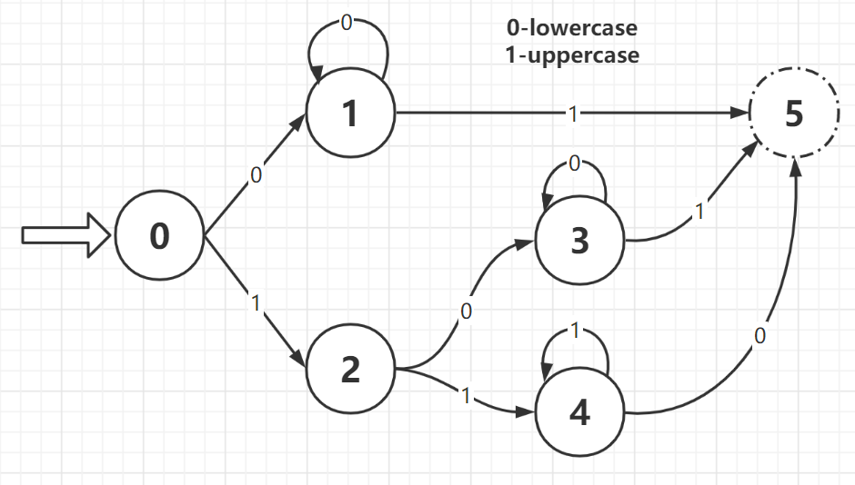

## 22. Generate Parentheses

给定一个数字 n，让生成共有 n 个括号的所有正确的形式。

1. 递归：

```cpp
class Solution {
public:
    vector<string> generateParenthesis(int n) {
        vector<string> res;
        string cur = "";
        int lp = n, rp = n;
        helper(res, cur, lp, rp);
        return res;
    }

    void helper(vector<string>& res, string cur, int lp, int rp) {
        if (lp == 0) {
            res.push_back(cur + string(rp-lp, ')'));
            return;
        }
        helper(res, cur + "(", lp-1, rp);
        if (lp < rp) helper(res, cur + ")", lp, rp-1);
    }
};
```

## 149. Max Points on a Line

给了一堆二维点，求最大的共线点的个数。

判断三点共线的方法：A(ax,ay), B(bx,by), C(cx,cy)

1. 斜率解法：判断 `(ay-by)/(ax-bx) == (cy-by)/(cx-bx)`
   - 当 `ax == bx` 或 `cx == bx` 时需要特殊判断，注意使用 gcd 化简分子分母比较，不要使用浮点结果比较，可能会有误差
2. 周长判断解法：排序周长 `AC > AB > BC`，判断 `AC == AB + BC`
   - 由于 sqrt 开方运算会导致结果不准确，不稳定，在三角形接近扁平时，结果有误差。
3. 最优解法：面积判断，判断 `area(ABC) == 0`
   - `area(ABC) = 1/2 * ( AC X BC )  = 1/2 *((ax-cx)*(by-cy)-(bx-cx)*(ay-cy))`
   - 判断 `(ax-cx)*(by-cy) == (bx-cx)*(ay-cy)` 即可

4. 暴力解法 O(n^3)：

**边界条件**

1. 当两个点重合时，无法确定一条直线，但这也是共线的情况
2. 斜率不存在的情况，由于两个点 (x1, y1) 和 (x2, y2) 的斜率k表示为 (y2 - y1) / (x2 - x1)，那么当 x1 = x2 时斜率不存在。

```cpp
// 2020-07-19 submission
class Solution {
public:
    int maxPoints(vector<vector<int>>& points) {
        if (points.empty()) return 0;
        int max_num = 0;
        for (int i = 0; i < points.size(); i++) {
            map<pair<int, int>, int> collect;
            int max_cur = 0;
            for (int j = 0; j < points.size(); j++) {
                max_cur = max(max_cur, gcd(points[i][0]-points[j][0], points[i][1]-points[j][1], collect));
            }
            max_num = max(max_num, max_cur + collect[pair<int, int>{0, 0}]);
            // cout << max_num <<endl;
        }
        return max_num;
    }

    int gcd(int x, int y, map<pair<int, int>, int>& collect) {
        int cnt = 0;
        if ( x == 0 && y == 0) {
            ++collect[pair<int, int>{0, 0}];
        }
        else if (x == 0) {
            cnt = ++collect[pair<int, int>{0, 1}];
        }
        else if (y == 0) {
            cnt = ++collect[pair<int, int>{1, 0}];
        }
        else {
            int t = 0;
            int a = abs(x), b = abs(y), op = abs(x)/x*abs(y)/y;
            while(b > 0) {
                t = a % b;
                a = b;
                b = t;
            }
            cnt = ++collect[pair<int, int>{abs(x)/a*op, abs(y)/a}];
        }
        return cnt;
    }
};
```

```cpp
class Solution {
public:
    int maxPoints(vector<vector<int>>& points) {
        int res = 0;
        for (int i = 0; i < points.size(); ++i) {
            int duplicate = 1;
            for (int j = i + 1; j < points.size(); ++j) {
                int cnt = 0;
                long long x1 = points[i][0], y1 = points[i][1];
                long long x2 = points[j][0], y2 = points[j][1];
                if (x1 == x2 && y1 == y2) {++duplicate; continue;}
                for (int k = 0; k < points.size(); ++k) {
                    int x3 = points[k][0], y3 = points[k][1];
                    if (x1 * y2 + x2 * y3 + x3 * y1 - x3 * y2 - x2 * y1 - x1 * y3 == 0) {
                        ++cnt;
                    }
                }
                res = max(res, cnt);
            }
            res = max(res, duplicate);
        }
        return res;
    }
};
```

## 103. Binary Tree Zigzag Level Order Traversal

二叉树的之字形层序遍历

```cpp
class Solution {
public:
    vector<vector<int>> zigzagLevelOrder(TreeNode* root) {
        vector<vector<int>> vec;
        pushOrder(root, vec, 0);
        for(int i = 1; i < vec.size(); i+=2) {
            reverse(vec[i].begin(), vec[i].end());
        }
        return vec;
    }

    void pushOrder(TreeNode*root, vector<vector<int>>& vec, int depth) {
        if(root == NULL) return;
        if(vec.size() - depth <= 0) vec.resize(depth+1);
        vec[depth].push_back(root->val);
        pushOrder(root->left, vec, depth+1);
        pushOrder(root->right, vec, depth+1);
    }
};
```


## 111. Minimum Depth of Binary Tree

二叉树的最小深度。

```cpp

```

## 307. Range Sum Query - Mutable


## 214. Shortest Palindrome

在给定字符串 s 的前面加上尽可能少的字符，使之变成回文串。

## 97. Interleaving String

给定字符串 s1，s2 和 s3，问 s3 是不是由 s1 和 s2 的交织字符串组成

1. 动态规划
   - 前提：字符串 s1 和 s2 的长度和必须等于 s3 的长度
   - 初始化：若 s1 和 s2 其中的一个为空串的话，那么另一个肯定和 s3 的长度相等，则按位比较
   - 在任意非边缘位置 `dp[i][j]` 时，它的左边或上边有可能为 True 或是 False，两边都可以更新过来，只要有一条路通着，那么这个点就可以为 True
   - 转移方程：`dp[i][j] = (dp[i - 1][j] && s1[i - 1] == s3[i - 1 + j]) || (dp[i][j - 1] && s2[j - 1] == s3[j - 1 + i])`;

**边界条件**

1. s1 或者 s2 为空

```cpp
// 2020-09-14 submission
// ?/? cases passed
// Runtime: 8 ms, faster than 47.16% of C++ online submissions.
// Memory Usage: 6.4 MB, less than 70.29% of C++ online submissions.
class Solution {
public:
    bool isInterleave(string s1, string s2, string s3) {
        int c1 = s1.length(), c2 = s2.length();
        if (c1 + c2 != s3.length()) return false;
        vector<bool> dp(c1 + 1, true);

        for (int i = 1; i <= c1; i++) {
            dp[i] = (s1.substr(0, i) == s3.substr(0, i));
        }
        for (int i = 1; i <= c2; i++) {
            dp[0] = (s2.substr(0, i) == s3.substr(0, i));
            for (int j = 1; j <= c1; j++) {
                dp[j] = (dp[j-1] && s1[j-1]==s3[i+j-1]) || (dp[j] && s2[i-1]==s3[i+j-1]);
                // cout << s1[j-1] << " " << s2[i-1] << endl;
            }
        }

        return dp[c1];
    }
};
```

## 91. Decode Ways

编码的可能性，比如 "12" 可以解码为 "AB" 或 "L"。

1. 动态规划

## 10. Regular Expression Matching

正则匹配：`.` 匹配任意单个字符，`*` 匹配 0 个或多个前置字符。

1. 正则匹配
   - sp 和 pp 都到了末尾，表示匹配结束
   - 如果 p[pp+1] 为 *，

```cpp
class Solution {
public:
    bool isMatch(string s, string p) {
        return helper(s, p, 0, 0);
    }

    bool helper(string& s, string& p, int sp, int pp) {
        if(sp == s.size() && pp == p.size()) return true;
        if(pp+1 < p.size() && p[pp+1] == '*') {
            if(sp < s.size() && (p[pp] == '.' || p[pp]==s[sp])) {
                if(helper(s, p, sp+1, pp)) return true;
            }
            return helper(s, p, sp, pp+2);
        }
        if(sp < s.size() && (p[pp] == '.' || p[pp] == s[sp])) return helper(s, p, sp+1, pp+1);
        else return false;
    }
};
```

## 4. Median of Two Sorted Arrays

求两个有序数组的中位数，限制时间复杂度为 O(log (m+n))

1. 二分法+递归:
   - 假设两个有序数组的长度分别为 m 和 n，找第 $(m+n+1) / 2$ 个，和 $(m+n+2) / 2$ 个，然后求其平均值即可
   - 在两个有序数组中找到第 $K$ 个元素，分别在 nums1 和 nums2 中查找第 $K/2$ 个元素，由于两个数组的长度不定，所以有可能某个数组没有第 $K/2$ 个数字
   - 如果不存在第 K/2 个数字，赋值上一个整型最大值
   - 如果第一个数组的第 K/2 个数字小的话，那么说明要找的数字肯定不在 nums1 中的前 K/2 个数字，可以将其淘汰
   - 当某一个数组的起始位置大于等于其数组长度时，说明其所有数字均已经被淘汰了，相当于一个空数组，那么实际上就变成了在另一个数组中找数字，直接就可以找出来了
   - 如果 $K=1$ 的话，只要比较 nums1 和 nums2 的起始位置 i 和 j 上的数字即可
2. 二分法+迭代
   - 中位数其实就是把一个有序数组分为长度相等的两段，然后取前半段的最大值和后半段的最小值的平均数
   - 使用 L 表示分割点左边的数字，R 表示分割点右边的数字，则对于 [1 3 5 7] 来说，L=3，R=5。对于 [1 3 4 5 7] 来说，L=4，R=4
   - $idx(L)= (N-1)/2$，$idx(R) = N/2$，idx 表示 Index of，对应下标。中位数可以表示为 $(L + R) / 2 = (A[(N - 1) / 2] + A[N / 2]) / 2$
   - 为了统一数组长度为奇数和偶数的情况，在每个数字的两边都加上一个特殊字符 `#`

```cpp
class Solution {
public:
    double findMedianSortedArrays(vector<int>& nums1, vector<int>& nums2) {
        int m = nums1.size(), n = nums2.size(), left = (m + n + 1) / 2, right = (m + n + 2) / 2;
        return (findKth(nums1, 0, nums2, 0, left) + findKth(nums1, 0, nums2, 0, right)) / 2.0;
    }

    int findKth(vector<int>& nums1, int i, vector<int>& nums2, int j, int k) {
        if (i >= nums1.size()) return nums2[j + k - 1];
        if (j >= nums2.size()) return nums1[i + k - 1];
        if (k == 1) return min(nums1[i], nums2[j]);
        int midVal1 = (i + k / 2 - 1 < nums1.size()) ? nums1[i + k / 2 - 1] : INT_MAX;
        int midVal2 = (j + k / 2 - 1 < nums2.size()) ? nums2[j + k / 2 - 1] : INT_MAX;
        if (midVal1 < midVal2) {
            return findKth(nums1, i + k / 2, nums2, j, k - k / 2);
        } else {
            return findKth(nums1, i, nums2, j + k / 2, k - k / 2);
        }
    }
};
```

```cpp
class Solution {
public:
    double findMedianSortedArrays(vector<int>& nums1, vector<int>& nums2) {
        int m = nums1.size(), n = nums2.size();
        if (m < n) return findMedianSortedArrays(nums2, nums1);
        if (n == 0) return ((double)nums1[(m - 1) / 2] + (double)nums1[m / 2]) / 2.0;
        int left = 0, right = n * 2;
        while (left <= right) {
            int mid2 = (left + right) / 2;
            int mid1 = m + n - mid2;
            double L1 = mid1 == 0 ? INT_MIN : nums1[(mid1 - 1) / 2];
            double L2 = mid2 == 0 ? INT_MIN : nums2[(mid2 - 1) / 2];
            double R1 = mid1 == m * 2 ? INT_MAX : nums1[mid1 / 2];
            double R2 = mid2 == n * 2 ? INT_MAX : nums2[mid2 / 2];
            if (L1 > R2) left = mid2 + 1;
            else if (L2 > R1) right = mid2 - 1;
            else return (max(L1, L2) + min(R1, R2)) / 2;
        }
        return -1;
    }
};
```

## 85. Maximal Rectangle

解题思路

1. 参见 `##84` 思路，同样是要先确定高度和宽度再得到最大面积
2. 维护三个数组（左连续序列长度、右连续序列长度、高度）
   左连续序列长度：指从左边开始计数到当前位置，连续的高于当前高度的序列长度（包括当前位置）
   右连续序列长度：指从右边开始计数到当前位置，连续的高于当前高度的序列长度（包括当前位置）
3. 进行行遍历
    + 若当前位置为“1”，要考虑上一侧行遍历序列长度是否大于 0。如果大于0说明正上面位置为“1”，则取连续的行“1”长度和上一次序列遍历长度的最小值，否则，直接认为序列长度为连续的行“1”长度。
    + 若当前位置为“0”，序列长度直接置0

边界条件

1. 矩阵为空

```cpp
// 2020-09-15 submission
// ?/? cases passed
// Runtime: 48 ms, faster than 93.31% of C++ online submissions.
// Memory Usage: 11.1 MB, less than 87.63% of C++ online submissions.
class Solution {
public:
    int maximalRectangle(vector<vector<char>>& matrix) {
        if (matrix.empty() || matrix[0].empty()) return 0;
        int rows = matrix.size();
        int cols = matrix[0].size();

        int max_area = 0;
        vector<int> left_seq(cols, INT_MAX);
        vector<int> right_seq(cols, INT_MAX);
        vector<int> height(cols, 0);
        int continous = 0;

        for (int i = 0; i < rows; i++) {
            continous = 0;
            for (int j = cols-1; j >= 0; j--) {
                if (matrix[i][j] == '1') continous++;
                else continous = 0;
                height[j] = continous == 0 ? 0 : height[j] + 1;
                right_seq[j] = right_seq[j] == 0 ? continous : min(right_seq[j], continous);
            }

            continous = 0;
            for (int j = 0; j < cols; j++) {
                if (matrix[i][j] == '1') continous++;
                else continous = 0;
                left_seq[j] = left_seq[j] == 0 ? continous : min(left_seq[j], continous);
                max_area = max(max_area, height[j]*(left_seq[j]+right_seq[j]-1));
            }
        }

        return max_area;
    }
};
```

## 87. Scramble String

解题思路

1. s1 和 s2 是 scramble 的话，那么必然存在一个在 s1 上的长度 l1，将 s1 分成 s11 和 s12 两段，同样有 s21 和 s22，那么要么 s11 和 s21 是 scramble 的并且 s12 和 s22 是 scramble 的；要么 s11 和 s22 是 scramble 的并且 s12 和 s21 是 scramble 的。
2. 递归方法是将字符串按照不同长度进行切割，然后让子递归函数判断是否成立。
注意一个词和它自身是 scramble 的。
3. 为了减少复杂度，每次切割前可以采用排序或者统计字母频率等。

```cpp
// 2020-07-16 submission
// ?/? cases passed
// Runtime: 12 ms, faster than 79.75% of C++ online submissions
// Memory Usage: 8.9 MB, less than 73.29% of C++ online submissions
class Solution {
public:
    bool isScramble(string s1, string s2) {
        if (s1.size() != s2.size()) return false;
        if(s1 == s2) return true;
        int len = s1.length();

        int freq[26] = {0};
        for (int i = 0; i < len; i++) {
            ++freq[s1[i]-'a'];
            --freq[s2[i]-'a'];
        }
        for (int i = 0; i < 26; i++) {
            if (freq[i] != 0) return false;
        }

        for (int i = 1; i < len; i++) {
            string s11 = s1.substr(0, i);
            string s12 = s1.substr(i);
            string s21 = s2.substr(0, i);
            string s22 = s2.substr(i);
            if (isScramble(s11, s21) && isScramble(s12, s22)) return true;

            s21 = s2.substr(0, len - i);
            s22 = s2.substr(len - i);
            if (isScramble(s11, s22) && isScramble(s12, s21)) return true;
        }
        return false;
    }
};
```

## 57. Insert Interval

解题思路：从最左边遍历待插入区间，如果遍历区间右边界小于新区间左边界，将遍历区间加入结果，否则跳出循环。然后正式对交叉的区间进行处理，注意每次处理前都要判断是否重叠（因为有可能出现新区建在最左边和最右边的情况），然后取左边界最小值和右边界最大值作为新区间。不重叠时候跳出循环，将新区间加入结果，最后把剩下的待插入区间遍历完即可，所以有三个阶段。
边界条件：待插列表为空；新区间在最左边或者最右边；插入区间为空（标准程序没有注意到）

// 2020-07-14 submission
// ?/? cases passed
// Runtime: 32 ms, faster than 64.68% of C++ online submissions
// Memory Usage: 17.1 MB, less than 63.69% of C++ online submissions
class Solution {
public:
    vector<vector<int>> insert(vector<vector<int>>& intervals, vector<int>& newInterval) {
        if (newInterval.empty()) return vector<vector<int>>(intervals.begin(), intervals.end());
        vector<vector<int>> res;
        int cnt = intervals.size();

        int cur = 0;
        while(cur < cnt) {
            if (intervals[cur][1] < newInterval[0])
                res.push_back(intervals[cur++]);
            else
                break;
        }

        vector<int> temp_interval(newInterval.begin(), newInterval.end());
        for (; cur < cnt; cur++) {
            if (judge(temp_interval, intervals[cur])) {
                temp_interval[0] = min(temp_interval[0], intervals[cur][0]);
                temp_interval[1] = max(temp_interval[1], intervals[cur][1]);
            }
            else
                break;
            // cout << "interval " << temp_interval[0] << " " << temp_interval[1] << endl;
        }
        res.push_back(temp_interval);

        while(cur < cnt) {
            res.push_back(intervals[cur++]);
        }
        return res;
    }

    bool judge(vector<int>& A, vector<int>& B) {
        return (A[1] >= B[0] && A[0] <= B[1]) || (B[1] >= A[0] && B[0] <= A[1]);
    }
};

## 123. Best Time to Buy and Sell Stock III

股票交易，买进前必须卖出手头已有的，允许最多两次交易

1. 在数组中间画条线，在左边进行第一次交易，在右边进行第二次交易，来计算两次交易的最大收益和。这样，就将问题简化为只进行一次交易的问题了。维护两个数组，分别存储截止到第 $x$ 日交易的最大利润和第 $x$ 日之后交易的最大利润。

```cpp
// 2020-07-23 submission
class Solution {
public:
    int maxProfit(vector<int>& prices) {
        if (prices.empty()) return 0;
        int days = prices.size();
        vector<int> front(days, 0), latter(days, 0);

        int min_price = prices[0], max_price = prices[days-1];
        for (int i = 1; i < days; i++) {
            min_price = min(min_price, prices[i]);
            front[i] = max(front[i-1], prices[i]-min_price);
            // cout << "front " << prices[i] << " " << front[i] << endl;
        }
        for (int i = days - 2; i >= 0; i--) {
            max_price = max(max_price, prices[i]);
            latter[i] = max(latter[i+1], max_price-prices[i]);
            // cout << "latter " << prices[i] << " " << latter[i] << endl;
        }

        int max_profit = 0;
        for (int pivot = 0; pivot < days; pivot++) {
            max_profit = max(max_profit, front[pivot]+latter[pivot]);
        }
        return max_profit;

    }
};
```

## 306. Additive Number

给定字符串能否拆成斐波那契数列

## 146. LRU Cache

实现一个 LRU 缓存器，要求 `get` 和 `put` 方法为 O(1) 时间复杂度。

1. 双向链表+哈希表
   - 双向链表实现：dummy node，减少边界处理复杂度，并实现三个辅助函数
   - put 实现：

```cpp
// 2020-09-18 submission
struct ListNode
{
    int key;
    int value;
    struct ListNode* next;
    struct ListNode* prev;
    explicit ListNode(int key, int value) : key(key), value(value), next(nullptr), prev(nullptr){}
};

class LRUCache {
public:

    LRUCache(int capacity) {
        this->size = 0;
        this->capacity = capacity;
        this->dummyHead = new ListNode(0);
        this->dummyTail = new ListNode(0);
        this->dummyHead->next = this->dummyTail;
        this->dummyTail->prev = this->dummyHead;
    }

    int get(int key) {
        if (!cache.count(key)) return -1;
        else {
            ListNode* node = m[key];
            int value = node->second;
            this->moveNodeToHead(node);
            return value;
        }
    }

    void put(int key, int value) {
        if (m.count(key)) {
            this->moveNodeToHead(node);
        }
        else {
            ListNode* node = new ListNode(key, value);
            this->addNodeToHead(node);
            m[key] = node;
            ++size;
            while (capacity < size) {
                ListNode* tailNode = this->dummyTail->prev;
                m.erase(tailNode->key);
                this->removeNodeFromList(tailNode);
                --size;
            }
        }
    }

private:
    int addNodeToHead(ListNode* node) {
        if (node == nullptr) {
            return -1;
        }
        node->next = this->dummyHead->next;
        this->dummyHead->next = node;
        node->prev = this->dummyHead;
        node->next->prev = node;
        return 0;
    }

    int moveNodeToHead(ListNode* node) {
        if (node == nullptr) {
            return -1;
        }
        node->next->prev = node->prev;
        node->prev->next = node->next;
        return addNodeToHead(node);
    }

    int removeNodeFromList(ListNode* node) {
        if (node == nullptr) {
            return -1;
        }
        node->next->prev = node->prev;
        node->prev->next = node->next;
        delete node;
        return 0;
    }

private:
    uint32_t size;
    uint32_t capacity;
    struct ListNode* dummyHead;
    struct ListNode* dummyTail;
    std::unordered_map<int, struct ListNode*> cache;
};

/**
 * Your LRUCache object will be instantiated and called as such:
 * LRUCache* obj = new LRUCache(capacity);
 * int param_1 = obj->get(key);
 * obj->put(key,value);
 */
```

## 131. Palindrome Partitioning

拆分回文子字符串，求出所有的拆分组合。

## 132. Palindrome Partitioning II


! ## 218

1

1

```cpp

```

## 560. Subarray Sum Equals K

解题思路

1. 用一个哈希表来建立连续子数组之和跟其出现次数之间的映射，初始化要加入 {0,1} 这对映射。建立哈希表的目的是为了让我们可以快速的查找 sum-k 是否存在，即是否有连续子数组的和为 sum-k，如果存在的话，那么和为k的子数组一定也存在

```cpp
// 2021-03-17 submission
// Runtime: 84 ms, faster than 74.74% of C++ online submissions for Subarray Sum Equals K.
// Memory Usage: 42 MB, less than 21.64% of C++ online submissions for Subarray Sum Equals K.
class Solution {
public:
    int subarraySum(vector<int>& nums, int k) {
        unordered_map<int, int> dp{{0 ,1}};
        int sum = 0, res = 0;
        for (int num : nums) {
            sum += num;
            res += dp[sum - k];
            ++dp[sum];
        }
        return res;
    }
};
```

## 409

```cpp
// 2021-12-23 submission
// 95/95 cases passed
// Runtime: 4 ms, faster than 71.27% of C++ online submissions.
// Memory Usage: 6.6 MB, less than 46.27% of C++ online submissions.
class Solution {
public:
    int longestPalindrome(string s) {
        unordered_map<char, int> m;
        for (char c : s) {
            ++m[c];
        }
        int odd_cnt = 0, even_cnt = 0;
        for (auto it = m.begin(); it != m.end(); ++it) {
            if (it->second % 2 == 0) even_cnt += it->second;
            else {
                even_cnt += (it->second - 1);
                odd_cnt = 1;
            }
        }
        return odd_cnt + even_cnt;
    }
};
```

## 501

1. 先序遍历+哈希表计数
2. 递归中序遍历:不用除了递归中的隐含栈之外的额外空间。二分搜索树的中序遍历结果是有序的。
3. 迭代中序遍历。

```cpp
// 2021-12-21 submission
// 23/23 cases passed
// Runtime: 20 ms, faster than 64.74% of C++ online submissions.
// Memory Usage: 29.3 MB, less than 5.03% of C++ online submissions.
/**
 * Definition for a binary tree node.
 * struct TreeNode {
 *     int val;
 *     TreeNode *left;
 *     TreeNode *right;
 *     TreeNode() : val(0), left(nullptr), right(nullptr) {}
 *     TreeNode(int x) : val(x), left(nullptr), right(nullptr) {}
 *     TreeNode(int x, TreeNode *left, TreeNode *right) : val(x), left(left), right(right) {}
 * };
 */
class Solution {
public:
    vector<int> findMode(TreeNode* root) {
        unordered_map<int, int> m;
        int max_val = DFS(root, m);

        vector<int> res;
        for (auto it = m.begin(); it != m.end(); ++it) {
            if (it->second == max_val)
                res.push_back(it->first);
        }
        return res;
    }

    int DFS(TreeNode* root, unordered_map<int, int>& m) {
        if (!root) return 0;
        ++m[root->val];
        return max(max(DFS(root->left, m), DFS(root->right, m)), m[root->val]);
    }
};
```

```cpp
// 2021-12-21 submission
// 23/23 cases passed
// Runtime: 24 ms, faster than 43.63% of C++ online submissions.
// Memory Usage: 29.2 MB, less than 5.03% of C++ online submissions.
class Solution {
public:
    vector<int> findMode(TreeNode* root) {
        TreeNode* pre = nullptr;
        vector<int> res;
        int cur = 1, int mx = 0;
        inorder(root, pre, res, cur, mx);
        return res;
    }

    void inorder(TreeNode* root, TreeNode* &pre, vector<int>& candidates, int& cur, int& mx) {
        if (!root) return;
        inorder(root->left, pre, candidates, cur, mx);
        if (pre) cur = pre->val == root->val ? cur+1 : 1;
        if (cur >= mx) {
            if (cur > mx) candidates.clear();
            mx = cur;
            candidates.push_back(root->val);
        }
        pre = root;
        inorder(root->right, pre, candidates, cur, mx);
    }
};
```

```cpp
// 2021-12-21 submission
// 23/23 cases passed
// Runtime: 28 ms, faster than 25.09% of C++ online submissions.
// Memory Usage: 29.1 MB, less than 6.61% of C++ online submissions.
class Solution {
public:
    vector<int> findMode(TreeNode* root) {
        if (!root) return {};
        vector<int> res;
        TreeNode* cur = root, *pre = nullptr;
        int cnt = 0, mx = 0;
        while (cur) {
            TreeNode* right_most = cur->left;
            if (right_most) {
                while (right_most->right != nullptr && right_most->right != cur) {
                    right_most = right_most->right;
                }
                if (right_most->right == nullptr) {
                    right_most->right = cur;
                    cur = cur->left;
                    continue;
                }
                else right_most->right = nullptr;
            }
            if (pre) cnt = (pre->val == cur->val) ? cnt+1 : 1;
            if (cnt >= mx) {
                if (cnt > mx) res.clear();
                mx = cnt;
                res.push_back(cur->val);
            }
            res.push_back(cur->val);
            cur = cur->right;
        }
        return res;
    }
};
```

## 520

1. 状态机：

```cpp
// 2021-12-21 submission
// 550/550 cases passed
// Runtime: 0 ms, faster than 100% of C++ online submissions.
// Memory Usage: 6.7 MB, less than 17.78% of C++ online submissions.
class Solution {
public:
    bool detectCapitalUse(string word) {
        vector<vector<int> > trans{
            {1, 2},
            {1, 5},
            {3, 4},
            {3, 5},
            {5, 4},
            {5, 5}
        };
        int state = 0;
        for (char c : word) {
            int next = isupper(c) ? 1 : 0;
            state = trans[state][next];
            if (state == 5) break;
        }
        return state != 5;
    }
};
```

## 530
## 606

```cpp
// 2021-12-23 submission
// 160/160 cases passed
// Runtime: 16 ms, faster than 84.13% of C++ online submissions.
// Memory Usage: 66.6 MB, less than 15.49% of C++ online submissions.
/**
 * Definition for a binary tree node.
 * struct TreeNode {
 *     int val;
 *     TreeNode *left;
 *     TreeNode *right;
 *     TreeNode() : val(0), left(nullptr), right(nullptr) {}
 *     TreeNode(int x) : val(x), left(nullptr), right(nullptr) {}
 *     TreeNode(int x, TreeNode *left, TreeNode *right) : val(x), left(left), right(right) {}
 * };
 */
class Solution {
public:
    string tree2str(TreeNode* root) {
        if (!root) return "()";
        string res = to_string(root->val), lres, rres;
        if (root->left) lres = tree2str(root->left);
        if (root->right) rres = tree2str(root->right);
        if (root->right) {
            res += ("(" + lres + ")(" + rres + ")");
        } else if (root->left) {
            res += ("(" + lres + ")");
        }
        return res;
    }
};
```

## 637

```cpp
// 2021-12-21 submission
// 66/66 cases passed
// Runtime: 12 ms, faster than 85.36% of C++ online submissions.
// Memory Usage: 22.5 MB, less than 72.82% of C++ online submissions.
/**
 * Definition for a binary tree node.
 * struct TreeNode {
 *     int val;
 *     TreeNode *left;
 *     TreeNode *right;
 *     TreeNode() : val(0), left(nullptr), right(nullptr) {}
 *     TreeNode(int x) : val(x), left(nullptr), right(nullptr) {}
 *     TreeNode(int x, TreeNode *left, TreeNode *right) : val(x), left(left), right(right) {}
 * };
 */
class Solution {
public:
    vector<double> averageOfLevels(TreeNode* root) {
        queue<TreeNode*> q;
        vector<double> res;
        if (root) q.push(root);
        while (!q.empty()) {
            int q_size = q.size();
            double level_sum = 0;
            for (int i = 0; i < q_size; i++) {
                level_sum += q.front()->val;
                if (q.front()->left) q.push(q.front()->left);
                if (q.front()->right) q.push(q.front()->right);
                q.pop();
            }
            res.push_back(level_sum / q_size);
        }
        return res;
    }
};
```


## 696

1. 动态规划：dp[i] 表示截止到 i 位置且包含 i 位置的有效字符长度，分两种情况讨论。s[i] == s[i-1] 时，就要将 dp[i-1] 视为内字符串，在内字符串的两边加上 s[i] 和 s[i-dp[i-1]-1]，要求这两个字符不能相同；s[i] != s[i-1] 时，就可以直接视作长度为 2 的有效字符串。

```cpp
// 2021-12-22 submission
// 91/91 cases passed
// Runtime: 20 ms, faster than 93.86% of C++ online submissions.
// Memory Usage: 14.6 MB, less than 6.24% of C++ online submissions.
class Solution {
public:
    int countBinarySubstrings(string s) {
        int res = 0;
        vector<int> dp(s.length(), 0);
        for (int i = 1; i < s.length(); i++) {
            if (s[i] != s[i-1]) {
                dp[i] = 2;
                res += 1;
            }
            else if(i-dp[i-1]-1>=0 && s[i-dp[i-1]-1]!=s[i]) {
                dp[i] = dp[i-1] + 2;
                res += 1;
            }
        }
        return res;
    }
};
```


## 458. Poor Pigs

1000 瓶水中 1 瓶有毒，猪喝了毒水 15 分钟内会死亡，给定 1 个小时时间，求最少需要多少头猪能够定位到毒水。

## 449. Serialize and Deserialize BST

## 673. Number of Longest Increasing Subsequence

最长递增序列的个数。

## 695. Max Area of Island

## 686. Repeated String Match

## 684. Redundant Connection

删掉无向图中组成环的最后一条边，图中只有一条额外边。

## 685. Redundant Connection II

## 677. Map Sum Pairs

## 498. Diagonal Traverse

二维数组的对角遍历，先向右上，然后左下，再右上，以此类推直至遍历完整个数组。

## 327. Count of Range Sum

解题思路

1. 首先计算出一个累计和数组 accum，$$\text{accum}[i]=\text{accum}[i-1]+nums[i]$$ 那问题可以转化为求解所有的区间$(j, i]$，满足 $$lower <= \text{accum}[i]-\text{accum}[j] <= upper$$(亦可写成$\text{accum}[i]-\text{upper} <= \text{accum}[j] <= \text{accum}[i]-\text{lower}$)。
 然后利用 STL 里的 multiset 容器，lower_bound() 是找数组中第一个不小于给定值的数(包括等于情况)，而 upper_bound() 是找数组中第一个大于给定值的数，distance() 方法返回两个迭代器之间的距离。

边界条件

1. 出现 INT_MIN 和 INT_MAX

```cpp
// 2020-11-26 submission
// ?/? cases passed
// Runtime: 68 ms, faster than 48.47% of C++ online submissions.
// Memory Usage: 15.1 MB, less than 61.69% of C++ online submissions.
class Solution {
public:
    int countRangeSum(vector<int>& nums, int lower, int upper) {
        if (nums.empty()) return 0;
        multiset<long long> st{0};
        long long cur_sum = 0; // 后续有减法操作避免溢出
        int res = 0;
        for (int i = 0; i < nums.size(); i++) {
            cur_sum += nums[i];
            res += distance(st.lower_bound(cur_sum-upper), st.upper_bound(cur_sum-lower));
            st.insert(cur_sum); // why this expression after
        }
        return res;
    }
};
```

## 438. Find All Anagrams in a String

解题思路

1. 滑动窗口

```cpp
// 2021-03-18 submission
// ?/? cases passed
// Runtime: 16 ms, faster than 60.99% of C++ online submissions.
// Memory Usage: 8.6 MB, less than 53.85% of C++ online submissions.
class Solution {
public:
    vector<int> findAnagrams(string s, string p) {
        unordered_map<char, int> m;
        int len = p.length();
        for (char c : p)
            ++m[c];

        int l = 0;
        vector<int> res;
        for (int i = 0; i < s.length(); i++) {
            --m[s[i]];
            while (m[s[i]] < 0)
                ++m[s[l++]];
            if (i - l + 1 == len) res.push_back(l);
        }
        return res;
    }
};
```

## 494. Target Sum

给定一个非负整数数组和一个目标值，给数组中每个数字加上正号或负号，然后求和要和目标值相等。

1. BFS
2.

```cpp
// 2021-03-21 submission
class Solution {
public:
    int findTargetSumWays(vector<int>& nums, int S) {
        unordered_map<int, int> m;
        vector<pair<int, int>> can;
        m[0] = 1;
        for (int i = 0; i < nums.size(); i++) {
            for (auto it : m) {
                if (it.second > 0) {
                    can.push_back(make_pair(it.first+nums[i], it.second));
                    can.push_back(make_pair(it.first-nums[i], it.second));
                    m[it.first] = 0;
                }

            }
            for (auto it : can) {
                m[it.first] += it.second;
            }
            can.clear();
        }
        return m[S];
    }
};
```

## 543. Diameter of Binary Tree

```cpp
// 2021-03-17 submission
// ?/? cases passed
// Runtime: 16 ms, faster than 35.45% of C++ online submissions.
// Memory Usage: 23.1 MB, less than 5.27% of C++ online submissions.
/**
 * Definition for a binary tree node.
 * struct TreeNode {
 *     int val;
 *     TreeNode *left;
 *     TreeNode *right;
 *     TreeNode() : val(0), left(nullptr), right(nullptr) {}
 *     TreeNode(int x) : val(x), left(nullptr), right(nullptr) {}
 *     TreeNode(int x, TreeNode *left, TreeNode *right) : val(x), left(left), right(right) {}
 * };
 */
class Solution {
public:
    int diameterOfBinaryTree(TreeNode* root) {
        unordered_map<TreeNode*, int> m;
        int res = 0;
        maxDepth(root, res, m);
        return res;
    }
    int maxDepth(TreeNode* node, int& res, unordered_map<TreeNode*, int>& m) {
        if (!node) return 0;
        if (m.count(node)) return m[node];
        int left = maxDepth(node->left, res, m);
        int right = maxDepth(node->right, res, m);
        res = max(res, left + right);
        return m[node] = (max(left, right) + 1);
    }
};
```

## 316. Remove Duplicate Letters

移除重复字母，使得每个字符只能出现一次，而且结果要按字典顺序排列，不能打乱其原本的相对位置。

## 321. Create Maximum Number

给定两个无序数组，从两个数组中共挑出 k 个数，数字之间的相对顺序不变，求能组成的最大的数字。

由于k的大小不定，所以有三种可能：

第一种是当k为0时，两个数组中都不取数。

第二种是当k不大于其中任意一个数组的长度时，这种情况下，有可能只从一个数组中取数，或者两个都取一些。

第三种情况是k大于其中任意一个数组的长度，则需要从两个数组中分别取数，至于每个数组中取几个，每种情况都要考虑到，然后每次更结果即可。

为了同时能处理这三种情况，这里假设从数组 nums1 中取i个数，那么就需要从 nums2 中取 k-i 个数。那么i的范围如何确定呢？从情况二中知道，假如k不大于任意一个数组的长度，那么有可能只从其中一个数组中取k个，就是说可以不从 nums1 中取数，所以 i 最小可以取到0。如果是第三种情况，假设k大于 nums2 的长度，就算把 nums2 中所有的数字都取出来，都无法凑个k个，多余的 k-n2 个数字要从 nums1 中来取。所以只要比较 0 和 k-n2 的大小，取较大的为i的起始范围。那么i最大能到多大呢，还是要看 k 和 n1 的大小，如果 k 小于等于 n1，那么只需要取k个就行了，如果k大于 n1，那么只能在 nums1 中取 n1 个，多余的要到 nums2 中取。

好，现在知道了分别要从两个数组中取数字的情况，这里希望从 nums1 中取出的i个数字是最大的组合，同理，从 nums2 中取出的 k-i 个也是最大的数字组合。如何才能取出最大的组合呢？比如当前数组长度为n，需要取出k个数字，定义一个变量 drop = n - k，表示需要丢弃的数字的个数，遍历数组中的数字，进行下列循环，如果此时 drop 为整数，且结果数组长度不为0，结果数组的尾元素小于当前遍历的元素，则去掉结果数组的尾元素，此时 drop 自减1，重复循环直至上述任意条件不满足为止，然后把当前元素加入结果数组中，最后返回结果数组中的前k个元素。

现在分别从 nums1 中取出了i个最大组合的数字，从 nums2 中取出了 k-i 个最大组合的数字，最后一步就是需要将两个取出的数组混合排序成一个数组，小数组中各自的数字之间的相对顺序不变。对于两个数组的混合，要比较了两个数组的大小（按元素比较），然后从当前比较大的数组里取头一个元素，然后删除头元素到下次再接着比较，直到两个数组都为空停止。

```cpp
class Solution {
public:
    vector<int> maxNumber(vector<int>& nums1, vector<int>& nums2, int k) {
        int n1 = nums1.size(), n2 = nums2.size();
        vector<int> res;
        for (int i = max(0, k - n2); i <= min(k, n1); ++i) {
            res = max(res, mergeVector(maxVector(nums1, i), maxVector(nums2, k - i)));
        }
        return res;
    }

    vector<int> maxVector(vector<int>& nums, int k) {
        int drop = (int)nums.size() - k;
        vector<int> res;
        for (int num : nums) {
            while (drop > 0 && !res.empty() && res.back() < num) {
                res.pop_back();
                --drop;
            }
            res.push_back(num);
        }
        res.resize(k);
        return res;
    }

    vector<int> mergeVector(vector<int> nums1, vector<int> nums2) {
        vector<int> res;
        while (!nums1.empty() || !nums2.empty()) {
            vector<int> &tmp = (nums1 > nums2) ? nums1 : nums2;
            res.push_back(tmp[0]);
            tmp.erase(tmp.begin());
        }
        return res;
    }
};
```

## 436 Find Right Interval

## 435 Non-overlapping Intervals

## 434 Number of Segments in a String

## 433 Minimum Genetic Mutation

## 432 All O`one Data Structure

## 430 Flatten a Multilevel Doubly Linked List

## 429 N-ary Tree Level Order Traversal

## 437 Path Sum III
