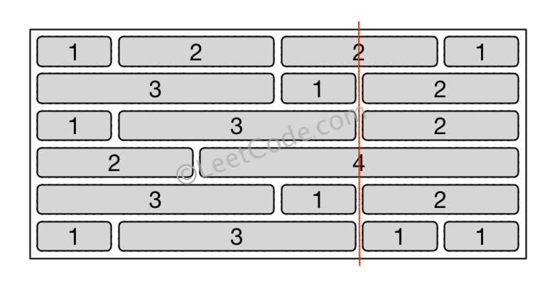
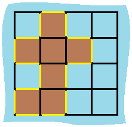
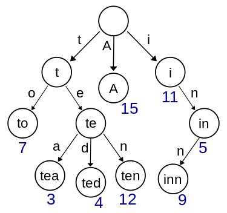

## 8. String to Integer (atoi)

字符串转为整数

1. 若字符串开头是空格，则跳过所有空格，到第一个非空格字符，如果没有，则返回0.
2. 若第一个非空格字符是符号 +/-，则标记 sign 的真假，这道题还有个局限性，那就是在 c++ 里面，+-1 和-+1 都是认可的，都是 -1，而在此题里，则会返回0.
3. 若下一个字符不是数字，则返回0，完全不考虑小数点和自然数的情况。
4. 如果下一个字符是数字，则转为整型存下来，若接下来再有非数字出现，则返回目前的结果。
5. 还需要考虑边界问题，如果超过了整型数的范围，则用边界值替代当前值。

```cpp
class Solution {
public:
    int myAtoi(string str) {
        if (str.empty()) return 0;
        int sign = 1, base = 0, i = 0, n = str.size();
        while (i < n && str[i] == ' ') ++i;
        if (i < n && (str[i] == '+' || str[i] == '-')) {
            sign = (str[i++] == '+') ? 1 : -1;
        }
        while (i < n && str[i] >= '0' && str[i] <= '9') {
            if (base > INT_MAX / 10 || (base == INT_MAX / 10 && str[i] - '0' > 7)) {
                return (sign == 1) ? INT_MAX : INT_MIN;
            }
            base = 10 * base + (str[i++] - '0');
        }
        return base * sign;
    }
};
```

## 7. Reverse Integer

数字翻转，注意溢出问题。

1. 从最后一位数字开始算，每次需要判断是否大于 INT_MAX / 10，否则返回 0.

Follow Up

1. 为什么不需要判断等于 INT_MAX / 10

```cpp
class Solution {
public:
    int reverse(int x) {
        int res = 0;
        while (x != 0) {
            if (abs(res) > INT_MAX / 10) return 0;
            res = res * 10 + x % 10;
            x /= 10;
        }
        return res;
    }
};
```

## 6. ZigZag Conversion

给定字符串和行数，将其进行 “之” 形变换后，输出逐行读取的结果。

``txt
当 n = 2 时：

0 2 4 6 8 A C E
1 3 5 7 9 B D F

result: 0 2 4 6 8 A C E 1 3 5 7 9 B D F

当 n = 3 时：

0   4   8   C
1 3 5 7 9 B D F
2   6   A   E

当 n = 4 时：

0     6     C
1   5 7   B D
2 4   8 A   E
3     9     F
``

1. 找规律
   - 第一行和最后一行没有中间形成之字型的数字中，相邻两个元素的 index 之差为 2*nRows - 2。
   - 除了第一行和最后一行，中间数字每两个非紧靠的数字的 index 之差为 2 x numRows-2 - 2 x i，i 为当前行数。

```cpp
class Solution {
public:
    string convert(string s, int numRows) {
        if (numRows <= 1) return s;
        string res;
        int size = 2 * numRows - 2, n = s.size();
        for (int i = 0; i < numRows; ++i) {
            for (int j = i; j < n; j += size) {
                res += s[j];
                int pos = j + size - 2 * i;
                if (i != 0 && i != numRows - 1 && pos < n) res += s[pos];
            }
        }
        return res;
    }
};
```

## 41

找缺失的首个正数，限定 O(n) 时间复杂度和不使用额外空间。

1. 把 1 放在数组第一个位置 nums[0]，2 放在第二个位置 nums[1]，即需要把 nums[i] 放在 nums[nums[i] - 1] 上。遍历整个数组，如果 nums[i] != i + 1, 而 nums[i] 为整数且不大于n，另外 nums[i] 不等于 nums[nums[i] - 1] 的话，将两者位置调换，如果不满足上述条件直接跳过，最后再遍历一遍数组，如果对应位置上的数不正确则返回正确的数。

```cpp
class Solution {
public:
    int firstMissingPositive(vector<int>& nums) {
        int n = nums.size();
        for (int i = 0; i < n; ++i) {
            while (nums[i] > 0 && nums[i] <= n && nums[nums[i] - 1] != nums[i]) {
                swap(nums[i], nums[nums[i] - 1]);
            }
        }
        for (int i = 0; i < n; ++i) {
            if (nums[i] != i + 1) return i + 1;
        }
        return n + 1;
    }
};
```

## 680. Valid Palindrome II

验证回文字符串，允许最多删除其中 1 个字符。

1. 遇到不匹配的时候，是删除左边的字符，还是右边的字符呢，应该是两种情况都要算一遍，只要有一种能返回 true，那么结果就返回 true。

```cpp
class Solution {
public:
    bool validPalindrome(string s) {
        int left = 0, right = (int)s.length() - 1;
        while (left < right) {
            if (s[left] != s[right]) return isValid(s, left, right - 1) || isValid(s, left + 1, right);
            ++left; --right;
        }
        return true;
    }

    bool isValid(string s, int left, int right) {
        while (left < right) {
            if (s[left] != s[right]) return false;
            ++left; --right;
        }
        return true;
    }
};
```

## 485. Max Consecutive Ones

求二进制数组中最大连续 1 的个数。

1. 遍历一遍数组，用一个计数器 cnt 来统计 1 的个数
2. 数组中的数字只能是 0 或 1，那么连续 1 的和跟个数相等，所以可以计算和，通过加上 num，再乘以 num 来计算

```cpp
class Solution {
public:
    int findMaxConsecutiveOnes(vector<int>& nums) {
        int res = 0, cnt = 0;
        for (int num : nums) {
            if (num == 0) cnt = 0;
            else ++cnt;
            res = max(res, cnt);
        }
        return res;
    }
};
```

```cpp
class Solution {
public:
    int findMaxConsecutiveOnes(vector<int>& nums) {
        int res = 0, sum = 0;
        for (int num : nums) {
            sum = (sum + num) * num;
            res = max(res, sum);
        }
        return res;
    }
};
```

## 326. Power of Three

判断一个数是不是3的次方数。

1. 暴力解法: 不停地除以3，看最后的迭代商是否为1，要注意考虑输入是负数和0的情况。
2. 由于输入是int，正数范围是0-231，在此范围中允许的最大的3的次方数为3^19=1162261467，只要看这个数能否被n整除即可。
3. 换底公式
   - $log_{a}^{b} = log_{c}^{b} / log_{c}^{a}$，则 $log_{3}^{n} = log_{10}^{n} / log_{10}^{3}$
   - 如果 n 是 3 的倍数，则 $log_{3}^{n}$ 一定是整数
   - 所以只要判断 $log_{10}^{n} / log_{10}^{3}$ 是否为整数
   - C++ 中判断数字 a 是否为整数，可以用 `a - int(a) == 0` 来判断

**边界条件**

1. n 为 243
   - log(243) = 5.493061443340548
   - log(3) = 1.0986122886681098
   - log(243)/log(3) = 4.999999999999999
   - 由于判断依据是 log 后的结果是否是一个整数，如果用其他数作为 log 的底数，那计算出来应该是整数的 243 结果却不是整数，因为计算机在计算 log(3) 时实际上结果会稍微大一点点
   - 因此必须要使用log10这个函数，而不能用ln或者其他数字做底数的log函数

```C++
class Solution {
public:
    bool isPowerOfThree(int n) {
        if(n <= 0) return false;
        while(n % 3 == 0) n /= 3;
        return n == 1;
    }
};
```

```cpp
class Solution {
public:
    bool isPowerOfThree(int n) {
        return (n > 0 && 1162261467 % n == 0);
    }
};
```

```cpp
class Solution {
public:
    bool isPowerOfThree(int n) {
        return (n > 0 && int(log10(n) / log10(3)) - log10(n) / log10(3) == 0);
    }
};
```

## 674. Longest Continuous Increasing Subsequence

求一个数组的最长连续递增序列长度。

1. 每次都和前面一个数字来比较，使用一个计数器，如果遇到大的数字，计数器自增1；如果是一个小的数字，则计数器重置为1。

```cpp
class Solution {
public:
    int findLengthOfLCIS(vector<int>& nums) {
        int res = 0, cnt = 1, n = nums.size();
        for (int i = 1; i < n; ++i) {
            if (nums[i - 1] < nums[i]) res = max(res, ++cnt);
            else cnt = 1;
        }
        return res;
    }
};
```

## 297. Serialize and Deserialize Binary Tree

序列化和去序列化二叉树。序列化就是将一个数据结构或物体转化为一个位序列，可以存进一个文件或者内存缓冲器中，然后通过网络连接在相同的或者另一个电脑环境中被还原，还原的过程叫做去序列化。

1. 先序遍历：序列化从根节点开始，如果节点存在，则将值存入输出字符串流，然后分别对其左右子节点递归调用序列化函数；去序列化先读入第一个字符，以此生成一个根节点，然后再对根节点的左右子节点递归调用去序列化函数。
2. 层序遍历：借助queue来做，本质是BFS算法

```C++
class Codec {
public:
    // Encodes a tree to a single string.
    string serialize(TreeNode* root) {
        ostringstream out;
        encode(root, out);
        return out.str();
    }

    // Decodes your encoded data to tree.
    TreeNode* deserialize(string data) {
        istringstream in(data);
        return decode(in);
    }

private:
    void encode(TreeNode *root, ostringstream& out) {
        if (!root) out << "# ";
        else {
            out << to_string(root->val) << " ";
            encode(root->left, out);
            encode(root->right, out);
        }
    }

    TreeNode *decode(istringstream& in) {
        string val;
        in >> val;
        if (val == "#") return nullptr;
        TreeNode* node = new TreeNode(stoi(val));
        node->left = decode(in);
        node->right = decode(in);
        return node;
    }
};

// Your Codec object will be instantiated and called as such:
// Codec ser, deser;
// TreeNode* ans = deser.deserialize(ser.serialize(root));
```

```C++
class Codec {
public:
    // Encodes a tree to a single string.
    string serialize(TreeNode* root) {
        ostringstream out;
        queue<TreeNode*> q;
        if (root) q.push(root);
        while (!q.empty()) {
            TreeNode *t = q.front(); q.pop();
            if (t) {
                out << t->val << ' ';
                q.push(t->left);
                q.push(t->right);
            } else {
                out << "# ";
            }
        }
        return out.str();
    }

    // Decodes your encoded data to tree.
    TreeNode* deserialize(string data) {
        if (data.empty()) return nullptr;
        istringstream in(data);
        queue<TreeNode*> q;
        string val;
        in >> val;
        TreeNode *res = new TreeNode(stoi(val)), *cur = res;
        q.push(cur);
        while (!q.empty()) {
            TreeNode *t = q.front(); q.pop();
            if (!(in >> val)) break;
            if (val != "#") {
                cur = new TreeNode(stoi(val));
                q.push(cur);
                t->left = cur;
            }
            if (!(in >> val)) break;
            if (val != "#") {
                cur = new TreeNode(stoi(val));
                q.push(cur);
                t->right = cur;
            }
        }
        return res;
    }
};
```

## 242. Valid Anagram

两个词是否互为变位词(组成字母一样)

1. 先判断两个字符串长度是否相同，不相同直接返回 false。然后把 s 中所有的字符出现个数统计起来，存入一个大小为 26 的数组中，因为题目中限定了输入字符串为小写字母组成。然后再来统计 t 字符串，如果发现不匹配则返回 false。

```c++
class Solution {
public:
    bool isAnagram(string s, string t) {
        if (s.size() != t.size()) return false;
        int m[26] = {0};
        for (int i = 0; i < s.size(); ++i) ++m[s[i] - 'a'];
        for (int i = 0; i < t.size(); ++i) {
            if (--m[t[i] - 'a'] < 0) return false;
        }
        return true;
    }
};
```

## 167. Two Sum II - Input array is sorted

已排序数组找两数之和

1. 双指针

```C++
class Solution {
public:
    vector<int> twoSum(vector<int>& numbers, int target) {
        if (numbers.size() < 2) return {};
        int l = 0;
        int r = (int)numbers.size() - 1;
        while(l <= r) {
            int left = numbers[l];
            int right = numbers[r];
            if(left + right < target) l++;
            else if(left + right > target) r--;
            else return {l + 1, r + 1};
        }
        return vector<int>{};
    }
};
```

## 179. Largest Number

给定一个数组，将其拼接成最大的数。

1. 自定义排序
   - 9要排在最前面，而9既不是数组中最大的也不是最小的，所以要自定义排序方法。
   - 对于两个数字a和b来说，如果将其都转为字符串，如果 ab > ba，则a排在前面，比如9和34，由于 934>349，所以9排在前面，再比如说 30 和3，由于 303<330，所以3排在 30 的前面。
   - 按照这种规则对原数组进行排序后，将每个数字转化为字符串再连接起来就是最终结果。

```C++
class Solution {
public:
    string largestNumber(vector<int>& nums) {
        string res;
        sort(nums.begin(), nums.end(), [](int a, int b) {
           return to_string(a) + to_string(b) > to_string(b) + to_string(a);
        });
        for (int i = 0; i < nums.size(); ++i) {
            res += to_string(nums[i]);
        }
        return res[0] == '0' ? "0" : res;
    }
};
```

## 554. Brick Wall

给定一个砖头墙壁，上面由不同的长度的砖头组成，选个地方从上往下把墙劈开，使得被劈开的砖头个数最少，前提是不能从墙壁的两边劈。



1. HashMap
   - 建立每一个断点的长度和其出现频率之间的映射，这样只要从断点频率出现最多的地方劈墙，损坏的板砖一定最少。

```cpp
class Solution {
public:
    int leastBricks(vector<vector<int>>& wall) {
        int mx = 0, n = wall.size();
        unordered_map<int, int> m;
        for (auto &row : wall) {
            int sum = 0, cnt = row.size();
            for (int i = 0; i < cnt - 1; ++i) {
                sum += row[i];
                ++m[sum];
                mx = max(mx, m[sum]);
            }
        }
        return n - mx;
    }
};
```

## 532. K-diff Pairs in an Array

给定一个含有重复数字的无序数组，还有一个整数k，让找出有多少对不重复的数对 (i, j) 使得 i 和 j 的差刚好为 k。注意，(i, j) 和 (j, i) 是一样的。

1. HashMap:
   - 建立每个数字和其出现次数之间的映射
   - 如果 k 为 0 且该数字出现的次数大于 1，则结果 res 自增1
   - 如果 k 不为 0，且用当前数字加上 k 后得到的新数字也在数组中存在，则结果 res 自增 1。

```cpp
class Solution {
public:
    int findPairs(vector<int>& nums, int k) {
        int res = 0, n = nums.size();
        unordered_map<int, int> m;
        for (int num : nums) ++m[num];
        for (auto a : m) {
            if (k == 0 && a.second > 1) ++res;
            if (k > 0 && m.count(a.first + k)) ++res;
        }
        return res;
    }
};
```

## 463. Island Perimeter

若干连在一起的格子形成了一个小岛，规定了图中只有一个相连的岛，且岛中没有湖，求岛的周长。



1. 以边作为考虑对象，单独对边进行处理
   - 针对左边的边，只有当左边的边处于第一个位置或者当前格子的左面没有岛格子的时候，左边的边计入周长
   - 其他边分析情况类似
2. 对于每个岛屿格子先默认加上四条边，然后检查其左面和上面是否有岛屿格子，有的话分别减去两条边。因为遍历方向是从左到右从上到下，所以只需要检查左边和上边的情况。

```cpp
class Solution {
public:
    int islandPerimeter(vector<vector<int>>& grid) {
        if (grid.empty() || grid[0].empty()) return 0;
        int m = grid.size(), n = grid[0].size(), res = 0;
        for (int i = 0; i < m; ++i) {
            for (int j = 0; j < n; ++j) {
                if (grid[i][j] == 0) continue;
                if (j == 0 || grid[i][j - 1] == 0) ++res;
                if (i == 0 || grid[i - 1][j] == 0) ++res;
                if (j == n - 1 || grid[i][j + 1] == 0) ++res;
                if (i == m - 1 || grid[i + 1][j] == 0) ++res;
            }
        }
        return res;
    }
};
```

```cpp
class Solution {
public:
    int islandPerimeter(vector<vector<int>>& grid) {
        if (grid.empty() || grid[0].empty()) return 0;
        int res = 0, m = grid.size(), n = grid[0].size();
        for (int i = 0; i < m; ++i) {
            for (int j = 0; j < n; ++j) {
                if (grid[i][j] == 0) continue;
                res += 4;
                if (i > 0 && grid[i - 1][j] == 1) res -= 2;
                if (j > 0 && grid[i][j - 1] == 1) res -= 2;
            }
        }
        return res;
    }
};
```

## 125. Valid Palindrome

回文字符串判断(中间混杂了很多无意义的非字母数字字符)

1. 分别从字符的开头和结尾处开始遍历整个字符串，如果遇到非字母数字的字符就跳过，继续往下找，直到找到下一个字母数字或者结束遍历，如果遇到大写字母，就将其转为小写。等左右指针都找到字母数字时，比较这两个字符，若相等，则继续比较下面两个分别找到的字母数字，若不相等，直接返回false。

```C++
class Solution {
public:
    bool isPalindrome(string s) {
        int left=0, right=s.length()-1;
        while(left < right) {
            if(!isalnum(s[left])) left++;
            else if(!isalnum(s[right])) right--;
            else if(tolower(s[left++]) != tolower(s[right--])) return false;
        }
        return true;
    }
};
```

## 160. Intersection of Two Linked Lists

Y 型交叉链表求入口节点

``txt
A:          a1 → a2
                      ↘
                        c1 → c2 → c3
                      ↗
B:     b1 → b2 → b3
``

1. 链表拼接，A 的尾接 B 的头，B 的尾接 A 的头，从而相遇时候大家都走了 AB 的共同部分和 AB 的不同部分。这种方法如果存在不交叉怎么办？
2. 链表长度求差值: 分别遍历两个链表，得到分别对应的长度。然后求长度的差值，把较长的那个链表向后移动这个差值的个数，然后一一比较即可。

```C++
class Solution {
public:
    ListNode *getIntersectionNode(ListNode *headA, ListNode *headB) {
        if (!headA || !headB) return NULL;
        ListNode* curA = headA, *curB = headB;
        while (curA != curB) {
            curA = curA ? curA->next : headB;
            curB = curB ? curB->next : headA;
        }
        return curA;
    }
};
```

```cpp
class Solution {
public:
    ListNode *getIntersectionNode(ListNode *headA, ListNode *headB) {
        if (!headA || !headB) return NULL;
        int lenA = getLength(headA), lenB = getLength(headB);
        if (lenA < lenB) {
            for (int i = 0; i < lenB - lenA; ++i) headB = headB->next;
        } else {
            for (int i = 0; i < lenA - lenB; ++i) headA = headA->next;
        }
        while (headA && headB && headA != headB) {
            headA = headA->next;
            headB = headB->next;
        }
        return (headA && headB) ? headA : NULL;
    }

    int getLength(ListNode* head) {
        int cnt = 0;
        while (head) {
            ++cnt;
            head = head->next;
        }
        return cnt;
    }
};
```

## 206. Reverse Linked List

反转链表

1. 迭代
   - 在原链表之前建立一个空的 newHead
   - 然后从 head 开始，将之后的一个节点移到 newHead 之后，重复此操作直到 head 成为末节点为止
2. 递归

```C++
class Solution {
public:
    ListNode* reverseList(ListNode* head) {
        ListNode *newHead = NULL;
        while (head) {
            ListNode *t = head->next;
            head->next = newHead;
            newHead = head;
            head = t;
        }
        return newHead;
    }
};
```

```C++
class Solution {
public:
    ListNode* reverseList(ListNode* head) {
        if (!head || !head->next) return head;
        ListNode *newHead = reverseList(head->next);
        head->next->next = head;
        head->next = NULL;
        return newHead;
    }
};
```

## 92. Reverse Linked List II

倒置链表中的某一小段

1. 找到第一个开始变换结点的前一个结点，然后进行 n - m 次交换即可。

```C++
/**
 * Definition for singly-linked list.
 * struct ListNode {
 *     int val;
 *     ListNode *next;
 *     ListNode(int x) : val(x), next(NULL) {}
 * };
 */
class Solution {
public:
    ListNode* reverseBetween(ListNode* head, int m, int n) {
        ListNode* dummy = new ListNode(0), *prev = dummy;
        dummy->next = head;
        for (int i = 0; i < m-1; i++)
            {prev = prev->next;}
        ListNode* cur = prev->next;
        for (int i = m; i < n; i++) {
            ListNode* t = cur->next;
            cur->next = t->next;
            t->next = prev->next;
            prev->next = t;
        }
        return dummy->next;
    }
};
```

## 93. Restore IP Addresses

复原 IP 地址

1. 递归，从某一位开始，连续截取1位、2位或者3位数字，然后将后续数字进行递归处理。
2. 方法 1 的进一步优化
3. 暴力搜索
   - 每段数字最多只能有三位，而且只能分为四段
   - 每一段都循环 1 到 3，然后当 4 段位数之和等于原字符串长度时，进一步判断每段数字是否不大于255，然后滤去不合要求的数字，加入结果中即可

**边界条件**

1. IP地址要去除前导0。"010010"注意不能转化为"0.1.0.10"
2. 长度小于4或者大于12

```C++
class Solution {
public:
    vector<string> restoreIpAddresses(string s) {
        vector<int> candidates;
        vector<string> result;
        helper(s, candidates, result, 0);
        return result;
    }

    void helper(string& s, vector<int>& candidates, vector<string>& result, int idx) {
        if (candidates.size() > 4) return;
        if (s.length() == idx) {
            if (candidates.size() == 4) {
                stringstream sstream;
                sstream << candidates[0] << "." << candidates[1] << "." << candidates[2] << "." << candidates[3];
                result.push_back(sstream.str());
            }
            return;
        }
        for (int i = 0; i < 3 && idx + i < s.length(); i++) {
            string c_str = s.substr(idx, i + 1);
            int c = stoi(c_str);
            if(c > 255 || (c_str[0]=='0' && c_str.length()>1)) continue;
            candidates.push_back(c);
            helper(s, candidates, result, idx + i + 1);
            candidates.pop_back();
        }
    }
};
```

```cpp
class Solution {
public:
    vector<string> restoreIpAddresses(string s) {
        vector<string> res;
        helper(s, 0, "", res);
        return res;
    }
    void helper(string s, int n, string out, vector<string>& res) {
        if (n == 4) {
            if (s.empty()) res.push_back(out);
        } else {
            for (int k = 1; k < 4; ++k) {
                if (s.size() < k) break;
                int val = atoi(s.substr(0, k).c_str());
                if (val > 255 || k != to_string(val).size()) continue;
                helper(s.substr(k), n + 1, out + s.substr(0, k) + (n == 3 ? "" : "."), res);
            }
        }
    }
};
```

```cpp
class Solution {
public:
    vector<string> restoreIpAddresses(string s) {
        vector<string> res;
        for (int a = 1; a < 4; ++a)
        for (int b = 1; b < 4; ++b)
        for (int c = 1; c < 4; ++c)
        for (int d = 1; d < 4; ++d)
            if (a + b + c + d == s.size()) {
                int A = stoi(s.substr(0, a));
                int B = stoi(s.substr(a, b));
                int C = stoi(s.substr(a + b, c));
                int D = stoi(s.substr(a + b + c, d));
                if (A <= 255 && B <= 255 && C <= 255 && D <= 255) {
                    string t = to_string(A) + "." + to_string(B) + "." + to_string(C) + "." + to_string(D);
                    if (t.size() == s.size() + 3) res.push_back(t);
                }
            }
        return res;
    }
};
```

## 563. Binary Tree Tilt

求二叉树的坡度，某个结点的坡度的定义为该结点的左子树之和与右子树之和的差的绝对值。

1. 后续遍历：返回值为当前子树的结点之和，所以需要一个参数来专门记录坡度和。

```C++
/**
 * Definition for a binary tree node.
 * struct TreeNode {
 *     int val;
 *     TreeNode *left;
 *     TreeNode *right;
 *     TreeNode(int x) : val(x), left(NULL), right(NULL) {}
 * };
 */
class Solution {
public:
    int findTilt(TreeNode* root) {
        int result = 0;
        search(root, result);
        return result;
    }

    int search(TreeNode* root, int& tilt_sum) {
        if (!root) return 0;
        int left = search(root->left, tilt_sum);
        int right = search(root->right, tilt_sum);
        tilt_sum += abs(left-right);
        return root->val + left + right;
    }

};
```

## 414. Third Maximum Number

求数组中第三大的数，要求 O(n) 时间复杂度。

1. 初始化三个数字为最小值，因为有可能出现INT_MIN，所以要用LLONG_MIN。然后根据每次迭代的数字依次更新三个候选数。需要注意的是等于候选数的数字。

**边界条件**

1. 数组长度小于3
2. 数组中独特数字数量小于3
3. INT_MIN 在数组中

```C++
class Solution {
public:
    int thirdMax(vector<int>& nums) {
        long long A = LLONG_MIN, B = LLONG_MIN, C = LLONG_MIN;
        for (int num : nums) {
            if (num > A) {
                C = B; B = A; A = num;
            }
            else if (A > num && num > B) {
                C = B; B = num;
            }
            else if (B > num && num > C) {
                C = num;
            }
            // cout << A << " " << B << " " << C << endl;
        }
        return C > LLONG_MIN ? C : A;
    }
};
```

## 392. Is Subsequence

给定两个字符串 s 和 t，判断 s 是不是 t 的子序列(不一定连续)。

Follow up

1. 如果 s 是一个字符串集合，判断集合中是否有 t 的子序列，如何优化。

1. 用两个指针分别指向字符串 s 和 t，然后如果字符相等，则 i 和 j 自增1，反之只有 j 自增1，最后看 i 是否等于 s 的长度。

```C++
class Solution {
public:
    bool isSubsequence(string s, string t) {
        int s_i = 0;
        for (int i = 0; i < t.length() && s_i < s.length(); i++) {
            if (t[i] == s[s_i]) s_i++;
        }
        return s_i == s.length();
    }
};
```

```cpp
// Follow up
class Solution {
public:
    bool isSubsequence(string s, string t) {
        int pre = -1, n = t.size();
        unordered_map<char, vector<int>> char2pos;
        for (int i = 0; i < n; ++i) char2pos[t[i]].push_back(i);
        for (char c : s) {
            auto it = upper_bound(char2pos[c].begin(), char2pos[c].end(), pre);
            if (it == char2pos[c].end()) return false;
            pre = *it;
        }
        return true;
    }
};
```

## 383. Ransom Note

需要从杂志上剪贴字到勒索信上，判断是够可行。

1. HashMap: 统计字符的个数

```C++
class Solution {
public:
    bool canConstruct(string ransomNote, string magazine) {
        unordered_map<char, int> m;
        for (char c : magazine)
            m[c]++;
        for (char c : ransomNote) {
            if (--m[c] < 0) return false;
        }
        return true;
    }
};
```

## 374. Guess Number Higher or Lower

猜价格，根据对方说高了还是低了来缩小范围

1. 二分搜索

```C++
/**
 * Forward declaration of guess API.
 * @param  num   your guess
 * @return 	     -1 if num is lower than the guess number
 *			      1 if num is higher than the guess number
 *               otherwise return 0
 * int guess(int num);
 */

class Solution {
public:
    int guessNumber(int n) {
        if (guess(n) == 0) return n;
        int left = 1, right = n;
        while (left < right) {
            int mid = left + (right - left) / 2, t = guess(mid);
            if (t == 0) return mid;
            if (t == 1) left = mid + 1;
            else right = mid;
        }
        return left;
    }
};
```

## 347. Top K Frequent Elements

统计前 k 个高频的数字

1. 建立数字到出现次数的映射。然后通过最大堆排序。

```C++
class Solution {
public:
    vector<int> topKFrequent(vector<int>& nums, int k) {
        unordered_map<int, int> m;
        priority_queue<pair<int, int> > q;
        vector<int> res;
        for (int num : nums)
            {++m[num];}
        for (auto it : m) {
            q.push(make_pair(it.second, it.first));
        }
        for (int i = 0; i < k; i++) {
            res.push_back(q.top().second);
            q.pop();
        }
        return res;
    }
};
```

## 342. Power of Four

解题思路

1. 位操作：通过 $n & (n - 1)$ 可以用来判断一个数是否为2的次方数，在此基础上发现 4 的次方数的最高位的 1 都是奇数位，所以只需要让原数和 `(0x55555555) <==> 1010101010101010101010101010101` 取与验证得到的数还是其本身；或者在确定其是2的次方数了之后，发现只要是4的次方数，减1之后可以被3整除。

```C++
class Solution {
public:
    bool isPowerOfFour(int n) {
        return n > 0 && !(n & (n - 1)) && (n - 1) % 3 == 0;
    }
};
```

## 338. Counting Bits

给定 n，返回 0 到 n 所有数字中含 1 的个数。

1. 位操作：通过 `a = a & (a - 1)` 将 a 的最右边 1 改为 0，从而可以通过已有的子问题求解

```C++
class Solution {
public:
    vector<int> countBits(int num) {
        vector<int> dp(num+1, 0);
        for (int i = 1; i <= num; i++) {
            dp[i] = dp[i & (i-1)] + 1;
        }
        return dp;
    }
};
```

```C++
class Solution {
public:
    vector<int> countBits(int num) {
        vector<int> result(num + 1);
        for(int i = 1; i < num + 1; ++i){
            result[i] = bitset<32>(i).count();
        }
        return result;
    }
};
```

## 290. Word Pattern

给定模式字符串和单词字符串，判断单词字符串中单词出现的规律是否符合模式字符串中的规律。模式中的字符唯一对应一个单词。

1. 哈希：用两个 HashMap 来完成，分别将字符和单词都映射到当前的位置加1，注意这里需要加 1 就是为了避免默认映射值 0，因为 C++ 中的 HashMap 的机制是若访问一个不存在的 key 值，会默认建立一个映射值为 0 的映射。

**边界条件**

1. s 和 p 长度不相等。

```C++
class Solution {
public:
    bool wordPattern(string pattern, string str) {
        unordered_map<char, int> m1;
        unordered_map<string, int> m2;
        istringstream in(str);
        int i = 0, n = pattern.length();
        for (string word; in >> word; ++i) {
            if (i >= n || m1[pattern[i]] != m2[word]) return false; // i>=n 表示 p 长度比 s 短
            m1[pattern[i]] = m2[word] = i + 1;
        }
        return i == n; // s 已经遍历完，如果 i!=n(i<n) 表示 p 长度比 s 长
    }
};
```

## 283. Move Zeroes

将数组中所有的 0 都移到后面，把非零数前移，要求不能改变非零数的相对位置关系，要求 in-place。

1. partition，用两个指针，一个不停的向后扫，找到非零位置，然后和前面那个指针交换位置即可。

```C++
class Solution {
public:
    void moveZeroes(vector<int>& nums) {
        int i = -1;
        for (int j = 0; j < nums.size(); j++) {
            if (nums[j] != 0) {
                ++i;
                swap(nums[i], nums[j]);
            }
        }
    }
};
```

## 226. Invert Binary Tree

翻转二叉树

1. 递归
2. 迭代

```C++
class Solution {
public:
    TreeNode* invertTree(TreeNode* root) {
        if (!root) return nullptr;
        TreeNode* l_child = invertTree(root->left);
        TreeNode* r_child = invertTree(root->right);
        root->left = r_child;
        root->right = l_child;
        return root;
    }
};
```

```cpp
class Solution {
public:
    TreeNode* invertTree(TreeNode* root) {
        if (!root) return NULL;
        queue<TreeNode*> q;
        q.push(root);
        while (!q.empty()) {
            TreeNode *node = q.front(); q.pop();
            TreeNode *tmp = node->left;
            node->left = node->right;
            node->right = tmp;
            if (node->left) q.push(node->left);
            if (node->right) q.push(node->right);
        }
        return root;
    }
};
```

## 201. Bitwise AND of Numbers Range

给定范围 [m, n] 内所有数字进行与操作后的结果。

1. 结果数是该数字范围内所有的数的左边共同的 '1' 部分

```C++
class Solution {
public:
    int rangeBitwiseAnd(int m, int n) {
        int i = 0;
        while (m != n) {
            m >>= 1;
            n >>= 1;
            ++i;
        }
        return (m << i);
    }
};
```

## 202. Happy Number

对于某一个正整数，如果对其各个位上的数字分别平方，然后再加起来得到一个新的数字，再进行同样的操作，如果最终结果变成了1，则说明是快乐数。

首先找规律，以 11 为例

``txt
1^2 + 1^2 = 2
2^2 = 4
4^2 = 16
1^2 + 6^2 = 37
3^2 + 7^2 = 58
5^2 + 8^2 = 89
8^2 + 9^2 = 145
1^2 + 4^2 + 5^2 = 42
4^2 + 2^2 = 20
2^2 + 0^2 = 4
``

发现数字 4 反复出现，说明计算过程中总会出现循环。

1. 用 HashSet 来记录所有出现过的数字，然后每出现一个新数字，在 HashSet 中查找看是否存在，若不存在则加入表中，若存在则跳出循环，并且判断此数是否为 1，若为 1 返回true，不为1返回false
2. 关于非快乐数有个特点，循环的数字中必定会有 4。
3. 快慢指针: 用于检测循环

```C++
class Solution {
public:
    bool isHappy(int n) {
        unordered_set<int> st;
        while (n != 1) {
            int sum = 0;
            while (n) {
                sum += (n % 10) * (n % 10);
                n /= 10;
            }
            n = sum;
            if (st.count(n)) break;
            st.insert(n);
        }
        return n == 1;
    }
};
```

```C++
class Solution {
public:
    bool isHappy(int n) {
        while (n != 1 && n != 4) {
            int sum = 0;
            while (n) {
                sum += (n % 10) * (n % 10);
                n /= 10;
            }
            n = sum;
        }
        return n == 1;
    }
};
```

```cpp
class Solution {
public:
    bool isHappy(int n) {
        int slow = n, fast = n;
        while (true) {
            slow = findNext(slow);
            fast = findNext(fast);
            fast = findNext(fast);
            if (slow == fast) break;
        }
        return slow == 1;
    }
    int findNext(int n) {
        int res = 0;
        while (n > 0) {
            res += (n % 10) * (n % 10);
            n /= 10;
        }
        return res;
    }
};
```

## 203. Remove Linked List Elements

从链表中移除所有给定值的节点

1. 迭代: 判断下一个结点的值跟给定值相同的话，直接跳过下一个结点，将 next 指向下下一个结点。最后还要验证头结点是否需要删除，要的话直接返回下一个结点
2. 递归: 通过递归调用到链表末尾，然后回来，碰到要删的元素，将链表next指针指向下一个元素即可。

```C++
class Solution {
public:
    ListNode* removeElements(ListNode* head, int val) {
        if (!head) return NULL;
        ListNode *cur = head;
        while (cur->next) {
            if (cur->next->val == val) cur->next = cur->next->next;
            else cur = cur->next;
        }
        return head->val == val ? head->next : head;
    }
};
```

```C++
class Solution {
public:
    ListNode* removeElements(ListNode* head, int val) {
        if (!head) return NULL;
        head->next = removeElements(head->next, val);
        return head->val == val ? head->next : head;
    }
};
```

## 204. Count Primes

给定一个非负数 n，求小于 n 的质数的个数

1. 埃拉托斯特尼筛法(Sieve of Eratosthenes)
   - [埃拉托斯特尼筛法 - 维基百科，自由的百科全书](https://zh.wikipedia.org/wiki/%E5%9F%83%E6%8B%89%E6%89%98%E6%96%AF%E7%89%B9%E5%B0%BC%E7%AD%9B%E6%B3%95)
   - 从 2 开始遍历到根号 n，先找到第一个质数 2，然后将其所有的倍数全部标记出来，然后到下一个质数3，标记其所有倍数，以此类推，直到根号 n，此时数组中未被标记的数字就是质数。

```C++
class Solution {
public:
    int countPrimes(int n) {
        int res = 0;
        vector<bool> prime(n, true);
        for (int i = 2; i < n; ++i) {
            if (!prime[i]) continue;
            ++res;
            for (int j = 2; i * j < n; ++j) {
                prime[i * j] = false;
            }
        }
        return res;
    }
};
```

## 205. Isomorphic Strings

同构字符串: 所有出现的字符都必须替换为另一个字符，同时保留字符的顺序。没有两个字符可以映射到同一个字符，但一个字符可以映射到它自己。

1. HashMap
   - 用两个 HashMap 分别来记录原字符串和目标字符串中字符出现情况
   - 遍历原字符串，分别从源字符串和目标字符串取出一个字符，然后分别在两个数组中查找其值，若不相等，则返回 false，若相等，将其值更新为 i + 1

```C++
class Solution {
public:
    bool isIsomorphic(string s, string t) {
        int m1[256] = {0}, m2[256] = {0}, n = s.size();
        for (int i = 0; i < n; ++i) {
            if (m1[s[i]] != m2[t[i]]) return false;
            m1[s[i]] = i + 1;
            m2[t[i]] = i + 1;
        }
        return true;
    }
};
```

## 207. Course Schedule

每个课程都有先修课程，问是否会出现无法修完的情况

1. 拓扑排序
   - 这个问题相当于查找有向图中是否存在环
   - 统计每个节点的入度，将入度为 0 的节点删掉，不断循环反复这个过程，如果最后还有节点入读不为 0，则说明存在环。
   - 拓扑排序可以用 BFS 解决，也可以通过 DFS 解决
2. 拓扑排序的 DFS 实现
   - 需要一个一维数组 visit 来记录访问状态，这里有三种状态，0表示还未访问过，1表示已经访问了，-1 表示有冲突。
   - 先建立好有向图，然后从第一个课开始，找其可构成哪门课，暂时将当前课程标记为已访问，然后对新得到的课程调用 DFS 递归，直到出现新的课程已经访问过了，则返回 false，没有冲突的话返回 true，然后把标记为已访问的课程改为未访问。

```C++
class Solution {
public:
    bool canFinish(int numCourses, vector<vector<int>>& prerequisites) {
        vector<vector<int>> graph(numCourses, vector<int>());
        vector<int> in(numCourses);
        for (auto a : prerequisites) {
            graph[a[1]].push_back(a[0]);
            ++in[a[0]];
        }
        queue<int> q;
        for (int i = 0; i < numCourses; ++i) {
            if (in[i] == 0) q.push(i);
        }
        while (!q.empty()) {
            int t = q.front(); q.pop();
            for (auto a : graph[t]) {
                --in[a];
                if (in[a] == 0) q.push(a);
            }
        }
        for (int i = 0; i < numCourses; ++i) {
            if (in[i] != 0) return false;
        }
        return true;
    }
};
```

```cpp
class Solution {
public:
    bool canFinish(int numCourses, vector<vector<int>>& prerequisites) {
        vector<vector<int>> graph(numCourses, vector<int>());
        vector<int> visit(numCourses);
        for (auto a : prerequisites) {
            graph[a[1]].push_back(a[0]);
        }
        for (int i = 0; i < numCourses; ++i) {
            if (!canFinishDFS(graph, visit, i)) return false;
        }
        return true;
    }

    bool canFinishDFS(vector<vector<int>>& graph, vector<int>& visit, int i) {
        if (visit[i] == -1) return false;
        if (visit[i] == 1) return true;
        visit[i] = -1;
        for (auto a : graph[i]) {
            if (!canFinishDFS(graph, visit, a)) return false;
        }
        visit[i] = 1;
        return true;
    }
};
```

## 208. Implement Trie (Prefix Tree)

实现前缀树(字典树)，字典树主要有如下三点性质：

1. 根节点不包含字符，除根节点以外每个节点只包含一个字符。
2. 从根节点到某一个节点，路径上经过的字符连接起来，为该节点对应的字符串。
3. 每个节点的所有子节点包含的字符串不相同。



前缀树的插入（Insert）、删除（ Delete）和查找（Find）都非常简单，第 i 次循环找到前 i 个字母所对应的子树，然后进行相应的操作。实现上，使用最常见的数组保存（静态开辟内存）即可，当然也可以开动态的指针类型（动态开辟内存）。至于结点对儿子的指向，一般有三种方法：

1、对每个结点开一个字母集大小的数组，对应的下标是儿子所表示的字母，内容则是这个儿子对应在大数组上的位置，即标号；
2、对每个结点挂一个链表，按一定顺序记录每个儿子是谁；
3、使用左儿子右兄弟表示法记录这棵树。

第一种易实现，但实际的空间要求较大；第二种，较易实现，空间要求相对较小，但比较费时；第三种，空间要求最小，但相对费时且不易写。以下给出第一种实现方法。

**边界条件**

1. 先插入 apple, 再插入 app，所以需要对每一个节点设置 is_word 标志位，不能简单通过是不是叶子节点来判断。

```C++
class Node{
public:
    Node* child[26];
    bool is_word;
    Node() {
        is_word = false;
        for (Node*& ptr : child) {
            ptr = NULL;
        }
    }
};

class Trie {
public:
    Node* root;

    /** Initialize your data structure here. */
    Trie() {
        root = new Node();
    }

    /** Inserts a word into the trie. */
    void insert(string word) {
        Node* cur = root;
        for (int i = 0; i < word.length(); i++) {
            if(!cur->child[word[i]-'a']) {
                cur->child[word[i]-'a'] = new Node();
            }
            cur = cur->child[word[i]-'a'];
        }
        cur->is_word = true;
    }

    /** Returns if the word is in the trie. */
    bool search(string word) {
        Node* cur = root;
        for (int i = 0; i < word.length(); i++) {
            if(!cur->child[word[i]-'a']) return false;
            cur = cur->child[word[i]-'a'];
        }
        return cur->is_word;
    }

    /** Returns if there is any word in the trie that starts with the given prefix. */
    bool startsWith(string prefix) {
        Node* cur = root;
        for (int i = 0; i < prefix.length(); i++) {
            if(!cur->child[prefix[i]-'a']) return false;
            cur = cur->child[prefix[i]-'a'];
        }
        return true;
    }
};

/**
 * Your Trie object will be instantiated and called as such:
 * Trie* obj = new Trie();
 * obj->insert(word);
 * bool param_2 = obj->search(word);
 * bool param_3 = obj->startsWith(prefix);
 */
```

## 593. Valid Square

验证这四个点是否能组成一个正方形

正方形的四条边相等，两条对角线相等，满足这两个条件的四边形一定是正方形。

1. HashMap
   - 对四个点，两两之间算距离
   - 如果计算出某两个点之间距离为 0，说明两点重合了，直接返回 false
   - 如果不为 0，那么就建立距离和其出现次数之间的映射
   - 最后如果我们只得到了两个不同的距离长度，那么就说明是正方形。
2. HashSet: 集合中不存在0，且里面只有两个数的时候，说明是正方形

```C++
class Solution {
public:
    bool validSquare(vector<int>& p1, vector<int>& p2, vector<int>& p3, vector<int>& p4) {
        unordered_map<int, int> m;
        vector<vector<int>> v{p1, p2, p3, p4};
        for (int i = 0; i < 4; ++i) {
            for (int j = i + 1; j < 4; ++j) {
                int x1 = v[i][0], y1 = v[i][1], x2 = v[j][0], y2 = v[j][1];
                int dist = (x1 - x2) * (x1 - x2) + (y1 - y2) * (y1 - y2);
                if (dist == 0) return false;
                ++m[dist];
            }
        }
        return m.size() == 2;
    }
};
```

```cpp
class Solution {
public:
    bool validSquare(vector<int>& p1, vector<int>& p2, vector<int>& p3, vector<int>& p4) {
        unordered_set<int> s{d(p1, p2), d(p1, p3), d(p1, p4), d(p2, p3), d(p2, p4), d(p3, p4)};
        return !s.count(0) && s.size() == 2;
    }
    int d(vector<int>& p1, vector<int>& p2) {
        return (p1[0] - p2[0]) * (p1[0] - p2[0]) + (p1[1] - p2[1]) * (p1[1] - p2[1]);
    }
};
```

## 322. Coin Change

给定一些可用的硬币面值，又给定总钱数，问最少能用几个硬币来找零。

1. 动态规划：维护一个一维动态数组 dp，其中 dp[i] 表示钱数为i时的所需最少找零数。因为最小的硬币是1，所以 amount 最多需要 amount 个硬币，不可以用 INT_MAX 初始化，因为之后 +1 操作会溢出。状态转移方程为 $dp[i] = min(dp[i], dp[i - coins[j]] + 1)$
2. 递归+记忆数组：思路同上
3. 暴力搜索+剪枝：首先排序硬币数组，然后从最大硬币开始，尽可能取到最多，然后对于次一级的硬币进行递归。剪枝策略是若当前硬币数已超过最小值，停止检索并返回。

```C++
// 2020-11-25 submission (动态规划)
class Solution {
public:
    int coinChange(vector<int>& coins, int amount) {
        vector<int> dp(amount + 1, amount + 1); // dp[i] 表示amount为i时所需最少找零数，显然dp[i]<=i
        dp[0] = 0;
        for (int i = 1; i <= amount; i++) {
            for (int coin : coins) {
                if (coin > i) continue;
                dp[i] = min(dp[i], dp[i-coin] + 1);
            }
        }
        return dp[amount] > amount ? -1 : dp[amount];
    }
};
```

```C++
// 2020-11-25 submission (递归+记忆数组)
class Solution {
public:
    int coinChange(vector<int>& coins, int amount) {
        vector<int> memo(amount + 1, INT_MAX);
        memo[0] = 0;
        return coinChangeDFS(coins, amount, memo);
    }
    int coinChangeDFS(vector<int>& coins, int target, vector<int>& memo) {
        if (target < 0) return - 1;
        if (memo[target] != INT_MAX) return memo[target];
        for (int i = 0; i < coins.size(); ++i) {
            int tmp = coinChangeDFS(coins, target - coins[i], memo);
            if (tmp >= 0) memo[target] = min(memo[target], tmp + 1);
        }
        return memo[target] = (memo[target] == INT_MAX) ? -1 : memo[target];
    }
};
```

```C++
// 2020-11-25 submission (暴力搜索+剪枝)
class Solution {
public:
    int coinChange(vector<int>& coins, int amount) {
        int res = INT_MAX, n = coins.size();
        sort(coins.begin(), coins.end());
        helper(coins, n - 1, amount, 0, res);
        return (res == INT_MAX) ? -1 : res;
    }
    void helper(vector<int>& coins, int start, int target, int cur, int& res) {
        if (start < 0) return;
        if (target % coins[start] == 0) {
            res = min(res, cur + target / coins[start]);
            return;
        }
        for (int i = target / coins[start]; i >= 0; --i) {
            if (cur + i >= res - 1) break;
            helper(coins, start - 1, target - i * coins[start], cur + i, res);
        }
    }
};
```

## 371. Sum of Two Integers

不依赖内建操作符实现加法运算。

1. 位操作
   - 考虑例子 759+674，只考虑进位结果为 323，不考虑进位结果为 1110，两个结果数字相加是最终结果
   - 只考虑进位为‘与’运算，不考虑进位为‘异或’运算，得到两个结果后再次相加时可以递归调用，终止条件为进位为 0。

**边界条件**

1. LeetCode编译器不能对负数进行左移，最高位符号位必须要为0。

```C++
class Solution {
public:
    int getSum(int a, int b) {
        return b == 0 ? a : getSum(a ^ b, (a & b & 0x7fffffff) << 1);
    }
};
```

## 168. Excel Sheet Column Title

excel 中数字到列标识的转换，即 1 对应 A，2 对应 B，27 对应 AA。

1. 进制转换。

```cpp
class Solution {
public:
    string convertToTitle(int n) {
        string res;
        while (n) {
            res = res + (--n % 26 + 'A');
            n /= 26;
        }
        return res;
    }
};
```

## 229. Majority Element II

求出现次数大于 n/3 的数字，而且限定空间复杂度为 O(1)。

任意一个数组出现次数大于 n/3 的数最多有两个。

证明：如果有超过两个，也就是至少三个数字满足“出现的次数大于 n/3”，那么就意味着数组里总共有超过 3*(n/3) = n 个数字，这与已知的数组大小矛盾

1. 多数投票法：找出两个候选数进行投票，需要两遍遍历，第一遍历找出两个候选数，第二遍遍历重新投票验证这两个候选数是否符合题意

```C++
class Solution {
public:
    vector<int> majorityElement(vector<int>& nums) {
        vector<int> res;
        int a = 0, b = 0, cnt1 = 0, cnt2 = 0, n = nums.size();
        for (int num : nums) {
            if (num == a) ++cnt1;
            else if (num == b) ++cnt2;
            else if (cnt1 == 0) { a = num; cnt1 = 1; }
            else if (cnt2 == 0) { b = num; cnt2 = 1; }
            else { --cnt1; --cnt2; }
        }
        cnt1 = cnt2 = 0;
        for (int num : nums) {
            if (num == a) ++cnt1;
            else if (num == b) ++cnt2;
        }
        if (cnt1 > n / 3) res.push_back(a);
        if (cnt2 > n / 3) res.push_back(b);
        return res;
    }
};
```

## 169. Majority Element

找到数组中出现次数超过一半(⌊n / 2⌋)的元素，要求线性时间复杂度和 O(1) 空间复杂度。

1. 多数投票算法(Boyer-Moore Algorithm)：扫描两次数组，第一趟记录 candidate (初值可以为任何数)和 count (初值为0)，之后，对于数组中每一个元素，首先判断 count 是否为0，若为0，则把 candidate 设置为当前元素。之后判断 candidate 是否与当前元素相等，若相等则count+=1，否则count-=1。第二趟扫描来统计 candidate 出现的次数来判断其是否为多数元素。该算法无法找到一个序列的众数，除非众数出现的次数大于 ⌊n/2⌋ 次
2. 位操作：检查每一个二进制位是否为1，如果是就累加 count， 如果count>n/2就置为1。

```C++
class Solution {
public:
    int majorityElement(vector<int>& nums) {
        int candidate = 0;
        int count = 0;
        for (int i = 0; i < nums.size(); i++) {
            if (count == 0) candidate = nums[i];
            if (candidate == nums[i]) count++;
            else count--;
        }
        // 第二次遍历，可略去，因为题目已明确一定会存在结果
        // count = 0;
        // for (int num : nums) {
        //     if (num == candidate) ++count;
        // }
        // if (count <= (int)nums.size() / 2) return -1;
        return candidate;
    }
};
```

```C++
class Solution {
public:
    int majorityElement(vector<int>& nums) {
        int res = 0;
        for (int i = 0; i < 32; i++) {
            int count = 0;
            for (int j = 0; j < nums.size(); j++) {
                count += ((nums[j]>>i) & 1);
            }
            if (count > nums.size() / 2) res |= (1 << i);
        }
        return res;
    }
};
```

## 393. UTF-8 Validation

检验 UTF-8 编码。

[UTF-8 - 维基百科，自由的百科全书](https://zh.wikipedia.org/wiki/UTF-8)

对于 UTF-8 编码中的任意字节 B

- 如果 B 的第一位为0，则 B 独立的表示一个字符(ASCII 码)；
- 如果B的第一位为 1，第二位为 0，则 B 为一个多字节字符中的一个字节(非 ASCII 字符)；
- 如果 B 的前两位为 1，第三位为 0，则 B 为两个字节表示的字符中的第一个字节；
- 如果 B 的前三位为 1，第四位为 0，则 B 为三个字节表示的字符中的第一个字节；
- 如果 B 的前四位为 1，第五位为 0，则 B 为四个字节表示的字符中的第一个字节；

因此，对 UTF-8 编码中的任意字节，根据第一位，可判断是否为 ASCII 字符；根据前二位，可判断该字节是否为一个字符编码的第一个字节；根据前四位（如果前两位均为1），可确定该字节为字符编码的第一个字节，并且可判断对应的字符由几个字节表示；根据前五位（如果前四位为1），可判断编码是否有错误或数据传输过程中是否有错误。

1. 位操作
   - 验证一个数字某几位的方法可以用 !(a & mask ^ target)。
   - 用一个指示变量记录当前 UTF-8 所需要记录的字节数，如果指示变量为 0，表示进入了新的一轮识别，需要通过验证判断当前字节数；如果大于0，说明是次字节或次次字节或次次次字节，需要判断是否合法。

```C++
class Solution {
public:
    bool validUtf8(vector<int>& data) {
        int cnt = 0;
        for (int i = 0; i < data.size(); i++) {
            if (cnt == 0) {
                if (!(data[i] & 0b10000000 ^ 0b00000000)) cnt = 0;
                else if (!(data[i] & 0b11100000 ^ 0b11000000)) cnt = 1;
                else if (!(data[i] & 0b11110000 ^ 0b11100000)) cnt = 2;
                else if (!(data[i] & 0b11111000 ^ 0b11110000)) cnt = 3;
                else return false;
            }
            else {
                if (!(data[i] & 0b11000000 ^ 0b10000000)) cnt--;
                else return false;
            }
        }
        return cnt == 0;
    }
};
```

## 412. Fizz Buzz

将 3 的倍数替换为 Fizz，5 的倍数替换为 Buzz，15 的倍数替换为 FizzBuzz。

1. 依题意处理即可。

```C++
class Solution {
public:
    vector<string> fizzBuzz(int n) {
        vector<string> res;
        for (int i = 1; i <= n; i++) {
            if (i % 15 == 0) res.push_back("FizzBuzz");
            else if (i % 3 == 0) res.push_back("Fizz");
            else if (i % 5 == 0) res.push_back("Buzz");
            else res.push_back(to_string(i));
        }
        return res;
    }
};
```

## 401. Binary Watch

二进制表，通过 10 个 led 灯显示当前时间。前 4 个表示小时 (0-11)，后六个表示分钟 (0-59)，指定亮灯的个数，求可能的时间集合。

1. bitset
   - 问题实质求十进制数如果用二进制表示有多少个 ‘1’ 的问题。
   - bitset 类可以将任意进制数转为二进制，而且又用到了count函数，用来统计 1 的个数。那么时针从 0 遍历到 11，分针从 0 遍历到 59，然后把时针的数组左移6位加上分针的数值，然后统计1的个数，即为亮灯的个数。

```C++
class Solution {
public:
    vector<string> readBinaryWatch(int num) {
        vector<string> res;
        for (int h = 0; h < 12; ++h) {
            for (int m = 0; m < 60; ++m) {
                if (bitset<10>((h << 6) + m).count() == num) {
                    res.push_back(to_string(h) + (m < 10 ? ":0" : ":") + to_string(m));
                }
            }
        }
        return res;
    }
};
```

## 661. Image Smoother

图片平滑，即取位置点周围包含自身的九个点取平均值。

1. 依照题意处理即可。

```cpp
class Solution {
public:
    vector<vector<int>> imageSmoother(vector<vector<int>>& M) {
        if (M.empty() || M[0].empty()) return {};
        int m = M.size(), n = M[0].size();
        vector<vector<int>> res = M;
        vector<vector<int>> dirs{{0,-1},{-1,-1},{-1,0},{-1,1},{0,1},{1,1},{1,0},{1,-1}};
        for (int i = 0; i < m; ++i) {
            for (int j = 0; j < n; ++j) {
                int cnt = M[i][j], all = 1;
                for (vector<int> dir : dirs) {
                    int x = i + dir[0], y = j + dir[1];
                    if (x < 0 || x >= m || y < 0 || y >= n) continue;
                    ++all;
                    cnt += M[x][y];
                }
                res[i][j] = cnt / all;
            }
        }
        return res;
    }
};
```

## 581. Shortest Unsorted Continuous Subarray

乱序数组中，只排序某个部分的子数组就能让整体有序，求子数组的最短长度

1. 滑动窗口: 遍历数组，只要当前数字小于前面的最大值，就说明当前数字需要加入排序，而且由于当前数字的加入，左边界窗口可能向左移，把所有比其大的数字都加入需要排序的滑动窗口。
2. 分解为两个子问题，分别找出乱序子数组的开始位置和结束位置。
   - 从左到右遍历，只要当前值小于最大值，说明当前位置需要重新排序，结束位置必须大于等于当前位置
   - 从右到左遍历，只要当前值大于最小值，说明当前位置需要重新排序，开始位置必须小于于等于当前位置
   - 上述两个遍历可以在一个循环中实现

```C++
class Solution {
public:
    int findUnsortedSubarray(vector<int>& nums) {
        int i = INT_MAX;
        int max_val = INT_MIN;
        int res = 0;
        for (int j = 1; j < nums.size(); j++) {
            max_val = max(max_val, nums[j-1]);
            if (nums[j] < max_val) {
                i = min(i, j - 1);
                while (i >= 0 && nums[j] < nums[i]) --i;
                res = max(res, j - i);
            }
        }
        return res;
    }
};
```

```cpp
class Solution {
public:
    int findUnsortedSubarray(vector<int>& nums) {
        int n = nums.size(), start = -1, end = -2;
        int mn = nums[n - 1], mx = nums[0];
        for (int i = 1; i < n; ++i) {
            mx = max(mx, nums[i]);
            mn = min(mn, nums[n - 1 - i]);
            if (mx > nums[i]) end = i;
            if (mn < nums[n - 1 - i]) start = n - 1 - i;
        }
        return end - start + 1;
    }
};
```

## 476. Number Complement

求补数，即最高位的 1 开始翻转位。

1. 位操作，增加一个变量 flag 标识当前是否遇到高位 1
   - 从高位往低位遍历，如果遇到 1 之后就把 flag 置为 true
   - 仅当 flag 后才对位取反，取反方式为对应位与 1 异或
2. 位操作，用一个 mask 来标记最高位 1 前面的所有 0 的位置，然后将 mask 取反，和对num取反的结果做与操作即可。
3. 迭代: 每次都右移一位，并根据最低位的值先进行翻转，如果当前值小于等于1，就不用再调用递归函数了

```cpp
class Solution {
public:
    int findComplement(int num) {
        bool start = false;
        for (int i = 31; i >= 0; --i) {
            if (num & (1 << i)) start = true;
            if (start) num ^= (1 << i);
        }
        return num;
    }
};
```

```cpp
class Solution {
public:
    int findComplement(int num) {
        int mask = INT_MAX;
        while (mask & num) mask <<= 1;
        return ~mask & ~num;
    }
};
```

```cpp
class Solution {
public:
    int findComplement(int num) {
        return (1 - num % 2) + 2 * (num <= 1 ? 0 : findComplement(num / 2));
    }
};
```

## 589. N-ary Tree Preorder Traversal

N 叉树的前序遍历。

1. 递归
2. 迭代

```cpp
class Solution {
public:
    vector<int> preorder(Node* root) {
        vector<int> res;
        helper(root, res);
        return res;
    }
    void helper(Node* node, vector<int>& res) {
        if (!node) return;
        res.push_back(node->val);
        for (Node* child : node->children) {
            helper(child, res);
        }
    }
};
```

```cpp
class Solution {
public:
    vector<int> preorder(Node* root) {
        if (!root) return {};
        vector<int> res;
        stack<Node*> st{{root}};
        while (!st.empty()) {
            Node* t = st.top(); st.pop();
            res.push_back(t->val);
            for (int i = (int)t->children.size() - 1; i >= 0; --i) {
                st.push(t->children[i]);
            }
        }
        return res;
    }
};
```

## 590. N-ary Tree Postorder Traversal

N 叉树的后序遍历。

1. 递归
2. 迭代

```cpp
class Solution {
public:
    vector<int> postorder(Node* root) {
        vector<int> res;
        helper(root, res);
        return res;
    }
    void helper(Node* node, vector<int>& res) {
        if (!node) return;
        for (Node* child : node->children) {
            helper(child, res);
        }
        res.push_back(node->val);
    }
};
```

```cpp
class Solution {
public:
    vector<int> postorder(Node* root) {
        if (!root) return {};
        vector<int> res;
        stack<Node*> st{{root}};
        while (!st.empty()) {
            Node *t = st.top(); st.pop();
            res.insert(res.begin(), t->val);
            for (Node* child : t->children) {
                if (child) st.push(child);
            }
        }
        return res;
    }
};
```

## 575. Distribute Candies

一堆糖，每种糖的个数不定，平均分给两个人，求其中一个人能拿到的最大的糖的种类数。

1. 每人得到 n/2 块糖，那么能拿到的最大的糖的种类数也就是 n／2 种。利用集合 set 的自动去重复特性来求出糖的种类数，然后跟 n/2 比较，取二者之中的较小值返回即可

```cpp
class Solution {
public:
    int distributeCandies(vector<int>& candies) {
        unordered_set<int> s;
        for (int candy : candies) s.insert(candy);
        return min(s.size(), candies.size() / 2);
    }
};
```

## 299

针对一个四位数字猜一个结果，然后将猜的结果和真实结果做对比，提示有多少个数字和位置都正确的叫做bulls，还提示有多少数字正确但位置不对的叫做cows，实现以上机制，xAyB 表示有 A 个数字位置正确，B 个数字正确但是错位。

1. 哈希表，主要用于处理 cows。
   - 如果secret当前位置数字的映射值小于0，则表示其在guess中出现过，cows自增1，然后映射值加1，
   - 如果guess当前位置的数字的映射值大于0，则表示其在secret中出现过，cows自增1，然后映射值减1

```cpp
// 2019-09-27 submission
// 152/152 cases passed
// Runtime: 4 ms, faster than 80.6% of C++ online submissions.
// Memory Usage: 6.5 MB, less than 76.03% of C++ online submissions.
class Solution {
public:
    string getHint(string secret, string guess) {
        int m[256] = {0}, bulls = 0, cows = 0;
        for (int i = 0; i < secret.size(); ++i) {
            if (secret[i] == guess[i]) ++bulls;
            else {
                if (m[secret[i]]++ < 0) ++cows;
                if (m[guess[i]]-- > 0)  ++cows;
            }
        }
        return to_string(bulls) + "A" + to_string(cows) + "B";
    }
};
```

## 506

给定一组分数，求相对排名，前三名分别是金银铜牌，后面的就是名次数。

1. 哈希表：首先存储元素到下标的映射，然后对数组进行降序排序。
2. 利用堆来排序，建立一个优先队列，把分数和其坐标位置放入队列中。
3. map：对方法 1 直接进行简化，使用红黑树直接合并映射和排序。

```cpp
// 2021-12-16 submission
// 17/17 cases passed
// Runtime: 16 ms, faster than 45.84% of C++ online submissions.
// Memory Usage: 10.9 MB, less than 44.38% of C++ online submissions.
class Solution {
public:
    vector<string> findRelativeRanks(vector<int>& score) {
        vector<string> res(score.size());
        unordered_map<int, int> m;
        for (int i = 0; i < score.size(); i++) {
            m[score[i]] = i;
        }
        sort(score.begin(), score.end(), greater<int>());
        for (int i = 0; i < score.size(); i++) {
            if (i == 0) res[m[score[i]]] = "Gold Medal";
            else if (i == 1) res[m[score[i]]] = "Silver Medal";
            else if (i == 2) res[m[score[i]]] = "Bronze Medal";
            else res[m[score[i]]] = to_string(i+1);
        }
        return res;
    }
};
```

```cpp
class Solution {
public:
    vector<string> findRelativeRanks(vector<int>& nums) {
        int n = nums.size(), cnt = 1;
        vector<string> res(n, "");
        priority_queue<pair<int, int>> q;
        for (int i = 0; i < n; ++i) {
            q.push({nums[i], i});
        }
        for (int i = 0; i < n; ++i) {
            int idx = q.top().second; q.pop();
            if (cnt == 1) res[idx] = "Gold Medal";
            else if (cnt == 2) res[idx] = "Silver Medal";
            else if (cnt == 3) res[idx] = "Bronze Medal";
            else res[idx] = to_string(cnt);
            ++cnt;
        }
        return res;
    }
};
```

```cpp
// 2021-12-16 submission
// 17/17 cases passed
// Runtime: 15 ms, faster than 47.98% of C++ online submissions.
// Memory Usage: 10.9 MB, less than 41.8% of C++ online submissions.
class Solution {
public:
    vector<string> findRelativeRanks(vector<int>& score) {
        map<int, int> m;
        for (int i = 0; i < score.size(); i++) {
            m[score[i]] = i;
        }

        vector<string> res(score.size());
        int cnt = 0;
        for (auto it = m.rbegin(); it != m.rend(); ++it) {
            ++cnt;
            if (cnt == 1) res[it->second] = "Gold Medal";
            else if (cnt == 2) res[it->second] = "Silver Medal";
            else if (cnt == 3) res[it->second] = "Bronze Medal";
            else res[it->second] = to_string(cnt);
        }
        return res;
    }
};
```

## 551

给定学生的出勤情况，A 表示出勤，L 表示吃到，P 表示缺席，只要超过 1 次缺席或者连续三次以上迟到就判定为 true。

1. 分别记录缺勤和连续迟到的次数
   - 如果遇到缺勤，缺勤计数器自增 1，连续迟到计数器清零
   - 如果遇到迟到，连续迟到计数器自增1
   - 如果遇到正常出勤，连续迟到计数器清零。
2. 正则匹配。
   - 匹配式是 `A.*A|LLL`
   - `.*` 表示有零个或者多个
   - `A.*A` 就是至少有两 A 的情况
   - `LLL` 是三个连续的迟到
   - `|` 表示两个是或的关系

**边界条件**

1. 第一天迟到第二天缺勤，迟到天数会清零。

```cpp
// 2021-12-22 submission
// 113/113 cases passed
// Runtime: 0 ms, faster than 100% of C++ online submissions.
// Memory Usage: 6.3 MB, less than 41.47% of C++ online submissions.
class Solution {
public:
    bool checkRecord(string s) {
        int acnt = 0, lcnt = 0;
        for (char c : s) {
            if (c == 'A') {
                ++acnt;
                lcnt = 0;
            }
            else if (c == 'L') {
                ++lcnt;
            }
            else {
                lcnt = 0;
            }
            if (acnt > 1 || lcnt > 2)
                return false;
        }
        return true;
    }
};
```

```cpp
class Solution {
public:
    bool checkRecord(string s) {
        return !regex_search(s, regex("A.*A|LLL"));
    }
};
```

## 557

翻转字符串中的每个单词，单词被单空格分隔，且前后没有多余空格。

1. 栈：遇到字符就压入栈，遇到空格就出栈
2. 双指针法：O(1) 空间复杂度。

```cpp
// 2021-12-23 submission
// 29/29 cases passed
// Runtime: 20 ms, faster than 31.6% of C++ online submissions.
// Memory Usage: 10.9 MB, less than 33.39% of C++ online submissions.
class Solution {
public:
    string reverseWords(string s) {
        stack<char> stk;
        string res;
        for (char c : s) {
            if (c == ' ') {
                while (!stk.empty()) {
                    res.append(1, stk.top());
                    stk.pop();
                }
                res.append(1, ' ');
            }
            else stk.push(c);
        }
        while (!stk.empty()) {
            res.append(1, stk.top());
            stk.pop();
        }
        return res;
    }
};
```

```cpp
// 2021-12-23 submission
// 29/29 cases passed
// Runtime: 24 ms, faster than 20.99% of C++ online submissions.
// Memory Usage: 11 MB, less than 31.29% of C++ online submissions.
class Solution {
public:
    string reverseWords(string s) {
        int n = s.length(), idx = 0;
        int l = 0, r = 0;
        while (idx < n && s[++idx] != ' ') {
            r = idx - 1;
            while (l < r) {
                char c = s[l];
                s[l] = s[r];
                s[r] = c;
            }
            l = ++idx;
        }
        return s;
    }
};
```

## 566

实现矩阵大小的重塑，即实现 reshape 函数。

1. 将原数组拉直，然后再组成新的数组。

**边界条件**

1. 两者的元素总数不相同。

```cpp
// 2021-12-16 submission
// 57/57 cases passed
// Runtime: 8 ms, faster than 91.8% of C++ online submissions.
// Memory Usage: 10.6 MB, less than 81.57% of C++ online submissions.
class Solution {
public:
    vector<vector<int>> matrixReshape(vector<vector<int>>& mat, int r, int c) {
        int m = mat.size(), n = mat[0].size();
        if (m * n != r * c) return mat;
        vector<vector<int>> res(r, vector<int>(c));
        for (int i = 0; i < m; i++) {
            for (int j = 0; j < n; j++) {
                int seq = i * n + j;
                res[seq / c][seq % c] = mat[i][j];
            }
        }
        return res;
    }
};
```
