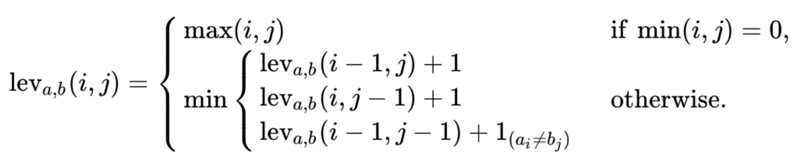

## 68. Text Justification

给定一个字符数组，和一个行的最大长度。将单词放入行内，同一行相邻的单词中间需要有空格。当放入一个单词后该行长度大于最大长度，那么这个单词就不能放入该行，需要另起一行。这样的话，行的长度就可能会小于最大长度，于是需要增加单词间的空格数量，尽可能均匀的分配，若不能均匀分配，那么左边的单词数量应该大于右边。
最后一行单词间只需要一个空格，但是最后一个单词后需要补空格，直至行长度等于最大程度。

1. 遍历单词 list, 并维护一个cur_len表示当前收纳的长度（需包含空格）。每读入一个单词有三种情况：
   - 加入当前单词后，cur_len <= maxWidth，当前单词记录，遍历下一个单词
   - 加入当前单词后，cur_len >= maxWidth 而且当前单词不是最后一个单词。此时将记录的单词串格式化处理。
   - 当前单词是最后一个单词，将记录的单词串格式化处理。（因为最后一行格式特殊）

```cpp
// 2020-09-29 submission
class Solution {
public:
    vector<string> fullJustify(vector<string>& words, int maxWidth) {
        vector<string> res;

        vector<string> cur;
        int cur_len = 0;
        for (int i = 0; i < words.size();) {
            bool flag = (words[i].length() + cur_len <= maxWidth);
            if (flag) {
                cur_len += (words[i].length() + 1);
                cur.push_back(words[i]);
                i++;
            }
            if (!flag && i < words.size()) {
                cur_len = maxWidth-cur_len+cur.size();
                string to_add = cur[0];
                if (cur.size() == 1) to_add.append(cur_len, ' ');
                for (int j = 1; j < cur.size(); j++) {
                    to_add.append(cur_len/(cur.size()-1)+(j<=cur_len%(cur.size()-1)), ' ');
                    to_add.append(cur[j]);
                }
                res.push_back(to_add);
                cur_len = 0;
                cur.clear();
            }
            if (i == words.size()) {
                string to_add = cur[0];
                for (int j = 1; j < cur.size(); j++) {
                    to_add.append(" ");
                    to_add.append(cur[j]);
                }
                to_add.append(maxWidth-to_add.length(), ' ');
                res.push_back(to_add);
            }
        }
        return res;
    }
};
```

## 72. Edit Distance

在信息论、语言学和计算机科学领域，Levenshtein Distance 是用来度量两个序列相似程度的指标。通俗地来讲，编辑距离指的是在两个单词之间，由其中一个单词转换为另一个单词所需要的最少单字符编辑操作次数。

在这里定义的单字符编辑操作有且仅有三种：

- 插入（Insertion）
- 删除（Deletion）
- 替换（Substitution）

譬如，"kitten" 和 "sitting" 这两个单词，由 "kitten" 转换为 "sitting" 需要的最少单字符编辑操作有：
(1) kitten → sitten (substitution of "s" for "k")
(2) sitten → sittin (substitution of "i" for "e")
(3) sittin → sitting (insertion of "g" at the end)
因此，"kitten" 和 "sitting" 这两个单词之间的编辑距离为 3 。

将两个字符串 a, b 的 Levenshtein Distance 表示为 $lev_{a,b}(|a|, |b|)$，其中 $|a|$ 和 $|b|$ 分别对应 a, b 的长度。那么，在这里两个字符串 a, b 的 Levenshtein Distance，即 $lev_{a,b}(|a|, |b|)$ 可用如下的数学语言描述：



定义 $lev_{a,b}(i, j)$ 指的是 a 中前 i 个字符和 b 中前 j 个字符之间的距离。

当 $min(i, j) = 0$ 的时候，对应着字符串 a 中前 i 个字符和字符串 b 中前 j 个字符，此时的 i, j 有一个值为 0，表示字符串 a 和 b 中有一个为空串，那么从 a 转换到 b 只需要进行 $max(i, j)$ 次单字符编辑操作即可，所以它们之间的编辑距离为 $max(i, j)$。

当 $min(i, j) \ne 0$ 的时候，$lev_{a,b}(i, j)$ 为如下三种情况的最小值：
(1) $lev_{a,b}(i-1, j) + 1$ 表示 删除 $a_i$
(2) $lev_{a,b}(i, j-1) + 1$ 表示 插入 $b_j$
(3) $lev_{a,b}(i-1, j-1)+1_{(a_i \ne b_j)}$ 表示 替换 $b_j$

$1_{(a_i \ne b_j)}$ 为一个指示函数，表示当 $a_i = b_j$ 的时候取 0；当 $a_i \ne b_j$ 的时候，其值为 1。

1. 动态规划。
2. 动态规划，简化空间复杂度。

```cpp
class Solution {
public:
    int minDistance(string word1, string word2) {
        int m = word1.size(), n = word2.size();
        vector<vector<int>> dp(m + 1, vector<int>(n + 1));
        for (int i = 0; i <= m; ++i) dp[i][0] = i;
        for (int i = 0; i <= n; ++i) dp[0][i] = i;
        for (int i = 1; i <= m; ++i) {
            for (int j = 1; j <= n; ++j) {
                if (word1[i - 1] == word2[j - 1]) {
                    dp[i][j] = dp[i - 1][j - 1];
                } else {
                    dp[i][j] = min(dp[i - 1][j - 1], min(dp[i - 1][j], dp[i][j - 1])) + 1;
                }
            }
        }
        return dp[m][n];
    }
};
```

```cpp
// 2020-09-08 submission
class Solution {
public:
    int minDistance(string word1, string word2) {
        int c1 = word1.length();
        int c2 = word2.length();
        if (c1 == 0 or c2 == 0) return max(c1, c2);

        vector<int> dist(c1 + 1, 0);
        for (int i = 1; i <= c1; i++) {
            dist[i] = i;
        }
        for (int i = 1; i <= c2; i++) {
            int last_valid = dist[0];
            dist[0] = i;
            for (int j = 1; j <= c1; j++) {
                int temp = min(min(dist[j - 1], dist[j]) + 1, last_valid + (word1[j-1] != word2[i-1]));
                last_valid = dist[j];
                dist[j] = temp;
            }
        }
        return dist[c1];
    }
};
```

## 214. Shortest Palindrome

在给定字符串 s 的前面加上尽可能少的字符，使之变成回文串。

1. KMP 算法：把 s 和其转置 r 连接起来，中间加上一个其他字符，形成一个新的字符串 t，还需要一个和 t 长度相同的一位数组 next，其中 next[i] 表示从 t[i] 到开头的子串的相同前缀后缀的个数。最后把不相同的个数对应的字符串添加到s之前即可

```cpp
class Solution {
public:
    string shortestPalindrome(string s) {
        string r = s;
        reverse(r.begin(), r.end());
        string t = s + "#" + r;
        vector<int> next(t.size(), 0);
        for (int i = 1; i < t.size(); ++i) {
            int j = next[i - 1];
            while (j > 0 && t[i] != t[j]) j = next[j - 1];
            next[i] = (j += t[i] == t[j]);
        }
        return r.substr(0, s.size() - next.back()) + s;
    }
};
```
