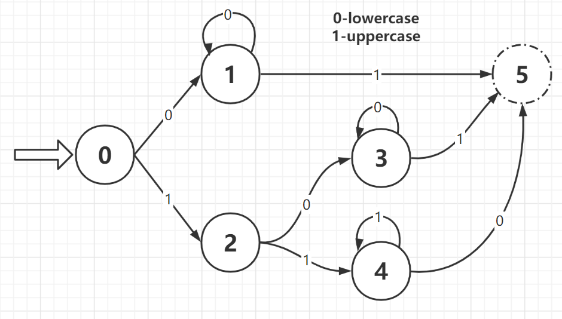

! ## 218

1

1

```cpp

```

## 560. Subarray Sum Equals K

解题思路

1. 用一个哈希表来建立连续子数组之和跟其出现次数之间的映射，初始化要加入 {0,1} 这对映射。建立哈希表的目的是为了让我们可以快速的查找 sum-k 是否存在，即是否有连续子数组的和为 sum-k，如果存在的话，那么和为k的子数组一定也存在

```cpp
// 2021-03-17 submission
// Runtime: 84 ms, faster than 74.74% of C++ online submissions for Subarray Sum Equals K.
// Memory Usage: 42 MB, less than 21.64% of C++ online submissions for Subarray Sum Equals K.
class Solution {
public:
    int subarraySum(vector<int>& nums, int k) {
        unordered_map<int, int> dp{{0 ,1}};
        int sum = 0, res = 0;
        for (int num : nums) {
            sum += num;
            res += dp[sum - k];
            ++dp[sum];
        }
        return res;
    }
};
```

## 409

```cpp
// 2021-12-23 submission
// 95/95 cases passed
// Runtime: 4 ms, faster than 71.27% of C++ online submissions.
// Memory Usage: 6.6 MB, less than 46.27% of C++ online submissions.
class Solution {
public:
    int longestPalindrome(string s) {
        unordered_map<char, int> m;
        for (char c : s) {
            ++m[c];
        }
        int odd_cnt = 0, even_cnt = 0;
        for (auto it = m.begin(); it != m.end(); ++it) {
            if (it->second % 2 == 0) even_cnt += it->second;
            else {
                even_cnt += (it->second - 1);
                odd_cnt = 1;
            }
        }
        return odd_cnt + even_cnt;
    }
};
```

## 501

1. 先序遍历+哈希表计数
2. 递归中序遍历:不用除了递归中的隐含栈之外的额外空间。二分搜索树的中序遍历结果是有序的。
3. 迭代中序遍历。

```cpp
// 2021-12-21 submission
// 23/23 cases passed
// Runtime: 20 ms, faster than 64.74% of C++ online submissions.
// Memory Usage: 29.3 MB, less than 5.03% of C++ online submissions.
/**
 * Definition for a binary tree node.
 * struct TreeNode {
 *     int val;
 *     TreeNode *left;
 *     TreeNode *right;
 *     TreeNode() : val(0), left(nullptr), right(nullptr) {}
 *     TreeNode(int x) : val(x), left(nullptr), right(nullptr) {}
 *     TreeNode(int x, TreeNode *left, TreeNode *right) : val(x), left(left), right(right) {}
 * };
 */
class Solution {
public:
    vector<int> findMode(TreeNode* root) {
        unordered_map<int, int> m;
        int max_val = DFS(root, m);

        vector<int> res;
        for (auto it = m.begin(); it != m.end(); ++it) {
            if (it->second == max_val)
                res.push_back(it->first);
        }
        return res;
    }

    int DFS(TreeNode* root, unordered_map<int, int>& m) {
        if (!root) return 0;
        ++m[root->val];
        return max(max(DFS(root->left, m), DFS(root->right, m)), m[root->val]);
    }
};
```

```cpp
// 2021-12-21 submission
// 23/23 cases passed
// Runtime: 24 ms, faster than 43.63% of C++ online submissions.
// Memory Usage: 29.2 MB, less than 5.03% of C++ online submissions.
class Solution {
public:
    vector<int> findMode(TreeNode* root) {
        TreeNode* pre = nullptr;
        vector<int> res;
        int cur = 1, int mx = 0;
        inorder(root, pre, res, cur, mx);
        return res;
    }

    void inorder(TreeNode* root, TreeNode* &pre, vector<int>& candidates, int& cur, int& mx) {
        if (!root) return;
        inorder(root->left, pre, candidates, cur, mx);
        if (pre) cur = pre->val == root->val ? cur+1 : 1;
        if (cur >= mx) {
            if (cur > mx) candidates.clear();
            mx = cur;
            candidates.push_back(root->val);
        }
        pre = root;
        inorder(root->right, pre, candidates, cur, mx);
    }
};
```

```cpp
// 2021-12-21 submission
// 23/23 cases passed
// Runtime: 28 ms, faster than 25.09% of C++ online submissions.
// Memory Usage: 29.1 MB, less than 6.61% of C++ online submissions.
class Solution {
public:
    vector<int> findMode(TreeNode* root) {
        if (!root) return {};
        vector<int> res;
        TreeNode* cur = root, *pre = nullptr;
        int cnt = 0, mx = 0;
        while (cur) {
            TreeNode* right_most = cur->left;
            if (right_most) {
                while (right_most->right != nullptr && right_most->right != cur) {
                    right_most = right_most->right;
                }
                if (right_most->right == nullptr) {
                    right_most->right = cur;
                    cur = cur->left;
                    continue;
                }
                else right_most->right = nullptr;
            }
            if (pre) cnt = (pre->val == cur->val) ? cnt+1 : 1;
            if (cnt >= mx) {
                if (cnt > mx) res.clear();
                mx = cnt;
                res.push_back(cur->val);
            }
            res.push_back(cur->val);
            cur = cur->right;
        }
        return res;
    }
};
```

## 520

1. 状态机：

```cpp
// 2021-12-21 submission
// 550/550 cases passed
// Runtime: 0 ms, faster than 100% of C++ online submissions.
// Memory Usage: 6.7 MB, less than 17.78% of C++ online submissions.
class Solution {
public:
    bool detectCapitalUse(string word) {
        vector<vector<int> > trans{
            {1, 2},
            {1, 5},
            {3, 4},
            {3, 5},
            {5, 4},
            {5, 5}
        };
        int state = 0;
        for (char c : word) {
            int next = isupper(c) ? 1 : 0;
            state = trans[state][next];
            if (state == 5) break;
        }
        return state != 5;
    }
};
```

## 530
## 606

```cpp
// 2021-12-23 submission
// 160/160 cases passed
// Runtime: 16 ms, faster than 84.13% of C++ online submissions.
// Memory Usage: 66.6 MB, less than 15.49% of C++ online submissions.
/**
 * Definition for a binary tree node.
 * struct TreeNode {
 *     int val;
 *     TreeNode *left;
 *     TreeNode *right;
 *     TreeNode() : val(0), left(nullptr), right(nullptr) {}
 *     TreeNode(int x) : val(x), left(nullptr), right(nullptr) {}
 *     TreeNode(int x, TreeNode *left, TreeNode *right) : val(x), left(left), right(right) {}
 * };
 */
class Solution {
public:
    string tree2str(TreeNode* root) {
        if (!root) return "()";
        string res = to_string(root->val), lres, rres;
        if (root->left) lres = tree2str(root->left);
        if (root->right) rres = tree2str(root->right);
        if (root->right) {
            res += ("(" + lres + ")(" + rres + ")");
        } else if (root->left) {
            res += ("(" + lres + ")");
        }
        return res;
    }
};
```

## 637

```cpp
// 2021-12-21 submission
// 66/66 cases passed
// Runtime: 12 ms, faster than 85.36% of C++ online submissions.
// Memory Usage: 22.5 MB, less than 72.82% of C++ online submissions.
/**
 * Definition for a binary tree node.
 * struct TreeNode {
 *     int val;
 *     TreeNode *left;
 *     TreeNode *right;
 *     TreeNode() : val(0), left(nullptr), right(nullptr) {}
 *     TreeNode(int x) : val(x), left(nullptr), right(nullptr) {}
 *     TreeNode(int x, TreeNode *left, TreeNode *right) : val(x), left(left), right(right) {}
 * };
 */
class Solution {
public:
    vector<double> averageOfLevels(TreeNode* root) {
        queue<TreeNode*> q;
        vector<double> res;
        if (root) q.push(root);
        while (!q.empty()) {
            int q_size = q.size();
            double level_sum = 0;
            for (int i = 0; i < q_size; i++) {
                level_sum += q.front()->val;
                if (q.front()->left) q.push(q.front()->left);
                if (q.front()->right) q.push(q.front()->right);
                q.pop();
            }
            res.push_back(level_sum / q_size);
        }
        return res;
    }
};
```


## 696

1. 动态规划：dp[i] 表示截止到 i 位置且包含 i 位置的有效字符长度，分两种情况讨论。s[i] == s[i-1] 时，就要将 dp[i-1] 视为内字符串，在内字符串的两边加上 s[i] 和 s[i-dp[i-1]-1]，要求这两个字符不能相同；s[i] != s[i-1] 时，就可以直接视作长度为 2 的有效字符串。

```cpp
// 2021-12-22 submission
// 91/91 cases passed
// Runtime: 20 ms, faster than 93.86% of C++ online submissions.
// Memory Usage: 14.6 MB, less than 6.24% of C++ online submissions.
class Solution {
public:
    int countBinarySubstrings(string s) {
        int res = 0;
        vector<int> dp(s.length(), 0);
        for (int i = 1; i < s.length(); i++) {
            if (s[i] != s[i-1]) {
                dp[i] = 2;
                res += 1;
            }
            else if(i-dp[i-1]-1>=0 && s[i-dp[i-1]-1]!=s[i]) {
                dp[i] = dp[i-1] + 2;
                res += 1;
            }
        }
        return res;
    }
};
```


## 458. Poor Pigs

1000 瓶水中 1 瓶有毒，猪喝了毒水 15 分钟内会死亡，给定 1 个小时时间，求最少需要多少头猪能够定位到毒水。

## 449. Serialize and Deserialize BST

## 673. Number of Longest Increasing Subsequence

最长递增序列的个数。

## 695. Max Area of Island

## 686. Repeated String Match

## 684. Redundant Connection

删掉无向图中组成环的最后一条边，图中只有一条额外边。

## 685. Redundant Connection II

## 677. Map Sum Pairs

## 498. Diagonal Traverse

二维数组的对角遍历，先向右上，然后左下，再右上，以此类推直至遍历完整个数组。

## 327. Count of Range Sum

解题思路

1. 首先计算出一个累计和数组 accum，$$\text{accum}[i]=\text{accum}[i-1]+nums[i]$$ 那问题可以转化为求解所有的区间$(j, i]$，满足 $$lower <= \text{accum}[i]-\text{accum}[j] <= upper$$(亦可写成$\text{accum}[i]-\text{upper} <= \text{accum}[j] <= \text{accum}[i]-\text{lower}$)。
 然后利用 STL 里的 multiset 容器，lower_bound() 是找数组中第一个不小于给定值的数(包括等于情况)，而 upper_bound() 是找数组中第一个大于给定值的数，distance() 方法返回两个迭代器之间的距离。

边界条件

1. 出现 INT_MIN 和 INT_MAX

```cpp
// 2020-11-26 submission
// ?/? cases passed
// Runtime: 68 ms, faster than 48.47% of C++ online submissions.
// Memory Usage: 15.1 MB, less than 61.69% of C++ online submissions.
class Solution {
public:
    int countRangeSum(vector<int>& nums, int lower, int upper) {
        if (nums.empty()) return 0;
        multiset<long long> st{0};
        long long cur_sum = 0; // 后续有减法操作避免溢出
        int res = 0;
        for (int i = 0; i < nums.size(); i++) {
            cur_sum += nums[i];
            res += distance(st.lower_bound(cur_sum-upper), st.upper_bound(cur_sum-lower));
            st.insert(cur_sum); // why this expression after
        }
        return res;
    }
};
```

## 357. Count Numbers with Unique Digits

找一个范围内的各位不相同的数字。

1. 找规律

   ```txt
   k = 1    [0-9] 10
   k = 2    [10-99] 中去掉 [11,22,33,44,55,66,77,88,99] 9 * 9 = 81
   k = 3    [100-999] 9 * 9 * 8 = 648
   ...
   通项公式为 f(k) = 9 * 9 * 8 * ... (9 - k + 2)
   例外情况：k > 10, f(k) = 0
   ```

2. 回溯
   - 需要一个变量 used，其二进制第 i 位为 1 表示数字 i 出现过
   - 刚开始遍历 1 到 9，对于每个遍历到的数字，现在 used 中标记已经出现过，然后再调用递归函数。在递归函数中，如果这个数字小于最大值，则结果 res 自增1，否则返回res。
   - 然后遍历0到9，如果当前数字没有在 used 中出现过，此时在 used 中标记，然后给当前数字乘以10加上i，再继续调用递归函数，这样可以遍历到所有的情况

```cpp
// 2020-11-13 submission
class Solution {
public:
    int countNumbersWithUniqueDigits(int n) {
        int res = 0;
        int cur = 1;
        for (int i = 1, j = 10; i <= n; i++, j--) {
            cur *= min(9, max(0, j));
            res += cur;
        }
        return res + 1;
    }
    // 另一种写法
    // int countNumbersWithUniqueDigits(int n) {
    //     if (n == 0) return 1;
    //     int res = 10, cnt = 9;
    //     for (int i = 2; i <= n; ++i) {
    //         cnt *= (11 - i);
    //         res += cnt;
    //     }
    //     return res;
    // }
};
```

```cpp
class Solution {
public:
    int countNumbersWithUniqueDigits(int n) {
        int res = 1, max = pow(10, n), used = 0;
        for (int i = 1; i < 10; ++i) {
            used |= (1 << i);
            res += search(i, max, used);
            used &= ~(1 << i);
        }
        return res;
    }
    int search(int pre, int max, int used) {
        int res = 0;
        if (pre < max) ++res;
        else return res;
        for (int i = 0; i < 10; ++i) {
            if (!(used & (1 << i))) {
                used |= (1 << i);
                int cur = 10 * pre + i;
                res += search(cur, max, used);
                used &= ~(1 << i);
            }
        }
        return res;
    }
};
```

## 344. Reverse String

反转字符串。

1. 按照题意处理即可。

```cpp
class Solution {
public:
    void reverseString(vector<char>& s) {
        int left = 0, right = (int)s.size() - 1;
        while (left < right) {
            swap(s[left++], s[right--]);
        }
    }
};
```

## 367. Valid Perfect Square

判断完全平方数。

1. 穷举：从 1 搜索到 sqrt(num)，看有没有平方正好等于 num 的数。
2. 二分查找
3. 完全平方数是一系列奇数之和。时间复杂度为 O(sqrt(n))。

   ```txt
   1 = 1
   4 = 1 + 3
   9 = 1 + 3 + 5
   16 = 1 + 3 + 5 + 7
   25 = 1 + 3 + 5 + 7 + 9
   36 = 1 + 3 + 5 + 7 + 9 + 11
   ....
   1 + 3 + ... + (2n-1) = (2n - 1 + 1)*n/2 = n * n
   ```

4. 牛顿迭代法
5. Q_rsqrt 算法：O(1) 时间复杂度。

```cpp
// 2020-09-22 submission
class Solution {
public:
    bool isPerfectSquare(int num) {
        if (num == 0 || num == 1) return true;
        for (int i = 2; i <= int(sqrt(num)); i++) {
            if (num % i == 0 && num / i == i) return true;
        }
        return false;
    }
};
```

```cpp
class Solution {
public:
    bool isPerfectSquare(int num) {
        long left = 0, right = num;
        while (left <= right) {
            long mid = left + (right - left) / 2, t = mid * mid;
            if (t == num) return true;
            if (t < num) left = mid + 1;
            else right = mid - 1;
        }
        return false;
    }
};
```

```cpp
class Solution {
public:
    bool isPerfectSquare(int num) {
        int i = 1;
        while (num > 0) {
            num -= i;
            i += 2;
        }
        return num == 0;
    }
};
```

```cpp
class Solution {
public:
    bool isPerfectSquare(int num) {
        long x = num;
        while (x * x > num) {
            x = (x + num / x) / 2;
        }
        return x * x == num;
    }
};
```

```cpp
class Solution {
public:
    bool isPerfectSquare(int num) {
        if (num < 0) return false;
        int root = floorSqrt(num);
        return root * root == num;
    }

    int32_t floorSqrt(int32_t x) {
        double y=x; int64_t i=0x5fe6eb50c7b537a9;
        y = *(double*)&(i = i-(*(int64_t*)&y)/2);
        y = y * (3 - x * y * y) * 0.5;
        y = y * (3 - x * y * y) * 0.5;
        i = x * y + 1; return i - (i * i > x);
    }
};
```

## 390. Elimination Game

一个 1-n 的有序数组，从左开始每隔一个数进行删除，然后从最右开始以同样方法进行删除，循环反复后只剩下一个数字，求出该数字。

1. 从左往右删的时候，每次都是删掉第一个数字，而从右往左删的时候，则有可能删掉第一个或者第二个数字（剩下数字是偶数个时，删掉的是第二个数字），而且每删一次，数字之间的距离会变为之前的两倍，所以只需要记录每次删减后数组的第一个数字即可。
2. 递归：第一次从左往右删除的时候，奇数都被删掉了，剩下的都是偶数。如果对所有数都除以 2，那么得到一个 1 到 n/2 的新数列。下一次从右往左删除，那么返回的结果应该是调用递归的结果 lastRemaining(n/2) 在数组 1 到 n/2 之间的镜像。何为镜像，比如 1, 2, 3, 4 这个数字，2 的镜像就是 3, 1 的镜像是 4。

```cpp
// 2020-12-06 submission
class Solution {
public:
    int lastRemaining(int n) {
        bool ltor = true;
        int step = 1, cur = 1;
        while (n > 1) {
            if (ltor || n % 2) cur += step;
            step *= 2;
            ltor = not ltor;
            n /= 2;
        }
        return cur;
    }
};
```

```cpp
class Solution {
public:
    int lastRemaining(int n) {
        return n == 1 ? 1 : 2 * (1 + n / 2 - lastRemaining(n / 2));
    }
};
```

## 404. Sum of Left Leaves

计算二叉树所有左叶子节点的和

1. 需要传递一个标志位，因为一个节点是否为左节点是由父节点决定的。
2. 直接在原函数中检查当前节点的左子节点是否是左子叶，如果是的话，则返回左子叶的值加上对当前结点的右子节点调用递归的结果；如果不是的话，对左右子节点分别调用递归函数，返回二者之和。

```cpp
// 2020-12-11 submission
class Solution {
public:
    int sumOfLeftLeaves(TreeNode* root) {
        return helper(root, false);
    }

    int helper(TreeNode* root, bool is_left) {
        if (!root) return 0;
        if (!root->left && !root->right) return is_left ? root->val : 0;
        return helper(root->left, true) + helper(root->right, false);
    }
};
```

```cpp
class Solution {
public:
    int sumOfLeftLeaves(TreeNode* root) {
        if (!root) return 0;
        if (root->left && !root->left->left && !root->left->right) {
            return root->left->val + sumOfLeftLeaves(root->right);
        }
        return sumOfLeftLeaves(root->left) + sumOfLeftLeaves(root->right);
    }
};
```

## 438. Find All Anagrams in a String

解题思路

1. 滑动窗口

```cpp
// 2021-03-18 submission
// ?/? cases passed
// Runtime: 16 ms, faster than 60.99% of C++ online submissions.
// Memory Usage: 8.6 MB, less than 53.85% of C++ online submissions.
class Solution {
public:
    vector<int> findAnagrams(string s, string p) {
        unordered_map<char, int> m;
        int len = p.length();
        for (char c : p)
            ++m[c];

        int l = 0;
        vector<int> res;
        for (int i = 0; i < s.length(); i++) {
            --m[s[i]];
            while (m[s[i]] < 0)
                ++m[s[l++]];
            if (i - l + 1 == len) res.push_back(l);
        }
        return res;
    }
};
```

## 442. Find All Duplicates in an Array

数组范围在 [1, n]，数组中的数字可能出现一次或两次，找出所有出现两次的数字。要求 O(1) 空间复杂度，O(n) 时间复杂度。

1. 取负法：将元素对应的位置取负。在取负的过程中，如果发现要取负的位置已经为负，说明这个元素已经出现过，也即该元素出现了两次。当某个元素不出现的时候，该元素对应的位置始终访问不到，所以还是正值。
2. 将 nums[i] 置换到其对应的位置 nums[nums[i]-1]。最后在对应位置检验，如果 nums[i] 和 i+1 不等，将 nums[i] 存入结果 res 中即可。

```cpp
// 2021-03-19 submission
class Solution {
public:
    vector<int> findDuplicates(vector<int>& nums) {
        int n = nums.size();
        int dst = 0;
        vector<int> res;
        for (int i = 0; i < nums.size(); i++) {
            dst = nums[i] > 0 ? nums[i] : nums[i] + (n + 1);
            if (nums[dst-1] >= 0) nums[dst-1] -= (n + 1);
            else res.push_back(dst);
        }
        return res;
    }
    // 另一种写法
    // vector<int> findDuplicates(vector<int>& nums) {
    //     vector<int> res;
    //     for (int i = 0; i < nums.size(); ++i) {
    //         int idx = abs(nums[i]) - 1;
    //         if (nums[idx] < 0) res.push_back(idx + 1);
    //         nums[idx] = -nums[idx];
    //     }
    //     return res;
    // }
};
```

```cpp
class Solution {
public:
    vector<int> findDuplicates(vector<int>& nums) {
        vector<int> res;
        for (int i = 0; i < nums.size(); ++i) {
            if (nums[i] != nums[nums[i] - 1]) {
                swap(nums[i], nums[nums[i] - 1]);
                --i;
            }
        }
        for (int i = 0; i < nums.size(); ++i) {
            if (nums[i] != i + 1) res.push_back(nums[i]);
        }
        return res;
    }
};
```

## 494. Target Sum

给定一个非负整数数组和一个目标值，给数组中每个数字加上正号或负号，然后求和要和目标值相等。

1. BFS
2.

```cpp
// 2021-03-21 submission
class Solution {
public:
    int findTargetSumWays(vector<int>& nums, int S) {
        unordered_map<int, int> m;
        vector<pair<int, int>> can;
        m[0] = 1;
        for (int i = 0; i < nums.size(); i++) {
            for (auto it : m) {
                if (it.second > 0) {
                    can.push_back(make_pair(it.first+nums[i], it.second));
                    can.push_back(make_pair(it.first-nums[i], it.second));
                    m[it.first] = 0;
                }

            }
            for (auto it : can) {
                m[it.first] += it.second;
            }
            can.clear();
        }
        return m[S];
    }
};
```

## 543. Diameter of Binary Tree

```cpp
// 2021-03-17 submission
// ?/? cases passed
// Runtime: 16 ms, faster than 35.45% of C++ online submissions.
// Memory Usage: 23.1 MB, less than 5.27% of C++ online submissions.
/**
 * Definition for a binary tree node.
 * struct TreeNode {
 *     int val;
 *     TreeNode *left;
 *     TreeNode *right;
 *     TreeNode() : val(0), left(nullptr), right(nullptr) {}
 *     TreeNode(int x) : val(x), left(nullptr), right(nullptr) {}
 *     TreeNode(int x, TreeNode *left, TreeNode *right) : val(x), left(left), right(right) {}
 * };
 */
class Solution {
public:
    int diameterOfBinaryTree(TreeNode* root) {
        unordered_map<TreeNode*, int> m;
        int res = 0;
        maxDepth(root, res, m);
        return res;
    }
    int maxDepth(TreeNode* node, int& res, unordered_map<TreeNode*, int>& m) {
        if (!node) return 0;
        if (m.count(node)) return m[node];
        int left = maxDepth(node->left, res, m);
        int right = maxDepth(node->right, res, m);
        res = max(res, left + right);
        return m[node] = (max(left, right) + 1);
    }
};
```

## 617. Merge Two Binary Trees

合并两个二叉树，规则是，都存在的结点，就将结点值加起来，否则空的位置就由另一个树的结点来代替。

1. 递归
   - 如果 t1 不存在，则直接返回 t2
   - 如果 t2 不存在，则直接返回 t1
   - 如果上面两种情况都不满足，那么以 t1 和 t2 的结点值之和建立新结点 t，然后对 t1 和 t2 的左子结点调用递归并赋给 t 的左子结点，再对 t1 和 t2 的右子结点调用递归并赋给 t 的右子结点，返回 t 结点即可

```cpp
// 2021-03-10 submission
/**
 * Definition for a binary tree node.
 * struct TreeNode {
 *     int val;
 *     TreeNode *left;
 *     TreeNode *right;
 *     TreeNode() : val(0), left(nullptr), right(nullptr) {}
 *     TreeNode(int x) : val(x), left(nullptr), right(nullptr) {}
 *     TreeNode(int x, TreeNode *left, TreeNode *right) : val(x), left(left), right(right) {}
 * };
 */
class Solution {
public:
    TreeNode* mergeTrees(TreeNode* root1, TreeNode* root2) {
        if (!t1) return t2;
        if (!t2) return t1;
        TreeNode *t = new TreeNode(t1->val + t2->val);
        t->left = mergeTrees(t1->left, t2->left);
        t->right = mergeTrees(t1->right, t2->right);
        return t;
    }
};
```

## 316. Remove Duplicate Letters

移除重复字母，使得每个字符只能出现一次，而且结果要按字典顺序排列，不能打乱其原本的相对位置。

## 387. First Unique Character in a String

返回第一个非重复字符的下标

1. 用一个数组记录每个字母出现的次数

```cpp
// 2020-11-29 submission
class Solution {
public:
    int firstUniqChar(string s) {
        int count[26] = {0};
        for (char c : s)
            count[c - 'a']++;
        for (int i = 0; i < s.length(); i++) {
            if (count[s[i] - 'a'] == 1)
                return i;
        }
        return -1;
    }
};
```

## 454. 4Sum II

在四个数组中各取一个数字使总和为 0，一共有多少种取法。

1. HashMap: 把 A 和 B 的两两之和都求出来，在 HashMap 中建立两数之和跟其出现次数之间的映射，那么再遍历 C 和 D 中任意两个数之和，再看看哈希表存不存在这两数之和的相反数。时间复杂度为 O(n^2)。

```cpp
// 2020-12-18 submission
class Solution {
public:
    int fourSumCount(vector<int>& A, vector<int>& B, vector<int>& C, vector<int>& D) {
        int res = 0;
        unordered_map<int, int> m;
        for (int a : A) {
            for (int b : B) {
                ++m[a + b];
            }
        }
        for (int c : C) {
            for (int d : D) {
                if (m.count(-c - d)) res += m[-c - d];
            }
        }
        return res;
    }
};
```

## 436 Find Right Interval

## 435 Non-overlapping Intervals

## 434 Number of Segments in a String

## 433 Minimum Genetic Mutation

## 432 All O`one Data Structure

## 430 Flatten a Multilevel Doubly Linked List

## 429 N-ary Tree Level Order Traversal

## 437 Path Sum III
