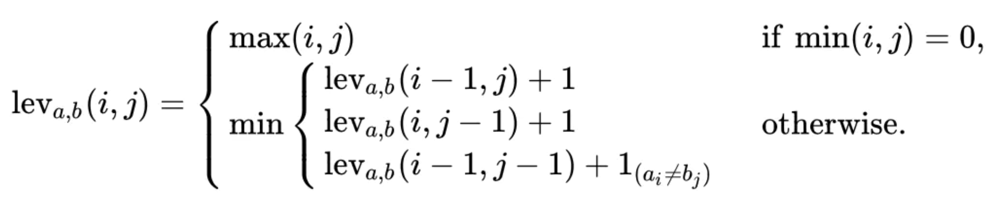

# summary

## [1.Two Sum](https://leetcode.com/problems/two-sum/description/)

==Solution==

**题目描述**: 给定无序数组和指定值 target, 返回和为 target 的两个数的下标。

**解题思路**:

1. HashMap：建立值到下标的映射，复杂度为 O(n)

**关联专题**: undefined

==Code==

```cpp
// 2022-05-30 submission
// 57/57 cases passed
// Runtime: 12 ms, faster than 83.93% of C++ online submissions.
// Memory Usage: 10.9 MB, less than 29.71% of C++ online submissions.
class Solution {
public:
    vector<int> twoSum(vector<int>& nums, int target) {
        unordered_map<int, int> m;
        for (int i = 0; i < nums.size(); i++) {
            if (m.count(target - nums[i]))
                return vector<int>{m[target - nums[i]], i};
            m[nums[i]] = i;
        }
        return vector<int>{};
    }
};
```

## [2.Add Two Numbers](https://leetcode.com/problems/add-two-numbers/description/)

==Solution==

**题目描述**: 需要相加的两个数字通过链表反向存储，结果也需要通过链表反向存储。

**解题思路**:

1. dummy节点:

**关联专题**: undefined

==Code==

```cpp
// 2022-06-03 submission
// 1568/1568 cases passed
// Runtime: 73 ms, faster than 12.66% of C++ online submissions.
// Memory Usage: 71.5 MB, less than 12.13% of C++ online submissions.
/**
 * Definition for singly-linked list.
 * struct ListNode {
 *     int val;
 *     ListNode *next;
 *     ListNode() : val(0), next(nullptr) {}
 *     ListNode(int x) : val(x), next(nullptr) {}
 *     ListNode(int x, ListNode *next) : val(x), next(next) {}
 * };
 */
class Solution {
public:
    ListNode* addTwoNumbers(ListNode* l1, ListNode* l2) {

        ListNode* dummy = new ListNode(0);

        ListNode* cur = dummy;
        int carry = 0;
        while (l1 || l2 || carry != 0) {
            if (l1) carry += l1->val;
            if (l2) carry += l2->val;
            cur->next = new ListNode(carry % 10);
            carry /= 10;
            l1 = l1 ? l1->next : l1;
            l2 = l2 ? l2->next : l2;
            cur = cur->next;
        }

        return dummy->next;
    }
};
```

## [3.Longest Substring Without Repeating Characters](https://leetcode.com/problems/longest-substring-without-repeating-characters/description/)

==Solution==

**题目描述**: 求最长无重复子串

**解题思路**:

1. 滑动窗口：建立字符到其出现次数或者最后出现位置的映射，并且定义一个变量标记当前滑动窗口的左边界。对于 char 数据类型的hashmap，可以用 `vector<int> m(256, 0)` 代替。

**关联专题**: undefined

==Code==

```cpp
// 2022-07-18 submission
// 987/987 cases passed
// Runtime: 7 ms, faster than 92.47% of C++ online submissions.
// Memory Usage: 8.4 MB, less than 57.99% of C++ online submissions.
class Solution {
public:
    int lengthOfLongestSubstring(string s) {
        int max_length = 0;
        int l = 0;
        vector<int> m(256, 0); // unordered_map<char, int> m;
        for (int i = 0; i < s.length(); i++) {
            ++m[s[i]];
            while(m[s[i]] > 1) {
                m[s[l++]]--;
            }
            max_length = max(max_length, i - l + 1);
        }
        return max_length;
    }
};
```

## [6.Zigzag Conversion](https://leetcode.com/problems/zigzag-conversion/description/)

==Solution==

**题目描述**: 给定字符串和行数，将其进行 “之” 形变换后，输出逐行读取的结果。

```txt
当 n = 2 时：

0 2 4 6 8 A C E
1 3 5 7 9 B D F

result: 0 2 4 6 8 A C E 1 3 5 7 9 B D F

当 n = 3 时：

0   4   8   C
1 3 5 7 9 B D F
2   6   A   E

当 n = 4 时：

0     6     C
1   5 7   B D
2 4   8 A   E
3     9     F
```

**解题思路**

1. 找规律
   - 第一行和最后一行没有中间形成之字型的数字中，相邻两个元素的 index 之差为 2*nRows - 2。
   - 除了第一行和最后一行，中间数字每两个非紧靠的数字的 index 之差为 2 x numRows-2 - 2 x i，i 为当前行数。

**关联专题**: undefined

==Code==

```cpp
// 2022-11-14 submission
// 1157/1157 cases passed
// Runtime: 0 ms, faster than 100% of C++ online submissions.
// Memory Usage: 8.3 MB, less than 70.99% of C++ online submissions.
class Solution {
public:
    string convert(string s, int numRows) {
        if (numRows <= 1) return s;
        string res;
        int size = 2 * numRows - 2, n = s.size();
        for (int i = 0; i < numRows; ++i) {
            for (int j = i; j < n; j += size) {
                res += s[j];
                int pos = j + size - 2 * i;
                if (i != 0 && i != numRows - 1 && pos < n) res += s[pos];
            }
        }
        return res;
    }
};
```

## [7.Reverse Integer](https://leetcode.com/problems/reverse-integer/description/)

==Solution==

**题目描述**: 数字翻转，注意溢出问题。

**解题思路**

1. 从最后一位数字开始算，每次需要判断是否大于 INT_MAX / 10，否则返回 0.

**Follow Up**

1. 为什么不需要判断等于 INT_MAX / 10

**关联专题**: undefined

==Code==

```cpp
// 2022-11-14 submission
// 1032/1032 cases passed
// Runtime: 0 ms, faster than 100% of C++ online submissions.
// Memory Usage: 5.9 MB, less than 75.58% of C++ online submissions.
class Solution {
public:
    int reverse(int x) {
        int res = 0;
        while (x != 0) {
            if (abs(res) > INT_MAX / 10) return 0;
            res = res * 10 + x % 10;
            x /= 10;
        }
        return res;
    }
};
```

## [8.String to Integer (atoi)](https://leetcode.com/problems/string-to-integer-atoi/description/)

==Solution==

**题目描述**: 字符串转为整数

**解题思路**

1. 若字符串开头是空格，则跳过所有空格，到第一个非空格字符，如果没有，则返回0.
2. 若第一个非空格字符是符号 +/-，则标记 sign 的真假，这道题还有个局限性，那就是在 c++ 里面，+-1 和-+1 都是认可的，都是 -1，而在此题里，则会返回0.
3. 若下一个字符不是数字，则返回0，完全不考虑小数点和自然数的情况。
4. 如果下一个字符是数字，则转为整型存下来，若接下来再有非数字出现，则返回目前的结果。
5. 还需要考虑边界问题，如果超过了整型数的范围，则用边界值替代当前值。

**关联专题**: undefined

==Code==

```cpp
// 2022-11-14 submission
// 1082/1082 cases passed
// Runtime: 13 ms, faster than 12.24% of C++ online submissions.
// Memory Usage: 7.2 MB, less than 12.34% of C++ online submissions.
class Solution {
public:
    int myAtoi(string str) {
        if (str.empty()) return 0;
        int sign = 1, base = 0, i = 0, n = str.size();
        while (i < n && str[i] == ' ') ++i;
        if (i < n && (str[i] == '+' || str[i] == '-')) {
            sign = (str[i++] == '+') ? 1 : -1;
        }
        while (i < n && str[i] >= '0' && str[i] <= '9') {
            if (base > INT_MAX / 10 || (base == INT_MAX / 10 && str[i] - '0' > 7)) {
                return (sign == 1) ? INT_MAX : INT_MIN;
            }
            base = 10 * base + (str[i++] - '0');
        }
        return base * sign;
    }
};
```

## [9.Palindrome Number](https://leetcode.com/problems/palindrome-number/description/)

==Solution==

**题目描述**: 判断一个整数是否是回文数

**解题思路**:

1. 分别取最左和最右的数字，然后向中间靠拢。
2. 将数字从中间一分为二。
   - 整数的最高位不能是 0，所以回文数的最低位也不能为0，数字 0 除外
   - 回文数不可能是负数
   - 把后半段翻转，看是否和前半段相等
   - 每次通过对 10 取余，取出最低位的数字，然后加到取出数的末尾
   - 当 revertNum 大于等于x的时候循环停止。由于回文数的位数可奇可偶，如果是偶数，revertNum 应该和x相等；如果是奇数，最中间的数字就在 revertNum 的最低位，除以 10 以后应该和x是相等的
3. 回文数反转后仍是原数字，所以不可能溢出。只要溢出就说明不是回文数。

**关联专题**: undefined

==Code==

```cpp
// 2022-08-01 submission
// 11510/11510 cases passed
// Runtime: 22 ms, faster than 54.64% of C++ online submissions.
// Memory Usage: 5.9 MB, less than 31.85% of C++ online submissions.
class Solution {
public:
    bool isPalindrome(int x) {
        if (x < 0) return false;
        int div = 1;
        while (x / div >= 10) div *= 10;
        while (x > 0) {
            int left = x / div;
            int right = x % 10;
            if (left != right) return false;
            x = (x % div) / 10;
            div /= 100;
        }
        return true;
    }
};
```

```cpp
// 2022-08-01 submission
// 11510/11510 cases passed
// Runtime: 15 ms, faster than 81.79% of C++ online submissions.
// Memory Usage: 5.9 MB, less than 31.85% of C++ online submissions.
class Solution {
public:
    bool isPalindrome(int x) {
        if (x < 0 || (x != 0 && x % 10 == 0))
            return false;

        int reverted = 0;
        while (x > reverted) {
            reverted = reverted * 10 + x % 10;
            x /= 10;
        }
        return x == reverted || x == reverted / 10;
    }
};
```

```cpp
// 2022-08-01 submission
// 11510/11510 cases passed
// Runtime: 11 ms, faster than 92.34% of C++ online submissions.
// Memory Usage: 5.7 MB, less than 90.95% of C++ online submissions.
class Solution {
public:
    bool isPalindrome(int x) {
        if (x < 0 || (x % 10 == 0 && x != 0)) return false;
        return reverse(x) == x;
    }

    int reverse(int x) {
        int res = 0;
        while (x != 0) {
            if (res > INT_MAX / 10) return -1;
            res = res * 10 + x % 10;
            x /= 10;
        }
        return res;
    }
};
```

## [10.Regular Expression Matching](https://leetcode.com/problems/regular-expression-matching/description/)

==Solution==

**题目描述**: 正则匹配：`.` 匹配任意单个字符，`*` 匹配 0 个或多个前置字符。

**解题思路**

1. 正则匹配
   - sp 和 pp 都到了末尾，表示匹配结束
   - 如果 p 的后置字符为 *，(1) p 的当前字符为 . (2) p 的当前字符匹配 s 的当前字符，如果满足上述两种情况之一，s 后移一位，继续递归。
   - 如果上述情况返回错误，说明 * 匹配失效，p 后移两位，继续递归。
   - 最后进行普通匹配，(1) p 的当前字符为 . (2) p 的当前字符匹配 s 的当前字符，如果满足上述两种情况之一，s 和 p 均后移一位，继续递归。
2. 动态规划
   - `dp[i][j]` 表示 s[0,i) 和 p[0,j) 是否 match
   - `P[i][j] = P[i - 1][j - 1]`, if `p[j - 1] != '' && (s[i - 1] == p[j - 1] || p[j - 1] == '.')`;
   - `P[i][j] = P[i][j - 2]`, if `p[j - 1] == ''` and the pattern repeats for 0 times;
   - `P[i][j] = P[i - 1][j] && (s[i - 1] == p[j - 2] || p[j - 2] == '.')`, if `p[j - 1] == '*'` and the pattern repeats for at least 1 times.

TODO 贪婪匹配 VS 非贪婪匹配

**关联专题**: undefined

==Code==

```cpp
// TLE
class Solution {
public:
    bool isMatch(string s, string p) {
        return helper(s, p, 0, 0);
    }

    bool helper(string& s, string& p, int sp, int pp) {
        if (pp == p.length()) return sp == s.length();
        if (pp + 1 == p.length()) {
            return sp + 1 == s.length() && (p[pp] == '.' || p[pp] == s[sp]);
        }
        if(p[pp + 1] == '*') {
            if (sp == s.length() && (p[pp] == '.' || p[pp] == s[sp]) && helper(s, p, sp+1, pp)) return true;
            return helper(s, p, sp, pp + 2);
        }
        if(sp < s.length() && (p[pp] == '.' || p[pp] == s[sp])) return helper(s, p, sp+1, pp+1);
        else return false;
    }
};
```

```cpp
// 2023-02-02 submission
// 353/353 cases passed
// Runtime: 10 ms, faster than 51.8% of C++ online submissions.
// Memory Usage: 7 MB, less than 66.86% of C++ online submissions.
class Solution {
public:
    bool isMatch(string s, string p) {
        int m = s.size(), n = p.size();
        vector<vector<bool>> dp(m + 1, vector<bool>(n + 1, false));
        dp[0][0] = true;
        for (int i = 0; i <= m; ++i) {
            for (int j = 1; j <= n; ++j) {
                if (j > 1 && p[j - 1] == '*') {
                    dp[i][j] = dp[i][j - 2] || (i > 0 && (s[i - 1] == p[j - 2] || p[j - 2] == '.') && dp[i - 1][j]);
                } else {
                    dp[i][j] = i > 0 && dp[i - 1][j - 1] && (s[i - 1] == p[j - 1] || p[j - 1] == '.');
                }
            }
        }
        return dp[m][n];
    }
};
```

## [12.Integer to Roman](https://leetcode.com/problems/integer-to-roman/description/)

==Solution==

**题目描述**: 整数转化成罗马数字

**解题思路**:

```txt
I - 1
V - 5
X - 10
L - 50
C - 100
D - 500
M - 1000
```

1. 贪婪算法
   - 建立一个数表，每次通过查表找出当前最大的数，减去再继续查表

**关联专题**: undefined

==Code==

```cpp
// 2022-07-18 submission
// 3999/3999 cases passed
// Runtime: 31 ms, faster than 12.2% of C++ online submissions.
// Memory Usage: 8.8 MB, less than 26.81% of C++ online submissions.
class Solution {
public:
    string intToRoman(int num) {
        string res = "";
        vector<int> val{1000, 900, 500, 400, 100, 90, 50, 40, 10, 9, 5, 4, 1};
        vector<string> str{"M", "CM", "D", "CD", "C", "XC", "L", "XL", "X", "IX", "V", "IV", "I"};
        for (int i = 0; i < val.size(); ++i) {
            while (num >= val[i]) {
                num -= val[i];
                res += str[i];
            }
        }
        return res;
    }
};
```

## [13.Roman to Integer](https://leetcode.com/problems/roman-to-integer/description/)

==Solution==

**题目描述**: 罗马数转化成数字。

```txt
I - 1
V - 5
X - 10
L - 50
C - 100
D - 500
M - 1000
```

基本规则：

1、相同的数字连写，所表示的数等于这些数字相加得到的数，如：III = 3；
2、小的数字在大的数字的右边，所表示的数等于这些数字相加得到的数， 如：VIII = 8；XII = 12；
3、小的数字，（限于Ⅰ、X 和C）在大的数字的左边，所表示的数等于大数减小数得到的数，如：IV= 4；IX= 9；
4、正常使用时，连写的数字重复不得超过三次。（表盘上的四点钟“IIII”例外）
5、在一个数的上面画一条横线，表示这个数扩大1000倍。
6、基本数字Ⅰ、X、C 中的任何一个，自身连用构成数目，或者放在大数的右边连用构成数目，都不能超过三个；放在大数的左边只能用一个。
7、不能把基本数字 V、L、D 中的任何一个作为小数放在大数的左边采用相减的方法构成数目；放在大数的右边采用相加的方式构成数目，只能使用一个。
8、V 和 X 左边的小数字只能用 Ⅰ。
9、L 和C 左边的小数字只能用 X。
10、D 和 M 左边的小数字只能用 C。

**解题思路**

1. HashMap：将罗马数字的字母转化为对应的整数值，因为输入的一定是罗马数字，那么只要考虑两种情况即可：
   - 如果当前数字是最后一个数字，或者之后的数字比它小的话，则加上当前数字。
   - 其他情况则减去这个数字。
2. 每次跟前面的数字比较，如果小于等于前面的数字，先加上当前的数字，如果大于前面的数字，加上当前的数字减去二倍前面的数字。

**关联专题**: undefined

==Code==

```cpp
// 2023-01-14 submission
// 3999/3999 cases passed
// Runtime: 15 ms, faster than 61.68% of C++ online submissions.
// Memory Usage: 7.8 MB, less than 49.86% of C++ online submissions.
class Solution {
public:
    int romanToInt(string s) {
        int res = 0;
        unordered_map<char, int> m{{'I', 1}, {'V', 5}, {'X', 10}, {'L', 50}, {'C', 100}, {'D', 500}, {'M', 1000}};
        for (int i = 0; i < s.size(); ++i) {
            int val = m[s[i]];
            if (i == s.size() - 1 || m[s[i+1]] <= m[s[i]]) res += val;
            else res -= val;
        }
        return res;
    }
};
```

```cpp
// 2023-01-14 submission
// 3999/3999 cases passed
// Runtime: 24 ms, faster than 33.74% of C++ online submissions.
// Memory Usage: 7.8 MB, less than 44.47% of C++ online submissions.
class Solution {
public:
    int romanToInt(string s) {
        int res = 0;
        unordered_map<char, int> m{{'I', 1}, {'V', 5}, {'X', 10}, {'L', 50}, {'C', 100}, {'D', 500}, {'M', 1000}};
        for (int i = 0; i < s.size(); ++i) {
            if (i == 0 || m[s[i]] <= m[s[i - 1]]) res += m[s[i]];
            else res += m[s[i]] - 2 * m[s[i - 1]];
        }
        return res;
    }
};
```

## [14.Longest Common Prefix](https://leetcode.com/problems/longest-common-prefix/description/)

==Solution==

**题目描述**: 最长公共前缀

**解题思路**:

1. 排序
    - 给输入字符串数组排序，有共同字母多的两个字符串会被排到一起，所以只需要找首尾字母串的共同前缀即可。
    - 为了防止溢出错误，只遍历而这种较短的那个的长度，找出共同前缀返回即可。

**关联专题**: undefined

==Code==

```cpp
// 2022-07-18 submission
// 124/124 cases passed
// Runtime: 3 ms, faster than 92.12% of C++ online submissions.
// Memory Usage: 9.3 MB, less than 51.61% of C++ online submissions.
class Solution {
public:
    string longestCommonPrefix(vector<string>& strs) {
        if (strs.empty()) return "";
        sort(strs.begin(), strs.end());
        int i = 0, len = min(strs[0].size(), strs.back().size());
        while (i < len && strs[0][i] == strs.back()[i]) ++i;
        return strs[0].substr(0, i);
    }
};
```

## [15.3Sum](https://leetcode.com/problems/3sum/description/)

==Solution==

**题目描述**: 三数之和。

**解题思路**:

1. 排序 + 双指针
    - (1) 对原数组进行排序，然后开始遍历排序后的数组，遍历到倒数第三个即可。即 fix 一个数，然后去找另外两个数，只要找到两个数且和为第一个 fix 数的相反数就行。
    - (2) 剪枝优化: 遍历到正数的时候跳出循环。
    - (3) 重复数处理: fix 的数字和双指针都需要处理。

**关联专题**: undefined

==Code==

```cpp
// 2022-07-18 submission
// 311/311 cases passed
// Runtime: 153 ms, faster than 48.79% of C++ online submissions.
// Memory Usage: 20 MB, less than 85.94% of C++ online submissions.
class Solution {
public:
    vector<vector<int>> threeSum(vector<int>& nums) {
        vector<vector<int>> res;
        if(nums.size() <= 0) return res;
        sort(nums.begin(), nums.end());
        int l_val = 0, r_val = 0, sum = 0;
        for(int i = 0; i < (int)nums.size()-2; i++) {
            if(nums[i] > 0) break;
            if(i > 0 && nums[i] == nums[i-1]) continue;
            for(int l = i + 1, r = (int)nums.size() - 1; l < r;) {
                l_val = nums[l];
                r_val = nums[r];
                sum = nums[l] + nums[r] + nums[i];
                if (sum == 0) {
                    res.push_back({nums[i], nums[l], nums[r]});
                    while (l < r && nums[l] == nums[l + 1]) ++l;
                    while (l < r && nums[r] == nums[r - 1]) --r;
                    ++l; --r;
                }
                else if (sum < 0) {
                    ++l;
                }
                else {
                    --r;
                }
            }
        }
        return res;
    }
};
```

```cpp
// 2022-07-18 submission
// 311/311 cases passed
// Runtime: 106 ms, faster than 77.65% of C++ online submissions.
// Memory Usage: 19.9 MB, less than 95.74% of C++ online submissions.
class Solution {
public:
    vector<vector<int>> threeSum(vector<int>& nums) {
        vector<vector<int>> res;
        if(nums.size() <= 0) return res;
        sort(nums.begin(), nums.end());
        int l_val = 0, r_val = 0, sum = 0;
        for(int i = 0; i < (int)nums.size()-2; i++) {
            if(nums[i] > 0) break;
            if(i > 0 && nums[i] == nums[i-1]) continue;
            for(int l=i+1, r=(int)nums.size()-1; l < r;) {
                l_val = nums[l]; r_val = nums[r];
                sum = nums[l] + nums[r] + nums[i];
                if(sum == 0) res.push_back({nums[i], nums[l], nums[r]});
                if(sum >= 0)  while(l < r && nums[--r] == r_val);
                if(sum <= 0)  while(l < r && nums[++l] == l_val);
            }
        }
        return res;
    }
};
```

## [17.Letter Combinations of a Phone Number](https://leetcode.com/problems/letter-combinations-of-a-phone-number/description/)

==Solution==

**题目描述**: 给定数字串，求电话号码的字母组合

**解题思路**:

1. BFS: 遍历 digits 中所有的数字时，先建立一个临时的字符串数组 t，通过数字到 dict 中取出字符串 str，然后遍历取出字符串中的所有字符，再遍历当前结果 res 中的每一个字符串，将字符加到后面，并加入到临时字符串数组 t 中。取出的字符串 str 遍历完成后，将临时字符串数组赋值给结果 res。
2. DFS
    - 需要一个变量 level，记录当前生成的字符串的字符个数(递归层数)。
    - 在递归函数中首先判断 level，如果跟 digits 中数字的个数相等了，将当前的组合加入结果 res 中，然后返回。
    - 将每个字符都加到当前的组合后面，并调用递归函数即可

**关联专题**: undefined

==Code==

```cpp
// 2022-07-18 submission
// 25/25 cases passed
// Runtime: 4 ms, faster than 31.11% of C++ online submissions.
// Memory Usage: 6.4 MB, less than 83.12% of C++ online submissions.
class Solution {
public:

    vector<string> dict{"", "", "abc", "def", "ghi", "jkl", "mno", "pqrs", "tuv", "wxyz"};

    vector<string> letterCombinations(string digits) {
        if (digits.empty()) return {};
        vector<string> res{""};
        for (int i = 0; i < digits.size(); ++i) {
            vector<string> t;
            string str = dict[digits[i] - '0'];
            for (int j = 0; j < str.size(); ++j) {
                for (string s : res) t.push_back(s + str[j]);
            }
            res = t;
        }
        return res;
    }
};
```

```cpp
// 2022-07-18 submission
// 25/25 cases passed
// Runtime: 0 ms, faster than 100% of C++ online submissions.
// Memory Usage: 6.5 MB, less than 83.12% of C++ online submissions.
class Solution {
public:

    vector<string> dict{"", "", "abc", "def", "ghi", "jkl", "mno", "pqrs", "tuv", "wxyz"};

    vector<string> letterCombinations(string digits) {
        if (digits.empty()) return {};
        vector<string> res;
        letterCombinationsDFS(digits, dict, 0, "", res);
        return res;
    }

    void letterCombinationsDFS(string& digits, vector<string>& dict, int level, string out, vector<string>& res) {
        if (level == digits.size()) {
            res.push_back(out);
            return;
        }
        string str = dict[digits[level] - '0'];
        for (int i = 0; i < str.size(); ++i) {
            letterCombinationsDFS(digits, dict, level + 1, out + str[i], res);
        }
    }
};
```

## [18.4Sum](https://leetcode.com/problems/4sum/description/)

==Solution==

**题目描述**: 四数之和，给定一个包含 n 个整数的数组 nums 和一个目标值 target，判断 nums 中是否存在四个元素 a，b，c 和 d ，使得 a + b + c + d 的值与 target 相等？找出所有满足条件且不重复的四元组。

**解题思路**

1. 排序+双指针：两层循环后进行双指针查找，注意去重处理，O(n^3) 时间复杂度。

TODO

1. 时间复杂度更低的做法，比如建立和到两个数的映射

**关联专题**: undefined

==Code==

```cpp
// 2023-01-14 submission
// 292/292 cases passed
// Runtime: 109 ms, faster than 55.02% of C++ online submissions.
// Memory Usage: 13.3 MB, less than 69.93% of C++ online submissions.
class Solution {
public:
    vector<vector<int>> fourSum(vector<int>& nums, int target) {
        vector<vector<int>> res;
        int n = nums.size();
        sort(nums.begin(), nums.end());
        for (int i = 0; i < n - 3; ++i) {
            if (i > 0 && nums[i] == nums[i - 1]) continue;
            for (int j = i + 1; j < n - 2; ++j) {
                if (j > i + 1 && nums[j] == nums[j - 1]) continue;
                int left = j + 1, right = n - 1;
                while (left < right) {
                    long sum = (long)nums[i] + nums[j] + nums[left] + nums[right];
                    if (sum == target) {
                        vector<int> out{nums[i], nums[j], nums[left], nums[right]};
                        res.push_back(out);
                        while (left < right && nums[left] == nums[left + 1]) ++left;
                        while (left < right && nums[right] == nums[right - 1]) --right;
                        ++left; --right;
                    } else if (sum < target) ++left;
                    else --right;
                }
            }
        }
        return res;
    }
};
```

## [19.Remove Nth Node From End of List](https://leetcode.com/problems/remove-nth-node-from-end-of-list/description/)

==Solution==

**题目描述**: 移除链表倒数第 N 个节点，限定 N 一定是有效的。

**解题思路**:

1. 递归: 增加一个标记变量，每递归一次函数就将变量-1，当标记为 0 时当前遍历节点为需要删除的节点，此时返回其指向的下一个节点，其他情况下返回自身。
2. 迭代+双指针
    - 首先快指针先向前走 n 步，如果走不到 n 步说明链表数量小于 n，不需要做任何处理，返回 head 指针。
    - 如果走了 n 步快指针指向空，说明链表数量正好等于 n，返回 head 指向的下一个节点。
    - 如果不是以上情况，慢指针和快指针同时出发，当快指针到末尾时，慢指针指向的就是需要移除的节点。

**关联专题**: undefined

==Code==

```cpp
// 2022-07-19 submission
// 208/208 cases passed
// Runtime: 10 ms, faster than 30.21% of C++ online submissions.
// Memory Usage: 10.7 MB, less than 74.43% of C++ online submissions.
/**
 * Definition for singly-linked list.
 * struct ListNode {
 *     int val;
 *     ListNode *next;
 *     ListNode() : val(0), next(nullptr) {}
 *     ListNode(int x) : val(x), next(nullptr) {}
 *     ListNode(int x, ListNode *next) : val(x), next(next) {}
 * };
 */
class Solution {
public:
    ListNode* removeNthFromEnd(ListNode* head, int n) {
        return helper(head, n);
    }

    ListNode* helper(ListNode* curr, int& limit) {
        if(!curr) return NULL;
        curr->next = helper(curr->next, limit);
        --limit;
        if(limit != 0) return curr;
        else return curr->next;
    }
};
```

```cpp
// 2022-07-19 submission
// 208/208 cases passed
// Runtime: 14 ms, faster than 9.34% of C++ online submissions.
// Memory Usage: 10.7 MB, less than 74.43% of C++ online submissions.
class Solution {
public:
    ListNode* removeNthFromEnd(ListNode* head, int n) {
        if (!head || n <= 0) {
            return NULL;
        }
        ListNode *pre = head, *cur = head;
        while (n > 0 && cur != NULL) {
            cur = cur->next;
            --n;
        }

        // 链表数量小于 n
        if (n > 0) return head;
        // 链表数量等于 n
        if (cur == NULL) {
            ListNode* res = head->next;
            delete head;
            return res;
        }

        while (cur->next) {
            cur = cur->next;
            pre = pre->next;
        }
        ListNode* to_delete = pre->next;
        pre->next = pre->next->next;
        delete to_delete;
        return head;
    }
};
```

## [20.Valid Parentheses](https://leetcode.com/problems/valid-parentheses/description/)

==Solution==

**题目描述**: 验证输入的字符串是否为有效的括号字符串，包括大括号，中括号和小括号。

**解题思路**:

1. 栈
    - 开始遍历输入字符串，如果当前字符为左半边括号时，则将其压入栈中，
    - 如果遇到右半边括号时，若此时栈为空，则直接返回 false，如不为空，则取出栈顶元素，若为对应的左半边括号，则继续循环，反之返回 false

**关联专题**: undefined

==Code==

```cpp
// 2022-07-19 submission
// 92/92 cases passed
// Runtime: 0 ms, faster than 100% of C++ online submissions.
// Memory Usage: 6.3 MB, less than 50.82% of C++ online submissions.
class Solution {
public:
    bool isValid(string s) {
        stack<char> stk;
        for(int i = 0; i < s.size(); i++) {
            if(s[i]=='(' || s[i]=='[' || s[i]=='{') stk.push(s[i]);
            else if(s[i] == ')') {
                if(!stk.empty() && stk.top() == '(') stk.pop();
                else return false;
            }
            else if(s[i] == ']') {
                if(!stk.empty() && stk.top() == '[') stk.pop();
                else return false;
            }
            else if(s[i] == '}') {
                if(!stk.empty() && stk.top() == '{') stk.pop();
                else return false;
            }
        }
        if(stk.empty()) return true;
        else return false;
    }
};
```

```cpp
// 2022-07-19 submission
// 92/92 cases passed
// Runtime: 0 ms, faster than 100% of C++ online submissions.
// Memory Usage: 6.2 MB, less than 95.98% of C++ online submissions.
class Solution {
public:
    bool isValid(string s) {
        stack<char> parentheses;
        for (int i = 0; i < s.size(); ++i) {
            if (s[i] == '(' || s[i] == '[' || s[i] == '{') parentheses.push(s[i]);
            else {
                if (parentheses.empty()) return false;
                if (s[i] == ')' && parentheses.top() != '(') return false;
                if (s[i] == ']' && parentheses.top() != '[') return false;
                if (s[i] == '}' && parentheses.top() != '{') return false;
                parentheses.pop();
            }
        }
        return parentheses.empty();
    }
};
```

## [21.Merge Two Sorted Lists](https://leetcode.com/problems/merge-two-sorted-lists/description/)

==Solution==

**题目描述**: 混合两个有序链表

**解题思路**:

1. 迭代
   - 比较两个链表中的元素值，把较小的那个链到新链表中
   - 由于两个输入链表的长度可能不同，所以最终会有一个链表先完成插入所有元素，则直接另一个未完成的链表直接链入新链表的末尾。
2. 递归
   - 某个链表为空了，就返回另一个
   - 如果 l1 的值较小，那么对于 l1 的下一个节点和 l2 调用递归函数，将返回值赋值给 l1.next，然后返回 l1；
   - 否则就对于 l2 的下一个节点和 l1 调用递归函数，将返回值赋值给 l2.next，然后返回 l2

**关联专题**: undefined

==Code==

```cpp
// 2022-08-01 submission
// 208/208 cases passed
// Runtime: 13 ms, faster than 48.02% of C++ online submissions.
// Memory Usage: 14.9 MB, less than 42.37% of C++ online submissions.
/**
 * Definition for singly-linked list.
 * struct ListNode {
 *     int val;
 *     ListNode *next;
 *     ListNode() : val(0), next(nullptr) {}
 *     ListNode(int x) : val(x), next(nullptr) {}
 *     ListNode(int x, ListNode *next) : val(x), next(next) {}
 * };
 */
class Solution {
public:
    ListNode* mergeTwoLists(ListNode* l1, ListNode* l2) {
        ListNode *dummy = new ListNode(-1), *cur = dummy;
        while (l1 && l2) {
            if (l1->val < l2->val) {
                cur->next = l1;
                l1 = l1->next;
            } else {
                cur->next = l2;
                l2 = l2->next;
            }
            cur = cur->next;
        }
        cur->next = l1 ? l1 : l2;
        return dummy->next;
    }
};
```

```cpp
// 2022-08-01 submission
// 208/208 cases passed
// Runtime: 12 ms, faster than 56.69% of C++ online submissions.
// Memory Usage: 14.8 MB, less than 81.4% of C++ online submissions.
class Solution {
public:
    ListNode* mergeTwoLists(ListNode* l1, ListNode* l2) {
        if (!l1) return l2;
        if (!l2) return l1;
        if (l1->val < l2->val) {
            l1->next = mergeTwoLists(l1->next, l2);
            return l1;
        } else {
            l2->next = mergeTwoLists(l1, l2->next);
            return l2;
        }
    }
};
```

## [22.Generate Parentheses](https://leetcode.com/problems/generate-parentheses/description/)

==Solution==

**题目描述**: 给定一个数字 n，让生成共有 n 个括号的所有正确的形式。

**解题思路**

1. 递归
   - 定义两个变量 left 和 right 分别表示剩余左右括号的个数
   - 左括号为 0 时，将剩余右括号全部填入返回结果。
   - 左括号不为 0 时，添加左括号进入递归
   - 左括号个数少于右括号时，添加右括号进入递归。
2. 每找到一个左括号，就在其后面加一个完整的括号，最后再在开头加一个 ()，就形成了所有的情况，需要注意的是，有时候会出现重复的情况，所以用 set 数据结构进行存储。

**关联专题**: undefined

==Code==

```cpp
// 2023-01-30 submission
// 8/8 cases passed
// Runtime: 0 ms, faster than 100% of C++ online submissions.
// Memory Usage: 7.3 MB, less than 96.84% of C++ online submissions.
class Solution {
public:
    vector<string> generateParenthesis(int n) {
        vector<string> res;
        string cur = "";
        int lp = n, rp = n;
        helper(res, cur, lp, rp);
        return res;
    }

    void helper(vector<string>& res, string cur, int lp, int rp) {
        if (lp == 0) {
            res.push_back(cur + string(rp - lp, ')'));
            return;
        }
        helper(res, cur + "(", lp - 1, rp);
        if (lp < rp) helper(res, cur + ")", lp, rp - 1);
    }
};
```

```cpp
// 2023-01-30 submission
// 8/8 cases passed
// Runtime: 3 ms, faster than 83.32% of C++ online submissions.
// Memory Usage: 7.6 MB, less than 95.62% of C++ online submissions.
class Solution {
public:
    vector<string> generateParenthesis(int n) {
        unordered_set<string> st;
        if (n == 0) st.insert("");
        else {
            vector<string> pre = generateParenthesis(n - 1);
            for (string a : pre) {
                for (int i = 0; i < a.size(); ++i) {
                    if (a[i] == '(') {
                        string tmp = a.substr(0, i + 1) + "()" + a.substr(i + 1);
                        st.insert(tmp);
                    }
                }
                st.insert("()" + a);
            }
        }
        return vector<string>(st.begin(), st.end());
    }
};
```

## [23.Merge k Sorted Lists](https://leetcode.com/problems/merge-k-sorted-lists/description/)

==Solution==

**题目描述**: 合并 k 个有序链表

**解题思路**:

1. 迭代+最小堆
   - 把k个链表的首元素都加入最小堆中，它们会自动排好序。
   - 每次取出最小的那个元素加入最终结果的链表中，然后把取出元素的下一个元素再加入堆中，下次仍从堆中取出最小的元素做相同的操作
   - 以此类推，直到堆中没有元素了，此时k个链表也合并为了一个链表，返回首节点即可

**关联专题**: undefined

==Code==

```cpp
// 2022-08-01 submission
// 133/133 cases passed
// Runtime: 20 ms, faster than 97.59% of C++ online submissions.
// Memory Usage: 13.3 MB, less than 60.21% of C++ online submissions.
/**
 * Definition for singly-linked list.
 * struct ListNode {
 *     int val;
 *     ListNode *next;
 *     ListNode() : val(0), next(nullptr) {}
 *     ListNode(int x) : val(x), next(nullptr) {}
 *     ListNode(int x, ListNode *next) : val(x), next(next) {}
 * };
 */
class Solution {
public:
    ListNode* mergeKLists(vector<ListNode*>& lists) {
        auto cmp = [](ListNode*& a, ListNode*& b) { return a->val > b->val; };
        priority_queue<ListNode*, vector<ListNode*>, decltype(cmp)> q(cmp);
        for (ListNode* node : lists) {
            if (node) q.push(node);
        }
        ListNode *dummy = new ListNode(-1), *cur = dummy;
        while (!q.empty()) {
            auto t = q.top();
            q.pop();
            cur->next = t;
            cur = cur->next;
            if (cur->next) q.push(cur->next);
        }
        return dummy->next;
    }
};
```

## [24.Swap Nodes in Pairs](https://leetcode.com/problems/swap-nodes-in-pairs/description/)

==Solution==

**题目描述**: 交换链表的相邻节点。

**解题思路**

1. 递归：递归遍历到链表末尾，然后先交换末尾两个，然后依次往前交换
2. 迭代：建立 dummy 节点

**关联专题**: undefined

==Code==

```cpp
// 2020-06-28 submission
// 55/55 cases passed
// Runtime: 6 ms, faster than 33.6% of C++ online submissions.
// Memory Usage: 7.5 MB, less than 59.47% of C++ online submissions.
/**
 * Definition for singly-linked list.
 * struct ListNode {
 *     int val;
 *     ListNode *next;
 *     ListNode() : val(0), next(nullptr) {}
 *     ListNode(int x) : val(x), next(nullptr) {}
 *     ListNode(int x, ListNode *next) : val(x), next(next) {}
 * };
 */
class Solution {
public:
    ListNode* swapPairs(ListNode* head) {
        if(!head || !head->next) return head;
        ListNode* curr = head->next;
        head->next = swapPairs(curr->next);
        curr->next = head;
        return curr;
    }
};
```

```cpp
// 2023-01-14 submission
// 55/55 cases passed
// Runtime: 3 ms, faster than 71.95% of C++ online submissions.
// Memory Usage: 7.7 MB, less than 9.92% of C++ online submissions.
class Solution {
public:
    ListNode* swapPairs(ListNode* head) {
        ListNode *dummy = new ListNode(-1), *pre = dummy;
        dummy->next = head;
        while (pre->next && pre->next->next) {
            ListNode *t = pre->next->next;
            pre->next->next = t->next;
            t->next = pre->next;
            pre->next = t;
            pre = t->next;
        }
        return dummy->next;
    }
};
```

## [25.Reverse Nodes in k-Group](https://leetcode.com/problems/reverse-nodes-in-k-group/description/)

==Solution==

**题目描述**: k 个为一组来翻转链表

**解题思路**

1. 迭代：首先遍历整个链表，统计出链表的长度，然后如果长度大于等于k，交换节点，当 k=2 时，每段只需要交换一次，当 k=3 时，每段需要交换2此，所以 i 从 1 开始循环，注意交换一段后更新 pre 指针，然后 num 自减 k，直到 $num < k$ 时循环结束。
2. 递归：用 head 记录每段的开始位置，cur 记录结束位置的下一个节点，然后调用 reverse 函数来将这段翻转，然后得到一个 new_head，原来的 head 就变成了末尾，这时候后面接上递归调用下一段得到的新节点，返回 new_head 即可。

**关联专题**: undefined

==Code==

```cpp
// 2023-01-14 submission
// 62/62 cases passed
// Runtime: 24 ms, faster than 48.6% of C++ online submissions.
// Memory Usage: 11.6 MB, less than 34.91% of C++ online submissions.
/**
 * Definition for singly-linked list.
 * struct ListNode {
 *     int val;
 *     ListNode *next;
 *     ListNode() : val(0), next(nullptr) {}
 *     ListNode(int x) : val(x), next(nullptr) {}
 *     ListNode(int x, ListNode *next) : val(x), next(next) {}
 * };
 */
class Solution {
public:
    ListNode* reverseKGroup(ListNode* head, int k) {
        ListNode *dummy = new ListNode(-1), *pre = dummy, *cur = pre;
        dummy->next = head;
        int num = 0;
        while (cur = cur->next) ++num;
        while (num >= k) {
            cur = pre->next;
            for (int i = 1; i < k; ++i) {
                ListNode *t = cur->next;
                cur->next = t->next;
                t->next = pre->next;
                pre->next = t;
            }
            pre = cur;
            num -= k;
        }
        return dummy->next;
    }
};
```

```cpp
// 2023-01-14 submission
// 62/62 cases passed
// Runtime: 13 ms, faster than 92.72% of C++ online submissions.
// Memory Usage: 11.5 MB, less than 75.05% of C++ online submissions.
class Solution {
public:
    ListNode* reverseKGroup(ListNode* head, int k) {
        ListNode *cur = head;
        for (int i = 0; i < k; ++i) {
            if (!cur) return head;
            cur = cur->next;
        }
        ListNode *new_head = reverse(head, cur);
        head->next = reverseKGroup(cur, k);
        return new_head;
    }
    ListNode* reverse(ListNode* head, ListNode* tail) {
        ListNode *pre = tail;
        while (head != tail) {
            ListNode *t = head->next;
            head->next = pre;
            pre = head;
            head = t;
        }
        return pre;
    }
};
```

## [26.Remove Duplicates from Sorted Array](https://leetcode.com/problems/remove-duplicates-from-sorted-array/description/)

==Solution==

**题目描述**: 给定一个排序数组，就地删除重复项，以便每个元素只出现一次，并返回新长度

**解题思路**: undefined

**关联专题**: undefined

==Code==

```cpp
// 2022-07-28 submission
// 361/361 cases passed
// Runtime: 16 ms, faster than 66.6% of C++ online submissions.
// Memory Usage: 18.1 MB, less than 99.74% of C++ online submissions.
class Solution {
public:
    int removeDuplicates(vector<int>& nums) {
        int pre = 0;
        for (int i = 0; i < nums.size(); ++i) {
            if (nums[i] != nums[pre])
                nums[++pre] = nums[i];
        }
        return nums.empty() ? 0 : (pre + 1);
    }
};
```

## [27.Remove Element](https://leetcode.com/problems/remove-element/description/)

==Solution==

**题目描述**: 删除 array 中的给定值

**解题思路**: undefined

**关联专题**: undefined

==Code==

```cpp
// 2022-08-07 submission
// 113/113 cases passed
// Runtime: 3 ms, faster than 68.33% of C++ online submissions.
// Memory Usage: 8.8 MB, less than 73.02% of C++ online submissions.
class Solution {
public:
    int removeElement(vector<int>& nums, int val) {
        int i = 0;
        for (int num : nums) {
            if (num != val) {
                nums[i++] = num;
            }
        }
        return i;
    }
};
```

## [28.Implement strStr()](https://leetcode.com/problems/implement-strstr/description/)

==Solution==

**题目描述**: 实现 `strStr()` 函数，返回字符串 needle 在字符串 haystack 中的第一次出现位置。

**解题思路**

1. 遍历母字符串，这里并不需要遍历整个母字符串，而是遍历到剩下的长度和子字符串相等的位置即可，这样可以提高运算效率。然后对于每一个字符，都遍历一遍子字符串，一个一个字符的对应比较，如果对应位置有不等的，则跳出循环，如果一直都没有跳出循环，则说明子字符串出现了，则返回起始位置即可

**边界条件**

1. 注意 haystack 或者 needle 长度为 0 的情况
2. 注意 haystack 长度比 needle 小的情况

TODO

1. KMP

**关联专题**: undefined

==Code==

```cpp
// 2020-06-28 submission
// 79/79 cases passed
// Runtime: 0 ms, faster than 100% of C++ online submissions.
// Memory Usage: 6.2 MB, less than 69.13% of C++ online submissions.
class Solution {
public:
    int strStr(string haystack, string needle) {
        if (needle.empty()) return 0;
        int m = haystack.size(), n = needle.size();
        if (m < n) return -1;
        for (int i = 0; i <= m - n; ++i) {
            int j = 0;
            for (j = 0; j < n; ++j) {
                if (haystack[i + j] != needle[j]) break;
            }
            if (j == n) return i;
        }
        return -1;
    }
};
```

## [29.Divide Two Integers](https://leetcode.com/problems/divide-two-integers/description/)

==Solution==

**题目描述**: 求两数相除，规定不能用乘法，除法和取余操作。

**解题思路**

1. 位操作
   - 不准使用乘除幂运算的情况下，都要使用位操作。
   - 如果被除数大于或等于除数，则进行如下循环，定义变量 t 等于除数，定义计数 p，当 t 的两倍小于等于被除数时，进行如下循环， t 扩大一倍，p 扩大一倍，然后更新 res 和 m。
   - 去除符号后再做运算，结果再加上符号
   - 运算过程中可能会发生溢出，要用 long 表示
2. 上述方法的递归形式

**边界条件**

1. 被除数是 INT_MAX，除数是 INT_MIN
2. 被除数是 INT_MIN，除数是 -1
3. 被除数是 0

**关联专题**: undefined

==Code==

```cpp
// 2020-07-04 submission
// 994/994 cases passed
// Runtime: 7 ms, faster than 32.77% of C++ online submissions.
// Memory Usage: 6 MB, less than 6.93% of C++ online submissions.
class Solution {
public:
    int divide(int dividend, int divisor) {
        if (dividend == INT_MIN && divisor == -1) return INT_MAX;
        long m = labs(dividend), n = labs(divisor), res = 0;
        int sign = ((dividend < 0) ^ (divisor < 0)) ? -1 : 1;
        if (n == 1) return sign == 1 ? m : -m;
        while (m >= n) {
            long t = n, p = 1;
            while (m >= (t << 1)) {
                t <<= 1;
                p <<= 1;
            }
            res += p;
            m -= t;
        }
        return sign == 1 ? res : -res;
    }
};
```

```cpp
// 2023-01-14 submission
// 994/994 cases passed
// Runtime: 7 ms, faster than 32.77% of C++ online submissions.
// Memory Usage: 5.9 MB, less than 49.63% of C++ online submissions.
class Solution {
public:
    int divide(int dividend, int divisor) {
        long m = labs(dividend), n = labs(divisor), res = 0;
        if (m < n) return 0;
        long t = n, p = 1;
        while (m > (t << 1)) {
            t <<= 1;
            p <<= 1;
        }
        res += p + divide(m - t, n);
        if ((dividend < 0) ^ (divisor < 0)) res = -res;
        return res > INT_MAX ? INT_MAX : res;
    }
};
```

## [30.Substring with Concatenation of All Words](https://leetcode.com/problems/substring-with-concatenation-of-all-words/description/)

==Solution==

**题目描述**: 给定一个长字符串，再给定几个长度相同的单词，让找出串联给定所有单词的子串的起始位置。

**解题思路**

1. HashMap
   - 先用 check_freq 存储单词表的频率，然后词遍历字符串。
   - 词遍历是先遍历0,4,8,12,...，再遍历1,5,9,13,...，再遍历2,6,10,14...。词遍历过程中要维护一个哈希表 word_freq 表示当前匹配的单词数量，还有维护一个左边界表示当前匹配的最左位置。
   - 当当前位置减去左边界等于总长度而且维护的哈希表满足时，说明左边界为所需要的结果之一。
   - 当前位置不匹配时，需要将左边界前移并且清空匹配 map。
   - s.substr(pos,n)：若pos的值超过了string的大小，则substr函数会抛出一个out_of_range异常；若pos+n的值超过了string的大小，则substr会调整n的值。
   - O(n) 时间复杂度。
2. 遍历 s 中所有长度为 n\*len 的子串，当剩余子串的长度小于 n\*len 时，就不用再判断了。对于每个遍历到的长度为 n\*len 的子串，需要验证其是否刚好由 words 中所有的单词构成，检查方法就是每次取长度为 len 的子串，看其是否是 words 中的单词。为了方便比较，建立另一个 HashMap，当取出的单词不在 words 中，直接 break 掉，否则就将其在新的 HashMap 中的映射值加 1，还要检测若其映射值超过原 HashMap 中的映射值，也 break 掉，因为就算当前单词在 words 中，但若其出现的次数超过 words 中的次数，还是不合题意的。在 for 循环外面，若 j 正好等于n ，说明检测的 n 个长度为 len 的子串都是 words 中的单词，并且刚好构成了 words，则将当前位置 i 加入结果 res 即可。

**边界条件**

1. 待选单词可能会重复（两个以上同样的词），建议先用一个hashmap存储单词表的频率
2. 单词表为空
3. 待选单词长度为 0
4. 查找字符串长度为 0

**关联专题**: undefined

==Code==

```cpp
// 2020-07-06 submission
// 178/178 cases passed
// Runtime: 200 ms, faster than 73.28% of C++ online submissions.
// Memory Usage: 16.9 MB, less than 90.37% of C++ online submissions.
class Solution {
public:
    vector<int> findSubstring(string s, vector<string>& words) {
        if (s.length() == 0 || words.empty()) return {};

        int count = words.size(); // Count of words
        int len = words[0].size(); // Length of word
        unordered_map<string, int> word_freq;
        for (string word : words) {
            word_freq[word]++;
        }

        vector<int> ret_vec;
        for (int i = 0; i < len; i++) {
            unordered_map<string, int> check_freq;
            int left_pivot = i;
            for (int pivot = i; pivot < s.size(); pivot += len) {
                string to_compare = s.substr(pivot, len);
                if(word_freq.count(to_compare)) {
                    check_freq[to_compare]++;
                    while (check_freq[to_compare] > word_freq[to_compare]) {
                        check_freq[s.substr(left_pivot, len)]--;
                        left_pivot += len;
                    }
                    if (pivot + len - left_pivot == count * len) {
                        ret_vec.push_back(left_pivot);
                        check_freq[s.substr(left_pivot, len)]--;
                        left_pivot += len;
                    }
                }
                else {
                    check_freq.clear();
                    left_pivot = pivot + len;
                }
                cout << i << " " << pivot << " " << left_pivot << endl;
            }
        }
        return ret_vec;
    }
};
```

```cpp
// 2023-01-14 submission
// 178/178 cases passed
// Runtime: 276 ms, faster than 64.36% of C++ online submissions.
// Memory Usage: 24.6 MB, less than 70.8% of C++ online submissions.
class Solution {
public:
    vector<int> findSubstring(string s, vector<string>& words) {
        if (s.empty() || words.empty()) return {};
        vector<int> res;
        int n = words.size(), len = words[0].size();
        unordered_map<string, int> wordCnt;
        for (auto &word : words) ++wordCnt[word];
        for (int i = 0; i <= (int)s.size() - n * len; ++i) {
            unordered_map<string, int> strCnt;
            int j = 0;
            for (j = 0; j < n; ++j) {
                string t = s.substr(i + j * len, len);
                if (!wordCnt.count(t)) break;
                ++strCnt[t];
                if (strCnt[t] > wordCnt[t]) break;
            }
            if (j == n) res.push_back(i);
        }
        return res;
    }
};
```

## [31.Next Permutation](https://leetcode.com/problems/next-permutation/description/)

==Solution==

**题目描述**: 全排列的下一个

**解题思路**:

1. 从后往前找到第一个递减的数字 i，然后从后往前找到第一个比 i 大的数字 j，交换 i 和 j，再将 j 后面的所有数字反转即可。

**边界条件**

1. 已经是最大的排列，比如说 “54321”

**关联专题**: undefined

==Code==

```cpp
// 2022-08-01 submission
// 265/265 cases passed
// Runtime: 3 ms, faster than 90.13% of C++ online submissions.
// Memory Usage: 12.1 MB, less than 36.5% of C++ online submissions.
class Solution {
public:
    void nextPermutation(vector<int>& nums) {
        int n = nums.size(), i = n - 2, j = n - 1;
        while (i >= 0 && nums[i] >= nums[i + 1]) --i;
        if (i >= 0) {
            while (nums[j] <= nums[i]) --j;
            swap(nums[i], nums[j]);
        }
        reverse(nums.begin() + i + 1, nums.end());
    }
};
```

## [32.Longest Valid Parentheses](https://leetcode.com/problems/longest-valid-parentheses/description/)

==Solution==

**题目描述**: 求最长有效括号的长度

**解题思路**:

1. 动态规划: 每个位置存 包括当前位置的有效最长长度。
   - 如果当前位置是 ')'，检查前一位的最长长度 k，检查当前位置减去 k+1 的位置是否为 '('，当前位置为 k+2
   - 并且还要加上减去 k+2 的位置的最长长度
   - 当前位置减去 k+1 的位置下标有可能小于 0，所以可以在字符串最开始加个占位符
2. 对左括号和右括号进行计数
   - 从左到右遍历，当遇到左括号时，left 自增1，右括号时 right 自增1。
   - 对于最长有效的括号的子串，一定是左括号等于右括号的情况
   - 右括号数量超过左括号数量，说明当前位置不能组成合法括号子串
   - 对于 "(()" 时，在遍历结束时左右子括号数都不相等，此时没法更新结果 res，所以还需要从右至左进行遍历
3. 栈
   - 定义个 start 变量来记录合法括号串的起始位置
   - 遍历字符串，如果遇到左括号，则将当前下标压入栈，如果遇到右括号，如果当前栈为空，则将下一个坐标位置记录到 start
   - 如果栈不为空，则将栈顶元素取出，此时若栈为空，则更新结果和 i - start + 1 中的较大值，否则更新结果和 i - st.top() 中的较大值

**关联专题**: undefined

==Code==

```cpp
// 2022-07-28 submission
// 231/231 cases passed
// Runtime: 8 ms, faster than 40.17% of C++ online submissions.
// Memory Usage: 7.6 MB, less than 13.58% of C++ online submissions.
class Solution {
public:
    int longestValidParentheses(string s) {
        s = "^" + s;
        int res = 0;
        vector<int> dp(s.length(), 0);
        for (int i = 1; i < s.length(); ++i) {
            if (s[i] == ')' && s[i - dp[i - 1] - 1] == '(') {
                dp[i] = (dp[i - 1] + 2);
                dp[i] += dp[i - dp[i]];
                res = max(dp[i], res);
            }
        }
        return res;
    }
};
```

```cpp
// 2022-07-28 submission
// 231/231 cases passed
// Runtime: 12 ms, faster than 15.97% of C++ online submissions.
// Memory Usage: 6.7 MB, less than 95.8% of C++ online submissions.
class Solution {
public:
    int longestValidParentheses(string s) {
        int res = 0;
        int l = 0, r = 0, n = s.length();
        for (int i = 0; i < n; ++i) {
            if (s[i] == '(')
                ++l;
            else
                ++r;
            if (l == r)
                res = max(res, l + r);
            else if (l < r)
                l = r = 0;
        }
        l = r = 0;
        for (int i = n - 1; i >= 0; --i) {
            if (s[i] == '(')
                ++l;
            else
                ++r;
            if (l == r)
                res = max(res, l + r);
            else if (l > r)
                l = r = 0;
        }
        return res;
    }
};
```

```cpp
// 2022-07-28 submission
// 231/231 cases passed
// Runtime: 6 ms, faster than 58.09% of C++ online submissions.
// Memory Usage: 7.2 MB, less than 66.61% of C++ online submissions.
class Solution {
public:
    int longestValidParentheses(string s) {
        int res = 0, start = 0, n = s.size();
        stack<int> st;
        for (int i = 0; i < n; ++i) {
            if (s[i] == '(') {
                st.push(i);
            }
            else if (s[i] == ')') {
                if (st.empty()) {
                    start = i + 1;
                }
                else {
                    st.pop();
                    res = st.empty() ? max(res, i - start + 1)
                                     : max(res, i - st.top());
                }
            }
        }
        return res;
    }
};
```

## [33.Search in Rotated Sorted Array](https://leetcode.com/problems/search-in-rotated-sorted-array/description/)

==Solution==

**题目描述**: 在旋转数组中搜索一个给定值，返回坐标，若不存在返回 -1，数组中*无*重复值。

**解题思路**

1. 二分搜索
   - 如果中间的数小于最右边的数，则右半段是有序的，若中间数大于最右边数，则左半段是有序的，
   - 在有序的半段里用首尾两个数来判断目标值是否在这一区域内，这样就可以确定保留哪半边。
   - 为什么一定要用中间的数字跟最右边的比较？能不能和最左边进行比较？
    二分搜索中，nums[mid] 和 nums[left] 有可能相等，比如数组中只有两个元素。由于只有两个数字且 nums[mid] 不等于 target，target 只有可能在右半边出现，最好的方法就是让其无法进入左半段，就需要左半段是有序的，而且由于一定无法同时满足 nums[left] <= target && nums[mid] > target，因为 nums[left] 和 nums[mid] 相等，同一个数不可能同时大于等于 target，又小于 target。由于这个条件不满足，则直接进入右半段继续搜索即可，所以等于的情况要加到 nums[mid] > nums[left] 的情况中，变成大于等于。

**关联专题**: undefined

==Code==

```cpp
// 2022-11-17 submission
// 195/195 cases passed
// Runtime: 4 ms, faster than 79.2% of C++ online submissions.
// Memory Usage: 11.1 MB, less than 28.95% of C++ online submissions.
class Solution {
public:
    int search(vector<int>& nums, int target) {
        int left = 0, right = nums.size() - 1;
        while (left <= right) {
            int mid = left + (right - left) / 2;
            if (nums[mid] == target) return mid;
            if (nums[mid] < nums[right]) {
                if (nums[mid] < target && target <= nums[right]) left = mid + 1;
                else right = mid - 1;
            } else {
                if (nums[left] <= target && target < nums[mid]) right = mid - 1;
                else left = mid + 1;
            }
        }
        return -1;
    }
};
```

## [34.Find First and Last Position of Element in Sorted Array](https://leetcode.com/problems/find-first-and-last-position-of-element-in-sorted-array/description/)

==Solution==

**题目描述**: 找到排序数组中给定值第一次出现和最后一次出现的位置，要求 O(logn) 时间复杂度

**解题思路**:

1. 二分搜索
   - 在数组中查找第一个大于等于 target 的位置
   - 当返回的位置越界，或者该位置上的值不等于 target 时，表示数组中没有 target，直接返回 {-1, -1} 即可
   - 若查找到了 target 值，则再查找第一个大于等于 target+1 的位置，然后把返回的位置减1，就是 target 的最后一个位置

**边界条件**:

1. 数组长度为 0
2. 待查找数字不在数组中

**关联专题**: undefined

==Code==

```cpp
// 2022-08-07 submission
// 88/88 cases passed
// Runtime: 3 ms, faster than 99.23% of C++ online submissions.
// Memory Usage: 13.7 MB, less than 63.47% of C++ online submissions.
class Solution {
public:
    vector<int> searchRange(vector<int>& nums, int target) {
        if (nums.size() <= 0 || nums[0] > target || nums.back() < target)
            return {-1, -1};
        int start = firstGreaterEqual(nums, target);
        if (start >= nums.size() || nums[start] != target)
            return {-1, -1};
        int end = firstGreaterEqual(nums, target + 1) - 1;
        return {start, end};
    }

    int firstGreaterEqual(vector<int>& nums, int target) {
        int left = 0, right = nums.size();
        while (left < right) {
            int mid = left + (right - left) / 2;
            if (nums[mid] < target) left = mid + 1;
            else right = mid;
        }
        return right;
    }
};
```

## [35.Search Insert Position](https://leetcode.com/problems/search-insert-position/description/)

==Solution==

**题目描述**: 搜索给定值在数组的插入位置。

**解题思路**

1. 二分搜索，查找不小于目标值的数。

**关联专题**: undefined

==Code==

```cpp
// 2022-11-17 submission
// 64/64 cases passed
// Runtime: 11 ms, faster than 47.12% of C++ online submissions.
// Memory Usage: 9.8 MB, less than 22.94% of C++ online submissions.
class Solution {
public:
    int searchInsert(vector<int>& nums, int target) {
        if (nums.back() < target) return nums.size();
        int left = 0, right = nums.size();
        while (left < right) {
            int mid = left + (right - left) / 2;
            if (nums[mid] < target) left = mid + 1;
            else right = mid;
        }
        return right;
    }
};
```

## [36.Valid Sudoku](https://leetcode.com/problems/valid-sudoku/description/)

==Solution==

**题目描述**: 检查数独有效性(只限已填的数字)，数独有效不一定存在解

**解题思路**:

1. 位操作:
   - 建立一个长度为 9 的数组 valid
   - valid[i] 是一个 32 位整型，前 9 位标记数字 i 是否在对应的行中; 9-18 位标记数字 i 是否在对应的列中; 19-27 位标记数字 i 是否在对应的九宫格中
   - 遍历数独二维数组，如果当前格子有数字，检查是否能够计入 valid
2. 哈希表
   - 建立一个哈希表，每个格子里的数字都会向哈希表填入三个字符串
   - 假设数独表 `board[x][y]=n`，三个字符串为 `x(n)` `(n)y` `x/3(n)y/3`，分别表示数字 n 在行、列、九宫格上的分布

**关联专题**: undefined

==Code==

```cpp
// 2022-08-07 submission
// 507/507 cases passed
// Runtime: 15 ms, faster than 98.66% of C++ online submissions.
// Memory Usage: 18.1 MB, less than 74.07% of C++ online submissions.
class Solution {
public:
    bool isValidSudoku(vector<vector<char>>& board) {
        vector<int> valid(9, 0);
        for (int i = 0; i < 9; ++i) {
            for (int j = 0; j < 9; ++j) {
                if (board[i][j] != '.') {
                    if (bitCheck(valid, board[i][j] - '0' - 1, i, j))
                        return false;
                    bitSet(valid, board[i][j] - '0' - 1, i, j);
                }
            }
        }
        return true;
    }

    bool bitCheck(vector<int>& bitmap, int idx, int x, int y) {
        int mask = 0x1 << x;
        mask |= 0x1 << (9 + y);
        mask |= 0x1 << (18 + x / 3 * 3 + y / 3);
        return bitmap[idx] & mask;
    }

    void bitSet(vector<int>& bitmap, int idx, int x, int y) {
        int mask = 0x1 << x;
        mask |= 0x1 << (9 + y);
        mask |= 0x1 << (18 + x / 3 * 3 + y / 3);
        bitmap[idx] |= mask;
    }
};
```

```cpp
// 2022-08-07 submission
// 507/507 cases passed
// Runtime: 41 ms, faster than 41.59% of C++ online submissions.
// Memory Usage: 20.1 MB, less than 36.02% of C++ online submissions.
class Solution {
public:
    bool isValidSudoku(vector<vector<char>>& board) {
        unordered_set<string> table;
        for(int i = 0 ; i < 9; i++) {
            for(int j = 0; j < 9; j++) {
                if(board[i][j] != '.') {
                    ostringstream s_row, s_col, s_block;
                    s_row << i << "(" << board[i][j] << ")";
                    s_col << "(" << board[i][j] << ")" << j;
                    s_block << i/3 << "(" << board[i][j] << ")" << j/3;
                    if(!table.insert(s_row.str()).second ||
                       !table.insert(s_col.str()).second ||
                       !table.insert(s_block.str()).second)
                        return false;
                }
            }
        }
        return true;
    }
};
```

## [37.Sudoku Solver](https://leetcode.com/problems/sudoku-solver/description/)

==Solution==

**题目描述**: 给出数独的解

**解题思路**:

1. 位操作 + 回溯
   - 建立一个长度为 9 的数组 valid
   - valid[i] 是一个 32 位整型，前 9 位标记数字 i 是否在对应的行中; 9-18 位标记数字 i 是否在对应的列中; 19-27 位标记数字 i 是否在对应的九宫格中
   - 遍历数独二维数组，如果当前格子有数字，检查是否能够计入 valid
   - 剪枝操作: 题目只要求返回一个解，只要找到就可以返回 true

**关联专题**: undefined

==Code==

```cpp
// 2022-08-07 submission
// 6/6 cases passed
// Runtime: 5 ms, faster than 97.74% of C++ online submissions.
// Memory Usage: 6.4 MB, less than 49.84% of C++ online submissions.
class Solution {
public:
    void solveSudoku(vector<vector<char>>& board) {
        vector<int> valid(9, 0);
        for (int i = 0; i < 9; ++i) {
            for (int j = 0; j < 9; ++j) {
                if (isdigit(board[i][j])) {
                    bitSet(valid, board[i][j] - '1', i, j);
                }
            }
        }
        backtrack(board, valid, 0);
    }

    bool backtrack(vector<vector<char>>& board, vector<int>& valid, int level) {
        if (level == 81) return true;
        int x = level / 9, y = level % 9;
        if (board[x][y] == '.') {
            for (int i = 0; i < 9; ++i) {
                if (bitCheck(valid, i, x, y)) continue;
                bitSet(valid, i, x, y);
                board[x][y] = '1' + i;
                if (backtrack(board, valid, 1 + level)) {
                    return true;
                }
                board[x][y] = '.';
                bitUnset(valid, i, x, y);
            }
            return false;
        }
        return backtrack(board, valid, 1 + level);
    }

    bool bitCheck(vector<int>& bitmap, int idx, int x, int y) {
        int mask = 0x1 << x;
        mask |= 0x1 << (9 + y);
        mask |= 0x1 << (18 + x / 3 * 3 + y / 3);
        return bitmap[idx] & mask;
    }

    void bitSet(vector<int>& bitmap, int idx, int x, int y) {
        int mask = 0x1 << x;
        mask |= 0x1 << (9 + y);
        mask |= 0x1 << (18 + x / 3 * 3 + y / 3);
        bitmap[idx] |= mask;
    }

    void bitUnset(vector<int>& bitmap, int idx, int x, int y) {
        int mask = 0x1 << x;
        mask |= 0x1 << (9 + y);
        mask |= 0x1 << (18 + x / 3 * 3 + y / 3);
        bitmap[idx] &= ~mask;
    }
};
```

## [38.Count and Say](https://leetcode.com/problems/count-and-say/description/)

==Solution==

**题目描述**: 对于前一个数，找出相同连续元素的个数

**解题思路**: undefined

**关联专题**: undefined

==Code==

```cpp
// 2022-08-07 submission
// 30/30 cases passed
// Runtime: 10 ms, faster than 68.15% of C++ online submissions.
// Memory Usage: 6.6 MB, less than 78.34% of C++ online submissions.
class Solution {
public:
    string countAndSay(int n) {
        if (n <= 0) return "";
        string res = "1";
        while (--n) {
            string cur = "";
            for (int i = 0; i < res.size(); ++i) {
                int cnt = 1;
                while (i + 1 < res.size() && res[i] == res[i + 1]) {
                    ++cnt;
                    ++i;
                }
                cur += to_string(cnt) + res[i];
            }
            res = cur;
        }
        return res;
    }
};
```

## [39.Combination Sum](https://leetcode.com/problems/combination-sum/description/)

==Solution==

**题目描述**: 给定正整数候选数集合 candidates 和目标和 target，找出 candidates 中所有可以使数字和为 target 的组合，candidates 中的数字可以无限制重复被选取。候选数集合中不会出现重复数字。

**解题思路**

1. 递归：加入三个变量，start 记录当前的递归到的下标，out 为一个解，res 保存所有已经得到的解，每次调用新的递归函数时，此时的 target 要减去当前数组的的数。
2. 迭代：建立一个三维数组 dp，dp[i] 表示目标数为 i+1 的所有解法集合。

**关联专题**: undefined

==Code==

```cpp
// 2023-01-14 submission
// 160/160 cases passed
// Runtime: 8 ms, faster than 67.84% of C++ online submissions.
// Memory Usage: 10.8 MB, less than 61% of C++ online submissions.
class Solution {
public:
    vector<vector<int>> combinationSum(vector<int>& candidates, int target) {
        if(candidates.size() <= 0) return {};
        sort(candidates.begin(), candidates.end());
        vector<vector<int>> res;
        vector<int> out;
        combinationSumDFS(candidates, target, 0, out, res);
        return res;
    }

    void combinationSumDFS(vector<int>& candidates, int target, int start, vector<int>& out, vector<vector<int>>& res) {
        if (target < 0) return;
        if (target == 0) {
            res.push_back(out);
            return;
        }
        for (int i = start; i < candidates.size(); ++i) {
            out.push_back(candidates[i]);
            combinationSumDFS(candidates, target - candidates[i], i, out, res);
            out.pop_back();
        }
    }
};
```

```cpp
// 2023-01-14 submission
// 160/160 cases passed
// Runtime: 32 ms, faster than 30.58% of C++ online submissions.
// Memory Usage: 16.7 MB, less than 33.44% of C++ online submissions.
class Solution {
public:
    vector<vector<int>> combinationSum(vector<int>& candidates, int target) {
        vector<vector<vector<int>>> dp;
        sort(candidates.begin(), candidates.end());
        for (int i = 1; i <= target; ++i) {
            vector<vector<int>> cur;
            for (int j = 0; j < candidates.size(); ++j) {
                if (candidates[j] > i) break;
                if (candidates[j] == i) {
                    cur.push_back({candidates[j]});
                    break;
                }
                for (auto a : dp[i - candidates[j] - 1]) {
                    if (candidates[j] > a[0]) continue;
                    a.insert(a.begin(), candidates[j]);
                    cur.push_back(a);
                }
            }
            dp.push_back(cur);
        }
        return dp[target - 1];
    }
};
```

## [40.Combination Sum II](https://leetcode.com/problems/combination-sum-ii/description/)

==Solution==

**题目描述**: 给定一个正整数候选数集合 candidates 和一个目标数 target ，找出 candidates 中所有可以使数字和为 target 的组合。candidates 中的每个数字在每个组合中只能使用一次。候选数集合中不会出现重复数字。

**解题思路**

1. 递归

**关联专题**: undefined

==Code==

```cpp
// 2023-01-14 submission
// 176/176 cases passed
// Runtime: 4 ms, faster than 82.94% of C++ online submissions.
// Memory Usage: 10.7 MB, less than 44.43% of C++ online submissions.
class Solution {
public:
    vector<vector<int>> combinationSum2(vector<int>& num, int target) {
        vector<vector<int>> res;
        vector<int> out;
        sort(num.begin(), num.end());
        helper(num, target, 0, out, res);
        return res;
    }

    void helper(vector<int>& num, int target, int start, vector<int>& out, vector<vector<int>>& res) {
        if (target < 0) return;
        if (target == 0) { res.push_back(out); return; }
        for (int i = start; i < num.size(); ++i) {
            if (i > start && num[i] == num[i - 1]) continue;
            out.push_back(num[i]);
            helper(num, target - num[i], i + 1, out, res);
            out.pop_back();
        }
    }
};
```

## [41.First Missing Positive](https://leetcode.com/problems/first-missing-positive/description/)

==Solution==

**题目描述**: 找缺失的首个正数，限定 O(n) 时间复杂度和不使用额外空间。

**解题思路**

1. 把 1 放在数组第一个位置 nums[0]，2 放在第二个位置 nums[1]，即需要把 nums[i] 放在 nums[nums[i] - 1] 上。遍历整个数组，如果 nums[i] != i + 1, 而 nums[i] 为整数且不大于n，另外 nums[i] 不等于 nums[nums[i] - 1] 的话，将两者位置调换，如果不满足上述条件直接跳过，最后再遍历一遍数组，如果对应位置上的数不正确则返回正确的数。

**关联专题**: undefined

==Code==

```cpp
// 2022-11-14 submission
// 173/173 cases passed
// Runtime: 43 ms, faster than 98.32% of C++ online submissions.
// Memory Usage: 31.3 MB, less than 80.26% of C++ online submissions.
class Solution {
public:
    int firstMissingPositive(vector<int>& nums) {
        int n = nums.size();
        for (int i = 0; i < n; ++i) {
            while (nums[i] > 0 && nums[i] <= n && nums[nums[i] - 1] != nums[i]) {
                swap(nums[i], nums[nums[i] - 1]);
            }
        }
        for (int i = 0; i < n; ++i) {
            if (nums[i] != i + 1) return i + 1;
        }
        return n + 1;
    }
};
```

## [42.Trapping Rain Water](https://leetcode.com/problems/trapping-rain-water/description/)

==Solution==

**题目描述**: 接雨水问题。

**解题思路**

1. 每个位置能接的雨水量是：当前位置左边最高的数与右边最高的数的最小值减去当前位置的数（注意不能为负数）。所以需要遍历两遍数组，第一遍在 dp[i] 中存入i位置左边的最大值，然后开始第二遍遍历数组，第二次遍历时找右边最大值，然后和左边最大值比较取其中的较小值。
2. 只遍历一次数组
   - left 和 right 两个指针分别指向数组的首尾位置，从两边向中间扫描
   - 在当前两指针确定的范围内，先比较两头找出较小值，如果较小值是 left 指向的值，则从左向右扫描，如果较小值是 right 指向的值，则从右向左扫描
   - 若遇到的值比当较小值小，则将差值存入结果，如遇到的值大，则重新确定新的窗口范围，以此类推直至 left 和 right 指针重合
3. 栈
   - 遍历高度，如果此时栈为空，或者当前高度小于等于栈顶高度，则把当前高度的坐标压入栈
   - 当遇到比栈顶高度大的时候，就说明有可能会有坑存在，可以装雨水。此时栈里至少有一个高度，如果只有一个的话，那么不能形成坑，直接跳过
   - 如果多于一个的话，那么此时把栈顶元素取出来当作坑，新的栈顶元素就是左边界，当前高度是右边界，只要取二者较小的，减去坑的高度，长度就是右边界坐标减去左边界坐标再减1，二者相乘就是盛水量

**边界条件**

1. 高度列表长度小于3

**关联专题**: undefined

==Code==

```cpp
// 2020-07-14 submission
// 320/320 cases passed
// Runtime: 4 ms, faster than 88.40% of C++ online submissions.
// Memory Usage: 14.1 MB, less than 71.67% of C++ online submissions.
class Solution {
public:
    int trap(vector<int>& height) {
        vector<int> vec(height.size(), 0);
        long long res = 0;

        int maxVal = 0;
        for (int i = 0; i < (int)height.size(); i++) {
            maxVal = max(maxVal, height[i]);
            vec[i] = maxVal;
        }

        maxVal = 0;
        for (int i = (int)vec.size()-1; i >= 0; i--) {
            maxVal = max(maxVal, height[i]);
            res += (min(maxVal, vec[i]) - height[i]);
        }
        return res;
    }
};
```

```cpp
// 2022-11-17 submission
// 322/322 cases passed
// Runtime: 42 ms, faster than 26.88% of C++ online submissions.
// Memory Usage: 19.7 MB, less than 82% of C++ online submissions.
class Solution {
public:
    int trap(vector<int>& height) {
        int l = 0, r = height.size() - 1, level = 0, res = 0;
        while (l < r) {
            int lower = height[(height[l] < height[r]) ? l++ : r--];
            level = max(level, lower);
            res += level - lower;
        }
        return res;
    }
};
```

```cpp
// 2022-11-17 submission
// 322/322 cases passed
// Runtime: 37 ms, faster than 42.75% of C++ online submissions.
// Memory Usage: 20.3 MB, less than 46.03% of C++ online submissions.
class Solution {
public:
    int trap(vector<int>& height) {
        stack<int> st;
        int i = 0, res = 0, n = height.size();
        while (i < n) {
            if (st.empty() || height[i] <= height[st.top()]) {
                st.push(i++);
            } else {
                int t = st.top(); st.pop();
                if (st.empty()) continue;
                res += (min(height[i], height[st.top()]) - height[t]) * (i - st.top() - 1);
            }
        }
        return res;
    }
};
```

## [43.Multiply Strings](https://leetcode.com/problems/multiply-strings/description/)

==Solution==

**题目描述**: 大数相乘

**解题思路**:

1. 两数相乘得到的乘积的长度其实其实不会超过两个数字的长度之和。num1 中位置为 i 的数字乘以 num2 中位置为 j 的数字，那么得到的两位数字的位置为 i+j 和 i+j+1。

**边界条件**:

1. 其中一个输入是 “0” 或者都是 “0”

**关联专题**: undefined

==Code==

```cpp
// 2022-07-29 submission
// 311/311 cases passed
// Runtime: 4 ms, faster than 91.9% of C++ online submissions.
// Memory Usage: 6.6 MB, less than 83.46% of C++ online submissions.
class Solution {
public:
    string multiply(string num1, string num2) {
        int m = num1.size(), n = num2.size();
        string res(m + n, '0');
        int carry = 0;
        int idx = res.length() - 1;
        for (int i = 0; i < m + n - 1; ++i) {
            for (int j = 0; j <= i; ++j) {
                if (j >= m || i - j >= n) continue;
                carry += (num1[(m - 1) - j] - '0') * (num2[(n - 1) - (i - j)] - '0');
            }
            if (carry > 0) {
                idx = res.length() - i - 1;
                res[idx] = carry % 10 + '0';
            }
            carry /= 10;
        }
        res[0] = carry + '0';
        return carry > 0 ? res : res.substr(idx);
    }
};
```

## [44.Wildcard Matching](https://leetcode.com/problems/wildcard-matching/description/)

==Solution==

**题目描述**: 外卡匹配，`?` 匹配任意单个字符，`*` 匹配 0 个或多个字符

**解题思路**:

1. 动态规划
   - dp[i][j] 表示 p 前 i 个字符 和 s 前 j 个字符是否匹配
   - if p[i-1] == s[j-1] or p[i-1] == '?', dp[i][j]=dp[i-1][j-1]
   - if p[i-1] == '*', dp[i][j]=dp[i-1][j] or dp[i][j-1]
2. 递归
   - 有三种不同的状态，返回0表示匹配到了s串的末尾，但是未匹配成功；返回1表示未匹配到s串的末尾就失败了；返回2表示成功匹配。那么只有返回值大于1，才表示成功匹配。
   - 在递归函数中，若s串和p串都匹配完成了，返回状态2。若s串匹配完成了，但p串但当前字符不是星号，返回状态0。若s串未匹配完，p串匹配完了，返回状态1。
   - 若s串和p串均为匹配完，且当前字符成功匹配的话，对下一个位置调用递归。否则若p串当前字符是星号，首先跳过连续的星号。然后分别让星号匹配空串，一个字符，两个字符，....，直到匹配完整个s串，对每种情况分别调用递归函数，接下来就是最大的亮点了，也是最有用的剪枝，当前返回值为状态0或者2的时候，返回，否则继续遍历。

**边界条件**:

1. p 和 s 长度均为 0 时，结果为true
2. s 长度为 0，p 为只由 * 组成的字符串，结果为 true

**关联专题**: undefined

==Code==

```cpp
// 2020-09-14 submission
// 1811/1811 cases passed
// Runtime: 36 ms, faster than 76.03% of C++ online submissions.
// Memory Usage: 6.7 MB, less than 85.48% of C++ online submissions.
class Solution {
public:
    bool isMatch(string s, string p) {
        vector<bool> dp(s.length() + 1, false);

        dp[0] = true;
        for (int i = 1; i <= p.length(); i++) {
            bool last_valid = dp[0];
            dp[0] = (dp[0] && p[i - 1] == '*');
            for (int j = 1; j <= s.length(); j++) {
                bool temp = dp[j];
                if (p[i - 1] == '*')
                    dp[j] = dp[j - 1] || dp[j];
                else if (p[i - 1] == '?')
                    dp[j] = last_valid;
                else
                    dp[j] = (last_valid && s[j - 1] == p[i - 1]);
                last_valid = temp;
                // cout << s[j-1] << " " << p[i-1] << " " << dp[j] << endl;
            }
        }

        return dp[s.length()];
    }
};
```

```cpp
// 2022-08-02 submission
// 1811/1811 cases passed
// Runtime: 4 ms, faster than 98.98% of C++ online submissions.
// Memory Usage: 6.6 MB, less than 92.87% of C++ online submissions.
class Solution {
public:
    bool isMatch(string s, string p) {
        return helper(s, p, 0, 0) > 1;
    }

    int helper(string& s, string& p, int i, int j) {
        if (i == s.size() && j == p.size()) return 2;
        if (i == s.size() && p[j] != '*') return 0;
        if (j == p.size()) return 1;
        if (s[i] == p[j] || p[j] == '?') {
            return helper(s, p, i + 1, j + 1);
        }
        if (p[j] == '*') {
            if (j + 1 < p.size() && p[j + 1] == '*') {
                return helper(s, p, i, j + 1);
            }
            for (int k = 0; k <= (int)s.size() - i; ++k) {
                int res = helper(s, p, i + k, j + 1);
                if (res == 0 || res == 2) return res;
            }
        }
        return 1;
    }
};
```

## [46.Permutations](https://leetcode.com/problems/permutations/description/)

==Solution==

**题目描述**: 全排列，输入数组没有重复项

**解题思路**:

1. DFS
    - 用一个 visited 数组来标记某个数字是否访问过
    - 用 level 标记当前的递归深度，深度等于输入数组长度表示当前结果合法，加入结果集中

**关联专题**: undefined

==Code==

```cpp
// 2022-07-21 submission
// 26/26 cases passed
// Runtime: 3 ms, faster than 82.05% of C++ online submissions.
// Memory Usage: 7.6 MB, less than 91.79% of C++ online submissions.
class Solution {
public:
    vector<vector<int>> permute(vector<int>& num) {
        vector<vector<int>> res;
        vector<int> out;
        vector<int> visited(num.size(), 0);
        permuteDFS(num, 0, visited, out, res);
        return res;
    }

    void permuteDFS(vector<int>& num, int level, vector<int>& visited,
                    vector<int>& out, vector<vector<int>>& res) {
        if (level == num.size()) {
            res.push_back(out);
            return;
        }
        for (int i = 0; i < num.size(); ++i) {
            if (visited[i] == 1) continue;
            visited[i] = 1;
            out.push_back(num[i]);
            permuteDFS(num, level + 1, visited, out, res);
            out.pop_back();
            visited[i] = 0;
        }
    }
};
```

## [48.Rotate Image](https://leetcode.com/problems/rotate-image/description/)

==Solution==

**题目描述**: 二维矩阵顺时针 90 度旋转

**解题思路**:

1. 顺时针的顺序去覆盖
    - 对于 n 是偶数的情况，只需要将四个对角的元素进行调换即可；
    - 如果 n 是奇数，这中间有个十字会重复移动，所以要单独处理。
2. 首先对原数组取其转置矩阵，然后把每行的数字翻转可得到结果

**关联专题**: undefined

==Code==

```cpp
// 2022-07-21 submission
// 21/21 cases passed
// Runtime: 3 ms, faster than 63.72% of C++ online submissions.
// Memory Usage: 6.9 MB, less than 99.81% of C++ online submissions.
class Solution {
public:
    void rotate(vector<vector<int>>& matrix) {
        int n = matrix.size();
        int temp = 0;
        for (int x = 0; x < (n + 1) / 2; x++) {
            for (int y = 0; y < n / 2; y++) {
                temp = matrix[n - 1 - y][x];
                matrix[n - 1 - y][x] = matrix[n - 1 - x][n - 1 - y];
                matrix[n - 1 - x][n - 1 - y] = matrix[y][n - 1 - x];
                matrix[y][n - 1 - x] = matrix[x][y];
                matrix[x][y] = temp;
            }
        }
    }
};
```

```cpp
// 2022-07-21 submission
// 21/21 cases passed
// Runtime: 3 ms, faster than 63.72% of C++ online submissions.
// Memory Usage: 7.2 MB, less than 33.2% of C++ online submissions.
class Solution {
public:
    void rotate(vector<vector<int>>& matrix) {
        int n = matrix.size();
        for (int i = 0; i < n; ++i) {
            for (int j = i + 1; j < n; ++j) {
                swap(matrix[i][j], matrix[j][i]);
            }
            reverse(matrix[i].begin(), matrix[i].end());
        }
    }
};
```

## [49.Group Anagrams](https://leetcode.com/problems/group-anagrams/description/)

==Solution==

**题目描述**: 归类给定字符串集中所有的错位词。错位词指的是两个字符串中字母出现的次数都一样，只是位置不同。

**解题思路**:

1. 排序+hashmap
    - 错位词重新排序后都会得到相同的字符串
    - 排序后的字符串作为 key，res 对应集合的下标为 value
    - 当检测到当前的单词不在 HashMap 中，此时知道这个单词将属于一个新的错位词集合，所以将其映射为当前的错位词集合的个数，然后在 res 中新增一个空集合
2. hashmap，不排序
    - 用一个大小为 26 的 int 数组来统计每个单词中字符出现的次数，然后将 int 数组转为一个唯一的字符串，跟字符串数组进行映射

**关联专题**: undefined

==Code==

```cpp
// 2022-07-21 submission
// 117/117 cases passed
// Runtime: 35 ms, faster than 92.92% of C++ online submissions.
// Memory Usage: 18.3 MB, less than 95% of C++ online submissions.
class Solution {
public:
    vector<vector<string>> groupAnagrams(vector<string>& strs) {
        vector<vector<string>> res;
        unordered_map<string, int> m;
        for (string str : strs) {
            string t = str;
            sort(t.begin(), t.end());
            if (!m.count(t)) {
                m[t] = res.size();
                res.push_back({});
            }
            res[m[t]].push_back(str);
        }
        return res;
    }
};
```

```cpp
// 2022-07-21 submission
// 117/117 cases passed
// Runtime: 106 ms, faster than 12.38% of C++ online submissions.
// Memory Usage: 24.9 MB, less than 12.89% of C++ online submissions.
class Solution {
public:
    vector<vector<string>> groupAnagrams(vector<string>& strs) {
        vector<vector<string>> res;
        unordered_map<string, vector<string>> m;
        for (string str : strs) {
            vector<int> cnt(26);
            string t;
            for (char c : str) {
                ++cnt[c - 'a'];
            };
            for (int i = 0; i < 26; ++i) {
                if (cnt[i] == 0) continue;
                t += string(1, i + 'a') + to_string(cnt[i]);
            }
            m[t].push_back(str);
        }
        for (auto a : m) {
            res.push_back(a.second);
        }
        return res;
    }
};
```

## [50.Pow(x, n)](https://leetcode.com/problems/powx-n/description/)

==Solution==

**题目描述**: x 的 n 次方

**解题思路**:

1. 递归
    - 折半计算，每次把 n 缩小一半
    - 如果 n 是偶数，直接把上次递归得到的值算个平方返回即可
    - 如果 n 是奇数，则还需要乘上个 x 的值
    - 如果 n 是 -1，返回 x 的倒数
    - 如果 n 是 0，返回 1

**关联专题**: undefined

==Code==

```cpp
// 2022-07-21 submission
// 305/305 cases passed
// Runtime: 0 ms, faster than 100% of C++ online submissions.
// Memory Usage: 5.8 MB, less than 79.99% of C++ online submissions.
class Solution {
public:
    double myPow(double x, int n) {
        if(n == 0) return 1;
        if(n == 1) return x;
        if(n == -1) return 1 / x;
        double temp = myPow(x, n/2);
        if(n % 2 != 0) return temp * temp * myPow(x, n%2);
        else return temp * temp;
    }
};
```

## [51.N-Queens](https://leetcode.com/problems/n-queens/description/)

==Solution==

**题目描述**: N 皇后问题。NxN 的棋盘上放置 N 个皇后，不能在同一行同一列同一对角线上。返回所有可能的解法。

**解题思路**:

1. 递归回溯。
    - 1 维棋盘只需要放置 1 个皇后
    - 二维三维棋盘无解
    - 针对四维以上的棋盘，调用递归
      - 首先判断当前行数是否已经为 n，如果是说明结果有效
      - 尝试在新的一行中放置皇后，检查其有效性
      - 如果有效，递归下一行

**关联专题**: undefined

==Code==

```cpp
// 2022-07-20 submission
// 9/9 cases passed
// Runtime: 14 ms, faster than 41.51% of C++ online submissions.
// Memory Usage: 7.5 MB, less than 47.79% of C++ online submissions.
class Solution {
public:
    vector<vector<string>> solveNQueens(int n) {
        vector<vector<int>> result;
        vector<vector<string>> chess_results;
        vector<int> temp(n, 0);
        if (n == 1) {
            chess_results.push_back(vector<string>{"Q"});
            return chess_results;
        }
        else if (n >= 4) {
            place(0, n, temp, result);
            print_chess(result, chess_results);
        }
        return chess_results;
    }

    bool find(int row, int col, vector<int>& curr) {
        for (int i = 0; i < row; i++) {
            if (curr[i] == col || abs(i - row) == abs(col - curr[i]))
                return false;
        }
        return true;
    }

    void place(int k, int n, vector<int>& curr, vector<vector<int>>& result) {
        for (int i = 0; i < n; i++) {
            if (find(k, i, curr)) {
                curr[k] = i;
                if (k == n - 1)
                    result.push_back(curr);
                else
                    place(k + 1, n, curr, result);
            }
        }
    }

    void print_chess(vector<vector<int>>& result,
                     vector<vector<string>>& chess_results) {
        int col = 0;
        string temp = "";
        for (int i = 0; i < result.size(); i++) {
            int n = result[i].size();
            chess_results.push_back(vector<string>{});
            for (int j = 0; j < n; j++) {
                col = result[i][j];
                temp = "";
                for (int k = 0; k < col; k++) temp += '.';
                temp += 'Q';
                for (int k = col + 1; k < n; k++) temp += '.';
                chess_results[i].push_back(temp);
            }
        }
    }
};
```

## [52.N-Queens II](https://leetcode.com/problems/n-queens-ii/description/)

==Solution==

**题目描述**: N 皇后问题。NxN 的棋盘上放置 N 个皇后，不能在同一行同一列同一对角线上。返回可行解数量。

**解题思路**:

1. 递归回溯

**关联专题**: undefined

==Code==

```cpp
// 2022-07-20 submission
// 9/9 cases passed
// Runtime: 3 ms, faster than 86.88% of C++ online submissions.
// Memory Usage: 6.1 MB, less than 77.55% of C++ online submissions.
class Solution {
public:
    int totalNQueens(int n) {
        int success = 0;
        vector<int> temp(n, 0);
        place(0, n, temp, success);
        return success;
    }

    bool find(int row, int col, vector<int>& curr) {
        for(int i = 0; i < row; i++) {
            if(curr[i] == col || abs(i-row) == abs(curr[i]-col))
                return false;
        }
        return true;
    }

    void place(int k, int n, vector<int>& curr, int &success) {
        for(int i = 0; i < n; i++) {
            if(find(k, i, curr)) {
                curr[k] = i;
                if(k == n-1) success++;
                else place(k+1, n, curr, success);
            }
        }
    }

};
```

## [53.Maximum Subarray](https://leetcode.com/problems/maximum-subarray/description/)

==Solution==

**题目描述**: 求最大子数组之和

**解题思路**:

1. 动态规划，复杂度为 O(n)。
   - dp[i] 表示以位置 i 为结尾的子数列的最大和。
   - [最大子数列问题 - 维基百科，自由的百科全书](https://zh.wikipedia.org/wiki/%E6%9C%80%E5%A4%A7%E5%AD%90%E6%95%B0%E5%88%97%E9%97%AE%E9%A2%98)
2. 分治法，复杂度为 O(nlgn)。
   - 把数组一分为二，分别找出左边和右边的最大子数组之和，然后还要从中间开始向左右分别扫描，求出的最大值分别和左右两边得出的最大值相比较取最大的那一个

**关联专题**: undefined

==Code==

```cpp
// 2022-07-20 submission
// 209/209 cases passed
// Runtime: 167 ms, faster than 49.74% of C++ online submissions.
// Memory Usage: 67.8 MB, less than 10.9% of C++ online submissions.
class Solution {
public:
    int maxSubArray(vector<int>& nums) {
        int maxSum = INT_MIN;
        int currSum = 0;
        for (int num : nums) {
            // if(currSum >= 0) currSum += num;
            // else currSum = num;
            currSum = max(currSum + num, num);
            maxSum = max(currSum, maxSum);
        }
        return maxSum;
    }
};
```

```cpp
// 2022-07-20 submission
// 209/209 cases passed
// Runtime: 273 ms, faster than 5.09% of C++ online submissions.
// Memory Usage: 67.8 MB, less than 53.44% of C++ online submissions.
class Solution {
public:

    int maxSubArray(vector<int>& nums) {
        if (nums.empty()) return 0;
        return helper(nums, 0, (int)nums.size() - 1);
    }

    int helper(vector<int>& nums, int left, int right) {
        if (left >= right) return nums[left];
        int mid = left + (right - left) / 2;
        int lmax = helper(nums, left, mid - 1);
        int rmax = helper(nums, mid + 1, right);
        int mmax = nums[mid], t = mmax;
        for (int i = mid - 1; i >= left; --i) {
            t += nums[i];
            mmax = max(mmax, t);
        }
        t = mmax;
        for (int i = mid + 1; i <= right; ++i) {
            t += nums[i];
            mmax = max(mmax, t);
        }
        return max(mmax, max(lmax, rmax));
    }
};
```

## [54.Spiral Matrix](https://leetcode.com/problems/spiral-matrix/description/)

==Solution==

**题目描述**: 打印螺旋数组(顺时针螺旋)

**解题思路**:

1. 从外向内逐层打印。需要四个变量记录上下左右的边界。
2. 迷宫遍历。定义四个方向矢量，走到边界或者已经走过的位置转变方向。
3. 迷宫遍历优化：由于原数组中不会有 0，所以就可以将访问过的位置标记为 0。

**关联专题**: undefined

==Code==

```cpp
// 2022-07-20 submission
// 23/23 cases passed
// Runtime: 0 ms, faster than 100% of C++ online submissions.
// Memory Usage: 7 MB, less than 30.15% of C++ online submissions.
class Solution {
public:
    vector<int> spiralOrder(vector<vector<int>>& matrix) {
        if (matrix.empty() || matrix[0].empty()) return vector<int>{};
        int rows = matrix.size(), cols = matrix[0].size();
        vector<int> traj;
        int left = 0, right = cols - 1, top = 0, bottom = rows - 1;
        while (traj.size() < rows * cols) {
            for (int i = left; i <= right; i++) {
                traj.push_back(matrix[top][i]);
            }
            for (int i = top + 1; i <= bottom; i++) {
                traj.push_back(matrix[i][right]);
            }
            for (int i = right - 1; i >= left && top < bottom; i--) {
                traj.push_back(matrix[bottom][i]);
            }
            for (int i = bottom - 1; i > top && left < right; i--) {
                traj.push_back(matrix[i][left]);
            }
            ++left;
            --right;
            ++top;
            --bottom;
        }
        return traj;
    }
};
```

```cpp
// 2022-07-20 submission
// 23/23 cases passed
// Runtime: 5 ms, faster than 15.91% of C++ online submissions.
// Memory Usage: 7 MB, less than 30.15% of C++ online submissions.
class Solution {
public:
    vector<vector<int>> direction{{0, 1}, {1, 0}, {0, -1}, {-1, 0}};

    vector<int> spiralOrder(vector<vector<int>>& matrix) {
        if (matrix.empty() || matrix[0].empty()) return vector<int>{};
        int rows = matrix.size(), cols = matrix[0].size();
        vector<int> traj;
        vector<vector<bool>> visited(rows, vector<bool>(cols, false));
        int x = 0, y = -1, di = 0;
        for (int i = 0; i < rows * cols; i++) {
            if (0 > x + direction[di][0] || x + direction[di][0] >= rows ||
                0 > y + direction[di][1] || y + direction[di][1] >= cols ||
                visited[x + direction[di][0]][y + direction[di][1]])
                di = (di + 1) % 4;
            x += direction[di][0];
            y += direction[di][1];
            visited[x][y] = true;
            traj.push_back(matrix[x][y]);
        }
        return traj;
    }
};
```

```cpp
// 2022-07-20 submission
// 23/23 cases passed
// Runtime: 0 ms, faster than 100% of C++ online submissions.
// Memory Usage: 6.8 MB, less than 91.91% of C++ online submissions.
class Solution {
public:
    vector<vector<int>> direction{{0, 1}, {1, 0}, {0, -1}, {-1, 0}};

    vector<int> spiralOrder(vector<vector<int>>& matrix) {
        if (matrix.empty() || matrix[0].empty()) return vector<int>{};
        int rows = matrix.size(), cols = matrix[0].size();
        vector<int> traj;
        int x = 0, y = -1, di = 0;
        for (int i = 0; i < rows * cols; i++) {
            // 边界判断，已访问判断
            if (0 > x + direction[di][0] || x + direction[di][0] >= rows ||
                0 > y + direction[di][1] || y + direction[di][1] >= cols ||
                matrix[x + direction[di][0]][y + direction[di][1]] == 0) {
                di = (di + 1) % 4;
            }

            x += direction[di][0];
            y += direction[di][1];
            traj.push_back(matrix[x][y]);
            matrix[x][y] = 0;
        }
        return traj;
    }
};
```

## [55.Jump Game](https://leetcode.com/problems/jump-game/description/)

==Solution==

**题目描述**: 给定一个非负整数的数组，每个数字表示在当前位置的最大跳力（这里的跳力指的是在当前位置为基础上能到达的最远位置），求判断能不能到达最后一个位置。

**解题思路**:

1. 贪心算法：用一个变量标记当前能达到的最远距离。遍历数组，若超过超远距离或者最远距离已经覆盖数组尾退出循环，否则更新最远距离。

**关联专题**: undefined

==Code==

```cpp
// 2022-07-20 submission
// 170/170 cases passed
// Runtime: 91 ms, faster than 67.74% of C++ online submissions.
// Memory Usage: 48.5 MB, less than 43.19% of C++ online submissions.
class Solution {
public:
    bool canJump(vector<int>& nums) {
        int maxIdx = 0;
        for (int i = 0; i < nums.size(); i++) {
            if (i > maxIdx || maxIdx >= nums.size() - 1) break;
            maxIdx = max(maxIdx, i + nums[i]);
        }
        return maxIdx >= nums.size() - 1;
    }
};
```

## [56.Merge Intervals](https://leetcode.com/problems/merge-intervals/description/)

==Solution==

**题目描述**: 合并区间

**解题思路**:

1. 排序
   - 给区间集排序，按照 start 的值从小到大来排序，排完序开始合并
   - 首先把第一个区间存入结果中，然后从第二个开始遍历区间集，如果结果中最后一个区间和遍历的当前区间无重叠，直接将当前区间存入结果中
   - 如果有重叠，将结果中最后一个区间的 end 值更新为结果中最后一个区间的 end 和当前 end 值之中的较大值，然后继续遍历区间集，以此类推可以得到最终结果

**关联专题**: undefined

==Code==

```cpp
class Solution {
public:
    vector<vector<int>> merge(vector<vector<int>>& intervals) {
        vector<vector<int>> result;
        if(intervals.empty()) return result;
        // 对二维向量调用sort()函数，二维向量就会按第一列元素排序
        sort(intervals.begin(), intervals.end());
        result.push_back(intervals[0]);
        for(int i = 1; i < intervals.size(); i++) {
            if (intervals[i][0] <= result.back()[1])
                result.back()[1] = max(result.back()[1], intervals[i][1]);
            else
                result.push_back(intervals[i]);
        }
        return result;
    }
};
```

## [57.Insert Interval](https://leetcode.com/problems/insert-interval/description/)

==Solution==

**题目描述**: 在列表中插入一个新的区间，需要确保列表中的区间仍然有序且不重叠（如果有必要的话，可以合并区间）。

**解题思路**

1. 从最左边遍历待插入区间，如果遍历区间右边界小于新区间左边界，将遍历区间加入结果，否则跳出循环。然后正式对交叉的区间进行处理，注意每次处理前都要判断是否重叠（因为有可能出现新区建在最左边和最右边的情况），然后取左边界最小值和右边界最大值作为新区间。不重叠时候跳出循环，将新区间加入结果，最后把剩下的待插入区间遍历完即可，所以有三个阶段。
2. 上述方法的进一步简化：合并原列表中所有与新区间交叉重叠的区间，最后再把该区间插入到结果列表中。

**边界条件**

1. 待插列表为空；
2. 新区间在最左边或者最右边；
3. 插入区间为空

**关联专题**: undefined

==Code==

```cpp
// 2020-07-14 submission
// 156/156 cases passed
// Runtime: 7 ms, faster than 99.44% of C++ online submissions.
// Memory Usage: 17.1 MB, less than 78.6% of C++ online submissions.
class Solution {
public:
    vector<vector<int>> insert(vector<vector<int>>& intervals, vector<int>& newInterval) {
        if (newInterval.empty()) return intervals;
        vector<vector<int>> res;

        int cur = 0;
        int cnt = intervals.size();
        while(cur < cnt) {
            if (intervals[cur][1] < newInterval[0])
                res.push_back(intervals[cur++]);
            else break;
        }

        vector<int> temp_interval(newInterval.begin(), newInterval.end());
        for (; cur < cnt; cur++) {
            if (judge(temp_interval, intervals[cur])) {
                temp_interval[0] = min(temp_interval[0], intervals[cur][0]);
                temp_interval[1] = max(temp_interval[1], intervals[cur][1]);
            }
            else
                break;
            // cout << "interval " << temp_interval[0] << " " << temp_interval[1] << endl;
        }
        res.push_back(temp_interval);

        while(cur < cnt) {
            res.push_back(intervals[cur++]);
        }
        return res;
    }

    bool judge(vector<int>& A, vector<int>& B) {
        return (A[1] >= B[0] && A[0] <= B[1]) || (B[1] >= A[0] && B[0] <= A[1]);
    }
};
```

```cpp
// 2023-02-02 submission
// 156/156 cases passed
// Runtime: 12 ms, faster than 88.99% of C++ online submissions.
// Memory Usage: 17.1 MB, less than 78.6% of C++ online submissions.
class Solution {
public:
    vector<vector<int>> insert(vector<vector<int>>& intervals, vector<int>& newInterval) {
        vector<vector<int>> res;
        int n = intervals.size(), cur = 0;
        for (int i = 0; i < n; ++i) {
            if (intervals[i][1] < newInterval[0]) {
                res.push_back(intervals[i]);
                ++cur;
            } else if (intervals[i][0] > newInterval[1]) {
                res.push_back(intervals[i]);
            } else {
                newInterval[0] = min(newInterval[0], intervals[i][0]);
                newInterval[1] = max(newInterval[1], intervals[i][1]);
            }
        }
        res.insert(res.begin() + cur, newInterval);
        return res;
    }
};
```

## [58.Length of Last Word](https://leetcode.com/problems/length-of-last-word/description/)

==Solution==

**题目描述**: 返回字符串中最后一个单词的长度

**解题思路**: undefined

**关联专题**: undefined

==Code==

```cpp
// 2022-07-21 submission
// 58/58 cases passed
// Runtime: 0 ms, faster than 100% of C++ online submissions.
// Memory Usage: 6.6 MB, less than 52.03% of C++ online submissions.
class Solution {
public:
    int lengthOfLastWord(string s) {
        int len = s.length();
        int validNum = 0;
        int index = len - 1;
        while (s[index] == ' ') index--;
        for (; index >= 0; index--) {
            if (isalpha(s[index]))
                validNum++;
            else
                break;
        }
        return validNum;
    }
};
```

## [59.Spiral Matrix II](https://leetcode.com/problems/spiral-matrix-ii/description/)

==Solution==

**题目描述**: 构建螺旋数组。

**解题思路**:

1. 可以发现顺时针走法是按照 [ '→', '↓', '←', '↑', ] 的顺序转向，当走出边缘或者碰到已经填上的数字时候就会转向。注意转向函数的书写，和常识不同。

**关联专题**: undefined

==Code==

```cpp
// 2022-07-20 submission
// 20/20 cases passed
// Runtime: 6 ms, faster than 12.04% of C++ online submissions.
// Memory Usage: 6.6 MB, less than 18.41% of C++ online submissions.
class Solution {
public:
    vector<vector<int>> generateMatrix(int n) {
        vector<vector<int>> direction{{0, 1}, {1, 0}, {0, -1}, {-1, 0}};
        vector<vector<int>> res(n, vector<int>(n, 0));
        int di = 0, x = 0, y = -1;
        for (int i = 1; i <= n * n; i++) {
            if (0 > x + direction[di][0] || x + direction[di][0] >= n ||
                0 > y + direction[di][1] || y + direction[di][1] >= n ||
                res[x + direction[di][0]][y + direction[di][1]] != 0) {
                di = (di + 1) % 4;
            }
            x += direction[di][0];
            y += direction[di][1];
            res[x][y] = i;
        }
        return res;
    }
};
```

## [60.Permutation Sequence](https://leetcode.com/problems/permutation-sequence/description/)

==Solution==

**题目描述**: n 个数字的第 k 个排列组合

**解题思路**:

1. 从高位到低位逐个确定。以首位为例，每个数字出现的概率是均等的，而且在序列里会连续出现。n 个数字有 n! 个排列， 1~(n-1)! 位的首位都是1，以此类推。

**关联专题**: undefined

==Code==

```cpp
// 2022-07-20 submission
// 200/200 cases passed
// Runtime: 3 ms, faster than 59.97% of C++ online submissions.
// Memory Usage: 6 MB, less than 80.63% of C++ online submissions.
class Solution {
public:
    string getPermutation(int n, int k) {
        vector<int> frac(n, 1);
        string nums = "123456789";
        string ret = "";
        for (int i = 1; i < n; i++) {
            frac[i] = frac[i - 1] * i;
        }
        --k;
        for (int i = n - 1; i >= 0; i--) {
            ret += nums[k / frac[i]];
            nums.erase(k / frac[i], 1);
            k %= frac[i];
        }
        return ret;
    }
};
```

## [61.Rotate List](https://leetcode.com/problems/rotate-list/description/)

==Solution==

**题目描述**: 旋转链表

**解题思路**:

1. 遍历整个链表获得链表长度n，然后此时把链表头和尾链接起来，在往后走 $n - k % n$ 个节点就到达新链表的头结点前一个点，这时断开链表

**边界条件**:

1. 空链表
2. k大于链表长度

**关联专题**: undefined

==Code==

```cpp
// 2022-07-28 submission
// 231/231 cases passed
// Runtime: 11 ms, faster than 63.78% of C++ online submissions.
// Memory Usage: 11.8 MB, less than 54.75% of C++ online submissions.
/**
 * Definition for singly-linked list.
 * struct ListNode {
 *     int val;
 *     ListNode *next;
 *     ListNode() : val(0), next(nullptr) {}
 *     ListNode(int x) : val(x), next(nullptr) {}
 *     ListNode(int x, ListNode *next) : val(x), next(next) {}
 * };
 */
class Solution {
public:
    ListNode* rotateRight(ListNode* head, int k) {
        if (!head) return NULL;
        int n = 1;
        ListNode *cur = head;
        while (cur->next) {
            ++n;
            cur = cur->next;
        }
        cur->next = head;
        int m = n - k % n;
        for (int i = 0; i < m; ++i) {
            cur = cur->next;
        }
        ListNode *newhead = cur->next;
        cur->next = NULL;
        return newhead;
    }
};
```

## [62.Unique Paths](https://leetcode.com/problems/unique-paths/description/)

==Solution==

**题目描述**: 从左上角走到右下角所有不同走法的个数

**解题思路**:

1. 动态规划
    - $dp[i][j]$ 表示到当前位置不同的走法的个数
    - $dp[i][j] = dp[i - 1][j] + dp[i][j - 1]$，i == 0 || j == 0 时 $dp[i][j] = 1$
    - 为了节省空间，可以使用一维数组 dp，一行一行地刷新
2. 组合数学
    - 实际相当于机器人总共走了 m + n - 2步，其中 m - 1 步向右走，n - 1 步向下走

**关联专题**: undefined

==Code==

```cpp
// 2022-07-20 submission
// 63/63 cases passed
// Runtime: 4 ms, faster than 28.4% of C++ online submissions.
// Memory Usage: 6.1 MB, less than 57.4% of C++ online submissions.
class Solution {
public:
    int uniquePaths(int m, int n) {
        vector<int> dp(n, 1);
        for (int i = 1; i < m; ++i) {
            for (int j = 1; j < n; ++j) {
                dp[j] += dp[j - 1];
            }
        }
        return dp[n - 1];
    }
};
```

```cpp
// 2022-07-20 submission
// 63/63 cases passed
// Runtime: 3 ms, faster than 44.06% of C++ online submissions.
// Memory Usage: 5.9 MB, less than 90.25% of C++ online submissions.
class Solution {
public:
    int uniquePaths(int m, int n) {
        double num = 1, denom = 1;
        int small = m > n ? n : m;
        for (int i = 1; i <= small - 1; ++i) {
            num *= (m + n - 1 - i);
            denom *= i;
        }
        return (int)(num / denom);
    }
};
```

## [63.Unique Paths II](https://leetcode.com/problems/unique-paths-ii/description/)

==Solution==

**题目描述**: 从左上角到右下角不同行走路径的个数，而且有些位置有障碍物

**解题思路**:

1. 动态规划
    - $dp[i][j]$ 表示到当前位置不同的走法的个数
    - $dp[i][j] = dp[i - 1][j] + dp[i][j - 1]$，i == 0 || j == 0 时 $dp[i][j] = 1$
    - 如果当前位置存在障碍物，$dp[i][j] = 0$
    - 为了节省空间，可以使用一维数组 dp，一行一行地刷新

**关联专题**: undefined

==Code==

```cpp
// 2022-07-20 submission
// 41/41 cases passed
// Runtime: 13 ms, faster than 8.21% of C++ online submissions.
// Memory Usage: 7.6 MB, less than 90.54% of C++ online submissions.
class Solution {
public:
    int uniquePathsWithObstacles(vector<vector<int>>& obstacleGrid) {
        if (obstacleGrid.empty() || obstacleGrid[0].empty() ||
            obstacleGrid[0][0] == 1) {
            return 0;
        }
        int m = obstacleGrid.size(), n = obstacleGrid[0].size();
        vector<long> dp(n, 0);
        dp[0] = 1;
        for (int i = 0; i < m; ++i) {
            for (int j = 0; j < n; ++j) {
                if (obstacleGrid[i][j] == 1) {
                    dp[j] = 0;
                }
                else if (j > 0) {
                    dp[j] += dp[j - 1];
                }
            }
        }
        return dp[n - 1];
    }
};
```

## [64.Minimum Path Sum](https://leetcode.com/problems/minimum-path-sum/description/)

==Solution==

**题目描述**: 给定一个只有非负数的二维数组，让找一条从左上到右下的路径，使得路径和最小，限定了每次只能向下或者向右移动。

**解题思路**:

1. 动态规划:
   - 使用一个一维的 dp 数组，初始化为整型最大值，dp[0][0] 要初始化为0
   - 若 j 等于 0 时，说明是第一列，直接加上当前的数字

**关联专题**: undefined

==Code==

```cpp
// 2022-07-28 submission
// 61/61 cases passed
// Runtime: 15 ms, faster than 53.74% of C++ online submissions.
// Memory Usage: 9.6 MB, less than 90.08% of C++ online submissions.
class Solution {
public:
    int minPathSum(vector<vector<int>>& grid) {
        if(grid.empty() || grid[0].empty()) return 0;
        int m = grid.size(), n = grid[0].size();
        vector<int> dp(n, INT_MAX);
        dp[0] = 0;
        for (int i = 0; i < m; ++i) {
            for (int j = 0; j < n; ++j) {
                if (j == 0) dp[j] += grid[i][j];
                else dp[j] = min(dp[j-1], dp[j]) + grid[i][j];
            }
        }
        return dp.back();
    }
};
```

## [66.Plus One](https://leetcode.com/problems/plus-one/description/)

==Solution==

**题目描述**: 数字以数组形式存在，+1 返回

**解题思路**: undefined

**关联专题**: undefined

==Code==

```cpp
// 2022-07-27 submission
// 111/111 cases passed
// Runtime: 0 ms, faster than 100% of C++ online submissions.
// Memory Usage: 8.8 MB, less than 61.83% of C++ online submissions.
class Solution {
public:
    vector<int> plusOne(vector<int>& digits) {
        vector<int> res;
        int n = digits.size();
        int carry = 1;
        while (n-- > 0) {
            carry += digits[n];
            res.push_back(carry % 10);
            carry /= 10;
        }
        if (carry > 0) {
            res.push_back(carry);
        }
        reverse(res.begin(), res.end());
        return res;
    }
};
```

## [67.Add Binary](https://leetcode.com/problems/add-binary/description/)

==Solution==

**题目描述**: 二进制数相加，结果保存在 string 中

**解题思路**: undefined

**关联专题**: undefined

==Code==

```cpp
// 2022-07-27 submission
// 294/294 cases passed
// Runtime: 0 ms, faster than 100% of C++ online submissions.
// Memory Usage: 6.4 MB, less than 56.39% of C++ online submissions.
class Solution {
public:
    string addBinary(string a, string b) {
        int alen = a.length();
        int blen = b.length();
        int rlen = max(alen, blen);

        string res(rlen, '1');
        int aval = 0;
        int bval = 0;
        int carry = 0;
        while (alen > 0 || blen > 0) {
            --alen; --blen;
            aval = (alen >= 0 ? (a[alen] - '0') : 0);
            bval = (blen >= 0 ? (b[blen] - '0') : 0);
            carry = carry + aval + bval;
            res[--rlen] = carry % 2 + '0';
            carry /= 2;
        }
        if (carry) return "1" + res;
        else return res;
    }
};
```

## [68.Text Justification](https://leetcode.com/problems/text-justification/description/)

==Solution==

**题目描述**: 给定一个字符数组，和一个行的最大长度。将单词放入行内，同一行相邻的单词中间需要有空格。当放入一个单词后该行长度大于最大长度，那么这个单词就不能放入该行，需要另起一行。这样的话，行的长度就可能会小于最大长度，于是需要增加单词间的空格数量，尽可能均匀的分配，若不能均匀分配，那么左边的单词数量应该大于右边。

**解题思路**

1. 遍历单词 list, 并维护一个cur_len表示当前收纳的长度（需包含空格）。每读入一个单词有三种情况：
   - 加入当前单词后，cur_len <= maxWidth，当前单词记录，遍历下一个单词
   - 加入当前单词后，cur_len >= maxWidth 而且当前单词不是最后一个单词。此时将记录的单词串格式化处理。
   - 当前单词是最后一个单词，将记录的单词串格式化处理。（因为最后一行格式特殊）

**关联专题**: undefined

==Code==

```cpp
// 2020-09-29 submission
// 27/27 cases passed
// Runtime: 0 ms, faster than 100% of C++ online submissions.
// Memory Usage: 7.6 MB, less than 19.1% of C++ online submissions.
class Solution {
public:
    vector<string> fullJustify(vector<string>& words, int maxWidth) {
        vector<string> res;

        vector<string> cur;
        int cur_len = 0;
        for (int i = 0; i < words.size();) {
            bool flag = (words[i].length() + cur_len <= maxWidth);
            if (flag) {
                cur_len += (words[i].length() + 1);
                cur.push_back(words[i]);
                i++;
            }
            if (!flag && i < words.size()) {
                cur_len = maxWidth-cur_len+cur.size();
                string to_add = cur[0];
                if (cur.size() == 1) to_add.append(cur_len, ' ');
                for (int j = 1; j < cur.size(); j++) {
                    to_add.append(cur_len/(cur.size()-1)+(j<=cur_len%(cur.size()-1)), ' ');
                    to_add.append(cur[j]);
                }
                res.push_back(to_add);
                cur_len = 0;
                cur.clear();
            }
            if (i == words.size()) {
                string to_add = cur[0];
                for (int j = 1; j < cur.size(); j++) {
                    to_add.append(" ");
                    to_add.append(cur[j]);
                }
                to_add.append(maxWidth-to_add.length(), ' ');
                res.push_back(to_add);
            }
        }
        return res;
    }
};
```

## [69.Sqrt(x)](https://leetcode.com/problems/sqrtx/description/)

==Solution==

**题目描述**: 返回给定数的平方根(小数部分截断)

**解题思路**:

1. 牛顿迭代法：求 $x^2 = n$ 的解，令 $f(x)=x^2-n$，相当于求 $f(x)=0$ 的解。

**关联专题**: undefined

==Code==

```cpp
class Solution {
public:
    int mySqrt(int x) {
        int64_t res = x;
        while (res * res > x) {
            res = (res + x / res) / 2;
        }
        return res;
    }
};
```

## [70.Climbing Stairs](https://leetcode.com/problems/climbing-stairs/description/)

==Solution==

**题目描述**: 爬梯子问题，每次只能 1 或 2 步，爬到第 n 层的总方案数

**解题思路**:

1. 动态规划: 斐波那契数列变种，a,b->b,a+b，只用两个整型变量 a 和 b 来存储过程值，首先将 a+b 的值赋给 b，然后 a 赋值为原来的 b。

**关联专题**: undefined

==Code==

```cpp
// 2022-07-27 submission
// 45/45 cases passed
// Runtime: 4 ms, faster than 22.52% of C++ online submissions.
// Memory Usage: 5.9 MB, less than 83.64% of C++ online submissions.
class Solution {
public:
    int climbStairs(int n) {
        int a = 1, b = 1;
        for (int i = 0; i < n - 1; i++) {
            b += a;
            a = b - a;
        }
        return b;
    }
};
```

## [71.Simplify Path](https://leetcode.com/problems/simplify-path/description/)

==Solution==

**题目描述**: 简化路径

**解题思路**: undefined

**边界条件**:

1. "/../" 返回 "/"
2. "/home//foo/" 返回 "/home/foo"

**关联专题**: undefined

==Code==

```cpp
// 2022-07-27 submission
// 257/257 cases passed
// Runtime: 19 ms, faster than 11.64% of C++ online submissions.
// Memory Usage: 9.6 MB, less than 60.38% of C++ online submissions.
class Solution {
public:
    string simplifyPath(string path) {
        string res, t;
        stringstream ss(path);
        vector<string> v;
        while (getline(ss, t, '/')) {
            if (t == "" || t == ".") continue;
            if (t == ".." && !v.empty()) v.pop_back();
            else if (t != "..") v.push_back(t);
        }
        for (string s : v) res += "/" + s;
        return res.empty() ? "/" : res;
    }
};
```

## [72.Edit Distance](https://leetcode.com/problems/edit-distance/description/)

==Solution==

**题目描述**: 在信息论、语言学和计算机科学领域，Levenshtein Distance 是用来度量两个序列相似程度的指标。通俗地来讲，编辑距离指的是在两个单词之间，由其中一个单词转换为另一个单词所需要的最少单字符编辑操作次数。

在这里定义的单字符编辑操作有且仅有三种：

- 插入（Insertion）
- 删除（Deletion）
- 替换（Substitution）

譬如，"kitten" 和 "sitting" 这两个单词，由 "kitten" 转换为 "sitting" 需要的最少单字符编辑操作有：
(1) kitten → sitten (substitution of "s" for "k")
(2) sitten → sittin (substitution of "i" for "e")
(3) sittin → sitting (insertion of "g" at the end)
因此，"kitten" 和 "sitting" 这两个单词之间的编辑距离为 3 。

将两个字符串 a, b 的 Levenshtein Distance 表示为 $lev_{a,b}(|a|, |b|)$，其中 $|a|$ 和 $|b|$ 分别对应 a, b 的长度。那么，在这里两个字符串 a, b 的 Levenshtein Distance，即 $lev_{a,b}(|a|, |b|)$ 可用如下的数学语言描述：



定义 $lev_{a,b}(i, j)$ 指的是 a 中前 i 个字符和 b 中前 j 个字符之间的距离。

当 $min(i, j) = 0$ 的时候，对应着字符串 a 中前 i 个字符和字符串 b 中前 j 个字符，此时的 i, j 有一个值为 0，表示字符串 a 和 b 中有一个为空串，那么从 a 转换到 b 只需要进行 $max(i, j)$ 次单字符编辑操作即可，所以它们之间的编辑距离为 $max(i, j)$。

当 $min(i, j) \ne 0$ 的时候，$lev_{a,b}(i, j)$ 为如下三种情况的最小值：
(1) $lev_{a,b}(i-1, j) + 1$ 表示 删除 $a_i$
(2) $lev_{a,b}(i, j-1) + 1$ 表示 插入 $b_j$
(3) $lev_{a,b}(i-1, j-1)+1_{(a_i \ne b_j)}$ 表示 替换 $b_j$

$1_{(a_i \ne b_j)}$ 为一个指示函数，表示当 $a_i = b_j$ 的时候取 0；当 $a_i \ne b_j$ 的时候，其值为 1。

**解题思路**

1. 动态规划。
2. 动态规划，简化空间复杂度。

**关联专题**: undefined

==Code==

```cpp
// 2023-02-06 submission
// 1146/1146 cases passed
// Runtime: 16 ms, faster than 59.27% of C++ online submissions.
// Memory Usage: 9.1 MB, less than 23.14% of C++ online submissions.
class Solution {
public:
    int minDistance(string word1, string word2) {
        int m = word1.size(), n = word2.size();
        vector<vector<int>> dp(m + 1, vector<int>(n + 1));
        for (int i = 0; i <= m; ++i) dp[i][0] = i;
        for (int i = 0; i <= n; ++i) dp[0][i] = i;
        for (int i = 1; i <= m; ++i) {
            for (int j = 1; j <= n; ++j) {
                if (word1[i - 1] == word2[j - 1]) {
                    dp[i][j] = dp[i - 1][j - 1];
                } else {
                    dp[i][j] = min(dp[i - 1][j - 1], min(dp[i - 1][j], dp[i][j - 1])) + 1;
                }
            }
        }
        return dp[m][n];
    }
};
```

```cpp
// 2020-09-08 submission
// 1146/1146 cases passed
// Runtime: 10 ms, faster than 81.91% of C++ online submissions.
// Memory Usage: 6.4 MB, less than 93.67% of C++ online submissions.
class Solution {
public:
    int minDistance(string word1, string word2) {
        int c1 = word1.length();
        int c2 = word2.length();
        if (c1 == 0 or c2 == 0) return max(c1, c2);

        vector<int> dist(c1 + 1, 0);
        for (int i = 1; i <= c1; i++) {
            dist[i] = i;
        }
        for (int i = 1; i <= c2; i++) {
            int last_valid = dist[0];
            dist[0] = i;
            for (int j = 1; j <= c1; j++) {
                int temp = min(min(dist[j - 1], dist[j]) + 1, last_valid + (word1[j-1] != word2[i-1]));
                last_valid = dist[j];
                dist[j] = temp;
            }
        }
        return dist[c1];
    }
};
```

## [73.Set Matrix Zeroes](https://leetcode.com/problems/set-matrix-zeroes/description/)

==Solution==

**题目描述**: 给定一个矩阵，如果一个元素为 0，则将其整个行和列设置为 0。要求 in-place 空间复杂度。

**解题思路**:

1. 用原数组的第一行第一列来记录各行各列是否有 0。
   - 先扫描第一行第一列，如果有0，则将各自的flag设置为true
   - 然后扫描除去第一行第一列的整个数组，如果有0，则将对应的第一行和第一列的数字赋0
   - 再次遍历除去第一行第一列的整个数组，如果对应的第一行和第一列的数字有一个为0，则将当前值赋0
   - 最后根据第一行第一列的flag来更新第一行第一列

**关联专题**: undefined

==Code==

```cpp
// 2022-07-28 submission
// 164/164 cases passed
// Runtime: 16 ms, faster than 82.83% of C++ online submissions.
// Memory Usage: 13 MB, less than 99.92% of C++ online submissions.
class Solution {
public:
    void setZeroes(vector<vector<int> > &matrix) {
        if (matrix.empty() || matrix[0].empty()) return;
        int m = matrix.size(), n = matrix[0].size();
        bool rowZero = false, colZero = false;
        for (int i = 0; i < m; ++i) {
            if (matrix[i][0] == 0) colZero = true;
        }
        for (int i = 0; i < n; ++i) {
            if (matrix[0][i] == 0) rowZero = true;
        }
        for (int i = 1; i < m; ++i) {
            for (int j = 1; j < n; ++j) {
                if (matrix[i][j] == 0) {
                    matrix[0][j] = 0;
                    matrix[i][0] = 0;
                }
            }
        }
        for (int i = 1; i < m; ++i) {
            for (int j = 1; j < n; ++j) {
                if (matrix[0][j] == 0 || matrix[i][0] == 0) {
                    matrix[i][j] = 0;
                }
            }
        }
        if (rowZero) {
            for (int i = 0; i < n; ++i) matrix[0][i] = 0;
        }
        if (colZero) {
            for (int i = 0; i < m; ++i) matrix[i][0] = 0;
        }
    }
};
```

## [74.Search a 2D Matrix](https://leetcode.com/problems/search-a-2d-matrix/description/)

==Solution==

**题目描述**: 搜索 2D 矩阵: 每行中的整数从左到右排序。每行的第一个整数大于前一行的最后一个整数。

**解题思路**:

1. 将二维数组展开为一个有序的一维数组，只需要用一次二分查找法，而关键就在于坐标的转换。
2. 双指针: 从右上角开始验证，假如这个数字等于 target，直接返回 true；若大于 target，说明要减小数字，则列数自减 1；若小于 target，说明要增加数字，行数自增1
3. 在第一列上先用一次二分查找法找到目标值所在的行的位置
    - 问题转换为查找第一个大于目标值的数，只要将返回值-1就能得出目标值的行。
    - 在目标行再执行一次二分搜索

**关联专题**: undefined

==Code==

```cpp
// 2022-07-27 submission
// 133/133 cases passed
// Runtime: 10 ms, faster than 26.38% of C++ online submissions.
// Memory Usage: 9.6 MB, less than 51.72% of C++ online submissions.
class Solution {
public:
    bool searchMatrix(vector<vector<int>>& matrix, int target) {
        if (matrix.empty() || matrix[0].empty()) return false;
        int m = matrix.size(), n = matrix[0].size();
        int l = 0, r = m * n, mid = 0;
        while (l < r) {
            mid = l + (r - l) / 2;
            if (matrix[mid / n][mid % n] == target)
                return true;
            else if (matrix[mid / n][mid % n] < target)
                l = mid + 1;
            else
                r = mid;
        }
        return false;
    }
};
```

```cpp
// 2022-07-27 submission
// 133/133 cases passed
// Runtime: 15 ms, faster than 6.81% of C++ online submissions.
// Memory Usage: 9.6 MB, less than 5.1% of C++ online submissions.
class Solution {
public:
    bool searchMatrix(vector<vector<int>>& matrix, int target) {
        if (matrix.empty() || matrix[0].empty()) return false;
        int i = 0, j = (int)matrix[0].size() - 1;
        while (i < matrix.size() && j >= 0) {
            if (matrix[i][j] == target)
                return true;
            else if (matrix[i][j] > target)
                --j;
            else
                ++i;
        }
        return false;
    }
};
```

```cpp
// 2022-07-27 submission
// 133/133 cases passed
// Runtime: 7 ms, faster than 53.15% of C++ online submissions.
// Memory Usage: 9.5 MB, less than 51.72% of C++ online submissions.
class Solution {
public:
    bool searchMatrix(vector<vector<int>>& matrix, int target) {
        if (matrix.empty() || matrix[0].empty()) return false;
        int m = matrix.size(), n = matrix[0].size();

        int l = 0, r = m, mid = 0;
        while (l < r) {
            mid = l + (r - l) / 2;
            if (matrix[mid][0] == target)
                return true;
            else if (matrix[mid][0] < target)
                l = mid + 1;
            else
                r = mid;
        }
        if (r <= 0) return false;

        int ridx = r - 1;
        l = 0;
        r = n;
        while (l < r) {
            mid = l + (r - l) / 2;
            if (matrix[ridx][mid] == target)
                return true;
            else if (matrix[ridx][mid] < target)
                l = mid + 1;
            else
                r = mid;
        }
        return false;
    }
};
```

## [75.Sort Colors](https://leetcode.com/problems/sort-colors/description/)

==Solution==

**题目描述**: 数组中只有 0，1，2 三种元素，排序

**解题思路**:

1. 双指针: 头指针指向开头，尾指针指向末尾。从头开始遍历原数组，
   - 如果遇到 0，则交换该值和头指针指向的值，并将头指针后移一位。交换后的值可能为 0,1
   - 若遇到 2，则交换该值和尾指针指向的值，并将尾指针前移一位。交换后的值可能为 0,1,2
   - 若遇到 1，则继续遍历。

**关联专题**: undefined

==Code==

```cpp
// 2022-07-26 submission
// 87/87 cases passed
// Runtime: 0 ms, faster than 100% of C++ online submissions.
// Memory Usage: 8.2 MB, less than 70.19% of C++ online submissions.
class Solution {
public:
    void sortColors(vector<int>& nums) {
        int l = 0, r = (int)nums.size() - 1;
        for (int i = 0; i <= r;) {
            if (nums[i] == 2) {
                swap(nums[i], nums[r--]);
            }
            else if (nums[i] == 0) {
                swap(nums[i], nums[l++]);
                ++i;
            }
            else {
                ++i;
            }
        }
    }
};
```

## [77.Combinations](https://leetcode.com/problems/combinations/description/)

==Solution==

**题目描述**: 1 到 n 共 n 个数字里 k 个数的组合数的所有情况

**解题思路**:

1. 深度优先搜索 DFS
2. 子问题分解: $ C(n, k) = C(n-1, k-1) + C(n-1, k) $，在 n 个数中取 k 个数的组合项个数，等于在 n-1 个数中取 k-1 个数的组合项个数再加上在 n-1 个数中取 k 个数的组合项个数之和。
3. 迭代: 每次先递增最右边的数字，存入结果 res 中，当右边的数字超过了n，则增加其左边的数字，然后将当前数组赋值为左边的数字，再逐个递增，直到最左边的数字也超过了n，停止循环。

**关联专题**: undefined

==Code==

```cpp
// 2022-07-26 submission
// 27/27 cases passed
// Runtime: 44 ms, faster than 49.19% of C++ online submissions.
// Memory Usage: 8.9 MB, less than 91.31% of C++ online submissions.
class Solution {
public:
    vector<vector<int>> combine(int n, int k) {
        vector<vector<int>> res;
        vector<int> out;
        DFS(n, k, 1, out, res);
        return res;
    }

    void DFS(int n, int k, int level, vector<int>& out,
             vector<vector<int>>& res) {
        if (out.size() == k) {
            res.push_back(out);
            return;
        }
        for (int i = level; i <= n; ++i) {
            out.push_back(i);
            DFS(n, k, i + 1, out, res);
            out.pop_back();
        }
    }
};
```

```cpp
// 2022-07-26 submission
// 27/27 cases passed
// Runtime: 59 ms, faster than 32.36% of C++ online submissions.
// Memory Usage: 34.1 MB, less than 24.7% of C++ online submissions.
class Solution {
public:
    vector<vector<int>> combine(int n, int k) {
        if (k > n || k < 0) return {};
        if (k == 0) return {{}};
        vector<vector<int>> res = combine(n - 1, k - 1);
        for (auto &a : res) a.push_back(n);
        for (auto &a : combine(n - 1, k)) res.push_back(a);
        return res;
    }
};
```

```cpp
class Solution {
public:
    vector<vector<int>> combine(int n, int k) {
        vector<vector<int>> res;
        vector<int> out(k, 0);
        int i = 0;
        while (i >= 0) {
            ++out[i];
            if (out[i] > n) --i;
            else if (i == k - 1) res.push_back(out);
            else {
                ++i;
                out[i] = out[i - 1];
            }
        }
        return res;
    }
};
```

## [78.Subsets](https://leetcode.com/problems/subsets/description/)

==Solution==

**题目描述**: 找出给定集合的所有子集，输入数组没有重复项。

**解题思路**:

以 [1,2,3] 为例

1. 非递归遍历: 按照子集的长度由少到多全部写出来，添加顺序为 [], [1], [2], [1 2], [3], [1 3], [2 3], [1 2 3]
2. DFS 深度优先搜索: 原集合每一个数字只有两种状态，要么存在，要么不存在，那么在构造子集时就有选择和不选择两种情况
3. 位操作：数组中所有的数分配一个状态，true 表示这个数在子集中出现，false 表示在子集中不出现，那么对于一个长度为n的数组，每个数字都有出现与不出现两种情况，所以共有 $2^n$ 种情况。

    | **集合**  | **整数** | **A是否出现** | **B是否出现** | **C是否出现** |
    |---------|--------|-----------|-----------|-----------|
    | {}      | 000=0  | 100&000=0 | 010&000=0 | 001&000=0 |
    | {C}     | 001=1  | 100&001=0 | 010&001=0 | 001&001=1 |
    | {B}     | 010=2  | 100&010=0 | 010&010=1 | 001&010=0 |
    | {B,C}   | 011=3  | 100&011=0 | 010&011=1 | 001&011=1 |
    | {A}     | 100=4  | 100&100=1 | 010&100=0 | 001&100=0 |
    | {A,C}   | 101=5  | 100&101=1 | 010&101=0 | 001&101=1 |
    | {A,B}   | 110=6  | 100&110=1 | 010&110=1 | 001&110=0 |
    | {A,B,C} | 111=7  | 100&111=1 | 010&111=1 | 001&111=1 |

**关联专题**: undefined

==Code==

```cpp
// 2022-07-26 submission
// 10/10 cases passed
// Runtime: 7 ms, faster than 34.37% of C++ online submissions.
// Memory Usage: 7.1 MB, less than 70.41% of C++ online submissions.
class Solution {
public:
    vector<vector<int>> subsets(vector<int>& nums) {
        vector<vector<int>> res(1);
        for (int i = 0; i < nums.size(); ++i) {
            int n = res.size();
            for (int j = 0; j < n; ++j) {
                res.push_back(res[j]);
                res.back().push_back(nums[i]);
            }
        }
        return res;
    }
};
```

```cpp
// 2022-07-26 submission
// 10/10 cases passed
// Runtime: 6 ms, faster than 39.17% of C++ online submissions.
// Memory Usage: 7.1 MB, less than 70.41% of C++ online submissions.
class Solution {
public:
    vector<vector<int>> subsets(vector<int>& nums) {
        vector<vector<int>> result;
        vector<int> temp;
        DFS(nums, temp, result, 0);
        return result;
    }

    void DFS(vector<int>& candidates, vector<int>& curr, vector<vector<int>>& result, int pivot) {
        result.push_back(curr);
        for(int i = pivot; i < candidates.size(); i++) {
            curr.push_back(candidates[i]);
            DFS(candidates, curr, result, i+1);
            curr.pop_back();
        }
    }
};
```

```cpp
// 2022-07-26 submission
// 10/10 cases passed
// Runtime: 5 ms, faster than 43.24% of C++ online submissions.
// Memory Usage: 7.2 MB, less than 70.41% of C++ online submissions.
class Solution {
public:
    vector<vector<int>> subsets(vector<int>& nums) {
        vector<vector<int>> res;
        int count = 1 << nums.size();
        for (int i = 0; i < count; i++) {
            vector<int> vec;
            for (int j = 0; j < nums.size(); j++) {
                if (i & (1 << j)) vec.push_back(nums[j]);
            }
            res.push_back(vec);
        }
        return res;
    }
};
```

## [80.Remove Duplicates from Sorted Array II](https://leetcode.com/problems/remove-duplicates-from-sorted-array-ii/description/)

==Solution==

**题目描述**: 排序数组去除重复数字，重复数字最多存在两个

**解题思路**:

1. 快慢指针
   - 用一个变量 cnt 来记录还允许有几次重复，cnt 初始化为1，如果出现过一次重复，则 cnt 递增1，如果不是重复的，则 cnt 恢复1
   - 由于整个数组是有序的，所以一旦出现不重复的数，则一定比这个数大，此数之后不会再有重复项。
2. 数字 num 只要跟上个覆盖位置的数字 nums[i-2] 比较，若 num 较大，则绝不会出现第三个重复数字

**关联专题**: undefined

==Code==

```cpp
// 2022-08-07 submission
// 164/164 cases passed
// Runtime: 19 ms, faster than 7.02% of C++ online submissions.
// Memory Usage: 10.7 MB, less than 93.05% of C++ online submissions.
class Solution {
public:
    int removeDuplicates(vector<int>& nums) {
        int pre = 0;
        int cnt = 1;
        for (int i = 1; i < nums.size(); i++) {
            if (nums[i] == nums[i - 1]) {
                ++cnt;
                if (cnt <= 2) {
                    nums[++pre] = nums[i];
                }
            }
            else {
                cnt = 1;
                nums[++pre] = nums[i];
            }
        }
        return pre + 1;
    }
};
```

```cpp
// 2022-08-07 submission
// 164/164 cases passed
// Runtime: 11 ms, faster than 43.14% of C++ online submissions.
// Memory Usage: 10.9 MB, less than 75.43% of C++ online submissions.
class Solution {
public:
    int removeDuplicates(vector<int>& nums) {
        int i = 0;
        for (int num : nums) {
            if (i < 2 || num > nums[i - 2]) {
                nums[i++] = num;
            }
        }
        return i;
    }
};
```

## [81.Search in Rotated Sorted Array II](https://leetcode.com/problems/search-in-rotated-sorted-array-ii/description/)

==Solution==

**题目描述**: 在旋转数组中搜索一个给定值，返回坐标，若不存在返回 -1，数组中*有*重复值。

**解题思路**

1. 二分搜索，参见 <33. Search in Rotated Sorted Array>
   - 如果出现重复值，把最右值向左一位即可继续循环，如果还相同则继续移，直到移到不同值为止

**关联专题**: undefined

==Code==

```cpp
// 2022-11-17 submission
// 280/280 cases passed
// Runtime: 11 ms, faster than 69.82% of C++ online submissions.
// Memory Usage: 13.9 MB, less than 92.22% of C++ online submissions.
class Solution {
public:
    bool search(vector<int>& nums, int target) {
        int n = nums.size(), left = 0, right = n - 1;
        while (left <= right) {
            int mid = (left + right) / 2;
            if (nums[mid] == target) return true;
            if (nums[mid] < nums[right]) {
                if (nums[mid] < target && nums[right] >= target) left = mid + 1;
                else right = mid - 1;
            } else if (nums[mid] > nums[right]){
                if (nums[left] <= target && nums[mid] > target) right = mid - 1;
                else left = mid + 1;
            } else --right;
        }
        return false;
    }
};
```

## [82.Remove Duplicates from Sorted List II](https://leetcode.com/problems/remove-duplicates-from-sorted-list-ii/description/)

==Solution==

**题目描述**: 给定一个已排序的链表，删除所有具有重复数字的节点，1-2-2-3 返回 1-3

**解题思路**:

1. 迭代+dummy 节点:
   - 定义一个前驱指针和一个现指针
   - 每当前驱指针指向新建的节点，现指针从下一个位置开始往下遍历，遇到相同的则继续往下，直到遇到不同项时，把前驱指针的next指向下面那个不同的元素。
   - 如果现指针遍历的第一个元素就不相同，则把前驱指针向下移一位
2. 递归
   - 连续删除和当前节点值相等的下个节点，然后返回 next 指针
   - 如果没有删除节点，返回当前节点

**边界条件**

1. 空链表
2. 只有 1 个元素的链表

**关联专题**: undefined

==Code==

```cpp
// 2022-07-28 submission
// 166/166 cases passed
// Runtime: 5 ms, faster than 92.15% of C++ online submissions.
// Memory Usage: 11.1 MB, less than 58.16% of C++ online submissions.
/**
 * Definition for singly-linked list.
 * struct ListNode {
 *     int val;
 *     ListNode *next;
 *     ListNode() : val(0), next(nullptr) {}
 *     ListNode(int x) : val(x), next(nullptr) {}
 *     ListNode(int x, ListNode *next) : val(x), next(next) {}
 * };
 */
class Solution {
public:
    ListNode* deleteDuplicates(ListNode* head) {
        if (!head || !head->next) return head;
        ListNode *dummy = new ListNode(-1), *pre = dummy;
        dummy->next = head;
        while (pre->next) {
            ListNode *cur = pre->next;
            while (cur->next && cur->next->val == cur->val) {
                cur = cur->next;
            }
            if (cur != pre->next) pre->next = cur->next;
            else pre = pre->next;
        }
        return dummy->next;
    }
};
```

```cpp
// 2022-07-28 submission
// 166/166 cases passed
// Runtime: 9 ms, faster than 76.35% of C++ online submissions.
// Memory Usage: 11 MB, less than 91.09% of C++ online submissions.
class Solution {
public:
    ListNode* deleteDuplicates(ListNode* head) {
        if (!head) return NULL;
        ListNode* cur = head;
        while (head->next && head->val == head->next->val) {
            head = head->next;
        }
        head->next = deleteDuplicates(head->next);
        if (head != cur) return head->next;
        else return head;
    }
};
```

## [83.Remove Duplicates from Sorted List](https://leetcode.com/problems/remove-duplicates-from-sorted-list/description/)

==Solution==

**题目描述**: 移除给定有序链表的重复项，只留下一个

**解题思路**:

1. 迭代
2. 递归

**关联专题**: undefined

==Code==

```cpp
// 2022-07-28 submission
// 166/166 cases passed
// Runtime: 10 ms, faster than 88.01% of C++ online submissions.
// Memory Usage: 11.4 MB, less than 97.36% of C++ online submissions.
/**
 * Definition for singly-linked list.
 * struct ListNode {
 *     int val;
 *     ListNode *next;
 *     ListNode() : val(0), next(nullptr) {}
 *     ListNode(int x) : val(x), next(nullptr) {}
 *     ListNode(int x, ListNode *next) : val(x), next(next) {}
 * };
 */
class Solution {
public:
    ListNode* deleteDuplicates(ListNode* head) {
        if(!head) return NULL;
        ListNode *cur = head;
        while (cur) {
            while (cur->next && cur->val == cur->next->val) {
                cur->next = cur->next->next;
            }
            cur = cur->next;
        }
        return head;
    }
};
```

```cpp
// 2022-07-28 submission
// 166/166 cases passed
// Runtime: 13 ms, faster than 73.89% of C++ online submissions.
// Memory Usage: 11.6 MB, less than 79.46% of C++ online submissions.
class Solution {
public:
    ListNode* deleteDuplicates(ListNode* head) {
        if (!head) return NULL;
        while (head->next && head->val == head->next->val) {
            head = head->next;
        }
        head->next = deleteDuplicates(head->next);
        return head;
    }
};
```

## [84.Largest Rectangle in Histogram](https://leetcode.com/problems/largest-rectangle-in-histogram/description/)

==Solution==

**题目描述**: 求直方图中最大的矩形。

**解题思路**

1. 遍历数组，每找到一个局部峰值（只要当前的数字大于后面的一个数字，那么当前数字就看作一个局部峰值，跟前面的数字大小无关），然后向前遍历所有的值，算出共同的矩形面积，每次对比保留最大值。
2. 单调递增栈，原理同样是找局部峰值
   - 当遇到大的数字直接进栈，而当遇到小于栈顶元素的数字时，就要取出栈顶元素进行处理
   - 为了使得最后一块板子也被处理，在高度数组最后面加上一个0
   - 计算面积时，先取出栈中最高的板子，那么就可以先算出长度为1的矩形面积了，然后再取下一个板子，此时根据矮板子的高度算长度为2的矩形面积，以此类推，知道数字大于栈顶元素为止，再次进栈
   - [LeetCode Monotone Stack Summary 单调栈小结 - Grandyang - 博客园](https://www.cnblogs.com/grandyang/p/8887985.html)

**关联专题**: undefined

==Code==

```cpp
// TLE
class Solution {
public:
    int largestRectangleArea(vector<int> &height) {
        int res = 0;
        for (int i = 0; i < height.size(); ++i) {
            if (i + 1 < height.size() && height[i] <= height[i + 1]) {
                continue;
            }
            int minH = height[i];
            for (int j = i; j >= 0; --j) {
                minH = min(minH, height[j]);
                int area = minH * (i - j + 1);
                res = max(res, area);
            }
        }
        return res;
    }
};
```

```cpp
// 2022-11-17 submission
// 98/98 cases passed
// Runtime: 302 ms, faster than 72.31% of C++ online submissions.
// Memory Usage: 75.3 MB, less than 91.47% of C++ online submissions.
class Solution {
public:
    int largestRectangleArea(vector<int>& heights) {
        int res = 0;
        stack<int> st;
        heights.push_back(0);
        for (int i = 0; i < heights.size(); ++i) {
            while (!st.empty() && heights[st.top()] >= heights[i]) {
                int cur = st.top(); st.pop();
                res = max(res, heights[cur] * (st.empty() ? i : (i - st.top() - 1)));
            }
            st.push(i);
        }
        return res;
    }
};
```

## [85.Maximal Rectangle](https://leetcode.com/problems/maximal-rectangle/description/)

==Solution==

**题目描述**: 给定一个仅包含 0 和 1 的二维二进制矩阵，找出只包含 1 的最大矩形，并返回其面积。

**解题思路**

1. 先确定高度和宽度再得到最大面积
   - 维护三个数组（左连续序列长度、右连续序列长度、高度）
   - 左连续序列长度：指从左边开始计数到当前位置，连续的高于当前高度的序列长度（包括当前位置）
   - 右连续序列长度：指从右边开始计数到当前位置，连续的高于当前高度的序列长度（包括当前位置）
   - 进行行遍历，若当前位置为 "1"，要考虑上一侧行遍历序列长度是否大于 0。如果大于 0 说明正上面位置为 "1"，则取连续的行 "1" 长度和上一次序列遍历长度的最小值，否则，直接认为序列长度为连续的行 "1" 长度；若当前位置为 "0"，序列长度直接置 0。
2. 统计每一行的连续 1 的个数
   - 使用一个数组 h_max, 其中 `h_max[i][j]` 表示第 i 行，第 j 个位置水平方向连续 1 的个数，若 `matrix[i][j]` 为 0，那对应的 `h_max[i][j]` 也一定为 0。
   - 统计的过程跟建立累加和数组很类似，唯一不同的是遇到 0 了要将 h_max 置 0。
   - 统计完成之后，只需要再次遍历每个位置，首先每个位置的 h_max 值都先用来更新结果 res，因为高度为 1 也可以看作是矩形，然后我们向上方遍历，上方 (i, j-1) 位置也会有 h_max 值，但是用二者之间的较小值才能构成矩形，用新的矩形面积来更新结果 res，这样一直向上遍历，直到遇到 0，或者是越界的时候停止，这样就可以找出所有的矩形

**边界条件**

1. 矩阵为空

**关联专题**: undefined

==Code==

```cpp
// 2020-09-15 submission
// 74/74 cases passed
// Runtime: 38 ms, faster than 94.58% of C++ online submissions.
// Memory Usage: 12.1 MB, less than 94.07% of C++ online submissions.
class Solution {
public:
    int maximalRectangle(vector<vector<char>>& matrix) {
        if (matrix.empty() || matrix[0].empty()) return 0;
        int rows = matrix.size();
        int cols = matrix[0].size();

        int max_area = 0;
        vector<int> left_seq(cols, INT_MAX);
        vector<int> right_seq(cols, INT_MAX);
        vector<int> height(cols, 0);
        int continous = 0;

        for (int i = 0; i < rows; i++) {
            continous = 0;
            for (int j = cols-1; j >= 0; j--) {
                if (matrix[i][j] == '1') continous++;
                else continous = 0;
                height[j] = continous == 0 ? 0 : height[j] + 1;
                right_seq[j] = right_seq[j] == 0 ? continous : min(right_seq[j], continous);
            }

            continous = 0;
            for (int j = 0; j < cols; j++) {
                if (matrix[i][j] == '1') continous++;
                else continous = 0;
                left_seq[j] = left_seq[j] == 0 ? continous : min(left_seq[j], continous);
                max_area = max(max_area, height[j]*(left_seq[j]+right_seq[j]-1));
            }
        }

        return max_area;
    }
};
```

```cpp
// 2023-02-02 submission
// 74/74 cases passed
// Runtime: 88 ms, faster than 29.33% of C++ online submissions.
// Memory Usage: 13 MB, less than 83.56% of C++ online submissions.
class Solution {
public:
    int maximalRectangle(vector<vector<char>>& matrix) {
        if (matrix.empty() || matrix[0].empty()) return 0;
        int res = 0, m = matrix.size(), n = matrix[0].size();
        vector<vector<int>> h_max(m, vector<int>(n));
        for (int i = 0; i < m; ++i) {
            for (int j = 0; j < n; ++j) {
                if (matrix[i][j] == '0') continue;
                if (j > 0) h_max[i][j] = h_max[i][j - 1] + 1;
                else h_max[i][0] = 1;
            }
        }
        for (int i = 0; i < m; ++i) {
            for (int j = 0; j < n; ++j) {
                if (h_max[i][j] == 0) continue;
                int mn = h_max[i][j];
                res = max(res, mn);
                for (int k = i - 1; k >= 0 && h_max[k][j] != 0; --k) {
                    mn = min(mn, h_max[k][j]);
                    res = max(res, mn * (i - k + 1));
                }
            }
        }
        return res;
    }
};
```

## [86.Partition List](https://leetcode.com/problems/partition-list/description/)

==Solution==

**题目描述**: 划分链表，把所有小于给定值的节点都移到前面，大于该值的节点顺序不变。

**解题思路**

1. 首先找到第一个大于或等于给定值的节点，然后将所有小于给定值的节点置于该节点之前即可。
2. 将所有小于给定值的节点取出组成一个新的链表，此时原链表中剩余的节点的值都大于或等于给定值，只要将原链表直接接在新链表后。

**关联专题**: undefined

==Code==

```cpp
// 2023-01-14 submission
// 168/168 cases passed
// Runtime: 7 ms, faster than 71.83% of C++ online submissions.
// Memory Usage: 10.2 MB, less than 94.44% of C++ online submissions.
/**
 * Definition for singly-linked list.
 * struct ListNode {
 *     int val;
 *     ListNode *next;
 *     ListNode() : val(0), next(nullptr) {}
 *     ListNode(int x) : val(x), next(nullptr) {}
 *     ListNode(int x, ListNode *next) : val(x), next(next) {}
 * };
 */
class Solution {
public:
    ListNode *partition(ListNode *head, int x) {
        ListNode *dummy = new ListNode(-1);
        dummy->next = head;
        ListNode *pre = dummy, *cur = head;;
        while (pre->next && pre->next->val < x) pre = pre->next;
        cur = pre;
        while (cur->next) {
            if (cur->next->val < x) {
                ListNode *tmp = cur->next;
                cur->next = tmp->next;
                tmp->next = pre->next;
                pre->next = tmp;
                pre = pre->next;
            } else {
                cur = cur->next;
            }
        }
        return dummy->next;
    }
};
// 链表变化顺序为：
// 1 -> 4 -> 3 -> 2 -> 5 -> 2
// 1 -> 2 -> 4 -> 3 -> 5 -> 2
// 1 -> 2 -> 2 -> 4 -> 3 -> 5
```

```cpp
// 2023-01-14 submission
// 168/168 cases passed
// Runtime: 7 ms, faster than 71.83% of C++ online submissions.
// Memory Usage: 10.2 MB, less than 94.44% of C++ online submissions.
class Solution {
public:
    ListNode *partition(ListNode *head, int x) {
        if (!head) return head;
        ListNode *dummy = new ListNode(-1);
        ListNode *newDummy = new ListNode(-1);
        dummy->next = head;
        ListNode *cur = dummy, *p = newDummy;
        while (cur->next) {
            if (cur->next->val < x) {
                p->next = cur->next;
                p = p->next;
                cur->next = cur->next->next;
                p->next = NULL;
            } else {
                cur = cur->next;
            }
        }
        p->next = dummy->next;
        return newDummy->next;
    }
};
// 链表变化顺序为：
// Original: 1 -> 4 -> 3 -> 2 -> 5 -> 2
// New:

// Original: 4 -> 3 -> 2 -> 5 -> 2
// New:　  1

// Original: 4 -> 3 -> 5 -> 2
// New:　  1 -> 2

// Original: 4 -> 3 -> 5
// New:　  1 -> 2 -> 2

// Original:
// New:　  1 -> 2 -> 2 -> 4 -> 3 -> 5
```

## [88.Merge Sorted Array](https://leetcode.com/problems/merge-sorted-array/description/)

==Solution==

**题目描述**: 合并两个有序数组。

**解题思路**

1. 从后往前插入混合数组
   - 需要三个变量，分别指向 nums1，nums2，和混合数组的末尾。
   - 循环结束后，有可能 i 或者 j 还大于等于 0，若 j 大于 0，那么还需要继续循环，将 nums2 中的数字继续拷入 nums1。
   - 若是 i 大于等于 0，那么就不用管，因为混合数组本身就放在 nums1 中。
2. 将两个 while 循环融合到一起，只要加上 `i >= 0` 且 `nums1[i] > nums2[j]` 的判断条件，就可以从 nums1 中取数，否则就一直从 nums2 中取数。

**关联专题**: undefined

==Code==

```cpp
// 2023-01-14 submission
// 59/59 cases passed
// Runtime: 4 ms, faster than 48.28% of C++ online submissions.
// Memory Usage: 9.1 MB, less than 74.47% of C++ online submissions.
class Solution {
public:
    void merge(vector<int>& nums1, int m, vector<int>& nums2, int n) {
        int i = m - 1, j = n - 1, k = m + n - 1;
        while (i >= 0 && j >= 0) {
            if (nums1[i] > nums2[j]) nums1[k--] = nums1[i--];
            else nums1[k--] = nums2[j--];
        }
        while (j >= 0) nums1[k--] = nums2[j--];
    }
};
```

```cpp
// 2023-01-14 submission
// 59/59 cases passed
// Runtime: 8 ms, faster than 16.84% of C++ online submissions.
// Memory Usage: 9.1 MB, less than 33.71% of C++ online submissions.
class Solution {
public:
    void merge(vector<int>& nums1, int m, vector<int>& nums2, int n) {
        int i = m - 1, j = n - 1, k = m + n - 1;
        while (j >= 0) {
            nums1[k--] = (i >= 0 && nums1[i] > nums2[j]) ? nums1[i--] : nums2[j--];
        }
    }
};
```

## [89.Gray Code](https://leetcode.com/problems/gray-code/description/)

==Solution==

**题目描述**: 格雷码是一种循环二进制单位距离码，主要特点是两个相邻数的代码只有一位二进制数不同的编码。给定正整数 n，返回由 n 个 bit 组成的格雷码系统。

```txt
Int    Gray Code    Binary
 0  　　  000        000
 1  　　  001        001
 2   　 　011        010
 3   　 　010        011
 4   　 　110        100
 5   　 　111        101
 6   　 　101        110
 7   　　 100        111
```

**解题思路**

1. 格雷码和二进制相互转换
   - 二进制转格雷码：二进制数右移一位和原来的数按位取异或。
   - 格雷码转二进制：需要使用一个循环来转换，首先最高位不变B[i]=G[i],次高位=二进制的高位与格雷码次高位高位取异或即B[i-1]=B[i]^G[i-1],直到i<0.
2. 镜面排列: n 位元的格雷码可以从 n-1 位元的格雷码以上下镜射后加上新位元的方式快速得到。

   ```txt
   n = 1    n = 2       n = 3
   0        00          000
   1        01          001
            11          011
            10          010
                        100
                        101
                        111
                        110
   ```

3. 直接排列：以二进制为 0 值的格雷码为第零项，第一项改变最右边的位元，第二项改变右起第一个为1的位元的左边位元，第三、四项方法同第一、二项，如此反复，即可排列出n个位元的格雷码。

   ```txt
   0 0 0
   0 0 1
   0 1 1
   0 1 0
   1 1 0
   1 1 1
   1 0 1
   1 0 0
   ```

4. HashSet：从 0 开始，遍历其二进制每一位，对其取反，然后看其是否在 HashSet 中出现过，如果没有，我们将其加入 HashSet 和结果 res 中，然后再对这个数的每一位进行遍历，以此类推就可以找出所有的格雷码了。

**关联专题**: undefined

==Code==

```cpp
// 2023-01-14 submission
// 16/16 cases passed
// Runtime: 16 ms, faster than 42.8% of C++ online submissions.
// Memory Usage: 12 MB, less than 38.16% of C++ online submissions.
class Solution {
public:
    vector<int> grayCode(int n) {
        vector<int> res;
        for (int i = 0; i < pow(2,n); ++i) {
            res.push_back((i >> 1) ^ i);
        }
        return res;
    }
};
```

```cpp
// 2023-01-14 submission
// 16/16 cases passed
// Runtime: 12 ms, faster than 63.91% of C++ online submissions.
// Memory Usage: 11.9 MB, less than 62.48% of C++ online submissions.
class Solution {
public:
    vector<int> grayCode(int n) {
        vector<int> res{0};
        for (int i = 0; i < n; ++i) {
            int size = res.size();
            for (int j = size - 1; j >= 0; --j) {
                res.push_back(res[j] | (1 << i));
            }
        }
        return res;
    }
};
```

```cpp
// 2023-01-14 submission
// 16/16 cases passed
// Runtime: 8 ms, faster than 83.1% of C++ online submissions.
// Memory Usage: 11.7 MB, less than 82.95% of C++ online submissions.
// Direct arrangement
class Solution {
public:
    vector<int> grayCode(int n) {
        vector<int> res{0};
        int len = pow(2, n);
        for (int i = 1; i < len; ++i) {
            int pre = res.back();
            if (i % 2 == 1) {
                pre = (pre & (len - 2)) | ((~pre) & 1);
            } else {
                int cnt = 1, t = pre;
                while ((t & 1) != 1) {
                    ++cnt;
                    t >>= 1;
                }
                if ((pre & (1 << cnt)) == 0) pre |= (1 << cnt);
                else pre &= ~(1 << cnt);
            }
            res.push_back(pre);
        }
        return res;
    }
};
```

```cpp
// 2023-01-14 submission
// 16/16 cases passed
// Runtime: 60 ms, faster than 12.7% of C++ online submissions.
// Memory Usage: 20.7 MB, less than 14.69% of C++ online submissions.
class Solution {
public:
    vector<int> grayCode(int n) {
        vector<int> res{0};
        unordered_set<int> s;
        stack<int> st;
        st.push(0);
        s.insert(0);
        while (!st.empty()) {
            int t = st.top(); st.pop();
            for (int i = 0; i < n; ++i) {
                int k = t;
                if ((k & (1 << i)) == 0) k |= (1 << i);
                else k &= ~(1 << i);
                if (s.count(k)) continue;
                s.insert(k);
                st.push(k);
                res.push_back(k);
                break;
            }
        }
        return res;
    }

    // 递归形式
    // vector<int> grayCode(int n) {
    //     vector<int> res;
    //     unordered_set<int> s;
    //     helper(n, s, 0, res);
    //     return res;
    // }
    // void helper(int n, unordered_set<int>& s, int out, vector<int>& res) {
    //     if (!s.count(out)) {
    //         s.insert(out);
    //         res.push_back(out);
    //     }
    //     for (int i = 0; i < n; ++i) {
    //         int t = out;
    //         if ((t & (1 << i)) == 0) t |= (1 << i);
    //         else t &= ~(1 << i);
    //         if (s.count(t)) continue;
    //         helper(n, s, t, res);
    //         break;
    //     }
    // }
};
```

## [90.Subsets II](https://leetcode.com/problems/subsets-ii/description/)

==Solution==

**题目描述**: 找出给定集合的所有子集，输入数组允许有重复项。

**解题思路**

1. 非递归遍历: 按照子集的长度由少到多全部写出来。用 last 来记录上一个处理的数字，然后判定当前的数字和 last 是否相同，若不同，则循环还是从 0 到当前子集的个数，若相同，则新子集个数减去之前循环时子集的个数当做起点来循环，这样就不会产生重复。
2. DFS：增加去重处理。

**关联专题**: undefined

==Code==

```cpp
// 2023-01-14 submission
// 20/20 cases passed
// Runtime: 6 ms, faster than 51.11% of C++ online submissions.
// Memory Usage: 7.5 MB, less than 87.74% of C++ online submissions.
class Solution {
public:
    vector<vector<int>> subsetsWithDup(vector<int> &S) {
        if (S.empty()) return {};
        vector<vector<int>> res(1);
        sort(S.begin(), S.end());
        int size = 1, last = S[0];
        for (int i = 0; i < S.size(); ++i) {
            if (last != S[i]) {
                last = S[i];
                size = res.size();
            }
            int newSize = res.size();
            for (int j = newSize - size; j < newSize; ++j) {
                res.push_back(res[j]);
                res.back().push_back(S[i]);
            }
        }
        return res;
    }
};

// 添加顺序为
// []
// [1]
// [2]
// [1 2]
// [2 2]
// [1 2 2]
```

```cpp
// 2023-01-14 submission
// 20/20 cases passed
// Runtime: 6 ms, faster than 51.11% of C++ online submissions.
// Memory Usage: 7.3 MB, less than 95.58% of C++ online submissions.
class Solution {
public:
    vector<vector<int>> subsetsWithDup(vector<int> &S) {
        if (S.empty()) return {};
        vector<vector<int>> res;
        vector<int> out;
        sort(S.begin(), S.end());
        getSubsets(S, 0, out, res);
        return res;
    }
    void getSubsets(vector<int> &S, int pos, vector<int> &out, vector<vector<int>> &res) {
        res.push_back(out);
        for (int i = pos; i < S.size(); ++i) {
            out.push_back(S[i]);
            getSubsets(S, i + 1, out, res);
            out.pop_back();
            while (i + 1 < S.size() && S[i] == S[i + 1]) ++i;
        }
    }
};

// 添加顺序为
// []
// [1]
// [1 2]
// [1 2 2]
// [2]
// [2 2]
```

## [91.Decode Ways](https://leetcode.com/problems/decode-ways/description/)

==Solution==

**题目描述**:

**解题思路**:

**关联专题**: undefined

==Code==

```cpp
// 2023-02-02 submission
// 269/269 cases passed
// Runtime: 0 ms, faster than 100% of C++ online submissions.
// Memory Usage: 6.2 MB, less than 77.39% of C++ online submissions.
class Solution {
public:
    int numDecodings(string s) {
        if (s.empty() || s[0] == '0') return 0;
        vector<int> dp(s.size() + 1, 0);
        dp[0] = 1;
        for (int i = 1; i < dp.size(); ++i) {
            if (s[i - 1] != '0') dp[i] += dp[i - 1];
            if (i >= 2 && s.substr(i - 2, 2) <= "26" && s.substr(i - 2, 2) >= "10") {
                dp[i] += dp[i - 2];
            }
        }
        return dp.back();
    }
};
```

```cpp
// 2023-02-02 submission
// 269/269 cases passed
// Runtime: 0 ms, faster than 100% of C++ online submissions.
// Memory Usage: 6.2 MB, less than 77.39% of C++ online submissions.
class Solution {
public:
    int numDecodings(string s) {
        if (s.empty() || s[0] == '0') return 0;
        int a = 1, b = 1, n = s.size();
        for (int i = 1; i < n; ++i) {
            if (s[i] == '0') a = 0;
            if (s[i - 1] == '1' || (s[i - 1] == '2' && s[i] <= '6')) {
                a = a + b;
                b = a - b;
            } else {
                b = a;
            }
        }
        return a;
    }
};
```

## [92.Reverse Linked List II](https://leetcode.com/problems/reverse-linked-list-ii/description/)

==Solution==

**题目描述**: 倒置链表中的某一小段

**解题思路**

1. 找到第一个开始变换结点的前一个结点，然后进行 n - m 次交换即可。

**关联专题**: undefined

==Code==

```cpp
// 2022-11-14 submission
// 44/44 cases passed
// Runtime: 6 ms, faster than 38.14% of C++ online submissions.
// Memory Usage: 7.6 MB, less than 18.46% of C++ online submissions.
/**
 * Definition for singly-linked list.
 * struct ListNode {
 *     int val;
 *     ListNode *next;
 *     ListNode(int x) : val(x), next(NULL) {}
 * };
 */
class Solution {
public:
    ListNode* reverseBetween(ListNode* head, int m, int n) {
        ListNode* dummy = new ListNode(0), *prev = dummy;
        dummy->next = head;
        for (int i = 0; i < m-1; i++)
            {prev = prev->next;}
        ListNode* cur = prev->next;
        for (int i = m; i < n; i++) {
            ListNode* t = cur->next;
            cur->next = t->next;
            t->next = prev->next;
            prev->next = t;
        }
        return dummy->next;
    }
};
```

## [93.Restore IP Addresses](https://leetcode.com/problems/restore-ip-addresses/description/)

==Solution==

**题目描述**: 复原 IP 地址

**解题思路**

1. 递归，从某一位开始，连续截取1位、2位或者3位数字，然后将后续数字进行递归处理。
2. 方法 1 的进一步优化
3. 暴力搜索
   - 每段数字最多只能有三位，而且只能分为四段
   - 每一段都循环 1 到 3，然后当 4 段位数之和等于原字符串长度时，进一步判断每段数字是否不大于255，然后滤去不合要求的数字，加入结果中即可

**边界条件**

1. IP地址要去除前导0。"010010"注意不能转化为"0.1.0.10"
2. 长度小于4或者大于12

**关联专题**: undefined

==Code==

```cpp
// 2022-11-14 submission
// 145/145 cases passed
// Runtime: 0 ms, faster than 100% of C++ online submissions.
// Memory Usage: 6.7 MB, less than 41.34% of C++ online submissions.
class Solution {
public:
    vector<string> restoreIpAddresses(string s) {
        vector<int> candidates;
        vector<string> result;
        helper(s, candidates, result, 0);
        return result;
    }

    void helper(string& s, vector<int>& candidates, vector<string>& result, int idx) {
        if (candidates.size() > 4) return;
        if (s.length() == idx) {
            if (candidates.size() == 4) {
                stringstream sstream;
                sstream << candidates[0] << "." << candidates[1] << "." << candidates[2] << "." << candidates[3];
                result.push_back(sstream.str());
            }
            return;
        }
        for (int i = 0; i < 3 && idx + i < s.length(); i++) {
            string c_str = s.substr(idx, i + 1);
            int c = stoi(c_str);
            if(c > 255 || (c_str[0]=='0' && c_str.length()>1)) continue;
            candidates.push_back(c);
            helper(s, candidates, result, idx + i + 1);
            candidates.pop_back();
        }
    }
};
```

```cpp
// 2022-11-14 submission
// 145/145 cases passed
// Runtime: 12 ms, faster than 13.62% of C++ online submissions.
// Memory Usage: 6.6 MB, less than 68.26% of C++ online submissions.
class Solution {
public:
    vector<string> restoreIpAddresses(string s) {
        vector<string> res;
        helper(s, 0, "", res);
        return res;
    }
    void helper(string s, int n, string out, vector<string>& res) {
        if (n == 4) {
            if (s.empty()) res.push_back(out);
        } else {
            for (int k = 1; k < 4; ++k) {
                if (s.size() < k) break;
                int val = atoi(s.substr(0, k).c_str());
                if (val > 255 || k != to_string(val).size()) continue;
                helper(s.substr(k), n + 1, out + s.substr(0, k) + (n == 3 ? "" : "."), res);
            }
        }
    }
};
```

```cpp
// 2022-11-14 submission
// 145/145 cases passed
// Runtime: 6 ms, faster than 39.25% of C++ online submissions.
// Memory Usage: 6.6 MB, less than 68.26% of C++ online submissions.
class Solution {
public:
    vector<string> restoreIpAddresses(string s) {
        vector<string> res;
        for (int a = 1; a < 4; ++a)
        for (int b = 1; b < 4; ++b)
        for (int c = 1; c < 4; ++c)
        for (int d = 1; d < 4; ++d)
            if (a + b + c + d == s.size()) {
                int A = stoi(s.substr(0, a));
                int B = stoi(s.substr(a, b));
                int C = stoi(s.substr(a + b, c));
                int D = stoi(s.substr(a + b + c, d));
                if (A <= 255 && B <= 255 && C <= 255 && D <= 255) {
                    string t = to_string(A) + "." + to_string(B) + "." + to_string(C) + "." + to_string(D);
                    if (t.size() == s.size() + 3) res.push_back(t);
                }
            }
        return res;
    }
};
```

## [95.Unique Binary Search Trees II](https://leetcode.com/problems/unique-binary-search-trees-ii/description/)

==Solution==

**题目描述**: 给定一个整数，表示为节点数目，给出所有二叉搜索树的组成。

**解题思路**

1. 递归：选定一个pivot后，比pivot小的交给左子树，比pivot大的交给右子树，递归形式是最后回收所有可能的子树形式。
2. 递归+记忆数组：`memo[i][j]` 表示在区间 [i, j] 范围内可以生成的所有 BST 的根结点，这样在递归函数中，就可以去 memo 中查找当前的区间是否已经计算过。

**关联专题**: undefined

==Code==

```cpp
// 2020-07-08 submission
// 8/8 cases passed
// Runtime: 23 ms, faster than 60.84% of C++ online submissions.
// Memory Usage: 16.5 MB, less than 20.85% of C++ online submissions.
/**
 * Definition for a binary tree node.
 * struct TreeNode {
 *     int val;
 *     TreeNode *left;
 *     TreeNode *right;
 *     TreeNode() : val(0), left(nullptr), right(nullptr) {}
 *     TreeNode(int x) : val(x), left(nullptr), right(nullptr) {}
 *     TreeNode(int x, TreeNode *left, TreeNode *right) : val(x), left(left), right(right) {}
 * };
 */
class Solution {
public:
    vector<TreeNode*> generateTrees(int n) {
        if (n == 0) return {};
        return helper(1, n);
    }

    vector<TreeNode*> helper(int left, int right) {
        vector<TreeNode*> res, left_res, right_res;
        for (int pivot = left; pivot <= right; pivot++) {
            if (left == pivot) left_res = vector<TreeNode*>{nullptr};
            else left_res = helper(left, pivot - 1);
            if (right == pivot) right_res = vector<TreeNode*>{nullptr};
            else right_res = helper(pivot + 1, right);

            for (int i = 0; i < left_res.size()*right_res.size(); i++) {
                TreeNode* new_node = new TreeNode(pivot);
                new_node->left = left_res[i % left_res.size()];
                new_node->right = right_res[i / left_res.size()];
                res.push_back(new_node);
            }
        }
        return res;
    }
};
```

```cpp
// 2023-01-14 submission
// 8/8 cases passed
// Runtime: 23 ms, faster than 60.84% of C++ online submissions.
// Memory Usage: 12.5 MB, less than 95.51% of C++ online submissions.
class Solution {
public:
    vector<TreeNode*> generateTrees(int n) {
        if (n == 0) return {};
        vector<vector<vector<TreeNode*>>> memo(n, vector<vector<TreeNode*>>(n));
        return helper(1, n, memo);
    }
    vector<TreeNode*> helper(int start, int end, vector<vector<vector<TreeNode*>>>& memo) {
        if (start > end) return {nullptr};
        if (!memo[start - 1][end - 1].empty()) return memo[start - 1][end - 1];
        vector<TreeNode*> res;
        for (int i = start; i <= end; ++i) {
            auto left = helper(start, i - 1, memo), right = helper(i + 1, end, memo);
            for (auto a : left) {
                for (auto b : right) {
                    TreeNode *node = new TreeNode(i);
                    node->left = a;
                    node->right = b;
                    res.push_back(node);
                }
            }
        }
        return memo[start - 1][end - 1] = res;
    }
};
```

## [96.Unique Binary Search Trees](https://leetcode.com/problems/unique-binary-search-trees/description/)

==Solution==

**题目描述**: 给定一个整数，表示为节点数目，有几种二分搜索树的组合。

**解题思路**

```txt
n = 0  空树  dp[0] = 0
n = 1  左子树个数乘以右子树的个数，左右子树都是空树  dp[1] = 1 * 1 = 1
n = 2  dp[2] = dp[0] * dp[1]　　(1 为根的情况，则左子树一定不存在，右子树可以有一个数字)
             + dp[1] * dp[0]　　(2 为根的情况，则左子树可以有一个数字，右子树一定不存在)
n = 3  dp[3] = dp[0] * dp[2]　　(1 为根的情况，则左子树一定不存在，右子树可以有两个数字)
             + dp[1] * dp[1]　　(2 为根的情况，则左右子树都可以各有一个数字)
             + dp[2] * dp[0]　　(3 为根的情况，则左子树可以有两个数字，右子树一定不存在)
......
dp[n] = dp[0] * dp[n-1] + dp[1] * dp[n-2] + + ... + dp[n-1] * dp[0]
```

[卡塔兰数 - 维基百科，自由的百科全书](https://zh.wikipedia.org/wiki/%E5%8D%A1%E5%A1%94%E5%85%B0%E6%95%B0)

1. 卡特兰数的递推式：$C_0=1 \quad \text { and } \quad C_{n+1}=\sum_{i=0}^n C_i C_{n-i} \quad \text { for } n \geq 0$
2. 卡特兰数的通项公式： $\frac{C_{2n}^{n}}{n+1}$

**边界条件**

1. 相乘的时候为了防止整型数溢出，要将结果 res 定义为长整型。

**关联专题**: undefined

==Code==

```cpp
// 2023-01-14 submission
// 19/19 cases passed
// Runtime: 3 ms, faster than 42.82% of C++ online submissions.
// Memory Usage: 6.2 MB, less than 14.21% of C++ online submissions.
class Solution {
public:
    int numTrees(int n) {
        vector<int> dp(n + 1);
        dp[0] = dp[1] = 1;
        for (int i = 2; i <= n; ++i) {
            for (int j = 0; j < i; ++j) {
                dp[i] += dp[j] * dp[i - j - 1];
            }
        }
        return dp[n];
    }
};
```

```cpp
// 2023-01-14 submission
// 19/19 cases passed
// Runtime: 0 ms, faster than 100% of C++ online submissions.
// Memory Usage: 5.9 MB, less than 94.91% of C++ online submissions.
class Solution {
public:
    int numTrees(int n) {
        long res = 1;
        for (int i = n + 1; i <= 2 * n; ++i) {
            res = res * i / (i - n);
        }
        return res / (n + 1);
    }
};
```

## [97.Interleaving String](https://leetcode.com/problems/interleaving-string/description/)

==Solution==

**题目描述**: 给定字符串 s1，s2 和 s3，问 s3 是不是由 s1 和 s2 交织组成。

**解题思路**

1. 动态规划
   - 前提：字符串 s1 和 s2 的长度和必须等于 s3 的长度
   - 初始化：若 s1 和 s2 其中的一个为空串的话，那么另一个肯定和 s3 的长度相等，则按位比较
   - 在任意非边缘位置 `dp[i][j]` 时，它的左边或上边有可能为 True 或是 False，两边都可以更新过来，只要有一条路通着，那么这个点就可以为 True
   - 转移方程：`dp[i][j] = (dp[i - 1][j] && s1[i - 1] == s3[i - 1 + j]) || (dp[i][j - 1] && s2[j - 1] == s3[j - 1 + i])`;
2. DFS + HashSet
   - 分别用变量i，j，和k来记录字符串 s1，s2，和 s3 匹配到的位置，初始化的时候都传入0。
   - 在递归函数中，首先根据 i 和 j 算出 key 值，如果 key 已经在集合中，直接返回 false，因为集合中存的是无法匹配的情况。
   - corner case：如果 i 等于 s1 的长度了，说明 s1 的字符都匹配完了，此时 s2 剩下的字符和 s3 剩下的字符可以直接进行匹配。同理，如果 j 等于 s2 的长度了，说明 s2 的字符都匹配完了，此时 s1 剩下的字符和 s3 剩下的字符可以直接进行匹配。
   - 如果 s1 和 s2 都有剩余字符，那么当 s1 的当前字符等于 s3 的当前字符，那么调用递归函数，注意 i 和 k 都加上 1，如果递归函数返回 true，则当前函数也返回 true；还有一种情况是，当 s2 的当前字符等于 s3 的当前字符，那么调用递归函数，注意 j 和 k 都加上 1，如果递归函数返回 true，那么当前函数也返回 true。
   - 如果匹配失败了，则将 key 加入集合中，并返回 false 即可

**边界条件**

1. s1 或者 s2 为空

**关联专题**: undefined

==Code==

```cpp
// 2020-09-14 submission
// 106/106 cases passed
// Runtime: 6 ms, faster than 56.57% of C++ online submissions.
// Memory Usage: 6.5 MB, less than 72.19% of C++ online submissions.
class Solution {
public:
    bool isInterleave(string s1, string s2, string s3) {
        int c1 = s1.length(), c2 = s2.length();
        if (c1 + c2 != s3.length()) return false;
        vector<bool> dp(c1 + 1, true);

        for (int i = 1; i <= c1; i++) {
            dp[i] = (s1.substr(0, i) == s3.substr(0, i));
        }
        for (int i = 1; i <= c2; i++) {
            dp[0] = (s2.substr(0, i) == s3.substr(0, i));
            for (int j = 1; j <= c1; j++) {
                dp[j] = (dp[j-1] && s1[j-1]==s3[i+j-1]) || (dp[j] && s2[i-1]==s3[i+j-1]);
                // cout << s1[j-1] << " " << s2[i-1] << endl;
            }
        }

        return dp[c1];
    }
};
```

```cpp
// 2023-02-02 submission
// 106/106 cases passed
// Runtime: 3 ms, faster than 82.88% of C++ online submissions.
// Memory Usage: 10.7 MB, less than 32.05% of C++ online submissions.
class Solution {
public:
    bool isInterleave(string s1, string s2, string s3) {
        if (s1.length() + s2.length() != s3.length()) return false;
        unordered_set<int> s;
        return helper(s1, 0, s2, 0, s3, 0, s);
    }
    bool helper(string& s1, int i, string& s2, int j, string& s3, int k, unordered_set<int>& s) {
        int key = i * s3.length() + j;
        if (s.count(key)) return false;
        if (i == s1.length()) return s2.substr(j) == s3.substr(k);
        if (j == s2.length()) return s1.substr(i) == s3.substr(k);
        if ((s1[i] == s3[k] && helper(s1, i + 1, s2, j, s3, k + 1, s)) ||
            (s2[j] == s3[k] && helper(s1, i, s2, j + 1, s3, k + 1, s))) return true;
        s.insert(key);
        return false;
    }
};
```

## [99.Recover Binary Search Tree](https://leetcode.com/problems/recover-binary-search-tree/description/)

==Solution==

**题目描述**: 复原一个二叉搜索树，其中有两个节点的值被交换了

**解题思路**:

1. 中序遍历：通过中序遍历拿到BST的升序排列（同时拿到对应的指针），把升序排列重新排序后重新复制。O(nlogn) 时间复杂度，O(n) 空间复杂度。
2.

**关联专题**: undefined

==Code==

```cpp
// 2022-07-23 submission
// 1919/1919 cases passed
// Runtime: 57 ms, faster than 43.77% of C++ online submissions.
// Memory Usage: 59.1 MB, less than 9.32% of C++ online submissions.
/**
 * Definition for a binary tree node.
 * struct TreeNode {
 *     int val;
 *     TreeNode *left;
 *     TreeNode *right;
 *     TreeNode() : val(0), left(nullptr), right(nullptr) {}
 *     TreeNode(int x) : val(x), left(nullptr), right(nullptr) {}
 *     TreeNode(int x, TreeNode *left, TreeNode *right) : val(x), left(left), right(right) {}
 * };
 */
class Solution {
public:
    void recoverTree(TreeNode* root) {
        vector<TreeNode*> pointers;
        vector<int> vals;
        inorder(root, pointers, vals);

        if(!vals.empty()) sort(vals.begin(), vals.end());
        for(int i =0; i < pointers.size(); i++) {
            pointers[i]->val = vals[i];
        }
    }

    void inorder(TreeNode* root, vector<TreeNode*>& pointers, vector<int>& vals) {
        if (!root) return;
        inorder(root->left, pointers, vals);
        pointers.push_back(root);
        vals.push_back(root->val);
        inorder(root->right, pointers, vals);
    }
};
```

## [100.Same Tree](https://leetcode.com/problems/same-tree/description/)

==Solution==

**题目描述**: 判断两棵树是否相同

**解题思路**:

1. 递归先序遍历
2. 非递归先序遍历+栈
3. 非递归中序遍历+栈

**关联专题**: undefined

==Code==

```cpp
// 2022-07-23 submission
// 60/60 cases passed
// Runtime: 3 ms, faster than 66.91% of C++ online submissions.
// Memory Usage: 10 MB, less than 44.28% of C++ online submissions.
/**
 * Definition for a binary tree node.
 * struct TreeNode {
 *     int val;
 *     TreeNode *left;
 *     TreeNode *right;
 *     TreeNode() : val(0), left(nullptr), right(nullptr) {}
 *     TreeNode(int x) : val(x), left(nullptr), right(nullptr) {}
 *     TreeNode(int x, TreeNode *left, TreeNode *right) : val(x), left(left), right(right) {}
 * };
 */
class Solution {
public:
    bool isSameTree(TreeNode *p, TreeNode *q) {
        if (!p && !q) return true;
        if ((p && !q) || (!p && q) || (p->val != q->val)) return false;
        return isSameTree(p->left, q->left) && isSameTree(p->right, q->right);
    }
};
```

```cpp
// 2022-07-23 submission
// 60/60 cases passed
// Runtime: 0 ms, faster than 100% of C++ online submissions.
// Memory Usage: 10.1 MB, less than 7% of C++ online submissions.
class Solution {
public:
    bool isSameTree(TreeNode* p, TreeNode* q) {
        stack<TreeNode*> st;
        st.push(p);
        st.push(q);
        while (!st.empty()) {
            p = st.top();
            st.pop();
            q = st.top();
            st.pop();
            if (!p && !q) continue;
            if ((p && !q) || (!p && q) || (p->val != q->val)) return false;
            st.push(p->right);
            st.push(q->right);
            st.push(p->left);
            st.push(q->left);
        }
        return true;
    }
};
```

```cpp
// 2022-07-23 submission
// 60/60 cases passed
// Runtime: 0 ms, faster than 100% of C++ online submissions.
// Memory Usage: 10 MB, less than 78% of C++ online submissions.
class Solution {
public:
    bool isSameTree(TreeNode* p, TreeNode* q) {
        stack<TreeNode*> st;
        while (p || q || !st.empty()) {
            while (p || q) {
                if ((p && !q) || (!p && q) || (p->val != q->val)) return false;
                st.push(p);
                st.push(q);
                p = p->left;
                q = q->left;
            }
            p = st.top();
            st.pop();
            q = st.top();
            st.pop();
            p = p->right;
            q = q->right;
        }
        return true;
    }
};
```

## [102.Binary Tree Level Order Traversal](https://leetcode.com/problems/binary-tree-level-order-traversal/description/)

==Solution==

**题目描述**: 层序遍历

**解题思路**

1. 递归
2. 迭代: 队列

**关联专题**: undefined

==Code==

```cpp
// 2018-07-12 submission
// 34/34 cases passed
// Runtime: 4 ms, faster than 74.32% of C++ online submissions.
// Memory Usage: 13.3 MB, less than 13.61% of C++ online submissions.
/**
 * Definition for a binary tree node.
 * struct TreeNode {
 *     int val;
 *     TreeNode *left;
 *     TreeNode *right;
 *     TreeNode() : val(0), left(nullptr), right(nullptr) {}
 *     TreeNode(int x) : val(x), left(nullptr), right(nullptr) {}
 *     TreeNode(int x, TreeNode *left, TreeNode *right) : val(x), left(left), right(right) {}
 * };
 */
class Solution {
public:
    vector<vector<int>> levelOrder(TreeNode* root) {
        vector<vector<int>> vec;
        pushOrder(root, vec, 0);
        return vec;
    }

    void pushOrder(TreeNode*root, vector<vector<int>>& vec, int depth) {
        if(root == NULL) return;
        if (vec.size() == depth) vec.push_back({});
        vec[depth].push_back(root->val);
        pushOrder(root->left, vec, depth+1);
        pushOrder(root->right, vec, depth+1);
    }
};
```

```cpp
// 2023-01-14 submission
// 34/34 cases passed
// Runtime: 0 ms, faster than 100% of C++ online submissions.
// Memory Usage: 12.7 MB, less than 33.25% of C++ online submissions.
class Solution {
public:
    vector<vector<int>> levelOrder(TreeNode* root) {
        if (!root) return {};
        vector<vector<int>> res;
        queue<TreeNode*> q{{root}};
        while (!q.empty()) {
            vector<int> oneLevel;
            for (int i = q.size(); i > 0; --i) {
                TreeNode *t = q.front(); q.pop();
                oneLevel.push_back(t->val);
                if (t->left) q.push(t->left);
                if (t->right) q.push(t->right);
            }
            res.push_back(oneLevel);
        }
        return res;
    }
};
```

## [103.Binary Tree Zigzag Level Order Traversal](https://leetcode.com/problems/binary-tree-zigzag-level-order-traversal/description/)

==Solution==

**题目描述**: 二叉树的之字形层序遍历。

**解题思路**

1. 先序遍历：用一个变量 level 记录当前的深度，由于 level 是从 0 开始的，假如结果 res 的大小等于 level，就需要在结果 res 中新加一个空集，这样可以保证 res[level] 不会越界。取出 res[level] 之后，判断 level 的奇偶，若其为偶数，则将 node->val 加入 oneLevel 的末尾，若为奇数，则加在 oneLevel 的开头，然后分别对 node 的左右子结点调用递归函数。
2. 层序遍历+队列

**关联专题**: undefined

==Code==

```cpp
// 2023-01-31 submission
// 33/33 cases passed
// Runtime: 7 ms, faster than 31.59% of C++ online submissions.
// Memory Usage: 13 MB, less than 5.18% of C++ online submissions.
/**
 * Definition for a binary tree node.
 * struct TreeNode {
 *     int val;
 *     TreeNode *left;
 *     TreeNode *right;
 *     TreeNode() : val(0), left(nullptr), right(nullptr) {}
 *     TreeNode(int x) : val(x), left(nullptr), right(nullptr) {}
 *     TreeNode(int x, TreeNode *left, TreeNode *right) : val(x), left(left), right(right) {}
 * };
 */
class Solution {
public:
    vector<vector<int>> zigzagLevelOrder(TreeNode* root) {
        vector<vector<int>> res;
        helper(root, 0, res);
        return res;
    }

    void helper(TreeNode* node, int level, vector<vector<int>>& res) {
        if (!node) return;
        if (res.size() <= level) {
            res.push_back({});
        }
        vector<int> &oneLevel = res[level];
        if (level % 2 == 0) oneLevel.push_back(node->val);
        else oneLevel.insert(oneLevel.begin(), node->val);
        helper(node->left, level + 1, res);
        helper(node->right, level + 1, res);
    }
};
```

```cpp
// 2023-01-31 submission
// 33/33 cases passed
// Runtime: 3 ms, faster than 76.22% of C++ online submissions.
// Memory Usage: 12.2 MB, less than 17% of C++ online submissions.
class Solution {
public:
    vector<vector<int>> zigzagLevelOrder(TreeNode* root) {
        if (!root) return {};
        vector<vector<int>> res;
        queue<TreeNode*> q{{root}};
        bool leftToRight = true;
        while (!q.empty()) {
            int size = q.size();
            vector<int> oneLevel(size);
            for (int i = 0; i < size; ++i) {
                TreeNode *t = q.front(); q.pop();
                int idx = leftToRight ? i : (size - 1 - i);
                oneLevel[idx] = t->val;
                if (t->left) q.push(t->left);
                if (t->right) q.push(t->right);
            }
            leftToRight = !leftToRight;
            res.push_back(oneLevel);
        }
        return res;
    }
};
```

## [104.Maximum Depth of Binary Tree](https://leetcode.com/problems/maximum-depth-of-binary-tree/description/)

==Solution==

**题目描述**: 二叉树的最大深度

**解题思路**

1. DFS
2. BFS

**关联专题**: undefined

==Code==

```cpp
// 2018-07-21 submission
// 39/39 cases passed
// Runtime: 12 ms, faster than 62.87% of C++ online submissions.
// Memory Usage: 18.9 MB, less than 60.49% of C++ online submissions.
/**
 * Definition for a binary tree node.
 * struct TreeNode {
 *     int val;
 *     TreeNode *left;
 *     TreeNode *right;
 *     TreeNode() : val(0), left(nullptr), right(nullptr) {}
 *     TreeNode(int x) : val(x), left(nullptr), right(nullptr) {}
 *     TreeNode(int x, TreeNode *left, TreeNode *right) : val(x), left(left), right(right) {}
 * };
 */
class Solution {
public:
    int maxDepth(TreeNode* root) {
        if(!root) return 0;
        return 1 + max(maxDepth(root->left), maxDepth(root->right));
    }
};
```

```cpp
// 2023-01-14 submission
// 39/39 cases passed
// Runtime: 16 ms, faster than 39.43% of C++ online submissions.
// Memory Usage: 18.9 MB, less than 60.49% of C++ online submissions.
class Solution {
public:
    int maxDepth(TreeNode* root) {
        if (!root) return 0;
        int res = 0;
        queue<TreeNode*> q{{root}};
        while (!q.empty()) {
            ++res;
            for (int i = q.size(); i > 0; --i) {
                TreeNode *t = q.front(); q.pop();
                if (t->left) q.push(t->left);
                if (t->right) q.push(t->right);
            }
        }
        return res;
    }
};
```

## [105.Construct Binary Tree from Preorder and Inorder Traversal](https://leetcode.com/problems/construct-binary-tree-from-preorder-and-inorder-traversal/description/)

==Solution==

**题目描述**: 前序遍历+中序遍历，构建二叉树

**解题思路**

1. 分治法
   - 先序遍历的第一个元素是根，结合中序遍历可以对左右子树分别处理

**关联专题**: undefined

==Code==

```cpp
// 2022-11-17 submission
// 203/203 cases passed
// Runtime: 84 ms, faster than 22.26% of C++ online submissions.
// Memory Usage: 25.9 MB, less than 93.19% of C++ online submissions.
/**
 * Definition for a binary tree node.
 * struct TreeNode {
 *     int val;
 *     TreeNode *left;
 *     TreeNode *right;
 *     TreeNode() : val(0), left(nullptr), right(nullptr) {}
 *     TreeNode(int x) : val(x), left(nullptr), right(nullptr) {}
 *     TreeNode(int x, TreeNode *left, TreeNode *right) : val(x), left(left), right(right) {}
 * };
 */
class Solution {
public:
    TreeNode *buildTree(vector<int> &preorder, vector<int> &inorder) {
        return buildTree(preorder, 0, preorder.size() - 1, inorder, 0, inorder.size() - 1);
    }
    TreeNode *buildTree(vector<int> &preorder, int pLeft, int pRight, vector<int> &inorder, int iLeft, int iRight) {
        if (pLeft > pRight || iLeft > iRight) return NULL;
        int i = 0;
        for (i = iLeft; i <= iRight; ++i) {
            if (preorder[pLeft] == inorder[i]) break;
        }
        TreeNode *cur = new TreeNode(preorder[pLeft]);
        cur->left = buildTree(preorder, pLeft + 1, pLeft + i - iLeft, inorder, iLeft, i - 1);
        cur->right = buildTree(preorder, pLeft + i - iLeft + 1, pRight, inorder, i + 1, iRight);
        return cur;
    }
};
```

## [106.Construct Binary Tree from Inorder and Postorder Traversal](https://leetcode.com/problems/construct-binary-tree-from-inorder-and-postorder-traversal/description/)

==Solution==

**题目描述**: 中序遍历+后序遍历，构建二叉树

**解题思路**

1. 分治法
   - 后序遍历的最后一个元素是根，结合中序遍历可以对左右子树分别处理

**关联专题**: undefined

==Code==

```cpp
// 2022-11-17 submission
// 202/202 cases passed
// Runtime: 70 ms, faster than 20.04% of C++ online submissions.
// Memory Usage: 25.9 MB, less than 89.76% of C++ online submissions.
/**
 * Definition for a binary tree node.
 * struct TreeNode {
 *     int val;
 *     TreeNode *left;
 *     TreeNode *right;
 *     TreeNode() : val(0), left(nullptr), right(nullptr) {}
 *     TreeNode(int x) : val(x), left(nullptr), right(nullptr) {}
 *     TreeNode(int x, TreeNode *left, TreeNode *right) : val(x), left(left), right(right) {}
 * };
 */
class Solution {
public:
    TreeNode *buildTree(vector<int> &inorder, vector<int> &postorder) {
        return buildTree(inorder, 0, inorder.size() - 1, postorder, 0, postorder.size() - 1);
    }
    TreeNode *buildTree(vector<int> &inorder, int iLeft, int iRight, vector<int> &postorder, int pLeft, int pRight) {
        if (iLeft > iRight || pLeft > pRight) return NULL;
        TreeNode *cur = new TreeNode(postorder[pRight]);
        int i = 0;
        for (i = iLeft; i < inorder.size(); ++i) {
            if (inorder[i] == cur->val) break;
        }
        cur->left = buildTree(inorder, iLeft, i - 1, postorder, pLeft, pLeft + i - iLeft - 1);
        cur->right = buildTree(inorder, i + 1, iRight, postorder, pLeft + i - iLeft, pRight - 1);
        return cur;
    }
};
```

## [107.Binary Tree Level Order Traversal II](https://leetcode.com/problems/binary-tree-level-order-traversal-ii/description/)

==Solution==

**题目描述**: 层序遍历(自底向上)

**解题思路**

1. 递归：使用一个变量标记当前深度
2. 迭代

**关联专题**: undefined

==Code==

```cpp
// 2023-01-14 submission
// 34/34 cases passed
// Runtime: 8 ms, faster than 44.52% of C++ online submissions.
// Memory Usage: 13.4 MB, less than 8.3% of C++ online submissions.
/**
 * Definition for a binary tree node.
 * struct TreeNode {
 *     int val;
 *     TreeNode *left;
 *     TreeNode *right;
 *     TreeNode() : val(0), left(nullptr), right(nullptr) {}
 *     TreeNode(int x) : val(x), left(nullptr), right(nullptr) {}
 *     TreeNode(int x, TreeNode *left, TreeNode *right) : val(x), left(left), right(right) {}
 * };
 */
class Solution {
public:
    vector<vector<int>> levelOrderBottom(TreeNode* root) {
        vector<vector<int>> res;
        pushOrder(root, res, 0);
        reverse(res.begin(), res.end());
        return res;
        // return vector<vector<int>> (res.rbegin(), res.rend());
    }

    void pushOrder(TreeNode*root, vector<vector<int>>& vec, int depth) {
        if(root == nullptr) return;
        if(vec.size() == depth) vec.push_back({});
        vec[depth].push_back(root->val);
        pushOrder(root->left, vec, depth+1);
        pushOrder(root->right, vec, depth+1);
    }
};
```

```cpp
// 2023-01-14 submission
// 34/34 cases passed
// Runtime: 29 ms, faster than 5.09% of C++ online submissions.
// Memory Usage: 12.5 MB, less than 86.81% of C++ online submissions.
class Solution {
public:
    vector<vector<int> > levelOrderBottom(TreeNode* root) {
        if (!root) return {};
        vector<vector<int>> res;
        queue<TreeNode*> q{{root}};
        while (!q.empty()) {
            vector<int> oneLevel;
            for (int i = q.size(); i > 0; --i) {
                TreeNode *t = q.front(); q.pop();
                oneLevel.push_back(t->val);
                if (t->left) q.push(t->left);
                if (t->right) q.push(t->right);
            }
            res.insert(res.begin(), oneLevel);
        }
        return res;
    }
};
```

## [108.Convert Sorted Array to Binary Search Tree](https://leetcode.com/problems/convert-sorted-array-to-binary-search-tree/description/)

==Solution==

**题目描述**: 有序数组转为二叉搜索树。

**解题思路**

1. 二分查找：根节点应该是有序数组的中间点，从中间点分开为左右两个有序数组。

**关联专题**: undefined

==Code==

```cpp
// 2023-01-14 submission
// 31/31 cases passed
// Runtime: 19 ms, faster than 60.44% of C++ online submissions.
// Memory Usage: 21.4 MB, less than 44.9% of C++ online submissions.
/**
 * Definition for a binary tree node.
 * struct TreeNode {
 *     int val;
 *     TreeNode *left;
 *     TreeNode *right;
 *     TreeNode() : val(0), left(nullptr), right(nullptr) {}
 *     TreeNode(int x) : val(x), left(nullptr), right(nullptr) {}
 *     TreeNode(int x, TreeNode *left, TreeNode *right) : val(x), left(left), right(right) {}
 * };
 */
class Solution {
public:
    TreeNode* sortedArrayToBST(vector<int>& nums) {
        return helper(nums, 0 , (int)nums.size() - 1);
    }
    TreeNode* helper(vector<int>& nums, int left, int right) {
        if (left > right) return nullptr;
        int mid = left + (right - left) / 2;
        TreeNode *cur = new TreeNode(nums[mid]);
        cur->left = helper(nums, left, mid - 1);
        cur->right = helper(nums, mid + 1, right);
        return cur;
    }
};
```

## [109.Convert Sorted List to Binary Search Tree](https://leetcode.com/problems/convert-sorted-list-to-binary-search-tree/description/)

==Solution==

**题目描述**: 有序链表转为二叉搜索树。

**解题思路**

1. 递归，通过双指针法找到链表中心，然后一切为二，分别建立左子树和右子树。
2. 递归：在一个函数内完成。

**关联专题**: undefined

==Code==

```cpp
// 2020-09-14 submission
// 32/32 cases passed
// Runtime: 35 ms, faster than 59.3% of C++ online submissions.
// Memory Usage: 28.4 MB, less than 64.93% of C++ online submissions.
/**
 * Definition for singly-linked list.
 * struct ListNode {
 *     int val;
 *     ListNode *next;
 *     ListNode() : val(0), next(nullptr) {}
 *     ListNode(int x) : val(x), next(nullptr) {}
 *     ListNode(int x, ListNode *next) : val(x), next(next) {}
 * };
 */
/**
 * Definition for a binary tree node.
 * struct TreeNode {
 *     int val;
 *     TreeNode *left;
 *     TreeNode *right;
 *     TreeNode() : val(0), left(nullptr), right(nullptr) {}
 *     TreeNode(int x) : val(x), left(nullptr), right(nullptr) {}
 *     TreeNode(int x, TreeNode *left, TreeNode *right) : val(x), left(left), right(right) {}
 * };
 */
class Solution {
public:
    TreeNode* sortedListToBST(ListNode* head) {
        return helper(head, NULL);
    }

    TreeNode* helper(ListNode* start, ListNode* end) {
        if (start == end) return NULL;
        if (start->next == end) return new TreeNode(start->val);

        // Find the middle point
        ListNode* fast=start, *middle=start;
        while(fast!=end && fast->next!=end) {
            fast = fast->next->next;
            middle = middle->next;
        }

        return new TreeNode(middle->val, helper(start, middle), helper(middle->next, end));
    }
};
```

```cpp
// 2023-01-14 submission
// 32/32 cases passed
// Runtime: 25 ms, faster than 88.15% of C++ online submissions.
// Memory Usage: 28.3 MB, less than 64.93% of C++ online submissions.
class Solution {
public:
    TreeNode *sortedListToBST(ListNode* head) {
        if (!head) return NULL;
        if (!head->next) return new TreeNode(head->val);
        ListNode *slow = head, *fast = head, *last = slow;
        while (fast->next && fast->next->next) {
            last = slow;
            slow = slow->next;
            fast = fast->next->next;
        }
        fast = slow->next;
        last->next = NULL;
        TreeNode *cur = new TreeNode(slow->val);
        if (head != slow) cur->left = sortedListToBST(head);
        cur->right = sortedListToBST(fast);
        return cur;
    }
};
```

## [110.Balanced Binary Tree](https://leetcode.com/problems/balanced-binary-tree/description/)

==Solution==

**题目描述**: 判断平衡二叉树，平衡二叉树是每一个结点的两个子树的深度差不能超过 1。

**解题思路**

1. 递归获得左右子树的深度，如果子树是平衡的，则返回真实的深度，若不平衡，直接返回 -1，此方法时间复杂度 O(N)，空间复杂度 O(H)。

**关联专题**: undefined

==Code==

```cpp
// 2018-07-22 submission
// 228/228 cases passed
// Runtime: 15 ms, faster than 73.63% of C++ online submissions.
// Memory Usage: 21 MB, less than 30.19% of C++ online submissions.
/**
 * Definition for a binary tree node.
 * struct TreeNode {
 *     int val;
 *     TreeNode *left;
 *     TreeNode *right;
 *     TreeNode() : val(0), left(nullptr), right(nullptr) {}
 *     TreeNode(int x) : val(x), left(nullptr), right(nullptr) {}
 *     TreeNode(int x, TreeNode *left, TreeNode *right) : val(x), left(left), right(right) {}
 * };
 */
class Solution {
public:
    bool isBalanced(TreeNode *root) {
        return checkDepth(root) != -1;
    }
    int checkDepth(TreeNode *root) {
        if (!root) return 0;
        int left = checkDepth(root->left);
        if (left == -1) return -1;
        int right = checkDepth(root->right);
        if (right == -1) return -1;
        int diff = abs(left - right);
        if (diff > 1) return -1;
        else return 1 + max(left, right);
    }
};
```

## [111.Minimum Depth of Binary Tree](https://leetcode.com/problems/minimum-depth-of-binary-tree/description/)

==Solution==

**题目描述**: 二叉树的最小深度。

**解题思路**

1. 递归：首先判空，若当前结点不存在，直接返回 0。若左子结点不存在，那么对右子结点调用递归函数，并加 1 返回。反之，若右子结点不存在，那么对左子结点调用递归函数，并加 1 返回。最后分别对左右子结点调用递归函数，将二者中的较小值加 1 返回即可。
2. 迭代：层序遍历，记录遍历的层数，一旦遍历到第一个叶结点，就将当前层数返回，即为二叉树的最小深度。

**关联专题**: undefined

==Code==

```cpp
// 2023-02-02 submission
// 52/52 cases passed
// Runtime: 286 ms, faster than 65.62% of C++ online submissions.
// Memory Usage: 145 MB, less than 15.55% of C++ online submissions.
/**
 * Definition for a binary tree node.
 * struct TreeNode {
 *     int val;
 *     TreeNode *left;
 *     TreeNode *right;
 *     TreeNode() : val(0), left(nullptr), right(nullptr) {}
 *     TreeNode(int x) : val(x), left(nullptr), right(nullptr) {}
 *     TreeNode(int x, TreeNode *left, TreeNode *right) : val(x), left(left), right(right) {}
 * };
 */
class Solution {
public:
    int minDepth(TreeNode* root) {
        if (!root) return 0;
        if (!root->left) return 1 + minDepth(root->right);
        if (!root->right) return 1 + minDepth(root->left);
        return 1 + min(minDepth(root->left), minDepth(root->right));
    }
};
```

```cpp
// 2023-02-02 submission
// 52/52 cases passed
// Runtime: 289 ms, faster than 60.45% of C++ online submissions.
// Memory Usage: 144.7 MB, less than 54.33% of C++ online submissions.
class Solution {
public:
    int minDepth(TreeNode* root) {
        if (!root) return 0;
        int res = 0;
        queue<TreeNode*> q{{root}};
        while (!q.empty()) {
            ++res;
            for (int i = q.size(); i > 0; --i) {
                auto t = q.front(); q.pop();
                if (!t->left && !t->right) return res;
                if (t->left) q.push(t->left);
                if (t->right) q.push(t->right);
            }
        }
        return -1;
    }
};
```

## [112.Path Sum](https://leetcode.com/problems/path-sum/description/)

==Solution==

**题目描述**: 是否存在根点路径(从根节点到叶子节点)和等于给定值。

**解题思路**:

1. 树递归: 遍历每一条完整的路径。需要判断节点是叶子节点还是普通的路径点。

**关联专题**: undefined

==Code==

```cpp
// 2022-07-30 submission
// 117/117 cases passed
// Runtime: 15 ms, faster than 68.33% of C++ online submissions.
// Memory Usage: 21.3 MB, less than 74.49% of C++ online submissions.
/**
 * Definition for a binary tree node.
 * struct TreeNode {
 *     int val;
 *     TreeNode *left;
 *     TreeNode *right;
 *     TreeNode() : val(0), left(nullptr), right(nullptr) {}
 *     TreeNode(int x) : val(x), left(nullptr), right(nullptr) {}
 *     TreeNode(int x, TreeNode *left, TreeNode *right) : val(x), left(left), right(right) {}
 * };
 */
class Solution {
public:
    bool hasPathSum(TreeNode* root, int sum) {
        if (!root) return false;
        if (!root->left && !root->right) {
            return sum == root->val;
        }
        return hasPathSum(root->left, sum - root->val) ||
               hasPathSum(root->right, sum - root->val);
    }
};
```

## [113.Path Sum II](https://leetcode.com/problems/path-sum-ii/description/)

==Solution==

**题目描述**: 找出路径和等于给定值的所有根点路径(从根节点到叶子节点)

**解题思路**:

1. 递归遍历: 每当 DFS 搜索到新结点时，都要保存该结点。而且每当找出一条路径之后，都将这个保存为一维 vector 的路径保存到最终结果二维 vector 中。

**关联专题**: undefined

==Code==

```cpp
// 2022-07-30 submission
// 115/115 cases passed
// Runtime: 7 ms, faster than 95.93% of C++ online submissions.
// Memory Usage: 19.7 MB, less than 92.78% of C++ online submissions.
/**
 * Definition for a binary tree node.
 * struct TreeNode {
 *     int val;
 *     TreeNode *left;
 *     TreeNode *right;
 *     TreeNode() : val(0), left(nullptr), right(nullptr) {}
 *     TreeNode(int x) : val(x), left(nullptr), right(nullptr) {}
 *     TreeNode(int x, TreeNode *left, TreeNode *right) : val(x), left(left), right(right) {}
 * };
 */
class Solution {
public:
    vector<vector<int>> pathSum(TreeNode* root, int targetSum) {
        vector<vector<int>> res;
        vector<int> current;
        traverse(res, current, root, targetSum);
        return res;
    }

    void traverse(vector<vector<int>>& candidates, vector<int>& current, TreeNode* root, int rest) {
        // 不能对 NULL 节点进行判断，因为可能会加两次
        if (!root) return;
        current.push_back(root->val);
        if (!root->left && !root->right && root->val == rest) {
            candidates.push_back(current);
        }
        if (root->left) traverse(candidates, current, root->left, rest - root->val);
        if (root->right) traverse(candidates, current, root->right, rest - root->val);
        current.pop_back();
    }
};
```

## [114.Flatten Binary Tree to Linked List](https://leetcode.com/problems/flatten-binary-tree-to-linked-list/description/)

==Solution==

**题目描述**: 把二叉树展开成链表

**解题思路**

1. 递归：利用 DFS 的思路找到最左子节点，然后回到其父节点，把其父节点和右子节点断开，将原左子结点连上父节点的右子节点上，然后再把原右子节点连到新右子节点的右子节点上，然后再回到上一父节点做相同操作。
2. 迭代：从根节点开始出发，先检测其左子结点是否存在，如存在则将根节点和其右子节点断开，将左子结点及其后面所有结构一起连到原右子节点的位置，把原右子节点连到原左子结点最后面的右子节点之后。

**关联专题**: undefined

==Code==

```cpp
// 2020-09-16 submission
// 225/225 cases passed
// Runtime: 7 ms, faster than 86.43% of C++ online submissions.
// Memory Usage: 12.7 MB, less than 37.29% of C++ online submissions.
/**
 * Definition for a binary tree node.
 * struct TreeNode {
 *     int val;
 *     TreeNode *left;
 *     TreeNode *right;
 *     TreeNode() : val(0), left(nullptr), right(nullptr) {}
 *     TreeNode(int x) : val(x), left(nullptr), right(nullptr) {}
 *     TreeNode(int x, TreeNode *left, TreeNode *right) : val(x), left(left), right(right) {}
 * };
 */
class Solution {
public:
    void flatten(TreeNode* root) {
        if(!root) return;
        flatten(root->left);
        flatten(root->right);

        TreeNode* right = root->right;
        root->right = root->left;
        root->left = NULL;
        while(root->right) root = root->right;
        root->right = right;
    }
};
```

```cpp
// 2022-11-17 submission
// 225/225 cases passed
// Runtime: 8 ms, faster than 76.6% of C++ online submissions.
// Memory Usage: 12.7 MB, less than 37.29% of C++ online submissions.
class Solution {
public:
    void flatten(TreeNode *root) {
        TreeNode *cur = root;
        while (cur) {
            if (cur->left) {
                TreeNode *p = cur->left;
                while (p->right) p = p->right;
                p->right = cur->right;
                cur->right = cur->left;
                cur->left = NULL;
            }
            cur = cur->right;
        }
    }
};
```

## [115.Distinct Subsequences](https://leetcode.com/problems/distinct-subsequences/description/)

==Solution==

**题目描述**: 给定字符串 S 和 T，从 S 中选择子序列使得刚好和 T 相等，有多少种选法。

**解题思路**

1. 动态规划：`dp[i][j]` 表示 s 中范围是 [0, i] 的子串中能组成 t 中范围是 [0, j] 的子串的子序列的个数。状态转移方程为 `dp[i][j] = dp[i][j - 1] + (T[i - 1] == S[j - 1] ? dp[i - 1][j - 1] : 0)`。
2. 动态规划：简化用一维数组

```txt
  Ø r a b b b i t
Ø 1 1 1 1 1 1 1 1
r 0 1 1 1 1 1 1 1
a 0 0 1 1 1 1 1 1
b 0 0 0 1 2 3 3 3
b 0 0 0 0 1 3 3 3
i 0 0 0 0 0 0 3 3
t 0 0 0 0 0 0 0 3
```

**边界条件**

1. 空串是任意字符串（包括空串）的子串，在本题中空串仅计算1次。
2. 非空串不是空串的子串。
3. 数据类型不能使用 int，因为在运算过程中有可能会出现比最终结果大的数字（比如说rab能够比rabbit匹配更多次）而导致溢出。

**关联专题**: undefined

==Code==

```cpp
class Solution {
public:
    int numDistinct(string s, string t) {
        int n = s.size(), m = t.size();
        vector<vector<int64_t>> dp(n + 1, vector<int64_t>(m + 1, 0));
        for (int i = 0; i <= n; ++i) {
            dp[i][0] = 1;
        }
        for (int i = 1; i <= n; ++i) {
            for (int j = 1; j <= m; ++j) {
                dp[i][j] = dp[i - 1][j] + (s[i - 1] == t[j - 1] ? dp[i - 1][j - 1] : 0);
                cout << i << " " << j << " " << dp[i][j] << endl;
            }
        }
        return dp[n][m];
    }
};
```

```cpp
// 2020-09-15 submission
// 65/65 cases passed
// Runtime: 27 ms, faster than 92.23% of C++ online submissions.
// Memory Usage: 6.6 MB, less than 81.14% of C++ online submissions.
class Solution {
public:
    int numDistinct(string s, string t) {
        int c1 = s.length(), c2 = t.length();
        vector<long> dp(c1 + 1, 1); // why long type

        int last_valid = 0;
        for (int i = 1; i <= c2; i++) {
            last_valid = dp[0];
            dp[0] = 0;
            for (int j = 1; j <= c1; j++) {
                int temp = dp[j];
                dp[j] = dp[j-1] + (s[j-1] == t[i-1] ? last_valid : 0);
                last_valid = temp;
            }
        }
        return dp[c1];
    }
};
```

## [116.Populating Next Right Pointers in Each Node](https://leetcode.com/problems/populating-next-right-pointers-in-each-node/description/)

==Solution==

**题目描述**: 连接完美二叉树中的相邻节点

**解题思路**

1. 递归前序遍历
   - 每个节点都要负责解决左子节点和右子节点的 next 指针指向。
   - 因为是完全二叉树，所以左节点可以直接指向右节点；
   - 右子节点的处理方法是，判断其父节点的 next 是否为空，若不为空，则指向其 next 指针指向的节点的左子结点，若为空则指向 NULL
2. 非递归层序遍历：用两个指针 start 和 cur，其中 start 标记每一层的起始节点，cur 用来遍历该层的节点

**关联专题**: undefined

==Code==

```cpp
// 2022-11-17 submission
// 59/59 cases passed
// Runtime: 37 ms, faster than 64.35% of C++ online submissions.
// Memory Usage: 16.7 MB, less than 86.72% of C++ online submissions.
/*
// Definition for a Node.
class Node {
public:
    int val;
    Node* left;
    Node* right;
    Node* next;
    Node() {}
    Node(int _val, Node* _left, Node* _right, Node* _next) {
        val = _val;
        left = _left;
        right = _right;
        next = _next;
    }
};
*/
class Solution {
public:
    Node* connect(Node* root) {
        if (!root) return NULL;
        if (root->left) root->left->next = root->right;
        if (root->right && root->next) root->right->next = root->next->left;
        // if (root->right) root->right->next = root->next? root->next->left : NULL;
        connect(root->left);
        connect(root->right);
        return root;
    }
};
```

```cpp
// 2022-11-17 submission
// 59/59 cases passed
// Runtime: 10 ms, faster than 99.82% of C++ online submissions.
// Memory Usage: 16.8 MB, less than 86.72% of C++ online submissions.
class Solution {
public:
    Node* connect(Node* root) {
        if (!root) return NULL;
        Node *start = root, *cur = NULL;
        while (start->left) {
            cur = start;
            while (cur) {
                cur->left->next = cur->right;
                if (cur->next) cur->right->next = cur->next->left;
                cur = cur->next;
            }
            start = start->left;
        }
        return root;
    }
};
```

## [117.Populating Next Right Pointers in Each Node II](https://leetcode.com/problems/populating-next-right-pointers-in-each-node-ii/description/)

==Solution==

**题目描述**: 普通二叉树连接相邻节点，要求不使用额外空间。

**解题思路**

1. 迭代遍历+队列：每层的节点都按顺序加入 queue 中，而每当从 queue 中取出一个元素时，将其 next 指针指向 queue 中下一个节点，对于每层的开头元素开始遍历之前，先统计一下该层的总个数，当 for 循环结束的时候，该层就已经被遍历完了。空间复杂度不为 O(1)！
2. 递归：由于子树有可能残缺，故需要平行扫描父节点同层的节点，找到他们的左右子节点。
3. 迭代，O(1)空间复杂度
   - 建立一个 dummy 结点来指向每层的首结点的前一个结点，然后指针cur用来遍历这一层
   - 首先cur指向dummy，然后cur再连上root下一层的首结点，这样dummy也就连上了。然后当root层遍历完了之后，root需要往下移动一层，这样dummy结点之后连接的位置就正好赋值给root，然后cur再指向dummy，dummy之后断开，这样又回到了初始状态，以此往复就可以都连上了。

**关联专题**: undefined

==Code==

```cpp
// 2020-11-09 submission
// 55/55 cases passed
// Runtime: 15 ms, faster than 89.57% of C++ online submissions.
// Memory Usage: 17.6 MB, less than 18.64% of C++ online submissions.
/*
// Definition for a Node.
class Node {
public:
    int val;
    Node* left;
    Node* right;
    Node* next;
    Node() : val(0), left(NULL), right(NULL), next(NULL) {}
    Node(int _val) : val(_val), left(NULL), right(NULL), next(NULL) {}
    Node(int _val, Node* _left, Node* _right, Node* _next)
        : val(_val), left(_left), right(_right), next(_next) {}
};
*/
class Solution {
public:
    Node* connect(Node* root) {
        queue<Node*> q;
        if (root) q.push(root);
        while (!q.empty()) {
            int q_size = q.size();
            Node* cur = NULL;
            for (int i = 0; i < q_size; i++) {
                cur = q.front(); q.pop();
                if (cur->left) q.push(cur->left);
                if (cur->right) q.push(cur->right);
                cur->next = (i == q_size-1 ? NULL : q.front());
                cur = cur->next;
            }
        }
        return root;
    }
};
```

```cpp
// 2020-11-09 submission
// 55/55 cases passed
// Runtime: 17 ms, faster than 84.28% of C++ online submissions.
// Memory Usage: 17.3 MB, less than 94.92% of C++ online submissions.
class Solution {
public:
    Node* connect(Node *root)
    {
        if(!root) return NULL;

        if(root->left) root->left->next = (root->right != nullptr ? root->right : findNext(root->next));
        if(root->right) root->right->next = findNext(root->next);

        connect(root->right);
        connect(root->left);
        return root;
    }

    Node* findNext(Node* curr)
    {
        if(!curr) return NULL;
        if(curr->left) return curr->left;
        if(curr->right) return curr->right;
        return findNext(curr->next);
    }
};
```

```cpp
// 2022-11-17 submission
// 55/55 cases passed
// Runtime: 23 ms, faster than 68.31% of C++ online submissions.
// Memory Usage: 17.4 MB, less than 83.64% of C++ online submissions.
// Non-recursion, constant space
class Solution {
public:
    Node* connect(Node* root) {
        Node *dummy = new Node(0, NULL, NULL, NULL), *cur = dummy, *head = root;
        while (root) {
            if (root->left) {
                cur->next = root->left;
                cur = cur->next;
            }
            if (root->right) {
                cur->next = root->right;
                cur = cur->next;
            }
            root = root->next;
            if (!root) {
                cur = dummy;
                root = dummy->next;
                dummy->next = NULL; // 必须清空，否则会死循环
            }
        }
        return head;
    }
};
```

## [118.Pascal's Triangle](https://leetcode.com/problems/pascals-triangle/description/)

==Solution==

**题目描述**: 构造杨辉三角(帕斯卡三角)

**解题思路**: undefined

**关联专题**: undefined

==Code==

```cpp
// 2022-07-30 submission
// 14/14 cases passed
// Runtime: 0 ms, faster than 100% of C++ online submissions.
// Memory Usage: 6.4 MB, less than 90.79% of C++ online submissions.
class Solution {
public:
    vector<vector<int>> generate(int numRows) {
        vector<vector<int>> res(numRows, vector<int>());
        for (int i = 0; i < numRows; ++i) {
            res[i].resize(i + 1, 1);
            for (int j = 1; j < i; ++j) {
                res[i][j] = res[i - 1][j - 1] + res[i - 1][j];
            }
        }
        return res;
    }
};
```

## [119.Pascal's Triangle II](https://leetcode.com/problems/pascals-triangle-ii/description/)

==Solution==

**题目描述**: 杨辉三角的第 n 层(n + 1行)，规定 O(n) 空间复杂度

杨辉三角主要有下列五条性质：

1. 杨辉三角以正整数构成，数字左右对称，每行由 1 开始逐渐变大，然后变小，回到 1。
2. 第 n 行的数字个数为 n 个。
3. 第 n 行的第 k 个数字为组合数 $C_{n-1}^{k-1}$。
4. 第 n 行数字和为 $2^{n-1}$。
5. 除每行最左侧与最右侧的数字以外，每个数字等于它的左上方与右上方两个数字之和（也就是说，第n行第k个数字等于第 n-1 行的第 k-1 个数字与第k个数字的和）。这是因为有组合恒等式：$C_{n}^{i}=C_{n-1}^{i-1}+C_{n-1}^{i}$。可用此性质写出整个杨辉三角形。

**解题思路**:

1. 利用杨辉三角的第三条性质: 可以递归写出同一行的下一个数字。

**关联专题**: undefined

==Code==

```cpp
// 2022-07-30 submission
// 34/34 cases passed
// Runtime: 0 ms, faster than 100% of C++ online submissions.
// Memory Usage: 6.4 MB, less than 79.99% of C++ online submissions.
class Solution {
public:
    vector<int> getRow(int rowIndex) {
        vector<int> ret{1};
        for (int num = 1; num < rowIndex + 1; num++) {
            ret.push_back((int64_t)ret.back() * (rowIndex + 1 - num) / num);
        }
        return ret;
    }
};
```

## [120.Triangle](https://leetcode.com/problems/triangle/description/)

==Solution==

**题目描述**: 三角形从上到下最小路径和，要求 O(n) 空间复杂度

**解题思路**:

1. 动态规划: 转化思维，从下往上走。
   - 复制三角形最后一行，作为用来更新的一位数组。
   - 然后逐个遍历这个DP数组，对于每个数字，和它之后的元素比较选择较小的再加上面一行相邻位置的元素做为新的元素，然后一层一层的向上扫描

**关联专题**: undefined

==Code==

```cpp
// 2022-07-30 submission
// 44/44 cases passed
// Runtime: 10 ms, faster than 52.36% of C++ online submissions.
// Memory Usage: 8.6 MB, less than 89.2% of C++ online submissions.
class Solution {
public:
    int minimumTotal(vector<vector<int>>& triangle) {
        vector<int> dp(triangle.back().begin(), triangle.back().end());
        for (int k = dp.size()-2; k >= 0; k--) {
            for (int i = 0; i <= k; i++) {
                dp[i] = min(dp[i], dp[i+1]) + triangle[k][i];
            }
        }
        return dp[0];
    }
};
```

## [121.Best Time to Buy and Sell Stock](https://leetcode.com/problems/best-time-to-buy-and-sell-stock/description/)

==Solution==

**题目描述**: 卖卖股票，买进前必须卖出手头已有的，只允许一次交易

**解题思路**:

1. 遍历每天的股价，存储遍历到当前位置的最小值，然后用当前值减去最小值即可得到如果当天卖出得到最大的利润。注意利润值可能为负数，这时候可以不交易保证不亏本（即返回最小为0）。

**关联专题**: undefined

==Code==

```cpp
// 2022-07-28 submission
// 211/211 cases passed
// Runtime: 238 ms, faster than 25.62% of C++ online submissions.
// Memory Usage: 93.3 MB, less than 52.3% of C++ online submissions.
class Solution {
public:
    int maxProfit(vector<int>& prices) {
        if(prices.empty()) return 0;
        int minPrice = prices[0];
        int maxPro = 0;
        for(int i = 1; i < prices.size(); i++) {
            maxPro = max(maxPro, prices[i] - minPrice);
            minPrice = min(minPrice, prices[i]);
        }
        return maxPro;
    }
};
```

## [122.Best Time to Buy and Sell Stock II](https://leetcode.com/problems/best-time-to-buy-and-sell-stock-ii/description/)

==Solution==

**题目描述**: 买卖股票，买进前必须卖出手头已有的；允许无数次交易

**解题思路**:

1. 只要前后两数呈递增关系，则可以进行交易。

**关联专题**: undefined

==Code==

```cpp
// 2022-07-28 submission
// 200/200 cases passed
// Runtime: 17 ms, faster than 23.37% of C++ online submissions.
// Memory Usage: 13.1 MB, less than 55.26% of C++ online submissions.
class Solution {
public:
    int maxProfit(vector<int>& prices) {
        int maxValue = 0;
        for(int i = 1; i < prices.size(); i++) {
            if(prices[i] > prices[i-1])
                maxValue += (prices[i]-prices[i-1]);
        }
        return maxValue;
    }
};
```

## [123.Best Time to Buy and Sell Stock III](https://leetcode.com/problems/best-time-to-buy-and-sell-stock-iii/description/)

==Solution==

**题目描述**: 股票交易，买进前必须卖出手头已有的，允许最多两次交易。

**解题思路**

1. 在数组中间画条线，在左边进行第一次交易，在右边进行第二次交易，来计算两次交易的最大收益和。这样，就将问题简化为只进行一次交易的问题了。维护两个数组，分别存储截止到第 x 日交易的最大利润和第 x 日之后交易的最大利润。

**关联专题**: undefined

==Code==

```cpp
// 2020-07-23 submission
// 214/214 cases passed
// Runtime: 145 ms, faster than 94.59% of C++ online submissions.
// Memory Usage: 81.5 MB, less than 65.04% of C++ online submissions.
class Solution {
public:
    int maxProfit(vector<int>& prices) {
        if (prices.empty()) return 0;
        int days = prices.size();
        vector<int> front(days, 0), latter(days, 0);

        int min_price = prices[0], max_price = prices[days-1];
        for (int i = 1; i < days; i++) {
            min_price = min(min_price, prices[i]);
            front[i] = max(front[i-1], prices[i]-min_price);
            // cout << "front " << prices[i] << " " << front[i] << endl;
        }
        for (int i = days - 2; i >= 0; i--) {
            max_price = max(max_price, prices[i]);
            latter[i] = max(latter[i+1], max_price-prices[i]);
            // cout << "latter " << prices[i] << " " << latter[i] << endl;
        }

        int max_profit = 0;
        for (int pivot = 0; pivot < days; pivot++) {
            max_profit = max(max_profit, front[pivot]+latter[pivot]);
        }
        return max_profit;
    }
};
```

## [124.Binary Tree Maximum Path Sum](https://leetcode.com/problems/binary-tree-maximum-path-sum/description/)

==Solution==

**题目描述**: 非空二叉树最大路径和，路径至少经过一个节点，路径不一定经过根节点和叶子节点。

**解题思路**

1. 递归
   - 如果当前结点不存在，直接返回 0
   - 否则就分别对其左右子节点调用递归函数。由于（左右子节点）路径和有可能为负数，所以要和 0 相比较大值，即要么不加，加就要加正数。
   - 然后通过求和 左路径和 + 右路径和 + 当前节点值 来更新全局最大值结果 res

**Follow up**

1. 返回和最大的路径

**关联专题**: undefined

==Code==

```cpp
// 2020-09-09 submission
// 94/94 cases passed
// Runtime: 33 ms, faster than 68.52% of C++ online submissions.
// Memory Usage: 27.7 MB, less than 68.23% of C++ online submissions.
/**
 * Definition for a binary tree node.
 * struct TreeNode {
 *     int val;
 *     TreeNode *left;
 *     TreeNode *right;
 *     TreeNode() : val(0), left(nullptr), right(nullptr) {}
 *     TreeNode(int x) : val(x), left(nullptr), right(nullptr) {}
 *     TreeNode(int x, TreeNode *left, TreeNode *right) : val(x), left(left), right(right) {}
 * };
 */
class Solution {
public:
    int maxPathSum(TreeNode* root) {
        int maxVal = INT_MIN;
        helper(root, maxVal);
        return maxVal;
    }

    int helper(TreeNode* root, int& maxVal) {
        if(!root) return 0;
        int left_sum = max(0, helper(root->left, maxVal));
        int right_sum = max(0, helper(root->right, maxVal));
        // cout << "root: " << root->val << " path_sum: " << root->val + left_sum + right_sum << endl;
        maxVal = max(maxVal, root->val + left_sum + right_sum);
        return max(left_sum, right_sum) + root->val;
    }
};
```

## [125.Valid Palindrome](https://leetcode.com/problems/valid-palindrome/description/)

==Solution==

**题目描述**: 验证一个给定的字符串是否为回文。有效字符值包含字母和数字，其他视作跳过。

**解题思路**

1. 分别从字符的开头和结尾处开始遍历整个字符串，如果遇到非字母数字的字符就跳过，继续往下找，直到找到下一个字母数字或者结束遍历，如果遇到大写字母，就将其转为小写。等左右指针都找到字母数字时，比较这两个字符，若相等，则继续比较下面两个分别找到的字母数字，若不相等，直接返回false。

**关联专题**: undefined

==Code==

```cpp
// 2022-11-14 submission
// 480/480 cases passed
// Runtime: 15 ms, faster than 43.05% of C++ online submissions.
// Memory Usage: 7.2 MB, less than 90.87% of C++ online submissions.
class Solution {
public:
    bool isPalindrome(string s) {
        int left=0, right=s.length()-1;
        while(left < right) {
            if(!isalnum(s[left])) left++;
            else if(!isalnum(s[right])) right--;
            else if(tolower(s[left++]) != tolower(s[right--])) return false;
        }
        return true;
    }
};
```

## [127.Word Ladder](https://leetcode.com/problems/word-ladder/description/)

==Solution==

**题目描述**: 给定一个单词字典，给定一个起始单词和一个结束单词，每次变换只能改变一个字母，并且中间过程的单词都必须是单词字典中的单词，求出最短的变化序列的长度。

**解题思路**

1. BFS
   - 使用 HashSet 保存所有的单词。
   - 把起始单词排入队列中，开始队列循环：取出队首词，然后对其每个位置上的字符，用 26 个字母进行替换，如果此时和结尾单词相同，返回当前遍历层数。如果替换词在字典中存在，将替换词排入队列中，并移除字典中的替换词；。如果循环完成则返回 0。

**关联专题**: undefined

==Code==

```cpp
// 2023-01-14 submission
// 50/50 cases passed
// Runtime: 84 ms, faster than 94.02% of C++ online submissions.
// Memory Usage: 13.9 MB, less than 86.67% of C++ online submissions.
class Solution {
public:
    int ladderLength(string beginWord, string endWord, vector<string>& wordList) {
        unordered_set<string> wordSet(wordList.begin(), wordList.end());
        if (!wordSet.count(endWord)) return 0;
        queue<string> q{{beginWord}};
        int res = 0;
        while (!q.empty()) {
            for (int k = q.size(); k > 0; --k) {
                string word = q.front(); q.pop();
                if (word == endWord) return res + 1;
                for (int i = 0; i < word.size(); ++i) {
                    string newWord = word;
                    for (char ch = 'a'; ch <= 'z'; ++ch) {
                        newWord[i] = ch;
                        if (wordSet.count(newWord) && newWord != word) {
                            q.push(newWord);
                            wordSet.erase(newWord);
                        }
                    }
                }
            }
            ++res;
        }
        return 0;
    }
};
```

## [128.Longest Consecutive Sequence](https://leetcode.com/problems/longest-consecutive-sequence/description/)

==Solution==

**题目描述**: 最长连续序列长度，要求时间复杂度 O(n)。

**解题思路**

1. HashSet：存入所有的数字，然后遍历数组中的每个数字
   - 如果其在集合中存在，那么将其移除，这是为了避免大量的重复计算。
   - 然后分别用两个变量 pre 和 next 算出其前一个数跟后一个数，然后在集合中循环查找
   - 结束查找后，next-pre-1 就是当前数字的最长连续序列，更新res即可
2. HashMap：存储值到连续序列长度的映射
   - 遍历所有数字，如果该数字不在 HashMap 中，那么我们分别看其左右两个数字是否在 HashMap 中。
   - 如果在，则返回其哈希表中映射值，若不在，则返回 0。
   - 然后将 left+right+1 作为当前数字的映射，并更新 res 结果，同时更新 num-left 和 num-right 的映射值。

**关联专题**: undefined

==Code==

```cpp
// 2020-09-16 submission
// 72/72 cases passed
// Runtime: 153 ms, faster than 79.42% of C++ online submissions.
// Memory Usage: 45.7 MB, less than 78.51% of C++ online submissions.
class Solution {
public:
    int longestConsecutive(vector<int>& nums) {
        int max_len = 0;
        unordered_set<int> hash_set(nums.begin(), nums.end());
        for (int i = 0; i < nums.size(); i++) {
            if(!hash_set.count(nums[i])) continue;
            hash_set.erase(nums[i]);
            int pre = nums[i], next = nums[i];
            while(hash_set.count(--pre)) hash_set.erase(pre);
            while(hash_set.count(++next)) hash_set.erase(next);
            max_len = max(max_len, next - pre - 1);
        }
        return max_len;
    }
};
```

```cpp
// 2023-01-14 submission
// 72/72 cases passed
// Runtime: 166 ms, faster than 76.2% of C++ online submissions.
// Memory Usage: 49.8 MB, less than 58.47% of C++ online submissions.
class Solution {
public:
    int longestConsecutive(vector<int>& nums) {
        int res = 0;
        unordered_map<int, int> m;
        for (int num : nums) {
            if (m.count(num)) continue;
            int left = m.count(num - 1) ? m[num - 1] : 0;
            int right = m.count(num + 1) ? m[num + 1] : 0;
            int sum = left + right + 1;
            m[num] = sum;
            res = max(res, sum);
            m[num - left] = sum;
            m[num + right] = sum;
        }
        return res;
    }
};
```

## [130.Surrounded Regions](https://leetcode.com/problems/surrounded-regions/description/)

==Solution==

**题目描述**: 二维棋盘上，将被包围的 'O' 都改为 'X'，注意的是边缘的 'O' 不算被包围。

**解题思路**

题目关键在于找到所有与边缘 'O' 接壤的 'O' 位置。

1. DFS: 维护一个 mask 数组，保存所有与边缘 'O' 接壤的 'O' 位置，最后把除了这些位置以外的更新为 'X' 即可。
2. DFS：不使用 mask 数组，直接改变原数组，将边缘的 'O' 及其相连接的 'O' 改为 '$'，这样剩下的 'O' 都是被包围的，然后将这些 'O' 变成 'X'，把 '$' 变回 'O' 就行。
3. BFS：在找到边界上的 'O' 后，然后利用队列 queue 进行 BFS 查找和其相连的所有 'O'，然后都标记上美元号。最后的处理还是先把所有的 'O'变成 'X'，然后再把美元号变回 'O' 即可。

**关联专题**: undefined

==Code==

```cpp
// 2020-09-20 submission
// 58/58 cases passed
// Runtime: 27 ms, faster than 61.01% of C++ online submissions.
// Memory Usage: 10 MB, less than 82.55% of C++ online submissions.
class Solution {
public:
    void solve(vector<vector<char>>& board) {
        if (board.empty() || board[0].empty()) return;

        int res = 0;
        int rows = board.size(), cols = board[0].size();
        vector<vector<bool> > mask(rows, vector<bool>(cols, false));
        for (int i = 0; i < rows; i++) {
            for (int j = 0; j < cols; j++) {
                if (i == 0 || i == rows-1 || j == 0 || j == cols - 1) {
                    DFS(board, mask, i, j);
                }
            }
        }
        for (int i = 0; i < rows; i++) {
            for (int j = 0; j < cols; j++) {
                if (!mask[i][j]) board[i][j] = 'X';
            }
        }
    }

    void DFS(vector<vector<char>>& board, vector<vector<bool>>& mask, int i, int j) {
        if (board[i][j] != 'O' || mask[i][j]) return;
        mask[i][j] = true;
        if (i > 0) DFS(board, mask, i-1, j);
        if (i < board.size()-1) DFS(board, mask, i+1, j);
        if (j > 0) DFS(board, mask, i, j-1);
        if (j < board[0].size()-1) DFS(board, mask, i, j+1);
    }
};
```

```cpp
// 2022-11-17 submission
// 58/58 cases passed
// Runtime: 58 ms, faster than 7.39% of C++ online submissions.
// Memory Usage: 13.1 MB, less than 12.78% of C++ online submissions.
class Solution {
public:
    void solve(vector<vector<char>>& board) {
        if (board.empty() || board[0].empty()) return;
        int m = board.size(), n = board[0].size();
        for (int i = 0; i < m; ++i) {
            for (int j = 0; j < n; ++j) {
                if (i == 0 || i == m - 1 || j == 0 || j == n - 1) {
                    if (board[i][j] == 'O') dfs(board, i , j);
                }
            }
        }
        for (int i = 0; i < m; ++i) {
            for (int j = 0; j < n; ++j) {
                if (board[i][j] == 'O') board[i][j] = 'X';
                if (board[i][j] == '$') board[i][j] = 'O';
            }
        }
    }
    void dfs(vector<vector<char>> &board, int x, int y) {
        int m = board.size(), n = board[0].size();
        vector<vector<int>> dir{{0,-1},{-1,0},{0,1},{1,0}};
        board[x][y] = '$';
        for (int i = 0; i < dir.size(); ++i) {
            int dx = x + dir[i][0], dy = y + dir[i][1];
            if (dx >= 0 && dx < m && dy > 0 && dy < n && board[dx][dy] == 'O') {
                dfs(board, dx, dy);
            }
        }
    }
};
```

```cpp
// 2022-11-17 submission
// 58/58 cases passed
// Runtime: 16 ms, faster than 84.21% of C++ online submissions.
// Memory Usage: 10.4 MB, less than 39.2% of C++ online submissions.
class Solution {
public:
    void solve(vector<vector<char>>& board) {
        if (board.empty() || board[0].empty()) return;
        int m = board.size(), n = board[0].size();
        for (int i = 0; i < m; ++i) {
            for (int j = 0; j < n; ++j) {
                if (i != 0 && i != m - 1 && j != 0 && j != n - 1) continue;
                if (board[i][j] != 'O') continue;
                board[i][j] = '$';
                queue<int> q{{i * n + j}};
                while (!q.empty()) {
                    int t = q.front(), x = t / n, y = t % n; q.pop();
                    if (x >= 1 && board[x - 1][y] == 'O') {board[x - 1][y] = '$'; q.push(t - n);}
                    if (x < m - 1 && board[x + 1][y] == 'O') {board[x + 1][y] = '$'; q.push(t + n);}
                    if (y >= 1 && board[x][y - 1] == 'O') {board[x][y - 1] = '$'; q.push(t - 1);}
                    if (y < n - 1 && board[x][y + 1] == 'O') {board[x][y + 1] = '$'; q.push(t + 1);}
                }
            }
        }
        for (int i = 0; i < m; ++i) {
            for (int j = 0; j < n; ++j) {
                if (board[i][j] == 'O') board[i][j] = 'X';
                if (board[i][j] == '$') board[i][j] = 'O';
            }
        }
    }
};
```

## [133.Clone Graph](https://leetcode.com/problems/clone-graph/description/)

==Solution==

**题目描述**: 无向图的深拷贝

**解题思路**

1. 哈希+DFS：使用 HashMap 来对应原图中的结点和新生成的克隆图中的结点。
   - 在DFS递归函数中，首先判空，然后再看当前的结点是否已经被克隆过了
   - 若在 HashMap 中存在，则直接返回其映射结点，否则就克隆当前结点，并在 HashMap 中建立映射。
   - 然后遍历当前结点的所有 neighbor 结点，调用递归函数并且加到克隆结点的 neighbors 数组中即可。
2. 哈希+BFS：使用队列 queue 进行辅助
   - 先克隆当前结点，然后建立映射，并加入 queue 中，进行 while 循环。
   - 在循环中，取出队首结点，遍历其所有 neighbor 结点，若不在 HashMap 中，根据 neigbor 结点值克隆一个新 neighbor 结点，建立映射，并且排入 queue 中。
   - 然后将 neighbor 结点在 HashMap 中的映射结点加入到克隆结点的 neighbors 数组中即可

**关联专题**: undefined

==Code==

```cpp
// 2020-11-11 submission
// 22/22 cases passed
// Runtime: 16 ms, faster than 26.07% of C++ online submissions.
// Memory Usage: 8.9 MB, less than 49.44% of C++ online submissions.
/*
// Definition for a Node.
class Node {
public:
    int val;
    vector<Node*> neighbors;
    Node() {
        val = 0;
        neighbors = vector<Node*>();
    }
    Node(int _val) {
        val = _val;
        neighbors = vector<Node*>();
    }
    Node(int _val, vector<Node*> _neighbors) {
        val = _val;
        neighbors = _neighbors;
    }
};
*/
class Solution {
public:
    Node* cloneGraph(Node* node) {
        unordered_map<Node*, Node*> m;
        return helper(node, m);
    }

    Node* helper(Node* node, unordered_map<Node*, Node*>& m) {
        if (!node) return node;
        if (m.count(node)) return m[node];
        Node* res = new Node(node->val);
        m[node] = res;
        for (Node* neighbor: node->neighbors) {
            res->neighbors.push_back(helper(neighbor, m));
        }
        return res;
    }
};
```

```cpp
// 2022-11-17 submission
// 22/22 cases passed
// Runtime: 21 ms, faster than 5.24% of C++ online submissions.
// Memory Usage: 8.5 MB, less than 93.22% of C++ online submissions.
class Solution {
public:
    Node* cloneGraph(Node* node) {
        if (!node) return NULL;
        unordered_map<Node*, Node*> m;
        queue<Node*> q{{node}};
        Node *clone = new Node(node->val);
        m[node] = clone;
        while (!q.empty()) {
            Node *t = q.front(); q.pop();
            for (Node *neighbor : t->neighbors) {
                if (!m.count(neighbor)) {
                    m[neighbor] = new Node(neighbor->val);
                    q.push(neighbor);
                }
                m[t]->neighbors.push_back(m[neighbor]);
            }
        }
        return clone;
    }
};
```

## [134.Gas Station](https://leetcode.com/problems/gas-station/description/)

==Solution==

**题目描述**: 一个环上有 N 个加油站，给定每个加油站的油量 gas[i]，车子从节点 i 驶向下一个节点 i+1 所要消耗的油量为 cost[i]。油箱为空的车子从某个节点出发，问是否能够绕环一圈回到原处。

**解题思路**

1. 基本定理：如果一个数组的总和非负，那么一定可以找到一个起始位置，从他开始绕数组一圈，累加和一直都是非负的
2. 题目可转化为求最大连续和。
3. $O(n)$ 做法：从位置 i 开始，i+1, i+2 ...，一路开过来一路油箱都没有空。说明从 i 到 i+1, i+2, ...一直是正积累。如果在位置 j 卡住走不下去，没必要从位置 i+1 重新走一遍，因为少了位置 i 的积累从 i+1 肯定走不到 j，所以可以直接从 j+1重新尝试，同时要把从 i 到 j 的负积累（debt）记录下来以便最后查看题目是否有解（详细看 1.定理）

**关联专题**: undefined

==Code==

```cpp
// 2018-09-19 submission
// 37/37 cases passed
// Runtime: 219 ms, faster than 26.03% of C++ online submissions.
// Memory Usage: 69.4 MB, less than 88.54% of C++ online submissions.
class Solution {
public:
    int canCompleteCircuit(vector<int>& gas, vector<int>& cost) {
        int debt = 0;
        int profit = 0;
        int res_idx = 0;
        for (int i = 0; i < gas.size(); i++) {
            profit += (gas[i] - cost[i]);
            if (profit < 0) {
                debt += profit;
                profit = 0;
                res_idx = i + 1;
            }
        }
        return profit + debt >= 0 ? res_idx : -1;
    }
};
```

## [135.Candy](https://leetcode.com/problems/candy/description/)

==Solution==

**题目描述**: n 个孩子站在一排，每个孩子至少得到一个糖果，相邻孩子中得分高的孩子必须要有更多的糖果，求最少所需糖果数量

**解题思路**:

1. 两次遍历：第一遍从左向右遍历，如果右边的小盆友的等级高，加一个糖果，这样保证了一个方向上高等级的糖果多。然后再从右向左遍历一遍，如果相邻两个左边的等级高，而左边的糖果又少的话，则左边糖果数为右边糖果数加一。

**关联专题**: undefined

==Code==

```cpp
// 2022-07-30 submission
// 48/48 cases passed
// Runtime: 37 ms, faster than 46.94% of C++ online submissions.
// Memory Usage: 17.7 MB, less than 59.74% of C++ online submissions.
class Solution {
public:
    int candy(vector<int>& ratings) {
        int res = 0, n = ratings.size();
        vector<int> nums(n, 1);
        for (int i = 0; i < n - 1; ++i) {
            if (ratings[i + 1] > ratings[i]) {
                nums[i + 1] = nums[i] + 1;
            }
        }
        for (int i = n - 1; i > 0; --i) {
            if (ratings[i - 1] > ratings[i]) {
                nums[i - 1] = max(nums[i - 1], nums[i] + 1);
            }
        }
        for (int num : nums) {
            res += num;
        }
        return res;
    }
};
```

## [136.Single Number](https://leetcode.com/problems/single-number/description/)

==Solution==

**题目描述**: 非空数组，除了 X 只出现一次其他所有元素都出现了两次，找出 X。

**解题思路**:

1. 位操作：两个相同的数取异或(^)结果为 0，所以对所有数取异或，结果即为 X

**关联专题**: undefined

==Code==

```cpp
// 2022-07-23 submission
// 61/61 cases passed
// Runtime: 24 ms, faster than 76.56% of C++ online submissions.
// Memory Usage: 16.9 MB, less than 51.54% of C++ online submissions.
class Solution {
public:
    int singleNumber(vector<int>& nums) {
        return std::accumulate(nums.begin(), nums.end(), 0, std::bit_xor<int>());
    }
};
```

## [137.Single Number II](https://leetcode.com/problems/single-number-ii/description/)

==Solution==

**题目描述**: 非空数组，除了 X 只出现一次其他所有元素都出现了三次，找出 X。

**解题思路**:

1. 位操作：建立一个 32 位的数字，来统计每一位上 1 出现的个数，如果该整数某一位出现了三次，对3取余为0，这样把每个数的对应位都加起来对3取余，最终剩下来的那个数就是单独的数字。

**关联专题**: undefined

==Code==

```cpp
// 2022-07-23 submission
// 14/14 cases passed
// Runtime: 13 ms, faster than 55.33% of C++ online submissions.
// Memory Usage: 9.4 MB, less than 86.6% of C++ online submissions.
class Solution {
public:
    int singleNumber(vector<int>& nums) {
        int res = 0;
        for (int i = 0; i < 32; i++) {
            int sum = 0;
            for (int idx = 0; idx < nums.size(); idx++) {
                sum += (nums[idx] >> i) & 1;
            }
            res += (sum % 3) << i; // |= or +=
        }
        return res;
    }
};
```

## [138.Copy List with Random Pointer](https://leetcode.com/problems/copy-list-with-random-pointer/description/)

==Solution==

**题目描述**: 链表（具有随机指针）的深拷贝

**解题思路**

1. 哈希+递归：建立一个 HashMap 来建立原链表结点和拷贝链表结点之间的映射。在递归函数中，首先判空，若为空，则返回空指针。然后去 HashMap 中查找是否已经在拷贝链表中存在了该结点，是的话直接返回。否则新建一个拷贝结点 res，然后建立原结点和该拷贝结点之间的映射，然后给拷贝结点的 next 和 random 指针赋值。
2. 迭代：不占用额外的空间
   1. 在原链表的每个节点后面拷贝出一个新的节点（新节点随机指针设为空）。e.g. 7(null)->13(0)->11(4)->10(2)->1(0) 变成  7(null)->7(null)->13(0)->13(null)->11(4)->11(null)->10(2)->10(null)->1(0)->1(null)
   2. 依次给新的节点的随机指针赋值 cur->next->random = cur->random->next
   3. 断开链表可得到深度拷贝后的新链表。

**关联专题**: undefined

==Code==

```cpp
// 2020-11-11 submission (哈希+递归)
// 19/19 cases passed
// Runtime: 27 ms, faster than 5.43% of C++ online submissions.
// Memory Usage: 11.7 MB, less than 8.29% of C++ online submissions.
/*
// Definition for a Node.
class Node {
public:
    int val;
    Node* next;
    Node* random;
    Node(int _val) {
        val = _val;
        next = NULL;
        random = NULL;
    }
};
*/
class Solution {
public:
    Node* copyRandomList(Node* head) {
        unordered_map<Node*, Node*> m;
        return helper(head, m);
    }

    Node* helper(Node* node, unordered_map<Node*, Node*>& m) {
        if (!node) return nullptr;
        if (m.count(node)) return m[node];
        Node *res = new Node(node->val);
        m[node] = res;
        res->next = helper(node->next, m);
        res->random = helper(node->random, m);
        return res;
    }
};
```

```cpp
// 2020-11-11 submission (迭代).
// 19/19 cases passed
// Runtime: 14 ms, faster than 66.41% of C++ online submissions.
// Memory Usage: 11.1 MB, less than 88.18% of C++ online submissions.
/*
// Definition for a Node.
class Node {
public:
    int val;
    Node* next;
    Node* random;
    Node(int _val) {
        val = _val;
        next = NULL;
        random = NULL;
    }
};
*/
class Solution {
public:
    Node* copyRandomList(Node* head) {
        if (!head) return NULL;
        Node* cur = head;
        while(cur) {
            Node* new_node = new Node(cur->val);
            new_node->next = cur->next;
            cur->next = new_node;
            cur = cur->next->next;
        }

        cur = head;
        while(cur) {
            if (cur->random) cur->next->random = cur->random->next;
            cur = cur->next->next;
        }

        cur = head;
        Node* res = head->next;
        while(cur) {
            Node *t = cur->next;
            cur->next = t->next;
            if (t->next) t->next = t->next->next;
            cur = cur->next;
        }
        return res;
    }
};
```

## [139.Word Break](https://leetcode.com/problems/word-break/description/)

==Solution==

**题目描述**: 给定单词和字典，判断单词能否被拆分成字典里面的内容。

**解题思路**

1. 动态规划
   - 判断“abcd”是否合法，可以通过判断 "a"&&"bcd" || "ab"&&"cd" || "abc"&&"d" || "abcd" 实现。
   - 用两个 for 循环来要遍历所有的子串，用 j 把 [0, i) 范围内的子串分为了两部分，[0, j) 和 [j, i)，其中范围 [0, j) 就是 dp[j]，范围 [j, i) 就是 s.substr(j, i-j)，其中 dp[j] 是之前的状态，只需要在字典中查找 s.substr(j, i-j) 是否存在，如果二者均为 true，将 dp[i] 赋为 true，并且跳出循环，此时就不需要再用j去分 [0, i) 范围了，因为 [0, i) 范围已经可以拆分。
2. 分治，方法同上。

**关联专题**: undefined

==Code==

```cpp
// 2020-07-18 submission
// 45/45 cases passed
// Runtime: 14 ms, faster than 58.09% of C++ online submissions.
// Memory Usage: 13.2 MB, less than 38.59% of C++ online submissions.
class Solution {
public:
    bool wordBreak(string s, vector<string>& wordDict) {
        unordered_set<string> wordSet(wordDict.begin(), wordDict.end());
        vector<bool> dp(s.size() + 1);
        dp[0] = true;
        for (int i = 0; i < dp.size(); ++i) {
            for (int j = 0; j < i; ++j) {
                if (dp[j] && wordSet.count(s.substr(j, i - j))) {
                    dp[i] = true;
                    break;
                }
            }
        }
        return dp.back();
    }
};
```

```cpp
// 2023-01-14 submission
// 45/45 cases passed
// Runtime: 18 ms, faster than 50.6% of C++ online submissions.
// Memory Usage: 14.7 MB, less than 16.42% of C++ online submissions.
class Solution {
public:
    bool wordBreak(string s, vector<string>& wordDict) {
        unordered_set<string> wordSet(wordDict.begin(), wordDict.end());
        vector<int> memo(s.size(), -1);
        return check(s, wordSet, 0, memo);
    }
    bool check(string s, unordered_set<string>& wordSet, int start, vector<int>& memo) {
        if (start >= s.size()) return true;
        if (memo[start] != -1) return memo[start];
        for (int i = start + 1; i <= s.size(); ++i) {
            if (wordSet.count(s.substr(start, i - start)) && check(s, wordSet, i, memo)) {
                return memo[start] = 1;
            }
        }
        return memo[start] = 0;
    }
};
```

## [140.Word Break II](https://leetcode.com/problems/word-break-ii/description/)

==Solution==

**题目描述**: 给定单词和字典，将单词拆分成字典里的单词，求出所有可以拆分的情况。

**解题思路**

1. 递归+记忆数组：
   - 使用一个 HashMap 保存 s 和其所有的拆分的字符串
   - 递归函数中，首先检测当前 s 是否已经有映射结果，有的话直接返回即可
   - 如果 s 为空了，放一个空字符串返回，单词之间是有空格，而最后一个单词后面没有空格，所以这个空字符串旧标记当前单词是最后一个，所以不需要再加空格
   - 遍历 wordDict 数组，如果某个单词是 s 字符串中的开头单词的话，对后面部分调用递归函数，将结果保存到 rem 中，然后遍历里面的所有字符串，和当前的单词拼接起来。for循环结束后，记得返回结果 res 之前建立其和 s 之间的映射，方便下次使用。

**关联专题**: undefined

==Code==

```cpp
// 2023-01-14 submission
// 26/26 cases passed
// Runtime: 0 ms, faster than 100% of C++ online submissions.
// Memory Usage: 7.5 MB, less than 28.54% of C++ online submissions.
class Solution {
public:
    unordered_map<string, vector<string>> m;
    vector<string> wordBreak(string s, vector<string>& wordDict) {
        if (m.count(s)) return m[s];
        if (s.empty()) return {""};
        vector<string> res;
        for (string word : wordDict) {
            if (s.substr(0, word.size()) != word) continue;
            vector<string> rem = wordBreak(s.substr(word.size()), wordDict);
            for (string str : rem) {
                res.push_back(word + (str.empty() ? "" : " ") + str);
            }
        }
        return m[s] = res;
    }
};
```

## [141.Linked List Cycle](https://leetcode.com/problems/linked-list-cycle/description/)

==Solution==

**题目描述**: 检测链表是否存在环

**解题思路**:

1. 双指针法：快指针每次走两格，慢指针每次走一格。如果快指针和慢指针相遇，则说明存在环。

**关联专题**: undefined

==Code==

```cpp
// 2022-08-02 submission
// 21/21 cases passed
// Runtime: 12 ms, faster than 78.06% of C++ online submissions.
// Memory Usage: 8.1 MB, less than 17.02% of C++ online submissions.
/**
 * Definition for singly-linked list.
 * struct ListNode {
 *     int val;
 *     ListNode *next;
 *     ListNode(int x) : val(x), next(NULL) {}
 * };
 */
class Solution {
public:
    bool hasCycle(ListNode *head) {
        ListNode *slow, *fast;
        slow = fast = head;
        while(fast && fast->next) {
            slow = slow->next;
            fast = fast->next->next;
            if(slow == fast) return true;
        }
        return false;
    }
};
```

## [142.Linked List Cycle II](https://leetcode.com/problems/linked-list-cycle-ii/description/)

==Solution==

**题目描述**: 找到链表中的环的入口点

[[算法][LeetCode]Linked List Cycle & Linked List Cycle II——单链表中的环 - 南京大乱炖 - 博客园](https://www.cnblogs.com/hiddenfox/p/3408931.html)

**解题思路**:

1. 快慢指针
   - 快慢指针相遇后，再让其中一个指针从链表头开始，再相遇的位置就是环的入口点
   - 快指针走的距离是慢指针的两倍。而快指针又比慢指针多走了一圈，所以ead 到环的起点+环的起点到相遇的点的距离 = 环的长度
   - 重新开始，head 运行到环起点 和 相遇点到环起点 的距离也是相等的

**关联专题**: undefined

==Code==

```cpp
// 2022-08-02 submission
// 16/16 cases passed
// Runtime: 12 ms, faster than 63.02% of C++ online submissions.
// Memory Usage: 7.6 MB, less than 36.27% of C++ online submissions.
/**
 * Definition for singly-linked list.
 * struct ListNode {
 *     int val;
 *     ListNode *next;
 *     ListNode(int x) : val(x), next(NULL) {}
 * };
 */
class Solution {
public:
    ListNode *detectCycle(ListNode *head) {
        ListNode *slow = head, *fast = head;
        while (fast && fast->next) {
            slow = slow->next;
            fast = fast->next->next;
            if (slow == fast) break;
        }
        if (!fast || !fast->next) return NULL;
        slow = head;
        while (slow != fast) {
            slow = slow->next;
            fast = fast->next;
        }
        return fast;
    }
};
```

## [143.Reorder List](https://leetcode.com/problems/reorder-list/description/)

==Solution==

**题目描述**: 重排链表，($L_{0} \rightarrow L_{n} \rightarrow L_{1} \rightarrow L_{n-1} \rightarrow L_{2} \rightarrow L_{n-2} \rightarrow \ldots$)

**解题思路**

1. 问题分解为三个子问题
   - (1) 使用快慢指针来找到链表的中点，并将链表从中点处断开，形成两个独立的链表。
   - (2) 将第二个链翻转。
   - (3) 将第二个链表的元素间隔地插入第一个链表中。
2. 可以借助栈的后进先出的特性反转链表，最后记得断开栈顶元素后面的结点。

**关联专题**: undefined

==Code==

```cpp
// 2023-01-14 submission
// 12/12 cases passed
// Runtime: 48 ms, faster than 67.1% of C++ online submissions.
// Memory Usage: 17.7 MB, less than 76.61% of C++ online submissions.
/**
 * Definition for singly-linked list.
 * struct ListNode {
 *     int val;
 *     ListNode *next;
 *     ListNode() : val(0), next(nullptr) {}
 *     ListNode(int x) : val(x), next(nullptr) {}
 *     ListNode(int x, ListNode *next) : val(x), next(next) {}
 * };
 */
class Solution {
public:
    void reorderList(ListNode *head) {
        if (!head || !head->next || !head->next->next) return;
        ListNode *fast = head, *slow = head;
        while (fast->next && fast->next->next) {
            slow = slow->next;
            fast = fast->next->next;
        }
        ListNode *mid = slow->next;
        slow->next = NULL;
        ListNode *last = mid, *pre = NULL;
        while (last) {
            ListNode *next = last->next;
            last->next = pre;
            pre = last;
            last = next;
        }
        while (head && pre) {
            ListNode *next = head->next;
            head->next = pre;
            pre = pre->next;
            head->next->next = next;
            head = next;
        }
    }
};
```

```cpp
// 2023-01-14 submission
// 12/12 cases passed
// Runtime: 40 ms, faster than 91.11% of C++ online submissions.
// Memory Usage: 18.5 MB, less than 32.39% of C++ online submissions.
class Solution {
public:
    void reorderList(ListNode *head) {
        if (!head || !head->next || !head->next->next) return;
        stack<ListNode*> st;
        ListNode *cur = head;
        while (cur) {
            st.push(cur);
            cur = cur->next;
        }
        int cnt = ((int)st.size() - 1) / 2;
        cur = head;
        while (cnt-- > 0) {
            auto t = st.top(); st.pop();
            ListNode *next = cur->next;
            cur->next = t;
            t->next = next;
            cur = next;
        }
        st.top()->next = NULL;
    }
};
```

## [146.LRU Cache](https://leetcode.com/problems/lru-cache/description/)

==Solution==

**题目描述**: 实现一个 LRU 缓存器，要求 `get` 和 `put` 方法为 O(1) 时间复杂度。

**解题思路**

1. 双向链表+哈希表
   - 双向链表实现：dummy node，减少边界处理复杂度，并实现三个辅助函数
   - put 实现
     - 如果哈希表中中存在，移动至链表开头
     - 如果哈希表中不存在，新建节点并移动至链表开头，更新哈希表。
     - 如果新加入的节点导致超过了最大容量，更新哈希表，删除链表结尾节点。
   - get 实现
     - 如果哈希表中不存在，返回错误
     - 将命中的节点移动至链表开头，返回结果

**关联专题**: undefined

==Code==

```cpp
// 2020-09-18 submission
// 22/22 cases passed
// Runtime: 483 ms, faster than 66.16% of C++ online submissions.
// Memory Usage: 165 MB, less than 82.01% of C++ online submissions.
struct LinkedNode
{
    int key;
    int value;
    struct LinkedNode* next;
    struct LinkedNode* prev;
    explicit LinkedNode(int key, int value) : key(key), value(value), next(nullptr), prev(nullptr){}
};

class LRUCache {
public:

    LRUCache(int capacity) {
        this->size = 0;
        this->capacity = capacity;
        this->dummyHead = new LinkedNode(0, 0);
        this->dummyTail = new LinkedNode(0, 0);
        this->dummyHead->next = this->dummyTail;
        this->dummyTail->prev = this->dummyHead;
    }

    int get(int key) {
        if (!cache.count(key)) return -1;
        else {
            LinkedNode* node = cache[key];
            this->moveNodeToHead(node);
            return node->value;
        }
    }

    void put(int key, int value) {
        if (cache.count(key)) {
            cache[key]->value = value;
            this->moveNodeToHead(cache[key]);
        }
        else {
            LinkedNode* node = new LinkedNode(key, value);
            this->addNodeToHead(node);
            cache[key] = node;
            ++size;
            while (capacity < size) {
                LinkedNode* tailNode = this->dummyTail->prev;
                cache.erase(tailNode->key);
                this->removeNodeFromList(tailNode);
                --size;
            }
        }
    }

private:
    int addNodeToHead(LinkedNode* node) {
        if (node == nullptr) {
            return -1;
        }
        node->next = this->dummyHead->next;
        this->dummyHead->next = node;
        node->prev = this->dummyHead;
        node->next->prev = node;
        return 0;
    }

    int moveNodeToHead(LinkedNode* node) {
        if (node == nullptr) {
            return -1;
        }
        node->next->prev = node->prev;
        node->prev->next = node->next;
        return addNodeToHead(node);
    }

    int removeNodeFromList(LinkedNode* node) {
        if (node == nullptr) {
            return -1;
        }
        node->next->prev = node->prev;
        node->prev->next = node->next;
        delete node;
        return 0;
    }

private:
    uint32_t size;
    uint32_t capacity;
    struct LinkedNode* dummyHead;
    struct LinkedNode* dummyTail;
    std::unordered_map<int, struct LinkedNode*> cache;
};

/**
 * Your LRUCache object will be instantiated and called as such:
 * LRUCache* obj = new LRUCache(capacity);
 * int param_1 = obj->get(key);
 * obj->put(key,value);
 */
```

## [147.Insertion Sort List](https://leetcode.com/problems/insertion-sort-list/description/)

==Solution==

**题目描述**: 链表插入排序

**解题思路**:

1. 迭代

**关联专题**: undefined

==Code==

```cpp
// 2020-11-03 submission
// 19/19 cases passed
// Runtime: 84 ms, faster than 20.54% of C++ online submissions.
// Memory Usage: 9.5 MB, less than 96.16% of C++ online submissions.
/**
 * Definition for singly-linked list.
 * struct ListNode {
 *     int val;
 *     ListNode *next;
 *     ListNode() : val(0), next(nullptr) {}
 *     ListNode(int x) : val(x), next(nullptr) {}
 *     ListNode(int x, ListNode *next) : val(x), next(next) {}
 * };
 */
class Solution {
public:
    ListNode* insertionSortList(ListNode* head) {
        ListNode *dummy = new ListNode(-1), *cur = dummy;
        while (head) {
            ListNode *t = head->next;
            cur = dummy;
            while (cur->next && cur->next->val <= head->val) {
                cur = cur->next;
            }
            head->next = cur->next;
            cur->next = head;
            head = t;
        }
        return dummy->next;
    }
};
```

## [148.Sort List](https://leetcode.com/problems/sort-list/description/)

==Solution==

**题目描述**: 链表排序，要求 O(nlogn) 时间复杂度。

**解题思路**

1. 归并排序：通过快慢指针将链表从中间断开，分成两部分，左右两边再分别调用排序的递归函数 sortList()，得到各自有序的链表后，再进行 merge()。

**关联专题**: undefined

==Code==

```cpp
// 2023-01-14 submission
// 30/30 cases passed
// Runtime: 185 ms, faster than 97.67% of C++ online submissions.
// Memory Usage: 53.4 MB, less than 56.17% of C++ online submissions.
/**
 * Definition for singly-linked list.
 * struct ListNode {
 *     int val;
 *     ListNode *next;
 *     ListNode() : val(0), next(nullptr) {}
 *     ListNode(int x) : val(x), next(nullptr) {}
 *     ListNode(int x, ListNode *next) : val(x), next(next) {}
 * };
 */
class Solution {
public:

    ListNode* sortList(ListNode* head) {
        if (!head || !head->next) return head;
        ListNode *slow = head, *fast = head, *pre = head;
        while (fast && fast->next) {
            pre = slow;
            slow = slow->next;
            fast = fast->next->next;
        }
        pre->next = NULL;
        return merge(sortList(head), sortList(slow));
    }

    // merge 递归实现
    ListNode* merge(ListNode* l1, ListNode* l2) {
        if (!l1) return l2;
        if (!l2) return l1;
        if (l1->val < l2->val) {
            l1->next = merge(l1->next, l2);
            return l1;
        } else {
            l2->next = merge(l1, l2->next);
            return l2;
        }
    }

    // merge 迭代实现
    ListNode* merge_iterate(ListNode* l1, ListNode* l2) {
        ListNode *dummy = new ListNode(-1);
        ListNode *cur = dummy;
        while (l1 && l2) {
            if (l1->val < l2->val) {
                cur->next = l1;
                l1 = l1->next;
            } else {
                cur->next = l2;
                l2 = l2->next;
            }
            cur = cur->next;
        }
        if (l1) cur->next = l1;
        if (l2) cur->next = l2;
        return dummy->next;
    }
};
```

## [150.Evaluate Reverse Polish Notation](https://leetcode.com/problems/evaluate-reverse-polish-notation/description/)

==Solution==

**题目描述**: 求解逆波兰表达式。逆波兰表达式就是把操作数放前面，把操作符后置的一种写法。

**解题思路**:

1. 栈

**关联专题**: undefined

==Code==

```cpp
// 2022-08-10 submission
// 20/20 cases passed
// Runtime: 4 ms, faster than 98.71% of C++ online submissions.
// Memory Usage: 11.9 MB, less than 89.14% of C++ online submissions.
class Solution {
public:
    int evalRPN(vector<string>& tokens) {
        stack<int> stk;
        for (string token : tokens) {
            if (token != "+" && token != "-" && token != "*" && token != "/") {
                stk.push(stoi(token));
            }
            else {
                int b = stk.top(); stk.pop();
                int a = stk.top(); stk.pop();
                if (token == "+") stk.push(a + b);
                else if (token == "-") stk.push(a - b);
                else if (token == "*") stk.push(a * b);
                else stk.push(a / b);
            }
        }
        return stk.top();
    }
};
```

```cpp
// 2023-01-14 submission
// 21/21 cases passed
// Runtime: 14 ms, faster than 51.5% of C++ online submissions.
// Memory Usage: 13.3 MB, less than 5.24% of C++ online submissions.
class Solution {
public:
    int evalRPN(vector<string>& tokens) {
        int op = (int)tokens.size() - 1;
        return helper(tokens, op);
    }
    int helper(vector<string>& tokens, int& op) {
        string str = tokens[op];
        if (str != "+" && str != "-" && str != "*" && str != "/") return stoi(str);
        int num1 = helper(tokens, --op);
        int num2 = helper(tokens, --op);
        if (str == "+") return num2 + num1;
        if (str == "-") return num2 - num1;
        if (str == "*") return num2 * num1;
        return num2 / num1;
    }
};
```

## [151.Reverse Words in a String](https://leetcode.com/problems/reverse-words-in-a-string/description/)

==Solution==

**题目描述**: 翻转字符串中的单词，如果单词间有多个空格只返回一个，且转换后的字符串首尾不能有空格。

**解题思路**

1. 可以认为单词是夹在边界或者空格中间，所以初始将 begin 设为-1（表示开始边界），之后每次遇到空格就更新 begin。同时遇到右边界或者有空格可以认为有单词结束，所以同时还需要加一个 word flag 指示是否当前遍历为单词。
2. 字符串流类 stringstream：先把字符串装载入字符串流中，然后定义一个临时变量tmp，然后把第一个单词赋给s
   - 如果含有非空格字符，那么每次 >> 操作就会提取连在一起的非空格字符，那么每次将其加在 s 前面即可；
   - 如果原字符串为空，那么就不会进入while循环；
   - 如果原字符串为许多空格字符连在一起，那么第一个 >> 操作就会提取出这些空格字符放入 s 中，然后不进入 while 循环，这时候我们只要判断一下 s 的首字符是否为空格字符，是的话就将 s 清空即可。
3. stringstream + getline：getline 第三个参数设定分隔字符为空格字符，每次只能过一个空格字符，如果有多个空格字符连在一起，那么 t 会赋值为空字符串，所以在处理 t 的时候首先要判断其是否为空，是的话直接跳过

**边界条件**

1. 字符串为空
2. 字符串（开始）末尾（没）有空格

**关联专题**: undefined

==Code==

```cpp
// 2020-09-19 submission
// 58/58 cases passed
// Runtime: 8 ms, faster than 63.19% of C++ online submissions.
// Memory Usage: 8.3 MB, less than 38.13% of C++ online submissions.
class Solution {
public:
    string reverseWords(string s) {
        string res_s;
        if (s.length() == 0) return res_s;
        vector<string> res;

        bool word = false;
        int begin = -1;
        for (int i = 0; i < s.length(); i++) {
            if (s[i] != ' ' && !word) {
                word = true;
            }
            if (s[i] == ' ') {
                if (word) res.push_back(s.substr(begin+1, i-begin-1));
                begin = i;
                word = false;
            }
        }
        if (s[s.length()-1] != ' ') res.push_back(s.substr(begin+1));

        for (int i = res.size()-1; i >= 0; i--) {
            res_s.append(res[i]);
            res_s.append(" ");
        }
        return res_s.substr(0, res_s.length()-1);
    }
};
```

```cpp
// 2023-01-14 submission
// 58/58 cases passed
// Runtime: 14 ms, faster than 37.09% of C++ online submissions.
// Memory Usage: 20.9 MB, less than 17.44% of C++ online submissions.
class Solution {
public:
    string reverseWords(string s) {
        istringstream is(s);
        string tmp;
        is >> s;
        while(is >> tmp) s = tmp + " " + s;
        if(!s.empty() && s[0] == ' ') s = "";
        return s;
    }
};
```

```cpp
// 2023-01-14 submission
// 58/58 cases passed
// Runtime: 10 ms, faster than 52.11% of C++ online submissions.
// Memory Usage: 21 MB, less than 17.44% of C++ online submissions.
class Solution {
public:
    string reverseWords(string s) {
        istringstream is(s);
        s = "";
        string t = "";
        while (getline(is, t, ' ')) {
            if (t.empty()) continue;
            s = (s.empty() ? t : (t + " " + s));
        }
        return s;
    }
};
```

## [152.Maximum Product Subarray](https://leetcode.com/problems/maximum-product-subarray/description/)

==Solution==

**题目描述**: 最大子乘积数组

**解题思路**:

1. 动态规划
   - 设置两个 dp 数组
     - plus[i] 表示子数组 [0, i] 范围内并且一定包含 nums[i] 数字的最大子数组乘积
     - minus[i] 表示子数组 [0, i] 范围内并且一定包含 nums[i] 数字的最小子数组乘积
   - plus[i] 和 minus[i] 都初始化为 nums[0]
   - 从数组的第二个数字开始遍历，那么此时的最大值和最小值只会在这三个数字之间产生，即 $plus[i-1]*nums[i]$，$minus[i-1]*nums[i]$，和 $nums[i]$
   - 用三者中的最大值来更新 plus[i]，用最小值来更新 minus[i]
2. 进一步简化，先判断一个当前数字是否是负数，是的话就交换最大值和最小值
3. 正反遍历: 正向建立一个累加积数组，每次用出现的最大值更新结果 res，然后再反向建立一个累加积数组，再用出现的最大值更新结果 res

**关联专题**: undefined

==Code==

```cpp
// 2022-08-11 submission
// 188/188 cases passed
// Runtime: 16 ms, faster than 29.27% of C++ online submissions.
// Memory Usage: 14.3 MB, less than 6.35% of C++ online submissions.
class Solution {
public:
    int maxProduct(vector<int>& nums) {
        vector<int> plus(nums.size(), 0);
        vector<int> minus(nums.size(), 0);
        int maxValue = nums[0];
        plus[0] = minus[0] = nums[0];
        for (int i = 1; i < nums.size(); ++i) {
            plus[i] = max(max(plus[i - 1] * nums[i], minus[i - 1] * nums[i]), nums[i]);
            minus[i] = min(min(plus[i - 1] * nums[i], minus[i - 1] * nums[i]), nums[i]);
            maxValue = max(maxValue, plus[i]);
        }
        return maxValue;
    }
};
```

```cpp
// 2022-08-11 submission
// 188/188 cases passed
// Runtime: 4 ms, faster than 94.17% of C++ online submissions.
// Memory Usage: 13.8 MB, less than 71.85% of C++ online submissions.
class Solution {
public:
    int maxProduct(vector<int>& nums) {
        int res = nums[0], mx = res, mn = res;
        for (int i = 1; i < nums.size(); ++i) {
            if (nums[i] < 0) swap(mx, mn);
            mx = max(nums[i], mx * nums[i]);
            mn = min(nums[i], mn * nums[i]);
            res = max(res, mx);
        }
        return res;
    }
};
```

```cpp
// 2022-08-11 submission
// 188/188 cases passed
// Runtime: 12 ms, faster than 53.36% of C++ online submissions.
// Memory Usage: 13.8 MB, less than 71.85% of C++ online submissions.
class Solution {
public:
    int maxProduct(vector<int>& nums) {
        int res = nums[0], prod = 1, n = nums.size();
        for (int i = 0; i < n; ++i) {
            res = max(res, prod *= nums[i]);
            if (nums[i] == 0) prod = 1;
        }
        prod = 1;
        for (int i = n - 1; i >= 0; --i) {
            res = max(res, prod *= nums[i]);
            if (nums[i] == 0) prod = 1;
        }
        return res;
    }
};
```

## [153.Find Minimum in Rotated Sorted Array](https://leetcode.com/problems/find-minimum-in-rotated-sorted-array/description/)

==Solution==

**题目描述**: 找出旋转数组的最小值，数组中*无*重复值。

**解题思路**

1. 二分搜索
   - 用中间的值 nums[mid] 和右边界值 nums[right] 进行比较，若数组没有旋转或者旋转点在左半段的时候，中间值是一定小于右边界值的，所以要去左半边继续搜索，反之则去右半段查找，最终返回 nums[right] 即可
2. 分治：每次将区间 [start, end] 从中间 mid 位置分为两段，分别调用递归函数，并比较返回值，每次取返回值较小的那个即可

**关联专题**: undefined

==Code==

```cpp
// 2022-11-17 submission
// 150/150 cases passed
// Runtime: 4 ms, faster than 77.85% of C++ online submissions.
// Memory Usage: 10.1 MB, less than 71.41% of C++ online submissions.
class Solution {
public:
    int findMin(vector<int>& nums) {
        int left = 0, right = (int)nums.size() - 1;
        while (left < right) {
            int mid = left + (right - left) / 2;
            if (nums[mid] > nums[right]) left = mid + 1;
            else right = mid;
        }
        return nums[right];
    }
};
```

```cpp
// 2022-11-17 submission
// 150/150 cases passed
// Runtime: 4 ms, faster than 77.85% of C++ online submissions.
// Memory Usage: 10.2 MB, less than 71.41% of C++ online submissions.
class Solution {
public:
    int findMin(vector<int>& nums) {
        return helper(nums, 0, (int)nums.size() - 1);
    }
    int helper(vector<int>& nums, int start, int end) {
        if (nums[start] <= nums[end]) return nums[start];
        int mid = (start + end) / 2;
        return min(helper(nums, start, mid), helper(nums, mid + 1, end));
    }
};
```

## [154.Find Minimum in Rotated Sorted Array II](https://leetcode.com/problems/find-minimum-in-rotated-sorted-array-ii/description/)

==Solution==

**题目描述**: 找出旋转数组的最小值，数组中*有*重复值，如果有多个最小值返回坐标最小的。

**解题思路**

1. 二分搜索，参见 <153. Find Minimum in Rotated Sorted Array>
   - 将右指针左移一位（或者将左指针右移一位），略过一个相同数字
2. 分治：只有在 nums[start] < nums[end] 的时候，才能返回 nums[start]，等于的时候不能返回。

**关联专题**: undefined

==Code==

```cpp
// 2022-11-17 submission
// 193/193 cases passed
// Runtime: 4 ms, faster than 93.98% of C++ online submissions.
// Memory Usage: 12.3 MB, less than 69.47% of C++ online submissions.
class Solution {
public:
    int findMin(vector<int>& nums) {
        int left = 0, right = (int)nums.size() - 1;
        while (left < right) {
            int mid = left + (right - left) / 2;
            if (nums[mid] > nums[right]) left = mid + 1;
            else if (nums[mid] < nums[right]) right = mid;
            else --right;
        }
        return nums[right];
    }
};
```

```cpp
// 2022-11-17 submission
// 193/193 cases passed
// Runtime: 12 ms, faster than 55.04% of C++ online submissions.
// Memory Usage: 12.2 MB, less than 94.2% of C++ online submissions.
class Solution {
public:
    int findMin(vector<int>& nums) {
        return helper(nums, 0, (int)nums.size() - 1);
    }
    int helper(vector<int>& nums, int start, int end) {
        if (start == end) return nums[start];
        if (nums[start] < nums[end]) return nums[start];
        int mid = (start + end) / 2;
        return min(helper(nums, start, mid), helper(nums, mid + 1, end));
    }
};
```

## [155.Min Stack](https://leetcode.com/problems/min-stack/description/)

==Solution==

**题目描述**: 实现最小栈：同时能够返回最小值的栈。

**解题思路**

1. 使用两个栈来实现，一个栈来按顺序存储 push 进来的数据，另一个用来存出现过的最小值。
2. 只使用一个栈：需要一个整型变量 min_val 来记录当前最小值，初始化为整型最大值
   - 如果需要进栈的数字小于等于当前最小值 min_val，则将 min_val 压入栈，并且将 min_val 更新为当前数字。
   - 在出栈操作时，先将栈顶元素移出栈，再判断该元素是否和 min_val 相等，相等的话将 min_val 更新为新栈顶元素，再将新栈顶元素移出栈即可

**关联专题**: undefined

==Code==

```cpp
// 2023-01-14 submission
// 31/31 cases passed
// Runtime: 24 ms, faster than 78.28% of C++ online submissions.
// Memory Usage: 16.4 MB, less than 65.11% of C++ online submissions.
class MinStack {
public:
    /** initialize your data structure here. */
    MinStack() {}

    void push(int val) {
        base.push(val);
        if (min_s.empty() || min_s.top() >= val) {
            min_s.push(val);
        }
    }

    void pop() {
        if (min_s.top() == base.top()) min_s.pop();
        base.pop();
    }

    int top() {
        return base.top();
    }

    int getMin() {
        return min_s.top();
    }

private:
    stack<int> base;
    stack<int> min_s;
};

/**
 * Your MinStack object will be instantiated and called as such:
 * MinStack* obj = new MinStack();
 * obj->push(val);
 * obj->pop();
 * int param_3 = obj->top();
 * int param_4 = obj->getMin();
 */
```

```cpp
// 2023-01-14 submission
// 31/31 cases passed
// Runtime: 25 ms, faster than 74.45% of C++ online submissions.
// Memory Usage: 16.4 MB, less than 65.11% of C++ online submissions.
class MinStack {
public:
    MinStack() {
        min_val = INT_MAX;
    }
    void push(int x) {
        if (x <= min_val) {
            st.push(min_val);
            min_val = x;
        }
        st.push(x);
    }
    void pop() {
        int t = st.top(); st.pop();
        if (t == min_val) {
            min_val = st.top(); st.pop();
        }
    }
    int top() {
        return st.top();
    }
    int getMin() {
        return min_val;
    }

private:
    int min_val;
    stack<int> st;
};
```

## [160.Intersection of Two Linked Lists](https://leetcode.com/problems/intersection-of-two-linked-lists/description/)

==Solution==

**题目描述**: Y 型交叉链表求入口节点

```txt
A:          a1 → a2
                      ↘
                        c1 → c2 → c3
                      ↗
B:     b1 → b2 → b3
```

**解题思路**

1. 链表拼接，A 的尾接 B 的头，B 的尾接 A 的头，从而相遇时候大家都走了 AB 的共同部分和 AB 的不同部分。这种方法如果存在不交叉怎么办？
2. 链表长度求差值: 分别遍历两个链表，得到分别对应的长度。然后求长度的差值，把较长的那个链表向后移动这个差值的个数，然后一一比较即可。

**关联专题**: undefined

==Code==

```cpp
// 2022-11-14 submission
// 39/39 cases passed
// Runtime: 44 ms, faster than 97.66% of C++ online submissions.
// Memory Usage: 14.6 MB, less than 33.27% of C++ online submissions.
/**
 * Definition for singly-linked list.
 * struct ListNode {
 *     int val;
 *     ListNode *next;
 *     ListNode(int x) : val(x), next(NULL) {}
 * };
 */
class Solution {
public:
    ListNode *getIntersectionNode(ListNode *headA, ListNode *headB) {
        if (!headA || !headB) return NULL;
        ListNode* curA = headA, *curB = headB;
        while (curA != curB) {
            curA = curA ? curA->next : headB;
            curB = curB ? curB->next : headA;
        }
        return curA;
    }
};
```

```cpp
// 2022-11-14 submission
// 39/39 cases passed
// Runtime: 120 ms, faster than 29.32% of C++ online submissions.
// Memory Usage: 14.6 MB, less than 33.27% of C++ online submissions.
class Solution {
public:
    ListNode *getIntersectionNode(ListNode *headA, ListNode *headB) {
        if (!headA || !headB) return NULL;
        int lenA = getLength(headA), lenB = getLength(headB);
        if (lenA < lenB) {
            for (int i = 0; i < lenB - lenA; ++i) headB = headB->next;
        } else {
            for (int i = 0; i < lenA - lenB; ++i) headA = headA->next;
        }
        while (headA && headB && headA != headB) {
            headA = headA->next;
            headB = headB->next;
        }
        return (headA && headB) ? headA : NULL;
    }

    int getLength(ListNode* head) {
        int cnt = 0;
        while (head) {
            ++cnt;
            head = head->next;
        }
        return cnt;
    }
};
```

## [162.Find Peak Element](https://leetcode.com/problems/find-peak-element/description/)

==Solution==

**题目描述**: 寻找峰值(局部最大值)，峰值就是比周围两个数字都大的数字，如果有多个局部最大值随机返回其中一个即可，要求 O(logn) 复杂度。

**解题思路**

1. 二分搜索：折半后选择中间那个元素和紧跟的那个元素比较下大小，如果大于，则说明峰值在前面，如果小于则在后面。

**关联专题**: undefined

==Code==

```cpp
// 2020-11-11 submission
// 65/65 cases passed
// Runtime: 4 ms, faster than 81.83% of C++ online submissions.
// Memory Usage: 8.8 MB, less than 75.54% of C++ online submissions.
class Solution {
public:
    int findPeakElement(vector<int>& nums) {
        int left = 0, right = nums.size()-1, mid = 0;
        while(left < right) {
            mid = left + (right - left) / 2;
            if (nums[mid] <= nums[mid+1]) left = mid + 1;
            else right = mid;
        }
        return left;
    }
};
```

## [164.Maximum Gap](https://leetcode.com/problems/maximum-gap/description/)

==Solution==

**题目描述**: 给一个乱序的数组，求出数组排序以后的相邻数字的差最大是多少。要求时间复杂度 O(n)。

**解题思路**

1. 桶排序
   - 首先找出数组的最大值和最小值以确定每个桶的容量，即为 len = (max - min) / n + 1
   - 区间分别为：`[min,min+len)`, `[min+len,min+2*len)`, `[min+2*len,min+3*len)`, ... `[max-len,max]`
   - 桶的个数为 (max - min) / len + 1
   - 最大间距的两个数不会在同一个桶中，而是一个桶的最小值和另一个桶的最大值

**边界条件**

1. 可能存在空桶

**关联专题**: undefined

==Code==

```cpp
// 2023-02-02 submission
// 41/41 cases passed
// Runtime: 183 ms, faster than 94.15% of C++ online submissions.
// Memory Usage: 87 MB, less than 40.16% of C++ online submissions.
class Solution {
public:
    int maximumGap(vector<int>& nums) {
        if (nums.size() <= 1) return 0;
        int mx = INT_MIN, mn = INT_MAX, n = nums.size(), pre = 0, res = 0;
        for (int num : nums) {
            mx = max(mx, num);
            mn = min(mn, num);
        }
        int size = (mx - mn) / n + 1, cnt = (mx - mn) / size + 1;
        vector<int> bucket_min(cnt, INT_MAX), bucket_max(cnt, INT_MIN);
        for (int num : nums) {
            int idx = (num - mn) / size;
            bucket_min[idx] = min(bucket_min[idx], num);
            bucket_max[idx] = max(bucket_max[idx], num);
        }
        for (int i = 1; i < cnt; ++i) {
            if (bucket_min[i] == INT_MAX || bucket_max[i] == INT_MIN) continue;
            res = max(res, bucket_min[i] - bucket_max[pre]);
            pre = i;
        }
        return res;
    }
};
```

## [165.Compare Version Numbers](https://leetcode.com/problems/compare-version-numbers/description/)

==Solution==

**题目描述**: 比较两个版本号。

**解题思路**

1. 每次对应取出相同位置的小数点之前所有的字符，把他们转为数字比较，若不同则可直接得到答案，若相同，再对应往下取。如果一个数字已经没有小数点了，则默认取出为 0，和另一个比较。
2. 借助 stringstream 实现分段和转为整数。

**边界条件**

1. 无效 0，比如 01
2. 前导 0，比如 1.01 和 1.0001
3. 后导 0，比如 1.01.0.0.0

**关联专题**: undefined

==Code==

```cpp
// 2021-03-18 submission
// 83/83 cases passed
// Runtime: 0 ms, faster than 100% of C++ online submissions.
// Memory Usage: 6.3 MB, less than 35.63% of C++ online submissions.
class Solution {
public:
    int compareVersion(string version1, string version2) {
        int p1 = 0, p2 = 0;

        while (p1 < version1.length() || p2 < version2.length()) {

            int x1 = 0, x2 = 0;
            while (p1 < version1.length() && version1[p1] != '.') {
                x1 = x1 * 10 + (version1[p1] - '0');
                ++p1;
            }

            while (p2 < version2.length() && version2[p2] != '.') {
                x2 = x2 * 10 + (version2[p2] - '0');
                ++p2;
            }

            if (x1 < x2) return -1;
            else if (x1 > x2) return 1;
            ++p1; ++p2;
        }
        return 0;
    }
};
```

```cpp
// 2023-01-15 submission
// 83/83 cases passed
// Runtime: 4 ms, faster than 25.42% of C++ online submissions.
// Memory Usage: 6.3 MB, less than 35.63% of C++ online submissions.
class Solution {
public:
    int compareVersion(string version1, string version2) {
        istringstream v1(version1 + "."), v2(version2 + ".");
        int d1 = 0, d2 = 0;
        char dot = '.';
        while (v1.good() || v2.good()) {
            if (v1.good()) v1 >> d1 >> dot;
            if (v2.good()) v2 >> d2 >> dot;
            if (d1 > d2) return 1;
            else if (d1 < d2) return -1;
            d1 = d2 = 0;
        }
        return 0;
    }
};
```

## [166.Fraction to Recurring Decimal](https://leetcode.com/problems/fraction-to-recurring-decimal/description/)

==Solution==

**题目描述**: 给定被除数和除数，结果用小数表示，将循环部分用括号包裹起来。

**解题思路**

1. 组成部分：
   - 正负判断：被除数和除数取符号后相乘。
   - 整数部分：取绝对值后做除法即可。
   - 小数部分的循环部分：哈希表存每个小数位上的数字。每次把余数乘 10，再除以除数，得到的商即为小数的下一位数字。

**边界条件**

1. 对 INT_MIN 取绝对值就会超出范围

**关联专题**: undefined

==Code==

```cpp
// 2023-01-14 submission
// 39/39 cases passed
// Runtime: 4 ms, faster than 41.79% of C++ online submissions.
// Memory Usage: 6.4 MB, less than 37.02% of C++ online submissions.
class Solution {
public:
    string fractionToDecimal(int numerator, int denominator) {
        int s1 = numerator >= 0 ? 1 : -1;
        int s2 = denominator >= 0 ? 1 : -1;
        long long num = abs( (long long)numerator );
        long long den = abs( (long long)denominator );
        long long out = num / den;
        long long rem = num % den;
        unordered_map<long long, int> m;
        string res = to_string(out);
        if (s1 * s2 == -1 && (out > 0 || rem > 0)) res = "-" + res;
        if (rem == 0) return res;
        res += ".";
        string s = "";
        int pos = 0;
        while (rem != 0) {
            if (m.find(rem) != m.end()) {
                s.insert(m[rem], "(");
                s += ")";
                return res + s;
            }
            m[rem] = pos;
            s += to_string((rem * 10) / den);
            rem = (rem * 10) % den;
            ++pos;
        }
        return res + s;
    }
};
```

## [167.Two Sum II - Input Array Is Sorted](https://leetcode.com/problems/two-sum-ii-input-array-is-sorted/description/)

==Solution==

**题目描述**: 已排序数组找两数之和

**解题思路**

1. 双指针

**关联专题**: undefined

==Code==

```cpp
// 2022-11-14 submission
// 21/21 cases passed
// Runtime: 36 ms, faster than 27.96% of C++ online submissions.
// Memory Usage: 15.5 MB, less than 92.98% of C++ online submissions.
class Solution {
public:
    vector<int> twoSum(vector<int>& numbers, int target) {
        if (numbers.size() < 2) return {};
        int l = 0;
        int r = (int)numbers.size() - 1;
        while(l <= r) {
            int left = numbers[l];
            int right = numbers[r];
            if(left + right < target) l++;
            else if(left + right > target) r--;
            else return {l + 1, r + 1};
        }
        return vector<int>{};
    }
};
```

## [168.Excel Sheet Column Title](https://leetcode.com/problems/excel-sheet-column-title/description/)

==Solution==

**题目描述**: excel 中数字到列标识的转换，即 1 对应 A，2 对应 B，27 对应 AA。

**解题思路**

1. 进制转换。

**关联专题**: undefined

==Code==

```cpp
// 2022-11-14 submission
// 18/18 cases passed
// Runtime: 3 ms, faster than 35.72% of C++ online submissions.
// Memory Usage: 5.9 MB, less than 47.17% of C++ online submissions.
class Solution {
public:
    string convertToTitle(int n) {
        string res;
        while (n) {
            res = string(1, --n % 26 + 'A') + res;
            n /= 26;
        }
        return res;
    }
};
```

## [169.Majority Element](https://leetcode.com/problems/majority-element/description/)

==Solution==

**题目描述**: 找到数组中出现次数超过一半(⌊n / 2⌋)的元素，要求线性时间复杂度和 O(1) 空间复杂度。

**解题思路**

1. 多数投票算法(Boyer-Moore Algorithm)：扫描两次数组，第一趟记录 candidate (初值可以为任何数)和 count (初值为0)，之后，对于数组中每一个元素，首先判断 count 是否为0，若为0，则把 candidate 设置为当前元素。之后判断 candidate 是否与当前元素相等，若相等则count+=1，否则count-=1。第二趟扫描来统计 candidate 出现的次数来判断其是否为多数元素。该算法无法找到一个序列的众数，除非众数出现的次数大于 ⌊n/2⌋ 次
2. 位操作：检查每一个二进制位是否为1，如果是就累加 count， 如果count>n/2就置为1。

**关联专题**: undefined

==Code==

```cpp
// 2022-11-14 submission
// 43/43 cases passed
// Runtime: 48 ms, faster than 37.56% of C++ online submissions.
// Memory Usage: 19.5 MB, less than 92.32% of C++ online submissions.
class Solution {
public:
    int majorityElement(vector<int>& nums) {
        int candidate = 0;
        int count = 0;
        for (int i = 0; i < nums.size(); i++) {
            if (count == 0) candidate = nums[i];
            if (candidate == nums[i]) count++;
            else count--;
        }
        // 第二次遍历，可略去，因为题目已明确一定会存在结果
        // count = 0;
        // for (int num : nums) {
        //     if (num == candidate) ++count;
        // }
        // if (count <= (int)nums.size() / 2) return -1;
        return candidate;
    }
};
```

```cpp
// 2022-11-14 submission
// 43/43 cases passed
// Runtime: 81 ms, faster than 5.67% of C++ online submissions.
// Memory Usage: 19.6 MB, less than 60.69% of C++ online submissions.
class Solution {
public:
    int majorityElement(vector<int>& nums) {
        int res = 0;
        for (int i = 0; i < 32; i++) {
            int count = 0;
            for (int j = 0; j < nums.size(); j++) {
                count += ((nums[j]>>i) & 1);
            }
            if (count > nums.size() / 2) res |= (1 << i);
        }
        return res;
    }
};
```

## [171.Excel Sheet Column Number](https://leetcode.com/problems/excel-sheet-column-number/description/)

==Solution==

**题目描述**: excel 中列标识到数字的转换，即 A 对应 1，B 对应 2，AA 对应 27，本质是二十六进制转十进制的问题。

**解题思路**

1. 进制转化

**关联专题**: undefined

==Code==

```cpp
// 2022-08-26 submission
// 1002/1002 cases passed
// Runtime: 3 ms, faster than 65.41% of C++ online submissions.
// Memory Usage: 5.8 MB, less than 98.66% of C++ online submissions.
class Solution {
public:
    int titleToNumber(string s) {
        int res = 0;
        for (char c : s) {
            res = res * 26 + (c - 'A' + 1);
        }
        return res;
    }
};
```

## [172.Factorial Trailing Zeroes](https://leetcode.com/problems/factorial-trailing-zeroes/description/)

==Solution==

**题目描述**: 一个数的阶乘末尾 0 的个数。

**解题思路**

1. 其实就是找乘数中 10 的个数，而 10 可分解为 2 和 5，而 2 的数量又远大于 5 的数量，问题转化为找出 5 的个数。需要注意的是，像 25，125 这样的不只含有一个 5 的数字需要考虑进去。
2. 递归写法

**关联专题**: undefined

==Code==

```cpp
// 2023-01-14 submission
// 500/500 cases passed
// Runtime: 5 ms, faster than 26.38% of C++ online submissions.
// Memory Usage: 6 MB, less than 8.85% of C++ online submissions.
class Solution {
public:
    int trailingZeroes(int n) {
        int res = 0;
        while (n) {
            res += n / 5;
            n /= 5;
        }
        return res;
    }
};
```

```cpp
// 2023-01-14 submission
// 500/500 cases passed
// Runtime: 0 ms, faster than 100% of C++ online submissions.
// Memory Usage: 6 MB, less than 53.88% of C++ online submissions.
class Solution {
public:
    int trailingZeroes(int n) {
        return n == 0 ? 0 : n / 5 + trailingZeroes(n / 5);
    }
};
```

## [173.Binary Search Tree Iterator](https://leetcode.com/problems/binary-search-tree-iterator/description/)

==Solution==

**题目描述**: 实现二叉搜索树 iterator，调用 `next()` 可以返回当前 iterator 的下一个元素。要求 O(1) 时间复杂度，O(h) 空间复杂度。

**解题思路**

1. 通过中序遍历将二叉树转化成排序好的数组。空间复杂度为 O(n)。
2. 栈 + 中序遍历

**关联专题**: undefined

==Code==

```cpp
// 2020-09-19 submission
// 61/61 cases passed
// Runtime: 33 ms, faster than 73.42% of C++ online submissions.
// Memory Usage: 24.3 MB, less than 10.61% of C++ online submissions.
/**
 * Definition for a binary tree node.
 * struct TreeNode {
 *     int val;
 *     TreeNode *left;
 *     TreeNode *right;
 *     TreeNode() : val(0), left(nullptr), right(nullptr) {}
 *     TreeNode(int x) : val(x), left(nullptr), right(nullptr) {}
 *     TreeNode(int x, TreeNode *left, TreeNode *right) : val(x), left(left), right(right) {}
 * };
 */
class BSTIterator {
public:
    BSTIterator(TreeNode* root) {
        inorder_traverse(root);
    }

    /** @return the next smallest number */
    int next() {
        return list[cur++];
    }

    /** @return whether we have a next smallest number */
    bool hasNext() {
        return cur < list.size();
    }

    void inorder_traverse(TreeNode* root) {
        if (!root) return;
        inorder_traverse(root->left);
        list.push_back(root->val);
        inorder_traverse(root->right);
    }

private:
    vector<int> list;
    int cur = 0;
};

/**
 * Your BSTIterator object will be instantiated and called as such:
 * BSTIterator* obj = new BSTIterator(root);
 * int param_1 = obj->next();
 * bool param_2 = obj->hasNext();
 */
```

```cpp
// 2023-01-14 submission
// 61/61 cases passed
// Runtime: 36 ms, faster than 61.38% of C++ online submissions.
// Memory Usage: 24.2 MB, less than 60.41% of C++ online submissions.
/**
 * Definition for binary tree
 * struct TreeNode {
 *     int val;
 *     TreeNode *left;
 *     TreeNode *right;
 *     TreeNode(int x) : val(x), left(NULL), right(NULL) {}
 * };
 */
class BSTIterator {
public:
    BSTIterator(TreeNode *root) {
        while (root) {
            s.push(root);
            root = root->left;
        }
    }

    /** @return whether we have a next smallest number */
    bool hasNext() {
        return !s.empty();
    }

    /** @return the next smallest number */
    int next() {
        TreeNode *n = s.top();
        s.pop();
        int res = n->val;
        if (n->right) {
            n = n->right;
            while (n) {
                s.push(n);
                n = n->left;
            }
        }
        return res;
    }
private:
    stack<TreeNode*> s;
};

/**
 * Your BSTIterator object will be instantiated and called as such:
 * BSTIterator* obj = new BSTIterator(root);
 * int param_1 = obj->next();
 * bool param_2 = obj->hasNext();
 */
```

## [174.Dungeon Game](https://leetcode.com/problems/dungeon-game/description/)

==Solution==

**题目描述**: 恶魔抓住了公主并将她关在了地下城的右下角，地下城是由 M x N 个房间组成的二维网格。英勇的骑士最初被安置在左上角的房间里，他必须穿过地下城并通过对抗恶魔来拯救公主。骑士的初始健康点数为一个正整数。如果他的健康点数在某一时刻降至 0 或以下，他会立即死亡。有些房间由恶魔守卫，因此骑士在进入这些房间时会失去健康点数（若房间里的值为负整数，则表示骑士将损失健康点数）；其他房间要么是空的（房间里的值为 0），要么包含增加骑士健康点数的魔法球（若房间里的值为正整数，则表示骑士将增加健康点数）。为了尽快到达公主，骑士决定每次只向右或向下移动一步。计算确保骑士能够拯救到公主所需的最低初始健康点数。

**解题思路**

1. 动态规划
   - `dp[i][j]` 表示当前位置 (i, j) 出发的起始血量(即不考虑当前房间产生的影响)
   - 最先处理公主所在的房间的起始生命值，然后慢慢向第一个房间扩散，不断的得到各个位置的最优的生命值。
   - 状态转移方程 `dp[i][j] = max(1, min(dp[i+1][j], dp[i][j+1]) - dungeon[i][j])`。
   - 为了更好的处理边界情况，二维 dp 数组比原数组的行数列数均多 1 个，先都初始化为整型数最大值 INT_MAX，到达公主房间后，骑士火拼完的血量至少为1，那么此时公主房间的右边和下边房间里的数字都设置为 1。
2. 动态规划：使用一维数组

**关联专题**: undefined

==Code==

```cpp
// 2023-01-14 submission
// 45/45 cases passed
// Runtime: 8 ms, faster than 72.13% of C++ online submissions.
// Memory Usage: 9 MB, less than 20.57% of C++ online submissions.
class Solution {
public:
    int calculateMinimumHP(vector<vector<int>>& dungeon) {
        int m = dungeon.size(), n = dungeon[0].size();
        vector<vector<int>> dp(m + 1, vector<int>(n + 1, INT_MAX));
        dp[m][n - 1] = 1; dp[m - 1][n] = 1;
        for (int i = m - 1; i >= 0; --i) {
            for (int j = n - 1; j >= 0; --j) {
                dp[i][j] = max(1, min(dp[i + 1][j], dp[i][j + 1]) - dungeon[i][j]);
            }
        }
        return dp[0][0];
    }
};
```

```cpp
// 2023-01-14 submission
// 45/45 cases passed
// Runtime: 3 ms, faster than 97.82% of C++ online submissions.
// Memory Usage: 8.8 MB, less than 75.73% of C++ online submissions.
class Solution {
public:
    int calculateMinimumHP(vector<vector<int>>& dungeon) {
        int m = dungeon.size(), n = dungeon[0].size();
        vector<int> dp(n + 1, INT_MAX);
        dp[n - 1] = 1;
        for (int i = m - 1; i >= 0; --i) {
            for (int j = n - 1; j >= 0; --j) {
                dp[j] = max(1, min(dp[j], dp[j + 1]) - dungeon[i][j]);
            }
        }
        return dp[0];
    }
};
```

## [175.Combine Two Tables](https://leetcode.com/problems/combine-two-tables/description/)

==Code==

```sql
-- 2020-09-16 submission
-- 8/8 cases passed
-- Runtime: 317 ms, faster than 85.01% of mysql online submissions.
-- Memory Usage: 0 MB, less than 100% of mysql online submissions.
select Person.FirstName, Person.LastName, Address.City, Address.State
from Person left join Address
on Person.PersonId = Address.PersonId;
```

```sql
-- 2020-09-16 submission
-- 8/8 cases passed
-- Runtime: 317 ms, faster than 85.01% of mysql online submissions.
-- Memory Usage: 0 MB, less than 100% of mysql online submissions.
select Person.FirstName, Person.LastName, Address.City, Address.State
from Person left join Address
on Person.PersonId = Address.PersonId;
```

## [176.Second Highest Salary](https://leetcode.com/problems/second-highest-salary/description/)

==Code==

```sql
-- 2021-12-24 submission
-- 7/7 cases passed
-- Runtime: 194 ms, faster than 60.68% of mysql online submissions.
-- Memory Usage: 0 MB, less than 100% of mysql online submissions.
select MAX(Salary) as SecondHighestSalary
from Employee
where Salary < (select MAX(Salary) from Employee);
```

```sql
-- 2021-12-24 submission
-- 7/7 cases passed
-- Runtime: 194 ms, faster than 60.68% of mysql online submissions.
-- Memory Usage: 0 MB, less than 100% of mysql online submissions.
select MAX(Salary) as SecondHighestSalary
from Employee
where Salary < (select MAX(Salary) from Employee);
```

## [177.Nth Highest Salary](https://leetcode.com/problems/nth-highest-salary/description/)

==Code==

```sql
-- 2022-01-03 submission
-- 14/14 cases passed
-- Runtime: 273 ms, faster than 93.86% of mysql online submissions.
-- Memory Usage: 0 MB, less than 100% of mysql online submissions.
CREATE FUNCTION getNthHighestSalary(N INT) RETURNS INT
BEGIN
    SET N = N - 1;
    RETURN (
        SELECT DISTINCT Salary FROM Employee GROUP BY Salary
        ORDER BY Salary DESC LIMIT 1 OFFSET N
    );
END
```

```sql
-- 2022-01-03 submission
-- 14/14 cases passed
-- Runtime: 273 ms, faster than 93.86% of mysql online submissions.
-- Memory Usage: 0 MB, less than 100% of mysql online submissions.
CREATE FUNCTION getNthHighestSalary(N INT) RETURNS INT
BEGIN
    SET N = N - 1;
    RETURN (
        SELECT DISTINCT Salary FROM Employee GROUP BY Salary
        ORDER BY Salary DESC LIMIT 1 OFFSET N
    );
END
```

## [178.Rank Scores](https://leetcode.com/problems/rank-scores/description/)

==Code==

```sql
-- 2022-01-07 submission
-- 10/10 cases passed
-- Runtime: 225 ms, faster than 93.21% of mysql online submissions.
-- Memory Usage: 0 MB, less than 100% of mysql online submissions.
SELECT score,
DENSE_RANK() OVER(ORDER BY score DESC) AS `rank`
FROM scores
ORDER BY score DESC
```

## [179.Largest Number](https://leetcode.com/problems/largest-number/description/)

==Solution==

**题目描述**: 给定一个数组，将其拼接成最大的数。

**解题思路**

1. 自定义排序
   - 9要排在最前面，而9既不是数组中最大的也不是最小的，所以要自定义排序方法。
   - 对于两个数字a和b来说，如果将其都转为字符串，如果 ab > ba，则a排在前面，比如9和34，由于 934>349，所以9排在前面，再比如说 30 和3，由于 303<330，所以3排在 30 的前面。
   - 按照这种规则对原数组进行排序后，将每个数字转化为字符串再连接起来就是最终结果。

**关联专题**: undefined

==Code==

```cpp
// 2022-11-14 submission
// 230/230 cases passed
// Runtime: 43 ms, faster than 8.07% of C++ online submissions.
// Memory Usage: 11 MB, less than 87.69% of C++ online submissions.
class Solution {
public:
    string largestNumber(vector<int>& nums) {
        string res;
        sort(nums.begin(), nums.end(), [](int a, int b) {
           return to_string(a) + to_string(b) > to_string(b) + to_string(a);
        });
        for (int i = 0; i < nums.size(); ++i) {
            res += to_string(nums[i]);
        }
        return res[0] == '0' ? "0" : res;
    }
};
```

## [180.Consecutive Numbers](https://leetcode.com/problems/consecutive-numbers/description/)

==Code==

```sql
-- 2020-09-17 submission
-- 21/21 cases passed
-- Runtime: 405 ms, faster than 84.15% of mysql online submissions.
-- Memory Usage: 0 MB, less than 100% of mysql online submissions.
select distinct(l1.num) as `ConsecutiveNums`
from Logs l1 join Logs l2 join Logs l3
where l1.id = l2.id+1 and l1.num = l2.num
and l2.id = l3.id+1 and l2.num = l3.num ;
```

## [181.Employees Earning More Than Their Managers](https://leetcode.com/problems/employees-earning-more-than-their-managers/description/)

==Code==

```sql
-- 2019-09-28 submission
-- 14/14 cases passed
-- Runtime: 304 ms, faster than 89.22% of mysql online submissions.
-- Memory Usage: 0 MB, less than 100% of mysql online submissions.
SELECT e1.Name as Employee
FROM Employee e1 JOIN Employee e2 ON e1.ManagerId = e2.Id
WHERE e1.Salary > e2.Salary;
```

## [182.Duplicate Emails](https://leetcode.com/problems/duplicate-emails/description/)

==Code==

```sql
-- 2022-01-08 submission
-- 15/15 cases passed
-- Runtime: 284 ms, faster than 91.19% of mysql online submissions.
-- Memory Usage: 0 MB, less than 100% of mysql online submissions.
SELECT Email
FROM Person
GROUP BY Email
HAVING COUNT(*) > 1;
```

## [183.Customers Who Never Order](https://leetcode.com/problems/customers-who-never-order/description/)

==Code==

```sql
-- 2022-01-08 submission
-- 11/11 cases passed
-- Runtime: 438 ms, faster than 58.74% of mysql online submissions.
-- Memory Usage: 0 MB, less than 100% of mysql online submissions.
SELECT Name AS Customers FROM Customers
WHERE Id NOT IN (SELECT CustomerId FROM Orders);
```

```sql
-- 2022-01-08 submission
-- 11/11 cases passed
-- Runtime: 376 ms, faster than 92.14% of mysql online submissions.
-- Memory Usage: 0 MB, less than 100% of mysql online submissions.
SELECT Customers.Name AS Customers
FROM Customers right join Orders on Customers.Id=Orders.CustomerId;
```

## [184.Department Highest Salary](https://leetcode.com/problems/department-highest-salary/description/)

==Code==

```sql
-- 2022-01-09 submission
-- 14/14 cases passed
-- Runtime: 1029 ms, faster than 7.76% of mysql online submissions.
-- Memory Usage: 0 MB, less than 100% of mysql online submissions.
SELECT d.Name as Department, e1.Name as Employee, e1.Salary as Salary
FROM Employee e1 JOIN Department d
ON e1.DepartmentId = d.Id
WHERE e1.Salary =
(SELECT MAX(Salary) FROM Employee e2 WHERE e1.DepartmentId = e2.DepartmentId);
```

```sql
-- 2022-01-09 submission
-- 14/14 cases passed
-- Runtime: 674 ms, faster than 30.49% of mysql online submissions.
-- Memory Usage: 0 MB, less than 100% of mysql online submissions.
SELECT d.name as Department, e.name as Employee, e.salary as Salary
FROM Employee e
JOIN Department d
ON e.departmentId = d.id
WHERE (e.departmentId, e.salary) IN

(SELECT DepartmentId, MAX(salary)
FROM Employee
GROUP BY DepartmentId)
```

## [185.Department Top Three Salaries](https://leetcode.com/problems/department-top-three-salaries/description/)

==Code==

```sql
-- 2022-01-09 submission
-- 19/19 cases passed
-- Runtime: 698 ms, faster than 68.48% of mysql online submissions.
-- Memory Usage: 0 MB, less than 100% of mysql online submissions.
SELECT Department.Name AS "Department",e.Name AS "Employee",e.Salary FROM
(SELECT DepartmentId, Name, Salary,DENSE_RANK() OVER(PARTITION BY DepartmentId ORDER BY SALARY DESC) AS r
FROM Employee) e
JOIN Department ON e.DepartmentId = Department.Id
WHERE r <= 3
```

## [187.Repeated DNA Sequences](https://leetcode.com/problems/repeated-dna-sequences/description/)

==Solution==

**题目描述**: 检测重复出现的 DNA 序列（10个字符为一个序列）

**解题思路**

1. 基本做法：hash，将连续的十个字符映射为唯一，出现重复时就加入到结果。同时，为了减少内存使用，可考虑位操作。用两位来表示一个字符，00 表示A，01 表示C，10 表示G，11 表示T，那么总共需要 20 位就可以表示十个字符流。

**边界条件**

1. 可能会出现多次重复（要去重）

**关联专题**: undefined

==Code==

```cpp
// 2020-09-18 submission
// 31/31 cases passed
// Runtime: 99 ms, faster than 70.8% of C++ online submissions.
// Memory Usage: 15.7 MB, less than 94.93% of C++ online submissions.
class Solution {
public:
    vector<string> findRepeatedDnaSequences(string s) {
        unordered_set<string> res; // 用 set 替代 vector，因为可能出现多次重复
        unordered_set<int> hash_set;
        unordered_map<char, int> dna{{'A', 0}, {'C', 1}, {'G', 2}, {'T', 3}};
        int cur = 0;
        for (int i = 0; i < 9; i++) {
            cur = cur << 2 | dna[s[i]];
        }
        for (int i = 9; i < s.length(); i++) {
            cur = (cur & 0x0003ffff) << 2 | dna[s[i]]; // 每次只保留 20-2=18 位，再加上后来的2位
            if (hash_set.count(cur)) res.insert(s.substr(i-9, 10));
            else hash_set.insert(cur);
        }
        return vector<string>(res.begin(), res.end());
    }
};
```

## [188.Best Time to Buy and Sell Stock IV](https://leetcode.com/problems/best-time-to-buy-and-sell-stock-iv/description/)

==Solution==

**题目描述**: 买进前必须卖出手头已有的；允许最多 k 次交易。

**解题思路**

1. 动态规划
   - 维护两个变量：全局最优 global 和局部最优 local。
   - 定义局部最优 `local[i][j]` 为在到达第 i 天时最多可进行 j 次交易并且最后一次交易在最后一天卖出的最大利润。
   - 定义全局最优 `global[i][j]`为在到达第 i 天时最多可进行 j 次交易的最大利润。
   - 递推式为 `local[i][j] = max(global[i - 1][j - 1] + max(diff, 0), local[i - 1][j] + diff)`，`global[i][j] = max(local[i][j], global[i - 1][j])`
   - 局部最优值是比较前一天并少交易一次的全局最优加上大于0的差值，和前一天的局部最优加上差值后相比，两者之中取较大值。前者是加上了 (i-1, i) 这笔交易，后者是修改最后一次交易的结束日为 i。
   - 而全局最优比较局部最优和前一天的全局最优。
   - 上面的算法中对于天数需要一次扫描，而每次要对交易次数进行递推式求解，所以时间复杂度是 O(n*k)，如果是最多进行两次交易，那么复杂度还是 O(n)。空间上只需要维护当天数据皆可以，所以是 O(k)，当k=2，则是 O(1)。
   - 为了减少运算次数，当 k 远大于天数时，按照 <122. Best Time to Buy and Sell Stock II> 中无限次数交易的方法求解。

**关联专题**: undefined

==Code==

```cpp
// 2020-07-24 submission
// 210/210 cases passed
// Runtime: 9 ms, faster than 90.33% of C++ online submissions.
// Memory Usage: 10.9 MB, less than 84.39% of C++ online submissions.
class Solution {
public:
    int maxProfit(int k, vector<int>& prices) {
        if (prices.empty()) return 0;
        if (k > prices.size()) return maxProfit_largetrades(prices);
        vector<int> local(k+1, 0), global(k+1, 0);
        for (int day = 1; day < prices.size(); day++) {
            int diff = prices[day] - prices[day-1];
            for (int j = k; j >= 1; j--) { // 为什么要 j 从 k 遍历到 1，而不是 1 遍历到 k
                local[j] = max(global[j-1]+max(diff, 0), local[j]+diff);
                global[j] = max(local[j], global[j]);
                // cout << "day:" << day << " j:" << j << " local:"<<local[j] << " global:" << global[j] << endl;
            }
        }
        return global[k];
    }

    int maxProfit_largetrades(vector<int>& prices) {
        int maxValue = 0;
        for(int i = 1; i < prices.size(); i++) {
            if(prices[i] > prices[i-1])
                maxValue += (prices[i]-prices[i-1]);
        }
        return maxValue;
    }
};
```

## [189.Rotate Array](https://leetcode.com/problems/rotate-array/description/)

==Solution==

**题目描述**: 数组旋转，要求空间复杂度为 O(1)

**解题思路**

1. cur 初始化为数组第一个数字，idx 表示当前在交换的位置，start 表示最开始启动交换的位置，防止陷入死循环
   - 首先 pre 更新为 cur，然后计算新的 idx 的位置，然后将 nums[idx] 上的值先存到 cur 上，然后把 pre 赋值给 nums[idx]，这相当于把上一轮的 nums[idx] 赋给了新的一轮，完成了数字的交换，然后 if 语句判断是否会变到处理过的数字。
2. 先把前 n-k 个数字翻转一下，再把后 k 个数字翻转一下，最后再把整个数组翻转。
3. 不停交换某两个数字的位置来实现旋转。

**关联专题**: undefined

==Code==

```cpp
// 2022-11-17 submission
// 38/38 cases passed
// Runtime: 78 ms, faster than 38.13% of C++ online submissions.
// Memory Usage: 25 MB, less than 84.71% of C++ online submissions.
class Solution {
public:
    void rotate(vector<int>& nums, int k) {
        if (nums.empty() || (k %= nums.size()) == 0) return;
        int start = 0, idx = 0, pre = 0, cur = nums[0], n = nums.size();
        for (int i = 0; i < n; ++i) {
            pre = cur;
            idx = (idx + k) % n;
            cur = nums[idx];
            nums[idx] = pre;
            if (idx == start) {
                idx = ++start;
                cur = nums[idx];
            }
        }
    }
};
// 1 2 3 4 5 6 7
// 1 2 3 1 5 6 7
// 1 2 3 1 5 6 4
// 1 2 7 1 5 6 4
// 1 2 7 1 5 3 4
// 1 6 7 1 5 3 4
// 1 6 7 1 2 3 4
// 5 6 7 1 2 3 4
```

```cpp
// 2022-11-17 submission
// 38/38 cases passed
// Runtime: 52 ms, faster than 70.88% of C++ online submissions.
// Memory Usage: 25 MB, less than 84.71% of C++ online submissions.
class Solution {
public:
    void rotate(vector<int>& nums, int k) {
        if(nums.empty()) return;
        int n = nums.size();
        k = k % n;
        reverse(nums.begin(), nums.begin()+n-k);
        reverse(nums.begin()+n-k, nums.end());
        reverse(nums.begin(), nums.end());
    }
};
// 1 2 3 4 5 6 7
// 4 3 2 1 5 6 7
// 4 3 2 1 7 6 5
// 5 6 7 1 2 3 4
```

```cpp
// 2022-11-17 submission
// 38/38 cases passed
// Runtime: 100 ms, faster than 6.05% of C++ online submissions.
// Memory Usage: 25.1 MB, less than 60.15% of C++ online submissions.
class Solution {
public:
    void rotate(vector<int>& nums, int k) {
        if (nums.empty()) return;
        int n = nums.size(), start = 0;
        while (n && (k %= n)) {
            for (int i = 0; i < k; ++i) {
                swap(nums[i + start], nums[n - k + i + start]);
            }
            n -= k;
            start += k;
        }
    }
};
// 1 2 3 4 5 6 7
// 5 2 3 4 1 6 7
// 5 6 3 4 1 2 7
// 5 6 7 4 1 2 3
// 5 6 7 1 4 2 3
// 5 6 7 1 2 4 3
// 5 6 7 1 2 3 4
```

## [190.Reverse Bits](https://leetcode.com/problems/reverse-bits/description/)

==Solution==

**题目描述**: 位反转

**解题思路**: undefined

**关联专题**: undefined

==Code==

```cpp
// 2022-07-30 submission
// 600/600 cases passed
// Runtime: 0 ms, faster than 100% of C++ online submissions.
// Memory Usage: 6 MB, less than 11.13% of C++ online submissions.
class Solution {
public:
    uint32_t reverseBits(uint32_t n) {
        uint32_t ret = 0u;
        for(int i = 0; i < 32; i++) {
            ret = ret << 1;
            if(n & 1 == 1) ret += 1;
            n = n >> 1;
        }
        return ret;
    }
};
```

```cpp
// forum
// https://leetcode.com/problems/reverse-bits/discuss/54741/O(1)-bit-operation-C++-solution-(8ms)
class Solution {
public:
    uint32_t reverseBits(uint32_t n) {
        n = (n >> 16) | (n << 16);
        n = ((n & 0xff00ff00) >> 8) | ((n & 0x00ff00ff) << 8);
        n = ((n & 0xf0f0f0f0) >> 4) | ((n & 0x0f0f0f0f) << 4);
        n = ((n & 0xcccccccc) >> 2) | ((n & 0x33333333) << 2);
        n = ((n & 0xaaaaaaaa) >> 1) | ((n & 0x55555555) << 1);
        return n;
    }
};
// for 8 bit binary number abcdefgh, the process is as follow:
// abcdefgh -> efghabcd -> ghefcdab -> hgfedcba
```

## [191.Number of 1 Bits](https://leetcode.com/problems/number-of-1-bits/description/)

==Solution==

**题目描述**: bit 1 的数量

**解题思路**:

1. 通过 n & n - 1 将 n 的最右边的 1 置为 0
2. 逻辑右移 n。

**关联专题**: undefined

==Code==

```cpp
// 2022-07-30 submission
// 601/601 cases passed
// Runtime: 10 ms, faster than 8.38% of C++ online submissions.
// Memory Usage: 6 MB, less than 47.87% of C++ online submissions.
class Solution {
public:
    int hammingWeight(uint32_t n) {
        int num = 0;
        while (n > 0) {
            num++;
            n &= n - 1;
        }
        return num;
    }
};
```

```cpp
// 2022-07-30 submission
// 601/601 cases passed
// Runtime: 8 ms, faster than 8.38% of C++ online submissions.
// Memory Usage: 5.8 MB, less than 78.98% of C++ online submissions.
class Solution {
public:
    int hammingWeight(uint32_t n) {
        int res = 0;
        for (int i = 0; i < 32; ++i) {
            res += (n & 1);
            n = n >> 1;
        }
        return res;
    }
};
```

## [192.Word Frequency](https://leetcode.com/problems/word-frequency/description/)

==Code==

```bash
## Read from the file words.txt and output the word frequency list to stdout.
grep -oE '[a-z]+' words.txt | sort | uniq -c | sort -nr | awk '{print $2" "$1}'
```

```bash
## Read from the file words.txt and output the word frequency list to stdout.
tr -s ' ' '\n' < words.txt | sort | uniq -c | sort -nr | awk '{print $2, $1}'
```

```bash
## Read from the file words.txt and output the word frequency list to stdout.
awk '{
    for (i = 1; i <= NF; ++i) ++s[$i];
} END {
    for (i in s) print i, s[i];
}' words.txt | sort -nr -k 2
```

## [193.Valid Phone Numbers](https://leetcode.com/problems/valid-phone-numbers/description/)

==Code==

```bash
## Read from the file file.txt and output all valid phone numbers to stdout.
awk '/^([0-9]{3}-|\([0-9]{3}\) )[0-9]{3}-[0-9]{4}$/' file.txt
```

```bash
## Read from the file file.txt and output all valid phone numbers to stdout.
sed -n -r '/^([0-9]{3}-|\([0-9]{3}\) )[0-9]{3}-[0-9]{4}$/p' file.txt
```

```bash
## Read from the file file.txt and output all valid phone numbers to stdout.
grep -P '^(\d{3}-|\(\d{3}\) )\d{3}-\d{4}$' file.txt
```

## [194.Transpose File](https://leetcode.com/problems/transpose-file/description/)

==Code==

```bash
while read -a line; do
    for ((i = 0; i < "${#line[@]}"; ++i)); do
        a[$i]="${a[$i]} ${line[$i]}"
    done
done < file.txt
for ((i = 0; i < ${#a[@]}; ++i)); do
    echo ${a[i]}
done
```

## [195.Tenth Line](https://leetcode.com/problems/tenth-line/description/)

==Code==

```bash
## Read from the file file.txt and output the tenth line to stdout.
awk '{if(NR == 10) print $0}' file.txt
```

```bash
## Read from the file file.txt and output the tenth line to stdout.
awk 'NR == 10' file.txt
```

```bash
## Read from the file file.txt and output the tenth line to stdout.
sed -n 10p file.txt
```

```bash
## Read from the file file.txt and output the tenth line to stdout.
tail -n +10 file.txt | head -n 1
```

```bash
head -n 10 file.txt | tail -n +10
```

## [196.Delete Duplicate Emails](https://leetcode.com/problems/delete-duplicate-emails/description/)

==Code==

```sql
-- 2019-09-20 submission
-- 22/22 cases passed
-- Runtime: 708 ms, faster than 65.07% of mysql online submissions.
-- Memory Usage: 0 MB, less than 100% of mysql online submissions.
DELETE p2
FROM Person p1, Person p2
WHERE p2.Id>p1.Id and p1.Email=p2.Email
```

```sql
-- 2022-01-09 submission
-- 22/22 cases passed
-- Runtime: 476 ms, faster than 88.32% of mysql online submissions.
-- Memory Usage: 0 MB, less than 100% of mysql online submissions.
delete from person
where id in (select id from (select p1.id from person p1 join person p2 on p1.email= p2.email and p1.id > p2.id) as derived);
```

## [197.Rising Temperature](https://leetcode.com/problems/rising-temperature/description/)

==Code==

```sql
-- 2019-09-27 submission
-- 14/14 cases passed
-- Runtime: 314 ms, faster than 91.27% of mysql online submissions.
-- Memory Usage: 0 MB, less than 100% of mysql online submissions.
SELECT w1.Id
FROM Weather w1, Weather w2
WHERE w1.Temperature > w2.Temperature AND TO_DAYS(w1.RecordDate) = TO_DAYS(w2.RecordDate) + 1;
```

## [198.House Robber](https://leetcode.com/problems/house-robber/description/)

==Solution==

**题目描述**: 抢劫房屋，相邻的房屋连接了安全系统，如果相邻的房屋被闯入，安全系统会自动联系警察，求不在惊动警察的情况下最多能抢劫到的金钱。问题本质为，在一列数组中取出一个或多个不相邻数，使其和最大。

**解题思路**

1. 动态规划
   - 两个被打劫的家中间的间隔可能是1或2（不可能大于2）
   - 维护一个一维数组 dp，其中 dp[i] 表示 [0, i] 区间可以抢夺的最大值（并且 i 位置要抢）。
   - 状态转移方程为 $\text{dp}[i] = \text{max}(\text{dp}[i-2], \text{dp}[i-3]) + \text{nums}[i]$。
2. 动态规划
   - 维护一个一维数组 dp，其中 dp[i] 表示 [0, i] 区间可以抢夺的最大值（ i 位置不一定要抢）。
   - 状态转移方程为 $\text{dp}[i] = \text{max}(\text{dp}[i-2]+\text{nums}[i], \text{dp}[i-1])$。

**关联专题**: undefined

==Code==

```cpp
// 2022-08-26 submission
// 68/68 cases passed
// Runtime: 0 ms, faster than 100% of C++ online submissions.
// Memory Usage: 7.6 MB, less than 77.09% of C++ online submissions.
class Solution {
public:
    int rob(vector<int>& nums) {
        if(nums.empty()) return 0;
        vector<int> maxSum;
        if(nums.size() >= 1) maxSum.push_back(nums[0]);
        if(nums.size() >= 2) maxSum.push_back(nums[1]);
        if(nums.size() >= 3) maxSum.push_back(nums[0]+nums[2]);
        for(int i = 3; i < nums.size(); i++) {
            auto temp = maxSum[i-2] > maxSum[i-3] ? maxSum[i-2] : maxSum[i-3];
            maxSum.push_back(temp + nums[i]);
        }
        return *max_element(maxSum.begin(), maxSum.end());
    }
};
```

```cpp
// 2022-08-26 submission
// 68/68 cases passed
// Runtime: 0 ms, faster than 100% of C++ online submissions.
// Memory Usage: 7.7 MB, less than 77.09% of C++ online submissions.
class Solution {
public:
    int rob(vector<int>& nums) {
        if (nums.empty()) return 0;
        if (nums.size() == 1) return nums[0];
        vector<int> dp = {nums[0], max(nums[0], nums[1])};
        for (int i = 2; i < nums.size(); ++i) {
            dp.push_back(max(nums[i] + dp[i - 2], dp[i - 1]));
        }
        return dp.back();
    }
};
```

## [199.Binary Tree Right Side View](https://leetcode.com/problems/binary-tree-right-side-view/description/)

==Solution==

**题目描述**: 打印出二叉树每一行最右边的一个数字。

**解题思路**

1. 层序遍历: 遍历每层的节点时，把下一层的节点都存入到 queue 中，每当开始新一层节点的遍历之前，先把新一层最后一个节点值存到结果中
2. 前序遍历：利用变形前序访问来求得right view

**关联专题**: undefined

==Code==

```cpp
// 2023-01-14 submission
// 216/216 cases passed
// Runtime: 3 ms, faster than 82.91% of C++ online submissions.
// Memory Usage: 12.2 MB, less than 27.55% of C++ online submissions.
/**
 * Definition for a binary tree node.
 * struct TreeNode {
 *     int val;
 *     TreeNode *left;
 *     TreeNode *right;
 *     TreeNode() : val(0), left(nullptr), right(nullptr) {}
 *     TreeNode(int x) : val(x), left(nullptr), right(nullptr) {}
 *     TreeNode(int x, TreeNode *left, TreeNode *right) : val(x), left(left), right(right) {}
 * };
 */
class Solution {
public:
    vector<int> rightSideView(TreeNode *root) {
        vector<int> res;
        if (!root) return res;
        queue<TreeNode*> q;
        q.push(root);
        while (!q.empty()) {
            res.push_back(q.back()->val);
            int size = q.size();
            for (int i = 0; i < size; ++i) {
                TreeNode *node = q.front();
                q.pop();
                if (node->left) q.push(node->left);
                if (node->right) q.push(node->right);
            }
        }
        return res;
    }
};
```

```cpp
// 2023-01-14 submission
// 216/216 cases passed
// Runtime: 7 ms, faster than 42.05% of C++ online submissions.
// Memory Usage: 11.7 MB, less than 97.73% of C++ online submissions.
class Solution {
public:
    vector<int> rightSideView(TreeNode* root) {
        vector<int> ret;
        helper(root, 1, ret);
        return ret;
    }

    void helper(TreeNode* node, int level, vector<int>& values){
        if(!node) return;
        if(values.size() < level) values.   push_back(node->val);
        helper(node->right, level+1, values);
        helper(node->left, level+1, values);
    }
};
```

## [200.Number of Islands](https://leetcode.com/problems/number-of-islands/description/)

==Solution==

**题目描述**: 矩阵中连续区域的个数.

**解题思路**

1. DFS: 维护一个 visited 数组用来记录某个位置是否被访问过，对于一个为 ‘1’ 且未被访问过的位置，递归进入其上下左右位置上为 ‘1’ 的数，将其 visited 对应值赋为 true，继续进入其所有相连的邻位置，这样可以将这个连通区域所有的数找出来，并将其对应的 visited 中的值赋 true，找完相邻区域后，将结果 res 自增1，然后再继续找下一个为 ‘1’ 且未被访问过的位置。
2. BFS: 借助队列 queue 实现。

**关联专题**: undefined

==Code==

```cpp
// 2020-09-20 submission
// 49/49 cases passed
// Runtime: 47 ms, faster than 60.9% of C++ online submissions.
// Memory Usage: 12.6 MB, less than 46.79% of C++ online submissions.
class Solution {
public:
    int numIslands(vector<vector<char>>& grid) {
        if (grid.empty() || grid[0].empty()) return 0;
        int m = grid.size(), n = grid[0].size(), res = 0;
        vector<vector<bool>> visited(m, vector<bool>(n));
        for (int i = 0; i < m; ++i) {
            for (int j = 0; j < n; ++j) {
                if (grid[i][j] == '0' || visited[i][j]) continue;
                DFS(grid, visited, i, j);
                ++res;
            }
        }
        return res;
    }
    void DFS(vector<vector<char>>& grid, vector<vector<bool>>& visited, int x, int y) {
        if (x < 0 || x >= grid.size() || y < 0 || y >= grid[0].size() || grid[x][y] == '0' || visited[x][y]) return;
        visited[x][y] = true;
        DFS(grid, visited, x - 1, y);
        DFS(grid, visited, x + 1, y);
        DFS(grid, visited, x, y - 1);
        DFS(grid, visited, x, y + 1);
    }
};
```

```cpp
// 2023-01-14 submission
// 49/49 cases passed
// Runtime: 57 ms, faster than 51.23% of C++ online submissions.
// Memory Usage: 23.6 MB, less than 9.17% of C++ online submissions.
class Solution {
public:
    int numIslands(vector<vector<char>>& grid) {
        if (grid.empty() || grid[0].empty()) return 0;
        int m = grid.size(), n = grid[0].size(), res = 0;
        vector<vector<bool>> visited(m, vector<bool>(n));
        vector<int> dirX{-1, 0, 1, 0}, dirY{0, 1, 0, -1};
        for (int i = 0; i < m; ++i) {
            for (int j = 0; j < n; ++j) {
                if (grid[i][j] == '0' || visited[i][j]) continue;
                ++res;
                queue<int> q{{i * n + j}};
                while (!q.empty()) {
                    int t = q.front(); q.pop();
                    for (int k = 0; k < 4; ++k) {
                        int x = t / n + dirX[k], y = t % n + dirY[k];
                        if (x < 0 || x >= m || y < 0 || y >= n || grid[x][y] == '0' || visited[x][y]) continue;
                        visited[x][y] = true;
                        q.push(x * n + y);
                    }
                }
            }
        }
        return res;
    }
};
```

## [201.Bitwise AND of Numbers Range](https://leetcode.com/problems/bitwise-and-of-numbers-range/description/)

==Solution==

**题目描述**: 给定范围 [m, n] 内所有数字进行与操作后的结果。

**解题思路**

1. 结果数是该数字范围内所有的数的左边共同的 '1' 部分

**关联专题**: undefined

==Code==

```cpp
// 2022-11-14 submission
// 8268/8268 cases passed
// Runtime: 24 ms, faster than 44.81% of C++ online submissions.
// Memory Usage: 6 MB, less than 32.15% of C++ online submissions.
class Solution {
public:
    int rangeBitwiseAnd(int m, int n) {
        int i = 0;
        while (m != n) {
            m >>= 1;
            n >>= 1;
            ++i;
        }
        return (m << i);
    }
};
```

## [202.Happy Number](https://leetcode.com/problems/happy-number/description/)

==Solution==

**题目描述**: 对于某一个正整数，如果对其各个位上的数字分别平方，然后再加起来得到一个新的数字，再进行同样的操作，如果最终结果变成了1，则说明是快乐数。

**解题思路**

首先找规律，以 11 为例

```txt
1^2 + 1^2 = 2
2^2 = 4
4^2 = 16
1^2 + 6^2 = 37
3^2 + 7^2 = 58
5^2 + 8^2 = 89
8^2 + 9^2 = 145
1^2 + 4^2 + 5^2 = 42
4^2 + 2^2 = 20
2^2 + 0^2 = 4
```

发现数字 4 反复出现，说明计算过程中总会出现循环。

1. 用 HashSet 来记录所有出现过的数字，然后每出现一个新数字，在 HashSet 中查找看是否存在，若不存在则加入表中，若存在则跳出循环，并且判断此数是否为 1，若为 1 返回true，不为1返回false
2. 关于非快乐数有个特点，循环的数字中必定会有 4。
3. 快慢指针: 用于检测循环

**关联专题**: undefined

==Code==

```cpp
// 2022-11-14 submission
// 404/404 cases passed
// Runtime: 0 ms, faster than 100% of C++ online submissions.
// Memory Usage: 6.4 MB, less than 25.55% of C++ online submissions.
class Solution {
public:
    bool isHappy(int n) {
        unordered_set<int> st;
        while (n != 1) {
            int sum = 0;
            while (n) {
                sum += (n % 10) * (n % 10);
                n /= 10;
            }
            n = sum;
            if (st.count(n)) break;
            st.insert(n);
        }
        return n == 1;
    }
};
```

```cpp
// 2022-11-14 submission
// 404/404 cases passed
// Runtime: 4 ms, faster than 46.27% of C++ online submissions.
// Memory Usage: 5.8 MB, less than 94.12% of C++ online submissions.
class Solution {
public:
    bool isHappy(int n) {
        while (n != 1 && n != 4) {
            int sum = 0;
            while (n) {
                sum += (n % 10) * (n % 10);
                n /= 10;
            }
            n = sum;
        }
        return n == 1;
    }
};
```

```cpp
// 2022-11-14 submission
// 404/404 cases passed
// Runtime: 4 ms, faster than 46.27% of C++ online submissions.
// Memory Usage: 5.8 MB, less than 94.12% of C++ online submissions.
class Solution {
public:
    bool isHappy(int n) {
        int slow = n, fast = n;
        while (true) {
            slow = findNext(slow);
            fast = findNext(fast);
            fast = findNext(fast);
            if (slow == fast) break;
        }
        return slow == 1;
    }
    int findNext(int n) {
        int res = 0;
        while (n > 0) {
            res += (n % 10) * (n % 10);
            n /= 10;
        }
        return res;
    }
};
```

## [203.Remove Linked List Elements](https://leetcode.com/problems/remove-linked-list-elements/description/)

==Solution==

**题目描述**: 从链表中移除所有给定值的节点

**解题思路**

1. 迭代: 判断下一个结点的值跟给定值相同的话，直接跳过下一个结点，将 next 指向下下一个结点。最后还要验证头结点是否需要删除，要的话直接返回下一个结点
2. 递归: 通过递归调用到链表末尾，然后回来，碰到要删的元素，将链表next指针指向下一个元素即可。

**关联专题**: undefined

==Code==

```cpp
// 2022-11-14 submission
// 66/66 cases passed
// Runtime: 50 ms, faster than 53.95% of C++ online submissions.
// Memory Usage: 15 MB, less than 79.87% of C++ online submissions.
/**
 * Definition for singly-linked list.
 * struct ListNode {
 *     int val;
 *     ListNode *next;
 *     ListNode() : val(0), next(nullptr) {}
 *     ListNode(int x) : val(x), next(nullptr) {}
 *     ListNode(int x, ListNode *next) : val(x), next(next) {}
 * };
 */
class Solution {
public:
    ListNode* removeElements(ListNode* head, int val) {
        if (!head) return NULL;
        ListNode *cur = head;
        while (cur->next) {
            if (cur->next->val == val) cur->next = cur->next->next;
            else cur = cur->next;
        }
        return head->val == val ? head->next : head;
    }
};
```

```cpp
// 2022-11-14 submission
// 66/66 cases passed
// Runtime: 36 ms, faster than 74.92% of C++ online submissions.
// Memory Usage: 15.3 MB, less than 13.39% of C++ online submissions.
class Solution {
public:
    ListNode* removeElements(ListNode* head, int val) {
        if (!head) return NULL;
        head->next = removeElements(head->next, val);
        return head->val == val ? head->next : head;
    }
};
```

## [204.Count Primes](https://leetcode.com/problems/count-primes/description/)

==Solution==

**题目描述**: 给定一个非负数 n，求小于 n 的质数的个数

**解题思路**

1. 埃拉托斯特尼筛法(Sieve of Eratosthenes)
   - [埃拉托斯特尼筛法 - 维基百科，自由的百科全书](https://zh.wikipedia.org/wiki/%E5%9F%83%E6%8B%89%E6%89%98%E6%96%AF%E7%89%B9%E5%B0%BC%E7%AD%9B%E6%B3%95)
   - 从 2 开始遍历到根号 n，先找到第一个质数 2，然后将其所有的倍数全部标记出来，然后到下一个质数3，标记其所有倍数，以此类推，直到根号 n，此时数组中未被标记的数字就是质数。

**关联专题**: undefined

==Code==

```cpp
// 2022-11-14 submission
// 66/66 cases passed
// Runtime: 276 ms, faster than 53.59% of C++ online submissions.
// Memory Usage: 10.4 MB, less than 28.18% of C++ online submissions.
class Solution {
public:
    int countPrimes(int n) {
        int res = 0;
        vector<bool> prime(n, true);
        for (int i = 2; i < n; ++i) {
            if (!prime[i]) continue;
            ++res;
            for (int j = 2; i * j < n; ++j) {
                prime[i * j] = false;
            }
        }
        return res;
    }
};
```

## [205.Isomorphic Strings](https://leetcode.com/problems/isomorphic-strings/description/)

==Solution==

**题目描述**: 同构字符串: 所有出现的字符都必须替换为另一个字符，同时保留字符的顺序。没有两个字符可以映射到同一个字符，但一个字符可以映射到它自己。

**解题思路**

1. HashMap
   - 用两个 HashMap 分别来记录原字符串和目标字符串中字符出现情况
   - 遍历原字符串，分别从源字符串和目标字符串取出一个字符，然后分别在两个数组中查找其值，若不相等，则返回 false，若相等，将其值更新为 i + 1

**关联专题**: undefined

==Code==

```cpp
// 2022-11-14 submission
// 44/44 cases passed
// Runtime: 13 ms, faster than 61.8% of C++ online submissions.
// Memory Usage: 6.9 MB, less than 91.41% of C++ online submissions.
class Solution {
public:
    bool isIsomorphic(string s, string t) {
        int m1[256] = {0}, m2[256] = {0}, n = s.size();
        for (int i = 0; i < n; ++i) {
            if (m1[s[i]] != m2[t[i]]) return false;
            m1[s[i]] = i + 1;
            m2[t[i]] = i + 1;
        }
        return true;
    }
};
```

## [206.Reverse Linked List](https://leetcode.com/problems/reverse-linked-list/description/)

==Solution==

**题目描述**: 反转链表

**解题思路**

1. 迭代
   - 在原链表之前建立一个空的 newHead
   - 然后从 head 开始，将之后的一个节点移到 newHead 之后，重复此操作直到 head 成为末节点为止
2. 递归

**关联专题**: undefined

==Code==

```cpp
// 2022-11-14 submission
// 28/28 cases passed
// Runtime: 12 ms, faster than 57.29% of C++ online submissions.
// Memory Usage: 8.2 MB, less than 78.98% of C++ online submissions.
/**
 * Definition for singly-linked list.
 * struct ListNode {
 *     int val;
 *     ListNode *next;
 *     ListNode() : val(0), next(nullptr) {}
 *     ListNode(int x) : val(x), next(nullptr) {}
 *     ListNode(int x, ListNode *next) : val(x), next(next) {}
 * };
 */
class Solution {
public:
    ListNode* reverseList(ListNode* head) {
        ListNode *newHead = NULL;
        while (head) {
            ListNode *t = head->next;
            head->next = newHead;
            newHead = head;
            head = t;
        }
        return newHead;
    }
};
```

```cpp
// 2022-11-14 submission
// 28/28 cases passed
// Runtime: 20 ms, faster than 9.16% of C++ online submissions.
// Memory Usage: 8.4 MB, less than 18.47% of C++ online submissions.
class Solution {
public:
    ListNode* reverseList(ListNode* head) {
        if (!head || !head->next) return head;
        ListNode *newHead = reverseList(head->next);
        head->next->next = head;
        head->next = NULL;
        return newHead;
    }
};
```

## [207.Course Schedule](https://leetcode.com/problems/course-schedule/description/)

==Solution==

**题目描述**: 每个课程都有先修课程，问是否会出现无法修完的情况

**解题思路**

1. 拓扑排序
   - 这个问题相当于查找有向图中是否存在环
   - 统计每个节点的入度，将入度为 0 的节点删掉，不断循环反复这个过程，如果最后还有节点入读不为 0，则说明存在环。
   - 拓扑排序可以用 BFS 解决，也可以通过 DFS 解决
2. 拓扑排序的 DFS 实现
   - 需要一个一维数组 visit 来记录访问状态，这里有三种状态，0表示还未访问过，1表示已经访问了，-1 表示有冲突。
   - 先建立好有向图，然后从第一个课开始，找其可构成哪门课，暂时将当前课程标记为已访问，然后对新得到的课程调用 DFS 递归，直到出现新的课程已经访问过了，则返回 false，没有冲突的话返回 true，然后把标记为已访问的课程改为未访问。

**关联专题**: undefined

==Code==

```cpp
// 2022-11-14 submission
// 52/52 cases passed
// Runtime: 26 ms, faster than 88.67% of C++ online submissions.
// Memory Usage: 14 MB, less than 53.97% of C++ online submissions.
class Solution {
public:
    bool canFinish(int numCourses, vector<vector<int>>& prerequisites) {
        vector<vector<int>> graph(numCourses, vector<int>());
        vector<int> in(numCourses);
        for (auto a : prerequisites) {
            graph[a[1]].push_back(a[0]);
            ++in[a[0]];
        }
        queue<int> q;
        for (int i = 0; i < numCourses; ++i) {
            if (in[i] == 0) q.push(i);
        }
        while (!q.empty()) {
            int t = q.front(); q.pop();
            for (auto a : graph[t]) {
                --in[a];
                if (in[a] == 0) q.push(a);
            }
        }
        for (int i = 0; i < numCourses; ++i) {
            if (in[i] != 0) return false;
        }
        return true;
    }
};
```

```cpp
// 2022-11-14 submission
// 52/52 cases passed
// Runtime: 65 ms, faster than 13.84% of C++ online submissions.
// Memory Usage: 14.6 MB, less than 26.95% of C++ online submissions.
class Solution {
public:
    bool canFinish(int numCourses, vector<vector<int>>& prerequisites) {
        vector<vector<int>> graph(numCourses, vector<int>());
        vector<int> visit(numCourses);
        for (auto a : prerequisites) {
            graph[a[1]].push_back(a[0]);
        }
        for (int i = 0; i < numCourses; ++i) {
            if (!canFinishDFS(graph, visit, i)) return false;
        }
        return true;
    }

    bool canFinishDFS(vector<vector<int>>& graph, vector<int>& visit, int i) {
        if (visit[i] == -1) return false;
        if (visit[i] == 1) return true;
        visit[i] = -1;
        for (auto a : graph[i]) {
            if (!canFinishDFS(graph, visit, a)) return false;
        }
        visit[i] = 1;
        return true;
    }
};
```

## [208.Implement Trie (Prefix Tree)](https://leetcode.com/problems/implement-trie-prefix-tree/description/)

==Solution==

**题目描述**: 实现前缀树(字典树)，字典树主要有如下三点性质：

1. 根节点不包含字符，除根节点以外每个节点只包含一个字符。
2. 从根节点到某一个节点，路径上经过的字符连接起来，为该节点对应的字符串。
3. 每个节点的所有子节点包含的字符串不相同。


**解题思路**

前缀树的插入（Insert）、删除（ Delete）和查找（Find）都非常简单，第 i 次循环找到前 i 个字母所对应的子树，然后进行相应的操作。实现上，使用最常见的数组保存（静态开辟内存）即可，当然也可以开动态的指针类型（动态开辟内存）。至于结点对儿子的指向，一般有三种方法：

1、对每个结点开一个字母集大小的数组，对应的下标是儿子所表示的字母，内容则是这个儿子对应在大数组上的位置，即标号；
2、对每个结点挂一个链表，按一定顺序记录每个儿子是谁；
3、使用左儿子右兄弟表示法记录这棵树。

第一种易实现，但实际的空间要求较大；第二种，较易实现，空间要求相对较小，但比较费时；第三种，空间要求最小，但相对费时且不易写。以下给出第一种实现方法。

**边界条件**

1. 先插入 apple, 再插入 app，所以需要对每一个节点设置 is_word 标志位，不能简单通过是不是叶子节点来判断。

**关联专题**: undefined

==Code==

```cpp
// 2022-11-14 submission
// 16/16 cases passed
// Runtime: 176 ms, faster than 24.53% of C++ online submissions.
// Memory Usage: 44.9 MB, less than 70.49% of C++ online submissions.
class Node{
public:
    Node* child[26];
    bool is_word;
    Node() {
        is_word = false;
        for (Node*& ptr : child) {
            ptr = NULL;
        }
    }
};

class Trie {
public:
    Node* root;

    /** Initialize your data structure here. */
    Trie() {
        root = new Node();
    }

    /** Inserts a word into the trie. */
    void insert(string word) {
        Node* cur = root;
        for (int i = 0; i < word.length(); i++) {
            if(!cur->child[word[i]-'a']) {
                cur->child[word[i]-'a'] = new Node();
            }
            cur = cur->child[word[i]-'a'];
        }
        cur->is_word = true;
    }

    /** Returns if the word is in the trie. */
    bool search(string word) {
        Node* cur = root;
        for (int i = 0; i < word.length(); i++) {
            if(!cur->child[word[i]-'a']) return false;
            cur = cur->child[word[i]-'a'];
        }
        return cur->is_word;
    }

    /** Returns if there is any word in the trie that starts with the given prefix. */
    bool startsWith(string prefix) {
        Node* cur = root;
        for (int i = 0; i < prefix.length(); i++) {
            if(!cur->child[prefix[i]-'a']) return false;
            cur = cur->child[prefix[i]-'a'];
        }
        return true;
    }
};

/**
 * Your Trie object will be instantiated and called as such:
 * Trie* obj = new Trie();
 * obj->insert(word);
 * bool param_2 = obj->search(word);
 * bool param_3 = obj->startsWith(prefix);
 */
```

## [209.Minimum Size Subarray Sum](https://leetcode.com/problems/minimum-size-subarray-sum/description/)

==Solution==

**题目描述**: 求子数组之和大于等于给定值的最小长度。

**解题思路**

1. 滑动窗口：用两个指针分别子数组的左右的边界位置，然后让 right 向右移，直到子数组和大于等于给定值，此时将 left 向右移一位，然后在 sum 中减去移去的值，然后重复上面的步骤。O(n) 时间复杂度。
2. 二分搜索：建立一个比原数组长一位的 sums 数组，其中 sums[i] 表示 nums 数组中 [0, i - 1] 的和，然后对于 sums 中每一个值 sums[i]，用二分查找法找到子数组的右边界位置，使该子数组之和大于 sums[i] + s，然后更新最短长度的距离即可。O(nlgn) 时间复杂度。

**边界条件**

1. 数组不存在大于等于指定值的子序列

**Follow up**

1. 去掉所有数字是正数的限制条件

**关联专题**: undefined

==Code==

```cpp
// 2020-11-04 submission (滑动窗口)
// 20/20 cases passed
// Runtime: 38 ms, faster than 88.21% of C++ online submissions.
// Memory Usage: 28.3 MB, less than 12.43% of C++ online submissions.
class Solution {
public:
    int minSubArrayLen(int s, vector<int>& nums) {
        int l_pivot = 0;
        int res = INT_MAX;
        int cur = 0;
        for (int i = 0; i < nums.size(); i++) {
            cur += nums[i];
            while (cur >= s) {
                res = min(res, i-l_pivot+1);
                cur -= nums[l_pivot];
                ++l_pivot;
            }
        }
        return res == INT_MAX ? 0 : res;
    }
};
```

```cpp
// 2020-11-04 submission (二分搜索)
// 20/20 cases passed
// Runtime: 45 ms, faster than 68.19% of C++ online submissions.
// Memory Usage: 29 MB, less than 8.36% of C++ online submissions.
class Solution {
public:
    int minSubArrayLen(int s, vector<int>& nums) {
        int res = INT_MAX, n = nums.size();
        vector<int> sums(n + 1, 0);
        for (int i = 1; i < n + 1; ++i) sums[i] = sums[i - 1] + nums[i - 1];
        for (int i = 0; i < n; ++i) {
            int left = i + 1, right = n, t = sums[i] + s;
            while (left <= right) {
                int mid = left + (right - left) / 2;
                if (sums[mid] < t) left = mid + 1;
                else right = mid - 1;
            }
            if (left == n + 1) break;
            res = min(res, left - i);
        }
        return res == INT_MAX ? 0 : res;
    }
};
```

## [210.Course Schedule II](https://leetcode.com/problems/course-schedule-ii/description/)

==Solution==

**题目描述**: 每个课程都有先修课程，求修课程的顺序，如果有多种可能只返回一种即可。

**解题思路**

1. 拓扑排序
   - 从 queue 中每取出一个数组就将其存在结果中，最终若有向图中有环，则结果中元素的个数不等于总课程数，将结果清空即可。

**关联专题**: undefined

==Code==

```cpp
// 2022-11-17 submission
// 45/45 cases passed
// Runtime: 25 ms, faster than 89.56% of C++ online submissions.
// Memory Usage: 13.4 MB, less than 81.18% of C++ online submissions.
class Solution {
public:
    vector<int> findOrder(int numCourses, vector<vector<int>>& prerequisites) {
        vector<int> res;
        vector<vector<int> > graph(numCourses, vector<int>(0));
        vector<int> in(numCourses, 0);
        for (auto &a : prerequisites) {
            graph[a[1]].push_back(a[0]);
            ++in[a[0]];
        }
        queue<int> q;
        for (int i = 0; i < numCourses; ++i) {
            if (in[i] == 0) q.push(i);
        }
        while (!q.empty()) {
            int t = q.front();
            res.push_back(t);
            q.pop();
            for (auto &a : graph[t]) {
                --in[a];
                if (in[a] == 0) q.push(a);
            }
        }
        if (res.size() != numCourses) res.clear();
        return res;
    }
};
```

## [211.Design Add and Search Words Data Structure](https://leetcode.com/problems/design-add-and-search-words-data-structure/description/)

==Solution==

**题目描述**: 设计一种数据结构支持以下两种操作：`addWord(word)` 添加单词，`search(word)` 搜索单词，并支持通配符 `.`(匹配任意单个字符)。

**解题思路**

1. 利用前缀树实现即可。

**关联专题**: undefined

==Code==

```cpp
// 2020-12-01 submission
// 29/29 cases passed
// Runtime: 889 ms, faster than 95.07% of C++ online submissions.
// Memory Usage: 558.4 MB, less than 75.25% of C++ online submissions.
class WordDictionary {
public:
    struct TrieNode {
    public:
        TrieNode *child[26];
        bool isWord;
        TrieNode() : isWord(false) {
            for (auto &a : child) a = NULL;
        }
    };

    WordDictionary() {
        root = new TrieNode();
    }

    // Adds a word into the data structure.
    void addWord(string word) {
        TrieNode *p = root;
        for (auto &a : word) {
            int i = a - 'a';
            if (!p->child[i]) p->child[i] = new TrieNode();
            p = p->child[i];
        }
        p->isWord = true;
    }

    // Returns if the word is in the data structure. A word could
    // contain the dot character '.' to represent any one letter.
    bool search(string word) {
        return searchWord(word, root, 0);
    }

    bool searchWord(string &word, TrieNode *p, int i) {
        if (i == word.size()) return p->isWord;
        if (word[i] == '.') {
            for (auto &a : p->child) {
                if (a && searchWord(word, a, i + 1)) return true;
            }
            return false;
        } else {
            return p->child[word[i] - 'a'] && searchWord(word, p->child[word[i] - 'a'], i + 1);
        }
    }

private:
    TrieNode *root;
};

/**
 * Your WordDictionary object will be instantiated and called as such:
 * WordDictionary* obj = new WordDictionary();
 * obj->addWord(word);
 * bool param_2 = obj->search(word);
 */
```

## [213.House Robber II](https://leetcode.com/problems/house-robber-ii/description/)

==Solution==

**题目描述**: <198. House Robber> 的扩展，房子围成了一个圆圈，不能够同时抢首尾的房屋

**解题思路**

1. 动态规划
   - 房子围成环后，可以发现第一家和最后一家不能同时抢，恰好分解为两个子问题：分别计算去掉第一家和最后一家后能抢到的最大值，对两个极大值取最大即为所求。
2. 使用两个变量 rob 和 notRob，其中 rob 表示抢当前的房子，notRob 表示不抢当前的房子，那么在遍历的过程中，先用两个变量 preRob 和 preNotRob 来分别记录更新之前的值，由于 rob 是要抢当前的房子，那么前一个房子一定不能抢，所以使用 preNotRob 加上当前的数字赋给 rob，然后 notRob 表示不能抢当前的房子，那么之前的房子就可以抢也可以不抢，所以将 preRob 和 preNotRob 中的较大值赋给 notRob

**关联专题**: undefined

==Code==

```cpp
// 2022-08-26 submission
// 75/75 cases passed
// Runtime: 3 ms, faster than 58.38% of C++ online submissions.
// Memory Usage: 8 MB, less than 20.37% of C++ online submissions.
class Solution {
public:
    int rob(vector<int>& nums) {
        if (nums.size() <= 1) return nums.empty() ? 0 : nums[0];
        return max(rob(nums, 0, nums.size() - 1), rob(nums, 1, nums.size()));
    }
    int rob(vector<int> &nums, int left, int right) {
        if (right - left <= 1) return nums[left];
        vector<int> dp(right, 0);
        dp[left] = nums[left];
        dp[left + 1] = max(nums[left], nums[left + 1]);
        for (int i = left + 2; i < right; ++i) {
            dp[i] = max(nums[i] + dp[i - 2], dp[i - 1]);
        }
        return dp.back();
    }
};
```

```cpp
// 2022-08-26 submission
// 75/75 cases passed
// Runtime: 3 ms, faster than 58.38% of C++ online submissions.
// Memory Usage: 7.8 MB, less than 63.86% of C++ online submissions.
class Solution {
public:
    int rob(vector<int>& nums) {
        if (nums.size() <= 1) return nums.empty() ? 0 : nums[0];
        return max(rob(nums, 0, nums.size() - 1), rob(nums, 1, nums.size()));
    }
    int rob(vector<int> &nums, int left, int right) {
        int rob = 0, notRob = 0;
        for (int i = left; i < right; ++i) {
            int preRob = rob, preNotRob = notRob;
            rob = preNotRob + nums[i];
            notRob = max(preRob, preNotRob);
        }
        return max(rob, notRob);
    }
};
```

## [214.Shortest Palindrome](https://leetcode.com/problems/shortest-palindrome/description/)

==Solution==

**题目描述**: 在给定字符串 s 的前面加上尽可能少的字符，使之变成回文串。

**解题思路**

1. KMP 算法：把 s 和其转置 r 连接起来，中间加上一个其他字符，形成一个新的字符串 t，还需要一个和 t 长度相同的一位数组 next，其中 next[i] 表示从 t[i] 到开头的子串的相同前缀后缀的个数。最后把不相同的个数对应的字符串添加到 s 之前即可。

**关联专题**: undefined

==Code==

```cpp
// 2023-02-06 submission
// 121/121 cases passed
// Runtime: 0 ms, faster than 100% of C++ online submissions.
// Memory Usage: 7.9 MB, less than 50% of C++ online submissions.
class Solution {
public:
    string shortestPalindrome(string s) {
        string r = s;
        reverse(r.begin(), r.end());
        string t = s + "#" + r;
        vector<int> next(t.size(), 0);
        for (int i = 1; i < t.size(); ++i) {
            int j = next[i - 1];
            while (j > 0 && t[i] != t[j]) j = next[j - 1];
            next[i] = (j += t[i] == t[j]);
        }
        return r.substr(0, s.size() - next.back()) + s;
    }
};
```

## [215.Kth Largest Element in an Array](https://leetcode.com/problems/kth-largest-element-in-an-array/description/)

==Solution==

**题目描述**: 求数组中第 k 大的数字。

**解题思路**

1. 小顶堆
2. 快速排序：先找一个中枢点 Pivot，然后遍历其他所有的数字，把大于中枢点的数字放到左半边，把小于中枢点的放在右半边，这样中枢点是整个数组中第几大的数字就确定了，虽然左右两部分各自不一定是完全有序的。如果位置正好是 k-1，那么直接返回该位置上的数字；如果大于 k-1，说明要求的数字在左半部分，更新右边界，再求新的中枢点位置；反之则更新右半部分，求中枢点的位置。

**关联专题**: undefined

==Code==

```cpp
// 2021-03-18 submission
// 39/39 cases passed
// Runtime: 120 ms, faster than 79.72% of C++ online submissions.
// Memory Usage: 47.2 MB, less than 45.41% of C++ online submissions.
class Solution {
public:
    int findKthLargest(vector<int>& nums, int k) {
        priority_queue<int, vector<int>, greater<int> > q;
        for (int i = 0; i < nums.size(); i++) {
            if (q.size() >= k) {
                if (nums[i] > q.top()) {
                    q.pop();
                    q.push(nums[i]);
                }
            }
            else q.push(nums[i]);
        }
        return q.top();
    }
};
```

```cpp
// 2023-01-14 submission
// 39/39 cases passed
// Runtime: 253 ms, faster than 31.73% of C++ online submissions.
// Memory Usage: 45.4 MB, less than 88.84% of C++ online submissions.
class Solution {
public:
    int findKthLargest(vector<int>& nums, int k) {
        int left = 0, right = nums.size() - 1;
        while (true) {
            int pos = partition(nums, left, right);
            if (pos == k - 1) return nums[pos];
            if (pos > k - 1) right = pos - 1;
            else left = pos + 1;
        }
    }
    int partition(vector<int>& nums, int left, int right) {
        int pivot = nums[left], l = left + 1, r = right;
        while (l <= r) {
            if (nums[l] < pivot && nums[r] > pivot) {
                swap(nums[l++], nums[r--]);
            }
            if (nums[l] >= pivot) ++l;
            if (nums[r] <= pivot) --r;
        }
        swap(nums[left], nums[r]);
        return r;
    }
};
```

## [216.Combination Sum III](https://leetcode.com/problems/combination-sum-iii/description/)

==Solution==

**题目描述**: 找出所有相加之和为 n 的 k 个数的组合。组合中只允许含有 1 - 9 的正整数，并且每种组合中不存在重复的数字。

**解题思路**

1. 递归：n 是 k 个数字之和，如果 n 小于 0，则直接返回，如果 n 正好等于 0，而且此时 out 中数字的个数正好为 k，说明此时是一个正确解，将其存入结果 res 中。

**关联专题**: undefined

==Code==

```cpp
// 2023-01-14 submission
// 18/18 cases passed
// Runtime: 0 ms, faster than 100% of C++ online submissions.
// Memory Usage: 6.3 MB, less than 95.33% of C++ online submissions.
class Solution {
public:
    vector<vector<int> > combinationSum3(int k, int n) {
        vector<vector<int> > res;
        vector<int> out;
        combinationSum3DFS(k, n, 1, out, res);
        return res;
    }
    void combinationSum3DFS(int k, int n, int level, vector<int> &out, vector<vector<int>> &res) {
        if (n < 0) return;
        if (n == 0 && out.size() == k) res.push_back(out);
        for (int i = level; i <= 9; ++i) {
            out.push_back(i);
            combinationSum3DFS(k, n - i, i + 1, out, res);
            out.pop_back();
        }
    }
};
```

## [217.Contains Duplicate](https://leetcode.com/problems/contains-duplicate/description/)

==Solution==

**题目描述**: 数组中是否有重复数字

**解题思路**:

1. hashset: 遍历整个数组，如果哈希表里存在，返回false，如果不存在，则将其放入哈希表中

**关联专题**: undefined

==Code==

```cpp
// 2022-07-30 submission
// 70/70 cases passed
// Runtime: 174 ms, faster than 30.24% of C++ online submissions.
// Memory Usage: 51.5 MB, less than 51.51% of C++ online submissions.
class Solution {
public:
    bool containsDuplicate(vector<int>& nums) {
        unordered_set<int> st;
        for(int i = 0; i < nums.size(); i++) {
            if(st.count(nums[i])) return true;
            else st.insert(nums[i]);
        }
        return false;
    }
};
```

## [219.Contains Duplicate II](https://leetcode.com/problems/contains-duplicate-ii/description/)

==Solution==

**题目描述**: 对于数组(array)，判断是否出现重复值，且重复值之间下标距离不大于 k

**解题思路**

1. HashMap
   - 存储值到下标的映射。
   - 从左到右遍历数组，如果当前值的当前下标距离当前值的前下标不大于 k, 则认为出现重复。

**关联专题**: undefined

==Code==

```cpp
// 2019-09-17 submission
// 54/54 cases passed
// Runtime: 166 ms, faster than 98.33% of C++ online submissions.
// Memory Usage: 77.3 MB, less than 43.01% of C++ online submissions.
class Solution {
public:
    bool containsNearbyDuplicate(vector<int>& nums, int k) {
        unordered_map<int,int> m;
        for(int i = 0; i < nums.size(); i++) {
            if(m.count(nums[i]) && i - m[nums[i]] <= k) return true;
            else m[nums[i]] = i;
        }
        return false;
    }
};
```

## [220.Contains Duplicate III](https://leetcode.com/problems/contains-duplicate-iii/description/)

==Solution==

**题目描述**: 两个数字的坐标差不能大于 k，值差不能大于 t

**解题思路**

1. 双指针 + map
   - 两个指针 i 和 j 刚开始都指向0，然后 i 开始向右走遍历数组，如果 i 和 j 之差大于 k，且 m 中有 nums[j]，则删除并 j 加一，这样保证了 m 中所有的数的下标之差都不大于 k。
   - 使用 lower_bound() 函数来查找大于或等于 nums[i] - t 的位置，然后检测后面的所有的数字，如果两数的差的绝对值小于等于 t，则返回true。
   - 最后遍历完整个数组返回 false。

**关联专题**: undefined

==Code==

```cpp
// 2023-01-31 submission
// 49/49 cases passed
// Runtime: 210 ms, faster than 74.88% of C++ online submissions.
// Memory Usage: 79.1 MB, less than 43.32% of C++ online submissions.
class Solution {
public:
    bool containsNearbyAlmostDuplicate(vector<int>& nums, int k, int t) {
        map<long long, int> m;
        int j = 0;
        for (int i = 0; i < nums.size(); ++i) {
            if (i - j > k) m.erase(nums[j++]);
            auto a = m.lower_bound((long long)nums[i] - t);
            if (a != m.end() && abs(a->first - nums[i]) <= t) return true;
            m[nums[i]] = i;
        }
        return false;
    }
};
```

## [221.Maximal Square](https://leetcode.com/problems/maximal-square/description/)

==Solution==

**题目描述**: 在一个由 '0' 和 '1' 组成的二维矩阵内，找到只包含 '1' 的最大正方形，并返回其面积。

**解题思路**

1. brute force
   - 把数组中每一个点都当成正方形的左顶点来向右下方扫描，来寻找最大正方形。
   - 确定了左顶点后，再往下扫的时候，正方形的竖边长度就确定了，只需要找到横边即可，这时候使用直方图的原理，从其累加值能反映出上面的值是否全为 1。
2. 累计和数组
   - 建立好了累加和数组后，开始遍历二维数组的每一个位置，对于任意一个位置 (i, j)，从该位置往 (0,0) 点遍历所有的正方形，正方形的个数为 `min(i, j) + 1`，由于累加和矩阵能快速的求出任意一个区域之和，所以能快速得到所有子正方形之和，比较正方形之和跟边长的平方是否相等，相等说明正方形中的数字均为1，更新 res 结果即可。
3. 动态规划：`dp[i][j]` 表示到达 (i, j) 位置所能组成的最大正方形的边长。
   - 当 i 或 j 为 0 时，最多能组成长度为 1 的正方形，条件是当前位置为1。
   - 对于任意一点 `dp[i][j]`，只有当前 (i, j) 位置为 1，`dp[i][j]` 才有可能大于 0。
   - 当 (i, j) 位置为 1，`dp[i][j] = min(dp[i-1][j-1], dp[i][j-1], dp[i-1][j]) + 1`
4. 动态规划：一维数组处理

**关联专题**: undefined

==Code==

```cpp
// 2023-01-14 submission
// 78/78 cases passed
// Runtime: 936 ms, faster than 5.03% of C++ online submissions.
// Memory Usage: 20.8 MB, less than 74.69% of C++ online submissions.
class Solution {
public:
    int maximalSquare(vector<vector<char> >& matrix) {
        int res = 0;
        for (int i = 0; i < matrix.size(); ++i) {
            vector<int> v(matrix[i].size(), 0);
            for (int j = i; j < matrix.size(); ++j) {
                for (int k = 0; k < matrix[j].size(); ++k) {
                    if (matrix[j][k] == '1') ++v[k];
                }
                res = max(res, getSquareArea(v, j - i + 1));
            }
        }
        return res;
    }

    int getSquareArea(vector<int> &v, int k) {
        if (v.size() < k) return 0;
        int count = 0;
        for (int i = 0; i < v.size(); ++i) {
            if (v[i] != k) count = 0;
            else ++count;
            if (count == k) return k * k;
        }
        return 0;
    }
};
```

```cpp
// 2023-01-14 submission
// 78/78 cases passed
// Runtime: 1191 ms, faster than 5.03% of C++ online submissions.
// Memory Usage: 20.9 MB, less than 52.59% of C++ online submissions.
class Solution {
public:
    int maximalSquare(vector<vector<char>>& matrix) {
        if (matrix.empty() || matrix[0].empty()) return 0;
        int m = matrix.size(), n = matrix[0].size(), res = 0;
        vector<vector<int>> sum(m, vector<int>(n, 0));
        for (int i = 0; i < matrix.size(); ++i) {
            for (int j = 0; j < matrix[i].size(); ++j) {
                int t = matrix[i][j] - '0';
                if (i > 0) t += sum[i - 1][j];
                if (j > 0) t += sum[i][j - 1];
                if (i > 0 && j > 0) t -= sum[i - 1][j - 1];
                sum[i][j] = t;
                int cnt = 1;
                for (int k = min(i, j); k >= 0; --k) {
                    int d = sum[i][j];
                    if (i - cnt >= 0) d -= sum[i - cnt][j];
                    if (j - cnt >= 0) d -= sum[i][j - cnt];
                    if (i - cnt >= 0 && j - cnt >= 0) d += sum[i - cnt][j - cnt];
                    if (d == cnt * cnt) res = max(res, d);
                    ++cnt;
                }
            }
        }
        return res;
    }
};
```

```cpp
// 2023-01-14 submission
// 78/78 cases passed
// Runtime: 86 ms, faster than 90.74% of C++ online submissions.
// Memory Usage: 21 MB, less than 20.22% of C++ online submissions.
class Solution {
public:
    int maximalSquare(vector<vector<char>>& matrix) {
        if (matrix.empty() || matrix[0].empty()) return 0;
        int m = matrix.size(), n = matrix[0].size(), res = 0;
        vector<vector<int>> dp(m, vector<int>(n, 0));
        for (int i = 0; i < m; ++i) {
            for (int j = 0; j < n; ++j) {
                if (i == 0 || j == 0) dp[i][j] = matrix[i][j] - '0';
                else if (matrix[i][j] == '1') {
                    dp[i][j] = min(dp[i - 1][j - 1], min(dp[i][j - 1], dp[i - 1][j])) + 1;
                }
                res = max(res, dp[i][j]);
            }
        }
        return res * res;
    }
};
```

```cpp
// 2023-01-14 submission
// 78/78 cases passed
// Runtime: 76 ms, faster than 98.28% of C++ online submissions.
// Memory Usage: 18.6 MB, less than 95.7% of C++ online submissions.
class Solution {
public:
    int maximalSquare(vector<vector<char>>& matrix) {
        if (matrix.empty() || matrix[0].empty()) return 0;
        int m = matrix.size(), n = matrix[0].size(), res = 0, pre = 0;
        vector<int> dp(m + 1, 0);
        for (int j = 0; j < n; ++j) {
            for (int i = 1; i <= m; ++i) {
                int t = dp[i];
                if (matrix[i - 1][j] == '1') {
                    dp[i] = min(dp[i], min(dp[i - 1], pre)) + 1;
                    res = max(res, dp[i]);
                } else {
                    dp[i] = 0;
                }
                pre = t;
            }
        }
        return res * res;
    }
};
```

## [222.Count Complete Tree Nodes](https://leetcode.com/problems/count-complete-tree-nodes/description/)

==Solution==

**题目描述**: 完全二叉树节点的个数。

[二叉树 - 维基百科，自由的百科全书](https://zh.wikipedia.org/wiki/%E4%BA%8C%E5%8F%89%E6%A0%91)

完全二叉树 (Complete Binary Tree)：对于一颗二叉树，假设其深度为 d(d>1)。除了第 d 层外，其它各层的节点数目均已达最大值，且第 d 层所有节点从左向右连续地紧密排列，这样的二叉树被称为完全二叉树。

完美二叉树 (Perfect Binary Tree)：

1. 完美二叉树的第 \(i\) 层拥有 $2^{i-1}$ 个节点数；深度为 \(k\) 的完美二叉树总共有 $2^{k+1}-1$ 个节点数。
2. 完美二叉树一定是完全二叉树，而完全二叉树不一定是完美二叉树。

完满二叉树 (Full Binary Tree)：所有非叶子结点的度都是2。

**解题思路**

1. brute force: 递归统计结点的个数
2. 利用完美二叉树的性质：
   - 由 root 根结点往下，分别找最靠左边和最靠右边的路径长度
   - 如果长度相等，则证明二叉树最后一层节点是满的，是满二叉树，直接返回节点个数(2的h次方减1)
   - 如果不相等，则节点个数为左子树的节点个数加上右子树的节点个数再加1(根节点)
3. 二分查找(疑似)
   - getHeight 函数用鱼统计当前结点的左子树的最大高度的，若当前结点不存在，返回 -1。
   - 对当前结点调用 getHeight 函数，得到左子树的最大高度 h，若为 -1，则说明当前结点不存在，直接返回 0。
   - 否则就对右子结点调用 getHeight 函数，若返回值为 h-1，说明左子树是一棵完美二叉树，则左子树的结点个数是 $2^h-1$ 个，再加上当前结点，总共是 $2^h$ 个，此时再加上对右子结点调用递归函数的返回值即可。
   - 若对右子结点调用 getHeight 函数的返回值不为 h-1，说明右子树一定是完美树，且高度为 h-1，则总结点个数为 $2^(h-1)-1$，加上当前结点为 $2^(h-1)$，然后再加上对左子结点调用递归函数的返回值即可。

**关联专题**: undefined

==Code==

```cpp
// 2020-11-04 submission (brute force)
// 18/18 cases passed
// Runtime: 44 ms, faster than 75.82% of C++ online submissions.
// Memory Usage: 30.7 MB, less than 99.83% of C++ online submissions.
/**
 * Definition for a binary tree node.
 * struct TreeNode {
 *     int val;
 *     TreeNode *left;
 *     TreeNode *right;
 *     TreeNode() : val(0), left(nullptr), right(nullptr) {}
 *     TreeNode(int x) : val(x), left(nullptr), right(nullptr) {}
 *     TreeNode(int x, TreeNode *left, TreeNode *right) : val(x), left(left), right(right) {}
 * };
 */
class Solution {
public:
    int countNodes(TreeNode* root) {
        if (!root) return 0;
        return countNodes(root->left) + countNodes(root->right) + 1;
    }
};
```

```cpp
// 2020-11-04 submission (完美二叉树)
// 18/18 cases passed
// Runtime: 24 ms, faster than 99.37% of C++ online submissions.
// Memory Usage: 31 MB, less than 8.43% of C++ online submissions.
/**
 * Definition for a binary tree node.
 * struct TreeNode {
 *     int val;
 *     TreeNode *left;
 *     TreeNode *right;
 *     TreeNode() : val(0), left(nullptr), right(nullptr) {}
 *     TreeNode(int x) : val(x), left(nullptr), right(nullptr) {}
 *     TreeNode(int x, TreeNode *left, TreeNode *right) : val(x), left(left), right(right) {}
 * };
 */
class Solution {
public:
    int countNodes(TreeNode* root) {
        int hLeft = 0, hRight = 0;
        TreeNode *pLeft = root, *pRight = root;
        while (pLeft) {
            ++hLeft;
            pLeft = pLeft->left;
        }
        while (pRight) {
            ++hRight;
            pRight = pRight->right;
        }
        if (hLeft == hRight) return pow(2, hLeft) - 1;
        return countNodes(root->left) + countNodes(root->right) + 1;
    }

    // 全递归形式
    // int countNodes(TreeNode* root) {
    //     int hLeft = leftHeight(root);
    //     int hRight = rightHeight(root);
    //     if (hLeft == hRight) return pow(2, hLeft) - 1;
    //     return countNodes(root->left) + countNodes(root->right) + 1;
    // }
    // int leftHeight(TreeNode* root) {
    //     if (!root) return 0;
    //     return 1 + leftHeight(root->left);
    // }
    // int rightHeight(TreeNode* root) {
    //     if (!root) return 0;
    //     return 1 + rightHeight(root->right);
    // }
};
```

```cpp
// 2023-01-14 submission
// 18/18 cases passed
// Runtime: 39 ms, faster than 85.04% of C++ online submissions.
// Memory Usage: 30.8 MB, less than 93.87% of C++ online submissions.
class Solution {
public:
    int countNodes(TreeNode* root) {
        int res = 0, h = getHeight(root);
        if (h < 0) return 0;
        if (getHeight(root->right) == h - 1) return (1 << h) + countNodes(root->right);
        return (1 << (h - 1)) + countNodes(root->left);
    }
    int getHeight(TreeNode* node) {
        return node ? (1 + getHeight(node->left)) : -1;
    }
    // 迭代形式
    // int countNodes(TreeNode* root) {
    //     int res = 0, h = getHeight(root);
    //     if (h < 0) return 0;
    //     while (root) {
    //         if (getHeight(root->right) == h - 1) {
    //             res += 1 << h;
    //             root = root->right;
    //         } else {
    //             res += 1 << (h - 1);
    //             root = root->left;
    //         }
    //         --h;
    //     }
    //     return res;
    // }
    // int getHeight(TreeNode* node) {
    //     return node ? (1 + getHeight(node->left)) : -1;
    // }
};
```

## [223.Rectangle Area](https://leetcode.com/problems/rectangle-area/description/)

==Solution==

**题目描述**: 二维坐标系中给出两个矩形四个点的坐标，求两个矩形覆盖的总面积。


**解题思路**

1. 先找出所有的不相交的情况，只有四种，一个矩形在另一个的上下左右四个位置不重叠，这四种情况下返回两个矩形面积之和。其他情况下需要计算出交集面积。

**关联专题**: undefined

==Code==

```cpp
// 2022-08-26 submission
// 3080/3080 cases passed
// Runtime: 8 ms, faster than 74.09% of C++ online submissions.
// Memory Usage: 5.8 MB, less than 77.72% of C++ online submissions.
class Solution {
public:
    int computeArea(int A, int B, int C, int D, int E, int F, int G, int H) {
        int sum1 = (C - A) * (D - B), sum2 = (H - F) * (G - E);
        if (E >= C || F >= D || B >= H || A >= G) {
            return sum1 + sum2;
        }
        return sum1 - ((min(G, C) - max(A, E)) * (min(D, H) - max(B, F))) +
               sum2;
    }
};
```

## [224.Basic Calculator](https://leetcode.com/problems/basic-calculator/description/)

==Solution==

**题目描述**: 算术表达式计算，表达式中只有加减号，数字，括号和空格，没有乘除。

**解题思路**

1. 栈
   - 用变量 sign 来表示当前的符号
   - 遍历给定的字符串 s，如果遇到了数字，使用了一个变量来保存读入的 num；
   - 如果遇到了加号，则 sign 赋为1，如果遇到了符号，则赋为-1；
   - 如果遇到了左括号，则把当前结果 res 和符号 sign 压入栈，res 重置为 0，sign 重置为 1；
   - 如果遇到了右括号，结果 res 乘以栈顶的符号，栈顶元素出栈，结果 res 加上栈顶的数字，栈顶元素出栈。
2. 递归
   - 用一个变量 cnt，遇到左括号自增 1，遇到右括号自减 1，当 cnt 为0的时候，说明括号正好完全匹配
   - 根据左右括号的位置提取出中间的子字符串调用递归函数，返回值赋给 num

**关联专题**: undefined

==Code==

```cpp
// 2023-01-14 submission
// 44/44 cases passed
// Runtime: 5 ms, faster than 94.08% of C++ online submissions.
// Memory Usage: 8 MB, less than 65.38% of C++ online submissions.
class Solution {
public:
    int calculate(string s) {
        int res = 0, num = 0, sign = 1, n = s.size();
        stack<int> st;
        for (int i = 0; i < n; ++i) {
            char c = s[i];
            if (c >= '0') {
                num = 10 * num + (c - '0');
            } else if (c == '+' || c == '-') {
                res += sign * num;
                num = 0;
                sign = (c == '+') ? 1 : -1;
            } else if (c == '(') {
                st.push(res);
                st.push(sign);
                res = 0;
                sign = 1;
            } else if (c == ')') {
                res += sign * num;
                num = 0;
                res *= st.top(); st.pop();
                res += st.top(); st.pop();
            }
        }
        res += sign * num;
        return res;
    }
};
```

```cpp
// 2023-01-14 submission
// 44/44 cases passed
// Runtime: 110 ms, faster than 5.44% of C++ online submissions.
// Memory Usage: 76.8 MB, less than 5.01% of C++ online submissions.
class Solution {
public:
    int calculate(string s) {
        int res = 0, num = 0, sign = 1, n = s.size();
        for (int i = 0; i < n; ++i) {
            char c = s[i];
            if (c >= '0' && c <= '9') {
                num = 10 * num + (c - '0');
            } else if (c == '(') {
                int j = i, cnt = 0;
                for (; i < n; ++i) {
                    if (s[i] == '(') ++cnt;
                    if (s[i] == ')') --cnt;
                    if (cnt == 0) break;
                }
                num = calculate(s.substr(j + 1, i - j - 1));
            }
            if (c == '+' || c == '-' || i == n - 1) {
                res += sign * num;
                num = 0;
                sign = (c == '+') ? 1 : -1;
             }
        }
        return res;
    }
};
```

## [225.Implement Stack using Queues](https://leetcode.com/problems/implement-stack-using-queues/description/)

==Solution==

**题目描述**: 用队列实现栈

**解题思路**

1. 每次把新加入的数插到队列前头，即在队尾加入了新元素x后，将x前面所有的元素都按顺序取出并加到队列到末尾，这样队列保存的顺序和栈的顺序是相反的，它们的取出方式也是反的。这种方法适用于写少读多的场景。
2. 两个队列，其中一个队列用来放最后加进来的数，模拟栈顶元素，剩下所有的数都按顺序放入另一个队列中。
   - 当 push() 操作时，将新数字先加入模拟栈顶元素的队列中，如果此时队列中有数字，则将原本有的数字放入另一个队中，让新数字在这队中，用来模拟栈顶元素。
   - 当 top() 操作时，如果模拟栈顶的队中有数字则直接返回，如果没有则到另一个队列中通过平移数字取出最后一个数字加入模拟栈顶的队列中。
   - 当 pop() 操作时，先执行下 top() 操作，保证模拟栈顶的队列中有数字，然后再将该数字移除即可。
   - 当 empty() 操作时，当两个队列都为空时，栈为空。
   - 这种方法适用于写多读少的场景。
3. 用一个数字存储栈顶，这样只需要在 pop 时候将全部数字弹出后重新入队列，适用于删除少的场景。

**关联专题**: undefined

==Code==

```cpp
// 2022-08-27 submission
// 17/17 cases passed
// Runtime: 0 ms, faster than 100% of C++ online submissions.
// Memory Usage: 6.9 MB, less than 58.81% of C++ online submissions.
class MyStack {
public:
    MyStack() {}
    void push(int x) {
        q.push(x);
        for (int i = 0; i < (int)q.size() - 1; ++i) {
            q.push(q.front()); q.pop();
        }
    }
    int pop() {
        int x = q.front(); q.pop();
        return x;
    }
    int top() {
        return q.front();
    }
    bool empty() {
        return q.empty();
    }
private:
    queue<int> q;
};
/**
 * Your MyStack object will be instantiated and called as such:
 * MyStack* obj = new MyStack();
 * obj->push(x);
 * int param_2 = obj->pop();
 * int param_3 = obj->top();
 * bool param_4 = obj->empty();
 */
```

```cpp
// 2022-08-27 submission
// 17/17 cases passed
// Runtime: 0 ms, faster than 100% of C++ online submissions.
// Memory Usage: 7 MB, less than 20.63% of C++ online submissions.
class MyStack {
public:
    MyStack() {}
    void push(int x) {
        q2.push(x);
        while (q2.size() > 1) {
            q1.push(q2.front()); q2.pop();
        }
    }
    int pop() {
        int x = top(); q2.pop();
        return x;
    }
    int top() {
        if (q2.empty()) {
            for (int i = 0; i < (int)q1.size() - 1; ++i) {
                q1.push(q1.front()); q1.pop();
            }
            q2.push(q1.front()); q1.pop();
        }
        return q2.front();
    }
    bool empty() {
        return q1.empty() && q2.empty();
    }
private:
    queue<int> q1, q2;
};
```

```cpp
// 2022-08-27 submission
// 17/17 cases passed
// Runtime: 0 ms, faster than 100% of C++ online submissions.
// Memory Usage: 6.9 MB, less than 58.81% of C++ online submissions.
class MyStack {
public:
    MyStack() {}

    void push(int val) {
        topVal = val;
        q.push(val);
    }

    int pop() {
        int q_size = q.size();
        while (q_size > 1) {
            topVal = q.front();
            q.push(q.front());
            q.pop();
            --q_size;
        }

        int pop_val = q.front();
        q.pop();
        return pop_val;
    }

    int top() {
        return topVal;
    }

    bool empty() {
        return q.empty();
    }

private:
    queue<int> q;
    int topVal;
};
```

## [226.Invert Binary Tree](https://leetcode.com/problems/invert-binary-tree/description/)

==Solution==

**题目描述**: 翻转二叉树

**解题思路**

1. 递归
2. 迭代

**关联专题**: undefined

==Code==

```cpp
// 2022-11-14 submission
// 77/77 cases passed
// Runtime: 3 ms, faster than 73.23% of C++ online submissions.
// Memory Usage: 9.7 MB, less than 37.68% of C++ online submissions.
/**
 * Definition for a binary tree node.
 * struct TreeNode {
 *     int val;
 *     TreeNode *left;
 *     TreeNode *right;
 *     TreeNode() : val(0), left(nullptr), right(nullptr) {}
 *     TreeNode(int x) : val(x), left(nullptr), right(nullptr) {}
 *     TreeNode(int x, TreeNode *left, TreeNode *right) : val(x), left(left), right(right) {}
 * };
 */
class Solution {
public:
    TreeNode* invertTree(TreeNode* root) {
        if (!root) return nullptr;
        TreeNode* l_child = invertTree(root->left);
        TreeNode* r_child = invertTree(root->right);
        root->left = r_child;
        root->right = l_child;
        return root;
    }
};
```

```cpp
// 2022-11-14 submission
// 77/77 cases passed
// Runtime: 6 ms, faster than 32.33% of C++ online submissions.
// Memory Usage: 9.8 MB, less than 5.31% of C++ online submissions.
class Solution {
public:
    TreeNode* invertTree(TreeNode* root) {
        if (!root) return NULL;
        queue<TreeNode*> q;
        q.push(root);
        while (!q.empty()) {
            TreeNode *node = q.front(); q.pop();
            TreeNode *tmp = node->left;
            node->left = node->right;
            node->right = tmp;
            if (node->left) q.push(node->left);
            if (node->right) q.push(node->right);
        }
        return root;
    }
};
```

## [227.Basic Calculator II](https://leetcode.com/problems/basic-calculator-ii/description/)

==Solution==

**题目描述**: 算术表达式计算，表达式中有加减乘除号，数字和空格，没有括号。

**解题思路**

1. 栈
   - 使用一个栈保存数字，如果该数字之前的符号是加或减，那么把当前数字压入栈中，注意如果是减号，则加入当前数字的相反数，因为减法相当于加上一个相反数。
   - 如果之前的符号是乘或除，那么从栈顶取出一个数字和当前数字进行乘或除的运算，再把结果压入栈中，那么完成一遍遍历后，所有的乘或除都运算完了，再把栈中所有的数字都加起来就是最终结果
2. num 表示当前的数字，curRes 表示当前的结果，res 为最终的结果，op 为操作符号，初始化为 '+'。根据 op 的值对 num 进行分别的加减乘除的处理，结果保存到 curRes 中。然后再次判断如果 op 是加或减，或者是最后一个位置的字符时，将 curRes 加到结果 res 中，并且 curRes 重置为 0。最后将当前字符 c 赋值给 op（注意这里只有当时最后一个位置的字符时，才有可能不是运算符号，不过也不要紧了，因为遍历已经结束了），num 也要重置为 0。

**关联专题**: undefined

==Code==

```cpp
// 2023-01-14 submission
// 110/110 cases passed
// Runtime: 22 ms, faster than 71.97% of C++ online submissions.
// Memory Usage: 11.2 MB, less than 41.1% of C++ online submissions.
class Solution {
public:
    int calculate(string s) {
        long res = 0, num = 0, n = s.size();
        char op = '+';
        stack<int> st;
        for (int i = 0; i < n; ++i) {
            if (s[i] >= '0') {
                num = num * 10 + s[i] - '0';
            }
            if ((s[i] < '0' && s[i] != ' ') || i == n - 1) {
                if (op == '+') st.push(num);
                if (op == '-') st.push(-num);
                if (op == '*' || op == '/') {
                    int tmp = (op == '*') ? st.top() * num : st.top() / num;
                    st.pop();
                    st.push(tmp);
                }
                op = s[i];
                num = 0;
            }
        }
        while (!st.empty()) {
            res += st.top();
            st.pop();
        }
        return res;
    }
};
```

```cpp
// 2023-01-14 submission
// 110/110 cases passed
// Runtime: 13 ms, faster than 90.24% of C++ online submissions.
// Memory Usage: 9.5 MB, less than 64.02% of C++ online submissions.
class Solution {
public:
    int calculate(string s) {
        long res = 0, curRes = 0, num = 0, n = s.size();
        char op = '+';
        for (int i = 0; i < n; ++i) {
            char c = s[i];
            if (c >= '0' && c <= '9') {
                num = num * 10 + c - '0';
            }
            if (c == '+' || c == '-' || c == '*' || c == '/' || i == n - 1) {
                switch (op) {
                    case '+':
                        curRes += num;
                        break;
                    case '-':
                        curRes -= num;
                        break;
                    case '*':
                        curRes *= num;
                        break;
                    case '/':
                        curRes /= num;
                        break;
                }
                if (c == '+' || c == '-' || i == n - 1) {
                    res += curRes;
                    curRes = 0;
                }
                op = c;
                num = 0;
            }
        }
        return res;
    }
};
```

## [228.Summary Ranges](https://leetcode.com/problems/summary-ranges/description/)

==Solution==

**题目描述**: 总结有序数组的区间

**解题思路**

1. 每次检查下一个数是不是递增的，如果是，则继续往下遍历，如果不是，还要判断此时是一个数还是一个序列，一个数直接存入结果，序列的话要存入首尾数字和箭头“->"。

**边界条件**

1. $b - a <= 1$ 应写成 $a - 1 >= b$，防止溢出

**关联专题**: undefined

==Code==

```cpp
// 2020-10-29 submission
// 29/29 cases passed
// Runtime: 4 ms, faster than 26.96% of C++ online submissions.
// Memory Usage: 6.9 MB, less than 33.49% of C++ online submissions.
class Solution {
public:
    vector<string> summaryRanges(vector<int>& nums) {
        vector<string> res;
        int i = 0, n = nums.size();
        while (i < n) {
            int j = 1;
            while (i + j < n && nums[i + j] - j == nums[i]) ++j;
            res.push_back(j <= 1 ? to_string(nums[i]) : to_string(nums[i]) + "->" + to_string(nums[i + j - 1]));
            i += j;
        }
        return res;
    }
};
```

## [229.Majority Element II](https://leetcode.com/problems/majority-element-ii/description/)

==Solution==

**题目描述**: 求出现次数大于 n/3 的数字，而且限定空间复杂度为 O(1)。

**解题思路**

任意一个数组出现次数大于 n/3 的数最多有两个。

证明：如果有超过两个，也就是至少三个数字满足“出现的次数大于 n/3”，那么就意味着数组里总共有超过 3*(n/3) = n 个数字，这与已知的数组大小矛盾

1. 多数投票法：找出两个候选数进行投票，需要两遍遍历，第一遍历找出两个候选数，第二遍遍历重新投票验证这两个候选数是否符合题意

**关联专题**: undefined

==Code==

```cpp
// 2022-11-14 submission
// 87/87 cases passed
// Runtime: 37 ms, faster than 21.31% of C++ online submissions.
// Memory Usage: 15.9 MB, less than 47.49% of C++ online submissions.
class Solution {
public:
    vector<int> majorityElement(vector<int>& nums) {
        vector<int> res;
        int a = 0, b = 0, cnt1 = 0, cnt2 = 0, n = nums.size();
        for (int num : nums) {
            if (num == a) ++cnt1;
            else if (num == b) ++cnt2;
            else if (cnt1 == 0) { a = num; cnt1 = 1; }
            else if (cnt2 == 0) { b = num; cnt2 = 1; }
            else { --cnt1; --cnt2; }
        }
        cnt1 = cnt2 = 0;
        for (int num : nums) {
            if (num == a) ++cnt1;
            else if (num == b) ++cnt2;
        }
        if (cnt1 > n / 3) res.push_back(a);
        if (cnt2 > n / 3) res.push_back(b);
        return res;
    }
};
```

## [231.Power of Two](https://leetcode.com/problems/power-of-two/description/)

==Solution==

**题目描述**: 判断一个数是否为 2 的次方，要求时间和空间复杂度都为常数

**解题思路**

1. 如果一个数是2的次方数的话，那么它的二进数必然是最高位为1，其它都为0，那么如果此时减1，最高位会降一位，其余为0的位现在都为变为1，此时把两数相与，就会得到0

**关联专题**: undefined

==Code==

```cpp
// 2022-08-27 submission
// 1108/1108 cases passed
// Runtime: 3 ms, faster than 59.97% of C++ online submissions.
// Memory Usage: 5.9 MB, less than 26.88% of C++ online submissions.
class Solution {
public:
    bool isPowerOfTwo(int n) {
        return (n > 0) && (!(n & (n - 1)));
    }
};
```

## [232.Implement Queue using Stacks](https://leetcode.com/problems/implement-queue-using-stacks/description/)

==Solution==

**题目描述**: 用栈实现队列

**解题思路**

1. 使用了两个栈_new和_old，其中新进栈的都先缓存在_new中，入股要pop和peek的时候，才将_new中所有元素移到_old中操作。

**关联专题**: undefined

==Code==

```cpp
// 2022-08-27 submission
// 22/22 cases passed
// Runtime: 0 ms, faster than 100% of C++ online submissions.
// Memory Usage: 7 MB, less than 57.21% of C++ online submissions.
class MyQueue {
public:
    MyQueue() {
    }

    void push(int value) {
        stk1.push(value);
    }

    int pop() {
        if (stk1.empty() && stk2.empty()) return -1;
        if (stk2.empty()) {
            while (!stk1.empty()) {
                stk2.push(stk1.top());
                stk1.pop();
            }
        }
        int res = stk2.top();
        stk2.pop();
        return res;
    }

    bool empty() {
        return stk1.empty() && stk2.empty();
    }

    int peek() {
        if (stk1.empty() && stk2.empty()) return -1;
        if (stk2.empty()) {
            while (!stk1.empty()) {
                stk2.push(stk1.top());
                stk1.pop();
            }
        }
        return stk2.top();
    }

private:
    stack<int> stk1;
    stack<int> stk2;
};

/**
 * Your MyQueue object will be instantiated and called as such:
 * MyQueue* obj = new MyQueue();
 * obj->push(x);
 * int param_2 = obj->pop();
 * int param_3 = obj->peek();
 * bool param_4 = obj->empty();
 */
```

## [233.Number of Digit One](https://leetcode.com/problems/number-of-digit-one/description/)

==Solution==

**题目描述**: 统计比给定数小的所有数中 1 出现的个数。

**解题思路**

解题思路

1. 分类讨论
   - 10 以内的数字：看个位数是否大于 1，是就加上 1
   - 100 以内的数字：除了 10-19 之间有 11 个 '1' 之外，其余都只有 1 个。如果不考虑 [10, 19] 区间上那多出来的 10 个 '1'，对任意一个两位数，十位数上的数字(加1)就代表 1 出现的个数，这时候再把多出的 10 个加上即可。比如 56 就有 (5+1)+10=16 个。如何知道是否要加上多出的 10 个，就要看十位上的数字是否大于等于 2，是的话就要加上多余的 10 个 '1'。可以用 (x+8)/10 来判断一个数是否大于等于 2。
   - 1000 以内的数字：除了 [110, 119] 之间多出的10个数之外，共 21 个 '1'，其余的每 10 个数的区间都只有 11 个 '1'，所以 [100, 199] 内共有 21 + 11 * 9 = 120 个 '1'。[0, 999] 区间内 '1' 的个数怎么求？根据前面的结果，[0, 99] 内共有 20 个，[100, 199] 内共有 120 个，而其他每 100 个数内 '1' 的个数也应该符合之前的规律，即也是 20 个，那么总共就有 120 + 20 * 9 = 300 个 '1'。那么还是可以用相同的方法来判断并累加 1 的个数。

**关联专题**: undefined

==Code==

```cpp
// 2023-02-02 submission
// 38/38 cases passed
// Runtime: 3 ms, faster than 41.94% of C++ online submissions.
// Memory Usage: 5.8 MB, less than 94.5% of C++ online submissions.
class Solution {
public:
    int countDigitOne(int n) {
        int res = 0;
        long a = 1, b = 1; // n=1000000000 int 会溢出
        while (n > 0) {
            res += (n + 8) / 10 * a + (n % 10 == 1) * b;
            b += n % 10 * a;
            a *= 10;
            n /= 10;
        }
        return res;
    }
};
```

## [234.Palindrome Linked List](https://leetcode.com/problems/palindrome-linked-list/description/)

==Solution==

**题目描述**: 检测回文链表，要求 O(n) 时间复杂度，O(1) 空间复杂度。

**解题思路**

1. 栈：利用栈的后入先出的特性，O(n) 时间复杂度，O(n) 空间复杂度。
2. 递归：在递归函数传入头节点。注意要在递归返回时才处理值比较，所以需要传入需要比较的指针作为引用。
3. 快慢指针+递归：首先通过快慢指针找到中间指针，然后通过递归比较值。
4. 快慢指针+迭代：找到中点后，将后半段的链表翻转。O(n) 时间复杂度，O(1) 空间复杂度。

**关联专题**: undefined

==Code==

```cpp
// 2023-01-14 submission
// 90/90 cases passed
// Runtime: 267 ms, faster than 68.79% of C++ online submissions.
// Memory Usage: 123.2 MB, less than 35.5% of C++ online submissions.
/**
 * Definition for singly-linked list.
 * struct ListNode {
 *     int val;
 *     ListNode *next;
 *     ListNode() : val(0), next(nullptr) {}
 *     ListNode(int x) : val(x), next(nullptr) {}
 *     ListNode(int x, ListNode *next) : val(x), next(next) {}
 * };
 */
class Solution {
public:
    bool isPalindrome(ListNode* head) {
        ListNode *cur = head;
        stack<int> st;
        while (cur) {
            st.push(cur->val);
            cur = cur->next;
        }
        while (head) {
            int t = st.top(); st.pop();
            if (head->val != t) return false;
            head = head->next;
        }
        return true;
    }
};
```

```cpp
// 2023-01-14 submission
// 90/90 cases passed
// Runtime: 263 ms, faster than 72.06% of C++ online submissions.
// Memory Usage: 121.2 MB, less than 39.81% of C++ online submissions.
class Solution {
public:
    bool isPalindrome(ListNode* head) {
        ListNode *cur = head;
        return helper(head, cur);
    }
    bool helper(ListNode* node, ListNode*& cur) {
        if (!node) return true;
        bool res = helper(node->next, cur) && (cur->val == node->val);
        cur = cur->next;
        return res;
    }
};
```

```cpp
// 2020-12-05 submission
// 90/90 cases passed
// Runtime: 247 ms, faster than 82.75% of C++ online submissions.
// Memory Usage: 118.6 MB, less than 49.6% of C++ online submissions.
class Solution {
public:
    bool isPalindrome(ListNode* head) {
        ListNode* slow = head, *fast = head;
        while (fast && fast->next) {
            fast = fast->next->next;
            slow = slow->next;
        }
        if (fast) return helper(head, slow->next, slow);
        else return helper(head, slow, slow);
    }

    bool helper(ListNode* head, ListNode*& after, ListNode* stop) {
        if (head == stop) return true;
        bool res = helper(head->next, after, stop) && (head->val == after->val);
        after = after->next;
        return res;
    }
};
```

```cpp
// 2023-01-14 submission
// 90/90 cases passed
// Runtime: 280 ms, faster than 58.34% of C++ online submissions.
// Memory Usage: 118.1 MB, less than 50.87% of C++ online submissions.
class Solution {
public:
    bool isPalindrome(ListNode* head) {
        if (!head || !head->next) return true;
        ListNode *slow = head, *fast = head;
        while (fast->next && fast->next->next) {
            slow = slow->next;
            fast = fast->next->next;
        }
        ListNode *last = slow->next, *pre = head;
        while (last->next) {
            ListNode *tmp = last->next;
            last->next = tmp->next;
            tmp->next = slow->next;
            slow->next = tmp;
        }
        while (slow->next) {
            slow = slow->next;
            if (pre->val != slow->val) return false;
            pre = pre->next;
        }
        return true;
    }
};
```

## [235.Lowest Common Ancestor of a Binary Search Tree](https://leetcode.com/problems/lowest-common-ancestor-of-a-binary-search-tree/description/)

==Solution==

**题目描述**: 公共祖先节点: 二叉搜索树

**解题思路**

1. 利用 BST 的特性
   - 二叉搜索树的特点是左<根<右，所以根节点的值一直都是中间值，大于左子树的所有节点值，小于右子树的所有节点值，
   - 如果根节点的值大于p和q之间的较大值，说明p和q都在左子树中
   - 如果根节点小于p和q之间的较小值，说明p和q都在右子树中
   - 如果都不是，则说明当前根节点就是最小共同父节点，直接返回即可
2. 方法 1 的非递归写法

**关联专题**: undefined

==Code==

```cpp
// 2022-08-26 submission
// 28/28 cases passed
// Runtime: 38 ms, faster than 72.28% of C++ online submissions.
// Memory Usage: 23.3 MB, less than 13.83% of C++ online submissions.
/**
 * Definition for a binary tree node.
 * struct TreeNode {
 *     int val;
 *     TreeNode *left;
 *     TreeNode *right;
 *     TreeNode(int x) : val(x), left(NULL), right(NULL) {}
 * };
 */

class Solution {
public:
    TreeNode* lowestCommonAncestor(TreeNode* root, TreeNode* p, TreeNode* q) {
        if (!root) return NULL;
        if (root->val > max(p->val, q->val))
            return lowestCommonAncestor(root->left, p, q);
        else if (root->val < min(p->val, q->val))
            return lowestCommonAncestor(root->right, p, q);
        else
            return root;
    }
};
```

```cpp
// 2022-08-26 submission
// 28/28 cases passed
// Runtime: 70 ms, faster than 5.02% of C++ online submissions.
// Memory Usage: 23.2 MB, less than 65.03% of C++ online submissions.
class Solution {
public:
    TreeNode* lowestCommonAncestor(TreeNode* root, TreeNode* p, TreeNode* q) {
        while (true) {
            if (root->val > max(p->val, q->val))
                root = root->left;
            else if (root->val < min(p->val, q->val))
                root = root->right;
            else
                break;
        }
        return root;
    }
};
```

## [236.Lowest Common Ancestor of a Binary Tree](https://leetcode.com/problems/lowest-common-ancestor-of-a-binary-tree/description/)

==Solution==

**题目描述**: 公共祖先节点: 普通二叉树

**解题思路**

1. 如果当前结点不等于p或q，p和q要么分别位于左右子树中，要么同时位于左子树，或者同时位于右子树
   - 若p和q分别位于左右子树中，那么对左右子结点调用递归函数，会分别返回p和q结点的位置，而当前结点正好就是p和q的最小共同父结点，直接返回当前结点即可
   - 若p和q同时位于左子树，这里有两种情况，一种情况是 left 会返回p和q中较高的那个位置，而 right 会返回空，所以最终返回非空的 left 即可; 还有一种情况是会返回p和q的最小父结点，就是说当前结点的左子树中的某个结点才是p和q的最小父结点，会被返回。
   - 若p和q同时位于右子树，同样这里有两种情况，一种情况是 right 会返回p和q中较高的那个位置，而 left 会返回空，所以最终返回非空的 right 即可，还有一种情况是会返回p和q的最小父结点，就是说当前结点的右子树中的某个结点才是p和q的最小父结点，会被返回

**边界条件**

1. p和q不是树中的节点

**关联专题**: undefined

==Code==

```cpp
// 2022-08-26 submission
// 31/31 cases passed
// Runtime: 33 ms, faster than 22.67% of C++ online submissions.
// Memory Usage: 14.4 MB, less than 23.43% of C++ online submissions.
/**
 * Definition for a binary tree node.
 * struct TreeNode {
 *     int val;
 *     TreeNode *left;
 *     TreeNode *right;
 *     TreeNode(int x) : val(x), left(NULL), right(NULL) {}
 * };
 */
class Solution {
public:
    TreeNode* lowestCommonAncestor(TreeNode* root, TreeNode* p, TreeNode* q) {
        if (!root || p == root || q == root) return root;
        TreeNode* left = lowestCommonAncestor(root->left, p, q);
        TreeNode* right = lowestCommonAncestor(root->right, p, q);
        if (left && right) return root;
        return left ? left : right;
    }
};
```

## [237.Delete Node in a Linked List](https://leetcode.com/problems/delete-node-in-a-linked-list/description/)

==Solution==

**题目描述**: 删除链表的一个节点，不提供链表的起点，只提供当前节点

**解题思路**

1. 先把当前节点的值用下一个节点的值覆盖，然后删除下一个节点即可

**关联专题**: undefined

==Code==

```cpp
// 2022-08-26 submission
// 41/41 cases passed
// Runtime: 19 ms, faster than 54.72% of C++ online submissions.
// Memory Usage: 7.7 MB, less than 39.26% of C++ online submissions.
/**
 * Definition for singly-linked list.
 * struct ListNode {
 *     int val;
 *     ListNode *next;
 *     ListNode(int x) : val(x), next(NULL) {}
 * };
 */
class Solution {
public:
    void deleteNode(ListNode* node) {
        node->val = node->next->val;
        ListNode* tmp = node->next;
        node->next = tmp->next;
        delete tmp;
    }
};
```

## [238.Product of Array Except Self](https://leetcode.com/problems/product-of-array-except-self/description/)

==Solution==

**题目描述**: 给定一个数组，返回一个新数组，对于每一个位置上的数是其他位置上数的乘积，并且限定了时间复杂度 O(n)，并且不能用除法。

**解题思路**

1. 分别从数组的两个方向遍历就可以分别创建出乘积累积数组。
   - 为了进行空间上的优化，由于最终的结果都是要乘到结果 res 中，所以可以不用单独的数组来保存乘积，而是直接累积到结果 res 中。
   - 先从前面遍历一遍，将乘积的累积存入结果 res 中，然后从后面开始遍历，用到一个临时变量 right，初始化为1，然后每次不断累积，最终得到正确结果。

**关联专题**: undefined

==Code==

```cpp
// 2022-08-26 submission
// 22/22 cases passed
// Runtime: 39 ms, faster than 53.37% of C++ online submissions.
// Memory Usage: 24.1 MB, less than 51.99% of C++ online submissions.
class Solution {
public:
    vector<int> productExceptSelf(vector<int>& nums) {
        vector<int> res(nums.size(), 1);
        for (int i = 1; i < nums.size(); i++) {
            res[i] = res[i - 1] * nums[i - 1];
        }
        int right = 1;
        for (int i = (int)nums.size() - 2; i >= 0; i--) {
            right *= nums[i + 1];
            res[i] *= right;
        }
        return res;
    }
};
```

## [241.Different Ways to Add Parentheses](https://leetcode.com/problems/different-ways-to-add-parentheses/description/)

==Solution==

**题目描述**: 给了一个可能含有加减乘的表达式，在任意位置添加括号，求出所有可能表达式的不同值。

**解题思路**

1. 分治法
   - 先建立一个结果 res 数组，然后遍历 input 中的字符，在每个运算符的地方，将 input 分成左右两部分，从而扔到递归中去计算，从而可以得到两个整型数组 left 和 right，分别表示作用两部分各自添加不同的括号所能得到的所有不同的值，再分别从两个数组中取数字进行当前的运算符计算，然后把结果存到 res 中即可。当然，若最终结果 res 中还是空的，那么只有一种情况，input 本身就是一个数字，直接转为整型存入结果 res 中即可
2. 分治法+HashMap：使用 HashMap 来保存已经计算过的情况，这样可以减少重复计算，从而提升运算速度，以空间换时间
3. 动态规划
   - 三维 dp，其中 `dp[i][j]` 表示在第i个数字到第j个数字之间范围内的子串添加不同括号所能得到的不同值的整型数组
   - 对 input 字符串进行预处理，将数字跟操作分开，加到一个字符串数组 ops 中，并统计数字的个数 cnt，用这个 cnt 来初始化 dp 数组的大小，并同时要把 `dp[i][j]` 的数组中都加上第 i 个数字，通过 `ops[i*2]` 取得，当然还需要转为整型数。
   - 更新顺序是从小区间往大区间更新

**关联专题**: undefined

==Code==

```cpp
// 2022-11-17 submission
// 25/25 cases passed
// Runtime: 3 ms, faster than 83.11% of C++ online submissions.
// Memory Usage: 11.3 MB, less than 47.72% of C++ online submissions.
class Solution {
public:
    vector<int> diffWaysToCompute(string input) {
        vector<int> res;
        for (int i = 0; i < input.size(); ++i) {
            if (input[i] == '+' || input[i] == '-' || input[i] == '*') {
                vector<int> left = diffWaysToCompute(input.substr(0, i));
                vector<int> right = diffWaysToCompute(input.substr(i + 1));
                for (int j = 0; j < left.size(); ++j) {
                    for (int k = 0; k < right.size(); ++k) {
                        if (input[i] == '+') res.push_back(left[j] + right[k]);
                        else if (input[i] == '-') res.push_back(left[j] - right[k]);
                        else res.push_back(left[j] * right[k]);
                    }
                }
            }
        }
        if (res.empty()) res.push_back(stoi(input));
        return res;
    }
};
```

```cpp
// 2022-11-17 submission
// 25/25 cases passed
// Runtime: 0 ms, faster than 100% of C++ online submissions.
// Memory Usage: 7.2 MB, less than 90.17% of C++ online submissions.
class Solution {
public:
    unordered_map<string, vector<int>> memo;
    vector<int> diffWaysToCompute(string input) {
        if (memo.count(input)) return memo[input];
        vector<int> res;
        for (int i = 0; i < input.size(); ++i) {
            if (input[i] == '+' || input[i] == '-' || input[i] == '*') {
                vector<int> left = diffWaysToCompute(input.substr(0, i));
                vector<int> right = diffWaysToCompute(input.substr(i + 1));
                for (int j = 0; j < left.size(); ++j) {
                    for (int k = 0; k < right.size(); ++k) {
                        if (input[i] == '+') res.push_back(left[j] + right[k]);
                        else if (input[i] == '-') res.push_back(left[j] - right[k]);
                        else res.push_back(left[j] * right[k]);
                    }
                }
            }
        }
        if (res.empty()) res.push_back(stoi(input));
        memo[input] = res;
        return res;
    }
};
```

```cpp
// 2022-11-17 submission
// 25/25 cases passed
// Runtime: 0 ms, faster than 100% of C++ online submissions.
// Memory Usage: 6.7 MB, less than 97.37% of C++ online submissions.
class Solution {
public:
    vector<int> diffWaysToCompute(string input) {
        if (input.empty()) return {};
        vector<string> ops;
        int n = input.size();
        for (int i = 0; i < n; ++i) {
            int j = i;
            while (j < n && isdigit(input[j])) ++j;
            ops.push_back(input.substr(i, j - i));
            if (j < n) ops.push_back(input.substr(j, 1));
            i = j;
        }
        int cnt = (ops.size() + 1) / 2;
        vector<vector<vector<int>>> dp(cnt, vector<vector<int>>(cnt, vector<int>()));
        for (int i = 0; i < cnt; ++i) dp[i][i].push_back(stoi(ops[i * 2]));
        for (int len = 0; len < cnt; ++len) {
            for (int i = 0; i < cnt - len; ++i) {
                for (int j = i; j < i + len; ++j) {
                    vector<int> left = dp[i][j], right = dp[j + 1][i + len];
                    string op = ops[j * 2 + 1];
                    for (int num1 : left) {
                        for (int num2 : right) {
                            if (op == "+") dp[i][i + len].push_back(num1 + num2);
                            else if (op == "-") dp[i][i + len].push_back(num1 - num2);
                            else dp[i][i + len].push_back(num1 * num2);
                        }
                    }
                }
            }
        }
        return dp[0][cnt - 1];
    }
};
```

## [242.Valid Anagram](https://leetcode.com/problems/valid-anagram/description/)

==Solution==

**题目描述**: 两个词是否互为变位词(组成字母一样)

**解题思路**

1. 先判断两个字符串长度是否相同，不相同直接返回 false。然后把 s 中所有的字符出现个数统计起来，存入一个大小为 26 的数组中，因为题目中限定了输入字符串为小写字母组成。然后再来统计 t 字符串，如果发现不匹配则返回 false。

**关联专题**: undefined

==Code==

```cpp
// 2022-11-14 submission
// 37/37 cases passed
// Runtime: 3 ms, faster than 99.41% of C++ online submissions.
// Memory Usage: 7.1 MB, less than 96.72% of C++ online submissions.
class Solution {
public:
    bool isAnagram(string s, string t) {
        if (s.size() != t.size()) return false;
        int m[26] = {0};
        for (int i = 0; i < s.size(); ++i) ++m[s[i] - 'a'];
        for (int i = 0; i < t.size(); ++i) {
            if (--m[t[i] - 'a'] < 0) return false;
        }
        return true;
    }
};
```

## [257.Binary Tree Paths](https://leetcode.com/problems/binary-tree-paths/description/)

==Solution==

**题目描述**: 返回二叉树所有根到叶节点的路径

**解题思路**

1. DFS：当遇到叶结点的时候，此时一条完整的路径已经形成了，加上当前的叶结点后存入结果 res 中。
2. DFS：在一个函数内完成。

**关联专题**: undefined

==Code==

```cpp
// 2023-01-14 submission
// 208/208 cases passed
// Runtime: 7 ms, faster than 52.16% of C++ online submissions.
// Memory Usage: 12.5 MB, less than 90.16% of C++ online submissions.
/**
 * Definition for a binary tree node.
 * struct TreeNode {
 *     int val;
 *     TreeNode *left;
 *     TreeNode *right;
 *     TreeNode() : val(0), left(nullptr), right(nullptr) {}
 *     TreeNode(int x) : val(x), left(nullptr), right(nullptr) {}
 *     TreeNode(int x, TreeNode *left, TreeNode *right) : val(x), left(left), right(right) {}
 * };
 */
class Solution {
public:
    vector<string> binaryTreePaths(TreeNode* root) {
        vector<string> res;
        if (root) helper(root, "", res);
        return res;
    }
    void helper(TreeNode* node, string out, vector<string>& res) {
        if (!node->left && !node->right) res.push_back(out + to_string(node->val));
        if (node->left) helper(node->left, out + to_string(node->val) + "->", res);
        if (node->right) helper(node->right, out + to_string(node->val) + "->", res);
    }
};
```

```cpp
// 2023-01-14 submission
// 208/208 cases passed
// Runtime: 8 ms, faster than 41.77% of C++ online submissions.
// Memory Usage: 13.6 MB, less than 26.05% of C++ online submissions.
class Solution {
public:
    vector<string> binaryTreePaths(TreeNode* root) {
        if (!root) return {};
        if (!root->left && !root->right) return {to_string(root->val)};
        vector<string> res;
        for (string str : binaryTreePaths(root->left)) {
            res.push_back(to_string(root->val) + "->" + str);
        }
        for (string str : binaryTreePaths(root->right)) {
            res.push_back(to_string(root->val) + "->" + str);
        }
        return res;
    }
};
```

## [260.Single Number III](https://leetcode.com/problems/single-number-iii/description/)

==Solution==

**题目描述**: 非空数组，其中只有两个元素只出现过一次，其余元素都出现了两次。找到只出现了一次的两个元素。要求 O(n) 时间复杂度，O(1) 空间复杂度。

**解题思路**

1. 位操作
   - 把原数组逐一做异或操作，会得到一个数字，这个数字是两个结果数字异或的结果。
   - 用 `a & -a` 取出 a 最右边的 1，该位置为两个结果数字不同的位，从而区分出两个不同的数字。

**关联专题**: undefined

==Code==

```cpp
// 2023-01-30 submission
// 32/32 cases passed
// Runtime: 9 ms, faster than 82.46% of C++ online submissions.
// Memory Usage: 10 MB, less than 58.62% of C++ online submissions.
class Solution {
public:
    vector<int> singleNumber(vector<int>& nums) {
        unsigned int diff = accumulate(nums.begin(), nums.end(), 0, bit_xor<int>());
        diff &= -diff;
        vector<int> res(2, 0);
        for (int &a : nums) {
            if (a & diff) res[0] ^= a;
            else res[1] ^= a;
        }
        return res;
    }
};
```

## [262.Trips and Users](https://leetcode.com/problems/trips-and-users/description/)

==Code==

```sql
-- 2022-01-10 submission
-- 12/12 cases passed
-- Runtime: 543 ms, faster than 34.59% of mysql online submissions.
-- Memory Usage: 0 MB, less than 100% of mysql online submissions.
select Request_at as Day, round(sum(case when status != 'completed' then 1 else 0 end)/count(*), 2) as 'Cancellation Rate'
from Trips
where Client_Id in (select Users_Id from Users where Banned = 'No')
and Driver_Id in (select Users_Id from Users where Banned = 'No')
and Request_at between '2013-10-01' and '2013-10-03'
group by request_at
order by request_at;
```

```sql
-- 2022-01-10 submission
-- 12/12 cases passed
-- Runtime: 644 ms, faster than 15.69% of mysql online submissions.
-- Memory Usage: 0 MB, less than 100% of mysql online submissions.
with goodUsers as(
    select users_id
    from users
    where banned='No'
)

select request_at as Day,
        round(sum(status like "%cancelled%")/count(*), 2) as  'Cancellation Rate'
from trips
where request_at between '2013-10-01' and '2013-10-03'
    and driver_id in (select * from goodusers)
    and client_id in (select * from goodusers)
group by request_at
```

## [263.Ugly Number](https://leetcode.com/problems/ugly-number/description/)

==Solution==

**题目描述**: 检测一个数是否为丑数，丑数只含有质因数 (2, 3, 5)

**解题思路**

1. 只要对某数不断除以 (2, 3, 5) 直到剩余数字为 1 即可判断为丑数

边界条件

1. 1 也是丑数

**关联专题**: undefined

==Code==

```cpp
// 2022-08-26 submission
// 1013/1013 cases passed
// Runtime: 3 ms, faster than 58.82% of C++ online submissions.
// Memory Usage: 5.9 MB, less than 69.21% of C++ online submissions.
class Solution {
public:
    bool isUgly(int num) {
        if (num <= 0) return false;
        while (num % 2 == 0) num /= 2;
        while (num % 3 == 0) num /= 3;
        while (num % 5 == 0) num /= 5;
        return num == 1;
    }
};
```

## [264.Ugly Number II](https://leetcode.com/problems/ugly-number-ii/description/)

==Solution==

**题目描述**: 找到第 n 个丑数，丑数只含有质因数 (2, 3, 5)

**解题思路**

1. 新的丑数可以认为是从已有的丑数序列生成的。为 (2, 3, 5) 都各自分配一个下标指向丑数序列，其实就可以当做是三个已经生成的序列，每次都从这三个列表中取出当前最小的那个作为新丑数，当有新的丑数加入就把产生效果的下标加1。
2. 和方法 1 类似，使用最小堆来做，首先放进去一个 1，然后循环 n 次，每次取出堆顶元素，为了确保没有重复数字，进行一次 while 循环，将此时和堆顶元素相同的都取出来，然后分别将这个取出的数字乘以 2，3，5，并分别加入最小堆。

**关联专题**: undefined

==Code==

```cpp
// 2022-08-26 submission
// 596/596 cases passed
// Runtime: 18 ms, faster than 54.78% of C++ online submissions.
// Memory Usage: 9.6 MB, less than 31.45% of C++ online submissions.
class Solution {
public:
    int nthUglyNumber(int n) {
        vector<int> res(1, 1);
        int i2 = 0, i3 = 0, i5 = 0;
        int cur = 0;
        for (int i = 1; i < n; i++) {
            cur = min(min(res[i2] * 2, res[i3] * 3), res[i5] * 5);
            res.push_back(cur);
            if (cur == res[i2] * 2) i2++;
            if (cur == res[i3] * 3) i3++;
            if (cur == res[i5] * 5) i5++;
            // cout << cur << " " << i2 << " " << i3 << " " << i5 <<endl;
        }
        return res[n - 1];
    }
};
```

```cpp
// 2022-08-26 submission
// 596/596 cases passed
// Runtime: 95 ms, faster than 28.02% of C++ online submissions.
// Memory Usage: 10.6 MB, less than 27.13% of C++ online submissions.
class Solution {
public:
    int nthUglyNumber(int n) {
        priority_queue<long, vector<long>, greater<long>> pq;
        pq.push(1);
        for (long i = 1; i < n; ++i) {
            long t = pq.top();
            pq.pop();
            while (!pq.empty() && pq.top() == t) {
                t = pq.top();
                pq.pop();
            }
            pq.push(t * 2);
            pq.push(t * 3);
            pq.push(t * 5);
        }
        return pq.top();
    }
};
```

## [268.Missing Number](https://leetcode.com/problems/missing-number/description/)

==Solution==

**题目描述**: 给定 [0, n] 范围内互不相同的 n 个数字，找出缺失的数字。

**解题思路**

1. 利用等差数列的特性，计算出 0\~n 的序列和，然后再遍历数组算出给定数字的累积和，然后做减法，差值就是丢失的那个数字。
2. 位操作: 将这个少了一个数的数组同 0 到 n 之间完整的数组进行异或操作，相同的数字都变为0，剩下的就是少了的那个数字。
3. 二分查找: 如果数组有序，可将时间复杂度降为 O(logn)。如果元素值大于下标值，则说明缺失的数字在左边，此时将 right 赋为 mid，反之则将 left 赋为 mid+1。

**关联专题**: undefined

==Code==

```cpp
// 2022-08-26 submission
// 122/122 cases passed
// Runtime: 21 ms, faster than 87.75% of C++ online submissions.
// Memory Usage: 17.9 MB, less than 93.42% of C++ online submissions.
class Solution {
public:
    int missingNumber(vector<int>& nums) {
        int sum = 0, n = nums.size();
        for (int num : nums) {
            sum += num;
        }
        return n * (n + 1) / 2 - sum;
    }
};
```

```cpp
// 2022-08-26 submission
// 122/122 cases passed
// Runtime: 38 ms, faster than 32.58% of C++ online submissions.
// Memory Usage: 17.9 MB, less than 64.62% of C++ online submissions.
class Solution {
public:
    int missingNumber(vector<int>& nums) {
        int res = 0;
        for (int i = 0; i < nums.size(); ++i) {
            res ^= (i + 1) ^ nums[i];
        }
        return res;
    }
};
```

```cpp
// 2022-08-26 submission
// 122/122 cases passed
// Runtime: 43 ms, faster than 21.03% of C++ online submissions.
// Memory Usage: 18.1 MB, less than 20.2% of C++ online submissions.
class Solution {
public:
    int missingNumber(vector<int>& nums) {
        sort(nums.begin(), nums.end());
        int left = 0, right = nums.size();
        while (left < right) {
            int mid = left + (right - left) / 2;
            if (nums[mid] > mid)
                right = mid;
            else
                left = mid + 1;
        }
        return right;
    }
};
```

## [273.Integer to English Words](https://leetcode.com/problems/integer-to-english-words/description/)

==Solution==

**题目描述**: 整型数转为用英文单词描述

**解题思路**

1. 枚举
   - 每 3 个 1 组进行处理
   - 输入数字范围为 0 到 2^31 - 1 之间，最高只能到 billion 位
   - 一个三位数 n，百位数表示为 n / 100，后两位数一起表示为 n % 100，十位数表示为 n % 100 / 10，个位数表示为 n % 10
   - 单词数组：需要把 1 到 19 的英文单词都列出来，还要把 20,30，... 到 90 的英文单词列出来放到另一个数组里

**边界条件**

1. 0，返回 Zero

**关联专题**: undefined

==Code==

```cpp
// 2023-01-14 submission
// 601/601 cases passed
// Runtime: 3 ms, faster than 81.91% of C++ online submissions.
// Memory Usage: 7.4 MB, less than 22.04% of C++ online submissions.
class Solution {
public:
    string numberToWords(int num) {
        string res = convertHundred(num % 1000);
        vector<string> v = {"Thousand", "Million", "Billion"};
        for (int i = 0; i < 3; ++i) {
            num /= 1000;
            res = (num % 1000 > 0) ? (convertHundred(num % 1000) + " " + v[i] + " " + res) : res;
        }
        while (res.back() == ' ') res.pop_back();
        return res.empty() ? "Zero" : res;
    }
    string convertHundred(int num) {
        vector<string> v1 = {"", "One", "Two", "Three", "Four", "Five", "Six", "Seven", "Eight", "Nine", "Ten", "Eleven", "Twelve", "Thirteen", "Fourteen", "Fifteen", "Sixteen", "Seventeen", "Eighteen", "Nineteen"};
        vector<string> v2 = {"", "", "Twenty", "Thirty", "Forty", "Fifty", "Sixty", "Seventy", "Eighty", "Ninety"};
        string res;
        int a = num / 100, b = num % 100, c = num % 10;
        res = b < 20 ? v1[b] : v2[b / 10] + (c ? " " + v1[c] : "");
        if (a > 0) res = v1[a] + " Hundred" + (b ? " " + res : "");
        return res;
    }
};
```

## [274.H-Index](https://leetcode.com/problems/h-index/description/)

==Solution==

**题目描述**: 求 H 指数，该指数用来衡量研究人员的学术水平的质数，定义为一个人的学术文章有 n 篇分别被引用了 n 次，那么 H 指数就是 n。

可以按照如下方法确定某人的 H 指数：1、将其发表的所有SCI论文按被引次数从高到低排序；2、从前往后查找排序后的列表，直到某篇论文的序号大于该论文被引次数。所得序号减一即为 H 指数。

**解题思路**

1. 降序排序
2. 计数排序：定义 n+1 个桶(0 \~ n)，引用次数大于等于 n 的放入序号为 n 的桶。然后从大到小遍历桶，累加计数，当累计值大于等于当前桶序号时，返回当前桶序号。

**关联专题**: undefined

==Code==

```cpp
// 2020-11-11 submission
// 81/81 cases passed
// Runtime: 3 ms, faster than 75.64% of C++ online submissions.
// Memory Usage: 8.5 MB, less than 98.33% of C++ online submissions.
class Solution {
public:
    int hIndex(vector<int>& citations) {
        sort(citations.begin(), citations.end(), greater<int>());
        int h_idx = 1;
        for (; h_idx <= citations.size(); h_idx++) {
            if (h_idx > citations[h_idx-1]) break;
        }
        return h_idx - 1;
    }
};
```

```cpp
// 2023-01-30 submission
// 81/81 cases passed
// Runtime: 7 ms, faster than 33.44% of C++ online submissions.
// Memory Usage: 8.9 MB, less than 16.64% of C++ online submissions.
class Solution {
public:
    int hIndex(vector<int>& citations) {
        int n = citations.size();
        vector<int> buckets(n + 1, 0);
        for(int c : citations) {
            if(c >= n) {
                buckets[n]++;
            } else {
                buckets[c]++;
            }
        }
        int count = 0;
        for(int i = n; i >= 0; i--) {
            count += buckets[i];
            if(count >= i) {
                return i;
            }
        }
        return 0;
    }
};
```

## [275.H-Index II](https://leetcode.com/problems/h-index-ii/description/)

==Solution==

**题目描述**: 求 H 指数，输入数组是有序的，要求 O(log n) 时间复杂度。

**解题思路**

1. 二分查找：问题转化为查找第一个 `citations[i] > n - 1 - i` 的元素。

**关联专题**: undefined

==Code==

```cpp
// 2023-01-30 submission
// 83/83 cases passed
// Runtime: 21 ms, faster than 68.88% of C++ online submissions.
// Memory Usage: 18.7 MB, less than 52.49% of C++ online submissions.
class Solution {
public:
    int hIndex(vector<int>& citations) {
        int n = citations.size();
        int left = 0, right = n;

        while (left < right) {
            int mid = left + (right - left) / 2;
            if (citations[mid] <= n - 1 - mid) left = mid + 1;
            else right = mid;
        }

        return n - right;
    }
};
```

## [278.First Bad Version](https://leetcode.com/problems/first-bad-version/description/)

==Solution==

**题目描述**: 在一系列版本中找出第一个坏版本，坏版本后都是坏版本，给了一个 API 函数可以用来判定当前版本是否是坏的，尽可能少调用这个 API。

**解题思路**

1. 二分查找

**关联专题**: undefined

==Code==

```cpp
// 2022-11-17 submission
// 24/24 cases passed
// Runtime: 0 ms, faster than 100% of C++ online submissions.
// Memory Usage: 5.8 MB, less than 68.51% of C++ online submissions.

// The API isBadVersion is defined for you.
// bool isBadVersion(int version);

// Forward declaration of isBadVersion API.
bool isBadVersion(int version);

class Solution {
public:
    int firstBadVersion(int n) {
        int left = 1, right = n;
        while (left < right) {
            int mid = left + (right - left) / 2;
            if (isBadVersion(mid)) right = mid;
            else left = mid + 1;
        }
        return left;
    }
};
```

## [283.Move Zeroes](https://leetcode.com/problems/move-zeroes/description/)

==Solution==

**题目描述**: 将数组中所有的 0 都移到后面，把非零数前移，要求不能改变非零数的相对位置关系，要求 in-place。

**解题思路**

1. partition，用两个指针，一个不停的向后扫，找到非零位置，然后和前面那个指针交换位置即可。

**关联专题**: undefined

==Code==

```cpp
// 2022-11-14 submission
// 74/74 cases passed
// Runtime: 20 ms, faster than 97.39% of C++ online submissions.
// Memory Usage: 19.3 MB, less than 14.58% of C++ online submissions.
class Solution {
public:
    void moveZeroes(vector<int>& nums) {
        int i = -1;
        for (int j = 0; j < nums.size(); j++) {
            if (nums[j] != 0) {
                ++i;
                swap(nums[i], nums[j]);
            }
        }
    }
};
```

## [284.Peeking Iterator](https://leetcode.com/problems/peeking-iterator/description/)

==Solution==

**题目描述**: 给迭代器增加一个 peek 方法，查看下一个元素，且不能移动迭代器指针。

**解题思路**

1. 局部变量：创建一个副本，然后让副本移动到下一个，并返回，由于是局部变量，副本在调用结束后也会被销毁
2. cache：定义一个变量专门来保存下一个值，再用一个bool型变量标记是否保存了下一个值。

**关联专题**: undefined

==Code==

```cpp
// 2023-01-30 submission
// 14/14 cases passed
// Runtime: 4 ms, faster than 56.29% of C++ online submissions.
// Memory Usage: 7.8 MB, less than 10.44% of C++ online submissions.
/*
 * Below is the interface for Iterator, which is already defined for you.
 * **DO NOT** modify the interface for Iterator.
 *
 *  class Iterator {
 *		struct Data;
 * 		Data* data;
 *  public:
 *		Iterator(const vector<int>& nums);
 * 		Iterator(const Iterator& iter);
 *
 * 		// Returns the next element in the iteration.
 *		int next();
 *
 *		// Returns true if the iteration has more elements.
 *		bool hasNext() const;
 *	};
 */

class PeekingIterator : public Iterator {
public:
    PeekingIterator(const vector<int>& nums) : Iterator(nums) {
        // Initialize any member here.
	    // **DO NOT** save a copy of nums and manipulate it directly.
	    // You should only use the Iterator interface methods.

    }

    // Returns the next element in the iteration without advancing the iterator.
    int peek() {
        return Iterator(*this).next();
    }

	// hasNext() and next() should behave the same as in the Iterator interface.
	// Override them if needed.
    int next() {
        return Iterator::next();
    }

    bool hasNext() const {
        return Iterator::hasNext();
    }
};
```

```cpp
// 2023-01-30 submission
// 14/14 cases passed
// Runtime: 3 ms, faster than 78.53% of C++ online submissions.
// Memory Usage: 7.4 MB, less than 87.43% of C++ online submissions.
class PeekingIterator : public Iterator {
public:
    PeekingIterator(const vector<int>& nums) : Iterator(nums) {
        _flag = false;
    }

    int peek() {
        if (!_flag) _value = Iterator::next();
        _flag = true;
        return _value;
    }

    int next() {
        if (!_flag) return Iterator::next();
        _flag = false;
        return _value;
    }

    bool hasNext() const {
        return _flag || Iterator::hasNext();
    }

private:
    int _value;
    bool _flag;
};
```

## [289.Game of Life](https://leetcode.com/problems/game-of-life/description/)

==Solution==

**题目描述**: 细胞自动机，每一个位置有两种状态，1为活细胞，0为死细胞，对于每个位置都满足如下的条件：

1. 如果活细胞周围八个位置的活细胞数少于两个，则该位置活细胞死亡
2. 如果活细胞周围八个位置有两个或三个活细胞，则该位置活细胞仍然存活
3. 如果活细胞周围八个位置有超过三个活细胞，则该位置活细胞死亡
4. 如果死细胞周围正好有三个活细胞，则该位置死细胞复活

计算出细胞自动机的下一个状态，要求 in-place 空间复杂度，要求同时更新所有细胞的状态。

**解题思路**

1. 可以通过状态机转换同时知道其未更新和已更新的状态。最后对所有状态对2取余，则状态0和2就变成死细胞，状态1和3就是活细胞
   - 状态0： 死细胞转为死细胞
   - 状态1： 活细胞转为活细胞
   - 状态2： 活细胞转为死细胞
   - 状态3： 死细胞转为活细胞

**关联专题**: undefined

==Code==

```cpp
// 2022-08-26 submission
// 22/22 cases passed
// Runtime: 2 ms, faster than 58.11% of C++ online submissions.
// Memory Usage: 7 MB, less than 20.25% of C++ online submissions.
class Solution {
public:
    void gameOfLife(vector<vector<int>>& board) {
        int m = board.size(), n = m ? board[0].size() : 0;
        vector<int> dx{-1, -1, -1, 0, 1, 1, 1, 0};
        vector<int> dy{-1, 0, 1, 1, 1, 0, -1, -1};
        for (int i = 0; i < m; ++i) {
            for (int j = 0; j < n; ++j) {
                int cnt = 0;
                for (int k = 0; k < 8; ++k) {
                    int x = i + dx[k], y = j + dy[k];
                    if (x >= 0 && x < m && y >= 0 && y < n &&
                        (board[x][y] == 1 || board[x][y] == 2)) {
                        ++cnt;
                    }
                }
                if (board[i][j] && (cnt < 2 || cnt > 3))
                    board[i][j] = 2;
                else if (!board[i][j] && cnt == 3)
                    board[i][j] = 3;
            }
        }
        for (int i = 0; i < m; ++i) {
            for (int j = 0; j < n; ++j) {
                board[i][j] %= 2;
            }
        }
    }
};
```

## [290.Word Pattern](https://leetcode.com/problems/word-pattern/description/)

==Solution==

**题目描述**: 给定模式字符串和单词字符串，判断单词字符串中单词出现的规律是否符合模式字符串中的规律。模式中的字符唯一对应一个单词。

**解题思路**

1. 哈希：用两个 HashMap 来完成，分别将字符和单词都映射到当前的位置加1，注意这里需要加 1 就是为了避免默认映射值 0，因为 C++ 中的 HashMap 的机制是若访问一个不存在的 key 值，会默认建立一个映射值为 0 的映射。

**边界条件**

1. s 和 p 长度不相等。

**关联专题**: undefined

==Code==

```cpp
// 2022-11-14 submission
// 37/37 cases passed
// Runtime: 0 ms, faster than 100% of C++ online submissions.
// Memory Usage: 6.3 MB, less than 83.62% of C++ online submissions.
class Solution {
public:
    bool wordPattern(string pattern, string str) {
        unordered_map<char, int> m1;
        unordered_map<string, int> m2;
        istringstream in(str);
        int i = 0, n = pattern.length();
        for (string word; in >> word; ++i) {
            if (i >= n || m1[pattern[i]] != m2[word]) return false; // i>=n 表示 p 长度比 s 短
            m1[pattern[i]] = m2[word] = i + 1;
        }
        return i == n; // s 已经遍历完，如果 i!=n(i<n) 表示 p 长度比 s 长
    }
};
```

## [292.Nim Game](https://leetcode.com/problems/nim-game/description/)

==Solution==

**题目描述**: Nim 游戏，给定一堆石子，每次可以拿 1~3 个，两个人轮流拿，拿到最后一个石子的人获胜，问先取者是否有必胜法。

**解题思路**

1. 尼姆博弈，只有石子数能被 4 整除即可。

**关联专题**: undefined

==Code==

```cpp
// 2019-09-15 submission
// 60/60 cases passed
// Runtime: 0 ms, faster than 100% of C++ online submissions.
// Memory Usage: 5.9 MB, less than 62.65% of C++ online submissions.
class Solution {
public:
    bool canWinNim(int n) {
        return n % 4 != 0;
    }
};
```

## [295.Find Median from Data Stream](https://leetcode.com/problems/find-median-from-data-stream/description/)

==Solution==

**题目描述**: 数据流中的中位数

**解题思路**

1. 大小堆
   - 最大堆存储数组的左半部分，最小堆存储数组的右半部分
   - 假定最大堆中存储的数量大于等于最小堆
   - 查询操作: 当前总数为奇数时，从最大堆中取出堆顶，否则同时取出最小堆和最大堆再取半
   - 同理，插入操作: 当前总数为奇数时，先插入最大堆，再弹出堆顶插入最小堆；当前总数为偶数时，先插入最小堆，再弹出堆顶插入最大堆。

**关联专题**: undefined

==Code==

```cpp
```cpp
// 2022-08-26 submission
// 21/21 cases passed
// Runtime: 483 ms, faster than 61.29% of C++ online submissions.
// Memory Usage: 117.1 MB, less than 65.81% of C++ online submissions.
class MedianFinder {
public:
    /** initialize your data structure here. */
    MedianFinder() {}

    void addNum(int num) {
        if ((small.size() + big.size()) % 2 == 0) {
            small.push(num);
            big.push(small.top());
            small.pop();
        }
        else {
            big.push(num);
            small.push(big.top());
            big.pop();
        }
    }

    double findMedian() {
        if ((small.size() + big.size()) % 2 == 0) {
            return ((double)small.top() + big.top()) / 2;
        }
        else {
            return big.top();
        }
    }

    priority_queue<int, vector<int>, less<int>> big;
    priority_queue<int, vector<int>, greater<int>> small;
};

/**
 * Your MedianFinder object will be instantiated and called as such:
 * MedianFinder* obj = new MedianFinder();
 * obj->addNum(num);
 * double param_2 = obj->findMedian();
 */
```

## [297.Serialize and Deserialize Binary Tree](https://leetcode.com/problems/serialize-and-deserialize-binary-tree/description/)

==Solution==

**题目描述**: 序列化和去序列化二叉树。序列化就是将一个数据结构或物体转化为一个位序列，可以存进一个文件或者内存缓冲器中，然后通过网络连接在相同的或者另一个电脑环境中被还原，还原的过程叫做去序列化。

**解题思路**

1. 先序遍历：序列化从根节点开始，如果节点存在，则将值存入输出字符串流，然后分别对其左右子节点递归调用序列化函数；去序列化先读入第一个字符，以此生成一个根节点，然后再对根节点的左右子节点递归调用去序列化函数。
2. 层序遍历：借助queue来做，本质是BFS算法

**关联专题**: undefined

==Code==

```cpp
// 2022-11-14 submission
// 52/52 cases passed
// Runtime: 131 ms, faster than 25.84% of C++ online submissions.
// Memory Usage: 31.2 MB, less than 49.52% of C++ online submissions.
/**
 * Definition for a binary tree node.
 * struct TreeNode {
 *     int val;
 *     TreeNode *left;
 *     TreeNode *right;
 *     TreeNode(int x) : val(x), left(NULL), right(NULL) {}
 * };
 */
class Codec {
public:
    // Encodes a tree to a single string.
    string serialize(TreeNode* root) {
        ostringstream out;
        encode(root, out);
        return out.str();
    }

    // Decodes your encoded data to tree.
    TreeNode* deserialize(string data) {
        istringstream in(data);
        return decode(in);
    }

private:
    void encode(TreeNode *root, ostringstream& out) {
        if (!root) out << "# ";
        else {
            out << to_string(root->val) << " ";
            encode(root->left, out);
            encode(root->right, out);
        }
    }

    TreeNode *decode(istringstream& in) {
        string val;
        in >> val;
        if (val == "#") return nullptr;
        TreeNode* node = new TreeNode(stoi(val));
        node->left = decode(in);
        node->right = decode(in);
        return node;
    }
};

// Your Codec object will be instantiated and called as such:
// Codec ser, deser;
// TreeNode* ans = deser.deserialize(ser.serialize(root));
```

```cpp
// 2022-11-14 submission
// 52/52 cases passed
// Runtime: 75 ms, faster than 77.16% of C++ online submissions.
// Memory Usage: 29.2 MB, less than 67.39% of C++ online submissions.
class Codec {
public:
    // Encodes a tree to a single string.
    string serialize(TreeNode* root) {
        ostringstream out;
        queue<TreeNode*> q;
        if (root) q.push(root);
        while (!q.empty()) {
            TreeNode *t = q.front(); q.pop();
            if (t) {
                out << t->val << ' ';
                q.push(t->left);
                q.push(t->right);
            } else {
                out << "# ";
            }
        }
        return out.str();
    }

    // Decodes your encoded data to tree.
    TreeNode* deserialize(string data) {
        if (data.empty()) return nullptr;
        istringstream in(data);
        queue<TreeNode*> q;
        string val;
        in >> val;
        TreeNode *res = new TreeNode(stoi(val)), *cur = res;
        q.push(cur);
        while (!q.empty()) {
            TreeNode *t = q.front(); q.pop();
            if (!(in >> val)) break;
            if (val != "#") {
                cur = new TreeNode(stoi(val));
                q.push(cur);
                t->left = cur;
            }
            if (!(in >> val)) break;
            if (val != "#") {
                cur = new TreeNode(stoi(val));
                q.push(cur);
                t->right = cur;
            }
        }
        return res;
    }
};
```

## [299.Bulls and Cows](https://leetcode.com/problems/bulls-and-cows/description/)

==Solution==

**题目描述**: 针对一个四位数字猜一个结果，然后将猜的结果和真实结果做对比，提示有多少个数字和位置都正确的叫做bulls，还提示有多少数字正确但位置不对的叫做cows，实现以上机制，xAyB 表示有 A 个数字位置正确，B 个数字正确但是错位。

**解题思路**

1. 哈希表，主要用于处理 cows。
   - 如果secret当前位置数字的映射值小于0，则表示其在guess中出现过，cows自增1，然后映射值加1，
   - 如果guess当前位置的数字的映射值大于0，则表示其在secret中出现过，cows自增1，然后映射值减1

**关联专题**: undefined

==Code==

```cpp
// 2019-09-27 submission
// 152/152 cases passed
// Runtime: 4 ms, faster than 80.6% of C++ online submissions.
// Memory Usage: 6.5 MB, less than 76.03% of C++ online submissions.
class Solution {
public:
    string getHint(string secret, string guess) {
        int m[256] = {0}, bulls = 0, cows = 0;
        for (int i = 0; i < secret.size(); ++i) {
            if (secret[i] == guess[i]) ++bulls;
            else {
                if (m[secret[i]]++ < 0) ++cows;
                if (m[guess[i]]-- > 0)  ++cows;
            }
        }
        return to_string(bulls) + "A" + to_string(cows) + "B";
    }
};
```

## [300.Longest Increasing Subsequence](https://leetcode.com/problems/longest-increasing-subsequence/description/)

==Solution==

**题目描述**: 最长递增子串

**解题思路**

1. 动态规划 O(n^2)：dp[i] 表示以 nums[i] 为结尾的最长递增子串的长度，对于每一个 nums[i]，从第一个数再搜索到 i，如果发现某个数小于 nums[i]，更新 dp[i]。$dp[i] = max(dp[i], dp[j] + 1)$。
2. 二分查找 O(nlogn)：先建立一个数组 ends，把首元素放进去，然后比较之后的元素
   - 如果遍历到的新元素比 ends 数组中的首元素小的话，替换首元素为此新元素
   - 如果遍历到的新元素比 ends 数组中的末尾元素还大的话，将此新元素添加到 ends 数组末尾(注意不覆盖原末尾元素)。
   - 如果遍历到的新元素比 ends 数组首元素大，比尾元素小时，此时用二分查找法找到第一个不小于此新元素的位置，覆盖掉位置的原来的数字。
   - ends 不是一个原数组的 LIS，只是长度相等而已
3. 二分查找+动态规划
   - 二分查找法在 dp 数组找第一个不小于它的数字
   - 如果这个数字不存在，那么直接在 dp 数组后面加上遍历到的数字
   - 如果存在，则将这个数字更新为当前遍历到的数字，最后返回 dp 数组的长度即可。
   - dp 数组的值可能不是一个真实的 LIS

**Follow Up**

1. 如果 LIS 不是严格递增
[[LintCode] Longest Increasing Subsequence 最长递增子序列 - Grandyang - 博客园](https://www.cnblogs.com/grandyang/p/4891500.html)
2. 如果要求出所有符合条件的子序列

**关联专题**: undefined

==Code==

```cpp
// 2022-11-17 submission
// 54/54 cases passed
// Runtime: 714 ms, faster than 30.77% of C++ online submissions.
// Memory Usage: 10.6 MB, less than 50.47% of C++ online submissions.
class Solution {
public:
    int lengthOfLIS(vector<int>& nums) {
        vector<int> dp(nums.size(), 1);
        int res = 0;
        for (int i = 0; i < nums.size(); ++i) {
            for (int j = 0; j < i; ++j) {
                if (nums[i] > nums[j]) {
                    dp[i] = max(dp[i], dp[j] + 1);
                }
            }
            res = max(res, dp[i]);
        }
        return res;
    }
};
```

```cpp
// 2022-11-18 submission
// 54/54 cases passed
// Runtime: 9 ms, faster than 96.56% of C++ online submissions.
// Memory Usage: 10.4 MB, less than 72.3% of C++ online submissions.
class Solution {
public:
    int lengthOfLIS(vector<int>& nums) {
        vector<int> dp;
        for (int i = 0; i < nums.size(); ++i) {
            int left = 0, right = dp.size();
            while (left < right) {
                int mid = left + (right - left) / 2;
                if (dp[mid] < nums[i]) left = mid + 1;
                else right = mid;
            }
            if (right >= dp.size()) dp.push_back(nums[i]);
            else dp[right] = nums[i];
        }
        return dp.size();
    }
};
```

```cpp
// 2022-11-17 submission
// 54/54 cases passed
// Runtime: 16 ms, faster than 87.99% of C++ online submissions.
// Memory Usage: 10.3 MB, less than 98.38% of C++ online submissions.
class Solution {
public:
    int lengthOfLIS(vector<int>& nums) {
        vector<int> dp;
        for (int i = 0; i < nums.size(); ++i) {
            int left = 0, right = dp.size();
            while (left < right) {
                int mid = left + (right - left) / 2;
                if (dp[mid] < nums[i]) left = mid + 1;
                else right = mid;
            }
            if (right >= dp.size()) dp.push_back(nums[i]);
            else dp[right] = nums[i];
        }
        return dp.size();
    }
};
```

## [303.Range Sum Query - Immutable](https://leetcode.com/problems/range-sum-query-immutable/description/)

==Solution==

**题目描述**: 检索一个数组的某个区间的所有数字之和。数组元素不会发生变化。

**解题思路**

1. 累计直方图：建立一个累计和的数组 dp，其中 dp[i] 表示 [0, i] 区间的数字之和，那么 [i,j] 就可以表示为 dp[j]-dp[i-1]。

**关联专题**: undefined

==Code==

```cpp
// 2023-01-14 submission
// 15/15 cases passed
// Runtime: 25 ms, faster than 83.56% of C++ online submissions.
// Memory Usage: 17.1 MB, less than 75.04% of C++ online submissions.
class NumArray {
public:
    NumArray(vector<int> &nums) {
        dp.resize(nums.size() + 1, 0);
        for (int i = 1; i <= nums.size(); ++i) {
            dp[i] = dp[i - 1] + nums[i - 1];
        }
    }
    int sumRange(int i, int j) {
        return dp[j + 1] - dp[i];
    }

private:
    vector<int> dp;
};

/**
 * Your NumArray object will be instantiated and called as such:
 * NumArray* obj = new NumArray(nums);
 * int param_1 = obj->sumRange(left,right);
 */
```

## [304.Range Sum Query 2D - Immutable](https://leetcode.com/problems/range-sum-query-2d-immutable/description/)

==Solution==

**题目描述**: 检索一个二维数组的某个区域的所有数字之和。数组元素不会发生变化。

**解题思路**

1. 累计区域和：`dp[i][j]` 表示累计区间 (0, 0) 到 (i, j) 这个矩形区间所有的数字之和，(r1, c1) 到 (r2, c2) 的矩形区间和为 `dp[r2][c2] - dp[r2][c1 - 1] - dp[r1 - 1][c2] + dp[r1 - 1][c1 - 1]`。

**关联专题**: undefined

==Code==

```cpp
// 2023-01-14 submission
// 22/22 cases passed
// Runtime: 423 ms, faster than 84.52% of C++ online submissions.
// Memory Usage: 142.6 MB, less than 22.14% of C++ online submissions.
class NumMatrix {
public:
    NumMatrix(vector<vector<int> > &matrix) {
        if (matrix.empty() || matrix[0].empty()) return;
        dp.resize(matrix.size() + 1, vector<int>(matrix[0].size() + 1, 0));
        for (int i = 1; i <= matrix.size(); ++i) {
            for (int j = 1; j <= matrix[0].size(); ++j) {
                dp[i][j] = dp[i][j - 1] + dp[i - 1][j] - dp[i - 1][j - 1] + matrix[i - 1][j - 1];
            }
        }
    }
    int sumRegion(int row1, int col1, int row2, int col2) {
        return dp[row2 + 1][col2 + 1] - dp[row1][col2 + 1] - dp[row2 + 1][col1] + dp[row1][col1];
    }

private:
    vector<vector<int> > dp;
};

/**
 * Your NumMatrix object will be instantiated and called as such:
 * NumMatrix* obj = new NumMatrix(matrix);
 * int param_1 = obj->sumRegion(row1,col1,row2,col2);
 */
```

## [310.Minimum Height Trees](https://leetcode.com/problems/minimum-height-trees/description/)

==Solution==

**题目描述**: 找到所有的最小高度树并返回他们的根节点。

**解题思路**

1. 基于拓扑排序：遍历所有的叶子节点，然后把这些叶子节点关联的边从图中删去，更新所有节点的度数，重复以上步骤，最后就能得到中心的节点。
2. DFS：问题求解其实可以转化为求图的直径（即图中的最长路径）

**关联专题**: undefined

==Code==

```cpp
// 2020-11-05 submission
// 71/71 cases passed
// Runtime: 151 ms, faster than 96.53% of C++ online submissions.
// Memory Usage: 51.5 MB, less than 91.72% of C++ online submissions.
class Solution {
public:
    vector<int> findMinHeightTrees(int n, vector<vector<int>>& edges) {
        vector<vector<int> > graph(n, vector<int>{});
        vector<int> degree(n, 0);
        for (int i = 0; i < edges.size(); i++) {
            graph[edges[i][0]].push_back(edges[i][1]);
            graph[edges[i][1]].push_back(edges[i][0]);
            degree[edges[i][0]]++;
            degree[edges[i][1]]++;
        }

        queue<int> q;
        int cnt = n;
        for (int node = 0; node < n; node++) {
            if (degree[node] <= 1) // < 是为了防止独立点(n=1)的情况
                q.push(node);
        }
        while(cnt > 2) {
            int q_size = q.size();
            cnt -= q_size;
            for (int i = 0; i < q_size; i++) {
                int node = q.front(); q.pop();
                for (int adj : graph[node]) {
                    degree[adj]--;
                    if (degree[adj] == 1) q.push(adj);
                }
            }
        }

        vector<int> res;
        while(!q.empty()) {
            res.push_back(q.front());
            q.pop();
        }
        return res;
    }
};
```

## [313.Super Ugly Number](https://leetcode.com/problems/super-ugly-number/description/)

==Solution==

**题目描述**: 超级丑数，质因子集合不一定是 (2,3,5)，自由指定。求给定质因子集合的第 n 个超级丑数。

**解题思路**

1. 参考 <264. Ugly Number II> 的做法，可以用一个idx数组来保存当前的位置，然后我们从每个子链中取出一个数，找出其中最小值，然后更新idx数组对应位置，注意有可能最小值不止一个，要更新所有最小值的位置。

**边界条件**

1. 注意 n 很大的情况下计算可能会发生溢出。

**关联专题**: undefined

==Code==

```cpp
// 2022-08-27 submission
// 87/87 cases passed
// Runtime: 363 ms, faster than 31.88% of C++ online submissions.
// Memory Usage: 10.3 MB, less than 51.86% of C++ online submissions.
class Solution {
public:
    int nthSuperUglyNumber(int n, vector<int>& primes) {
        vector<long long> res(n, 1);
        vector<int> idx(primes.size(), 0);

        for (int i = 1; i < n; i++) {
            long long min_val = primes[0] * res[idx[0]];
            for (int j = 1; j < primes.size(); j++) {
                min_val = min(primes[j] * res[idx[j]], min_val);
            }
            for (int j = 0; j < primes.size(); j++) {
                if (min_val == primes[j] * res[idx[j]]) idx[j]++;
            }
            res[i] = min_val;
        }
        return res.back();
    }
};
```

## [322.Coin Change](https://leetcode.com/problems/coin-change/description/)

==Solution==

**题目描述**: 给定一些可用的硬币面值，又给定总钱数，问最少能用几个硬币来找零。

**解题思路**

1. 动态规划：维护一个一维动态数组 dp，其中 dp[i] 表示钱数为i时的所需最少找零数。因为最小的硬币是1，所以 amount 最多需要 amount 个硬币，不可以用 INT_MAX 初始化，因为之后 +1 操作会溢出。状态转移方程为 $dp[i] = min(dp[i], dp[i - coins[j]] + 1)$
2. 递归+记忆数组：思路同上
3. 暴力搜索+剪枝：首先排序硬币数组，然后从最大硬币开始，尽可能取到最多，然后对于次一级的硬币进行递归。剪枝策略是若当前硬币数已超过最小值，停止检索并返回。

**关联专题**: undefined

==Code==

```cpp
// 2020-11-25 submission (动态规划)
// 189/189 cases passed
// Runtime: 141 ms, faster than 66.75% of C++ online submissions.
// Memory Usage: 14.5 MB, less than 55.71% of C++ online submissions.
class Solution {
public:
    int coinChange(vector<int>& coins, int amount) {
        vector<int> dp(amount + 1, amount + 1); // dp[i] 表示amount为i时所需最少找零数，显然dp[i]<=i
        dp[0] = 0;
        for (int i = 1; i <= amount; i++) {
            for (int coin : coins) {
                if (coin > i) continue;
                dp[i] = min(dp[i], dp[i-coin] + 1);
            }
        }
        return dp[amount] > amount ? -1 : dp[amount];
    }
};
```

```cpp
// 2020-11-25 submission (递归+记忆数组)
// 189/189 cases passed
// Runtime: 213 ms, faster than 35.97% of C++ online submissions.
// Memory Usage: 15.5 MB, less than 39.04% of C++ online submissions.
class Solution {
public:
    int coinChange(vector<int>& coins, int amount) {
        vector<int> memo(amount + 1, INT_MAX);
        memo[0] = 0;
        return coinChangeDFS(coins, amount, memo);
    }
    int coinChangeDFS(vector<int>& coins, int target, vector<int>& memo) {
        if (target < 0) return - 1;
        if (memo[target] != INT_MAX) return memo[target];
        for (int i = 0; i < coins.size(); ++i) {
            int tmp = coinChangeDFS(coins, target - coins[i], memo);
            if (tmp >= 0) memo[target] = min(memo[target], tmp + 1);
        }
        return memo[target] = (memo[target] == INT_MAX) ? -1 : memo[target];
    }
};
```

```cpp
// 2020-11-25 submission (暴力搜索+剪枝)
// TLE
class Solution {
public:
    int coinChange(vector<int>& coins, int amount) {
        int res = INT_MAX, n = coins.size();
        sort(coins.begin(), coins.end());
        helper(coins, n - 1, amount, 0, res);
        return (res == INT_MAX) ? -1 : res;
    }
    void helper(vector<int>& coins, int start, int target, int cur, int& res) {
        if (start < 0) return;
        if (target % coins[start] == 0) {
            res = min(res, cur + target / coins[start]);
            return;
        }
        for (int i = target / coins[start]; i >= 0; --i) {
            if (cur + i >= res - 1) break;
            helper(coins, start - 1, target - i * coins[start], cur + i, res);
        }
    }
};
```

## [326.Power of Three](https://leetcode.com/problems/power-of-three/description/)

==Solution==

**题目描述**: 判断一个数是不是3的次方数。

**解题思路**

1. 暴力解法: 不停地除以3，看最后的迭代商是否为1，要注意考虑输入是负数和0的情况。
2. 由于输入是int，正数范围是0-231，在此范围中允许的最大的3的次方数为3^19=1162261467，只要看这个数能否被n整除即可。
3. 换底公式
   - $log_{a}^{b} = log_{c}^{b} / log_{c}^{a}$，则 $log_{3}^{n} = log_{10}^{n} / log_{10}^{3}$
   - 如果 n 是 3 的倍数，则 $log_{3}^{n}$ 一定是整数
   - 所以只要判断 $log_{10}^{n} / log_{10}^{3}$ 是否为整数
   - C++ 中判断数字 a 是否为整数，可以用 `a - int(a) == 0` 来判断

**边界条件**

1. n 为 243
   - log(243) = 5.493061443340548
   - log(3) = 1.0986122886681098
   - log(243)/log(3) = 4.999999999999999
   - 由于判断依据是 log 后的结果是否是一个整数，如果用其他数作为 log 的底数，那计算出来应该是整数的 243 结果却不是整数，因为计算机在计算 log(3) 时实际上结果会稍微大一点点
   - 因此必须要使用log10这个函数，而不能用ln或者其他数字做底数的log函数

**关联专题**: undefined

==Code==

```cpp
// 2022-11-14 submission
// 21040/21040 cases passed
// Runtime: 41 ms, faster than 55.67% of C++ online submissions.
// Memory Usage: 5.9 MB, less than 73.1% of C++ online submissions.
class Solution {
public:
    bool isPowerOfThree(int n) {
        if(n <= 0) return false;
        while(n % 3 == 0) n /= 3;
        return n == 1;
    }
};
```

```cpp
// 2022-11-14 submission
// 21040/21040 cases passed
// Runtime: 40 ms, faster than 58.38% of C++ online submissions.
// Memory Usage: 6 MB, less than 30.22% of C++ online submissions.
class Solution {
public:
    bool isPowerOfThree(int n) {
        return (n > 0 && 1162261467 % n == 0);
    }
};
```

```cpp
// 2022-11-14 submission
// 21040/21040 cases passed
// Runtime: 40 ms, faster than 58.38% of C++ online submissions.
// Memory Usage: 6 MB, less than 14.88% of C++ online submissions.
class Solution {
public:
    bool isPowerOfThree(int n) {
        return (n > 0 && int(log10(n) / log10(3)) - log10(n) / log10(3) == 0);
    }
};
```

## [329.Longest Increasing Path in a Matrix](https://leetcode.com/problems/longest-increasing-path-in-a-matrix/description/)

==Solution==

**题目描述**: 求矩阵中最长的递增路径，规定只能上下左右行走。

**解题思路**

1. DFS+记忆数组：`dp[i][j]` 表示数组中以 (i,j) 为起点的最长递增路径的长度
   - 初始将 dp 数组都赋为0，递归调用时遇到某个位置 (x, y), 如果 `dp[x][y]` 不为0的话，直接返回 dp[x][y] 即可
   - 以数组中每个位置都为起点调用递归来做，比较找出最大值。在以一个位置为起点用 DFS 搜索时，对其四个相邻位置进行判断，如果相邻位置的值大于上一个位置，则对相邻位置继续调用递归，并更新一个最大值，搜素完成后返回即可。
2. BFS+记忆数组：`dp[i][j]` 表示数组中以 (i,j) 为起点的最长递增路径的长度
   - 初始将 dp 数组都赋为0，递归调用时遇到某个位置 (x, y), 如果 `dp[x][y]` 不为0的话，直接返回 dp[x][y] 即可
   - 新建一个 queue，然后把当前点的坐标加进去，再用一个变量 cnt 初始化为 1，表示当前点为起点的递增长度，然后进入 while 循环。
   - 取出 queue 中的首元素，对周围四个点进行遍历，计算出相邻点的坐标后，要进行合法性检查，横纵坐标不能越界，且相邻点的值要大于当前点的值，并且相邻点的 dp 值要小于 cnt，才有更新的必要。用 cnt 来更新 `dp[x][y]`，并用 cnt 来更新结果 res，然后把相邻点排入 queue 中继续循环即可。

**关联专题**: undefined

==Code==

```cpp
// 2023-01-30 submission
// 138/138 cases passed
// Runtime: 181 ms, faster than 18.23% of C++ online submissions.
// Memory Usage: 41.9 MB, less than 8.17% of C++ online submissions.
class Solution {
public:
    vector<vector<int>> dirs = {{0, -1}, {-1, 0}, {0, 1}, {1, 0}};
    int longestIncreasingPath(vector<vector<int>>& matrix) {
        if (matrix.empty() || matrix[0].empty()) return 0;
        int res = 1, m = matrix.size(), n = matrix[0].size();
        vector<vector<int>> dp(m, vector<int>(n, 0));
        for (int i = 0; i < m; ++i) {
            for (int j = 0; j < n; ++j) {
                res = max(res, dfs(matrix, dp, i, j));
            }
        }
        return res;
    }
    int dfs(vector<vector<int>>& matrix, vector<vector<int>>& dp, int i, int j) {
        if (dp[i][j]) return dp[i][j];
        int mx = 1, m = matrix.size(), n = matrix[0].size();
        for (vector<int> dir : dirs) {
            int x = i + dir[0], y = j + dir[1];
            if (x < 0 || x >= m || y < 0 || y >= n || matrix[x][y] <= matrix[i][j]) continue;
            mx = max(mx, 1 + dfs(matrix, dp, x, y));
        }
        dp[i][j] = mx;
        return mx;
    }
};
```

```cpp
// 2023-01-30 submission
// 138/138 cases passed
// Runtime: 2735 ms, faster than 5.02% of C++ online submissions.
// Memory Usage: 547.4 MB, less than 5.05% of C++ online submissions.
class Solution {
public:
    int longestIncreasingPath(vector<vector<int>>& matrix) {
        if (matrix.empty() || matrix[0].empty()) return 0;
        int m = matrix.size(), n = matrix[0].size(), res = 1;
        vector<vector<int>> dirs{{0,-1},{-1,0},{0,1},{1,0}};
        vector<vector<int>> dp(m, vector<int>(n, 0));
        for (int i = 0; i < m; ++i) {
            for (int j = 0; j < n; ++j ) {
                if (dp[i][j] > 0) continue;
                queue<vector<int>> q;
                q.push({i, j});
                int cnt = 1;
                while (!q.empty()) {
                    ++cnt;
                    int len = q.size();
                    for (int k = 0; k < len; ++k) {
                        auto t = q.front(); q.pop();
                        for (vector<int> dir : dirs) {
                            int x = t[0] + dir[0], y = t[1] + dir[1];
                            if (x < 0 || x >= m || y < 0 || y >= n || matrix[x][y] <= matrix[t[0]][t[1]] || cnt <= dp[x][y]) continue;
                            dp[x][y] = cnt;
                            res = max(res, cnt);
                            q.push({x, y});
                        }
                    }
                }
            }
        }
        return res;
    }
};
```

## [338.Counting Bits](https://leetcode.com/problems/counting-bits/description/)

==Solution==

**题目描述**: 给定 n，返回 0 到 n 所有数字中含 1 的个数。

**解题思路**

1. 位操作：通过 `a = a & (a - 1)` 将 a 的最右边 1 改为 0，从而可以通过已有的子问题求解

**关联专题**: undefined

==Code==

```cpp
// 2022-11-14 submission
// 15/15 cases passed
// Runtime: 7 ms, faster than 79.87% of C++ online submissions.
// Memory Usage: 8 MB, less than 48.64% of C++ online submissions.
class Solution {
public:
    vector<int> countBits(int num) {
        vector<int> dp(num+1, 0);
        for (int i = 1; i <= num; i++) {
            dp[i] = dp[i & (i-1)] + 1;
        }
        return dp;
    }
};
```

```cpp
// 2022-11-14 submission
// 15/15 cases passed
// Runtime: 4 ms, faster than 92.76% of C++ online submissions.
// Memory Usage: 7.8 MB, less than 88.2% of C++ online submissions.
class Solution {
public:
    vector<int> countBits(int num) {
        vector<int> result(num + 1);
        for(int i = 1; i < num + 1; ++i){
            result[i] = bitset<32>(i).count();
        }
        return result;
    }
};
```

## [341.Flatten Nested List Iterator](https://leetcode.com/problems/flatten-nested-list-iterator/description/)

==Solution==

**题目描述**: 给定一个嵌套的整数列表 nestedList，每个元素要么是一个整数，要么是一个列表，该列表的元素也可能是整数或者是其他列表。实现一个迭代器将其扁平化，使之能够遍历这个列表中的所有整数。

**解题思路**

1. 栈：从后往前把对象压入栈中，那么第一个对象最后压入栈就会第一个取出来处理。hasNext() 函数需要遍历栈，并进行处理，如果栈顶元素是整数，直接返回 true，如果不是，移除栈顶元素，并开始遍历这个取出的 list，还是从后往前压入栈，循环停止条件是栈为空，返回 false。
2. 双向队列：思路同上。

**关联专题**: undefined

==Code==

```cpp
// 2023-01-31 submission
// 43/43 cases passed
// Runtime: 28 ms, faster than 27.47% of C++ online submissions.
// Memory Usage: 14.4 MB, less than 26.88% of C++ online submissions.
/**
 * // This is the interface that allows for creating nested lists.
 * // You should not implement it, or speculate about its implementation
 * class NestedInteger {
 *   public:
 *     // Return true if this NestedInteger holds a single integer, rather than a nested list.
 *     bool isInteger() const;
 *
 *     // Return the single integer that this NestedInteger holds, if it holds a single integer
 *     // The result is undefined if this NestedInteger holds a nested list
 *     int getInteger() const;
 *
 *     // Return the nested list that this NestedInteger holds, if it holds a nested list
 *     // The result is undefined if this NestedInteger holds a single integer
 *     const vector<NestedInteger> &getList() const;
 * };
 */

class NestedIterator {
public:
    NestedIterator(vector<NestedInteger> &nestedList) {
        for (int i = nestedList.size() - 1; i >= 0; --i) {
            s.push(nestedList[i]);
        }
    }

    int next() {
        NestedInteger t = s.top(); s.pop();
        return t.getInteger();
    }

    bool hasNext() {
        while (!s.empty()) {
            NestedInteger t = s.top();
            if (t.isInteger()) return true;
            s.pop();
            for (int i = t.getList().size() - 1; i >= 0; --i) {
                s.push(t.getList()[i]);
            }
        }
        return false;
    }

private:
    stack<NestedInteger> s;
};

/**
 * Your NestedIterator object will be instantiated and called as such:
 * NestedIterator i(nestedList);
 * while (i.hasNext()) cout << i.next();
 */
```

```cpp
// 2023-01-31 submission
// 43/43 cases passed
// Runtime: 45 ms, faster than 15.96% of C++ online submissions.
// Memory Usage: 15.2 MB, less than 14.51% of C++ online submissions.
class NestedIterator {
public:
    NestedIterator(vector<NestedInteger> &nestedList) {
        for (auto a : nestedList) {
            d.push_back(a);
        }
    }

    int next() {
        NestedInteger t = d.front(); d.pop_front();
        return t.getInteger();
    }

    bool hasNext() {
        while (!d.empty()) {
            NestedInteger t = d.front();
            if (t.isInteger()) return true;
            d.pop_front();
            for (int i = 0; i < t.getList().size(); ++i) {
                d.insert(d.begin() + i, t.getList()[i]);
            }
        }
        return false;
    }

private:
    deque<NestedInteger> d;
};
```

## [342.Power of Four](https://leetcode.com/problems/power-of-four/description/)

==Solution==

**题目描述**: 解题思路

**解题思路**

1. 位操作：通过 $n & (n - 1)$ 可以用来判断一个数是否为2的次方数，在此基础上发现 4 的次方数的最高位的 1 都是奇数位，所以只需要让原数和 `(0x55555555) <==> 1010101010101010101010101010101` 取与验证得到的数还是其本身；或者在确定其是2的次方数了之后，发现只要是4的次方数，减1之后可以被3整除。

**关联专题**: undefined

==Code==

```cpp
// 2022-11-14 submission
// 1061/1061 cases passed
// Runtime: 0 ms, faster than 100% of C++ online submissions.
// Memory Usage: 5.9 MB, less than 26.13% of C++ online submissions.
class Solution {
public:
    bool isPowerOfFour(int n) {
        return n > 0 && !(n & (n - 1)) && (n - 1) % 3 == 0;
    }
};
```

## [344.Reverse String](https://leetcode.com/problems/reverse-string/description/)

==Solution==

**题目描述**: 反转字符串。

**解题思路**

1. 按照题意处理即可。

**关联专题**: undefined

==Code==

```cpp
// 2023-01-14 submission
// 477/477 cases passed
// Runtime: 11 ms, faster than 99.73% of C++ online submissions.
// Memory Usage: 23.3 MB, less than 5.07% of C++ online submissions.
class Solution {
public:
    void reverseString(vector<char>& s) {
        int left = 0, right = (int)s.size() - 1;
        while (left < right) {
            swap(s[left++], s[right--]);
        }
    }
};
```

## [345.Reverse Vowels of a String](https://leetcode.com/problems/reverse-vowels-of-a-string/description/)

==Solution==

**题目描述**: 翻转字符串中的元音字母

**解题思路**

1. 双指针法

**边界条件**

1. 注意大写字母

**关联专题**: undefined

==Code==

```cpp
// 2021-12-16 submission
// 480/480 cases passed
// Runtime: 8 ms, faster than 70.15% of C++ online submissions.
// Memory Usage: 8 MB, less than 38.59% of C++ online submissions.
class Solution {
public:
    string reverseVowels(string s) {
        unordered_set<char> m{'a', 'i', 'u', 'e', 'o'};
        int n = s.length();
        int l = 0, r = n - 1;
        while (l < r) {
            while (l < n && !m.count(tolower(s[l]))) ++l;
            while (r >= 0 && !m.count(tolower(s[r]))) --r;
            if (l < r) {
                swap(s[l], s[r]);
                ++l;
                --r;
            }
        }
        return s;
    }
};
```

## [347.Top K Frequent Elements](https://leetcode.com/problems/top-k-frequent-elements/description/)

==Solution==

**题目描述**: 统计前 k 个高频的数字

**解题思路**

1. 建立数字到出现次数的映射。然后通过最大堆排序。

**关联专题**: undefined

==Code==

```cpp
// 2022-11-14 submission
// 21/21 cases passed
// Runtime: 38 ms, faster than 37.83% of C++ online submissions.
// Memory Usage: 13.6 MB, less than 73.59% of C++ online submissions.
class Solution {
public:
    vector<int> topKFrequent(vector<int>& nums, int k) {
        unordered_map<int, int> m;
        priority_queue<pair<int, int> > q;
        vector<int> res;
        for (int num : nums)
            {++m[num];}
        for (auto it : m) {
            q.push(make_pair(it.second, it.first));
        }
        for (int i = 0; i < k; i++) {
            res.push_back(q.top().second);
            q.pop();
        }
        return res;
    }
};
```

## [349.Intersection of Two Arrays](https://leetcode.com/problems/intersection-of-two-arrays/description/)

==Solution==

**题目描述**: 找两个数组交集的部分（不包含重复数字）。

**解题思路**

1. HashSet：把 nums1 都放进 HashSet，然后遍历 nums2 的元素，如果在 HashSet 中存在，说明是交集的部分。
2. 排序+双指针：先给两个数组排序，然后用两个指针分别指向两个数组的开头，然后比较两个数组的大小，把小的数字的指针向后移，如果两个指针指的数字相等，那么看结果 res 是否为空，如果为空或者是最后一个数字和当前数字不等的话，将该数字加入结果 res 中。
3. 排序+二分查找：将一个数组排序，然后遍历另一个数组，把遍历到的每个数字在排序号的数组中用二分查找法搜索，如果能找到则放入结果 set 中。
4. STL的 set_intersection 函数。

**关联专题**: undefined

==Code==

```cpp
// 2023-01-31 submission
// 55/55 cases passed
// Runtime: 6 ms, faster than 74.78% of C++ online submissions.
// Memory Usage: 10.5 MB, less than 36.47% of C++ online submissions.
class Solution {
public:
    vector<int> intersection(vector<int>& nums1, vector<int>& nums2) {
        unordered_set<int> st(nums1.begin(), nums1.end()), res;
        for (auto a : nums2) {
            if (st.count(a)) res.insert(a);
        }
        return vector<int>(res.begin(), res.end());
    }
};
```

```cpp
// 2023-01-31 submission
// 55/55 cases passed
// Runtime: 7 ms, faster than 71.54% of C++ online submissions.
// Memory Usage: 10 MB, less than 79.98% of C++ online submissions.
class Solution {
public:
    vector<int> intersection(vector<int>& nums1, vector<int>& nums2) {
        vector<int> res;
        int i = 0, j = 0;
        sort(nums1.begin(), nums1.end());
        sort(nums2.begin(), nums2.end());
        while (i < nums1.size() && j < nums2.size()) {
            if (nums1[i] < nums2[j]) ++i;
            else if (nums1[i] > nums2[j]) ++j;
            else {
                if (res.empty() || res.back() != nums1[i]) {
                    res.push_back(nums1[i]);
                }
                ++i; ++j;
            }
        }
        return res;
    }
};
```

```cpp
// 2023-01-31 submission
// 55/55 cases passed
// Runtime: 3 ms, faster than 95.79% of C++ online submissions.
// Memory Usage: 10.1 MB, less than 79.98% of C++ online submissions.
class Solution {
public:
    vector<int> intersection(vector<int>& nums1, vector<int>& nums2) {
        unordered_set<int> res;
        sort(nums2.begin(), nums2.end());
        for (auto a : nums1) {
            if (binarySearch(nums2, a)) {
                res.insert(a);
            }
        }
        return vector<int>(res.begin(), res.end());
    }
    bool binarySearch(vector<int> &nums, int target) {
        int left = 0, right = nums.size();
        while (left < right) {
            int mid = left + (right - left) / 2;
            if (nums[mid] == target) return true;
            else if (nums[mid] < target) left = mid + 1;
            else right = mid;
        }
        return false;
    }
};
```

```cpp
// 2023-01-31 submission
// 55/55 cases passed
// Runtime: 10 ms, faster than 46.82% of C++ online submissions.
// Memory Usage: 11.3 MB, less than 6.39% of C++ online submissions.
class Solution {
public:
    vector<int> intersection(vector<int>& nums1, vector<int>& nums2) {
        set<int> s1(nums1.begin(), nums1.end()), s2(nums2.begin(), nums2.end()), res;
        set_intersection(s1.begin(), s1.end(), s2.begin(), s2.end(), inserter(res, res.begin()));
        return vector<int>(res.begin(), res.end());
    }
};
```

## [350.Intersection of Two Arrays II](https://leetcode.com/problems/intersection-of-two-arrays-ii/description/)

==Solution==

**题目描述**: 以数组形式返回两数组的交集，返回结果中每个元素出现的次数，应与元素在两个数组中都出现的次数一致。

**解题思路**

1. HashMap：建立 nums1 中字符和其出现个数之间的映射，然后遍历 nums2 数组，如果当前字符在 HashMap 中的个数大于0，则将此字符加入结果 res 中，然后 HashMap 的对应值自减 1。
2. 排序+双指针：先给两个数组排序，然后用两个指针分别指向两个数组的起始位置，如果两个指针指的数字相等，则存入结果中，两个指针均自增 1，如果第一个指针指的数字大，则第二个指针自增 1，反之亦然。

**关联专题**: undefined

==Code==

```cpp
// 2023-01-31 submission
// 56/56 cases passed
// Runtime: 6 ms, faster than 70.8% of C++ online submissions.
// Memory Usage: 10.8 MB, less than 23.38% of C++ online submissions.
class Solution {
public:
    vector<int> intersect(vector<int>& nums1, vector<int>& nums2) {
        unordered_map<int, int> m;
        vector<int> res;
        for (int a : nums1) ++m[a];
        for (int a : nums2) {
            if (m[a]-- > 0) res.push_back(a);
        }
        return res;
    }
};
```

```cpp
// 2023-01-31 submission
// 56/56 cases passed
// Runtime: 3 ms, faster than 94.57% of C++ online submissions.
// Memory Usage: 10.1 MB, less than 60.5% of C++ online submissions.
class Solution {
public:
    vector<int> intersect(vector<int>& nums1, vector<int>& nums2) {
        vector<int> res;
        int i = 0, j = 0;
        sort(nums1.begin(), nums1.end());
        sort(nums2.begin(), nums2.end());
        while (i < nums1.size() && j < nums2.size()) {
            if (nums1[i] == nums2[j]) {
                res.push_back(nums1[i]);
                ++i; ++j;
            } else if (nums1[i] > nums2[j]) {
                ++j;
            } else {
                ++i;
            }
        }
        return res;
    }
};
```

## [357.Count Numbers with Unique Digits](https://leetcode.com/problems/count-numbers-with-unique-digits/description/)

==Solution==

**题目描述**: 找一个范围内的各位不相同的数字。

**解题思路**

1. 找规律

   ```txt
   k = 1    [0-9] 10
   k = 2    [10-99] 中去掉 [11,22,33,44,55,66,77,88,99] 9 * 9 = 81
   k = 3    [100-999] 9 * 9 * 8 = 648
   ...
   通项公式为 f(k) = 9 * 9 * 8 * ... (9 - k + 2)
   例外情况：k > 10, f(k) = 0
   ```

2. 回溯
   - 需要一个变量 used，其二进制第 i 位为 1 表示数字 i 出现过
   - 刚开始遍历 1 到 9，对于每个遍历到的数字，现在 used 中标记已经出现过，然后再调用递归函数。在递归函数中，如果这个数字小于最大值，则结果 res 自增1，否则返回res。
   - 然后遍历0到9，如果当前数字没有在 used 中出现过，此时在 used 中标记，然后给当前数字乘以10加上i，再继续调用递归函数，这样可以遍历到所有的情况

**关联专题**: undefined

==Code==

```cpp
// 2020-11-13 submission
// 9/9 cases passed
// Runtime: 3 ms, faster than 46.29% of C++ online submissions.
// Memory Usage: 5.9 MB, less than 85.86% of C++ online submissions.
class Solution {
public:
    int countNumbersWithUniqueDigits(int n) {
        int res = 0;
        int cur = 1;
        for (int i = 1, j = 10; i <= n; i++, j--) {
            cur *= min(9, max(0, j));
            res += cur;
        }
        return res + 1;
    }
    // 另一种写法
    // int countNumbersWithUniqueDigits(int n) {
    //     if (n == 0) return 1;
    //     int res = 10, cnt = 9;
    //     for (int i = 2; i <= n; ++i) {
    //         cnt *= (11 - i);
    //         res += cnt;
    //     }
    //     return res;
    // }
};
```

```cpp
// 2023-01-14 submission
// 9/9 cases passed
// Runtime: 86 ms, faster than 5.47% of C++ online submissions.
// Memory Usage: 6.2 MB, less than 15.85% of C++ online submissions.
class Solution {
public:
    int countNumbersWithUniqueDigits(int n) {
        int res = 1, max = pow(10, n), used = 0;
        for (int i = 1; i < 10; ++i) {
            used |= (1 << i);
            res += search(i, max, used);
            used &= ~(1 << i);
        }
        return res;
    }
    int search(int pre, int max, int used) {
        int res = 0;
        if (pre < max) ++res;
        else return res;
        for (int i = 0; i < 10; ++i) {
            if (!(used & (1 << i))) {
                used |= (1 << i);
                int cur = 10 * pre + i;
                res += search(cur, max, used);
                used &= ~(1 << i);
            }
        }
        return res;
    }
};
```

## [367.Valid Perfect Square](https://leetcode.com/problems/valid-perfect-square/description/)

==Solution==

**题目描述**: 判断完全平方数。

**解题思路**

1. 穷举：从 1 搜索到 sqrt(num)，看有没有平方正好等于 num 的数。
2. 二分查找
3. 完全平方数是一系列奇数之和。时间复杂度为 O(sqrt(n))。

   ```txt
   1 = 1
   4 = 1 + 3
   9 = 1 + 3 + 5
   16 = 1 + 3 + 5 + 7
   25 = 1 + 3 + 5 + 7 + 9
   36 = 1 + 3 + 5 + 7 + 9 + 11
   ....
   1 + 3 + ... + (2n-1) = (2n - 1 + 1)*n/2 = n * n
   ```

4. 牛顿迭代法
5. Q_rsqrt 算法：O(1) 时间复杂度。

**关联专题**: undefined

==Code==

```cpp
// 2020-09-22 submission
// 70/70 cases passed
// Runtime: 4 ms, faster than 20.34% of C++ online submissions.
// Memory Usage: 6 MB, less than 39.61% of C++ online submissions.
class Solution {
public:
    bool isPerfectSquare(int num) {
        if (num == 0 || num == 1) return true;
        for (int i = 2; i <= int(sqrt(num)); i++) {
            if (num % i == 0 && num / i == i) return true;
        }
        return false;
    }
};
```

```cpp
// 2023-01-14 submission
// 70/70 cases passed
// Runtime: 3 ms, faster than 43.85% of C++ online submissions.
// Memory Usage: 6 MB, less than 39.61% of C++ online submissions.
class Solution {
public:
    bool isPerfectSquare(int num) {
        long left = 0, right = num;
        while (left <= right) {
            long mid = left + (right - left) / 2, t = mid * mid;
            if (t == num) return true;
            if (t < num) left = mid + 1;
            else right = mid - 1;
        }
        return false;
    }
};
```

```cpp
// 2023-01-14 submission
// 70/70 cases passed
// Runtime: 0 ms, faster than 100% of C++ online submissions.
// Memory Usage: 6 MB, less than 39.61% of C++ online submissions.
class Solution {
public:
    bool isPerfectSquare(int num) {
        int i = 1;
        while (num > 0) {
            num -= i;
            i += 2;
        }
        return num == 0;
    }
};
```

```cpp
// 2023-01-14 submission
// 70/70 cases passed
// Runtime: 3 ms, faster than 43.85% of C++ online submissions.
// Memory Usage: 5.9 MB, less than 39.61% of C++ online submissions.
class Solution {
public:
    bool isPerfectSquare(int num) {
        long x = num;
        while (x * x > num) {
            x = (x + num / x) / 2;
        }
        return x * x == num;
    }
};
```

```cpp
// 2023-01-14 submission
// 70/70 cases passed
// Runtime: 0 ms, faster than 100% of C++ online submissions.
// Memory Usage: 5.9 MB, less than 39.61% of C++ online submissions.
class Solution {
public:
    bool isPerfectSquare(int num) {
        if (num < 0) return false;
        int root = floorSqrt(num);
        return root * root == num;
    }

    int32_t floorSqrt(int32_t x) {
        double y=x; int64_t i=0x5fe6eb50c7b537a9;
        y = *(double*)&(i = i-(*(int64_t*)&y)/2);
        y = y * (3 - x * y * y) * 0.5;
        y = y * (3 - x * y * y) * 0.5;
        i = x * y + 1; return i - (i * i > x);
    }
};
```

## [371.Sum of Two Integers](https://leetcode.com/problems/sum-of-two-integers/description/)

==Solution==

**题目描述**: 不依赖内建操作符实现加法运算。

**解题思路**

1. 位操作
   - 考虑例子 759+674，只考虑进位结果为 323，不考虑进位结果为 1110，两个结果数字相加是最终结果
   - 只考虑进位为‘与’运算，不考虑进位为‘异或’运算，得到两个结果后再次相加时可以递归调用，终止条件为进位为 0。

**边界条件**

1. LeetCode编译器不能对负数进行左移，最高位符号位必须要为0。

**关联专题**: undefined

==Code==

```cpp
// 2022-11-14 submission
// 26/26 cases passed
// Runtime: 2 ms, faster than 43.81% of C++ online submissions.
// Memory Usage: 5.8 MB, less than 73.12% of C++ online submissions.
class Solution {
public:
    int getSum(int a, int b) {
        return b == 0 ? a : getSum(a ^ b, (a & b & 0x7fffffff) << 1);
    }
};
```

## [374.Guess Number Higher or Lower](https://leetcode.com/problems/guess-number-higher-or-lower/description/)

==Solution==

**题目描述**: 猜价格，根据对方说高了还是低了来缩小范围

**解题思路**

1. 二分搜索

**关联专题**: undefined

==Code==

```cpp
// 2022-11-14 submission
// 25/25 cases passed
// Runtime: 0 ms, faster than 100% of C++ online submissions.
// Memory Usage: 5.9 MB, less than 67.39% of C++ online submissions.
/**
 * Forward declaration of guess API.
 * @param  num   your guess
 * @return 	     -1 if num is higher than the picked number
 *			      1 if num is lower than the picked number
 *               otherwise return 0
 * int guess(int num);
 */

class Solution {
public:
    int guessNumber(int n) {
        if (guess(n) == 0) return n;
        int left = 1, right = n;
        while (left < right) {
            int mid = left + (right - left) / 2, t = guess(mid);
            if (t == 0) return mid;
            if (t == 1) left = mid + 1;
            else right = mid;
        }
        return left;
    }
};
```

## [380.Insert Delete GetRandom O(1)](https://leetcode.com/problems/insert-delete-getrandom-o1/description/)

==Solution==

**题目描述**: 在常数时间范围内实现插入删除和获得随机数操作，*不允许*有重复数字

**解题思路**

1. 维护一个一维数组和一个 HashMap，其中数组用来保存数字，HashMap 用来建立每个数字和其在数组中的位置之间的映射
   - 对于插入操作，先看这个数字是否已经在 HashMap 中存在，如果存在的话直接返回 false，不存在的话，将其插入到数组的末尾，然后建立数字和其位置的映射。
   - 对于删除操作，先判断其是否在 HashMap 里，如果没有直接返回 false。了使数组删除也能常数级，将要删除的数字和数组的最后一个数字调换个位置，然后修改对应的 HashMap 中的值，这样只需要删除数组的最后一个元素即可
   - 针对返回随机数操作，只要随机生成一个位置，返回该位置上的数字

**关联专题**: undefined

==Code==

```cpp
// 2022-08-19 submission
// 19/19 cases passed
// Runtime: 344 ms, faster than 60.87% of C++ online submissions.
// Memory Usage: 97.2 MB, less than 18.82% of C++ online submissions.
class RandomizedSet {
public:
    RandomizedSet() {}
    bool insert(int val) {
        if (m.count(val)) return false;
        nums.push_back(val);
        m[val] = nums.size() - 1;
        return true;
    }
    bool remove(int val) {
        if (!m.count(val)) return false;
        int last = nums.back();
        m[last] = m[val];
        nums[m[val]] = last;
        nums.pop_back();
        m.erase(val);
        return true;
    }
    int getRandom() {
        return nums[rand() % nums.size()];
    }
private:
    vector<int> nums;
    unordered_map<int, int> m;
};

/**
 * Your RandomizedSet object will be instantiated and called as such:
 * RandomizedSet* obj = new RandomizedSet();
 * bool param_1 = obj->insert(val);
 * bool param_2 = obj->remove(val);
 * int param_3 = obj->getRandom();
 */
```

## [381.Insert Delete GetRandom O(1) - Duplicates allowed](https://leetcode.com/problems/insert-delete-getrandom-o1-duplicates-allowed/description/)

==Solution==

**题目描述**: 在常数时间范围内实现插入删除和获得随机数操作，*允许*有重复数字

**解题思路**

1. 参见 <380> 的做法，只不过需要用哈希set存储多个同样值的数组下标。
2. 进一步节约空间，nums改成 `vector<pair<int,int>>`, 第二个int记录这个值在 map 对应的 vector 中的 index。

**关联专题**: undefined

==Code==

```cpp
// 2022-08-19 submission
// 32/32 cases passed
// Runtime: 431 ms, faster than 40.35% of C++ online submissions.
// Memory Usage: 107.7 MB, less than 36.55% of C++ online submissions.
class RandomizedCollection {
public:
    RandomizedCollection() {}
    bool insert(int val) {
        m[val].insert(nums.size());
        nums.push_back(val);
        // 题目要求: 如果插入时有重复值，返回 false
        return m[val].size() == 1;
    }
    bool remove(int val) {
        if (m[val].empty()) return false;
        int idx = *m[val].begin();
        m[val].erase(idx);
        if (nums.size() - 1 != idx) { // 仅当不是末位置才需要替换
            nums[idx] = nums.back();
            m[nums.back()].erase(nums.size()-1);
            m[nums.back()].insert(idx);
        }
        nums.pop_back();
        return true;
    }
    int getRandom() {
        return nums[rand() % nums.size()];
    }

private:
    vector<int> nums;
    unordered_map<int, unordered_set<int>> m;
};

/**
 * Your RandomizedCollection object will be instantiated and called as such:
 * RandomizedCollection* obj = new RandomizedCollection();
 * bool param_1 = obj->insert(val);
 * bool param_2 = obj->remove(val);
 * int param_3 = obj->getRandom();
 */
```

```cpp
// 2022-08-19 submission
// 32/32 cases passed
// Runtime: 286 ms, faster than 83.68% of C++ online submissions.
// Memory Usage: 104 MB, less than 75.26% of C++ online submissions.
class RandomizedCollection {
public:
    /** Initialize your data structure here. */
    RandomizedCollection() {}

    /** Inserts a value to the collection. Returns true if the collection did not already contain the specified element. */
    bool insert(int val) {
        auto result = m.find(val) == m.end();

        m[val].push_back(nums.size());
        nums.push_back(pair<int, int>(val, m[val].size() - 1));

        return result;
    }

    /** Removes a value from the collection. Returns true if the collection contained the specified element. */
    bool remove(int val) {
        auto result = m.find(val) != m.end();
        if(result)
        {
            auto last = nums.back();
            m[last.first][last.second] = m[val].back();
            nums[m[val].back()] = last;
            m[val].pop_back();
            if(m[val].empty()) m.erase(val);
            nums.pop_back();
        }
        return result;
    }

    /** Get a random element from the collection. */
    int getRandom() {
        return nums[rand() % nums.size()].first;
    }
private:
    vector<pair<int, int>> nums;
    unordered_map<int, vector<int>> m;
};
```

## [382.Linked List Random Node](https://leetcode.com/problems/linked-list-random-node/description/)

==Solution==

**题目描述**: 随机返回一个链表节点，链表可能会很长，即只允许一次遍历。

**解题思路**

1. 水塘抽样: 维护一个大小为1的水塘

**关联专题**: undefined

==Code==

```cpp
// 2022-08-19 submission
// 8/8 cases passed
// Runtime: 46 ms, faster than 22.4% of C++ online submissions.
// Memory Usage: 16.7 MB, less than 51.7% of C++ online submissions.
/**
 * Definition for singly-linked list.
 * struct ListNode {
 *     int val;
 *     ListNode *next;
 *     ListNode() : val(0), next(nullptr) {}
 *     ListNode(int x) : val(x), next(nullptr) {}
 *     ListNode(int x, ListNode *next) : val(x), next(next) {}
 * };
 */
class Solution {
public:
    Solution(ListNode* head) {
        this->head = head;
    }

    int getRandom() {
        int res = 0, cnt = 1;
        ListNode *cur = head;
        while (cur) {
            int j = rand() % cnt;
            if (j == 0) res = cur->val;
            ++cnt;
            cur = cur->next;
        }
        return res;
    }
private:
    ListNode *head;
};

/**
 * Your Solution object will be instantiated and called as such:
 * Solution* obj = new Solution(head);
 * int param_1 = obj->getRandom();
 */
```

## [383.Ransom Note](https://leetcode.com/problems/ransom-note/description/)

==Solution==

**题目描述**: 需要从杂志上剪贴字到勒索信上，判断是够可行。

**解题思路**

1. HashMap: 统计字符的个数

**关联专题**: undefined

==Code==

```cpp
// 2022-11-14 submission
// 127/127 cases passed
// Runtime: 62 ms, faster than 20.28% of C++ online submissions.
// Memory Usage: 8.7 MB, less than 72% of C++ online submissions.
class Solution {
public:
    bool canConstruct(string ransomNote, string magazine) {
        unordered_map<char, int> m;
        for (char c : magazine)
            m[c]++;
        for (char c : ransomNote) {
            if (--m[c] < 0) return false;
        }
        return true;
    }
};
```

## [384.Shuffle an Array](https://leetcode.com/problems/shuffle-an-array/description/)

==Solution==

**题目描述**: 数组随机打乱

**解题思路**

1. 洗牌算法 Knuth-Durstenfeld Shuffle

**关联专题**: undefined

==Code==

```cpp
// 2022-08-19 submission
// 8/8 cases passed
// Runtime: 80 ms, faster than 80.78% of C++ online submissions.
// Memory Usage: 57 MB, less than 72.52% of C++ online submissions.
class Solution {
public:
    Solution(vector<int> nums): v(nums) {}

    /** Resets the array to its original configuration and return it. */
    vector<int> reset() {
        return v;
    }

    /** Returns a random shuffling of the array. */
    vector<int> shuffle() {
        vector<int> res = v;
        for (int n = res.size(); n > 0; --n) {
            int randIdx = rand() % n;
            swap(res[randIdx], res[n - 1]);
        }
        return res;
    }

private:
    vector<int> v;
};

/**
 * Your Solution object will be instantiated and called as such:
 * Solution* obj = new Solution(nums);
 * vector<int> param_1 = obj->reset();
 * vector<int> param_2 = obj->shuffle();
 */
```

## [387.First Unique Character in a String](https://leetcode.com/problems/first-unique-character-in-a-string/description/)

==Solution==

**题目描述**: 返回第一个非重复字符的下标

**解题思路**

1. 用一个数组记录每个字母出现的次数。

**关联专题**: undefined

==Code==

```cpp
// 2020-11-29 submission
// 105/105 cases passed
// Runtime: 21 ms, faster than 91.84% of C++ online submissions.
// Memory Usage: 10.5 MB, less than 92.82% of C++ online submissions.
class Solution {
public:
    int firstUniqChar(string s) {
        int count[26] = {0};
        for (char c : s)
            count[c - 'a']++;
        for (int i = 0; i < s.length(); i++) {
            if (count[s[i] - 'a'] == 1)
                return i;
        }
        return -1;
    }
};
```

## [390.Elimination Game](https://leetcode.com/problems/elimination-game/description/)

==Solution==

**题目描述**: 一个 1-n 的有序数组，从左开始每隔一个数进行删除，然后从最右开始以同样方法进行删除，循环反复后只剩下一个数字，求出该数字。

**解题思路**

1. 从左往右删的时候，每次都是删掉第一个数字，而从右往左删的时候，则有可能删掉第一个或者第二个数字（剩下数字是偶数个时，删掉的是第二个数字），而且每删一次，数字之间的距离会变为之前的两倍，所以只需要记录每次删减后数组的第一个数字即可。
2. 递归：第一次从左往右删除的时候，奇数都被删掉了，剩下的都是偶数。如果对所有数都除以 2，那么得到一个 1 到 n/2 的新数列。下一次从右往左删除，那么返回的结果应该是调用递归的结果 lastRemaining(n/2) 在数组 1 到 n/2 之间的镜像。何为镜像，比如 1, 2, 3, 4 这个数字，2 的镜像就是 3, 1 的镜像是 4。

**关联专题**: undefined

==Code==

```cpp
// 2020-12-06 submission
// 3377/3377 cases passed
// Runtime: 3 ms, faster than 89.89% of C++ online submissions.
// Memory Usage: 6 MB, less than 47.1% of C++ online submissions.
class Solution {
public:
    int lastRemaining(int n) {
        bool ltor = true;
        int step = 1, cur = 1;
        while (n > 1) {
            if (ltor || n % 2) cur += step;
            step *= 2;
            ltor = not ltor;
            n /= 2;
        }
        return cur;
    }
};
```

```cpp
// 2023-01-14 submission
// 3377/3377 cases passed
// Runtime: 7 ms, faster than 60.05% of C++ online submissions.
// Memory Usage: 6 MB, less than 7.77% of C++ online submissions.
class Solution {
public:
    int lastRemaining(int n) {
        return n == 1 ? 1 : 2 * (1 + n / 2 - lastRemaining(n / 2));
    }
};
```

## [392.Is Subsequence](https://leetcode.com/problems/is-subsequence/description/)

==Solution==

**题目描述**: 给定两个字符串 s 和 t，判断 s 是不是 t 的子序列(不一定连续)。

**解题思路**

1. 用两个指针分别指向字符串 s 和 t，然后如果字符相等，则 i 和 j 自增1，反之只有 j 自增1，最后看 i 是否等于 s 的长度。

**Follow up**

1. 如果 s 是一个字符串集合，判断集合中是否有 t 的子序列，如何优化。

**关联专题**: undefined

==Code==

```cpp
// 2022-11-14 submission
// 18/18 cases passed
// Runtime: 0 ms, faster than 100% of C++ online submissions.
// Memory Usage: 6.4 MB, less than 67.45% of C++ online submissions.
class Solution {
public:
    bool isSubsequence(string s, string t) {
        int s_i = 0;
        for (int i = 0; i < t.length() && s_i < s.length(); i++) {
            if (t[i] == s[s_i]) s_i++;
        }
        return s_i == s.length();
    }
};
```

```cpp
// Follow up
// 2022-11-14 submission
// 18/18 cases passed
// Runtime: 11 ms, faster than 7.87% of C++ online submissions.
// Memory Usage: 6.8 MB, less than 10.46% of C++ online submissions.
class Solution {
public:
    bool isSubsequence(string s, string t) {
        int pre = -1, n = t.size();
        unordered_map<char, vector<int>> char2pos;
        for (int i = 0; i < n; ++i) char2pos[t[i]].push_back(i);
        for (char c : s) {
            auto it = upper_bound(char2pos[c].begin(), char2pos[c].end(), pre);
            if (it == char2pos[c].end()) return false;
            pre = *it;
        }
        return true;
    }
};
```

## [393.UTF-8 Validation](https://leetcode.com/problems/utf-8-validation/description/)

==Solution==

**题目描述**: 检验 UTF-8 编码。

[UTF-8 - 维基百科，自由的百科全书](https://zh.wikipedia.org/wiki/UTF-8)

对于 UTF-8 编码中的任意字节 B

- 如果 B 的第一位为0，则 B 独立的表示一个字符(ASCII 码)；
- 如果B的第一位为 1，第二位为 0，则 B 为一个多字节字符中的一个字节(非 ASCII 字符)；
- 如果 B 的前两位为 1，第三位为 0，则 B 为两个字节表示的字符中的第一个字节；
- 如果 B 的前三位为 1，第四位为 0，则 B 为三个字节表示的字符中的第一个字节；
- 如果 B 的前四位为 1，第五位为 0，则 B 为四个字节表示的字符中的第一个字节；

因此，对 UTF-8 编码中的任意字节，根据第一位，可判断是否为 ASCII 字符；根据前二位，可判断该字节是否为一个字符编码的第一个字节；根据前四位（如果前两位均为1），可确定该字节为字符编码的第一个字节，并且可判断对应的字符由几个字节表示；根据前五位（如果前四位为1），可判断编码是否有错误或数据传输过程中是否有错误。

**解题思路**

1. 位操作
   - 验证一个数字某几位的方法可以用 !(a & mask ^ target)。
   - 用一个指示变量记录当前 UTF-8 所需要记录的字节数，如果指示变量为 0，表示进入了新的一轮识别，需要通过验证判断当前字节数；如果大于0，说明是次字节或次次字节或次次次字节，需要判断是否合法。

**关联专题**: undefined

==Code==

```cpp
// 2022-11-14 submission
// 51/51 cases passed
// Runtime: 37 ms, faster than 20.66% of C++ online submissions.
// Memory Usage: 14.1 MB, less than 44.42% of C++ online submissions.
class Solution {
public:
    bool validUtf8(vector<int>& data) {
        int cnt = 0;
        for (int i = 0; i < data.size(); i++) {
            if (cnt == 0) {
                if (!(data[i] & 0b10000000 ^ 0b00000000)) cnt = 0;
                else if (!(data[i] & 0b11100000 ^ 0b11000000)) cnt = 1;
                else if (!(data[i] & 0b11110000 ^ 0b11100000)) cnt = 2;
                else if (!(data[i] & 0b11111000 ^ 0b11110000)) cnt = 3;
                else return false;
            }
            else {
                if (!(data[i] & 0b11000000 ^ 0b10000000)) cnt--;
                else return false;
            }
        }
        return cnt == 0;
    }
};
```

## [398.Random Pick Index](https://leetcode.com/problems/random-pick-index/description/)

==Solution==

**题目描述**: 给定一个存在重复数字的数组，返回给定值在数组中的下标，如果有多个需要随机返回 1 个，要求 O(1) 空间复杂度

**解题思路**

1. 水塘抽样: 遍历整个数组，如果数组的值不等于target，直接跳过；如果等于target，计数器加1，然后在[0, cnt)范围内随机生成一个数字，如果这个数字是 0，将 res 赋值为 i 即可。

**关联专题**: undefined

==Code==

```cpp
class Solution {
public:
    Solution(vector<int> nums): v(nums) {}

    int pick(int target) {
        int cnt = 0, res = -1;
        for (int i = 0; i < v.size(); ++i) {
            if (v[i] != target) continue;
            ++cnt;
            if (rand() % cnt == 0) res = i;
        }
        return res;
    }
private:
    vector<int> v;
};

/**
 * Your Solution object will be instantiated and called as such:
 * Solution* obj = new Solution(nums);
 * int param_1 = obj->pick(target);
 */
```

## [400.Nth Digit](https://leetcode.com/problems/nth-digit/description/)

==Solution==

**题目描述**: 自然数序列看成一个长字符串，求第 N 位上的数字。

**解题思路**

1. 定义个变量 cnt 初始化为9，每次循环扩大 10 倍，再用一个变量 len 记录当前循环区间数字的位数，另外再需要一个变量 start 用来记录当前循环区间的第一个数字。当 n 落到某一个确定的区间里了，`(n-1)/len` 就是目标数字在该区间里的坐标，加上 start 就是得到了目标数字，然后将目标数字 start 转为字符串，`(n-1)%len` 就是所要求的目标位。

**关联专题**: undefined

==Code==

```cpp
// 2023-01-14 submission
// 71/71 cases passed
// Runtime: 3 ms, faster than 36.1% of C++ online submissions.
// Memory Usage: 6 MB, less than 72.2% of C++ online submissions.
class Solution {
public:
    int findNthDigit(int n) {
        long long len = 1, cnt = 9, start = 1;
        while (n > len * cnt) {
            n -= len * cnt;
            ++len;
            cnt *= 10;
            start *= 10;
        }
        start += (n - 1) / len;
        string t = to_string(start);
        return t[(n - 1) % len] - '0';
    }
};
```

## [401.Binary Watch](https://leetcode.com/problems/binary-watch/description/)

==Solution==

**题目描述**: 二进制表，通过 10 个 led 灯显示当前时间。前 4 个表示小时 (0-11)，后六个表示分钟 (0-59)，指定亮灯的个数，求可能的时间集合。

**解题思路**

1. bitset
   - 问题实质求十进制数如果用二进制表示有多少个 ‘1’ 的问题。
   - bitset 类可以将任意进制数转为二进制，而且又用到了count函数，用来统计 1 的个数。那么时针从 0 遍历到 11，分针从 0 遍历到 59，然后把时针的数组左移6位加上分针的数值，然后统计1的个数，即为亮灯的个数。

**关联专题**: undefined

==Code==

```cpp
// 2022-11-15 submission
// 11/11 cases passed
// Runtime: 0 ms, faster than 100% of C++ online submissions.
// Memory Usage: 6.3 MB, less than 89.27% of C++ online submissions.
class Solution {
public:
    vector<string> readBinaryWatch(int num) {
        vector<string> res;
        for (int h = 0; h < 12; ++h) {
            for (int m = 0; m < 60; ++m) {
                if (bitset<10>((h << 6) + m).count() == num) {
                    res.push_back(to_string(h) + (m < 10 ? ":0" : ":") + to_string(m));
                }
            }
        }
        return res;
    }
};
```

## [404.Sum of Left Leaves](https://leetcode.com/problems/sum-of-left-leaves/description/)

==Solution==

**题目描述**: 计算二叉树所有左叶子节点的和

**解题思路**

1. 需要传递一个标志位，因为一个节点是否为左节点是由父节点决定的。
2. 直接在原函数中检查当前节点的左子节点是否是左子叶，如果是的话，则返回左子叶的值加上对当前结点的右子节点调用递归的结果；如果不是的话，对左右子节点分别调用递归函数，返回二者之和。

**关联专题**: undefined

==Code==

```cpp
// 2020-12-11 submission
// 100/100 cases passed
// Runtime: 0 ms, faster than 100% of C++ online submissions.
// Memory Usage: 13.4 MB, less than 48.73% of C++ online submissions.
/**
 * Definition for a binary tree node.
 * struct TreeNode {
 *     int val;
 *     TreeNode *left;
 *     TreeNode *right;
 *     TreeNode() : val(0), left(nullptr), right(nullptr) {}
 *     TreeNode(int x) : val(x), left(nullptr), right(nullptr) {}
 *     TreeNode(int x, TreeNode *left, TreeNode *right) : val(x), left(left), right(right) {}
 * };
 */
class Solution {
public:
    int sumOfLeftLeaves(TreeNode* root) {
        return helper(root, false);
    }

    int helper(TreeNode* root, bool is_left) {
        if (!root) return 0;
        if (!root->left && !root->right) return is_left ? root->val : 0;
        return helper(root->left, true) + helper(root->right, false);
    }
};
```

```cpp
// 2023-01-14 submission
// 100/100 cases passed
// Runtime: 4 ms, faster than 72.47% of C++ online submissions.
// Memory Usage: 13.4 MB, less than 48.73% of C++ online submissions.
class Solution {
public:
    int sumOfLeftLeaves(TreeNode* root) {
        if (!root) return 0;
        if (root->left && !root->left->left && !root->left->right) {
            return root->left->val + sumOfLeftLeaves(root->right);
        }
        return sumOfLeftLeaves(root->left) + sumOfLeftLeaves(root->right);
    }
};
```

## [409.Longest Palindrome](https://leetcode.com/problems/longest-palindrome/description/)

==Solution==

**题目描述**: 给定一个包含大写字母和小写字母的字符串，找到通过这些字母构造成的最长的回文串。

**解题思路**

1. 问题转化为求偶数个字符的个数。

**关联专题**: undefined

==Code==

```cpp
// 2021-12-23 submission
// 95/95 cases passed
// Runtime: 0 ms, faster than 100% of C++ online submissions.
// Memory Usage: 6.7 MB, less than 19.2% of C++ online submissions.
class Solution {
public:
    int longestPalindrome(string s) {
        unordered_map<char, int> m;
        for (char c : s) {
            ++m[c];
        }
        int odd_cnt = 0, even_cnt = 0;
        for (auto it = m.begin(); it != m.end(); ++it) {
            if (it->second % 2 == 0) even_cnt += it->second;
            else {
                even_cnt += (it->second - 1);
                odd_cnt = 1;
            }
        }
        return odd_cnt + even_cnt;
    }
};
```

## [412.Fizz Buzz](https://leetcode.com/problems/fizz-buzz/description/)

==Solution==

**题目描述**: 将 3 的倍数替换为 Fizz，5 的倍数替换为 Buzz，15 的倍数替换为 FizzBuzz。

**解题思路**

1. 依题意处理即可。

**关联专题**: undefined

==Code==

```cpp
// 2022-11-15 submission
// 8/8 cases passed
// Runtime: 3 ms, faster than 90.53% of C++ online submissions.
// Memory Usage: 7.8 MB, less than 64.11% of C++ online submissions.
class Solution {
public:
    vector<string> fizzBuzz(int n) {
        vector<string> res;
        for (int i = 1; i <= n; i++) {
            if (i % 15 == 0) res.push_back("FizzBuzz");
            else if (i % 3 == 0) res.push_back("Fizz");
            else if (i % 5 == 0) res.push_back("Buzz");
            else res.push_back(to_string(i));
        }
        return res;
    }
};
```

## [414.Third Maximum Number](https://leetcode.com/problems/third-maximum-number/description/)

==Solution==

**题目描述**: 求数组中第三大的数，要求 O(n) 时间复杂度。

**解题思路**

1. 初始化三个数字为最小值，因为有可能出现INT_MIN，所以要用LLONG_MIN。然后根据每次迭代的数字依次更新三个候选数。需要注意的是等于候选数的数字。

**边界条件**

1. 数组长度小于3
2. 数组中独特数字数量小于3
3. INT_MIN 在数组中

**关联专题**: undefined

==Code==

```cpp
// 2022-11-15 submission
// 34/34 cases passed
// Runtime: 13 ms, faster than 60.43% of C++ online submissions.
// Memory Usage: 9.2 MB, less than 66.05% of C++ online submissions.
class Solution {
public:
    int thirdMax(vector<int>& nums) {
        long long A = LLONG_MIN, B = LLONG_MIN, C = LLONG_MIN;
        for (int num : nums) {
            if (num > A) {
                C = B; B = A; A = num;
            }
            else if (A > num && num > B) {
                C = B; B = num;
            }
            else if (B > num && num > C) {
                C = num;
            }
            // cout << A << " " << B << " " << C << endl;
        }
        return C > LLONG_MIN ? C : A;
    }
};
```

## [434.Number of Segments in a String](https://leetcode.com/problems/number-of-segments-in-a-string/description/)

==Solution==

**题目描述**: 统计字符串中的单词数量，单词以空格进行分隔

**解题思路**

1. 遍历字符串，遇到空格直接跳过，如果不是空格，则计数器加1，然后用个while循环找到下一个空格的位置。
2. 统计单词开头的第一个字符，因为每个单词的第一个字符前面一个字符一定是空格。
3. 利用 C++ 的 getline 函数取出每两个空格符之间的字符串，由于多个空格符可能连在一起，所以有可能取出空字符串，只有取出的是非空字符串才累加计数器。

**关联专题**: undefined

==Code==

```cpp
// 2022-08-26 submission
// 28/28 cases passed
// Runtime: 0 ms, faster than 100% of C++ online submissions.
// Memory Usage: 6.1 MB, less than 55.52% of C++ online submissions.
class Solution {
public:
    int countSegments(string s) {
        int res = 0, n = s.size();
        for (int i = 0; i < n; ++i) {
            if (s[i] == ' ') continue;
            ++res;
            while (i < n && s[i] != ' ') ++i;
        }
        return res;
    }
};
```

```cpp
// 2022-08-26 submission
// 28/28 cases passed
// Runtime: 4 ms, faster than 20.92% of C++ online submissions.
// Memory Usage: 6.1 MB, less than 55.52% of C++ online submissions.
class Solution {
public:
    int countSegments(string s) {
        int res = 0;
        for (int i = 0; i < s.size(); ++i) {
            if (s[i] != ' ' && (i == 0 || s[i - 1] == ' ')) {
                ++res;
            }
        }
        return res;
    }
};
```

```cpp
// 2022-08-26 submission
// 28/28 cases passed
// Runtime: 0 ms, faster than 100% of C++ online submissions.
// Memory Usage: 6.2 MB, less than 55.52% of C++ online submissions.
class Solution {
public:
    int countSegments(string s) {
        int res = 0;
        istringstream is(s);
        string t = "";
        while (getline(is, t, ' ')) {
            if (t.empty()) continue;
            ++res;
        }
        return res;
    }
};
```

## [435.Non-overlapping Intervals](https://leetcode.com/problems/non-overlapping-intervals/description/)

==Solution==

**题目描述**: 给定一个区间的集合，找到需要移除区间的最小数量，使剩余区间互不重叠。

**解题思路**

1. 贪心算法：为了保证总体去掉的区间数最小，去掉 end 值较大的区间。

**关联专题**: undefined

==Code==

```cpp
// 2023-02-02 submission
// 58/58 cases passed
// Runtime: 437 ms, faster than 90.59% of C++ online submissions.
// Memory Usage: 89.9 MB, less than 50.93% of C++ online submissions.
class Solution {
public:
    int eraseOverlapIntervals(vector<vector<int>>& intervals) {
        int res = 0, n = intervals.size(), last = 0;
        sort(intervals.begin(), intervals.end());
        for (int i = 1; i < n; ++i) {
            if (intervals[i][0] < intervals[last][1]) {
                ++res;
                if (intervals[i][1] < intervals[last][1]) last = i;
            } else {
                last = i;
            }
        }
        return res;
    }
};
```

## [438.Find All Anagrams in a String](https://leetcode.com/problems/find-all-anagrams-in-a-string/description/)

==Solution==

**题目描述**: 给定两个字符串 s 和 p，找到 s 中所有 p 的 异位词 的子串，返回这些子串的起始索引。异位词 指由相同字母重排列形成的字符串（包括相同的字符串）。

**解题思路**

1. 滑动窗口 + HashMap：两个变量 left 和 right 表示滑动窗口的左右边界，HashMap 用于存储 p 中字符的出现频率。

**关联专题**: undefined

==Code==

```cpp
// 2021-03-18 submission
// 64/64 cases passed
// Runtime: 8 ms, faster than 97.04% of C++ online submissions.
// Memory Usage: 8.6 MB, less than 91.9% of C++ online submissions.
class Solution {
public:
    vector<int> findAnagrams(string s, string p) {
        int m[256] = {0};   // 数据类型不能用char！！！
        int len = p.length();
        for (char c : p) {
            ++m[c];
        }

        int l = -1;
        vector<int> res;
        for (int i = 0; i < s.length(); i++) {
            --m[s[i]];
            while (m[s[i]] < 0) ++m[s[++l]];
            if (i - l == len) res.push_back(l + 1);
        }
        return res;
    }
};
```

## [442.Find All Duplicates in an Array](https://leetcode.com/problems/find-all-duplicates-in-an-array/description/)

==Solution==

**题目描述**: 数组范围在 [1, n]，数组中的数字可能出现一次或两次，找出所有出现两次的数字。要求 O(1) 空间复杂度，O(n) 时间复杂度。

**解题思路**

1. 取负法：将元素对应的位置取负。在取负的过程中，如果发现要取负的位置已经为负，说明这个元素已经出现过，也即该元素出现了两次。当某个元素不出现的时候，该元素对应的位置始终访问不到，所以还是正值。
2. 将 nums[i] 置换到其对应的位置 nums[nums[i]-1]。最后在对应位置检验，如果 nums[i] 和 i+1 不等，将 nums[i] 存入结果 res 中即可。

**关联专题**: undefined

==Code==

```cpp
// 2021-03-19 submission
// 28/28 cases passed
// Runtime: 71 ms, faster than 76.13% of C++ online submissions.
// Memory Usage: 33.6 MB, less than 81.71% of C++ online submissions.
class Solution {
public:
    vector<int> findDuplicates(vector<int>& nums) {
        int n = nums.size();
        int dst = 0;
        vector<int> res;
        for (int i = 0; i < nums.size(); i++) {
            dst = nums[i] > 0 ? nums[i] : nums[i] + (n + 1);
            if (nums[dst-1] >= 0) nums[dst-1] -= (n + 1);
            else res.push_back(dst);
        }
        return res;
    }
    // 另一种写法
    // vector<int> findDuplicates(vector<int>& nums) {
    //     vector<int> res;
    //     for (int i = 0; i < nums.size(); ++i) {
    //         int idx = abs(nums[i]) - 1;
    //         if (nums[idx] < 0) res.push_back(idx + 1);
    //         nums[idx] = -nums[idx];
    //     }
    //     return res;
    // }
};
```

```cpp
// 2023-01-14 submission
// 28/28 cases passed
// Runtime: 76 ms, faster than 71.78% of C++ online submissions.
// Memory Usage: 33.5 MB, less than 81.71% of C++ online submissions.
class Solution {
public:
    vector<int> findDuplicates(vector<int>& nums) {
        vector<int> res;
        for (int i = 0; i < nums.size(); ++i) {
            if (nums[i] != nums[nums[i] - 1]) {
                swap(nums[i], nums[nums[i] - 1]);
                --i;
            }
        }
        for (int i = 0; i < nums.size(); ++i) {
            if (nums[i] != i + 1) res.push_back(nums[i]);
        }
        return res;
    }
};
```

## [448.Find All Numbers Disappeared in an Array](https://leetcode.com/problems/find-all-numbers-disappeared-in-an-array/description/)

==Solution==

**题目描述**: 给定长度为 n 的数组，数值范围为 [1, n]，数字最多重复出现两次，找到所有消失的数字。要求 O(n) 时间复杂度，且不使用额外的空间。

**解题思路**

1. 取负法：将元素对应的位置取负。在取负的过程中，如果发现要取负的位置已经为负，说明这个元素已经出现过，也即该元素出现了两次。当某个元素不出现的时候，该元素对应的位置始终访问不到，所以还是正值，通过这种方法我们就可以找到哪些元素没有出现。

**关联专题**: undefined

==Code==

```cpp
// 2022-08-26 submission
// 33/33 cases passed
// Runtime: 62 ms, faster than 91.28% of C++ online submissions.
// Memory Usage: 33.7 MB, less than 83.21% of C++ online submissions.
class Solution {
public:
    vector<int> findDisappearedNumbers(vector<int>& nums) {
        int n = nums.size();
        vector<int> res;
        int dst = 0;
        for (int i = 0; i < n; i++) {
            dst = nums[i] >= 0 ? nums[i] : nums[i] + (n + 1);
            if (nums[dst - 1] >= 0) nums[dst - 1] -= (n + 1);
        }
        for (int i = 0; i < n; i++) {
            if (nums[i] > 0) {
                res.push_back(i + 1);
            }
        }
        return res;
    }
};
```

## [454.4Sum II](https://leetcode.com/problems/4sum-ii/description/)

==Solution==

**题目描述**: 在四个数组中各取一个数字使总和为 0，一共有多少种取法。

**解题思路**

1. HashMap: 把 A 和 B 的两两之和都求出来，在 HashMap 中建立两数之和跟其出现次数之间的映射，那么再遍历 C 和 D 中任意两个数之和，再看看哈希表存不存在这两数之和的相反数。时间复杂度为 O(n^2)。

**关联专题**: undefined

==Code==

```cpp
// 2020-12-18 submission
// 132/132 cases passed
// Runtime: 304 ms, faster than 70.29% of C++ online submissions.
// Memory Usage: 24.2 MB, less than 95.67% of C++ online submissions.
class Solution {
public:
    int fourSumCount(vector<int>& A, vector<int>& B, vector<int>& C, vector<int>& D) {
        int res = 0;
        unordered_map<int, int> m;
        for (int a : A) {
            for (int b : B) {
                ++m[a + b];
            }
        }
        for (int c : C) {
            for (int d : D) {
                if (m.count(-c - d)) res += m[-c - d];
            }
        }
        return res;
    }
};
```

## [455.Assign Cookies](https://leetcode.com/problems/assign-cookies/description/)

==Solution==

**题目描述**: 饼干分配问题，给定两个数组，分别表示每个小孩期望的饼干尺寸，和每个饼干实际的尺寸。将饼干分配给这些小孩，但分配的饼干尺寸必须不小于小孩期望的饼干尺寸。求出这些饼干最多可以满足几个小孩。

**解题思路**

1. 贪心策略：首先对两个数组进行排序。只有满足了当前的小朋友，才会去满足下一个胃口较大的小朋友。

**关联专题**: undefined

==Code==

```cpp
// 2022-11-17 submission
// 21/21 cases passed
// Runtime: 87 ms, faster than 10.29% of C++ online submissions.
// Memory Usage: 17.4 MB, less than 78.25% of C++ online submissions.
class Solution {
public:
    int findContentChildren(vector<int>& g, vector<int>& s) {
        int j = 0;
        sort(g.begin(), g.end());
        sort(s.begin(), s.end());
        for (int i = 0; i < s.size() && j < g.size(); ++i) {
            if (s[i] >= g[j]) ++j;
        }
        return j;
    }
};
```

## [461.Hamming Distance](https://leetcode.com/problems/hamming-distance/description/)

==Solution==

**题目描述**: 求两个数的汉明距离，汉明距离即二进制数对应位不同的个数。

**解题思路**

1. 位操作：异或后求 1 的个数，可以通过 $a & (a - 1)$ 将 a 最右边的 1 转为 0。

**关联专题**: undefined

==Code==

```cpp
// 2022-08-26 submission
// 149/149 cases passed
// Runtime: 0 ms, faster than 100% of C++ online submissions.
// Memory Usage: 5.9 MB, less than 26.57% of C++ online submissions.
class Solution {
public:
    int hammingDistance(int x, int y) {
        int merge = x ^ y;
        int res = 0;
        while (merge > 0) {
            ++res;
            merge = merge & (merge - 1);
        }
        return res;
    }
};
```

## [463.Island Perimeter](https://leetcode.com/problems/island-perimeter/description/)

==Solution==

**题目描述**: 若干连在一起的格子形成了一个小岛，规定了图中只有一个相连的岛，且岛中没有湖，求岛的周长。

**解题思路**


1. 以边作为考虑对象，单独对边进行处理
   - 针对左边的边，只有当左边的边处于第一个位置或者当前格子的左面没有岛格子的时候，左边的边计入周长
   - 其他边分析情况类似
2. 对于每个岛屿格子先默认加上四条边，然后检查其左面和上面是否有岛屿格子，有的话分别减去两条边。因为遍历方向是从左到右从上到下，所以只需要检查左边和上边的情况。

**关联专题**: undefined

==Code==

```cpp
// 2022-11-15 submission
// 5833/5833 cases passed
// Runtime: 163 ms, faster than 79.08% of C++ online submissions.
// Memory Usage: 96.1 MB, less than 84.61% of C++ online submissions.
class Solution {
public:
    int islandPerimeter(vector<vector<int>>& grid) {
        if (grid.empty() || grid[0].empty()) return 0;
        int m = grid.size(), n = grid[0].size(), res = 0;
        for (int i = 0; i < m; ++i) {
            for (int j = 0; j < n; ++j) {
                if (grid[i][j] == 0) continue;
                if (j == 0 || grid[i][j - 1] == 0) ++res;
                if (i == 0 || grid[i - 1][j] == 0) ++res;
                if (j == n - 1 || grid[i][j + 1] == 0) ++res;
                if (i == m - 1 || grid[i + 1][j] == 0) ++res;
            }
        }
        return res;
    }
};
```

```cpp
// 2022-11-15 submission
// 5833/5833 cases passed
// Runtime: 240 ms, faster than 39.91% of C++ online submissions.
// Memory Usage: 96.1 MB, less than 84.61% of C++ online submissions.
class Solution {
public:
    int islandPerimeter(vector<vector<int>>& grid) {
        if (grid.empty() || grid[0].empty()) return 0;
        int res = 0, m = grid.size(), n = grid[0].size();
        for (int i = 0; i < m; ++i) {
            for (int j = 0; j < n; ++j) {
                if (grid[i][j] == 0) continue;
                res += 4;
                if (i > 0 && grid[i - 1][j] == 1) res -= 2;
                if (j > 0 && grid[i][j - 1] == 1) res -= 2;
            }
        }
        return res;
    }
};
```

## [464.Can I Win](https://leetcode.com/problems/can-i-win/description/)

==Solution==

**题目描述**: 给定两个整数 maxChoosableInteger(整数池中可选择的最大数) 和 desiredTotal(累计和)，两个玩家可以轮流从公共整数池中抽取整数(不放回)，先使得累计整数和达到或超过规定累计和的玩家即为胜者。求先手玩家是否必胜。

**解题思路**

1. HashMap + 递归
   - 如果给定的数字范围大于等于目标值的话，直接返回 true。如果给定的数字总和小于目标值的话，说明谁也没法赢，返回 false。
   - 进入递归函数，首先查找当前情况是否在 HashMap 中存在，有的话直接返回即可。
   - 使用一个整型数按位来记录数组中的某个数字是否使用过，遍历所有数字，将该数字对应的 mask 算出来，如果其和 used 相与为 0 的话，说明该数字没有使用过
   - 如果此时的目标值小于等于当前数字，说明已经赢了，或者调用递归函数，如果返回 false，说明也是当前进入递归函数的玩家赢了。

**关联专题**: undefined

==Code==

```cpp
// 2023-01-14 submission
// 58/58 cases passed
// Runtime: 1081 ms, faster than 29.17% of C++ online submissions.
// Memory Usage: 89.6 MB, less than 29.71% of C++ online submissions.
class Solution {
public:
    bool canIWin(int maxChoosableInteger, int desiredTotal) {
        if (maxChoosableInteger >= desiredTotal) return true;
        if (maxChoosableInteger * (maxChoosableInteger + 1) / 2 < desiredTotal) return false;
        unordered_map<int, bool> m;
        return canWin(maxChoosableInteger, desiredTotal, 0, m);
    }
    bool canWin(int length, int total, int used, unordered_map<int, bool>& m) {
        if (m.count(used)) return m[used];
        for (int i = 0; i < length; ++i) {
            int cur = (1 << i);
            if ((cur & used) == 0) {
                if (total <= i + 1 || !canWin(length, total - (i + 1), cur | used, m)) {
                    m[used] = true;
                    return true;
                }
            }
        }
        m[used] = false;
        return false;
    }
};
```

## [470.Implement Rand10() Using Rand7()](https://leetcode.com/problems/implement-rand10-using-rand7/description/)

==Solution==

**题目描述**: 通过 rand7(1～7) 构造 rand10(1～10)

**解题思路**

拒绝采样 Rejection Sampling: 随机到需要的数字就接受，不是需要的就拒绝，并重新采样。

1. 通过 rand7(1～7) 生成 rand49(1～49)，大于 40 的直接拒绝并重新采样
2. 上述方法的递归形式
3. 进一步优化: 在 [1, 49] 的范围内随机到 [41, 49] 内的数字概率还是很高
   - 将采样到的数字减去 40 得到 rand9()
   - (rand9() - 1) * 7 + rand7() 获得 rand63()
   - rand63() 拒绝采样得到 rand3()
   - (rand3() - 1) * 7 + rand7() 得到 rand21()
   - rand21() 拒绝采样得到 rand20()，进而得到 rand10()

**关联专题**: undefined

==Code==

```cpp
// 2022-08-19 submission
// 12/12 cases passed
// Runtime: 70 ms, faster than 78.6% of C++ online submissions.
// Memory Usage: 7.5 MB, less than 17.27% of C++ online submissions.

// The rand7() API is already defined for you.
// int rand7();
// @return a random integer in the range 1 to 7
class Solution {
public:
    int rand10() {
        while (true) {
            int num = (rand7() - 1) * 7 + rand7();
            if (num <= 40) return num % 10 + 1;
        }
    }
};
```

```cpp
// 2022-08-19 submission
// 12/12 cases passed
// Runtime: 136 ms, faster than 6.83% of C++ online submissions.
// Memory Usage: 7.6 MB, less than 17.27% of C++ online submissions.
class Solution {
public:
    int rand10() {
        int num = (rand7() - 1) * 7 + rand7();
        return (num <= 40) ? (num % 10 + 1) : rand10();
    }
};
```

```cpp
// 2022-08-19 submission
// 12/12 cases passed
// Runtime: 103 ms, faster than 37.05% of C++ online submissions.
// Memory Usage: 7.3 MB, less than 86.15% of C++ online submissions.
class Solution {
public:
    int rand10() {
        while (true) {
            int a = rand7(), b = rand7();
            int num = (a - 1) * 7 + b;
            if (num <= 40) return num % 10 + 1;
            a = num - 40, b = rand7();
            num = (a - 1) * 7 + b;
            if (num <= 60) return num % 10 + 1;
            a = num - 60, b = rand7();
            num = (a - 1) * 7 + b;
            if (num <= 20) return num % 10 + 1;
        }
    }
};
```

## [476.Number Complement](https://leetcode.com/problems/number-complement/description/)

==Solution==

**题目描述**: 求补数，即最高位的 1 开始翻转位。

**解题思路**

1. 位操作，增加一个变量 flag 标识当前是否遇到高位 1
   - 从高位往低位遍历，如果遇到 1 之后就把 flag 置为 true
   - 仅当 flag 后才对位取反，取反方式为对应位与 1 异或
2. 位操作，用一个 mask 来标记最高位 1 前面的所有 0 的位置，然后将 mask 取反，和对num取反的结果做与操作即可。
3. 迭代: 每次都右移一位，并根据最低位的值先进行翻转，如果当前值小于等于1，就不用再调用递归函数了

**关联专题**: undefined

==Code==

```cpp
// 2022-11-15 submission
// 149/149 cases passed
// Runtime: 0 ms, faster than 100% of C++ online submissions.
// Memory Usage: 5.9 MB, less than 79.43% of C++ online submissions.
class Solution {
public:
    int findComplement(int num) {
        bool start = false;
        for (int i = 31; i >= 0; --i) {
            if (num & (1 << i)) start = true;
            if (start) num ^= (1 << i);
        }
        return num;
    }
};
```

```cpp
// 2022-11-15 submission
// 149/149 cases passed
// Runtime: 0 ms, faster than 100% of C++ online submissions.
// Memory Usage: 5.9 MB, less than 40.3% of C++ online submissions.
class Solution {
public:
    int findComplement(int num) {
        uint32_t mask = INT_MAX;
        while (mask & num) mask <<= 1;
        return ~mask & ~num;
    }
};
```

```cpp
// 2022-11-15 submission
// 149/149 cases passed
// Runtime: 5 ms, faster than 18.29% of C++ online submissions.
// Memory Usage: 5.9 MB, less than 79.43% of C++ online submissions.
class Solution {
public:
    int findComplement(int num) {
        return (1 - num % 2) + 2 * (num <= 1 ? 0 : findComplement(num / 2));
    }
};
```

## [477.Total Hamming Distance](https://leetcode.com/problems/total-hamming-distance/description/)

==Solution==

**题目描述**: 计算数字集合中每个两两数字对汉明距离的总和。

**解题思路**

1. 位操作：找到每一位上 1 的个数和 0 的个数，然后两个相乘即这一位的总 Hamming Distance

**关联专题**: undefined

==Code==

```cpp
// 2022-08-26 submission
// 46/46 cases passed
// Runtime: 58 ms, faster than 89.55% of C++ online submissions.
// Memory Usage: 19.1 MB, less than 7.69% of C++ online submissions.
class Solution {
public:
    int totalHammingDistance(vector<int>& nums) {
        int res = 0;
        for (int i = 0; i < 32; i++) {
            int count = 0;
            for (int j = 0; j < nums.size(); j++) {
                count += ((nums[j] >> i) & 1);
            }
            res += ((nums.size() - count) * count);
        }
        return res;
    }
};
```

## [478.Generate Random Point in a Circle](https://leetcode.com/problems/generate-random-point-in-a-circle/description/)

==Solution==

**题目描述**: 给定一个圆的中心和半径，随机生成圆中的一个点

**解题思路**

1. 拒绝采样: 在一个正方形中有均匀分布的点，随机出其内切圆中的一个点，就是随机出x和y之后算平方和，如果小于等于 r 平方，说明其在圆内，可以返回其坐标，记得加上圆心偏移，否则重新进行采样。
2. 极坐标: 随机出角度 theta 和一个小于半径的长度 r。注意取 r 时需要取个平方根。

**关联专题**: undefined

==Code==

```cpp
// 2022-08-19 submission
// 8/8 cases passed
// Runtime: 145 ms, faster than 45.21% of C++ online submissions.
// Memory Usage: 26.8 MB, less than 97.34% of C++ online submissions.
class Solution {
public:
    Solution(double radius, double x_center, double y_center) {
        r = radius; centerX = x_center; centerY = y_center;
    }

    vector<double> randPoint() {
        while (true) {
            // number = (maxVal - minVal) * rand() / (RAND_MAX) + minVal
            // 生成 [-r, r] 范围内的小数
            double x = (2 * (double)rand() / RAND_MAX - 1.0) * r;
            double y = (2 * (double)rand() / RAND_MAX - 1.0) * r;
            if (x * x + y * y <= r * r) return {centerX + x, centerY + y};
        }
    }

private:
    double r, centerX, centerY;
};

/**
 * Your Solution object will be instantiated and called as such:
 * Solution* obj = new Solution(radius, x_center, y_center);
 * vector<double> param_1 = obj->randPoint();
 */
```

```cpp
// 2022-08-19 submission
// 8/8 cases passed
// Runtime: 106 ms, faster than 81.38% of C++ online submissions.
// Memory Usage: 27.3 MB, less than 48.4% of C++ online submissions.
class Solution {
public:
    Solution(double radius, double x_center, double y_center) {
        r = radius; centerX = x_center; centerY = y_center;
    }

    vector<double> randPoint() {
        double theta = 2 * M_PI * ((double)rand() / RAND_MAX);
        double len = sqrt((double)rand() / RAND_MAX) * r;
        return {centerX + len * cos(theta), centerY + len * sin(theta)};
    }

private:
    double r, centerX, centerY;
};
```

## [482.License Key Formatting](https://leetcode.com/problems/license-key-formatting/description/)

==Solution==

**题目描述**: 对注册码进行格式化，正确的注册码的格式是每四个字符后面跟一个短杠，每一部分的长度为K，第一部分长度可以小于K，另外，字母必须是大写的。

**解题思路**

1. 首先计算出有效字符的个数。

**边界条件**

1. k 正好可以整除 n
2. 小写字母需要转为大写字母

**关联专题**: undefined

==Code==

```cpp
// 2021-12-17 submission
// 38/38 cases passed
// Runtime: 8 ms, faster than 80.96% of C++ online submissions.
// Memory Usage: 8.3 MB, less than 67.18% of C++ online submissions.
class Solution {
public:
    string licenseKeyFormatting(string s, int k) {
        int cnt = 0;
        for (char c : s) {
            if (isalnum(c)) ++cnt;
        }

        string res;
        for (char c : s) {
            if (isalnum(c)) {
                cnt--;
                res.append(1, toupper(c));
                if (cnt % k == 0 && cnt != 0) {
                    res.append(1, '-');
                }
            }
        }
        return res;
    }
};
```

## [485.Max Consecutive Ones](https://leetcode.com/problems/max-consecutive-ones/description/)

==Solution==

**题目描述**: 求二进制数组中最大连续 1 的个数。

**解题思路**

1. 遍历一遍数组，用一个计数器 cnt 来统计 1 的个数
2. 数组中的数字只能是 0 或 1，那么连续 1 的和跟个数相等，所以可以计算和，通过加上 num，再乘以 num 来计算

**关联专题**: undefined

==Code==

```cpp
// 2022-11-15 submission
// 42/42 cases passed
// Runtime: 88 ms, faster than 48.57% of C++ online submissions.
// Memory Usage: 36.1 MB, less than 70.87% of C++ online submissions.
class Solution {
public:
    int findMaxConsecutiveOnes(vector<int>& nums) {
        int res = 0, cnt = 0;
        for (int num : nums) {
            if (num == 0) cnt = 0;
            else ++cnt;
            res = max(res, cnt);
        }
        return res;
    }
};
```

```cpp
// 2022-11-15 submission
// 42/42 cases passed
// Runtime: 98 ms, faster than 30.28% of C++ online submissions.
// Memory Usage: 36.2 MB, less than 21.5% of C++ online submissions.
class Solution {
public:
    int findMaxConsecutiveOnes(vector<int>& nums) {
        int res = 0, sum = 0;
        for (int num : nums) {
            sum = (sum + num) * num;
            res = max(res, sum);
        }
        return res;
    }
};
```

## [492.Construct the Rectangle](https://leetcode.com/problems/construct-the-rectangle/description/)

==Solution==

**题目描述**: 根据面积求出矩形的长和宽，要求长和宽的差距尽量的小，即越接近正方形越好。

**解题思路**

1. 开方运算 sqrt: 从 (int)sqrt(area) 遍历到 1作为矩形的高度。

**关联专题**: undefined

==Code==

```cpp
// 2022-11-17 submission
// 52/52 cases passed
// Runtime: 0 ms, faster than 100% of C++ online submissions.
// Memory Usage: 6 MB, less than 90.96% of C++ online submissions.
class Solution {
public:
    vector<int> constructRectangle(int area) {
        for (int W = (int)sqrt(area); W > 1; W--) {
            if (area % W == 0) {
                return {area / W, W};
            }
        }
        return {area, 1};
    }
};
```

## [495.Teemo Attacking](https://leetcode.com/problems/teemo-attacking/description/)

==Solution==

**题目描述**: 提莫攻击，每一次攻击都会造成敌人中毒，中毒的时间不会累计，求若干次攻击后总共的中毒时间。

**解题思路**

1. 按照题意处理即可。将紧接着的两个数字做减法，并和持续时间做对比。

**关联专题**: undefined

==Code==

```cpp
// 2022-08-26 submission
// 40/40 cases passed
// Runtime: 46 ms, faster than 88.73% of C++ online submissions.
// Memory Usage: 26 MB, less than 10.09% of C++ online submissions.
class Solution {
public:
    int findPoisonedDuration(vector<int>& timeSeries, int duration) {
        int res = 0;
        for (int i = 1; i < timeSeries.size(); ++i) {
            res += min(duration, timeSeries[i] - timeSeries[i - 1]);
        }
        return res + duration;
    }
};
```

## [496.Next Greater Element I](https://leetcode.com/problems/next-greater-element-i/description/)

==Solution==

**题目描述**: 给定一个数组，又给了该数组的一个子集合，求集合中每个数字在原数组中右边第一个较大的数字。

**解题思路**

1. HashMap+单调栈
   - 建立每个数字和其右边第一个较大数之间的映射
   - 遍历原数组中的所有数字，如果此时栈不为空，且栈顶元素小于当前数字，说明当前数字就是栈顶元素的右边第一个较大数，那么建立二者的映射，并且去除当前栈顶元素，最后将当前遍历到的数字压入栈。
   - 当所有数字都建立了映射，最后可以直接通过哈希表快速的找到子集合中数字的右边较大值

**关联专题**: undefined

==Code==

```cpp
// 2022-08-26 submission
// 15/15 cases passed
// Runtime: 18 ms, faster than 24.42% of C++ online submissions.
// Memory Usage: 8.8 MB, less than 71.01% of C++ online submissions.
class Solution {
public:
    vector<int> nextGreaterElement(vector<int>& findNums, vector<int>& nums) {
        unordered_map<int, int> m;
        stack<int> stk;
        for (int i = 0; i < nums.size(); ++i) {
            while (!stk.empty() && stk.top() < nums[i]) {
                m[stk.top()] = nums[i];
                stk.pop();
            }
            stk.push(nums[i]);
        }

        vector<int> res;
        for (int num : findNums) {
            if (m.count(num)) {
                res.push_back(m[num]);
            }
            else {
                res.push_back(-1);
            }
        }
        return res;
    }
};
```

## [500.Keyboard Row](https://leetcode.com/problems/keyboard-row/description/)

==Solution==

**题目描述**: 哪些单词可以由键盘上的一行中的键符打出来。

**解题思路**

1. 把键盘的三行字符分别保存到三个set中，然后遍历每个单词中的每个字符，分别看当前字符是否在三个集合中，如果在，对应的标识变量变为1，最后统计三个标识变量之和就知道有几个集合参与其中。

**关联专题**: undefined

==Code==

```cpp
// 2022-11-17 submission
// 22/22 cases passed
// Runtime: 0 ms, faster than 100% of C++ online submissions.
// Memory Usage: 7 MB, less than 34.32% of C++ online submissions.
class Solution {
public:
    vector<string> findWords(vector<string>& words) {
        vector<string> res;
        unordered_set<char> row1{'q','w','e','r','t','y','u','i','o','p'};
        unordered_set<char> row2{'a','s','d','f','g','h','j','k','l'};
        unordered_set<char> row3{'z','x','c','v','b','n','m'};
        for (string word : words) {
            int one = 0, two = 0, three = 0;
            for (char c : word) {
                c = tolower(c);
                if (row1.count(c)) one = 1;
                if (row2.count(c)) two = 1;
                if (row3.count(c)) three = 1;
                if (one + two + three > 1) break;
            }
            if (one + two + three == 1) res.push_back(word);
        }
        return res;
    }
};
```

## [501.Find Mode in Binary Search Tree](https://leetcode.com/problems/find-mode-in-binary-search-tree/description/)

==Solution==

**题目描述**: 求二分搜索树中的众数。

**解题思路**

1. 先序遍历+哈希表计数
2. 递归中序遍历:不用除了递归中的隐含栈之外的额外空间。二分搜索树的中序遍历结果是有序的。
3. 迭代中序遍历。

**关联专题**: undefined

==Code==

```cpp
// 2021-12-21 submission
// 23/23 cases passed
// Runtime: 20 ms, faster than 64.74% of C++ online submissions.
// Memory Usage: 29.3 MB, less than 5.03% of C++ online submissions.
/**
/**
 * Definition for a binary tree node.
 * struct TreeNode {
 *     int val;
 *     TreeNode *left;
 *     TreeNode *right;
 *     TreeNode() : val(0), left(nullptr), right(nullptr) {}
 *     TreeNode(int x) : val(x), left(nullptr), right(nullptr) {}
 *     TreeNode(int x, TreeNode *left, TreeNode *right) : val(x), left(left), right(right) {}
 * };
 */
class Solution {
public:
    vector<int> findMode(TreeNode* root) {
        unordered_map<int, int> m;
        int max_val = DFS(root, m);

        vector<int> res;
        for (auto it = m.begin(); it != m.end(); ++it) {
            if (it->second == max_val)
                res.push_back(it->first);
        }
        return res;
    }

    int DFS(TreeNode* root, unordered_map<int, int>& m) {
        if (!root) return 0;
        ++m[root->val];
        return max(max(DFS(root->left, m), DFS(root->right, m)), m[root->val]);
    }
};
```

```cpp
// 2021-12-21 submission
// 23/23 cases passed
// Runtime: 24 ms, faster than 43.63% of C++ online submissions.
// Memory Usage: 29.2 MB, less than 5.03% of C++ online submissions.
class Solution {
public:
    vector<int> findMode(TreeNode* root) {
        TreeNode* pre = nullptr;
        vector<int> res;
        int cur = 1, int mx = 0;
        inorder(root, pre, res, cur, mx);
        return res;
    }

    void inorder(TreeNode* root, TreeNode* &pre, vector<int>& candidates, int& cur, int& mx) {
        if (!root) return;
        inorder(root->left, pre, candidates, cur, mx);
        if (pre) cur = pre->val == root->val ? cur+1 : 1;
        if (cur >= mx) {
            if (cur > mx) candidates.clear();
            mx = cur;
            candidates.push_back(root->val);
        }
        pre = root;
        inorder(root->right, pre, candidates, cur, mx);
    }
};
```

```cpp
// 2021-12-21 submission
// 23/23 cases passed
// Runtime: 28 ms, faster than 25.09% of C++ online submissions.
// Memory Usage: 29.1 MB, less than 6.61% of C++ online submissions.
class Solution {
public:
    vector<int> findMode(TreeNode* root) {
        if (!root) return {};
        vector<int> res;
        TreeNode* cur = root, *pre = nullptr;
        int cnt = 0, mx = 0;
        while (cur) {
            TreeNode* right_most = cur->left;
            if (right_most) {
                while (right_most->right != nullptr && right_most->right != cur) {
                    right_most = right_most->right;
                }
                if (right_most->right == nullptr) {
                    right_most->right = cur;
                    cur = cur->left;
                    continue;
                }
                else right_most->right = nullptr;
            }
            if (pre) cnt = (pre->val == cur->val) ? cnt+1 : 1;
            if (cnt >= mx) {
                if (cnt > mx) res.clear();
                mx = cnt;
                res.push_back(cur->val);
            }
            res.push_back(cur->val);
            cur = cur->right;
        }
        return res;
    }
};
```

## [503.Next Greater Element II](https://leetcode.com/problems/next-greater-element-ii/description/)

==Solution==

**题目描述**: 给定一个 *循环* 数组，又给了该数组的一个子集合，求集合中每个数字在原数组中右边第一个较大的数字。

**解题思路**

1. HashMap+单调栈，参见 <496. Next Greater Element I>
   - 遍历两遍数组，但是只在第一次遍历时压栈，因为超过 n 的部分只是为了给之前栈中的数字找较大值

**关联专题**: undefined

==Code==

```cpp
// 2022-08-26 submission
// 223/223 cases passed
// Runtime: 49 ms, faster than 68.06% of C++ online submissions.
// Memory Usage: 23.9 MB, less than 78.07% of C++ online submissions.
class Solution {
public:
    vector<int> nextGreaterElements(vector<int>& nums) {
        int n = nums.size();
        vector<int> res(n, -1);
        stack<int> st;
        for (int i = 0; i < 2 * n; ++i) {
            int num = nums[i % n];
            while (!st.empty() && nums[st.top()] < num) {
                res[st.top()] = num;
                st.pop();
            }
            if (i < n) st.push(i);
        }
        return res;
    }
};
```

## [504.Base 7](https://leetcode.com/problems/base-7/description/)

==Solution==

**题目描述**: 十进制转为七进制，输入可能是负数。

**解题思路**

1. 进制转换。注意 0 和负数的处理。

**关联专题**: undefined

==Code==

```cpp
// 2022-08-26 submission
// 241/241 cases passed
// Runtime: 3 ms, faster than 40.09% of C++ online submissions.
// Memory Usage: 6 MB, less than 8.92% of C++ online submissions.
class Solution {
public:
    string convertToBase7(int num) {
        if (num == 0) return "0";
        string res = "", neg = "";
        if (num < 0) neg = "-";
        num = abs(num);
        while (num > 0) {
            res = to_string(num % 7) + res;
            num /= 7;
        }
        return neg + res;
    }
};
```

## [506.Relative Ranks](https://leetcode.com/problems/relative-ranks/description/)

==Solution==

**题目描述**: 给定一组分数，求相对排名，前三名分别是金银铜牌，后面的就是名次数。

**解题思路**

1. 哈希表：首先存储元素到下标的映射，然后对数组进行降序排序。
2. 利用堆来排序，建立一个优先队列，把分数和其坐标位置放入队列中。
3. map：对方法 1 直接进行简化，使用红黑树直接合并映射和排序。

**关联专题**: undefined

==Code==

```cpp
// 2021-12-16 submission
// 17/17 cases passed
// Runtime: 16 ms, faster than 45.84% of C++ online submissions.
// Memory Usage: 10.9 MB, less than 44.38% of C++ online submissions.
class Solution {
public:
    vector<string> findRelativeRanks(vector<int>& score) {
        vector<string> res(score.size());
        unordered_map<int, int> m;
        for (int i = 0; i < score.size(); i++) {
            m[score[i]] = i;
        }
        sort(score.begin(), score.end(), greater<int>());
        for (int i = 0; i < score.size(); i++) {
            if (i == 0) res[m[score[i]]] = "Gold Medal";
            else if (i == 1) res[m[score[i]]] = "Silver Medal";
            else if (i == 2) res[m[score[i]]] = "Bronze Medal";
            else res[m[score[i]]] = to_string(i+1);
        }
        return res;
    }
};
```

```cpp
// 2022-11-15 submission
// 17/17 cases passed
// Runtime: 11 ms, faster than 98.18% of C++ online submissions.
// Memory Usage: 10.1 MB, less than 92.53% of C++ online submissions.
class Solution {
public:
    vector<string> findRelativeRanks(vector<int>& nums) {
        int n = nums.size(), cnt = 1;
        vector<string> res(n, "");
        priority_queue<pair<int, int>> q;
        for (int i = 0; i < n; ++i) {
            q.push({nums[i], i});
        }
        for (int i = 0; i < n; ++i) {
            int idx = q.top().second; q.pop();
            if (cnt == 1) res[idx] = "Gold Medal";
            else if (cnt == 2) res[idx] = "Silver Medal";
            else if (cnt == 3) res[idx] = "Bronze Medal";
            else res[idx] = to_string(cnt);
            ++cnt;
        }
        return res;
    }
};
```

```cpp
// 2021-12-16 submission
// 17/17 cases passed
// Runtime: 15 ms, faster than 47.98% of C++ online submissions.
// Memory Usage: 10.9 MB, less than 41.8% of C++ online submissions.
class Solution {
public:
    vector<string> findRelativeRanks(vector<int>& score) {
        map<int, int> m;
        for (int i = 0; i < score.size(); i++) {
            m[score[i]] = i;
        }

        vector<string> res(score.size());
        int cnt = 0;
        for (auto it = m.rbegin(); it != m.rend(); ++it) {
            ++cnt;
            if (cnt == 1) res[it->second] = "Gold Medal";
            else if (cnt == 2) res[it->second] = "Silver Medal";
            else if (cnt == 3) res[it->second] = "Bronze Medal";
            else res[it->second] = to_string(cnt);
        }
        return res;
    }
};
```

## [507.Perfect Number](https://leetcode.com/problems/perfect-number/description/)

==Solution==

**题目描述**: 完数 = 自身所有因子（不包括数字本身）之和

**解题思路**

1. 从 1 计数到 sqrt(n)，然后计数所有 i 和 n/i。

**边界条件**

1. 1 不属于完数。

**关联专题**: undefined

==Code==

```cpp
// 2022-11-17 submission
// 98/98 cases passed
// Runtime: 0 ms, faster than 100% of C++ online submissions.
// Memory Usage: 5.9 MB, less than 68.15% of C++ online submissions.
class Solution {
public:
    bool checkPerfectNumber(int num) {
        int sum = 0;
        for (int i = 1; i <= int(sqrt(num)); i++) {
            if (num % i == 0) {
                sum += i;
                if (i * i != num) sum += (num / i);
            }
        }
        return sum == 2 * num;
    }
};
```

## [509.Fibonacci Number](https://leetcode.com/problems/fibonacci-number/description/)

==Solution==

**题目描述**: 斐波那契数列

**解题思路**: undefined

**关联专题**: undefined

==Code==

```cpp
// 2022-07-30 submission
// 31/31 cases passed
// Runtime: 0 ms, faster than 100% of C++ online submissions.
// Memory Usage: 5.9 MB, less than 78.78% of C++ online submissions.
class Solution {
public:
    int fib(int n) {
        int a = 0, b = 1;
        while (n-- > 0) {
            b += a;
            a = b - a;
        }
        return a;
    }
};
```

## [511.Game Play Analysis I](https://leetcode.com/problems/game-play-analysis-i/description/)

==Code==

```sql
-- 2022-11-29 submission
-- 12/12 cases passed
-- Runtime: 646 ms, faster than 94.75% of mysql online submissions.
-- Memory Usage: 0 MB, less than 100% of mysql online submissions.
## Write your MySQL query statement below
SELECT player_id, MIN(event_date) AS first_login FROM Activity
GROUP BY player_id
ORDER BY player_id;
```

## [520.Detect Capital](https://leetcode.com/problems/detect-capital/description/)

==Solution==

**题目描述**: 检测单词的大写格式是否正确，规定了三种正确方式，要么都是大写或小写，要么首字母大写，其他情况都不正确。

**解题思路**

1. 状态机：
2. 统计出单词中所有大写字母的个数 cnt，再来判断是否属于这三种情况。

**关联专题**: undefined

==Code==

```cpp
// 2021-12-21 submission
// 551/551 cases passed
// Runtime: 3 ms, faster than 33.99% of C++ online submissions.
// Memory Usage: 6.7 MB, less than 28.96% of C++ online submissions.
class Solution {
public:
    bool detectCapitalUse(string word) {
        vector<vector<int> > trans{
            {1, 2},
            {1, 5},
            {3, 4},
            {3, 5},
            {5, 4},
            {5, 5}
        };
        int state = 0;
        for (char c : word) {
            int next = isupper(c) ? 1 : 0;
            state = trans[state][next];
            if (state == 5) break;
        }
        return state != 5;
    }
};
```

```cpp
// 2023-01-31 submission
// 551/551 cases passed
// Runtime: 0 ms, faster than 100% of C++ online submissions.
// Memory Usage: 5.9 MB, less than 99.79% of C++ online submissions.
class Solution {
public:
    bool detectCapitalUse(string word) {
        int cnt = 0, n = word.size();
        for (int i = 0; i < n; ++i) {
            if (word[i] <= 'Z') ++cnt;
        }
        return cnt == 0 || cnt == n || (cnt == 1 && word[0] <= 'Z');
    }
};
```

## [532.K-diff Pairs in an Array](https://leetcode.com/problems/k-diff-pairs-in-an-array/description/)

==Solution==

**题目描述**: 给定一个含有重复数字的无序数组，还有一个整数k，让找出有多少对不重复的数对 (i, j) 使得 i 和 j 的差刚好为 k。注意，(i, j) 和 (j, i) 是一样的。

**解题思路**

1. HashMap:
   - 建立每个数字和其出现次数之间的映射
   - 如果 k 为 0 且该数字出现的次数大于 1，则结果 res 自增1
   - 如果 k 不为 0，且用当前数字加上 k 后得到的新数字也在数组中存在，则结果 res 自增 1。

**关联专题**: undefined

==Code==

```cpp
// 2022-11-15 submission
// 60/60 cases passed
// Runtime: 15 ms, faster than 96.37% of C++ online submissions.
// Memory Usage: 13.2 MB, less than 74.4% of C++ online submissions.
class Solution {
public:
    int findPairs(vector<int>& nums, int k) {
        int res = 0, n = nums.size();
        unordered_map<int, int> m;
        for (int num : nums) ++m[num];
        for (auto a : m) {
            if (k == 0 && a.second > 1) ++res;
            if (k > 0 && m.count(a.first + k)) ++res;
        }
        return res;
    }
};
```

## [543.Diameter of Binary Tree](https://leetcode.com/problems/diameter-of-binary-tree/description/)

==Solution==

**题目描述**: 求二叉树的直径，直径即两点之间的最远距离。

**解题思路**

1. 对每一个结点求出其左右子树深度之和，然后再对左右子结点分别调用求直径对递归函数，这三个值相互比较，取最大的值更新结果 res，因为直径不一定会经过根结点，所以才要对左右子结点再分别算一次。为了减少重复计算，用哈希表建立每个结点和其深度之间的映射。
2. TODO 两次 DFS 或树型dp：[树的直径 - OI Wiki](https://oi-wiki.org/graph/tree-diameter/)

**关联专题**: undefined

==Code==

```cpp
// 2021-03-17 submission
// 104/104 cases passed
// Runtime: 12 ms, faster than 62.53% of C++ online submissions.
// Memory Usage: 23.2 MB, less than 8.76% of C++ online submissions.
/**
 * Definition for a binary tree node.
 * struct TreeNode {
 *     int val;
 *     TreeNode *left;
 *     TreeNode *right;
 *     TreeNode() : val(0), left(nullptr), right(nullptr) {}
 *     TreeNode(int x) : val(x), left(nullptr), right(nullptr) {}
 *     TreeNode(int x, TreeNode *left, TreeNode *right) : val(x), left(left), right(right) {}
 * };
 */
class Solution {
public:
    int diameterOfBinaryTree(TreeNode* root) {
        unordered_map<TreeNode*, int> m;
        int res = 0;
        maxDepth(root, res, m);
        return res;
    }
    int maxDepth(TreeNode* node, int& res, unordered_map<TreeNode*, int>& m) {
        if (!node) return 0;
        if (m.count(node)) return m[node];
        int left = maxDepth(node->left, res, m);
        int right = maxDepth(node->right, res, m);
        res = max(res, left + right);
        return m[node] = (max(left, right) + 1);
    }
};
```

## [551.Student Attendance Record I](https://leetcode.com/problems/student-attendance-record-i/description/)

==Solution==

**题目描述**: 给定学生的出勤情况，A 表示出勤，L 表示吃到，P 表示缺席，只要超过 1 次缺席或者连续三次以上迟到就判定为 true。

**解题思路**

1. 分别记录缺勤和连续迟到的次数
   - 如果遇到缺勤，缺勤计数器自增 1，连续迟到计数器清零
   - 如果遇到迟到，连续迟到计数器自增1
   - 如果遇到正常出勤，连续迟到计数器清零。
2. 正则匹配。
   - 匹配式是 `A.*A|LLL`
   - `.*` 表示有零个或者多个
   - `A.*A` 就是至少有两 A 的情况
   - `LLL` 是三个连续的迟到
   - `|` 表示两个是或的关系

**边界条件**

1. 第一天迟到第二天缺勤，迟到天数会清零。

**关联专题**: undefined

==Code==

```cpp
// 2021-12-22 submission
// 113/113 cases passed
// Runtime: 0 ms, faster than 100% of C++ online submissions.
// Memory Usage: 6.3 MB, less than 41.47% of C++ online submissions.
class Solution {
public:
    bool checkRecord(string s) {
        int acnt = 0, lcnt = 0;
        for (char c : s) {
            if (c == 'A') {
                ++acnt;
                lcnt = 0;
            }
            else if (c == 'L') {
                ++lcnt;
            }
            else {
                lcnt = 0;
            }
            if (acnt > 1 || lcnt > 2)
                return false;
        }
        return true;
    }
};
```

```cpp
// 2022-11-15 submission
// 113/113 cases passed
// Runtime: 8 ms, faster than 13.35% of C++ online submissions.
// Memory Usage: 7.6 MB, less than 5.16% of C++ online submissions.
class Solution {
public:
    bool checkRecord(string s) {
        return !regex_search(s, regex("A.*A|LLL"));
    }
};
```

## [554.Brick Wall](https://leetcode.com/problems/brick-wall/description/)

==Solution==

**题目描述**: 给定一个砖头墙壁，上面由不同的长度的砖头组成，选个地方从上往下把墙劈开，使得被劈开的砖头个数最少，前提是不能从墙壁的两边劈。

**解题思路**


1. HashMap
   - 建立每一个断点的长度和其出现频率之间的映射，这样只要从断点频率出现最多的地方劈墙，损坏的板砖一定最少。

**关联专题**: undefined

==Code==

```cpp
// 2022-11-15 submission
// 87/87 cases passed
// Runtime: 100 ms, faster than 58.84% of C++ online submissions.
// Memory Usage: 21.6 MB, less than 94.68% of C++ online submissions.
class Solution {
public:
    int leastBricks(vector<vector<int>>& wall) {
        int mx = 0, n = wall.size();
        unordered_map<int, int> m;
        for (auto &row : wall) {
            int sum = 0, cnt = row.size();
            for (int i = 0; i < cnt - 1; ++i) {
                sum += row[i];
                ++m[sum];
                mx = max(mx, m[sum]);
            }
        }
        return n - mx;
    }
};
```

## [556.Next Greater Element III](https://leetcode.com/problems/next-greater-element-iii/description/)

==Solution==

**题目描述**: 对给定数字的各个位数重新排序，求刚好比给定数字大的一种排序，如果不存在就返回-1。

**解题思路**

1. 参见 <31. Next Permutation>

**边界条件**

1. 转换后的数字可能会越界
2. 输入 n 已经是最大值，没有下一个较大的数字

**关联专题**: undefined

==Code==

```cpp
// 2022-08-26 submission
// 39/39 cases passed
// Runtime: 0 ms, faster than 100% of C++ online submissions.
// Memory Usage: 5.9 MB, less than 93.88% of C++ online submissions.
class Solution {
public:
    int nextGreaterElement(int n) {
        string str = to_string(n);
        int len = str.size(), i = len - 2, j = len - 1;
        while (i >= 0 && str[i] >= str[i + 1]) --i;
        if (i < 0) return -1;
        while (str[j] <= str[i]) --j;
        swap(str[i], str[j]);
        reverse(str.begin() + i + 1, str.end());
        long long res = stoll(str);
        return res > INT_MAX ? -1 : res;
    }
};
```

## [557.Reverse Words in a String III](https://leetcode.com/problems/reverse-words-in-a-string-iii/description/)

==Solution==

**题目描述**: 翻转字符串中的每个单词，单词被单空格分隔，且前后没有多余空格。

**解题思路**

1. 栈：遇到字符就压入栈，遇到空格就出栈
2. 双指针法：O(1) 空间复杂度。

**关联专题**: undefined

==Code==

```cpp
// 2021-12-23 submission
// 29/29 cases passed
// Runtime: 20 ms, faster than 31.6% of C++ online submissions.
// Memory Usage: 10.9 MB, less than 33.39% of C++ online submissions.
class Solution {
public:
    string reverseWords(string s) {
        stack<char> stk;
        string res;
        for (char c : s) {
            if (c == ' ') {
                while (!stk.empty()) {
                    res.append(1, stk.top());
                    stk.pop();
                }
                res.append(1, ' ');
            }
            else stk.push(c);
        }
        while (!stk.empty()) {
            res.append(1, stk.top());
            stk.pop();
        }
        return res;
    }
};
```

```cpp
// 2021-12-23 submission
// 29/29 cases passed
// Runtime: 24 ms, faster than 20.99% of C++ online submissions.
// Memory Usage: 11 MB, less than 31.29% of C++ online submissions.
class Solution {
public:
    string reverseWords(string s) {
        int n = s.length(), idx = 0;
        int l = 0, r = 0;
        while (idx < n && s[++idx] != ' ') {
            r = idx - 1;
            while (l < r) {
                char c = s[l];
                s[l] = s[r];
                s[r] = c;
            }
            l = ++idx;
        }
        return s;
    }
};
```

## [560.Subarray Sum Equals K](https://leetcode.com/problems/subarray-sum-equals-k/description/)

==Solution==

**题目描述**: 让求和为 k 的连续子数组的个数。

**解题思路**

1. HashMap：建立连续子数组之和跟其出现次数之间的映射，初始化要加入 {0,1} 这对映射。建立哈希表的目的是为了快速查找 sum-k 是否存在，即是否有连续子数组的和为 sum-k，如果存在的话，那么和为 k 的子数组一定也存在。

**关联专题**: undefined

==Code==

```cpp
// 2021-03-17 submission
// 93/93 cases passed
// Runtime: 111 ms, faster than 51.29% of C++ online submissions.
// Memory Usage: 47.5 MB, less than 10.82% of C++ online submissions.
class Solution {
public:
    int subarraySum(vector<int>& nums, int k) {
        unordered_map<int, int> dp{{0 ,1}};
        int sum = 0, res = 0;
        for (int num : nums) {
            sum += num;
            res += dp[sum - k];
            ++dp[sum];
        }
        return res;
    }
};
```

## [563.Binary Tree Tilt](https://leetcode.com/problems/binary-tree-tilt/description/)

==Solution==

**题目描述**: 求二叉树的坡度，某个结点的坡度的定义为该结点的左子树之和与右子树之和的差的绝对值。

**解题思路**

1. 后续遍历：返回值为当前子树的结点之和，所以需要一个参数来专门记录坡度和。

**关联专题**: undefined

==Code==

```cpp
// 2022-11-15 submission
// 77/77 cases passed
// Runtime: 20 ms, faster than 88.56% of C++ online submissions.
// Memory Usage: 23.7 MB, less than 35.34% of C++ online submissions.
/**
 * Definition for a binary tree node.
 * struct TreeNode {
 *     int val;
 *     TreeNode *left;
 *     TreeNode *right;
 *     TreeNode() : val(0), left(nullptr), right(nullptr) {}
 *     TreeNode(int x) : val(x), left(nullptr), right(nullptr) {}
 *     TreeNode(int x, TreeNode *left, TreeNode *right) : val(x), left(left), right(right) {}
 * };
 */
class Solution {
public:
    int findTilt(TreeNode* root) {
        int result = 0;
        search(root, result);
        return result;
    }

    int search(TreeNode* root, int& tilt_sum) {
        if (!root) return 0;
        int left = search(root->left, tilt_sum);
        int right = search(root->right, tilt_sum);
        tilt_sum += abs(left-right);
        return root->val + left + right;
    }

};
```

## [566.Reshape the Matrix](https://leetcode.com/problems/reshape-the-matrix/description/)

==Solution==

**题目描述**: 实现矩阵大小的重塑，即实现 reshape 函数。

**解题思路**

1. 将原数组拉直，然后再组成新的数组。

**边界条件**

1. 两者的元素总数不相同。

**关联专题**: undefined

==Code==

```cpp
// 2021-12-16 submission
// 57/57 cases passed
// Runtime: 8 ms, faster than 91.8% of C++ online submissions.
// Memory Usage: 10.6 MB, less than 81.57% of C++ online submissions.
class Solution {
public:
    vector<vector<int>> matrixReshape(vector<vector<int>>& mat, int r, int c) {
        int m = mat.size(), n = mat[0].size();
        if (m * n != r * c) return mat;
        vector<vector<int>> res(r, vector<int>(c));
        for (int i = 0; i < m; i++) {
            for (int j = 0; j < n; j++) {
                int seq = i * n + j;
                res[seq / c][seq % c] = mat[i][j];
            }
        }
        return res;
    }
};
```

## [575.Distribute Candies](https://leetcode.com/problems/distribute-candies/description/)

==Solution==

**题目描述**: 一堆糖，每种糖的个数不定，平均分给两个人，求其中一个人能拿到的最大的糖的种类数。

**解题思路**

1. 每人得到 n/2 块糖，那么能拿到的最大的糖的种类数也就是 n／2 种。利用集合 set 的自动去重复特性来求出糖的种类数，然后跟 n/2 比较，取二者之中的较小值返回即可

**关联专题**: undefined

==Code==

```cpp
// 2022-11-15 submission
// 206/206 cases passed
// Runtime: 637 ms, faster than 43.94% of C++ online submissions.
// Memory Usage: 116.1 MB, less than 50.03% of C++ online submissions.
class Solution {
public:
    int distributeCandies(vector<int>& candies) {
        unordered_set<int> s;
        for (int candy : candies) s.insert(candy);
        return min(s.size(), candies.size() / 2);
    }
};
```

## [581.Shortest Unsorted Continuous Subarray](https://leetcode.com/problems/shortest-unsorted-continuous-subarray/description/)

==Solution==

**题目描述**: 最短的无序连续子数组，乱序数组中，只排序某个部分的子数组就能让整体有序，求子数组的最短长度。

**解题思路**

1. 滑动窗口: 遍历数组，只要当前数字小于前面的最大值，就说明当前数字需要加入排序，而且由于当前数字的加入，左边界窗口可能向左移，把所有比其大的数字都加入需要排序的滑动窗口。
2. 分解为两个子问题，分别找出乱序子数组的开始位置和结束位置。
   - 从左到右遍历，只要当前值小于最大值，说明当前位置需要重新排序，结束位置必须大于等于当前位置
   - 从右到左遍历，只要当前值大于最小值，说明当前位置需要重新排序，开始位置必须小于于等于当前位置
   - 上述两个遍历可以在一个循环中实现

**关联专题**: undefined

==Code==

```cpp
// 2022-11-15 submission
// 307/307 cases passed
// Runtime: 29 ms, faster than 96.69% of C++ online submissions.
// Memory Usage: 26.6 MB, less than 65.27% of C++ online submissions.
class Solution {
public:
    int findUnsortedSubarray(vector<int>& nums) {
        int i = INT_MAX;
        int max_val = INT_MIN;
        int res = 0;
        for (int j = 1; j < nums.size(); j++) {
            max_val = max(max_val, nums[j-1]);
            if (nums[j] < max_val) {
                i = min(i, j - 1);
                while (i >= 0 && nums[j] < nums[i]) --i;
                res = max(res, j - i);
            }
        }
        return res;
    }
};
```

```cpp
// 2022-11-15 submission
// 307/307 cases passed
// Runtime: 89 ms, faster than 23.17% of C++ online submissions.
// Memory Usage: 26.3 MB, less than 98.49% of C++ online submissions.
class Solution {
public:
    int findUnsortedSubarray(vector<int>& nums) {
        int n = nums.size(), start = -1, end = -2;
        int mn = nums[n - 1], mx = nums[0];
        for (int i = 1; i < n; ++i) {
            mx = max(mx, nums[i]);
            mn = min(mn, nums[n - 1 - i]);
            if (mx > nums[i]) end = i;
            if (mn < nums[n - 1 - i]) start = n - 1 - i;
        }
        return end - start + 1;
    }
};
```

## [584.Find Customer Referee](https://leetcode.com/problems/find-customer-referee/description/)

==Code==

```sql
-- 2022-11-29 submission
-- 19/19 cases passed
-- Runtime: 528 ms, faster than 71.1% of mysql online submissions.
-- Memory Usage: 0 MB, less than 100% of mysql online submissions.
## Write your MySQL query statement below
SELECT name FROM customer WHERE
id NOT IN
(SELECT id FROM customer WHERE referee_id = 2);
```

## [586.Customer Placing the Largest Number of Orders](https://leetcode.com/problems/customer-placing-the-largest-number-of-orders/description/)

==Code==

```sql
-- 2022-11-29 submission
-- 20/20 cases passed
-- Runtime: 778 ms, faster than 26.31% of mysql online submissions.
-- Memory Usage: 0 MB, less than 100% of mysql online submissions.
## Write your MySQL query statement below
SELECT customer_number FROM orders
GROUP BY customer_number
ORDER BY COUNT(*) DESC
LIMIT 1;
```

## [589.N-ary Tree Preorder Traversal](https://leetcode.com/problems/n-ary-tree-preorder-traversal/description/)

==Solution==

**题目描述**: N 叉树的前序遍历。

**解题思路**

1. 递归
2. 迭代

**关联专题**: undefined

==Code==

```cpp
// 2022-11-15 submission
// 38/38 cases passed
// Runtime: 50 ms, faster than 52.46% of C++ online submissions.
// Memory Usage: 11.3 MB, less than 28.04% of C++ online submissions.
/*
// Definition for a Node.
class Node {
public:
    int val;
    vector<Node*> children;

    Node() {}

    Node(int _val) {
        val = _val;
    }

    Node(int _val, vector<Node*> _children) {
        val = _val;
        children = _children;
    }
};
*/
class Solution {
public:
    vector<int> preorder(Node* root) {
        vector<int> res;
        helper(root, res);
        return res;
    }
    void helper(Node* node, vector<int>& res) {
        if (!node) return;
        res.push_back(node->val);
        for (Node* child : node->children) {
            helper(child, res);
        }
    }
};
```

```cpp
// 2022-11-15 submission
// 38/38 cases passed
// Runtime: 61 ms, faster than 23.68% of C++ online submissions.
// Memory Usage: 11.1 MB, less than 90.47% of C++ online submissions.
class Solution {
public:
    vector<int> preorder(Node* root) {
        if (!root) return {};
        vector<int> res;
        stack<Node*> st{{root}};
        while (!st.empty()) {
            Node* t = st.top(); st.pop();
            res.push_back(t->val);
            for (int i = (int)t->children.size() - 1; i >= 0; --i) {
                st.push(t->children[i]);
            }
        }
        return res;
    }
};
```

## [590.N-ary Tree Postorder Traversal](https://leetcode.com/problems/n-ary-tree-postorder-traversal/description/)

==Solution==

**题目描述**: N 叉树的后序遍历。

**解题思路**

1. 递归
2. 迭代

**关联专题**: undefined

==Code==

```cpp
// 2022-11-15 submission
// 38/38 cases passed
// Runtime: 59 ms, faster than 27.09% of C++ online submissions.
// Memory Usage: 11.3 MB, less than 25.13% of C++ online submissions.
/*
// Definition for a Node.
class Node {
public:
    int val;
    vector<Node*> children;

    Node() {}

    Node(int _val) {
        val = _val;
    }

    Node(int _val, vector<Node*> _children) {
        val = _val;
        children = _children;
    }
};
*/

class Solution {
public:
    vector<int> postorder(Node* root) {
        vector<int> res;
        helper(root, res);
        return res;
    }
    void helper(Node* node, vector<int>& res) {
        if (!node) return;
        for (Node* child : node->children) {
            helper(child, res);
        }
        res.push_back(node->val);
    }
};
```

```cpp
// 2022-11-15 submission
// 38/38 cases passed
// Runtime: 69 ms, faster than 9.85% of C++ online submissions.
// Memory Usage: 11.1 MB, less than 91.8% of C++ online submissions.
class Solution {
public:
    vector<int> postorder(Node* root) {
        if (!root) return {};
        vector<int> res;
        stack<Node*> st{{root}};
        while (!st.empty()) {
            Node *t = st.top(); st.pop();
            res.insert(res.begin(), t->val);
            for (Node* child : t->children) {
                if (child) st.push(child);
            }
        }
        return res;
    }
};
```

## [593.Valid Square](https://leetcode.com/problems/valid-square/description/)

==Solution==

**题目描述**: 验证这四个点是否能组成一个正方形

**解题思路**

正方形的四条边相等，两条对角线相等，满足这两个条件的四边形一定是正方形。

1. HashMap
   - 对四个点，两两之间算距离
   - 如果计算出某两个点之间距离为 0，说明两点重合了，直接返回 false
   - 如果不为 0，那么就建立距离和其出现次数之间的映射
   - 最后如果我们只得到了两个不同的距离长度，那么就说明是正方形。
2. HashSet: 集合中不存在0，且里面只有两个数的时候，说明是正方形

**关联专题**: undefined

==Code==

```cpp
// 2022-11-15 submission
// 254/254 cases passed
// Runtime: 19 ms, faster than 21.45% of C++ online submissions.
// Memory Usage: 26.9 MB, less than 33.88% of C++ online submissions.
class Solution {
public:
    bool validSquare(vector<int>& p1, vector<int>& p2, vector<int>& p3, vector<int>& p4) {
        unordered_map<int, int> m;
        vector<vector<int>> v{p1, p2, p3, p4};
        for (int i = 0; i < 4; ++i) {
            for (int j = i + 1; j < 4; ++j) {
                int x1 = v[i][0], y1 = v[i][1], x2 = v[j][0], y2 = v[j][1];
                int dist = (x1 - x2) * (x1 - x2) + (y1 - y2) * (y1 - y2);
                if (dist == 0) return false;
                ++m[dist];
            }
        }
        return m.size() == 2;
    }
};
```

```cpp
// 2022-11-15 submission
// 254/254 cases passed
// Runtime: 15 ms, faster than 38.39% of C++ online submissions.
// Memory Usage: 26.5 MB, less than 96.04% of C++ online submissions.
class Solution {
public:
    bool validSquare(vector<int>& p1, vector<int>& p2, vector<int>& p3, vector<int>& p4) {
        unordered_set<int> s{d(p1, p2), d(p1, p3), d(p1, p4), d(p2, p3), d(p2, p4), d(p3, p4)};
        return !s.count(0) && s.size() == 2;
    }
    int d(vector<int>& p1, vector<int>& p2) {
        return (p1[0] - p2[0]) * (p1[0] - p2[0]) + (p1[1] - p2[1]) * (p1[1] - p2[1]);
    }
};
```

## [594.Longest Harmonious Subsequence](https://leetcode.com/problems/longest-harmonious-subsequence/description/)

==Solution==

**题目描述**: 找出最长的和谐子序列，和谐子序列就是序列中数组的最大最小差值均为 1

**解题思路**

1. treemap(红黑树): 建立一个数字和其出现次数之间的映射，从第二个映射对开始遍历，每次跟其前面的映射对比较，如果二者的数字刚好差1，那么就把二个数字的出现的次数相加并更新结果 res 即可
2. 哈希表: 建立每个数字跟其出现次数之间的映射，然后再遍历每个数字的时候，只需在 HashMap 中查找该数字加1是否存在，存在就更新结果 res。
3. 方法2的进一步优化到在一个循环内。
4. 排序+滑动窗口

**关联专题**: undefined

==Code==

```cpp
// 2022-08-19 submission
// 206/206 cases passed
// Runtime: 206 ms, faster than 19.15% of C++ online submissions.
// Memory Usage: 41.6 MB, less than 35.24% of C++ online submissions.
class Solution {
public:
    int findLHS(vector<int>& nums) {
        if (nums.empty()) return 0;
        int res = 0;
        map<int, int> m;
        for (int num : nums) ++m[num];
        for (auto it = next(m.begin()); it != m.end(); ++it) {
            auto pre = prev(it);
            if (it->first == pre->first + 1) {
                res = max(res, it->second + pre->second);
            }
        }
        return res;
    }
};
```

```cpp
// 2022-08-19 submission
// 206/206 cases passed
// Runtime: 95 ms, faster than 85.98% of C++ online submissions.
// Memory Usage: 40.1 MB, less than 52.71% of C++ online submissions.
class Solution {
public:
    int findLHS(vector<int>& nums) {
        int res = 0;
        unordered_map<int, int> m;
        for (int num : nums) ++m[num];
        for (auto a : m) {
            if (m.count(a.first + 1)) {
                res = max(res, m[a.first] + m[a.first + 1]);
            }
        }
        return res;
    }
};
```

```cpp
// 2022-08-19 submission
// 206/206 cases passed
// Runtime: 162 ms, faster than 36.92% of C++ online submissions.
// Memory Usage: 39.9 MB, less than 72.75% of C++ online submissions.
class Solution {
public:
    int findLHS(vector<int>& nums) {
        int res = 0;
        unordered_map<int, int> m;
        for (int num : nums) {
            ++m[num];
            if (m.count(num + 1)) {
                res = max(res, m[num] + m[num + 1]);
            }
            if (m.count(num - 1)) {
                res = max(res, m[num] + m[num - 1]);
            }
        }
        return res;
    }
};
```

```cpp
// 2022-08-19 submission
// 206/206 cases passed
// Runtime: 73 ms, faster than 97.04% of C++ online submissions.
// Memory Usage: 32.5 MB, less than 89.93% of C++ online submissions.
class Solution {
public:
    int findLHS(vector<int>& nums) {
        int res = 0;
        sort(nums.begin(), nums.end());
        int l = 0;
        for (int r = 1; r < nums.size(); ++r) {
            if (nums[r] - nums[l] == 1) {
                res = max(res, r - l + 1);
            }
            else if (nums[r] - nums[l] > 1) {
                while (nums[r] - nums[l] > 1) ++l;
            }
        }
        return res;
    }
};
```

## [595.Big Countries](https://leetcode.com/problems/big-countries/description/)

==Code==

```sql
-- 2019-05-18 submission
-- 5/5 cases passed
-- Runtime: 320 ms, faster than 27.51% of mysql online submissions.
-- Memory Usage: 0 MB, less than 100% of mysql online submissions.
select name, population, area
from World
where area >= 3000000 or population >= 25000000;
```

## [596.Classes More Than 5 Students](https://leetcode.com/problems/classes-more-than-5-students/description/)

==Code==

```sql
-- 2022-01-09 submission
-- 9/9 cases passed
-- Runtime: 280 ms, faster than 54.63% of mysql online submissions.
-- Memory Usage: 0 MB, less than 100% of mysql online submissions.
select class
from Courses
group by class
having count(*) >= 3;
```

## [601.Human Traffic of Stadium](https://leetcode.com/problems/human-traffic-of-stadium/description/)

==Code==

```sql
-- 2022-01-09 submission
-- 14/14 cases passed
-- Runtime: 348 ms, faster than 42.30% of mysql online submissions.
-- Memory Usage: 0 MB, less than 100% of mysql online submissions.
SELECT
    DISTINCT t1.*
FROM
    stadium t1,
    stadium t2,
    stadium t3
WHERE
    t1.people >= 100
AND t2.people >= 100
AND t3.people >= 100
AND (
    (
        t1.id - t2.id = 1
        AND t1.id - t3.id = 2
        AND t2.id - t3.id = 1
    )
    OR (
        t2.id - t1.id = 1
        AND t2.id - t3.id = 2
        AND t1.id - t3.id = 1
    )
    OR (
        t3.id - t2.id = 1
        AND t2.id - t1.id = 1
        AND t3.id - t1.id = 2
    )
)
ORDER BY
    t1.id
```

## [605.Can Place Flowers](https://leetcode.com/problems/can-place-flowers/description/)

==Solution==

**题目描述**: 给定一个 01 数组，其中 1 表示已经放了花，0 表示可以放花的位置，不能有相邻的花，求是否还能放下额外 n 盆花

**解题思路**

1. 如果有 3 个连续的零，可以放下 1 盆花，如果左右是边界的话，可以放 2 盆花。必须要对边界进行处理，如果首位置是0，那么前面再加上个0，如果末位置是0，就在最后面再加上个0。这样处理之后我们就默认连续0的左右两边都是1了，这样如果有k个连续0，那么就可以通过(k-1)/2来快速计算出能放的花的数量。
2. 为了不特殊处理首末位置，直接先在首尾各加了一个0，然后就三个三个的来遍历，如果找到了三个连续的0，那么n自减1，i自增1，这样相当于i一下向后跨了两步。

**关联专题**: undefined

==Code==

```cpp
// 2022-08-19 submission
// 124/124 cases passed
// Runtime: 25 ms, faster than 64.34% of C++ online submissions.
// Memory Usage: 20.3 MB, less than 69.14% of C++ online submissions.
class Solution {
public:
    bool canPlaceFlowers(vector<int>& flowerbed, int n) {
        if (flowerbed.empty()) return false;
        if (flowerbed[0] == 0) flowerbed.insert(flowerbed.begin(), 0);
        if (flowerbed.back() == 0) flowerbed.push_back(0);
        int len = flowerbed.size(), cnt = 0, sum = 0;
        for (int i = 0; i <= len; ++i) {
            if (i < len && flowerbed[i] == 0) ++cnt;
            else {
                sum += (cnt - 1) / 2;
                cnt = 0;
            }
        }
        return sum >= n;
    }
};
```

```cpp
// 2022-08-19 submission
// 124/124 cases passed
// Runtime: 29 ms, faster than 49.42% of C++ online submissions.
// Memory Usage: 20.4 MB, less than 22.03% of C++ online submissions.
class Solution {
public:
    bool canPlaceFlowers(vector<int>& flowerbed, int n) {
        flowerbed.insert(flowerbed.begin(), 0);
        flowerbed.push_back(0);
        for (int i = 1; i < flowerbed.size() - 1; ++i) {
            if (n == 0) return true;
            if (flowerbed[i - 1] + flowerbed[i] + flowerbed[i + 1] == 0) {
                --n;
                ++i;
            }
        }
        return n <= 0;
    }
};
```

## [606.Construct String from Binary Tree](https://leetcode.com/problems/construct-string-from-binary-tree/description/)

==Solution==

**题目描述**: 创建二叉树对应的字符串。如果左子结点为空，右子结点不为空时，需要在父结点后加上个空括号，而右子结点如果不存在，或者左右子结点都不存在就不需要这么做。

**解题思路**

1. 递归
   - 如果左右结果串均为空，则直接返回当前结点值
   - 如果左子结果串为空，那么返回当前结果 res，加上一个空括号，再加上放在括号中的右子结果串
   - 如果右子结果串为空，那么发返回当前结果res，加上放在括号中的左子结果串
   - 如果左右子结果串都存在，那么返回当前结果，加上分别放在括号中的左右子结果串

**关联专题**: undefined

==Code==

```cpp
// 2021-12-23 submission
// 160/160 cases passed
// Runtime: 38 ms, faster than 36.03% of C++ online submissions.
// Memory Usage: 53.8 MB, less than 25.41% of C++ online submissions.
/**
 * Definition for a binary tree node.
 * struct TreeNode {
 *     int val;
 *     TreeNode *left;
 *     TreeNode *right;
 *     TreeNode() : val(0), left(nullptr), right(nullptr) {}
 *     TreeNode(int x) : val(x), left(nullptr), right(nullptr) {}
 *     TreeNode(int x, TreeNode *left, TreeNode *right) : val(x), left(left), right(right) {}
 * };
 */
class Solution {
public:
    string tree2str(TreeNode* root) {
        if (!root) return "";
        string res = to_string(root->val);
        if (!root->left && !root->right) return res;
        res += "(" + tree2str(root->left) + ")";
        if (root->right) res += "(" + tree2str(root->right) + ")";
        return res;
    }
};
```

## [607.Sales Person](https://leetcode.com/problems/sales-person/description/)

==Code==

```sql
-- 2022-11-29 submission
-- 20/20 cases passed
-- Runtime: 1877 ms, faster than 29.36% of mysql online submissions.
-- Memory Usage: 0 MB, less than 100% of mysql online submissions.
## Write your MySQL query statement below
SELECT name FROM salesperson
WHERE sales_id NOT IN (
SELECT b.sales_id FROM company AS a
INNER JOIN orders AS b
ON a.com_id = b.com_id
WHERE a.name = 'RED'
);
```

## [608.Tree Node](https://leetcode.com/problems/tree-node/description/)

==Code==

```sql
-- 2022-11-29 submission
-- 20/20 cases passed
-- Runtime: 558 ms, faster than 44.74% of mysql online submissions.
-- Memory Usage: 0 MB, less than 100% of mysql online submissions.
## Write your MySQL query statement below
SELECT Id,
CASE WHEN p_id IS NULL THEN 'Root'
    WHEN id NOT IN (SELECT DISTINCT p_id FROM tree
                    WHERE p_id IS NOT NULL) THEN 'Leaf'
    ELSE 'Inner' END AS Type
FROM tree;
```

## [617.Merge Two Binary Trees](https://leetcode.com/problems/merge-two-binary-trees/description/)

==Solution==

**题目描述**: 合并两个二叉树，规则是，都存在的结点，就将结点值加起来，否则空的位置就由另一个树的结点来代替。

**解题思路**

1. 递归
   - 如果 t1 不存在，则直接返回 t2
   - 如果 t2 不存在，则直接返回 t1
   - 如果上面两种情况都不满足，那么以 t1 和 t2 的结点值之和建立新结点 t，然后对 t1 和 t2 的左子结点调用递归并赋给 t 的左子结点，再对 t1 和 t2 的右子结点调用递归并赋给 t 的右子结点，返回 t 结点即可

**关联专题**: undefined

==Code==

```cpp
// 2021-03-10 submission
// 182/182 cases passed
// Runtime: 34 ms, faster than 94.75% of C++ online submissions.
// Memory Usage: 33 MB, less than 25.25% of C++ online submissions.
/**
 * Definition for a binary tree node.
 * struct TreeNode {
 *     int val;
 *     TreeNode *left;
 *     TreeNode *right;
 *     TreeNode() : val(0), left(nullptr), right(nullptr) {}
 *     TreeNode(int x) : val(x), left(nullptr), right(nullptr) {}
 *     TreeNode(int x, TreeNode *left, TreeNode *right) : val(x), left(left), right(right) {}
 * };
 */
class Solution {
public:
    TreeNode* mergeTrees(TreeNode* root1, TreeNode* root2) {
        if (!root1) return root2;
        if (!root2) return root1;
        TreeNode *t = new TreeNode(root1->val + root2->val);
        t->left = mergeTrees(root1->left, root2->left);
        t->right = mergeTrees(root1->right, root2->right);
        return t;
    }
};
```

## [620.Not Boring Movies](https://leetcode.com/problems/not-boring-movies/description/)

==Code==

```sql
-- 2022-01-07 submission
-- 8/8 cases passed
-- Runtime: 233 ms, faster than 32.62% of mysql online submissions.
-- Memory Usage: 0 MB, less than 100% of mysql online submissions.
select *
from Cinema
where id % 2 = 1 and `description` != "boring"
order by rating DESC
```

## [626.Exchange Seats](https://leetcode.com/problems/exchange-seats/description/)

==Code==

```sql
-- 2022-01-08 submission
-- 12/12 cases passed
-- Runtime: 331 ms, faster than 30.27% of mysql online submissions.
-- Memory Usage: 0 MB, less than 100% of mysql online submissions.
select if(id%2=0, id-1,
if(id = (select count(*) from Seat), id, id+1)) as `id`, student
from Seat
order by id;
```

```sql
-- 2022-01-08 submission
-- 12/12 cases passed
-- Runtime: 438 ms, faster than 11.67% of mysql online submissions.
-- Memory Usage: 0 MB, less than 100% of mysql online submissions.
SELECT ROW_NUMBER() OVER() id, student
FROM seat
ORDER BY IF(MOD(id, 2) = 0, id-1, id+1)
```

## [627.Swap Salary](https://leetcode.com/problems/swap-salary/description/)

==Code==

```sql
-- 2022-01-07 submission
-- 8/8 cases passed
-- Runtime: 182 ms, faster than 99.51% of mysql online submissions.
-- Memory Usage: 0 MB, less than 100% of mysql online submissions.
update Salary
set sex = CHAR(ASCII('m') ^ ASCII('f') ^ ASCII(sex));
```

## [628.Maximum Product of Three Numbers](https://leetcode.com/problems/maximum-product-of-three-numbers/description/)

==Solution==

**题目描述**: 数组中最大的三个数乘积

**解题思路**

1. 排序+分类讨论
   - (1) 全正数：最大的三个数之乘积
   - (2) 全负数：最大的三个数之乘积
   - (3) 正负混合：最大的数和最小两个数的乘积或者最大的三个数之乘积。
2. 在方法 1 的基础上，因为只需要求最大和最小的几个数，可将时间复杂度降低为 O(n)。

**关联专题**: undefined

==Code==

```cpp
// 2021-12-17 submission
// 92/92 cases passed
// Runtime: 61 ms, faster than 16.89% of C++ online submissions.
// Memory Usage: 27.8 MB, less than 35.13% of C++ online submissions.
class Solution {
public:
    int maximumProduct(vector<int>& nums) {
        sort(nums.begin(), nums.end());
        int n = nums.size();
        int val1 = nums[n - 1] * nums[n - 2] * nums[n - 3];
        int val2 = nums[n - 1] * nums[0] * nums[1];
        return max(val1, val2);
    }
};
```

```cpp
// 2021-12-17 submission
// 92/92 cases passed
// Runtime: 44 ms, faster than 62.61% of C++ online submissions.
// Memory Usage: 27.8 MB, less than 35.13% of C++ online submissions.
class Solution {
public:
    int maximumProduct(vector<int>& nums) {
        int A = INT_MIN, B = INT_MIN, C = INT_MIN;
        int a = INT_MAX, b = INT_MAX;
        for (int num : nums) {
            // max three numbers
            if (num > A) {
                C = B;
                B = A;
                A = num;
            }
            else if (A > num && num > B) {
                C = B;
                B = num;
            }
            else if (B > num && num > C) {
                C = num;
            }
            // min two numbers
            if (num < a) {
                b = a;
                a = num
            }
            else if (a < num && num < b) {
                b = num;
            }
        }
        return max(A * B * C, a * b * A);
    }
};
```

## [637.Average of Levels in Binary Tree](https://leetcode.com/problems/average-of-levels-in-binary-tree/description/)

==Solution==

**题目描述**: 求一个二叉树每层的平均值。

**解题思路**

1. 层序遍历
2. 先序遍历

**关联专题**: undefined

==Code==

```cpp
// 2021-12-21 submission
// 66/66 cases passed
// Runtime: 19 ms, faster than 61.5% of C++ online submissions.
// Memory Usage: 22.3 MB, less than 93.47% of C++ online submissions.
/**
 * Definition for a binary tree node.
 * struct TreeNode {
 *     int val;
 *     TreeNode *left;
 *     TreeNode *right;
 *     TreeNode() : val(0), left(nullptr), right(nullptr) {}
 *     TreeNode(int x) : val(x), left(nullptr), right(nullptr) {}
 *     TreeNode(int x, TreeNode *left, TreeNode *right) : val(x), left(left), right(right) {}
 * };
 */
class Solution {
public:
    vector<double> averageOfLevels(TreeNode* root) {
        queue<TreeNode*> q;
        vector<double> res;
        if (root) q.push(root);
        while (!q.empty()) {
            int q_size = q.size();
            double level_sum = 0;
            for (int i = 0; i < q_size; i++) {
                level_sum += q.front()->val;
                if (q.front()->left) q.push(q.front()->left);
                if (q.front()->right) q.push(q.front()->right);
                q.pop();
            }
            res.push_back(level_sum / q_size);
        }
        return res;
    }
};
```

```cpp
// 2023-01-31 submission
// 66/66 cases passed
// Runtime: 21 ms, faster than 48.74% of C++ online submissions.
// Memory Usage: 22.4 MB, less than 75.45% of C++ online submissions.
class Solution {
public:
    vector<double> averageOfLevels(TreeNode* root) {
        vector<double> res, cnt;
        helper(root, 0, cnt, res);
        for (int i = 0; i < res.size(); ++i) {
            res[i] /= cnt[i];
        }
        return res;
    }

    void helper(TreeNode* node, int level, vector<double>& cnt, vector<double>& res) {
        if (!node) return;
        if (res.size() <= level) {
            res.push_back(0);
            cnt.push_back(0);
        }
        res[level] += node->val;
        ++cnt[level];
        helper(node->left, level + 1, cnt, res);
        helper(node->right, level + 1, cnt, res);
    }
};
```

## [653.Two Sum IV - Input is a BST](https://leetcode.com/problems/two-sum-iv-input-is-a-bst/description/)

==Solution==

**题目描述**: 两数之和: BST

**解题思路**

1. 前序遍历 + HashSet

**关联专题**: undefined

==Code==

```cpp
// 2022-08-19 submission
// 422/422 cases passed
// Runtime: 102 ms, faster than 10.82% of C++ online submissions.
// Memory Usage: 38.9 MB, less than 22.94% of C++ online submissions.
/**
 * Definition for a binary tree node.
 * struct TreeNode {
 *     int val;
 *     TreeNode *left;
 *     TreeNode *right;
 *     TreeNode() : val(0), left(nullptr), right(nullptr) {}
 *     TreeNode(int x) : val(x), left(nullptr), right(nullptr) {}
 *     TreeNode(int x, TreeNode *left, TreeNode *right) : val(x), left(left), right(right) {}
 * };
 */
class Solution {
public:
    bool findTarget(TreeNode* root, int k) {
        unordered_set<int> st;
        return traverse(root, k, st);
    }
    bool traverse(TreeNode* node, int k, unordered_set<int>& st) {
        if (!node) return false;
        if (st.count(k - node->val)) return true;
        st.insert(node->val);
        return traverse(node->left, k, st) || traverse(node->right, k, st);
    }
};
```

## [657.Robot Return to Origin](https://leetcode.com/problems/robot-return-to-origin/description/)

==Solution==

**题目描述**: 机器人可以走上下左右四个方向，给定机器人的路径，判断是否在绕圈，即最后是否回到了原点。

**解题思路**

1. U 和 D 的数量必须相等，L 和 R 的数量必须相等。

**关联专题**: undefined

==Code==

```cpp
// 2021-12-23 submission
// 75/75 cases passed
// Runtime: 8 ms, faster than 95.23% of C++ online submissions.
// Memory Usage: 8 MB, less than 77.3% of C++ online submissions.
class Solution {
public:
    bool judgeCircle(string moves) {
        int x = 0, y = 0;
        for (char c : moves) {
            if (c == 'U') y += 1;
            else if (c == 'D') y -= 1;
            else if (c == 'L') x -= 1;
            else x += 1;
        }
        return x == 0 && y == 0;
    }
};
```

## [661.Image Smoother](https://leetcode.com/problems/image-smoother/description/)

==Solution==

**题目描述**: 图片平滑，即取位置点周围包含自身的九个点取平均值。

**解题思路**

1. 依照题意处理即可。

**关联专题**: undefined

==Code==

```cpp
// 2022-11-15 submission
// 203/203 cases passed
// Runtime: 746 ms, faster than 5.48% of C++ online submissions.
// Memory Usage: 81.5 MB, less than 6.3% of C++ online submissions.
class Solution {
public:
    vector<vector<int>> imageSmoother(vector<vector<int>>& M) {
        if (M.empty() || M[0].empty()) return {};
        int m = M.size(), n = M[0].size();
        vector<vector<int>> res = M;
        vector<vector<int>> dirs{{0,-1},{-1,-1},{-1,0},{-1,1},{0,1},{1,1},{1,0},{1,-1}};
        for (int i = 0; i < m; ++i) {
            for (int j = 0; j < n; ++j) {
                int cnt = M[i][j], all = 1;
                for (vector<int> dir : dirs) {
                    int x = i + dir[0], y = j + dir[1];
                    if (x < 0 || x >= m || y < 0 || y >= n) continue;
                    ++all;
                    cnt += M[x][y];
                }
                res[i][j] = cnt / all;
            }
        }
        return res;
    }
};
```

## [674.Longest Continuous Increasing Subsequence](https://leetcode.com/problems/longest-continuous-increasing-subsequence/description/)

==Solution==

**题目描述**: 求一个数组的最长连续递增序列长度。

**解题思路**

1. 每次都和前面一个数字来比较，使用一个计数器，如果遇到大的数字，计数器自增1；如果是一个小的数字，则计数器重置为1。

**关联专题**: undefined

==Code==

```cpp
// 2022-11-15 submission
// 35/35 cases passed
// Runtime: 25 ms, faster than 41.59% of C++ online submissions.
// Memory Usage: 11 MB, less than 18.53% of C++ online submissions.
class Solution {
public:
    int findLengthOfLCIS(vector<int>& nums) {
        if (nums.empty()) return 0;
        int res = 1, cnt = 1, n = nums.size();
        for (int i = 1; i < n; ++i) {
            if (nums[i - 1] < nums[i]) res = max(res, ++cnt);
            else cnt = 1;
        }
        return res;
    }
};
```

## [680.Valid Palindrome II](https://leetcode.com/problems/valid-palindrome-ii/description/)

==Solution==

**题目描述**: 验证回文字符串，允许最多删除其中 1 个字符。

**解题思路**

1. 遇到不匹配的时候，是删除左边的字符，还是右边的字符呢，应该是两种情况都要算一遍，只要有一种能返回 true，那么结果就返回 true。

**关联专题**: undefined

==Code==

```cpp
// 2022-11-15 submission
// 469/469 cases passed
// Runtime: 225 ms, faster than 16.65% of C++ online submissions.
// Memory Usage: 23.9 MB, less than 49.35% of C++ online submissions.
class Solution {
public:
    bool validPalindrome(string s) {
        int left = 0, right = (int)s.length() - 1;
        while (left < right) {
            if (s[left] != s[right]) return isValid(s, left, right - 1) || isValid(s, left + 1, right);
            ++left; --right;
        }
        return true;
    }

    bool isValid(string s, int left, int right) {
        while (left < right) {
            if (s[left] != s[right]) return false;
            ++left; --right;
        }
        return true;
    }
};
```

## [682.Baseball Game](https://leetcode.com/problems/baseball-game/description/)

==Solution==

**题目描述**: 棒球比赛计分

**解题思路**

1. 按照题意处理即可。

**关联专题**: undefined

==Code==

```cpp
// 2022-08-20 submission
// 39/39 cases passed
// Runtime: 8 ms, faster than 44.66% of C++ online submissions.
// Memory Usage: 8.2 MB, less than 99.8% of C++ online submissions.
class Solution {
public:
    int calPoints(vector<string>& ops) {
        vector<int> vec;
        int sum = 0;
        for (string op : ops) {
            int n = vec.size();
            if (op == "+") {
                vec.push_back(vec[n - 1] + vec[n - 2]);
                sum += vec.back();
            }
            else if (op == "D") {
                vec.push_back(vec[n - 1] * 2);
                sum += vec.back();
            }
            else if (op == "C") {
                sum -= vec.back();
                vec.pop_back();
            }
            else {
                vec.push_back(stoi(op));
                sum += vec.back();
            }
        }
        return sum;
    }
};
```

## [690.Employee Importance](https://leetcode.com/problems/employee-importance/description/)

==Solution==

**题目描述**: 定义了一种员工类，有id，重要度和直接下属，计算某个员工的重要度，注意下属的重要度会向上累积到上级的重要度。

**解题思路**

1. 建图+DFS: 首先为需要建立一个id和员工类的映射，从而能够快速通过id来定位到员工类。
2. 建图+BFS

**关联专题**: undefined

==Code==

```cpp
// 2022-08-26 submission
// 102/102 cases passed
// Runtime: 58 ms, faster than 40.52% of C++ online submissions.
// Memory Usage: 14.1 MB, less than 56.93% of C++ online submissions.
/*
// Definition for Employee.
class Employee {
public:
    int id;
    int importance;
    vector<int> subordinates;
};
*/
class Solution {
public:
    int getImportance(vector<Employee*> employees, int id) {
        unordered_map<int, Employee*> m;
        for (auto e : employees) m[e->id] = e;
        return DFS(id, m);
    }
    int DFS(int id, unordered_map<int, Employee*>& m) {
        int res = m[id]->importance;
        for (int num : m[id]->subordinates) {
            res += DFS(num, m);
        }
        return res;
    }
};
```

```cpp
// 2022-08-26 submission
// 102/102 cases passed
// Runtime: 61 ms, faster than 35.09% of C++ online submissions.
// Memory Usage: 14.2 MB, less than 49.7% of C++ online submissions.
class Solution {
public:
    int getImportance(vector<Employee*> employees, int id) {
        int res = 0;
        queue<int> q{{id}};
        unordered_map<int, Employee*> m;
        for (auto e : employees) m[e->id] = e;
        while (!q.empty()) {
            auto t = q.front();
            q.pop();
            res += m[t]->importance;
            for (int num : m[t]->subordinates) {
                q.push(num);
            }
        }
        return res;
    }
};
```

## [693.Binary Number with Alternating Bits](https://leetcode.com/problems/binary-number-with-alternating-bits/description/)

==Solution==

**题目描述**: 判断一个二进制数的 1 和 0 是否是交替出现的

**解题思路**

1. 可以通过 异或 1 的方式来将 0 和 1 互换
   - while 循环的条件是最低位等于 d，而 d 不停的在 0 和 1 之间切换，n 每次也向右平移一位，这样能交替检测 0 和 1
   - 循环退出后，如果 n 为 0，则返回 true，反之则返回 false。
2. 错位相加
   - 比如 n 是10101，那么 n>>1 就是1010，二者相加就是 11111，再加 1 就是 100000，二者相与就是0
3. 先将 n 右移两位，再和原来的 n 异或，得到的结果其实就是除了最高位，其余都是 0 的数，然后再和自身减 1 的数相与，如果是 0 就返回 true，反之 false。
   - 比如 n 是 10101，那么 n/4 是 101，二者相异或，得到 10000，此时再减 1，为 1111，二者相与得 0

**边界条件**

1. n = 1431655765，经过 `((n >> 1) ^ n)` 后得到 INT_MAX，加 1 会溢出。

**关联专题**: undefined

==Code==

```cpp
// 2022-11-17 submission
// 204/204 cases passed
// Runtime: 0 ms, faster than 100% of C++ online submissions.
// Memory Usage: 5.9 MB, less than 69.74% of C++ online submissions.
class Solution {
public:
    bool hasAlternatingBits(int n) {
        int d = n & 1;
        while ((n & 1) == d) {
            d ^= 1;
            n >>= 1;
        }
        return n == 0;
    }
};
```

```cpp
// 2021-12-23 submission
// 204/204 cases passed
// Runtime: 0 ms, faster than 100% of C++ online submissions.
// Memory Usage: 5.9 MB, less than 62.97% of C++ online submissions.
class Solution {
public:
    bool hasAlternatingBits(int n) {
        long long x = ((n >> 1) ^ n);
        return (x & (x + 1)) == 0;
    }
};
```

```cpp
// 2022-11-17 submission
// 204/204 cases passed
// Runtime: 3 ms, faster than 39.85% of C++ online submissions.
// Memory Usage: 6 MB, less than 28.41% of C++ online submissions.
class Solution {
public:
    bool hasAlternatingBits(int n) {
        return ((n ^= n / 4) & (n - 1)) == 0;
    }
};
```

## [696.Count Binary Substrings](https://leetcode.com/problems/count-binary-substrings/description/)

==Solution==

**题目描述**: 给定一个字符串 s，计算具有相同数量 0 和 1 的非空（连续）子字符串的数量，并且这些子字符串中的所有 0 和所有 1 都是连续的。

**解题思路**

1. 动态规划：dp[i] 表示截止到 i 位置且包含 i 位置的有效字符长度，分两种情况讨论。s[i] == s[i-1] 时，就要将 dp[i-1] 视为内字符串，在内字符串的两边加上 s[i] 和 s[i-dp[i-1]-1]，要求这两个字符不能相同；s[i] != s[i-1] 时，就可以直接视作长度为 2 的有效字符串。

**关联专题**: undefined

==Code==

```cpp
// 2021-12-22 submission
// 91/91 cases passed
// Runtime: 30 ms, faster than 35.41% of C++ online submissions.
// Memory Usage: 14.6 MB, less than 5.79% of C++ online submissions.
class Solution {
public:
    int countBinarySubstrings(string s) {
        int res = 0;
        vector<int> dp(s.length(), 0);
        for (int i = 1; i < s.length(); i++) {
            if (s[i] != s[i-1]) {
                dp[i] = 2;
                res += 1;
            }
            else if(i-dp[i-1]-1>=0 && s[i-dp[i-1]-1]!=s[i]) {
                dp[i] = dp[i-1] + 2;
                res += 1;
            }
        }
        return res;
    }
};
```

## [697.Degree of an Array](https://leetcode.com/problems/degree-of-an-array/description/)

==Solution==

**题目描述**: 数组的度定义为出现最多次数的数字的出现次数，求和原数组度相同的长度最小的子数组。

**解题思路**

1. HashMap
   - 统计数组元素的出现次数，以及数组元素的右边界，用 HashMap 进行统计存储
   - 得到最大出现次数后，从左往右遍历，依次计算元素是否符合最大出现次数，如果符合就计算区间长度，并将出现次数减一，防止后续重复计算。
2. 方法 1 的改进，统计数组元素的出现次数，以及数组元素的左边界，这样只需要遍历一次数组，遍历到的当前位置视为尾位置。

**关联专题**: undefined

==Code==

```cpp
// 2021-12-15 submission
// 89/89 cases passed
// Runtime: 44 ms, faster than 56.21% of C++ online submissions.
// Memory Usage: 25.5 MB, less than 67.47% of C++ online submissions.
class Solution {
public:
    int findShortestSubArray(vector<int>& nums) {
        unordered_map<int, int> m;     // 出现次数的映射
        unordered_map<int, int> right; // 右边界的映射
        int max_val = 0;               // 数组的度, 最多出现次数
        for (int i = 0; i < nums.size(); i++) {
            ++m[nums[i]];
            right[nums[i]] = i;
            max_val = max(max_val, m[nums[i]]);
        }

        int res = INT_MAX;
        for (int i = 0; i < nums.size(); i++) {
            if (m[nums[i]] == max_val) {
                res = min(res, right[nums[i]] - i + 1);
                --m[nums[i]];
            }
        }
        return res;
    }
};
```

```cpp
// 2022-08-20 submission
// 89/89 cases passed
// Runtime: 51 ms, faster than 81.98% of C++ online submissions.
// Memory Usage: 25.5 MB, less than 68.97% of C++ online submissions.
class Solution {
public:
    int findShortestSubArray(vector<int>& nums) {
        unordered_map<int, int> m;    // 出现次数的映射
        unordered_map<int, int> left; // 左边界的映射
        int max_val = 0;              // 数组的度, 最多出现次数
        int res = nums.size();
        for (int i = 0; i < nums.size(); i++) {
            if (!left.count(nums[i])) {
                left[nums[i]] = i;
            }
            ++m[nums[i]];
            if (m[nums[i]] > max_val) { // 更新数组度，需要重新计算 res
                max_val = m[nums[i]];
                res = nums.size();
            }
            if (m[nums[i]] == max_val) {
                res = min(res, i - left[nums[i]] + 1);
            }
        }
        return res;
    }
};
```

## [700.Search in a Binary Search Tree](https://leetcode.com/problems/search-in-a-binary-search-tree/description/)

==Solution==

**题目描述**: 搜索二叉搜索树

**解题思路**

1. 递归
2. 迭代

**关联专题**: undefined

==Code==

```cpp
// 2022-08-19 submission
// 36/36 cases passed
// Runtime: 60 ms, faster than 60.29% of C++ online submissions.
// Memory Usage: 34.9 MB, less than 22.99% of C++ online submissions.
/**
 * Definition for a binary tree node.
 * struct TreeNode {
 *     int val;
 *     TreeNode *left;
 *     TreeNode *right;
 *     TreeNode() : val(0), left(nullptr), right(nullptr) {}
 *     TreeNode(int x) : val(x), left(nullptr), right(nullptr) {}
 *     TreeNode(int x, TreeNode *left, TreeNode *right) : val(x), left(left), right(right) {}
 * };
 */
class Solution {
public:
    TreeNode* searchBST(TreeNode* root, int val) {
        if (!root) return NULL;
        if (root->val == val) return root;
        return (root->val > val) ? searchBST(root->left, val) : searchBST(root->right, val);
    }
};
```

```cpp
// 2022-08-19 submission
// 36/36 cases passed
// Runtime: 37 ms, faster than 98.03% of C++ online submissions.
// Memory Usage: 34.8 MB, less than 22.99% of C++ online submissions.
class Solution {
public:
    TreeNode* searchBST(TreeNode* root, int val) {
        while (root && root->val != val) {
            root = (root->val > val) ? root->left : root->right;
        }
        return root;
    }
};
```

## [701.Insert into a Binary Search Tree](https://leetcode.com/problems/insert-into-a-binary-search-tree/description/)

==Solution==

**题目描述**: 插入二叉搜索树

**解题思路**

1. 检索到空节点时候新建一个节点返回

**关联专题**: undefined

==Code==

```cpp
// 2022-08-19 submission
// 35/35 cases passed
// Runtime: 162 ms, faster than 31.36% of C++ online submissions.
// Memory Usage: 56.9 MB, less than 81.1% of C++ online submissions.
/**
 * Definition for a binary tree node.
 * struct TreeNode {
 *     int val;
 *     TreeNode *left;
 *     TreeNode *right;
 *     TreeNode() : val(0), left(nullptr), right(nullptr) {}
 *     TreeNode(int x) : val(x), left(nullptr), right(nullptr) {}
 *     TreeNode(int x, TreeNode *left, TreeNode *right) : val(x), left(left), right(right) {}
 * };
 */
class Solution {
public:
    TreeNode* insertIntoBST(TreeNode* root, int val) {
        if (!root) return new TreeNode(val);
        if (root->val > val) root->left = insertIntoBST(root->left, val);
        else root->right = insertIntoBST(root->right, val);
        return root;
    }
};
```

## [703.Kth Largest Element in a Stream](https://leetcode.com/problems/kth-largest-element-in-a-stream/description/)

==Solution==

**题目描述**: 在数据流中求第K大的元素。

**解题思路**

1. 最小堆，用来保存最大的 K 个数字，每次要加入数字前，先和堆顶进行比较，如果比堆顶小直接舍去即可，如果比堆顶大，先入堆再把堆顶弹出，始终保持堆顶是第 K 大的数字。

**边界条件**

1. 注意在 add 时候数组可能不满 k 个（这个边界条件确实挺弱智的）

**关联专题**: undefined

==Code==

```cpp
// 2021-12-19 submission
// 10/10 cases passed
// Runtime: 27 ms, faster than 94.26% of C++ online submissions.
// Memory Usage: 20 MB, less than 20.01% of C++ online submissions.
class KthLargest {
private:
    // C++ STL默认的 priority_queue 是最大堆(less)
    // greater 是最小堆，less 是最大堆
    priority_queue<int, vector<int>, greater<int>> q;
    int k;
public:
    KthLargest(int k, vector<int>& nums) {
        this->k = k;
        for (int i = 0; i < nums.size(); i++) {
            if (q.size() >= k) {
                if (nums[i] > q.top()) {
                    q.pop();
                    q.push(nums[i]);
                }
            }
            else q.push(nums[i]);
        }
    }

    int add(int val) {
        if (q.size() >= k) {
            if (val > q.top()) {
                    q.pop();
                    q.push(val);
                }
            }
            else q.push(val);
        return q.top();
    }
};
/**
 * Your KthLargest object will be instantiated and called as such:
 * KthLargest* obj = new KthLargest(k, nums);
 * int param_1 = obj->add(val);
 */
```

## [709.To Lower Case](https://leetcode.com/problems/to-lower-case/description/)

==Solution==

**题目描述**: 将单词转为小写

**解题思路**

1. 小写字母比其对应的大写字母的 ASCII 码大 'a'-'A

**关联专题**: undefined

==Code==

```cpp
// 2021-12-16 submission
// 114/114 cases passed
// Runtime: 0 ms, faster than 100% of C++ online submissions.
// Memory Usage: 6.2 MB, less than 51.19% of C++ online submissions.
class Solution {
public:
    string toLowerCase(string s) {
        string res;
        for (char c : s) {
            if ('A' <= c && c <= 'Z') res.append(1, c + ('a' - 'A'));
            else res.append(1, c);
        }
        return res;
    }
};
```

## [710.Random Pick with Blacklist](https://leetcode.com/problems/random-pick-with-blacklist/description/)

==Solution==

**题目描述**: 随机生成一个 N 以内的数字，且该数字不能在黑名单中

**解题思路**

1. 首先将超过N - blacklist.size()的数字放入一个HashSet；然后遍历blacklist中的数字，如果在HashSet中的话，就将其删除；遍历黑名单中的数字，如果小于N - blacklist.size()的话，就和和HashSet中的数字建立映射。

**关联专题**: undefined

==Code==

```cpp
// 2022-08-26 submission
// 68/68 cases passed
// Runtime: 276 ms, faster than 27.67% of C++ online submissions.
// Memory Usage: 71.9 MB, less than 20.93% of C++ online submissions.
class Solution {
public:
    Solution(int N, vector<int> blacklist) {
        unordered_set<int> st;
        len = N - blacklist.size();
        for (int i = len; i < N; ++i) {
            st.insert(i);
        }
        for (int num : blacklist) {
            st.erase(num);
        }
        auto it = st.begin();
        for (int num : blacklist) {
            if (num < len) m[num] = *it++;
        }
    }

    int pick() {
        int k = rand() % len;
        return m.count(k) ? m[k] : k;
    }

private:
    unordered_map<int, int> m;
    int len;
};

/**
 * Your Solution object will be instantiated and called as such:
 * Solution* obj = new Solution(n, blacklist);
 * int param_1 = obj->pick();
 */
```

## [713.Subarray Product Less Than K](https://leetcode.com/problems/subarray-product-less-than-k/description/)

==Solution==

**题目描述**: 给定我们一个数组和一个数字K，让求子数组(子数组必须是连续的)且满足乘积小于K的个数

**解题思路**:

1. 滑动窗口: 维护一个数字乘积刚好小于k的滑动窗口，每次向右移动边界时积累结果。

**FollowUp**

1. 不是子数组而是子序列
2. 存在小于等于 0 的数字

**关联专题**: undefined

==Code==

```cpp
// 2022-08-12 submission
// 97/97 cases passed
// Runtime: 141 ms, faster than 42.25% of C++ online submissions.
// Memory Usage: 61.1 MB, less than 93.31% of C++ online submissions.
class Solution {
public:
    int numSubarrayProductLessThanK(vector<int>& nums, int k) {
        if (k <= 1) return 0;
        int res = 0, prod = 1, left = 0;
        for (int right = 0; right < nums.size(); ++right) {
            prod *= nums[right];
            while (left <= right && prod >= k) prod /= nums[left++];
            res += right - left + 1;
        }
        return res;
    }
};
```

## [717.1-bit and 2-bit Characters](https://leetcode.com/problems/1-bit-and-2-bit-characters/description/)

==Solution==

**题目描述**: 有两种特殊的字符，一种是两位字符，只能是二进制的 11 和 10，另一种是单个位字符，只能是二进制的 0。现在给定一个只包含 0 和 1 的数组，问能否将其正确分割，使得最后一个字符是个单个位字符。

**解题思路**

1. 动态规划：从后往前看，最后一位必然有效，倒数第二位如果为 1 必然无效。从第三位开始，当前位为 1 时，说明其能够与后面一位组成有效字符，为 0 时肯定为有效字符。

**关联专题**: undefined

==Code==

```cpp
// 2021-12-16 submission
// 93/93 cases passed
// Runtime: 3 ms, faster than 71.94% of C++ online submissions.
// Memory Usage: 9.7 MB, less than 65.33% of C++ online submissions.
class Solution {
public:
    bool isOneBitCharacter(vector<int>& bits) {
        if (bits.size() == 1) return true;

        int n = bits.size();
        vector<bool> dp(n, true);
        if (bits[n-2] == 1) dp[n-2] = false;
        for (int i = n-3; i >= 0; i--) {
            if (bits[i] == 1) dp[i] = dp[i+2];
            else dp[i] = dp[i+1];
        }
        return dp[0];
    }
};
```

## [739.Daily Temperatures](https://leetcode.com/problems/daily-temperatures/description/)

==Solution==

**题目描述**: 在数组里找下一个比当前数字大的数字的距离

**解题思路**:

1. 单调栈：栈里面存值索引，当遇到比栈顶大的元素，就不断弹出栈顶并更新栈顶对应的间隔，然后推新数入栈。

**关联专题**: undefined

==Code==

```cpp
// 2022-08-13 submission
// 47/47 cases passed
// Runtime: 258 ms, faster than 54.7% of C++ online submissions.
// Memory Usage: 89 MB, less than 42.03% of C++ online submissions.
class Solution {
public:
    vector<int> dailyTemperatures(vector<int>& T) {
        stack<int> stk;
        vector<int> res(T.size(), 0);
        for (int i = 0; i < T.size(); i++) {
            while (!stk.empty() && T[stk.top()] < T[i]) {
                res[stk.top()] = i - stk.top();
                stk.pop();
            }
            stk.push(i);
        }
        return res;
    }
};
```

